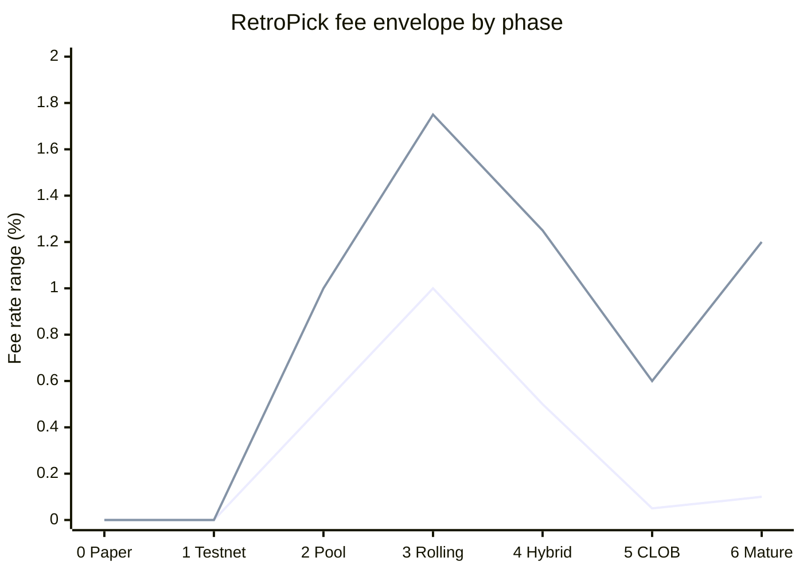
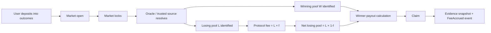
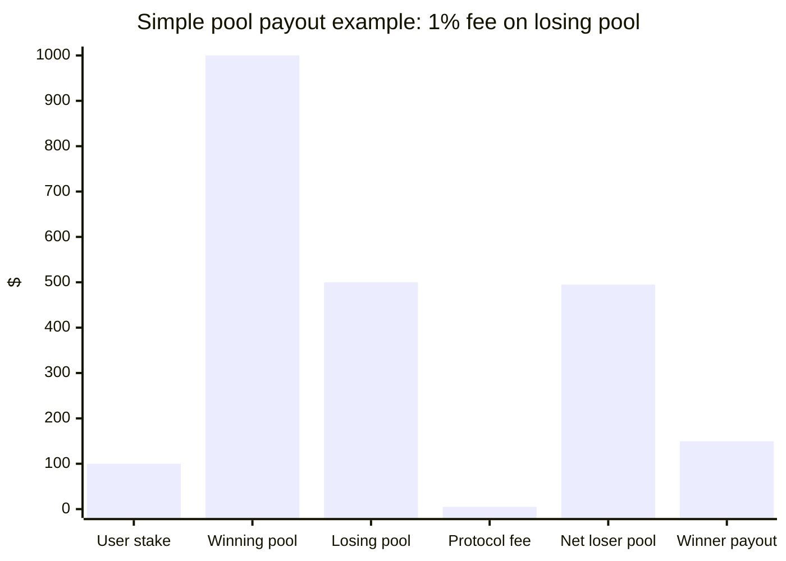
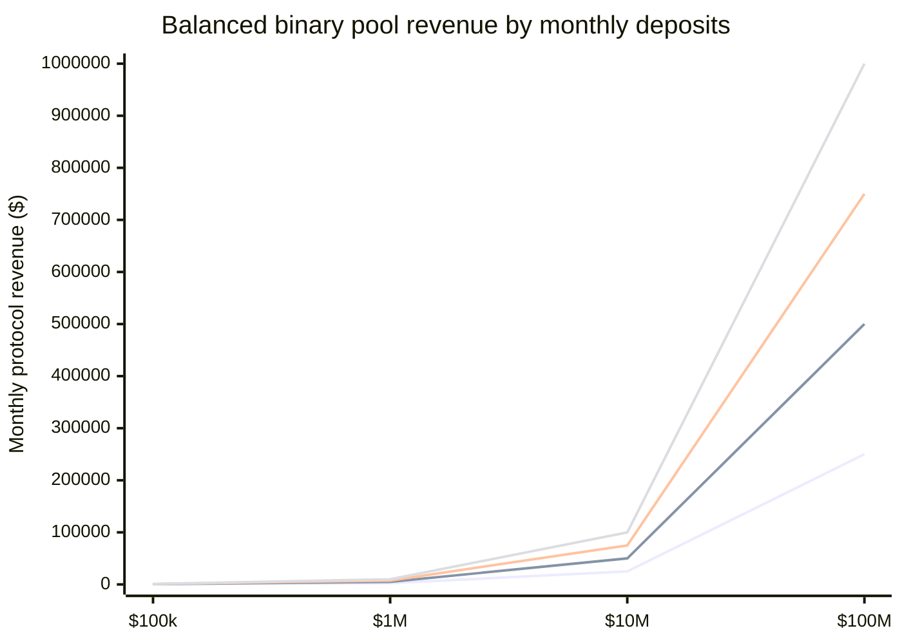
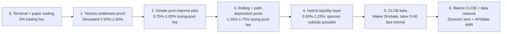
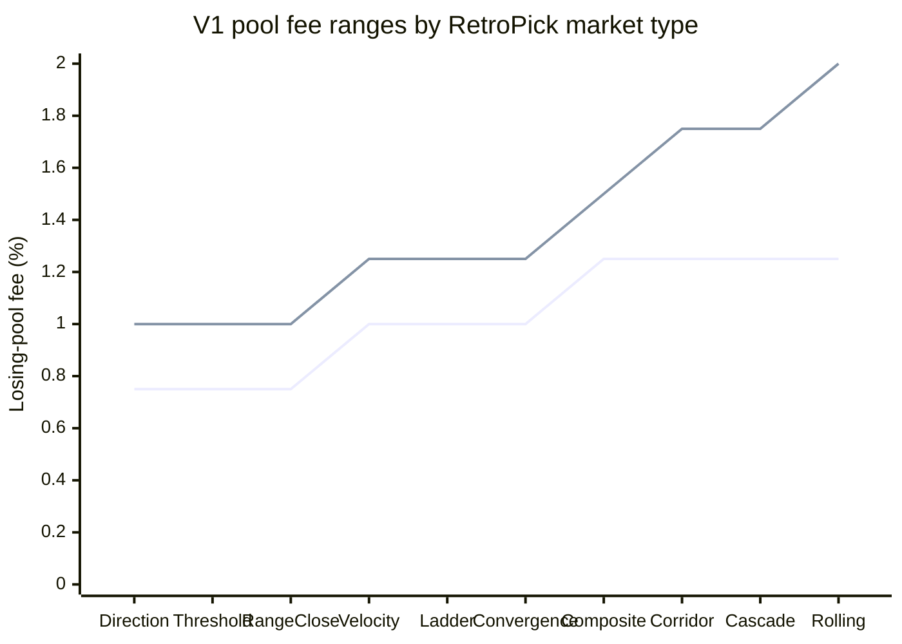
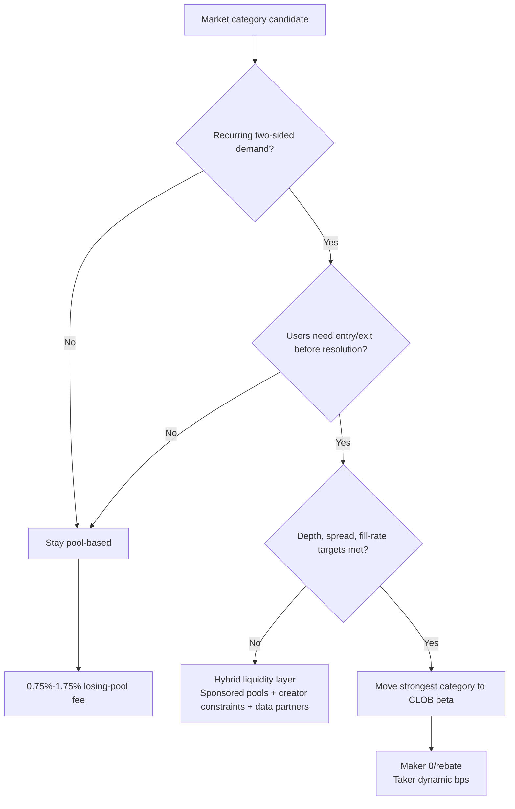
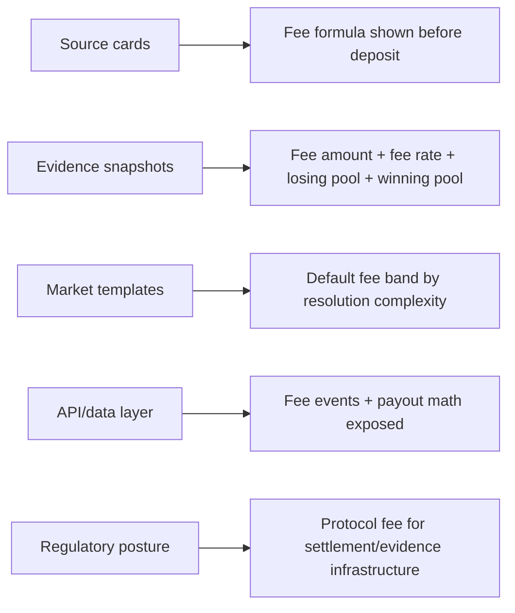

# RETROPICK

# Fee Strategy from Simple Pool Contracts to CLOB

**Protocol-engineering, liquidity, and monetization roadmap for phased market design**  
RetroPick | deterministic event-risk markets | fee strategy draft | June 2026

---

## Fee envelope by phase

**Series order:** first line = lower bound, second line = upper bound.



> **Core recommendation**  
> RetroPick should launch pool-based markets with a **0.75%–1.00% fee on the losing pool**, **no entry fee**, **no claim fee**, **no withdrawal fee**, and **no visible winner tax**. This produces an effective gross fee of roughly **0.375%–0.50%** in a balanced binary pool while preserving a clean user promise: **100% of the stake enters the pool**.

---

## 1. Executive summary

The uploaded RetroPick product document frames the product as deterministic, evidence-first event-risk infrastructure with nine structured market types, source cards, evidence snapshots, and an **open → lock → resolve → claim** lifecycle. This fee roadmap keeps that product thesis intact while moving from paper trading to pool contracts, rolling markets, hybrid liquidity, and eventually a CLOB.

The first real-money protocol should not copy a CLOB fee model. A simple pool has no AMM slippage and no bid/ask spread, but it still has user costs: capital lock, oracle/resolution risk, event ambiguity risk, and opportunity cost. The cleanest early fee is therefore taken only after settlement from the losing pool.

The strategic objective is not maximum fee extraction. The objective is repeat usage, trust, and enough protocol revenue to fund resolution infrastructure, indexers, evidence snapshots, support, audits, and future liquidity programs.

| Decision | Recommended default | Reason |
|---|---|---|
| Fee source | Losing pool after resolution | Simple, deterministic, invisible to entry UX, no winner claim shock. |
| Launch fee | 0.75%–1.00% of losing pool | Competitive effective fee while still funding protocol operations. |
| Entry fee | 0% | Keeps the promise that 100% of stake enters the market. |
| Claim fee | 0% | Avoids user anger at the moment of winning. |
| Withdrawal fee | 0% | Do not tax exits; withdrawal fees hurt trust. |
| Creator fee | 0% at first; later 0.10%–0.25% from protocol fee share | Avoids spam and does not worsen user pricing early. |
| CLOB future | 0 bps maker / 5–60 bps taker normal, higher only for short-duration | Aligns with liquidity-first exchange economics. |

---

## 2. Market benchmark: what fees say about product design

Public prediction markets generally avoid a single large flat fee. The pattern is dynamic, probability-sensitive, and liquidity-aware: takers pay more near uncertainty, makers are protected or rebated, and short-duration/high-frequency categories can tolerate higher fees only when there is demand.

| Platform/model | Observed public fee pattern | Lesson for RetroPick |
|---|---|---|
| Polymarket CLOB | Taker fees vary by share price and are symmetric around 50% probability; maker rebates are funded by taker fees. | Use future CLOB fees to subsidize liquidity, not just maximize treasury revenue. |
| Opinion.Trade | Dynamic fee curve: lower near 0%/100%, higher around uncertain probabilities. | Event risk should influence fee level, especially for short-duration crypto markets. |
| Kalshi | Fee schedule lists taker fees per 100 contracts; fees are small at edges and higher around uncertain pricing. | A credible market should make fees feel proportional to potential upside and uncertainty. |
| RetroPick simple pool | No AMM slippage and no order-book spread, but funds are locked until resolution. | Charge less than a sportsbook hold, and make the protocol take transparent and deterministic. |

> **Key interpretation**  
> A pool-based protocol can charge a settlement fee, but it should not look like gambling rake. The fee should fund deterministic resolution, evidence snapshots, audits, dispute handling, data infrastructure, and later liquidity incentives.

---

## 3. Simple pool contract economics

RetroPick V1 pool markets should use pari-mutuel settlement. Users deposit into outcomes. When the market locks, deposits stop. When the market resolves, all non-winning outcome pools become the losing pool. The protocol takes a fee from that losing pool, and the remaining losing pool is distributed to winners proportional to winning stake.

### Pool lifecycle flow



| Variable | Meaning |
|---|---|
| W | Total winning pool |
| L | Total losing pool, or sum of all non-winning pools in multi-outcome markets |
| f | Protocol fee rate applied to losing pool |
| s_i | User i winning stake |
| Fee | L × f |
| Net losing pool | L × (1 - f) |
| User payout | s_i + (s_i / W) × L × (1 - f) |

### Simple pool payout example: 1% fee on losing pool



### Why losing-pool fees beat entry fees for RetroPick

| Fee model | Pros | Cons | Recommendation |
|---|---|---|---|
| Entry fee | Very easy accounting; predictable treasury revenue. | Hurts the product promise because user sees stake reduced immediately. | Avoid at launch. |
| Claim fee | Only winners pay visibly. | Creates anger at the best UX moment; can feel like hidden tax. | Avoid. |
| Winner-profit fee | Good marketing: no fee unless you win. | Requires individual basis/profit accounting; harder for multi-outcome templates. | Possible later, not V1. |
| Losing-pool fee | Simple formula, deterministic, transparent, no entry/claim friction. | Revenue depends on resolved losing pools, not raw deposits. | Best V1 default. |

---

## 4. What fee is actually competitive?

For a binary pool, a **1.00% fee on the losing pool** is not the same as a **1.00% fee on total deposits**. In a balanced market, the losing pool is roughly half of the total pool, so the effective gross fee is roughly **0.50% of deposits**. This is why **1.00% of losing pool** is a reasonable launch default, while **2.00%** should be reserved for stronger demand or higher operational risk.

| Fee on losing pool | Effective fee if pools are 50/50 | Strategic use |
|---|---|---|
| 0.00% | 0.00% of total pool | Paper trading, sponsored markets, design partner demos. |
| 0.50% | 0.25% of total pool | Aggressive growth launch or first real-money pilot. |
| 0.75% | 0.375% of total pool | Best first production default if trust is more important than revenue. |
| 1.00% | 0.50% of total pool | Best standard default after early traction. |
| 1.50% | 0.75% of total pool | Complex, path-dependent, or rolling markets. |
| 2.00% | 1.00% of total pool | Only after clear demand; not the default launch fee. |

### Balanced binary pool revenue: losing pool is ~50% of deposits

**Series order:** 0.5%, 1.0%, 1.5%, 2.0% fee on losing pool.



---

## 5. Phase-by-phase fee roadmap until CLOB

### Roadmap flow



| Phase | Product state | Fee strategy | Engineering reason | Business KPI before next phase |
|---|---|---|---|---|
| 0. Terminal + paper trading | Event discovery, source cards, evidence screens, paper positions. | Trading fee: 0%. Monetize only optional Pro/API later. | No custody and no settlement risk; focus on demand and comprehension. | Watchlists, repeat sessions, paper trade retention, source-card opens. |
| 1. Testnet settlement proof | Base Sepolia templates, open-lock-resolve-claim demos. | Simulated fee only: show 0.50%–1.00% losing-pool fee in UI sandbox. | Train users on payout math before mainnet. | Resolved demo markets, evidence completeness, indexer reliability. |
| 2. Simple pool mainnet pilot | Objective crypto/macro markets; binary and simple multi-outcome only. | 0.75% losing-pool fee for first pilot; raise to 1.00% after traction. | No entry/claim/withdrawal fees; keep accounting minimal and auditable. | Repeat deposits, claim success, no unresolved oracle incidents. |
| 3. Rolling and path-dependent pools | Short-duration crypto markets, corridor/cascade/velocity markets. | 1.25%–1.75% losing-pool fee; 0.25% of fee can fund reserve/ops. | Higher monitoring, oracle precision, and dispute probability. | Market frequency, profitable unit economics, clear resolution SLA. |
| 4. Hybrid liquidity layer | Sponsored pools, market creator constraints, API/data partners. | 0.50%–1.25%; allow sponsors/creators to subsidize fees to 0%. | Use fee discounts to buy liquidity and distribution. | Design partners, market maker interest, recurring categories. |
| 5. CLOB beta | Order book for strongest categories only; pool markets remain for simple events. | Maker 0 bps or rebate. Taker 5–60 bps normal; 75–120 bps for ultra-short events. | CLOB liquidity needs makers; taker fees fund rebates and infrastructure. | Depth, spread, fill rate, maker retention, cancel/replace load. |
| 6. Mature CLOB + data network | CLOB, API/data products, terminal, settlement-as-a-service. | Dynamic maker/taker tiers. Normal taker 10–30 bps; short-duration 50–120 bps. Data/API ARR becomes second revenue line. | Do not depend only on trading fees; data revenue reduces event-cycle volatility. | ARR, institutional API use, recurring market categories, compliance path. |

---

## 6. Fee by RetroPick market type

The uploaded RetroPick documentation defines nine canonical market types. Fees should follow operational complexity, not marketing complexity. Simple final-value markets should be cheapest. Path-dependent and multi-condition markets should be higher because they require more resolution monitoring and evidence integrity.

**Series order:** first line = lower bound, second line = upper bound.



| Market type | V1 pool fee on losing pool | Why |
|---|---|---|
| Direction | 0.75%–1.00% | Simplest event; final comparison only. |
| Threshold | 0.75%–1.00% | Easy to resolve if source and timestamp are clean. |
| RangeClose | 0.75%–1.00% | Multi-outcome but still final-value only. |
| Velocity | 1.00%–1.25% | Requires start/end normalization and percent-change math. |
| Ladder | 1.00%–1.25% | Multiple tiers; more user education and payout explanation. |
| Convergence | 1.00%–1.25% | Two data sources; basis/spread edge cases. |
| Composite | 1.25%–1.50% | Multiple conditions; more fallback and evidence checks. |
| Corridor | 1.25%–1.75% | Path-dependent; requires continuous or sampled monitoring. |
| Cascade | 1.25%–1.75% | First-level break logic; high dispute risk if data granularity is weak. |
| Rolling market | 1.25%–2.00% | High frequency, recurring operations, stronger bot/latency pressure. |

---

## 7. Protocol-engineering implementation notes

| Component | Implementation decision |
|---|---|
| Fee parameters | Store per template or per market instance: `feeBps`, `feeRecipient`, `creatorFeeShareBps`, `reserveShareBps`, `sponsorSubsidyBps`. |
| Fee cap | Hard cap V1 at 200 bps of losing pool; governance cannot set above cap without contract upgrade or timelock. |
| Payout accounting | Use integer math with fixed denominator such as 10,000 bps; handle dust with deterministic rounding to treasury or final claimer. |
| Multi-outcome support | `losingPool = totalPool - winningPool`. Fee is taken once from aggregate losingPool, not separately per losing outcome. |
| Refund path | If unresolved/refunded, protocol fee must be 0. Users receive principal back pro rata; no fee for oracle failure. |
| Dispute/fallback path | Freeze fee extraction until outcome is final; evidence snapshot must include source, timestamp, value, parser version, and outcome mapping. |
| Upgrade safety | Fee changes should not apply to already-open markets unless explicitly shown at market creation. Market fee must be immutable after open. |
| Event logs | Emit `FeeAccrued(marketId, feeAsset, feeAmount, feeBps, losingPool, winningPool)` for transparent analytics. |

### Suggested Solidity-style pseudocode

```solidity
fee = losingPool * feeBps / 10_000;
netLosingPool = losingPool - fee;
profitShare = userStake * netLosingPool / winningPool;
payout = userStake + profitShare;
emit FeeAccrued(marketId, fee, feeBps, losingPool, winningPool);
```

---

## 8. Transition from pool to CLOB

Do not move all markets to a CLOB. Pools are better for simple casual events and low-liquidity market creation. CLOBs are better once a category has repeat traders, enough depth, and enough volume to justify maker incentives and matching-engine complexity.

### Pool versus CLOB decision flow



| Trigger | Stay pool-based | Move to CLOB |
|---|---|---|
| Liquidity | Low or bursty participation. | Repeat market category with recurring two-sided demand. |
| Market complexity | Simple outcome payout; users accept pari-mutuel odds. | Users need entry/exit before resolution and tighter pricing. |
| User behavior | Event participation and social sharing. | Active trading, hedging, arbitrage, market making. |
| Infra | Settlement-focused contracts and indexer. | Matching engine, order management, websockets, maker program, risk controls. |
| Fee model | 0.75%–1.75% of losing pool. | Maker 0/rebate; taker dynamic bps. |

### CLOB fee design once RetroPick has depth

| CLOB category | Maker fee | Taker fee | Notes |
|---|---|---|---|
| Normal crypto/macro events | 0 bps to -2 bps rebate | 10–30 bps | Use taker fees to fund maker rewards and evidence ops. |
| New or thin markets | -2 to -5 bps rebate for approved makers | 20–50 bps | Buy initial liquidity, but cap rebates by spread/depth quality. |
| Short-duration rolling markets | 0 bps to -3 bps rebate | 50–120 bps | Higher infra and latency/arb pressure. |
| Institutional/API flow | Custom tier | Custom tier | Can be priced via monthly minimum or API package. |

---

## 9. Revenue and unit-economics targets

| Monthly total pool deposits | 0.75% losing-pool fee, balanced market | 1.00% losing-pool fee, balanced market | 1.50% losing-pool fee, balanced market |
|---|---:|---:|---:|
| $100k | $375 | $500 | $750 |
| $1M | $3,750 | $5,000 | $7,500 |
| $10M | $37,500 | $50,000 | $75,000 |
| $100M | $375,000 | $500,000 | $750,000 |

**Series order:** 0.75%, 1.00%, 1.50% fee on losing pool.

```mermaid
xychart-beta
    title "Revenue target by monthly total pool deposits"
    x-axis ["$100k", "$1M", "$10M", "$100M"]
    y-axis "Monthly protocol revenue ($)" 0 --> 750000
    bar [375, 3750, 37500, 375000]
    bar [500, 5000, 50000, 500000]
    bar [750, 7500, 75000, 750000]
```



> **Strategic revenue target**  
> If RetroPick reaches **$10M monthly pool deposits**, a **1.00% fee on the losing pool** produces about **$50k/month** in a balanced binary mix. That is enough to fund a small serious team and infra, but the path to that volume depends more on recurring event categories than on the fee rate.

---

## 10. Governance, safety, and user trust rules

Market fee must be immutable once a market is created. Users should never discover that fee terms changed after they deposited.

Refunded markets should have zero protocol fee. If the protocol fails to resolve or the source becomes unavailable, the protocol should not earn revenue from that failure.

The UI should show both the headline fee and the effective gross fee estimate. Example: **1.00% of losing pool; roughly 0.50% of total deposits if pools are balanced.**

Fees should fund named buckets: resolution operations, evidence/indexing, security/audits, treasury runway, and later maker incentives. This turns the fee into trust infrastructure instead of rake.

| Rule | V1 policy |
|---|---|
| Max fee cap | 200 bps of losing pool hard cap. |
| Default launch fee | 75 bps, with move to 100 bps after traction. |
| Market creator fee | 0 at launch; later paid from protocol fee, not extra user fee. |
| Reserve/insurance share | Optional 10%–25% of protocol fee, not separate from user fee. |
| Fee transparency | Show formula and sample payout before deposit. |
| Upgrade control | Timelock + public changelog for fee changes; market-level fee is immutable. |

---

## 11. One-page mentor answer

| Question | Answer |
|---|---|
| What fee should RetroPick charge at launch? | 0.75%–1.00% of the losing pool after resolution. |
| Why not 2%? | 2% is not crazy, but it is too high as a default before trust, repeat liquidity, and event categories are proven. |
| Why losing pool? | It preserves the UX promise that 100% of stake enters the pool and avoids entry/claim friction. |
| When can fees increase? | For rolling, path-dependent, high-frequency, or operationally expensive markets. |
| When should RetroPick become CLOB? | Only when specific categories show recurring two-sided demand and users need to enter/exit before resolution. |
| How does CLOB pricing change? | Maker 0/rebate; taker dynamic bps. Use taker fees to fund liquidity and infrastructure. |
| What is the strongest strategic positioning? | Transparent low-fee pool markets first; evidence-first resolution; CLOB only after liquidity proves itself. |

---

## 12. How this fits the current RetroPick product docs

This strategy extends the current product document rather than replacing it. The uploaded document already positions RetroPick as an evidence-first event-risk market platform, defines the product stack, explains the **open → lock → resolve → claim** lifecycle, and lists the nine canonical market types. The fee strategy should therefore be framed as another part of deterministic product trust: clear fee source, immutable fee terms, no hidden entry/claim tax, and auditable revenue events.



| Existing RetroPick element | Fee implication |
|---|---|
| Source cards | Must display the fee formula alongside source/timestamp/fallback rules. |
| Evidence snapshots | Should include fee amount, fee rate, losing pool, winning pool, and distributable pool. |
| Market templates | Each template can have a default fee band based on resolution complexity. |
| API/data layer | Expose fee events and payout math for third-party analytics. |
| Regulatory posture | Avoid sportsbook-style language; call it protocol fee for settlement/evidence infrastructure. |

---

## 13. Sources and notes

- Uploaded file: `RetroPick_Product_Docs.docx`, especially the product definition, product stack, lifecycle, nine market types, roadmap, and business model sections.
- Polymarket Documentation: Fees and Maker Rebates Program — taker fees vary by share price and maker rebates are funded by taker fees.
- Opinion.Trade Documentation: Fees — dynamic fee curve adjusts based on market probability and lower fees near extremes.
- Kalshi Fee Schedule — public schedule lists fee ranges per 100 contracts for most markets.
- Protocol assumption: RetroPick V1 uses simple pari-mutuel pool contracts, not AMM slippage and not order-book spread.


---

## IDE rendering note

The previous version used Mermaid `xychart-beta` commands such as:

```mermaid
line "Lower bound" [0, 0, 0.5]
```

Some Cursor/VS Code Mermaid renderers parse the axis but ignore labeled `line`/`bar` series inside `xychart-beta`, which makes the chart area appear loaded while the data stays blank/zero. This version keeps the same Markdown/Mermaid format but changes those series to the renderer-compatible form:

```mermaid
line [0, 0, 0.5]
```

Legends are written as Markdown text above the charts instead of embedded into the `xychart-beta` series command.
