# RetroPick — Unified System Architecture

> **Canonical cross-stack reference.** Drill-down docs: [backend](backend/README.md), [contracts](../package/prediction-v2/currentSmartContract.md), [ABI map](abi-map.md), [pipeline](pipeline/README.md). Machine-readable companions: [.AllArchitecture.json](.AllArchitecture.json) (summary registry), [knowledge-graph.json](knowledge-graph.json) (full graph).

---

## 1. Executive Summary

**RetroPick V1** is an on-chain prediction market engine on **Base Sepolia** (`chainId: 84532`) with an off-chain projection and operations stack. One upgradeable **MarketEngine** proxy hosts many **templates** (markets); each template runs **epochs** (rounds) through open → lock → resolve → claim, with settlement driven by Chainlink-family oracles and optional trusted reporters.

| Principle | Implementation |
|-----------|----------------|
| On-chain authoritative settlement | `MarketEngineDispatcher` proxy + shared `MarketEngineState` storage |
| Fast reads for UX | Go indexer → Postgres projections; API serves indexed state by default |
| Event-driven freshness | Durable `realtime_events` + Postgres `NOTIFY` → WebSocket fanout |
| Modular upgradeability | UUPS proxy; hybrid dispatcher (root-owned hot paths + delegatecall modules) |
| Operator safety | Separate ops dashboard; prepared txs; keeper automation with audit trail |

**Primary deployment (Base Sepolia)**

| Role | Address |
|------|---------|
| MarketEngine proxy (app entrypoint) | `0x1ed89defc8fbcbd512c562b148868ffdc778018a` |
| Implementation | `0xf8b69b881fb35feb804cfec761fdeb88c4e45ef1` |
| Stake token (mSTK, 18 dec) | `0xb7f49377af6adbef64f513cf04dbdac9d0af01b1` |
| TokenFaucet (testnet) | `0xf6c1b6bddd06972f08772de7954432e10c853231` |

Registry source: [`packages/contracts/registry.base-sepolia.json`](../packages/contracts/registry.base-sepolia.json).

---

## 2. Classification Taxonomy

Every system component is tagged with four dimensions:

| Dimension | Allowed values |
|-----------|----------------|
| **Layer** | `onchain`, `backend`, `frontend`, `shared`, `infrastructure`, `ops-tooling` |
| **Feature domain** | `market-lifecycle`, `trading-settlement`, `oracle-resolution`, `yield-treasury`, `indexing-projections`, `realtime-ux`, `funding-balances`, `operator-governance`, `auth-security`, `deployment-devops` |
| **Goal** | One-sentence purpose (why it exists) |
| **Role** | `canonical` (source of truth), `derived` (projection), `orchestrator` (coordinates), `consumer` (reads/acts), `utility` (support) |

### 2.1 Feature Domains (goals at a glance)

| Domain | System goal |
|--------|---------------|
| `market-lifecycle` | Define templates, advance epochs, rolling automation |
| `trading-settlement` | User deposits, side switches, resolution, claims |
| `oracle-resolution` | Price/rate/event feeds, checkpoints, resolver math |
| `yield-treasury` | Optional yield routing, fee reserves, treasury withdrawal |
| `indexing-projections` | Chain logs → durable relational read models |
| `realtime-ux` | Sub-second UI updates without polling-only UX |
| `funding-balances` | Cross-chain deposit abstraction and internal balances |
| `operator-governance` | Ops dashboard, incidents, visibility, prepared governance |
| `auth-security` | Wallet auth, sessions, rate limits, wallet binding |
| `deployment-devops` | Compose, CI, retro CLI, contract deploy scripts |

---

## 3. System-Wide Knowledge Graph

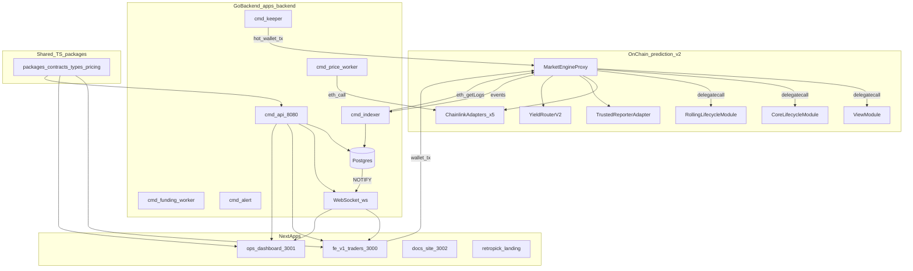

---

## 4. Component Inventory

### 4.1 On-chain (`package/prediction-v2`)

| ID | Component | Domain | Role | Goal | Path |
|----|-----------|--------|------|------|------|
| `onchain.engine.proxy` | MarketEngine UUPS proxy | market-lifecycle | canonical | Single protocol entrypoint for all templates | `src/engine/MarketEngineDispatcher.sol` |
| `onchain.engine.state` | MarketEngineState | market-lifecycle | canonical | Shared storage layout for dispatcher + modules | `src/engine/MarketEngineState.sol` |
| `onchain.engine.interface` | IMarketEngine | market-lifecycle | utility | External ABI surface for apps and keeper | `src/engine/IMarketEngine.sol` |
| `onchain.mod.admin` | MarketEngineAdminModule | market-lifecycle | orchestrator | Protocol config, yield, oracle admin, fee withdrawal | `src/engine/modules/MarketEngineAdminModule.sol` |
| `onchain.mod.userOps` | MarketEngineUserOpsClaimsModule | trading-settlement | orchestrator | Deposits, switches, claims (root-owned on dispatcher) | `src/engine/modules/MarketEngineUserOpsClaimsModule.sol` |
| `onchain.mod.core` | MarketEngineCoreLifecycleModule | market-lifecycle | orchestrator | Manual epoch open/lock/resolve, template upsert | `src/engine/modules/MarketEngineCoreLifecycleModule.sol` |
| `onchain.mod.rolling` | MarketEngineRollingLifecycleModule | market-lifecycle | orchestrator | Pancake-style rolling rounds | `src/engine/modules/MarketEngineRollingLifecycleModule.sol` |
| `onchain.mod.view` | MarketEngineViewModule | market-lifecycle | derived | Read-only market/epoch/position/operator views | `src/engine/modules/MarketEngineViewModule.sol` |
| `onchain.oracle.chainlink` | ChainlinkAdapter | oracle-resolution | canonical | AggregatorV3 → e8 price; L2 sequencer check | `src/adapters/ChainlinkAdapter.sol` |
| `onchain.oracle.rate` | RateAdapter | oracle-resolution | canonical | CHAINLINK_RATE feeds | `src/oracle/RateAdapter.sol` |
| `onchain.oracle.smartdata` | SmartDataAdapter | oracle-resolution | canonical | CHAINLINK_SMARTDATA feeds | `src/oracle/SmartDataAdapter.sol` |
| `onchain.oracle.macro` | MacroAdapter | oracle-resolution | canonical | CHAINLINK_MACRO feeds | `src/oracle/MacroAdapter.sol` |
| `onchain.oracle.equity` | EquityAdapter | oracle-resolution | canonical | CHAINLINK_EQUITY feeds | `src/oracle/EquityAdapter.sol` |
| `onchain.oracle.reporter` | TrustedReporterAdapter | oracle-resolution | canonical | EIP-712 lock/resolve/OHLC for Corridor/Cascade | `src/oracle/TrustedReporterAdapter.sol` |
| `onchain.yield.router` | YieldRouterV2 | yield-treasury | orchestrator | Aave aToken / ERC-4626 yield paths | `src/yield/YieldRouterV2.sol` |
| `onchain.lib.types` | MarketTypes | market-lifecycle | utility | Enums, structs, 9 market types | `src/types/MarketTypes.sol` |
| `onchain.lib.math` | MarketMath | trading-settlement | utility | Pool math, fees, vault accounting | `src/math/MarketMath.sol` |
| `onchain.lib.resolvers` | Resolvers | oracle-resolution | utility | Pure winning-outcome per market type | `src/logic/Resolvers.sol` |
| `onchain.lib.settlement` | SettlementLogic | trading-settlement | utility | Settlement and liability computation | `src/logic/SettlementLogic.sol` |
| `onchain.mock.faucet` | TokenFaucet | deployment-devops | utility | Testnet stake mint with cooldown + EIP-712 relay | `src/mocks/faucet/TokenFaucet.sol` |
| `onchain.deploy.matrix` | ScriptSelectorMatrix | deployment-devops | utility | Wire 28 delegated selectors to modules | `script/ScriptSelectorMatrix.sol` |

**Market types (9):** Direction, Threshold, RangeClose, Velocity, Ladder, Convergence, Composite, Corridor, Cascade.

**Access control**

| Role | Capabilities |
|------|--------------|
| `admin` | Upgrades, pause, templates, oracle config, yield router, module wiring, `initializeMarket`, fee emergency |
| `workerAuthority` | Keeper: open/lock/resolve epochs, rolling ticks |
| `treasury` | `withdrawFees` (+ admin) |
| Deposit executors | `depositToSideFor` (relayed deposits) |

**Selector routing:** 28 selectors delegatecall to View (13), CoreLifecycle (8), or RollingLifecycle (7) modules. Admin, user ops, claims, UUPS, and module registry are **root-owned** on the dispatcher. See `ScriptSelectorMatrix.sol`.

### 4.2 Backend (`apps/backend`)

| ID | Component | Domain | Role | Goal | Path |
|----|-----------|--------|------|------|------|
| `backend.bin.api` | cmd/api | realtime-ux | orchestrator | HTTP REST + WebSocket + embedded funding workers | `cmd/api/main.go` |
| `backend.bin.indexer` | cmd/indexer | indexing-projections | orchestrator | Ingest MarketEngine logs → projections | `cmd/indexer/main.go` |
| `backend.bin.keeper` | cmd/keeper | market-lifecycle | orchestrator | Execute scheduled lifecycle txs | `cmd/keeper/main.go` |
| `backend.bin.priceworker` | cmd/price-worker | oracle-resolution | orchestrator | Poll Chainlink feeds → candles + health | `cmd/price-worker/main.go` |
| `backend.bin.fundingworker` | cmd/funding-worker | funding-balances | orchestrator | Match settlement USDC → credit balances | `cmd/funding-worker/main.go` |
| `backend.bin.alert` | cmd/alert | operator-governance | consumer | Webhook dispatch for open incidents | `cmd/alert/main.go` |
| `backend.bin.reporter` | cmd/reporter | oracle-resolution | utility | Sign TrustedReporter EIP-712 payloads | `cmd/reporter/main.go` |
| `backend.bin.migrator` | cmd/migrator | deployment-devops | utility | Apply embedded SQL migrations | `cmd/migrator/main.go` |
| `backend.mod.api` | internal/api | auth-security | consumer | Handlers: auth, markets, user, ops, tx, funding | `internal/api/` |
| `backend.mod.indexer` | internal/indexer | indexing-projections | orchestrator | Log decode, projection writes, reorg rewind | `internal/indexer/indexer.go` |
| `backend.mod.keeper` | internal/keeper | market-lifecycle | orchestrator | Job claim, preflight, execute, audit | `internal/keeper/` |
| `backend.mod.funding` | internal/funding | funding-balances | orchestrator | LI.FI provider, poller, matcher, credit | `internal/funding/` |
| `backend.mod.marketdata` | internal/marketdata | oracle-resolution | derived | Candle storage, chart realtime envelopes | `internal/marketdata/` |
| `backend.mod.priceworker` | internal/priceworker | oracle-resolution | orchestrator | Feed polling loop | `internal/priceworker/` |
| `backend.mod.realtime` | internal/realtime | realtime-ux | canonical | Durable envelope insert + NOTIFY | `internal/realtime/` |
| `backend.mod.pglisten` | internal/pglisten | realtime-ux | orchestrator | LISTEN bridge → wshub | `internal/pglisten/` |
| `backend.mod.wshub` | internal/wshub | realtime-ux | orchestrator | In-memory WS fanout + subscriptions | `internal/wshub/` |
| `backend.mod.ethops` | internal/ethops | deployment-devops | utility | Failover RPC, ABI embed, live eth_call | `internal/ethops/` |
| `backend.mod.launchboard` | internal/launchboard | operator-governance | utility | Calldata prep from market catalog JSON | `internal/launchboard/` |
| `backend.mod.registry` | internal/registrydata | deployment-devops | canonical | Embedded contract address registry | `internal/registrydata/registry.json` |
| `backend.db.chain_events` | chain_events table | indexing-projections | canonical | Append-only decoded log history | `sql/schema.sql` |
| `backend.db.templates` | templates table | market-lifecycle | derived | Template projection | `sql/schema.sql` |
| `backend.db.epochs` | epochs table | market-lifecycle | derived | Epoch lifecycle projection | `sql/schema.sql` |
| `backend.db.keeper_schedule` | keeper_schedule | market-lifecycle | derived | Due lifecycle jobs | `sql/schema.sql` |
| `backend.db.realtime_events` | realtime_events | realtime-ux | canonical | Monotonic WS replay stream | `sql/schema.sql` |
| `backend.db.user_balances` | user_balances | funding-balances | derived | Internal USDC ledger | `sql/schema.sql` |

Framework: **Go 1.24**, **chi** router, **pgx** + **sqlc**, **go-ethereum**. No Redis; Postgres is the durable system of record.

### 4.3 Frontend

| ID | Component | Domain | Role | Goal | Path |
|----|-----------|--------|------|------|------|
| `frontend.fe-v1.app` | fe-v1 user app | trading-settlement | consumer | Wallet-first market trading UX | `apps/fe-v1/` |
| `frontend.fe-v1.router` | React Router SPA | realtime-ux | utility | Client routes inside Next shell | `apps/fe-v1/src/App.tsx` |
| `frontend.fe-v1.api` | retropickApi | realtime-ux | consumer | Typed REST client to Go API | `apps/fe-v1/src/lib/api/retropickApi.ts` |
| `frontend.fe-v1.ws` | useIndexerWebSocket | realtime-ux | consumer | WS subscribe + React Query invalidation | `apps/fe-v1/src/hooks/useIndexerWebSocket.ts` |
| `frontend.fe-v1.chain` | marketEngine.ts | trading-settlement | consumer | wagmi/viem contract hooks | `apps/fe-v1/src/lib/contracts/marketEngine.ts` |
| `frontend.fe-v1.trade` | ManualTradeCard | trading-settlement | consumer | Deposit/switch UI for manual epochs | `apps/fe-v1/src/features/manual-market/` |
| `frontend.fe-v1.markets` | MarketsAll / ChainMarketDetail | market-lifecycle | consumer | Market discovery and detail | `apps/fe-v1/src/views/` |
| `frontend.fe-v1.portfolio` | Portfolio | trading-settlement | consumer | Positions, claims, PnL summary | `apps/fe-v1/src/views/Portfolio.tsx` |
| `frontend.ops.app` | ops dashboard | operator-governance | consumer | Internal protocol operations UI | `apps/ops/` |
| `frontend.ops.prepare` | Prepare explorer | operator-governance | utility | Privileged tx preparation catalog | `apps/ops/src/app/prepare/` |
| `frontend.ops.live` | LiveOpsContext | operator-governance | consumer | Explicit live RPC refresh actions | `apps/ops/src/components/LiveOpsContext.tsx` |
| `frontend.docs` | docs site | deployment-devops | utility | Public MDX documentation | `apps/docs/` |
| `frontend.landing` | retropick-landing | deployment-devops | utility | Marketing + Supabase waitlist | `apps/retropick-landing/` |

**fe-v1 routes:** `/app/markets/all`, `/app/market/:templateId`, `/app/portfolio`, `/app/activity`, `/app/resolution`, `/app/chain-markets`.

**ops routes:** `/`, `/monitor`, `/templates`, `/launch`, `/prepare`, `/keeper`, `/oracle`, `/incidents`, `/visibility`, `/governance`, `/retrodeployer`.

### 4.4 Shared packages (`packages/`)

| ID | Package | Domain | Role | Goal |
|----|---------|--------|------|------|
| `shared.contracts` | @retropick/contracts | deployment-devops | canonical | Base Sepolia address registry |
| `shared.market-types` | @retropick/market-types | market-lifecycle | utility | TS mirrors of on-chain enums |
| `shared.event-core` | @retropick/event-core | realtime-ux | utility | Realtime envelope types + channel naming |
| `shared.pricing` | @retropick/pricing | trading-settlement | derived | Off-chain payout/switch-fee projections |
| `shared.resolution` | @retropick/resolution-core | oracle-resolution | derived | Off-chain resolution preview helpers |
| `shared.equivalence` | @retropick/equivalence-engine | oracle-resolution | utility | Feed/template equivalence comparison |
| `shared.chain` | @retropick/chain | deployment-devops | utility | ChainConfig + ChainReader interface |
| `shared.validators` | @retropick/validators | auth-security | utility | Input validation helpers |
| `shared.hyperliquid` | @retropick/hyperliquid | oracle-resolution | utility | Hyperliquid market data client types |

### 4.5 Infrastructure & ops-tooling

| ID | Component | Domain | Role | Goal | Path |
|----|-----------|--------|------|------|------|
| `infra.compose` | docker-compose.yml | deployment-devops | orchestrator | Local dev stack | `docker-compose.yml` |
| `infra.compose.prod` | docker-compose.production.yml | deployment-devops | orchestrator | Production stack + keeper/alert | `docker-compose.production.yml` |
| `ops.retro` | retro CLI | deployment-devops | orchestrator | Stack, deploy, market ops | `scripts/retro`, `bin/retro` |
| `ops.retrodeployer` | RETRODEPLOYER | deployment-devops | orchestrator | Contract deploy/smoke scripts | `scripts/RETRODEPLOYER` |
| `infra.ci` | GitHub Actions | deployment-devops | utility | pnpm + Go + Foundry CI | `.github/workflows/` |
| `infra.abi` | package/abi | deployment-devops | canonical | Published contract ABIs | `package/abi/` |

---

## 5. Smart Contracts — Architecture & Flows

**Canonical tree:** [`package/prediction-v2/`](../package/prediction-v2/).

### 5.1 Dispatcher pattern

The **MarketEngineDispatcher** is a UUPS upgradeable proxy implementation with hybrid routing:

- **Root-owned (direct bytecode):** `initialize`, UUPS upgrade, module registry, admin hot paths (`pauseProgram`, `setYieldRouter`, `initializeMarket`, `withdrawFees`), user paths (`depositToSide`, `switchSide`, `claim`, `claimMany`)
- **Delegated (fallback → delegatecall):** 28 lifecycle/view selectors wired via `ScriptSelectorMatrix.wireAll`

All paths share storage through `MarketEngineState` inheritance.

### 5.2 Flow: Cold deploy + module wiring

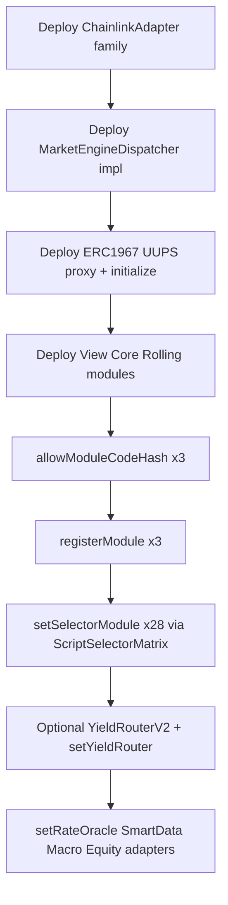

Scripts: `script/test/DeployTestnet.s.sol`, `script/production/DeployProduction.s.sol`.

### 5.3 Flow: Template creation

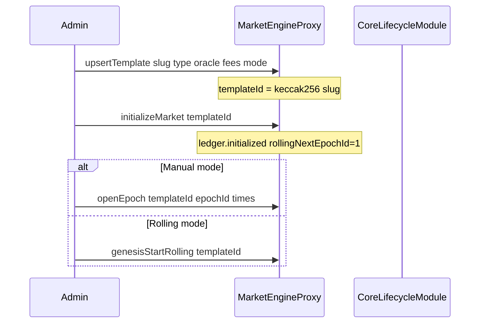

### 5.4 Flow: Manual epoch lifecycle

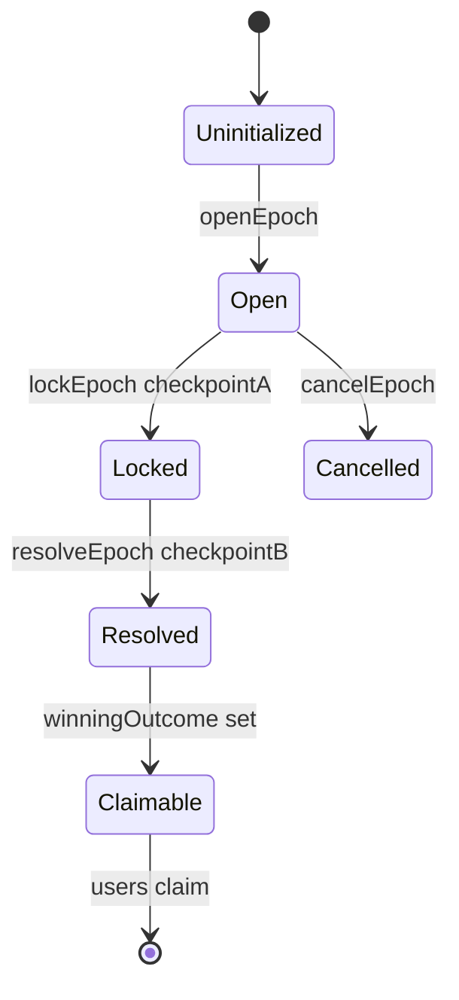

User ops during **Open:** `depositToSide`, `switchSide` (switch fee → fee vault). After **Resolved:** `claim` / `claimMany` from claims reserve.

### 5.5 Flow: Rolling epoch lifecycle

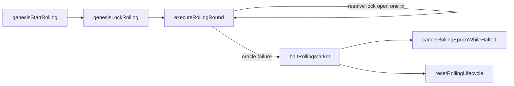

### 5.6 Flow: Oracle checkpoints

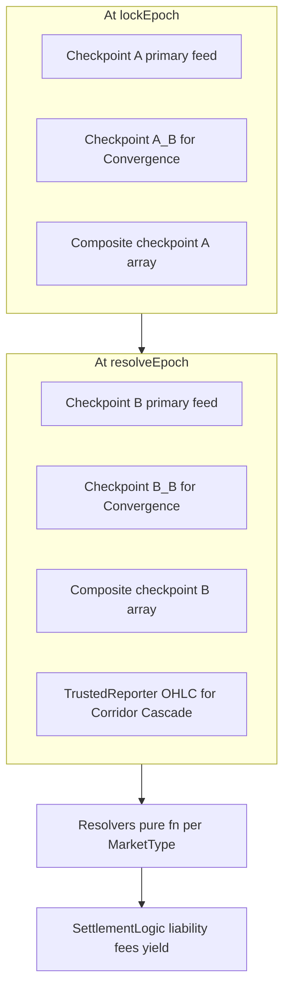

### 5.7 Flow: Fee, yield, treasury

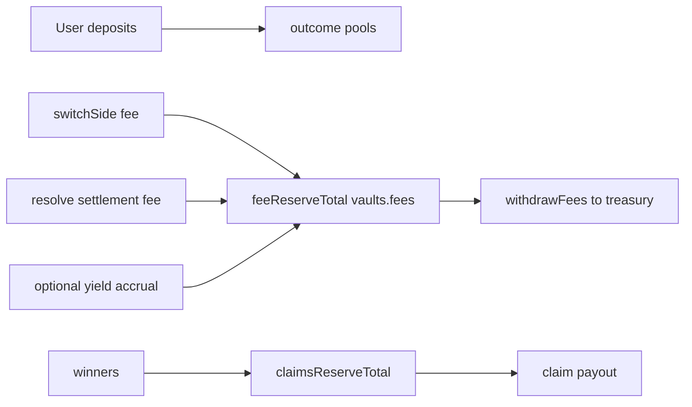

Deep reference: [`currentSmartContract.md`](../package/prediction-v2/currentSmartContract.md).

---

## 6. Backend — Architecture & Flows

**Source:** [`apps/backend/`](../apps/backend/), deep dive [`.dev/backend/README.md`](backend/README.md).

### 6.1 Process topology

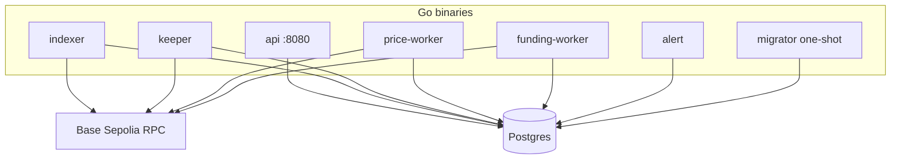

**Docker Compose (default dev):** postgres, migrator, api, indexer, price-worker, web (fe-v1), ops. Production adds funding-worker, keeper, alert.

### 6.2 Flow: Indexer sync loop

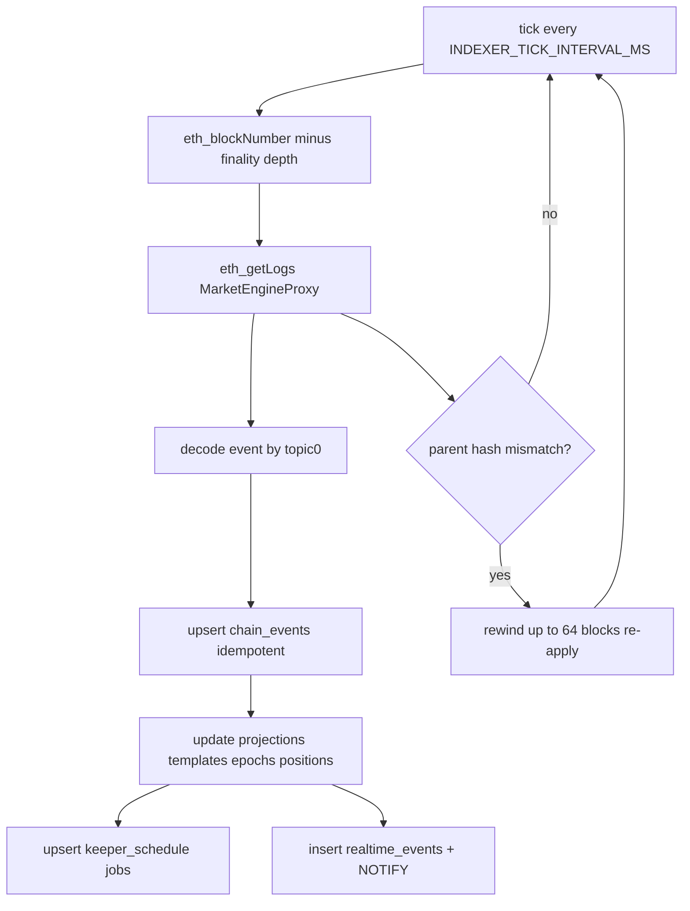

### 6.3 Flow: Event → projection map

| Event group | Key events | Projection targets |
|-------------|------------|-------------------|
| Template | `TemplateUpserted`, `MarketInitialized` | `templates`, `market_read_models` |
| Epoch | `EpochOpened`, `EpochLocked(V2)`, `EpochResolved(V2)`, `EpochCancelled` | `epochs`, `market_snapshots`, `keeper_schedule` |
| User | `PositionDeposited`, `SideSwitched`, `Claimed` | `user_position_outcomes`, `probability_points` |
| Rolling | `RollingGenesis*`, `RollingRoundExecuted`, `RollingHalted` | `ledgers`, `epochs`, `incidents` |
| Yield | `EpochYieldAccrued`, `YieldRouterDisabled` | operator projections, `incidents` |

Full map: [`.dev/pipeline/README.md`](pipeline/README.md).

### 6.4 Flow: Realtime WebSocket

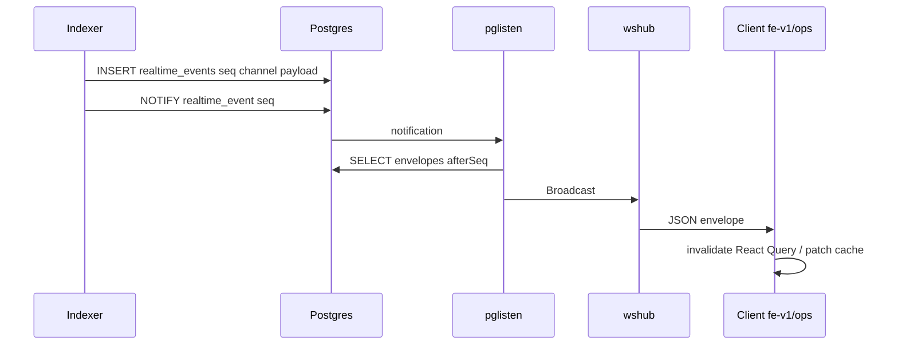

**WS channels:** `global:markets`, `market:{templateId}`, `epoch:{templateId}:{epochId}`, `oracle:*`, `chart:{feedId}`, `user:{wallet}`, `deposit:{intentId}`, `ops:*` (operator JWT).

### 6.5 Flow: Keeper automation

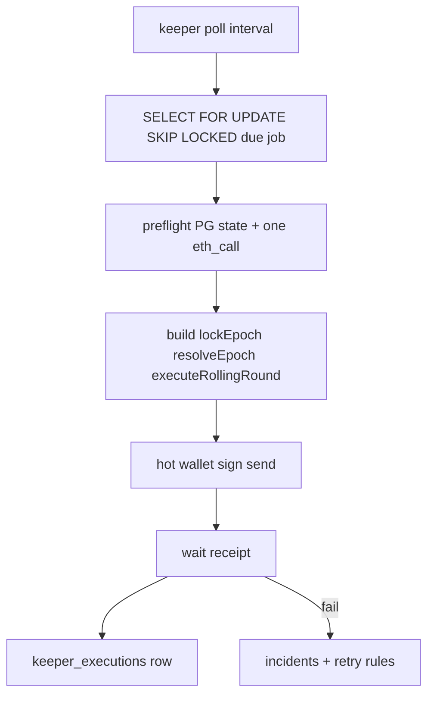

Enabled: `KEEPER_ENABLED=1`. Key: `KEEPER_PRIVATE_KEY_FILE`.

### 6.6 Flow: Funding abstraction

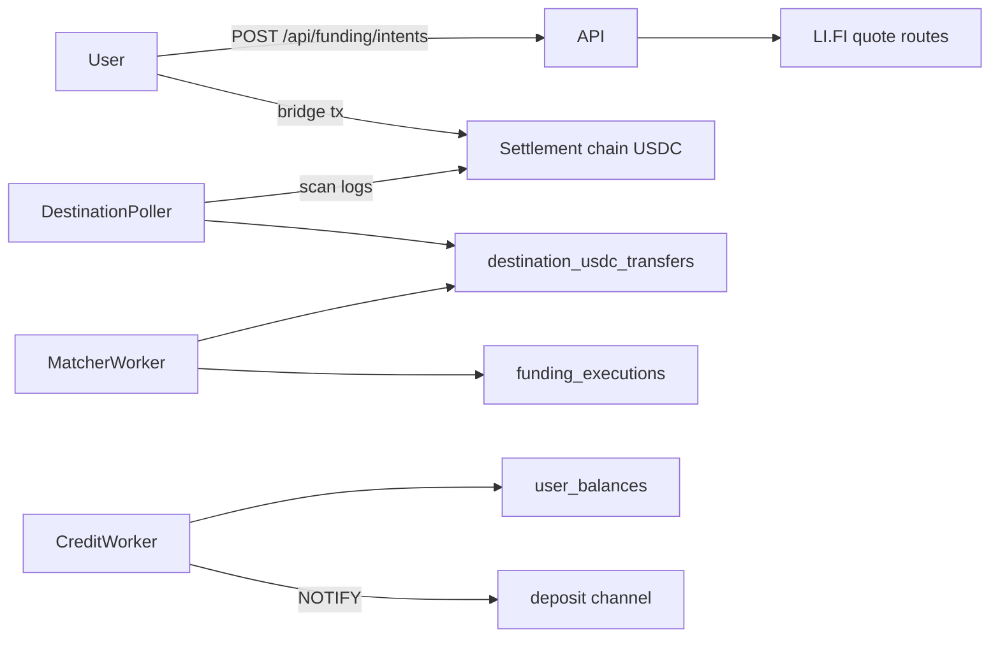

### 6.7 Flow: Authentication

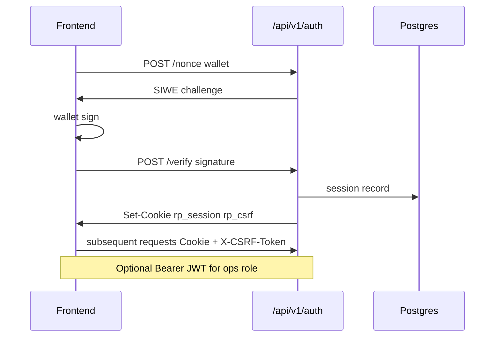

### 6.8 API surface (grouped)

| Group | Prefix | Purpose |
|-------|--------|---------|
| Health | `/api/v1/livez`, `/health`, `/readyz` | Liveness, registry summary, readiness |
| Auth | `/api/v1/auth/*` | SIWE nonce, verify, session, logout |
| Markets | `/api/v1/markets/*` | List, detail, chart, epochs, outcomes, probability |
| User | `/api/v1/user/*`, `/api/v1/me/*` | Balance, positions, claims, portfolio, watchlist, faucet |
| Tx prepare | `/api/v1/tx/*` | Prepare enter/switch/claim calldata; submit hash |
| Funding v1 | `/api/v1/funding/*` | Legacy intent flow |
| Funding v2 | `/api/funding/*` | Abstraction layer + LI.FI webhook |
| Ops | `/api/v1/ops/*` | Operator views, live RPC, prepare catalog, visibility |
| WebSocket | `/ws` | Realtime subscribe/resume/replay |

---

## 7. Frontend — Architecture & Flows

### 7.1 fe-v1 runtime composition

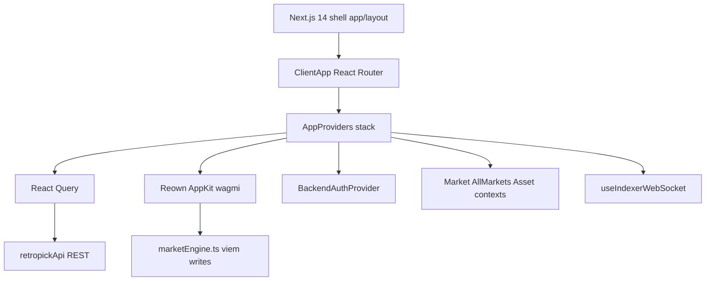

**Data rule:** Default UI reads indexed API state. Wallet submits txs directly to chain. UI waits for indexer confirmation via WS/API before treating state as final.

### 7.2 Flow: User read path

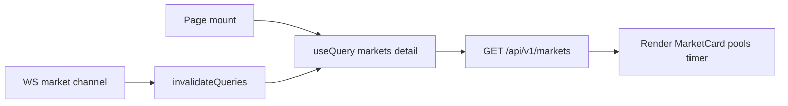

### 7.3 Flow: User trade path

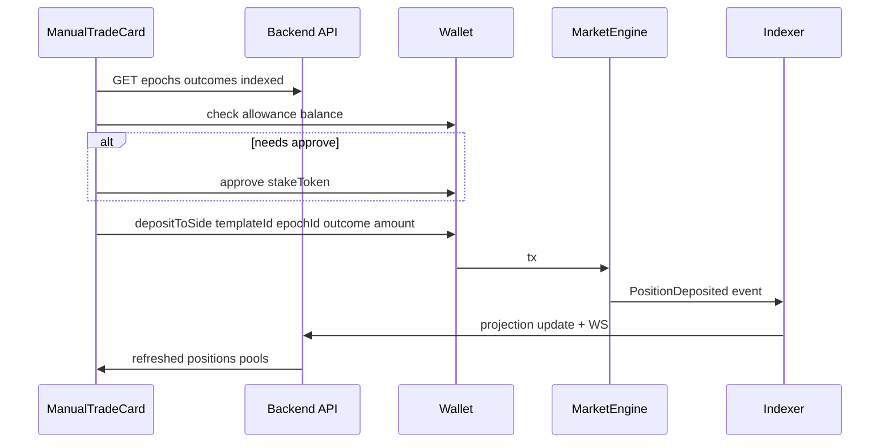

Optional: `POST /api/v1/tx/prepare/enter` builds unsigned calldata; client signs and sends.

### 7.4 Flow: Ops monitoring

```mermaid
flowchart TD
  OPS[Ops page load] --> IDX[Indexed API projections default]
  IDX --> RENDER[Render templates keeper oracle]
  LIVE[Operator clicks Live Refresh] --> RPC[GET /api/v1/ops/live/*]
  RPC --> DIFF[Show indexed vs live delta]
  PREP[Prepare tx page] --> META[GET /api/v1/ops/tx/prepare/meta]
  META --> CAL[Encoded calldata + role checklist]
  Note over PREP,CAL: No silent execution
```

### 7.5 Provider stack (fe-v1)

```
ThemeProvider → AppQueryProvider → Web3ModalProvider → BackendAuthProvider
  → LanguageProvider → OnboardingProvider → MarketProvider → AllMarketsProvider → AssetProvider
```

---

## 8. Cross-Cutting Integration Matrix

| Concern | On-chain | Backend | Frontend |
|---------|----------|---------|----------|
| Market list | `TemplateUpserted` | `GET /api/v1/markets` | `MarketsAll`, `MarketCard` |
| Market detail | `getMarketView` (delegated) | `GET /api/v1/markets/:id` + WS `market:*` | `ChainMarketDetail` |
| Deposit | `depositToSide` | tx prepare + indexer | `ManualTradeCard`, `BetModal` |
| Switch side | `switchSide` | tx prepare + indexer | `TradingSidebar` |
| Epoch lock | `lockEpoch` | keeper + indexer | `EpochTimer` countdown |
| Resolve | `resolveEpoch` | keeper + indexer | resolution views |
| Claim | `claim`, `claimMany` | `/api/v1/user/claims` | `Portfolio` |
| Oracle chart | Chainlink adapters | price-worker + `/chart` | chart components |
| Probability history | pool ratios on-chain | `probability_points` | chart overlays |
| Faucet (testnet) | `TokenFaucet.request` | faucet-state + faucet-relay | faucet panel |
| Funding | USDC on settlement chain | `/api/funding` + workers | bridge UI (when enabled) |
| Operator pause | `pauseProgram` | ops live + incidents | `OpsLiveBanners` |
| Template visibility | N/A (off-chain filter) | `frontend_hidden_templates` | ops visibility page |

---

## 9. Sources of Truth & Freshness

| Data | Canonical source | Served by | Staleness rule |
|------|------------------|-----------|----------------|
| Settlement, claims eligibility | On-chain `MarketEngine` storage | Indexer → API (default) | Wait `INDEXER_FINALITY_DEPTH` blocks |
| Market list, epoch status | Indexed projections | API + WS | Show `lastSyncAt`; WS invalidates |
| Outcome pools (live) | On-chain `getOutcomeViews` | API `?source=live` | Explicit opt-in; 5s RPC cache |
| Operator global state | On-chain `getOperatorGlobalView` | Ops live refresh | Operator-triggered RPC |
| Oracle candles | `price_candles` table | Chart API | price-worker poll interval |
| User internal balance | `user_balances` ledger | Funding API | After matcher+credit workers |
| Realtime envelopes | `realtime_events.seq` | WS replay | Monotonic seq per channel |
| Contract addresses | `registry.base-sepolia.json` | Embedded in API + apps | Update on redeploy |

**UI must not** present backend projections as final until indexed under configured finality. Show `globalPaused`, rolling halted, and stale feed banners prominently.

---

## 10. Infrastructure Topology

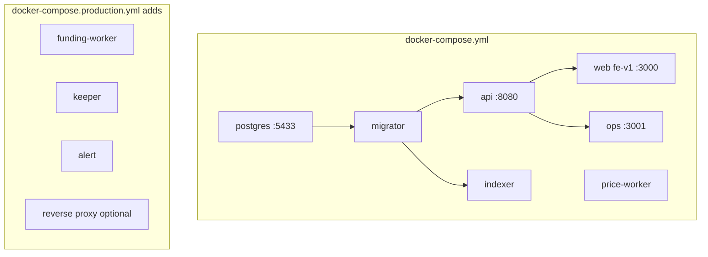

**Monorepo:** pnpm 10 + Turborepo. Contracts: Foundry in `package/prediction-v2`. Operator CLI: `retro` / `pnpm retro`.

---

## 11. End-to-End Data Path

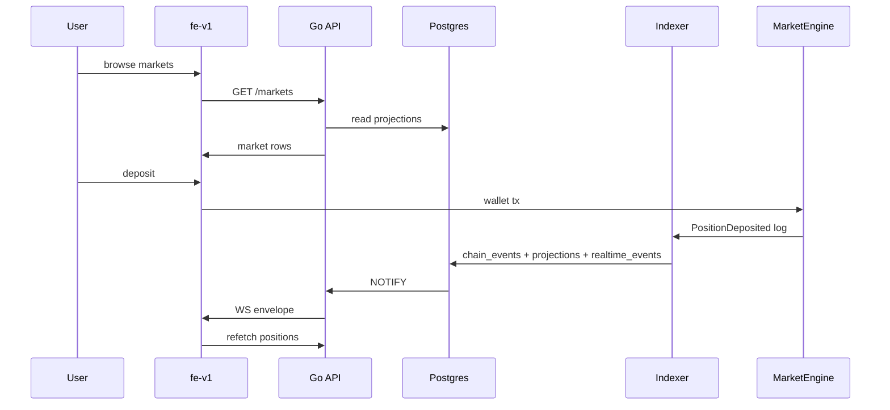

---

## 12. Documentation Map

| Topic | Document |
|-------|----------|
| **This file** | Cross-stack architecture hub |
| Smart contracts (deep) | [`package/prediction-v2/currentSmartContract.md`](../package/prediction-v2/currentSmartContract.md) |
| Rolling markets | [`package/prediction-v2/rollingMarket.md`](../package/prediction-v2/rollingMarket.md) |
| ABI registry | [`.dev/abi-map.md`](abi-map.md) |
| Backend as-built | [`.dev/backend/README.md`](backend/README.md) → `code/*` |
| Pipeline / indexer | [`.dev/pipeline/README.md`](pipeline/README.md) |
| Frontend scaffolds | [`.dev/frontend/README.md`](frontend/README.md) |
| Public technical primer | [`docs/technical/current-implementation/`](../docs/technical/current-implementation/) |
| Operator runbook | [`package/prediction-v2/.operator/.runbook.md`](../package/prediction-v2/.operator/.runbook.md) |
| AI summary registry | [`.dev/.AllArchitecture.json`](.AllArchitecture.json) |
| AI knowledge graph | [`.dev/knowledge-graph.json`](knowledge-graph.json) |

**Maintenance:** Regenerate this hub when architectural gates in `DECISIONS.md` change (new binaries, contract module splits, API version cuts).

---

## 13. Glossary

| Term | Meaning |
|------|---------|
| Template | Market definition keyed by `templateId = keccak256(slug)` |
| Epoch | One market cycle: open → lock → resolve → claim |
| Ledger | Per-template cursor, reserves, rolling state |
| Projection | Postgres table derived from `chain_events` |
| Envelope | Durable realtime message in `realtime_events` |
| Keeper | Off-chain worker executing scheduled lifecycle txs |
| Checkpoint A/B | Oracle samples at lock and resolve |
| Rolling | Single-tx pipeline advancing resolve+lock+open |
