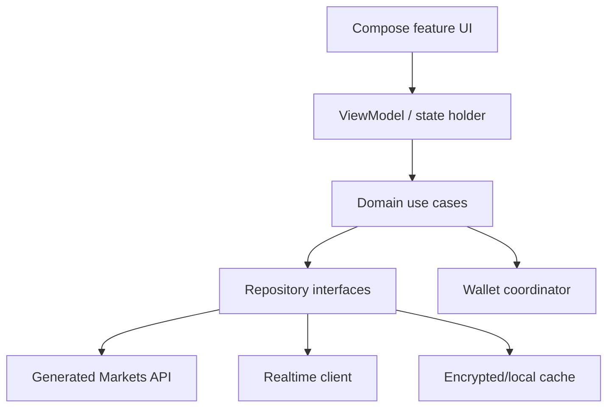
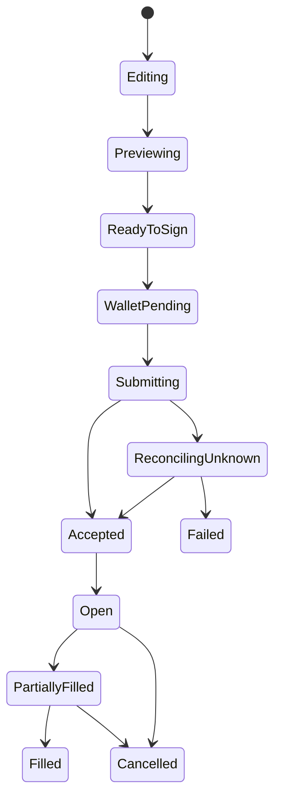

# RetroPick Android

## Native Markets-Only Product and Technical Architecture

**Status:** Proposed architecture baseline  
**Version:** 0.1  
**Date:** 2026-07-24

## 1. Product decision

RetroPick Android is the native mobile client for **RetroPick Markets only**. It discovers and trades Polymarket markets through the shared Markets backend and official venue integration.

It is not a PRISM client in this generation:

- no PRISM market creation, positions, quotes, ABIs, contract calls, or settlement;
- no mixed Markets/PRISM order ticket;
- no mobile-only settlement or custody logic;
- no duplicated Polymarket adapter hidden inside the app.

This narrower scope reduces policy, audit, signing, UX, and release risk while giving Markets a strong mobile distribution and retention surface. PRISM remains web-first until its product, legal perimeter, and protocol operations mature.

## 2. Business role

Android is a channel, not an independent economic engine. Its revenue attribution is inherited from Markets builder fees and later Markets subscriptions.

### Mobile jobs to be done

- Discover relevant markets during short sessions.
- Receive time-sensitive alerts and act with a minimal, safe number of steps.
- Track fills, open orders, positions, and claimable winnings.
- Read full rules and risk information without desktop access.
- Authorize trades through a trusted wallet flow without giving RetroPick a raw private key.

### Success metrics

- store page → install → eligible session → wallet connection;
- first-order conversion and median time to first order;
- D1/D7/D30 retention among funded traders;
- notification opt-in, useful-alert open rate, alert-to-order conversion;
- order preview-to-sign and sign-to-accepted rates;
- crash-free users, ANR rate, cold start, screen render time;
- order-state reconciliation latency;
- wallet connection/signing failure by wallet/vendor/OS;
- support tickets and policy/review incidents.

Do not optimize notification volume or engagement at the expense of informed decision-making. Default alerts should be user-selected and rate-limited.

## 3. Feature scope

### V1

- Eligibility gate and current terms/fee acceptance.
- Event feed, search, categories, filters, trending, watchlist.
- Event/market detail, rules, resolution source, price history, order book.
- Limit and marketable-limit order entry.
- Wallet connection, user-authorized signing, submission, cancellation.
- Open orders, history, fills, positions, PnL, claimable status.
- Fill, cutoff, resolution, redemption, and user-defined price notifications.
- Deep links into event, market, order, and position.
- Offline last-known catalog/portfolio cache with explicit freshness labels.
- Secure session and device management.

### V1.1+

- CTF split/merge/redeem and Negative Risk conversion after the web flow is stable.
- Biometric re-authorization for sensitive app session actions.
- Widgets/watchlist summaries only after privacy review.
- Official Combos only when Markets backend advertises the capability.

### Non-goals

- PRISM trading or market creation.
- Raw private-key import, generation, backup, or custody.
- Embedded unrestricted web dApp.
- Android-specific order semantics.
- Background autonomous trading.
- Bypassing venue or jurisdiction restrictions.
- Reimplementing venue fee, eligibility, or market rules in static app constants.

## 4. Monorepo placement

```text
apps/android-markets/
├── app/                         # composition root and application
├── build-logic/                 # convention plugins
├── core/
│   ├── common/
│   ├── model/
│   ├── designsystem/
│   ├── navigation/
│   ├── network/
│   ├── database/
│   ├── security/
│   ├── wallet/
│   ├── realtime/
│   ├── analytics/
│   └── testing/
├── data/
│   ├── catalog/
│   ├── trading/
│   ├── portfolio/
│   ├── identity/
│   └── notifications/
├── feature/
│   ├── eligibility/
│   ├── discovery/
│   ├── marketdetail/
│   ├── orderticket/
│   ├── orders/
│   ├── portfolio/
│   ├── redemption/
│   ├── watchlist/
│   └── settings/
└── benchmark/

schemas/
├── openapi/markets-v1.yaml
├── events/markets-realtime-v1.json
└── json/common-money-v1.json
```

The Android build uses Gradle/Kotlin independently of pnpm/Turbo. Root CI orchestrates both, but Gradle owns Android dependency resolution and caching.

Dependency rules:

- `feature/*` depends on stable `core/*` interfaces and relevant domain/data modules.
- Data implementations depend on generated API models and map them to domain models.
- Features never call Retrofit/WebSocket/Room/wallet SDKs directly.
- No Android module depends on `packages/prism`, PRISM schemas, or PRISM ABIs.
- Product-neutral design tokens can be generated from a canonical token file, but source code is not shared across languages.

The architecture follows Android's recommended layered, unidirectional-data-flow approach and modularization guidance. See [Guide to app architecture](https://developer.android.com/topic/architecture), [Guide to Android app modularization](https://developer.android.com/topic/modularization), and [Compose architecture](https://developer.android.com/develop/ui/compose/architecture).

## 5. Application architecture



### Presentation

- Jetpack Compose, Material 3, adaptive layouts.
- Immutable `UiState`, event intents, and one-way state flow.
- ViewModels use coroutines and `StateFlow`.
- Navigation routes carry internal IDs, never complete sensitive objects.
- Each screen renders loading, cached/stale, empty, error, ineligible, and success states.

### Domain

Use cases encode product actions, not transport calls:

- `ObserveEventFeed`
- `GetMarketDetail`
- `PreviewOrder`
- `AuthorizeAndSubmitOrder`
- `CancelOrder`
- `ObservePortfolio`
- `RedeemPosition`
- `EvaluateEligibility`

The server remains authoritative for eligibility, fee, capability, and order construction. The Android domain layer enforces UX sequencing and sanity checks but cannot override server/venue decisions.

### Data

- Repositories combine Markets REST, real-time channels, Room cache, and wallet results.
- Network DTOs are generated from versioned OpenAPI; domain models are hand-controlled.
- Money/price/quantity use integer minor units or an audited decimal type, never `Double`.
- Cache metadata includes server version, source timestamp, sequence/block, and freshness status.
- Paging is used for feeds/history; portfolio reconciliation always has a forced refresh path.

## 6. Shared API contract

Android and Markets web consume the same stable product APIs. Android must not call raw upstream Polymarket APIs for core order construction because that would duplicate:

- builder fee/version logic;
- eligibility policy;
- upstream schema compatibility;
- capability flags;
- rate-limit protection;
- reconciliation and incident controls.

Code generation pipeline:

1. Validate OpenAPI and JSON schemas in CI.
2. Generate Kotlin transport client/models.
3. Compile contract tests using golden request/response fixtures.
4. Run the same fixtures against Go handlers and TypeScript client.
5. Block breaking changes unless a new API version and migration window exist.

Real-time recovery:

1. Connect with last known cursor/sequence.
2. Apply strictly ordered deltas.
3. Detect gap or server reset.
4. Fetch a fresh snapshot.
5. Replace local projection atomically and resume.

## 7. Wallet and signing design

RetroPick Android should use a vendor-neutral wallet connection/coordinator abstraction. The default trust model:

1. Backend creates an exact EIP-712 order payload and human-readable preview.
2. App verifies that payload fields match the preview.
3. External wallet or approved wallet SDK asks the user to authorize.
4. App receives a signature, verifies recovered signer locally where feasible, and submits the exact payload/signature.
5. Backend routes and reconciles it.

Never:

- collect seed phrases or raw private keys;
- log signatures, wallet session secrets, or full signed payloads in analytics;
- silently change fee/price/size after authorization;
- reuse a signature for a different environment or order;
- hide wallet/domain/chain mismatches.

Wallet connection session secrets and auth tokens should be protected using platform-backed key storage where applicable. Android Keystore is designed to make key material harder to extract and can bind operations to secure hardware on supported devices; it does not make an unsafe signing flow safe by itself. See [Android Keystore system](https://developer.android.com/privacy-and-security/keystore).

## 8. Order experience

Mobile order states:



Key rules:

- A slow/unknown network response never means “failed”; reconcile by payload hash/order ID before retry.
- Changing amount, price, outcome, fee, expiry, or wallet invalidates the preview.
- The final pre-sign screen shows maximum loss/payout and estimated fill/slippage.
- Background/resume revalidates an expired quote.
- Partial fills are first-class.
- Biometrics protect app/session actions; the connected wallet remains the transaction authorization authority.

## 9. Offline and degraded behavior

The app may show cached:

- catalog, market metadata, price history;
- previous order/position projections;
- watchlists and notification preferences.

It must not permit a user to sign a new order from stale/offline data. Order preview, eligibility, fee/capability, balance/allowance, and venue state require a fresh server response.

Display:

- “Live”, “Updated N seconds ago”, or “Offline snapshot”.
- Real-time reconnection status.
- A read-only degraded mode during upstream/order-routing incidents.

## 10. Notifications and deep links

Push architecture:

- Backend determines user-relevant domain event after reconciliation.
- Notification worker applies preferences, jurisdiction/session eligibility, deduplication, and rate limits.
- Push payload carries opaque IDs and generic text; sensitive position details are fetched after authenticated open.
- Device token lifecycle supports rotation, logout, and deletion.

Notifications:

- order accepted/partially filled/filled/cancelled/expired;
- user-defined price alert;
- market cutoff approaching;
- market resolved and redemption available;
- security/session event.

Deep links are allowlisted and resolve through the navigation layer. A link never initiates signing or pre-approves an order.

## 11. Security and privacy

| Threat | Android control |
|---|---|
| Malicious network/MITM | TLS, Android Network Security Configuration, no cleartext, certificate policy reviewed |
| Overlay/tapjacking | Sensitive-screen protections and explicit confirmation |
| Clipboard/seed theft | Never request or copy seed phrases/private keys |
| Rooted/debugged device | Risk signal and warnings; avoid false claim of perfect detection |
| Screenshot leakage | Selective secure-window policy for sensitive session screens |
| Deep-link injection | Verified app links, strict route/parser allowlist |
| Web content injection | Avoid unrestricted WebViews; sanitize controlled content |
| Analytics leakage | Event allowlist, pseudonymous identifiers, field redaction |
| Local database exposure | Minimize sensitive data; encrypted storage where justified; logout deletion |
| Supply-chain compromise | Dependency pinning, SBOM, signing, vulnerability scanning |

Network policy should be declared using Android's supported Network Security Configuration. See [Network security configuration](https://developer.android.com/privacy-and-security/security-config).

Privacy requirements:

- data inventory and purpose for every SDK;
- no advertising identifier unless strictly required and disclosed;
- consent/opt-out for non-essential analytics where required;
- account/session/data deletion flow;
- retention aligned with legal and operational requirements;
- crash reports scrubbed of wallet/order secrets.

## 12. Google Play and legal gate

Publishing is not a purely technical task. Google Play requires apps to declare financial features, including relevant crypto wallet/exchange/trading functionality. Its blockchain-content and country-specific crypto policies can require regulated/certified services and supporting documentation. Review the current [Financial features declaration](https://support.google.com/googleplay/android-developer/answer/13849271?hl=en), [Blockchain-based content policy](https://support.google.com/googleplay/android-developer/answer/13607354?hl=en), and [cryptocurrency exchange/software wallet requirements](https://support.google.com/googleplay/android-developer/answer/16329703?hl=en).

Launch gates:

- legal opinion for every distributed country;
- Play Console financial-feature declaration;
- proof of upstream/partner eligibility and any requested licenses;
- accurate store listing with no guaranteed-return claims;
- age rating, privacy policy, terms, fees, risk, and support information;
- server-side country eligibility even if Play distribution is restricted;
- remote kill switch for new order submission by region/app version.

Google Play Billing is generally not the mechanism for financial trades, but any paid digital analytics subscription must be separately reviewed under the current [Payments policy](https://support.google.com/googleplay/android-developer/answer/10281818?hl=en).

## 13. Environments and release engineering

Build variants:

| Variant | Backend | Wallet/order behavior | Distribution |
|---|---|---|---|
| `devDebug` | Local/dev | Fixtures or explicitly isolated test wallets | Internal |
| `stagingRelease` | Staging | End-to-end pre-production controls | Internal testing |
| `prodRelease` | Production | Production eligibility and venue | Managed store tracks |

Requirements:

- Distinct app IDs, universal/app links, API roots, analytics keys, and wallet metadata.
- No production secrets in APK; public identifiers are not secrets.
- Play App Signing and protected CI release credentials.
- Signed SBOM/provenance where supported.
- Staged rollout, crash/ANR/order-error monitoring, halt criteria, and rollback/runbook.
- Minimum supported version and emergency configuration controlled by signed server data.

## 14. Testing strategy

### Automated

- Pure unit tests for money math, mapping, reducers, and eligibility UI policy.
- Compose screenshot/accessibility tests.
- Repository tests with fake API, WebSocket gaps, Room migration, clock skew.
- Contract tests from canonical fixtures.
- Wallet-adapter tests for rejection, wrong chain/account, timeout, resume.
- End-to-end tests against staging with deterministic market fixtures.
- Macrobenchmark/baseline profile for startup, scrolling, and market detail.
- Dependency and static security scanning.

### Manual release matrix

- Supported Android API levels, screen sizes, low-memory/network conditions.
- Major supported wallets and connection methods.
- Fresh install, upgrade, logout, wallet/account switch.
- Order open/partial/full/cancel/expire/unknown reconciliation.
- Region blocked, policy changed, venue outage, stale book, app backgrounded during sign.
- Accessibility: screen reader, dynamic type, contrast, touch targets, reduced motion.

## 15. Performance and reliability targets

Initial budgets:

- crash-free users: at least 99.8%;
- ANR rate below Play bad-behavior threshold with internal stricter alert;
- warm market-detail render from cache under 500 ms on target mid-range device;
- no main-thread network/database work;
- order-status update visible within 5 seconds of backend event at p95 under healthy conditions;
- app package and startup tracked per release, not allowed to regress without approval.

## 16. Delivery roadmap

### Phase A — platform shell

- Gradle convention plugins, design system, navigation, generated API client.
- Eligibility/session, observability, local database, real-time transport.

### Phase B — read experience

- Discovery, search, market detail/rules, charts/order book, watchlists.
- Offline cache, freshness, deep links.

### Phase C — trading

- Wallet coordinator, order preview/sign/submit/cancel.
- Orders, fills, portfolio, reconciliation, security review.

### Phase D — lifecycle and retention

- Redemption/CTF flows, Negative Risk where supported.
- Notifications and user-defined alerts.
- Store compliance package and staged production rollout.

## 17. Decisions required before implementation

- Minimum Android SDK and target device profile.
- Supported wallet connection vendors and fallback behavior.
- Authentication model separate from wallet ownership proof.
- Whether local database encryption is needed for the chosen data inventory.
- Supported countries/store tracks and age policy.
- Push provider and analytics/crash SDKs after privacy review.
- Which CTF operations ship in first release.
- Exact feature parity target with Markets web.
- Whether premium analytics exist; if so, Play Billing and entitlement architecture.
