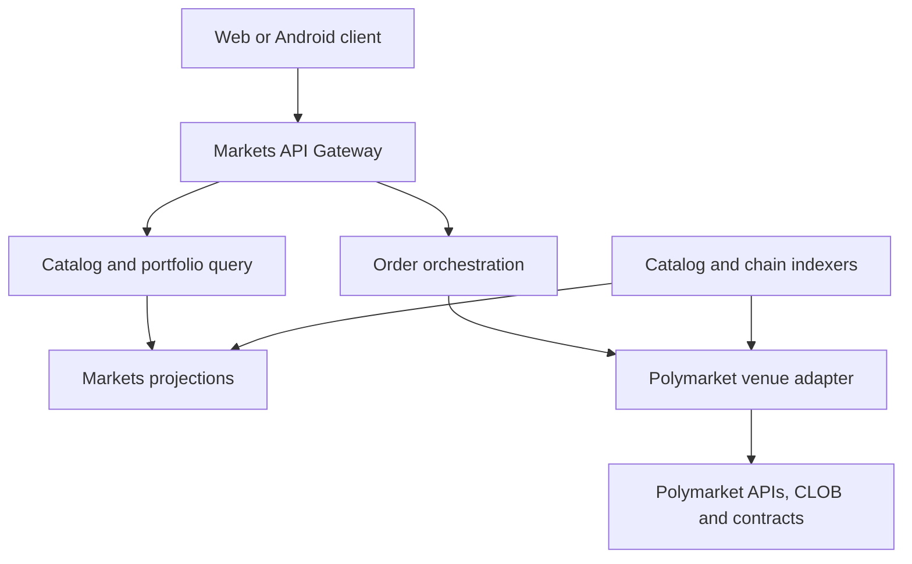
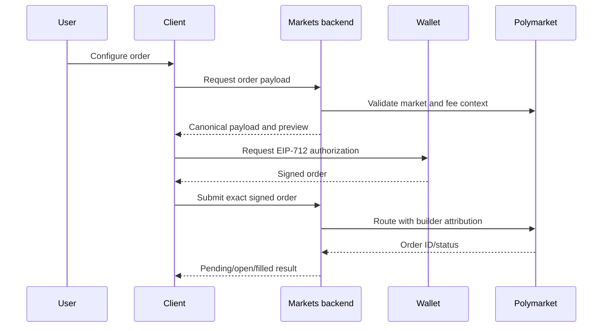

# RetroPick Markets

## Polymarket-Native Product and Integration Architecture

**Status:** Proposed architecture baseline  
**Version:** 0.1  
**Date:** 2026-07-24

## 1. Product definition

RetroPick Markets is a Polymarket-native discovery, execution, portfolio, and analytics client. Users see normalized Polymarket events and authorize Polymarket orders; Polymarket's venue contracts, conditional tokens, order book, market rules, and resolution remain authoritative.

Markets is not a structured-outcome issuer. If a user selects several YES/NO legs, the result is either:

- several independent Polymarket orders;
- a Polymarket-supported combination/RFQ product; or
- a proposed idea that must be routed to PRISM if it requires a distinct RetroPick payoff.

This boundary prevents an interface feature from accidentally becoming an uncollateralized derivative.

## 2. Business model

### Positioning

Markets competes on:

- clearer discovery and market-rule comprehension;
- fast, transparent execution;
- unified portfolio and risk views;
- mobile continuity;
- trustworthy disclosures and operational reliability;
- later, research and analytics tailored to sophisticated prediction-market users.

It should not compete by obscuring where orders settle or by implying better liquidity than the venue has.

### Target users and jobs

| User | Need |
|---|---|
| New prediction-market user | Understand outcomes, rules, prices, maximum loss, and redemption |
| Active trader | Fast order book, limit/market order controls, cancellation, portfolio and alerts |
| Thematic researcher | Search, watchlists, related markets, probabilities, and history |
| Mobile-first user | Secure native execution and real-time position monitoring |
| Later, professional user | Exports, API, advanced analytics, and execution quality |

### Revenue

Primary candidate: Polymarket Builder Program fees attached transparently to routed orders. Current official CLOB V2 documentation describes configurable builder fees based on notional, with published maximums and change-notice rules. Those values are external and time-sensitive; production must fetch/verify the current terms and disclose the effective fee before every signature. See [Builder Fees](https://docs.polymarket.com/programs/builders/fees).

Potential later revenue:

- professional analytics subscription;
- API/data products that comply with upstream terms;
- sponsored discovery clearly labeled and excluded from best-execution ranking;
- enterprise embeds.

Do not charge an undisclosed spread, monetize failed orders, or treat user balances as RetroPick revenue.

### Unit economics

\[
\text{Contribution Margin} =
\text{Builder Fee Revenue}
+\text{Subscription Revenue}
-\text{Relayer Gas}
-\text{Venue/API/Data Cost}
-\text{Variable Infrastructure}
-\text{Support/Fraud Cost}
\]

Track:

- eligible visitors, wallet connects, first-order conversion;
- funded traders, weekly/monthly retained traders;
- routed notional, orders, fills, cancellations, and failure reasons;
- effective fee, realized slippage, time to fill, and price improvement;
- revenue and gas subsidy per active trader;
- catalog freshness, order-book lag, and position reconciliation errors;
- concentration by market/category and jurisdictional blocks.

## 3. Scope

### Required V1 features

- Event/market catalog, taxonomy, search, filters, trending, and watchlists.
- Market rules, resolution source, dates, outcome tokens, risk disclosures.
- Live order book, last trades, midpoint, spread, depth, and price history.
- Limit and marketable-limit order ticket with fee, max loss, and estimated fill.
- User-authorized order signing, submission, status, partial fills, cancellation.
- Positions, cost basis, realized/unrealized PnL, claimable balances.
- Deposit/on-ramp links where lawful; no undisclosed custody.
- CTF split, merge, and redeem workflows when applicable.
- Negative Risk display and conversion support when applicable.
- Notifications for fills, cancellations, cutoff, resolution, and redemption.
- Builder attribution and optional gasless relaying under official program rules.
- Server- and client-side eligibility checks.

### Feature-gated

- Polymarket Combos/RFQ, because current help material describes limited availability and liquidity-dependent execution. The integration must verify official API/product availability rather than emulate a combo with hidden sequential leg risk. See [What are Combos?](https://help.polymarket.com/en/articles/15458600-what-are-combos).
- Advanced analytics, copied watchlists, social features, and exports.
- Fiat/crypto on-ramp integrations after provider and jurisdiction review.

### Non-goals

- RetroPick-issued outcome tokens.
- Internal pooled liquidity or AMM.
- Changing Polymarket rules, resolution, or payouts.
- Custodying raw user wallet private keys.
- Promising atomic multi-order fills unless the venue offers an atomic primitive.
- Routing around geographic restrictions.

## 4. User experience principles

Every trade confirmation must show:

- venue and chain;
- exact market/outcome;
- side, quantity, limit price, estimated notional;
- builder and venue fees;
- estimated gas/subsidy treatment;
- maximum loss and maximum payout;
- current order-book impact and partial-fill possibility;
- order expiry;
- settlement rule/source and important edge cases;
- an explicit statement that the action creates a Polymarket position. Any PRISM promotion must leave this order flow and open a separately branded product context.

“Probability” is market price-derived language, not a factual forecast. The UI should distinguish best bid, best ask, midpoint, last trade, and modeled probability.

## 5. Runtime architecture



### Components

**Markets API Gateway**

- Public/mobile API facade, auth/session, eligibility result, rate limiting.
- Aggregates stable client contracts without exposing upstream churn.
- Does not sign user orders.

**Polymarket anti-corruption layer**

- Maps official API/SDK objects into RetroPick canonical models.
- Encapsulates CLOB V2 order schema, endpoints, credentials, and error codes.
- Supports capability discovery for Neg Risk, relayer, CTF actions, and Combos.
- Records upstream version and raw identifiers for traceability.

**Catalog indexer**

- Ingests events, markets, tokens, categories, rules, times, and status.
- Uses cursor/checkpoint sync, idempotent upsert, tombstone handling.
- Keeps raw upstream payloads for debugging under retention policy.

**Market-data ingest**

- Uses snapshot + sequence-aware real-time updates.
- Detects gaps and resynchronizes rather than displaying corrupt depth.
- Calculates derived fields from authoritative levels with a timestamp.

**Order orchestrator**

- Builds signable order payloads and returns them to the client/wallet.
- Validates eligibility, token, market state, tick/size, balance/allowance, fee, nonce, and expiry.
- Submits only the exact signed payload.
- Reconciles submission, venue order state, fills, chain settlement, and portfolio projections.
- Never retries a non-idempotent submit without confirming the venue state.

**Portfolio service**

- Combines order/fill history, conditional-token balances, claimable amounts, and collateral balance.
- Reconciles periodically against venue and chain sources.
- Labels pending and estimated data.

**Transaction relayer**

- Uses official builder/relayer integration where authorized.
- Has strict contract/function allowlists, per-user budgets, simulation, nonce protection, and circuit breakers.

Official Polymarket describes signed orders matched through its CLOB and settled atomically on Polygon; the operator cannot set prices or execute unauthorized trades. RetroPick should preserve that trust model. See [Trading Overview](https://docs.polymarket.com/trading/overview).

## 6. Order flow



Requirements:

- Recompute the preview if price, fee, market state, or expiry changes.
- Bind the signature to chain/domain, maker, token, side, price, size, nonce, expiration, fee rate, and builder field required by the current protocol.
- Store payload hash and signed-order metadata, not sensitive wallet secrets.
- For a marketable order, use an explicit worst acceptable price; never translate “market” into unlimited slippage.
- Show independent leg risk for any client-side multi-order workflow.

## 7. Conditional-token operations

Polymarket represents positions as conditional outcome tokens that can be split from collateral, merged back when complementary, and redeemed after resolution. Markets must call the official supported path and display the resulting asset transformation. See [Positions and Tokens](https://docs.polymarket.com/concepts/positions-tokens).

Negative Risk events require a distinct capability model because a NO position in one mutually exclusive outcome may be convertible across the remaining outcomes. The UI and accounting must use official event metadata and adapter logic; it must not infer exclusivity from market titles. See [Negative Risk](https://docs.polymarket.com/concepts/negative-risk).

## 8. Data model

Suggested PostgreSQL ownership:

```text
markets.venues
markets.events
markets.markets
markets.outcomes
markets.market_rules
markets.orderbook_snapshots
markets.trades
markets.price_candles
markets.user_orders
markets.fills
markets.position_projections
markets.redemption_projections
markets.watchlists
markets.notifications
markets.sync_checkpoints
markets.raw_upstream_events
markets.reconciliation_runs
markets.builder_fee_versions
markets.eligibility_decisions
```

Identifiers:

- Use an internal UUID plus immutable upstream venue/type/ID tuple.
- Preserve `condition_id`, token IDs, event ID, Neg Risk identifiers, chain ID, and contract version separately.
- Monetary fields are fixed-point integers in canonical units, never floating point.
- Every derived price carries source, sequence/block, and observed timestamp.

## 9. API surface

Canonical versioned APIs, shared by web and Android:

```text
GET  /v1/markets/events
GET  /v1/markets/events/{id}
GET  /v1/markets/markets/{id}
GET  /v1/markets/markets/{id}/orderbook
GET  /v1/markets/markets/{id}/history
GET  /v1/markets/me/orders
GET  /v1/markets/me/positions
POST /v1/markets/orders/preview
POST /v1/markets/orders/submit
POST /v1/markets/orders/{id}/cancel-payload
POST /v1/markets/ctf/preview
POST /v1/markets/ctf/relay
GET  /v1/markets/capabilities
GET  /v1/eligibility
```

Real-time channels:

- order-book snapshot/update;
- trades;
- market state;
- user order/fill;
- position/redemption update.

OpenAPI and event schemas are source-controlled. Compatibility tests generate TypeScript, Go, and Kotlin fixtures from the same examples.

## 10. Security and abuse controls

| Risk | Control |
|---|---|
| Upstream API compromise | Schema validation, allowlisted endpoints, sanity thresholds, independent chain reconciliation |
| Order tampering | Client displays and wallet signs canonical payload; backend submits byte-equivalent fields |
| Replay/double submit | Nonce, expiry, idempotency key, payload hash, venue-state lookup |
| Private-key theft | No backend/mobile raw-key custody; external wallet authorization |
| Relayer drain | Function/contract allowlists, per-user and global budgets, simulation, kill switch |
| Stale order book | Sequence checks, freshness label, disable marketable execution when stale |
| Fake market metadata | Preserve official IDs/rules/source; sanitize content and links |
| Account takeover | Short-lived sessions, device/session management, step-up auth for sensitive account actions |
| Jurisdiction bypass | Server-authoritative geoblock, client precheck, audit logs, fail closed |
| Dependency outage | Circuit breakers and read-only degraded mode |

The official API exposes geographic restriction checks; they are a minimum integration requirement, not a complete legal program. See [Geographic Restrictions](https://docs.polymarket.com/api-reference/geoblock).

## 11. Reliability and observability

Suggested initial objectives:

- Catalog API: 99.9% monthly availability.
- Market detail cached p95: under 300 ms.
- Order preview p95: under 750 ms excluding upstream outage.
- Real-time book freshness: under 2 seconds at p95 while upstream is healthy.
- User-order projection consistency: reconcile within 60 seconds.
- No silent order submission failures; every attempt has a final reconciled status or explicit “unknown—checking” state.

Trace one user action across client request, preview, signature payload hash, venue request, venue order ID, fill, and chain settlement. Never log signatures, auth tokens, or sensitive full wallet telemetry unnecessarily.

## 12. Deployment and environments

- Separate dev, staging, and production upstream credentials.
- Use venue sandbox/test path if officially available; otherwise use deterministic fixtures and isolated wallets with strict limits.
- Pin SDK/API/contract compatibility and run contract-address verification at startup.
- Feature flags for relayer, Neg Risk conversion, Combos, on-ramp, and new order versions.
- Kill switches disable new order submission while preserving read/portfolio/export capabilities.
- Canary new adapter versions by user cohort and notional cap.

## 13. Compliance and user protection

Before launch, obtain jurisdiction-specific advice on prediction markets, exchange/broker/derivatives implications, marketing, sanctions, taxes, data retention, and consumer protection. Technical requirements:

- age/jurisdiction decision before order preview and again before submit;
- terms and current fee acceptance version;
- clear source, rules, cutoff, resolution, and invalid/cancel behavior;
- no guaranteed-return language;
- responsible limits/alerts where required;
- immutable audit trail of eligibility and disclosure versions.

## 14. Delivery roadmap

### Phase 1 — reliable core

- Catalog, market detail/rules, order book, limit/marketable-limit orders, cancel, positions.
- Builder attribution, fee preview, eligibility enforcement.
- Reconciliation, monitoring, and web production hardening.

### Phase 2 — complete venue lifecycle

- CTF split/merge/redeem.
- Negative Risk experience.
- Notifications, watchlists, advanced portfolio.
- Shared production API for Android.

### Phase 3 — differentiated product

- Execution-quality analytics, related markets, research tools.
- Feature-gated official Combos support if an integration path exists.
- Professional exports/API and optional subscriptions.

## 15. Decisions required before implementation

- Exact Polymarket SDK/API and CLOB V2 order versions.
- Builder enrollment, wallet, fee schedule, disclosure UX, and relayer authorization.
- Supported jurisdictions and server-authoritative policy provider.
- Authentication/session strategy separate from wallet signing.
- Which CTF operations are relayed versus user-submitted.
- Reconciliation finality policy and retention.
- Upstream rate limits and permitted data redistribution.
- Whether any fiat/on-ramp provider is in scope.
