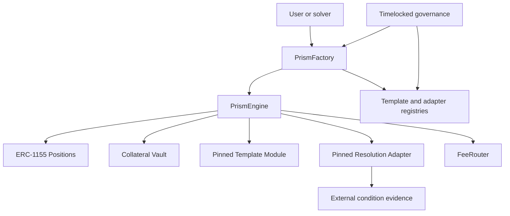
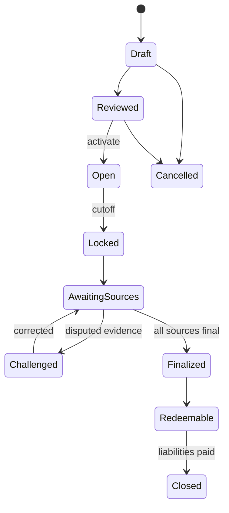

# RetroPick PRISM

## Product and Protocol Architecture

**Status:** Proposed architecture baseline  
**Version:** 0.1  
**Date:** 2026-07-24

## 1. Product definition

PRISM is a fully collateralized structured-outcome derivatives protocol. It transforms a finite set of externally resolvable conditions into a new, explicitly defined payoff surface.

Example:

> “Will Bitcoin and US GDP converge?”

That phrase is not sufficiently precise to settle money. PRISM must turn it into a versioned mathematical definition such as:

- Bitcoin condition \(B\): whether BTC's return over interval \([t_0,t_1]\) is positive.
- GDP condition \(G\): whether a specified real-GDP series' release for a named period exceeds its prior comparable release.
- Convergence definition: \(B=G\), with separate outcomes for both-up and both-down if the creator chooses a four-state product.
- Source conditions: pinned Polymarket condition identifiers or other approved oracle adapters.
- Deadlines, revision treatment, cancellation treatment, and invalid-state behavior.
- A complete payoff vector whose maximum liability is collateralized at issuance.

PRISM is therefore the derivative. Polymarket markets are underlying outcome primitives, data inputs, and optional hedging venues. Buying two Polymarket YES/NO orders in one UI is a combo transaction, not a new structured PRISM payoff.

## 2. Customer and business thesis

### Target users

- Active prediction-market traders seeking multi-factor or path-dependent exposures.
- Macro and crypto communities that express relational theses rather than single-event views.
- Professional market creators, research communities, and media partners.
- Later: DAOs, fintech products, and institutions needing a programmable finite-state payoff engine.

### Jobs to be done

- Express a thesis spanning multiple events with one bounded-loss position.
- Know the maximum payout and loss before signing.
- Avoid manually executing and maintaining several underlying legs.
- Receive deterministic settlement under rules that cannot change after issuance.
- Compare implied structured pricing against prices of the underlying conditions.

### Differentiation

PRISM's defensible layer is not merely an interface over external orders. It is:

1. A versioned payoff-definition language.
2. A collateral invariant that remains valid for every final state.
3. A deterministic template engine for multi-condition and path-dependent products.
4. A provenance graph linking every PRISM state to its source conditions and evidence.
5. A pricing and risk layer that can use, but does not blindly copy, external market prices.

## 3. Business model

### Recommended revenue sequence

| Phase | Revenue | Payer | Constraint |
|---|---|---|---|
| MVP | Execution/matching fee | Taker or both sides, disclosed in quote | Must not reduce collateral below liability |
| Growth | Market-creation/template fee | Approved creator | Charge for issuance service, not for truth |
| Growth | RFQ/solver fee share | Solver or taker | Best-execution and conflict disclosures |
| Later | Professional API/SDK | B2B customer | Separate service agreement and rate limits |
| Later | White-label deployment | Partner | Separate risk, governance, and legal perimeter |

Do not model collateral deposits, unclaimed payouts, or treasury float as revenue. A protocol fee is transferred to `FeeRouter` only after the collateral requirement for newly issued claims has been satisfied.

### Unit economics

For period \(t\):

\[
\text{Net Revenue}_t =
V_t f_t + C_t c_t + A_t a_t
- \text{Gas Subsidies}_t
- \text{Solver Incentives}_t
- \text{Data/Oracle Cost}_t
- \text{Variable Infrastructure}_t
\]

Where \(V\) is matched notional, \(f\) the effective execution fee, \(C\) created markets, \(c\) creation fee, \(A\) paid API usage, and \(a\) its unit price.

Required operational metrics:

- matched notional and unique funded traders;
- quote-to-fill rate, effective spread, and slippage;
- collateral coverage ratio and unmatched inventory;
- settlement latency and disputed/invalid rate;
- creator repeat rate;
- revenue per funded user, subsidy per funded user, and contribution margin;
- concentration by template, source adapter, creator, and underlying event.

### Go-to-market

Begin with a curated catalog. Open permissionless creation only after template safety, market-rule quality, and dispute operations are proven.

1. Launch 2–3 understandable templates around liquid crypto/macro primitives.
2. Publish a payoff visualizer and historical “what would this have paid?” simulator.
3. Recruit expert creators with public rule-review and track records.
4. Expose read-only embeddable cards and APIs.
5. Add RFQ solvers only after sufficient organic intent exists.

## 4. Scope and non-goals

### MVP scope

- USDC-like single collateral asset on one EVM chain.
- Curated binary source conditions.
- Fixed finite payoff tables.
- Mint/match, transfer, close/burn where balanced, finalize, and redeem.
- Versioned source adapters; Polymarket first.
- Deterministic templates and transparent quote decomposition.
- Web client, indexer, evaluation worker, operations console.

### Explicit non-goals

- Uncollateralized leverage or cross-margin.
- Treating an ML prediction as settlement truth.
- Depending on a profitable external hedge to honor claims.
- Arbitrary user-uploaded bytecode.
- Unlimited template complexity or unbounded state spaces.
- Automatic support for every Polymarket market.
- Permissionless governance upgrades in the MVP.

## 5. Canonical market model

A PRISM market is:

\[
M=(C,S,T,H,A,R,F,L)
\]

Where:

- \(C=\{c_1,\dots,c_n\}\): pinned source conditions.
- \(S=\{s_1,\dots,s_k\}\): exhaustive, mutually exclusive final states.
- \(T\): template identifier and immutable template version.
- \(H \in [0,1]^{m\times k}\): payout matrix for \(m\) position classes.
- \(A\): source/evidence adapter configuration.
- \(R\): timing, invalidity, dispute, and revision rules.
- \(F\): fees.
- \(L\): economic and operational limits.

For one collateral unit, \(H_{j,s}\) is the payout of position class \(j\) in final state \(s\). Integer fixed-point arithmetic uses a canonical scale such as \(10^6\), matching the collateral token's decimals where possible.

### Full-collateral invariant

If outstanding quantities are \(q_j\), the worst-case liability is:

\[
W(q,H)=\max_{s\in S}\sum_{j=1}^{m}q_jH_{j,s}
\text{rounding reserve}
\text{reserved settlement costs}
\text{refund reserve}
\]

At every state-changing operation:

\[
\text{free collateral}+\text{locked collateral}\ge W(q,H)
\]

For a complete-set market where \(\sum_jH_{j,s}=1\) for every \(s\), minting one of every complementary position against one unit of collateral is exactly covered. Non-complete or overlapping payoffs must use the general worst-case liability calculation.

The engine rejects templates whose payout matrix, state count, loop bounds, or rounding behavior violate configured limits.

## 6. Nine initial product types

The nine product experiences should compile into five audited mathematical kernels. Product names are UX; kernels are protocol logic.

| Product type | Question form | Kernel | State/payoff definition |
|---|---|---|---|
| Direction | “Will X finish up?” | Terminal Partition | Partition terminal scalar into up/down/flat-or-invalid |
| Threshold | “Will X exceed K?” | Terminal Partition | \(1[x_T \ge K]\), with explicit equality rule |
| Range Close | “Where will X close?” | Terminal Partition | Disjoint terminal intervals |
| Velocity | “Will X move by at least r?” | Terminal Partition | Threshold on normalized return or change |
| Ladder | “How high/low will X go?” | Normalized Ladder | Cumulative thresholds normalized into bounded tranches |
| Boolean Convergence | “Do A and B agree?” | Boolean Truth Table | Payoff over \(2^n\) Boolean states |
| Numeric Convergence | “Do X and Y move closer?” | Relative Value | Compare a normalized distance at start and end |
| Composite | “A, B, and not C?” | Boolean Truth Table | Bounded Boolean expression compiled to truth table |
| Corridor / Cascade | “Stay within bounds?” / “A then B?” | Path Barrier | Ordered observations and barrier-state machine |

“Range Close” and “Corridor” are distinct: the first only observes the terminal value; the second depends on the path. “Boolean convergence” and “numeric convergence” are also distinct.

### 6.1 Terminal Partition

Define non-overlapping intervals \(I_1,\dots,I_m\) covering all valid terminal values:

\[
H_{j,s}=1[x_T \in I_j]
\]

All endpoint inclusivity must be encoded. A missing source observation transitions to a predefined delayed, fallback, refund, or invalid rule; it must not be guessed.

### 6.2 Normalized Ladder

For ordered thresholds \(K_1<\dots<K_r\), define monotonic indicators \(z_i=1[x_T\ge K_i]\). A normalized score may be:

\[
L(x_T)=\frac{\sum_{i=1}^{r}w_i z_i}{\sum_{i=1}^{r}w_i}
\]

The score can be tokenized as complementary long/short claims with payouts \(L\) and \(1-L\), or compiled into interval tranches. Weights, scale, and maximum number of rungs are pinned.

### 6.3 Boolean Truth Table

For \(n\) binary conditions there are at most \(2^n\) source states. A Boolean expression \(g:\{0,1\}^n\rightarrow\{0,1\}\) yields:

\[
H_{\text{YES},s}=g(s), \qquad H_{\text{NO},s}=1-g(s)
\]

For the BTC/GDP Boolean-convergence product:

\[
g(B,G)=1[B=G]
\]

This combines both-up and both-down. A four-outcome version instead issues claims for \(00,01,10,11\). MVP should cap \(n\) at a small audited value; three conditions already require eight final states.

### 6.4 Relative Value / Numeric Convergence

Raw BTC dollars and GDP percentages are not comparable. Normalize each series first:

\[
r_X=\frac{x_T-x_0}{|x_0|},\qquad
r_Y=\frac{y_T-y_0}{|y_0|}
\]

Define distance:

\[
d_t = \left|\frac{x_t-\mu_X}{\sigma_X}-\frac{y_t-\mu_Y}{\sigma_Y}\right|
\]

or, for returns, \(d_T=|r_X-r_Y|\). “Converged” can mean \(d_T<d_0-\epsilon\), or \(d_T\le K\). The market definition must choose one, pin normalization constants/data windows, and specify revisions. The engine must not infer causation. A product named “Does BTC impact GDP?” is not settleable unless rewritten as an observable relation.

### 6.5 Path Barrier

For ordered observations \(o_1,\dots,o_T\), a deterministic finite-state machine updates:

\[
z_{t+1}=\delta(z_t,o_{t+1})
\]

Corridor settles YES only if no observation breaches its upper/lower bound under a specified observation schedule. Cascade requires event A to become final before B under explicit deadlines. Because path data can be large, the contract should store commitments/checkpoints and verify bounded proofs or adapter attestations, not loop over an unbounded history.

## 7. Pricing model

Settlement and pricing are separate systems.

Given source-event marginal probabilities \(p_i\), a structured fair value is:

\[
\pi_j=\sum_{s\in S}P(s)H_{j,s}
\]

Marginals do not identify the joint distribution \(P(s)\). For two binary events:

\[
\max(0,p_A+p_B-1)\le P(A\cap B)\le\min(p_A,p_B)
\]

Therefore PRISM must not multiply \(p_Ap_B\) unless independence is an explicit quoting assumption. Recommended quote hierarchy:

1. Executable solver/RFQ price.
2. Replication price from executable underlying orders, including depth, fees, gas, and failure risk.
3. Calibrated joint model with transparent dependence parameters.
4. Conservative Fréchet bounds when dependence cannot be estimated.

ML may forecast correlation, fill probability, slippage, anomaly risk, or quote quality. It may not define a final outcome, alter a pinned payoff, or bypass collateral checks. Store model version and features for audit, but mark every ML result advisory.

## 8. Liquidity and hedging modes

| Mode | User claim | Collateral source | External venue role |
|---|---|---|---|
| Internal complete-set match | PRISM token | User collateral locked in PRISM | Data/reference only |
| RFQ solver | PRISM token | Taker/solver collateral locked in PRISM | Solver may price or hedge externally |
| Treasury inventory | PRISM token | Pre-funded protocol/market-maker collateral | Optional hedge subject to limits |
| Pure external execution | Polymarket token, not PRISM | Polymarket settlement | This belongs to Markets, not PRISM |

External hedge assets cannot be included in the PRISM solvency numerator unless a future audited custody and liquidation design explicitly supports them. MVP accounting treats them as treasury assets outside user claim coverage.

## 9. Contract architecture



### Components

**PrismFactory**

- Validates a canonical market-definition hash.
- Resolves approved template and adapter versions.
- Deploys/registers a market instance or initializes isolated market storage.
- Enforces creator permissions and system limits.

**PrismEngine**

- Owns lifecycle state and collateral accounting.
- Calls pure/bounded template evaluation.
- Mints/burns ERC-1155 position classes.
- Enforces worst-case liability before and after every operation.
- Finalizes exactly once and enables pull-based redemption.

**TemplateRegistry**

- Maps `(templateId, version)` to immutable module addresses and code hashes.
- Supports adding new versions, pausing issuance, and deprecating future use.
- Never changes the module pinned by an existing market.

**AdapterRegistry**

- Approves immutable resolution adapters by version and source type.
- Separates source finality from template payoff calculation.
- Limits which source conditions and evidence formats may be used.

**PositionToken**

- ERC-1155 is appropriate for many markets/outcomes.
- Token ID deterministically includes chain, engine, market, and outcome.
- Transfer restrictions, if legally required, must be explicit and tested.

**FeeRouter**

- Receives only realized fees.
- Cannot withdraw locked collateral.
- Uses pull accounting for recipients.

### Upgrade model

Use extensibility for new market types, not a blanket proxy upgrade:

- Existing market economics are pinned to immutable template/adaptor versions.
- New market types are new modules registered after review, delay, and audit.
- A narrowly scoped UUPS/transparent proxy may protect a shared engine from critical bugs, but upgrades require multisig + timelock, storage-layout checks, simulation, pause window, and public hash.
- An engine upgrade cannot mutate a market's payoff matrix, source IDs, deadlines, or fee terms.
- Emergency pause stops new issuance and risky actions; redemption of finalized solvent markets remains available whenever technically safe.

## 10. Market lifecycle and fund flow



Issuance:

1. Creator submits canonical definition.
2. Backend and contract independently validate state coverage, limits, and hashes.
3. User/solver signs a quote specifying market, positions, quantities, collateral, fee, nonce, expiry, and minimum received.
4. Engine transfers collateral directly into the vault.
5. Engine recomputes worst-case liability.
6. Position tokens are minted; fee is separated only after coverage holds.

Settlement:

1. Evaluator observes source finality and stores evidence/provenance off-chain.
2. Keeper submits bounded evidence or source state.
3. Adapter verifies source identity/finality.
4. Template maps source state to one PRISM final state.
5. Engine freezes payout vector and emits finalization event.
6. Users redeem through pull payments.

No backend database row is authoritative for balances or final payout.

## 11. Backend architecture

Recommended bounded contexts:

- `prism-catalog`: definitions, drafts, reviews, publication metadata.
- `prism-quote`: RFQ orchestration, solver fan-out, quote normalization.
- `prism-risk`: off-chain shadow liability, concentration limits, circuit breakers.
- `prism-evaluator`: source ingest, finality graph, evidence bundle.
- `prism-indexer`: chain events, balances, lifecycle projection.
- `prism-keeper`: idempotent on-chain finalization/maintenance.
- `prism-simulator`: payoff charts, scenario analysis, historical replay.
- `prism-notifications`: cutoffs, source finality, redemption.

Data ownership:

```text
prism.market_definitions
prism.market_versions
prism.source_conditions
prism.payoff_matrices
prism.quotes
prism.fills
prism.chain_events
prism.balance_projections
prism.evidence_bundles
prism.settlement_attempts
prism.risk_snapshots
prism.audit_log
```

All projectors are replayable from on-chain events plus versioned external evidence. Store block hash/number and handle reorgs through a confirmation/finality policy.

## 12. Security model

Critical threats and controls:

| Threat | Required control |
|---|---|
| Under-collateralized issuance | On-chain worst-case liability check; invariant fuzzing |
| Malicious template | Versioned allowlist, loop/state caps, audit, code hash pin |
| Resolution-source substitution | Condition IDs and adapter version committed at creation |
| Ambiguous market language | Machine-readable definition is authoritative; human copy generated from it |
| Reentrancy/token quirks | CEI, pull redemption, safe transfer wrappers, supported-token allowlist |
| Signature replay | Chain ID, engine, nonce, deadline, domain separator |
| Rounding leakage | Directional rounding policy and reserve; property tests |
| Governance capture | Multisig, timelock, limited roles, issuance pause, public change log |
| Backend compromise | Cannot change payoff/custody; independent on-chain verification |
| Solver manipulation | Signed quotes, expiry, min received, quote comparison, reputation/limits |
| External venue outage | Degraded quoting/hedging; collateral and redemption remain isolated |

Tests must include unit tests, invariant/fuzz tests, differential tests against a reference math implementation, stateful lifecycle tests, fork tests for adapters, reorg tests, adversarial token tests, storage-layout checks, and economic simulations across every final state.

## 13. Availability and observability

Initial targets, to be validated:

- Query API availability: 99.9% monthly.
- Quote p95 latency: under 1.5 seconds excluding slow solvers.
- Indexing lag: under 30 seconds at p95 after configured confirmation depth.
- Settlement submission: under 10 minutes after all sources reach required finality, excluding disputes.
- Zero tolerated collateral-invariant violations.

Alerts:

- on-chain collateral coverage discrepancy;
- unexpected template/adaptor code hash;
- evaluator/source divergence;
- repeated settlement failure;
- abnormal quote spread/fill rate;
- governance or pause action;
- chain reorg beyond expected depth;
- stale external data.

## 14. Delivery roadmap

### Phase 0 — formal specification

- Freeze terminology, nine product types, and five kernels.
- Build an executable reference math model and golden vectors.
- Define market JSON schema and canonical hashing.
- Obtain legal analysis and threat-model review.

### Phase 1 — safe kernel

- One chain, one collateral, Terminal Partition + Boolean Truth Table.
- Curated source conditions and manual review.
- Full-collateral engine, ERC-1155 positions, indexer, evaluator, redemption.
- No treasury hedge dependency and no permissionless creation.

### Phase 2 — market quality

- RFQ solver interface, quote comparison, pricing bounds.
- Ladder and Relative Value modules.
- Creator tools, payoff simulator, source provenance UI.

### Phase 3 — path products

- Path Barrier module with bounded proof/evidence design.
- Corridor and Cascade.
- Broader adapters only after independent audits.

### Phase 4 — platform

- Approved third-party creators, professional API, additional collateral/chains only through separate risk reviews.

## 15. Decisions still required before implementation

- Chain and exact collateral token.
- Position transferability and jurisdiction restrictions.
- Oracle/finality contract for Polymarket source conditions.
- Whether invalid sources refund principal, use a fallback outcome, or pay a predefined vector.
- Maximum conditions, outcomes, rungs, observations, and market duration.
- Fee schedule and solver conflict policy.
- Governance signers, timelock duration, pause authority, and recovery constraints.
- Whether engine instances isolate collateral per market or use a shared vault with strict sub-ledgers.

## 16. External source assumptions

Polymarket positions are tokenized YES/NO outcomes and can be split, merged, and redeemed under its Conditional Token Framework integration; PRISM should consume only explicitly pinned conditions and finality evidence. See the official [positions and tokens](https://docs.polymarket.com/concepts/positions-tokens) and [resolution](https://docs.polymarket.com/concepts/resolution) documentation. Polymarket's current resolution path is an external dependency, not a PRISM governance mechanism.
