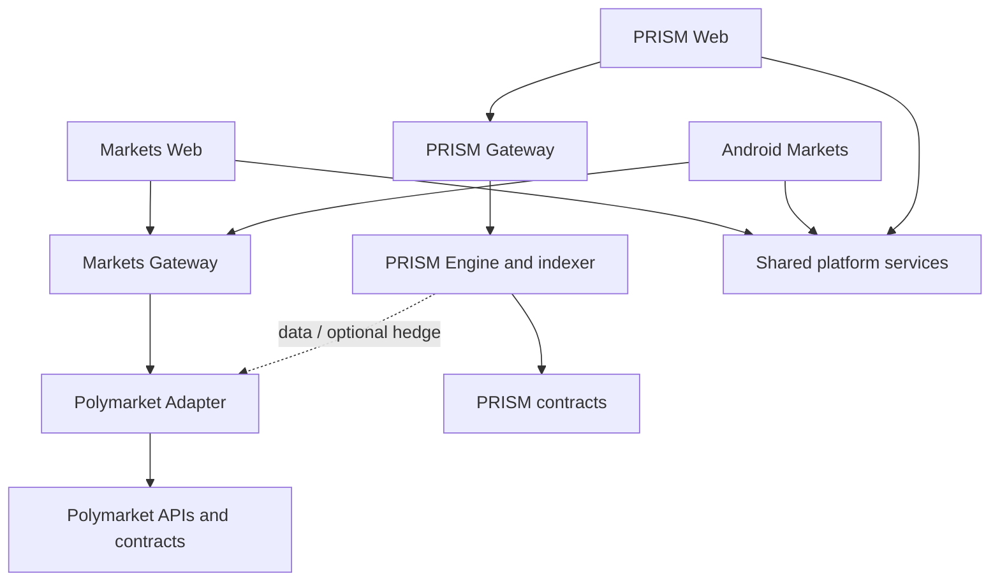

# RetroPick Product Suite

**Status:** Architecture baseline  
**Date:** 2026-07-24  
**Scope:** Research and system design only; not an implementation or deployment specification

## 1. Executive decision

RetroPick should be operated as one product suite with three user-facing products, but only two economic engines:

1. **PRISM** — RetroPick's own fully collateralized structured-outcome derivatives protocol.
2. **Markets** — a Polymarket-native discovery, trading, portfolio, and execution product. Markets does not issue RetroPick outcomes.
3. **Android app** — the native Android client for Markets only. It is a distribution channel, not a third settlement protocol.

This separation is fundamental. Markets routes user-authorized activity to Polymarket. PRISM creates distinct RetroPick positions and therefore requires its own collateral, contracts, settlement state, and risk controls. Android consumes the same Markets platform APIs as the web client and must not contain a second copy of the trading or compliance rules.

| Product | Issuer of position | Collateral custody | Matching/liquidity | Resolution authority | Primary client |
|---|---|---|---|---|---|
| PRISM | RetroPick PRISM contracts | PRISM vaults/contracts | Internal matching/RFQ; optional external hedge | Versioned PRISM settlement adapter using pinned source conditions | Web first |
| Markets | Polymarket contracts | Polymarket contracts | Polymarket CLOB/RFQ | Polymarket market rules and resolution system | Web |
| Android | None | None beyond the connected Polymarket flow | Calls Markets execution services | Inherited from Polymarket | Native Kotlin |

## 2. Product boundaries

### PRISM owns

- Structured payoff definitions composed from one or more external outcome primitives.
- Nine initial market types and a versioned template mechanism for future types.
- PRISM position tokens, collateral, mint/match/burn/redeem accounting, and fee accounting.
- Deterministic evaluation of final states from pinned, independently verifiable source conditions.
- Internal risk limits and optional hedge orchestration.

PRISM does **not** treat a Polymarket price as truth, promise that external liquidity always exists, or count an off-chain hedge as collateral backing a user's PRISM claim.

### Markets owns

- Polymarket catalog normalization, discovery, search, filters, and market detail.
- CLOB order book and trade UX, user-signed order submission/cancellation, positions, PnL, and redemption workflows.
- Builder attribution and, where permitted, gas-sponsored transaction relaying.
- Polymarket-native Conditional Token Framework and Negative Risk operations.
- Feature-gated Polymarket Combos support when the official product and integration path are available.

Markets does **not** issue RetroPick contracts, alter Polymarket outcomes, pool user funds in a RetroPick market, or claim to be a PRISM market.

### Android owns

- A native, secure, low-latency Markets experience.
- Mobile discovery, trading, portfolio, notifications, deep links, and wallet authorization.
- Local cache and resilient UI state.

Android does **not** expose PRISM issuance/trading in this product generation, embed PRISM ABIs, or become an independent backend.

## 3. Recommended monorepo

Keep a single monorepo because the products share schemas, identity/session policy, observability, release policy, and the Polymarket normalization layer. Enforce product isolation through package dependency rules, separate deployables, database schemas, credentials, and contract ownership.

```text
retropick/
├── apps/
│   ├── web/                     # Markets V1 web (@retropick/markets-web)
│   ├── backend/                 # Go Markets BFF (cmd/markets-api)
│   ├── android/                 # RetroPick-Android gitlink
│   ├── landing-web/             # Marketing waitlist (separate product)
Current Markets V1 authority: `.dev/markets-v1/README.md`.
Current Markets V1 authority: `.dev/markets-v1/README.md`.
├── contracts/
│   └── prism/                   # PRISM placeholders (future)
├── packages/
│   ├── polymarket/              # venue adapter, OpenAPI codegen
│   ├── prism/                   # PRISM placeholders
│   └── config/                  # shared eslint/tsconfig
├── schemas/
│   ├── openapi/markets-v1.yaml
│   └── asyncapi/markets-realtime-v1.yaml
├── .dev/markets-v1/             # canonical Markets V1 engineering docs
└── .harness/products/markets-v1/
```

Current Markets V1 authority: `.dev/markets-v1/README.md`.

Kotlin is a separate Gradle build inside the monorepo. It cannot consume TypeScript packages directly. TypeScript, Go, and Kotlin clients must instead be generated from canonical OpenAPI/JSON schemas, with shared conformance fixtures.

### V1 reuse and replacement map

| Current V1 area | Decision | Destination |
|---|---|---|
| Go API and multi-command worker pattern | Reuse the operational pattern; split domain ownership | `apps/backend/cmd/*`, `internal/markets/*`, `internal/prism/*` |
| PostgreSQL + sqlc | Reuse tooling; introduce schema and migration ownership | `platform.*`, `markets.*`, `prism.*`, `legacy.*` |
| Chain/indexer/event infrastructure | Reuse generic primitives; add product-specific decoders | `packages/platform/chain`, backend indexers |
| TypeScript shared types | Keep web-only implementation; move contracts to language-neutral schemas | `schemas/*` plus generated clients |
| Existing `market-types`, pricing, equivalence, and resolution packages | Mine for tests/terminology; do not assume economic compatibility | new `packages/polymarket` and `packages/prism` APIs |
Current Markets V1 authority: `.dev/markets-v1/README.md`.
| Frontend V1 | Markets web is `apps/web` | `apps/web/src/products/markets/` |
Current Markets V1 authority: `.dev/markets-v1/README.md`.

Code reuse is subordinate to invariant reuse. If a component assumes pari-mutuel pooling, shared yield, or a single price-feed outcome, it is not a safe PRISM primitive merely because its interface is convenient.

## 4. Runtime topology



Hard isolation rules:

- Markets credentials cannot administer PRISM contracts.
- A failure of the PRISM evaluator cannot block normal Markets order submission.
- A Polymarket outage degrades Markets and external PRISM data/hedging, but cannot alter PRISM collateral balances.
- Every API and event includes `product`, `environment`, `schema_version`, and a trace identifier.
- PostgreSQL uses separate `platform`, `markets`, `prism`, and `legacy` schemas with product-specific migration ownership.

## 5. Deployment units

The monorepo is not a monolith. Minimum independently deployable units:

- Markets web.
- PRISM web.
- Markets API/query service.
- Markets order-routing service.
- Polymarket catalog/indexer and real-time ingest.
- PRISM API/query service.
- PRISM evaluator/indexer.
- PRISM keeper/settlement worker.
- Shared notification worker.
- Operations console.
- Android application releases.

Start with a modular Go backend in one repository and split processes by command, queue, and credential boundary. Do not introduce network microservices solely for organizational aesthetics; split when failure isolation, scaling, or security ownership requires it.

## 6. Legacy V1 decision

RetroPick V1's own-liquidity pool should become an explicit legacy domain:

- Stop creating new V1 market types once migration begins.
- Preserve read, settlement, redemption, and accounting paths until all obligations are discharged.
- Keep V1 ABIs, indexers, and database tables under `legacy`.
- Do not migrate live liabilities by database rewrite.
- If positions must move, use a separately audited, user-consented on-chain migration.

## 7. Shared business model

The suite has two monetization surfaces:

- **Markets:** disclosed builder fees or venue-supported commercial arrangements attached to user orders; premium analytics may be added later.
- **PRISM:** protocol execution/matching fees, template issuance fees for professional creators, and later B2B SDK/API access.

Collateral is a liability reserve, not revenue. User funds must never finance operating expenses. Optional hedge PnL and treasury yield are not included in base revenue forecasts until legal, risk, accounting, and withdrawal-liquidity controls are approved.

The portfolio funnel should be measured without blurring the products:

1. Visitor → eligible, connected Markets user.
2. Connected user → first Polymarket order.
3. Trader → retained Markets trader.
4. Eligible sophisticated user → PRISM education/suitability flow.
5. PRISM user → first fully collateralized structured position.

Cross-selling must be permissioned and must not imply that a profitable Markets history makes PRISM suitable.

## 8. Governance and release gates

No product launches in a jurisdiction merely because the software works. Each production region requires:

- External legal review covering derivatives/prediction markets, brokerage/exchange implications, sanctions, consumer protection, marketing, tax, and data privacy.
- Current venue eligibility and geoblock enforcement.
- Terms, privacy notice, fee disclosure, market rules, and risk disclosures.
- Age and jurisdiction controls.
- Security review, threat model, incident plan, key-management runbook, and disaster-recovery test.
- For PRISM, independent contract audit, economic-invariant testing, timelocked governance, and a funded bug bounty.
- For Android, Google Play financial-features declaration and current blockchain/crypto policy review before every material release.

## 9. Documentation map

- [PRISM.md](./PRISM.md) — product economics, payoff mathematics, protocol architecture, settlement, contracts, backend, security, and roadmap.
- [MARKETS.md](./MARKETS.md) — Polymarket-native business and technical architecture.
- [ANDROID_MARKETS.md](./ANDROID_MARKETS.md) — native Android Markets-only product and implementation architecture.

## 10. Source baseline

The venue integration assumptions are based on the current official Polymarket documentation for the [Builder Program](https://docs.polymarket.com/programs/builders/overview), [trading architecture](https://docs.polymarket.com/trading/overview), [positions and tokens](https://docs.polymarket.com/concepts/positions-tokens), [resolution](https://docs.polymarket.com/concepts/resolution), and [geographic restrictions](https://docs.polymarket.com/api-reference/geoblock). These are external, time-sensitive dependencies and must be revalidated before implementation and launch.


## 11. Markets V1 agent harness

Full implementation-grade documentation and machine-readable harness for **RetroPick Markets V1** (Polymarket-native web + backend + Android):

| Resource | Path |
|----------|------|
| Entry | [.dev/markets-v1/README.md](./markets-v1/README.md) |
| Document map | [.dev/markets-v1/00_DOCUMENT_MAP.md](./markets-v1/00_DOCUMENT_MAP.md) |
| Agent contract | [../.harness/products/markets-v1/governance/AGENT_OPERATING_CONTRACT.md](../.harness/products/markets-v1/governance/AGENT_OPERATING_CONTRACT.md) |
| Phase manifest | [../.harness/products/markets-v1/planning/implementation-manifest.yaml](../.harness/products/markets-v1/planning/implementation-manifest.yaml) |
| Public pointer | [docs/markets-v1/README.md](../docs/markets-v1/README.md) |

**Current phase:** Read live `current_phase` from [implementation-manifest.yaml](../.harness/products/markets-v1/planning/implementation-manifest.yaml) (do not assume from this file). Markets V1 implementation is active under `apps/web` + `cmd/markets-api`.
