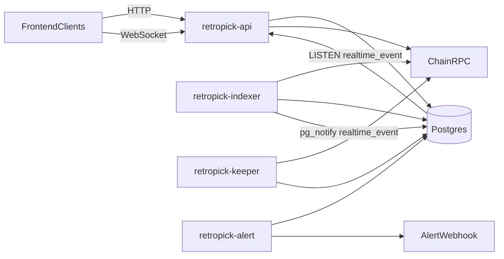

# Backend code walkthrough (`apps/backend/`)

This folder is a **near-exhaustive, implementation-level** explanation of the backend code in `apps/backend/`.

If you want the higher-level docs first, start in `.dev/backend/README.md`.

## Top-level architecture (processes + data)

Notes:

- `retropick-alert` exists and sends open incidents to `ALERT_WEBHOOK_URL`.
- `retropick-reporter` is a disabled-by-default TrustedReporter EIP-712 claim signer. It prepares signed payloads for operator-controlled posting and does not expose a public API or auto-broadcast transactions.
- Postgres is the durable store for: chain events, projections/read models, funding lifecycle, realtime envelopes, keeper schedule/executions, incidents.

## Reading order

1. [`entrypoints.md`](./entrypoints.md)
2. API layer:
   - [`api/http-surface.md`](./api/http-surface.md)
   - [`api/auth-and-sessions.md`](./api/auth-and-sessions.md)
   - [`api/middleware.md`](./api/middleware.md)
   - [`api/websocket.md`](./api/websocket.md)
3. Indexer:
   - [`indexer/sync-loop.md`](./indexer/sync-loop.md)
   - [`indexer/reorg-and-rebuild.md`](./indexer/reorg-and-rebuild.md)
   - [`indexer/event-handlers.md`](./indexer/event-handlers.md)
4. Realtime fanout:
   - [`realtime/durable-stream.md`](./realtime/durable-stream.md)
   - [`realtime/pglisten-bridge.md`](./realtime/pglisten-bridge.md)
   - [`realtime/hub.md`](./realtime/hub.md)
5. Keeper:
   - [`keeper/job-model.md`](./keeper/job-model.md)
   - [`keeper/service-loop.md`](./keeper/service-loop.md)
   - [`keeper/executor.md`](./keeper/executor.md)
6. Funding:
   - [`funding/http-surface.md`](./funding/http-surface.md)
   - [`funding/workers.md`](./funding/workers.md)
7. DB:
   - [`db/migrations.md`](./db/migrations.md)
   - [`db/sqlc-and-queries.md`](./db/sqlc-and-queries.md)
8. Chain access:
   - [`ethops/rpc-and-abis.md`](./ethops/rpc-and-abis.md)
