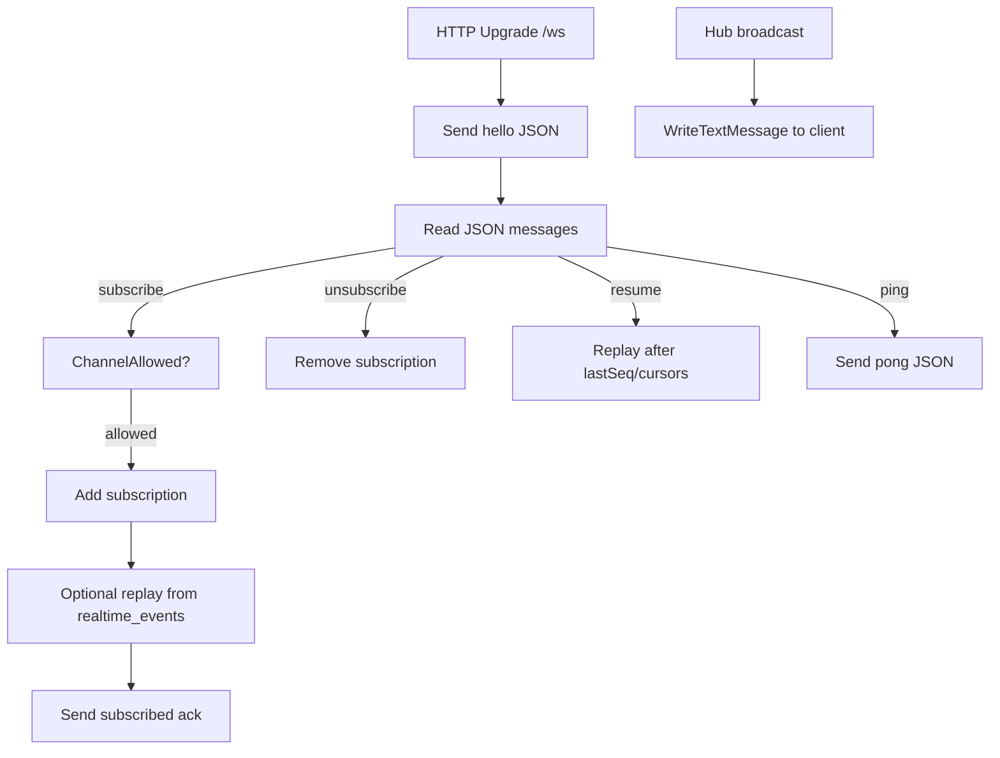

# Websocket implementation (`/ws`)

This doc is a code-level walkthrough of the websocket server implemented inline in `apps/backend/cmd/api/main.go`.

## Overview

The websocket server is built around:

- a `wshub.Hub` (in-memory fanout)
- a durable DB stream (`realtime_events`)
- an event bridge (`pglisten.Run`) that loads envelopes and pushes them into the hub

## Connection lifecycle



## Message types (server reads)

The server reads JSON messages like:

```json
{
  "type": "subscribe",
  "channels": ["global:markets", "market:0x..."],
  "lastSeq": 123,
  "cursorByChannel": {"market:0x...": 456}
}
```

Supported `type` values:

- `subscribe`
- `unsubscribe`
- `resume`
- `ping`

## Subscription limits and rate limits

In `cmd/api/main.go`:

- max **30 subscribe messages / minute**
- max **50 total channels** per connection

If exceeded, the server emits an error envelope and closes (for rate limit) or refuses the action (for channel cap).

## Channel authorization rules

Authorization is enforced by `websocketChannelAllowed(...)`:

- **Always allowed**:\n  - `global:markets`\n  - `market:*`\n  - `epoch:*`\n  - `oracle:*`\n  - `chart:*`
- **User channel**: `user:<wallet>`\n  - requires authenticated principal\n  - wallet must match principal wallet
- **Deposit channel**: `deposit:<intentId>`\n  - requires authenticated principal\n  - checks DB: `SELECT user_address FROM funding_intents WHERE id::text = $1`\n  - wallet must match principal wallet
- **Ops channels**: `ops:*`\n  - requires authenticated principal with `IsOperator=true`

## Replay logic

Replay is done by `replayRealtimeEvents(ctx, pool, conn, afterSeq, limit, allowedChannels)`:

- uses `realtime.LoadEnvelopesAfter(ctx, pool, afterSeq, limit, allowedChannels)`\n- writes each envelope as a JSON text message

Two replay entry points:

- On `subscribe`:\n  - if `lastSeq > 0`, replays up to 500 after `lastSeq` for accepted channels\n  - then replays each `cursorByChannel[channel]` (per-channel) up to 500
- On `resume`:\n  - same idea: global replay by `lastSeq` and per-channel cursors

If replay fails (sequence gap or DB failure), the server sends `resync_required` and the client should refetch baseline state via HTTP.

## Keepalive

The server sends websocket **control ping frames** every 25 seconds. If a ping write fails, the server closes the connection.

## Source pointers

- `apps/backend/cmd/api/main.go` (websocket implementation)\n- `apps/backend/internal/realtime/realtime.go` (envelope format + loading)\n- `apps/backend/internal/wshub/hub.go` (fanout)\n- `apps/backend/internal/pglisten/pglisten.go` (notify → load → broadcast)

