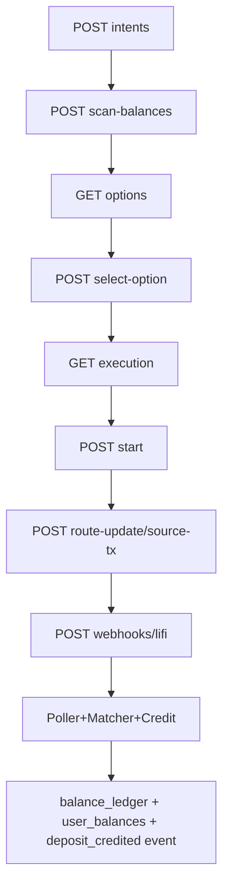

# Funding abstraction HTTP surface (`/api/funding/*`)

This doc maps the funding abstraction (v2) API endpoints to their handler implementations in `apps/backend/internal/api/funding_abstraction.go` and the supporting service in `internal/funding/*`.

## Router wiring

Mounted in `cmd/api/main.go`:

- `r.Mount(\"/api/funding\", api.FundingAbstractionRouter(...))`

Router factory:

- `api.FundingAbstractionRouter(pool, svc, cfg)`

## Endpoint map

### `GET /api/funding/config`

Returns:\n\n- settlement chain/token/receiver\n- deposit limits (min/softmax/hardmax)\n- supported source chains/tokens\n- provider names

### `POST /api/funding/intents`

Creates a funding intent record:

- input: `{ userAddress, targetAmount, clientNonce, mode }`\n- validates wallet authorization (must match principal)\n- converts `targetAmount` to USDC base units\n- enforces min and hard max\n- inserts into `funding_intents` with a 15 minute expiry

### `POST /api/funding/intents/{intentId}/scan-balances`

Triggers route option creation (if `svc != nil`):

- checks intent access (ownership)\n- calls `funding.Service.EnsureRouteOptions(intentId)`\n- on failure, sets intent status to `NO_FUNDING_OPTIONS` and returns `409`

### `GET /api/funding/intents/{intentId}/options`

Lists computed route options from `funding_route_options`:

- includes `recommendedOptionId` from the intent\n- returns a scored list ordered by score

### `POST /api/funding/intents/{intentId}/select-option`

Creates a `funding_executions` row linked to the selected option:\n\n- validates ownership\n- inserts execution\n- sets route option status to SELECTED\n- advances intent status to `ROUTE_SELECTED`

### `GET /api/funding/intents/{intentId}`

Returns current intent status and failure code/message fields.

### `GET /api/funding/executions/{executionId}`

Returns execution status, source/destination chain/token, amounts, tx hashes, and the serialized route snapshot.

### `POST /api/funding/executions/{executionId}/start`

Marks execution started (idempotent):

- requires `idempotencyKey`\n- persists transition guard `(intentId, to_status, idempotencyKey)`\n- updates execution + intent status to `EXECUTION_STARTED`

### `POST /api/funding/executions/{executionId}/route-update`

Persists a provider route update event (idempotent):

- requires `idempotencyKey`\n- writes `route_update_events`\n- stores provider status snapshot on `funding_executions`\n- may update `destination_tx_hash` if present

### `POST /api/funding/executions/{executionId}/source-tx`

Persists the source tx hash (idempotent):

- requires `idempotencyKey`\n- updates execution + intent status to `SOURCE_TX_SUBMITTED`

### `POST /api/funding/webhooks/lifi`

Accepts provider webhook events:

- optional auth: header `X-Lifi-Webhook-Secret` must match `LIFI_WEBHOOK_SECRET` if configured\n- upserts into `funding_webhook_events` keyed by `(provider,event_id)`\n- may update `funding_executions` tx hashes\n- may attach webhook event id to `destination_usdc_transfers` rows when destination tx hash is present

## Flowchart: intent → options → execution → reconcile

## Source pointers

- `apps/backend/internal/api/funding_abstraction.go`\n- `apps/backend/internal/funding/service.go`\n- `apps/backend/internal/funding/lifi_provider.go`

