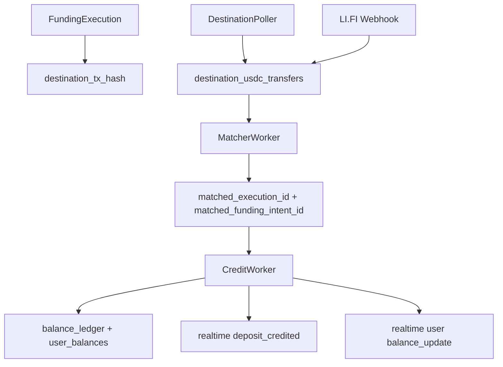

# Funding workers: destination poller, matcher, credit worker

Funding abstraction relies on background workers to reconcile cross-chain transfers and credit internal balances.

These workers run inside the API process (`cmd/api/main.go`) as goroutines.

## Overview flow

## DestinationPoller

Source: `apps/backend/internal/funding/destination_poller.go`

Purpose: detect USDC ERC-20 `Transfer` events to the settlement receiver address and persist them in `destination_usdc_transfers`.

Key behaviors:\n\n- Uses RPC failover client (`ethops.NewFailoverRPCClient`).\n- Reads `destination_transfer_indexer_state.last_block` and advances it.\n- Uses a small finality buffer: indexes up to `head - 3`.\n- Bootstrap: if `last_block` is <= 0, it backfills ~1500 blocks.\n- Filters logs by:\n  - `Addresses: [USDC token]`\n  - topic0 = `Transfer(address,address,uint256)`\n  - then filters to `to == receiver` in code\n- Inserts transfers with conflict key `(chain_id, tx_hash, log_index)`.\n- If a transfer row already exists with provenance `WEBHOOK`, poller sets provenance to `MERGED`.

## MatcherWorker

Source: `apps/backend/internal/funding/matcher_worker.go`

Purpose: match an unmatched destination transfer to a funding execution/intent.

Algorithm:\n\n1. Lock one unmatched transfer row:\n   - `WHERE credit_status='UNMATCHED' AND matched_execution_id IS NULL`\n   - `FOR UPDATE SKIP LOCKED`\n2. Find a likely execution:\n   - prefer exact match on `destination_tx_hash == transfer.tx_hash`\n   - else use heuristic:\n     - `expected_usdc_amount <= transfer.amount`\n     - status in `SOURCE_TX_SUBMITTED|BRIDGING|EXECUTION_STARTED`\n3. Update `destination_usdc_transfers` with:\n   - `matched_execution_id`\n   - `matched_funding_intent_id`\n   - `match_confidence` (hard-coded `0.95`)\n   - metadata describing which matching strategy was used

If it cannot find an execution, it commits without changes.

## CreditWorker

Source: `apps/backend/internal/funding/credit_worker.go`

Purpose: credit internal user balances once a destination transfer has been matched to an intent.

Algorithm:\n\n1. Lock one transfer that is:\n   - `destination_usdc_transfers.credit_status = UNMATCHED`\n   - `funding_intents.status` is in `BRIDGING|SOURCE_TX_SUBMITTED|EXECUTION_STARTED|DESTINATION_USDC_VERIFIED`\n2. Load `min_usdc_amount` from latest execution and verify the amount:\n   - if `amount < min`, mark transfer `AMOUNT_TOO_LOW` and set intent to `MANUAL_REVIEW`\n3. Insert idempotent balance ledger credit:\n   - `idempotency_key = deposit-credit:{intentId}:{transferId}`\n   - reason `CROSS_CHAIN_DEPOSIT_CREDIT`\n4. Upsert `user_balances` (add to available).\n5. Mark transfer `CREDITED`.\n6. If no remaining unmatched transfers for intent, set intent status to `CREDITED`.\n7. Insert realtime events:\n   - `deposit:{intentId}`: `deposit_credited`\n   - `user:{wallet}`: `balance_update`\n   - Notify `pg_notify` after commit.

## Failure modes

- Poller can miss logs if RPC errors persist or if the `destination_transfer_indexer_state` is wrong.\n- Matcher’s heuristic can be ambiguous under concurrency; prefer `destination_tx_hash` matching.\n- Credit worker is protected by idempotency keys but can still hit `MANUAL_REVIEW` if destination amount is below `min_usdc_amount`.

## Source pointers

- `apps/backend/internal/funding/destination_poller.go`\n- `apps/backend/internal/funding/matcher_worker.go`\n- `apps/backend/internal/funding/credit_worker.go`

## Note on realtime `scope` naming

Funding emits `realtime_events.scope = "private"` for deposit and user balance updates (see `apps/backend/internal/funding/service.go` and `apps/backend/internal/funding/credit_worker.go`).\n\nIn the websocket layer, “private” is effectively enforced by **channel authorization** (e.g. `deposit:{intentId}` owner checks, `user:{wallet}` principal checks), not by the `scope` string alone.

