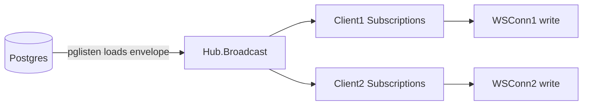

# Websocket hub (`wshub`)

This doc describes the in-memory broadcast hub used by the API websocket server.

## Where it lives

- `apps/backend/internal/wshub/hub.go`

## Conceptual model

- Each websocket connection creates a hub “client” subscription.\n- The client maintains a set of subscribed channels.\n- The Postgres LISTEN bridge broadcasts every envelope to the hub.\n- The websocket connection reads from its client channel and writes messages to the socket, but only for channels it subscribed to (enforced by hub client filtering).

## Key operations

- `hub := wshub.NewHub()`\n- `client := hub.Subscribe()` returns a client with a receive channel `C`.\n- `hub.Unsubscribe(client)` removes it.\n- `client.Subscribe(channel)` / `client.Unsubscribe(channel)` updates its subscription set.\n- `hub.Broadcast(msg)` fanouts the raw JSON bytes to all clients that are subscribed to the message’s `channel`.\n\n(Exact parsing details are in the hub implementation; the API websocket server relies on it for fanout.)

## Failure modes

- If a client cannot keep up and its channel buffers fill, the hub may drop messages or disconnect (depending on hub implementation details).\n- Because the stream is durable in Postgres, clients can replay from `lastSeq` on reconnect.

## Source pointers

- `apps/backend/internal/wshub/hub.go`
- `apps/backend/cmd/api/main.go` (client usage + subscribe logic)

