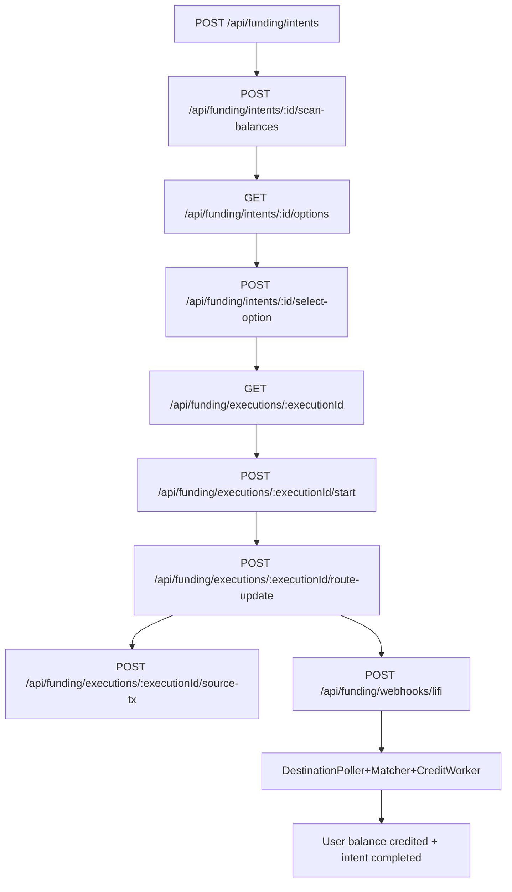

# Funding abstraction (`/api/funding`)

RetroPick supports a funding “abstraction” API that helps users get USDC onto the settlement chain, tracks route execution state, and credits an internal balance when destination USDC arrives.

This doc describes the **v2 abstraction** surface mounted at `/api/funding/*` (not the legacy `/api/v1/funding/*`).

## Components

- API surface: `apps/backend/internal/api/funding_abstraction.go`
- Core service: `apps/backend/internal/funding/service.go`
- Background workers:
  - `internal/funding/destination_poller.go`
  - `internal/funding/matcher_worker.go`
  - `internal/funding/credit_worker.go`
- Provider adapter (current): `internal/funding/lifi_provider.go`

## High-level state machine

## Access control model

Funding is wallet-scoped:

- Intent/execution access checks typically require the requesting principal (session/JWT) to match the intent owner.
- Websocket `deposit:{intentId}` channels are also owner-gated in `cmd/api/main.go`.

## Idempotency and transition guards

Several execution updates require an `idempotencyKey`:

- `/executions/:id/start`
- `/executions/:id/route-update`
- `/executions/:id/source-tx`

The API persists a transition guard row keyed by `(funding_intent_id, to_status, idempotency_key)` and returns `409 DUPLICATE_TRANSITION` when a duplicate is detected.

This ensures client retries do not accidentally advance state multiple times.

## LI.FI webhook verification

`POST /api/funding/webhooks/lifi` optionally checks:

- `X-Lifi-Webhook-Secret` header equals `LIFI_WEBHOOK_SECRET`

If `LIFI_WEBHOOK_SECRET` is unset, the webhook endpoint accepts unauthenticated requests (intended only for non-production environments or behind additional perimeter controls).

## Realtime integration (`deposit:{intentId}`)

When route options are computed (`EnsureRouteOptions`), the backend emits a realtime event:

- channel: `deposit:{intentId}`
- type: `deposit_options_ready`

This is inserted into `realtime_events` and notified via `pg_notify`, enabling the websocket layer to push updates to the client without polling.

## Internal balance crediting + market entry

Once destination USDC is detected and matched to an intent/execution, the credit worker updates:

- balance ledger rows (idempotent keys)
- `user_balances` available/locked amounts

The API also supports entering a market from internal balance:

- `POST /api/markets/{marketId}/enter`

This path enforces a safety buffer (`MARKET_ENTRY_SAFETY_BUFFER`) so users cannot enter too close to lock time.

## Source pointers

- `apps/backend/internal/api/funding_abstraction.go`
- `apps/backend/internal/funding/service.go`
- `apps/backend/internal/funding/*worker*.go`

