# RetroPick V2 — Architecture Redesign

**Senior technical review and target architecture for the RetroPick monorepo**

Scope: this is a redesign of the *existing* event-driven, pool-based prediction market protocol. It is **not** a rewrite into a CLOB, and it deliberately rejects parts of the Polymarket-inspired research report that push you toward premature service decomposition. Everything here assumes a small team and a cheap VPS.

---

## 1. Executive Technical Diagnosis

RetroPick V1 is, frankly, *better architected than most seed-stage protocols*. You already have the three things teams usually get wrong: on-chain authoritative settlement, a clean indexer→Postgres projection model, and durable realtime replay via `realtime_events.seq`. Postgres-as-single-source-of-truth with `NOTIFY` fanout is the correct call at your scale, and the research report's instinct to bolt on Redis, a matching engine, and a Gamma/CLOB/Data three-API split is **over-engineering for where you are**. Resist it.

The real problems are not the big architectural bets — they're the *boundaries*. Specifically:

1. **The contract dispatcher is too clever.** A hybrid "some selectors root-owned, 28 selectors delegatecall across 3 modules, wired by a script matrix" is a storage-collision and upgrade-safety footgun that buys you very little versus a cleaner diamond-lite or plain-module split. This is your single largest *security* risk.
2. **`cmd/api` is a god-binary.** It serves REST + WebSocket + *embedded funding workers*. That couples your user-facing latency to background job health and makes horizontal scaling impossible without splitting later under duress.
3. **Domain logic is smeared across `internal/`** with unclear ownership. `internal/marketdata`, `internal/priceworker`, `internal/funding` each mix ingestion, storage, and serving concerns. There's no repository layer and no event-bus abstraction — the indexer writes projections *and* keeper jobs *and* realtime envelopes inline, so a change to one risks all three.
4. **Shared packages leak.** Nine TS packages, several (`@retropick/pricing`, `@retropick/resolution-core`) re-implement on-chain math off-chain. Every time the contracts change, you have a silent drift risk between Solidity and TypeScript with no test enforcing equivalence.
5. **Frontend reads from too many sources.** fe-v1 reads indexed API, live RPC (`?source=live`), *and* direct viem calls. Three truth sources in one UI is a correctness hazard (the report flags this too, correctly).
6. **TrustedReporter is a CLI, not a system.** `cmd/reporter` signs payloads, but there's no identity registry, no review queue, no conflict detection, no audit chain. This is fine for a demo and dangerous for real money.

**Verdict:** keep the macro-architecture, fix the boundaries. Do **not** decompose into microservices. Split the *one* god-binary, introduce a thin repository + event-bus layer, simplify the contract dispatcher, and harden TrustedReporter into a real workflow. That's the whole job.

---

## 2. Current Architecture Map

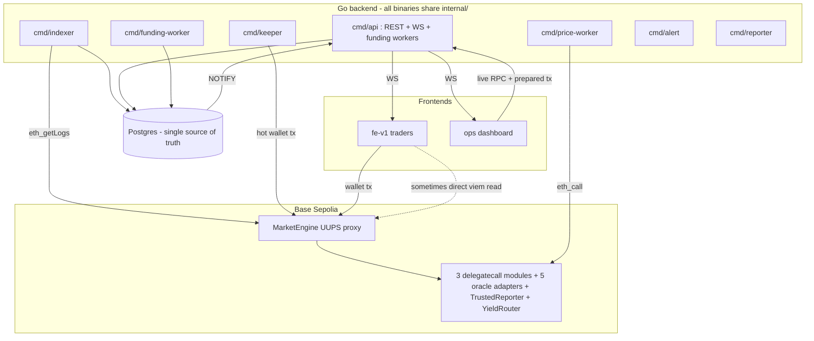

**The smell, visually:** `cmd/api` has four responsibilities, fe-v1 has three read paths to truth, and every backend binary reaches into a shared `internal/` with no domain walls.

---

## 3. Main Architectural Problems (ranked by blast radius)

| # | Problem | Layer | Severity | Why it bites |
|---|---------|-------|----------|--------------|
| 1 | Hybrid dispatcher + selector matrix | Contracts | **Critical** | Storage layout + upgrade mistakes are unrecoverable; hardest thing to audit |
| 2 | `cmd/api` embeds funding workers | Backend | **High** | Background job stall degrades user API; can't scale reads independently |
| 3 | No repository / event-bus abstraction | Backend | **High** | Indexer couples projection + scheduling + realtime writes |
| 4 | Off-chain re-implements on-chain math | Shared | **High** | Silent Solidity↔TS drift → wrong payouts shown to users |
| 5 | Three frontend truth sources | Frontend | **High** | Users see contradictory state; "is this final?" is ambiguous |
| 6 | TrustedReporter is a CLI, not a workflow | Backend/Ops | **High** | No audit, no conflict detection on money-moving resolutions |
| 7 | Unclear `internal/` ownership | Backend | Medium | Every change is a cross-cutting change; slows everyone |
| 8 | 9 shared packages, fuzzy purpose | Shared | Medium | Build graph complexity, circular-dep risk |
| 9 | Ops can trigger live RPC freely | Ops | Medium | No mandatory simulate→confirm→log gate on dangerous reads/writes |
| 10 | No idempotency keys on keeper tx | Backend | Medium | Reorg or restart can double-submit lifecycle txs |

---

## 4. Proposed Target Architecture

The shape barely changes. The *boundaries* get hard walls. Key moves:

- **Split `cmd/api`** into `api` (REST+WS only, stateless, scalable) and move embedded funding workers into the existing `funding-worker` binary.
- **Introduce `internal/platform/`** (db, bus, chain, config, log, metrics) and **`internal/domain/`** (market, epoch, oracle, funding, reporter, realtime) with a strict rule: *domains depend on platform, never on each other; binaries wire domains together.*
- **Add a thin event-bus interface** so the indexer emits domain events and *subscribers* (projection writer, keeper scheduler, realtime publisher) react independently. At your scale the bus is just Postgres + an in-process dispatcher — no Kafka, no NATS.
- **Simplify the contract dispatcher** to a clean module split with a single documented storage struct (details in §8).
- **Collapse fe-v1 to one truth source by default** (indexed API), with live RPC as an explicit, visually-flagged operator/debug action only.
- **Promote TrustedReporter** from CLI to a backend domain with an identity registry, review queue, and audit chain (§10).

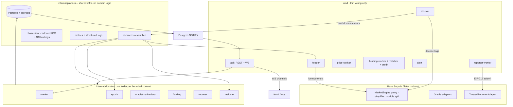

**Reference stance vs the research report:** the report's "Gamma / CLOB / Data API" split and Redis matching engine are the right idea *three product-stages from now*. Build the clean internal domain boundaries today so that split is a mechanical extraction later, not a rewrite. Concretely: your `market` domain *is* a future Gamma API; your `funding`+`epoch` is a future Data API; a CLOB module slots in beside `epoch` without touching either.

---

## 5. Recommended Monorepo Folder Structure

```
retropick/
├── apps/
│   ├── web/                      # renamed from fe-v1 (trader app)
│   ├── ops/                      # operator dashboard
│   ├── docs/                     # MDX docs
│   └── landing/                  # marketing + waitlist
│
├── services/                     # renamed from "apps/backend" — it's services, not an app
│   └── backend/
│       ├── cmd/                  # THIN wiring only, no logic
│       │   ├── api/              # REST + WS (no workers)
│       │   ├── indexer/
│       │   ├── keeper/
│       │   ├── price-worker/
│       │   ├── funding-worker/   # absorbs matcher + credit + poller
│       │   ├── reporter-worker/  # renamed from reporter; now a worker
│       │   ├── alert/
│       │   └── migrator/
│       ├── internal/
│       │   ├── platform/         # NO domain logic lives here
│       │   │   ├── db/           # pgx pool, sqlc output, tx helpers
│       │   │   ├── bus/          # event bus interface + in-proc impl
│       │   │   ├── chain/        # failover RPC, ABI bindings, eth_call
│       │   │   ├── config/       # env loading, validation
│       │   │   ├── obs/          # metrics, logging, tracing
│       │   │   └── httpx/        # middleware: auth, ratelimit, cors, csrf
│       │   └── domain/           # bounded contexts; depend on platform only
│       │       ├── market/       # templates, market read models  (future Gamma)
│       │       ├── epoch/        # epoch lifecycle, positions, claims
│       │       ├── oracle/       # adapters health, candles, checkpoints
│       │       ├── funding/      # intents, LI.FI, match, credit ledger
│       │       ├── reporter/     # identity, queue, evidence, signing
│       │       └── realtime/     # envelope writer, channel naming, replay
│       ├── migrations/           # versioned .sql (was sql/schema.sql)
│       └── api/                  # OpenAPI spec + generated types
│
├── contracts/                    # renamed from contracts/legacy-pool-v1 (standard name)
│   ├── src/
│   │   ├── engine/               # dispatcher + state (simplified, §8)
│   │   ├── modules/              # lifecycle modules
│   │   ├── oracle/               # adapters + TrustedReporter
│   │   ├── logic/                # Resolvers, SettlementLogic, MarketMath
│   │   └── types/                # MarketTypes
│   ├── script/                   # deploy + wiring
│   ├── test/
│   └── out/abi/                  # canonical ABI output (single source)
│
├── packages/                     # SHARED TS — minimized, no logic dupes
│   ├── contracts/                # address registry + generated ABI types ONLY
│   ├── sdk/                      # NEW: typed REST+WS client (replaces ad-hoc api lib)
│   ├── market-types/             # enums mirrored from Solidity (codegen, §8)
│   └── event-core/               # realtime envelope + channel naming
│
├── infra/
│   ├── compose/                  # docker-compose.{dev,prod}.yml
│   ├── caddy/                    # reverse proxy config
│   └── scripts/                  # retro CLI, backup, deploy
│
├── .github/workflows/
└── DECISIONS.md                  # architecture decision log (keep this!)
```

### What moves, merges, splits, dies

| Action | Item | Rationale |
|--------|------|-----------|
| **Split** | `cmd/api` → `api` + funding logic into `funding-worker` | Decouple user latency from jobs |
| **Merge** | `internal/priceworker` + `internal/marketdata` → `domain/oracle` | One bounded context for feeds/candles |
| **Merge** | matcher + credit + poller → `cmd/funding-worker` | One funding pipeline, one process |
| **Promote** | `cmd/reporter` → `domain/reporter` + `cmd/reporter-worker` | CLI → real workflow |
| **Kill** | `@retropick/pricing`, `@retropick/resolution-core` as *logic* | Replace with read-only projections from chain; stop duplicating Solidity |
| **Kill** | `@retropick/equivalence-engine`, `@retropick/hyperliquid` (for now) | Not needed for pool-based MVP; archive |
| **Rename** | `apps/backend` → `services/backend`, `contracts/legacy-pool-v1` → `contracts`, `fe-v1` → `web` | Standard names, less cognitive load |
| **Create** | `packages/sdk` | Single typed client both apps use |
| **Create** | `internal/platform/bus` | The missing abstraction |

### Import boundary rules (enforce in CI with `depguard` for Go, eslint for TS)

1. `cmd/*` may import `internal/domain/*` and `internal/platform/*`. Nothing else.
2. `internal/domain/X` may import `internal/platform/*`. **Never** `internal/domain/Y`.
3. Cross-domain coordination happens **only** via the bus or in `cmd/*` wiring.
4. `packages/*` TS may not import `apps/*`. `apps/*` import `packages/*` freely.
5. Frontend never imports backend Go (obviously) — contract is the OpenAPI/`sdk`.

---

## 6. Backend Module Redesign

### 6.1 The platform layer (new)

```go
// internal/platform/bus/bus.go
package bus

type Event interface{ Topic() string }

type Handler func(ctx context.Context, e Event) error

type Bus interface {
    Publish(ctx context.Context, e Event) error
    Subscribe(topic string, h Handler)
}
// In-process implementation backed by a buffered channel + worker pool.
// Durability comes from Postgres (events are persisted before publish);
// the bus is for in-proc fanout, not delivery guarantees across restarts.
```

Why in-process and not Kafka/NATS: at hundreds of markets and daily users, a network message broker is pure operational tax. The *durability* you need already exists in `chain_events` and `realtime_events`. The bus only decouples code, not processes. When you genuinely need cross-process pub/sub (thousands of concurrent WS clients across multiple API instances), swap the in-proc impl for Postgres `LISTEN/NOTIFY` or Redis pub/sub behind the same `Bus` interface — zero domain code changes.

### 6.2 Domain modules — clean interfaces

Each domain exposes a `Service` (use-cases) and a `Repository` (data access). Example:

```go
// internal/domain/epoch/service.go
package epoch

type Repository interface {
    GetEpoch(ctx context.Context, templateID string, epochID uint64) (*Epoch, error)
    UpsertEpoch(ctx context.Context, e *Epoch) error
    DueForLifecycle(ctx context.Context, now time.Time) ([]LifecycleJob, error)
}

type Service struct {
    repo Repository
    bus  bus.Bus
}

// ApplyEpochOpened is called by the indexer's projection subscriber.
func (s *Service) ApplyEpochOpened(ctx context.Context, ev chain.EpochOpened) error {
    // 1. write projection via repo
    // 2. publish epoch.opened on bus (keeper + realtime react independently)
}
```

The indexer no longer writes projections + keeper jobs + realtime inline. It decodes a log into a `chain.Event` and publishes. Subscribers own their side effects:

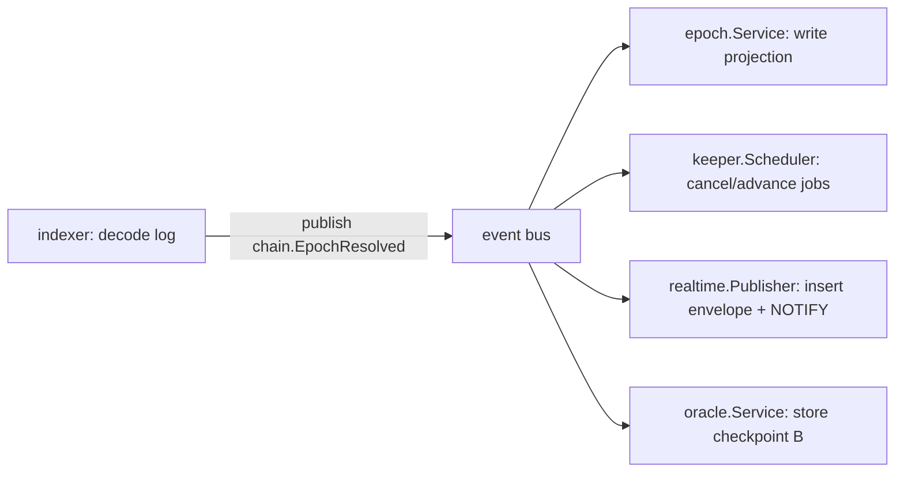

### 6.3 Indexer pipeline (idempotency + reorg safety)

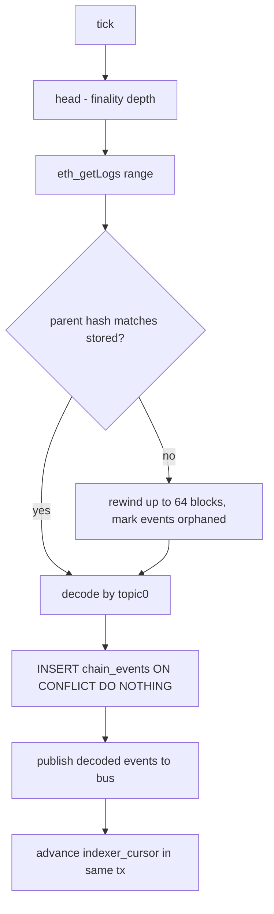

Idempotency key: `(block_hash, log_index)` unique constraint on `chain_events`. Reorg handling: store `block_hash` per indexed block in `indexer_blocks`; on mismatch, rewind and re-apply. Projections must be **derived purely** from `chain_events` so a rewind+replay is always safe.

### 6.4 Keeper lifecycle (no double-submit)

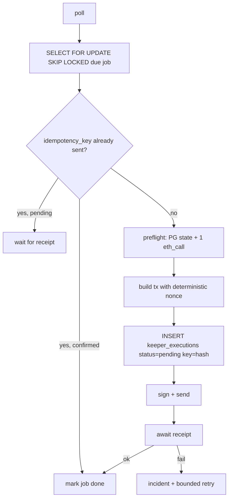

`idempotency_key = keccak(templateID, epochID, action, target_block_bucket)`. Before sending, check `keeper_executions` for a row with that key. This survives restarts and reorgs.

### 6.5 Cache layer (yes, in-memory; no, not Redis yet)

The report wants Redis. You don't need it. Add a tiny in-process snapshot cache in the `api` binary for hot market reads:

```go
// internal/platform/cache/snapshot.go — TTL map, per-market market snapshot
// Invalidated by realtime envelope (same NOTIFY that drives WS) — so it's
// never stale longer than one event. Falls back to Postgres on miss.
```

When you run >1 `api` instance, this per-process cache is still correct because invalidation rides the same `NOTIFY` every instance already listens to. **Adopt Redis only when** (a) you run ≥3 API instances and per-process cache duplication wastes meaningful RAM, or (b) you need cross-instance pub/sub for WS fanout. Put it behind the `Bus` and `Cache` interfaces so it's a config swap.

### 6.6 Cross-cutting

| Concern | Approach |
|---------|----------|
| Error handling | Sentinel errors per domain; `errors.Is/As`; never `panic` in handlers |
| Retries | Exponential backoff with jitter, capped, in `platform/retry` |
| Idempotency | DB unique keys (chain_events, keeper_executions, funding_executions) |
| Reorg safety | Pure projections from `chain_events`; rewind+replay |
| Observability | Prometheus `/metrics` per binary; structured JSON logs; request IDs |
| Rate limiting | Token bucket in `httpx` middleware, per-IP + per-API-key |
| Abuse protection | WS subscription cap per connection; reject unknown channels |
| API versioning | URL prefix `/api/v1`; freeze v1, additive-only; cut v2 only on breaking change |

---

## 7. Frontend Module Redesign

### 7.1 Folder structure (apps/web)

```
apps/web/src/
├── app/                    # Next shell, layout, providers (thin)
├── features/               # one folder per user-facing capability
│   ├── markets/            # discovery + detail
│   ├── trade/              # deposit/switch flows
│   ├── portfolio/          # positions, claims, PnL
│   ├── resolution/         # resolution views
│   └── activity/
├── entities/               # domain models + their hooks (market, epoch, position)
├── shared/
│   ├── api/                # uses packages/sdk; NO raw fetch
│   ├── chain/              # wagmi/viem write hooks ONLY (no reads by default)
│   ├── realtime/           # useRealtime() → React Query invalidation
│   └── ui/                 # design-system components
└── providers/              # query, web3, auth, i18n
```

### 7.2 One truth source

**Rule:** the UI reads indexed state via `packages/sdk`. Wallet writes go to chain. Live RPC reads are an **operator/debug-only** affordance, never in the default trader path.

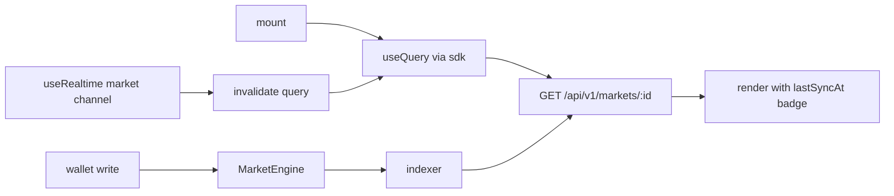

### 7.3 Optimistic deposit UX (safe version)

On `depositToSide`, optimistically render a *pending* position tagged `unconfirmed`, but **never** show it as claimable/final. Reconcile when the indexer confirms via WS. If no confirmation within N blocks, surface a "still confirming" state, not an error.

```mermaid
sequenceDiagram
  participant UI
  participant Wallet
  participant Chain
  participant Indexer
  UI->>Wallet: depositToSide(...)
  Wallet->>Chain: tx
  UI->>UI: add optimistic position (state=pending)
  Chain->>Indexer: PositionDeposited
  Indexer-->>UI: WS envelope (seq)
  UI->>UI: replace optimistic → confirmed; reconcile by seq
```

### 7.4 Degraded-state handling (must be explicit)

| Condition | Source signal | UI behaviour |
|-----------|---------------|--------------|
| Protocol paused | `globalPaused` in API meta | Global banner; disable writes |
| Rolling market halted | epoch state `halted` | Market-level banner; no deposits |
| Oracle feed stale | feed `lastUpdate` age > threshold | Show "price may be stale"; block resolution-dependent actions |
| Unresolved past lock | epoch `locked`, no `winningOutcome` | "Awaiting resolution" state, not error |
| Indexer behind | `lastSyncAt` age | "Syncing…" badge; soften staleness |

The current `?source=live` escape hatch stays — but only the **ops** app uses it, behind the simulate→confirm gate (§9).

---

## 8. Smart Contract Integration Strategy

### 8.1 Is the dispatcher good or too complex?

**Too complex.** The hybrid "root-owned hot paths + 28 delegated selectors wired by a script matrix across 3 modules, all sharing `MarketEngineState`" is the most fragile thing you own. Delegatecall + shared storage means *any* storage layout drift between dispatcher and a module corrupts funds, and the selector matrix is an off-chain script that must stay perfectly in sync with on-chain wiring. That's a lot of unaudited coordination for a pool-based protocol that isn't even a CLOB yet.

### 8.2 What to keep, simplify, isolate

| Keep | Simplify | Isolate |
|------|----------|---------|
| UUPS upgradeability | Collapse to **one documented storage struct** with explicit gap slots | Oracle adapters stay external (good already) |
| Pure libraries (`Resolvers`, `MarketMath`, `SettlementLogic`) | Reduce 3 lifecycle modules → **2**: `Lifecycle` (manual+rolling) and `View` | YieldRouter stays external & optional |
| External adapter pattern | Move user ops (deposit/switch/claim) fully **root-owned**, never delegated | TrustedReporter stays its own adapter |

Recommendation: adopt a **disciplined module split with a single canonical storage contract** and *generate* the selector→module map from the Solidity interface at build time (not a hand-maintained matrix). If you ever truly need many modules, migrate to a real audited **EIP-2535 Diamond** rather than a bespoke dispatcher — don't invent halfway-diamonds.

**Build-now:** money paths (deposit, switch, claim, resolve, settlement) are root-owned, directly in the dispatcher implementation, fully tested with invariant tests. **Build-later:** additional market-type modules. **Do-not-build-yet:** CLOB module, on-chain order matching.

### 8.3 How the backend should talk to contracts

- **Reads:** default through indexed projections. Live `eth_call` only for ops verification and keeper preflight.
- **Writes:** only the keeper (lifecycle) and reporter-worker (resolution) hold keys. Users sign their own deposits via wallet.
- **Bindings:** generate Go bindings with `abigen` and TS types from the **same** `contracts/out/abi/` directory in CI. One ABI source, two generated consumers. Fail CI if ABI changes without regenerating bindings.

### 8.4 ABI generation & type-safety (kills problem #4)

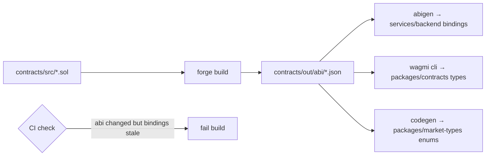

This is how you stop off-chain math drifting from on-chain truth: enums and types are *generated*, not hand-written, and `@retropick/pricing`/`resolution-core` are demoted from "logic" to "render projected values the indexer already computed from events."

### 8.5 Security risks (contract)

| Risk | Current | Mitigation |
|------|---------|------------|
| Storage collision | Hybrid dispatcher + modules share state | Single storage struct + `__gap`; storage-layout CI check (`forge inspect`) |
| Selector misroute | Hand-wired matrix | Generate map from interface; assert on-chain wiring in deploy script |
| `workerAuthority` key compromise | Hot wallet keeper | Dedicated low-balance key; per-action allowlist; alerting on unexpected calls |
| TrustedReporter abuse | Single signer | Multi-sig or 2-of-3 off-chain (§10); on-chain nonce replay guard |
| Deposit executor relay | `depositToSideFor` | Tight allowlist of executor addresses; amount caps |
| Upgrade mistake | UUPS admin | Timelock on upgrades before mainnet; upgrade simulation in CI |
| Admin over-powered | One `admin` role | Split into `pauser`, `configurer`, `upgrader`; multi-sig the upgrader |

### 8.6 Clean market templates & resolution configs

Define templates as **declarative config** validated off-chain *and* on-chain:

```jsonc
// market catalog entry (off-chain source → on-chain upsertTemplate)
{
  "slug": "btc-usd-1h-direction",
  "marketType": "Direction",
  "oracle": { "kind": "CHAINLINK", "feed": "BTC/USD", "heartbeat": 3600 },
  "epoch": { "mode": "rolling", "duration": 3600, "lockBuffer": 30 },
  "fees": { "switchBps": 50, "settlementBps": 100 },
  "resolution": { "source": "oracle", "checkpoints": ["A@lock", "B@resolve"] }
}
```

Resolution config is part of the template, versioned, and the `equivalence` check (which feed/template pairs are equivalent) becomes a *validator test*, not a runtime engine.

### 8.7 Future-proofing for mainnet + CLOB

- Mainnet: add upgrade timelock, multi-sig admin, real oracle heartbeats, and a guarded launch (caps on deposits) before lifting limits.
- CLOB: the pool-based engine and a future order-book engine are **sibling modules** behind the same dispatcher and the same API shape (§12). Pool markets and order-book markets can coexist; the API returns a `marketModel` discriminator. **Do not build the CLOB until pool markets have real volume.**

---

## 9. Ops Dashboard Design

Principle (non-negotiable): **the ops dashboard never silently executes dangerous actions.** Every privileged action follows: *prepare calldata → show role checklist → run simulation/preflight → require explicit operator confirmation → log immutably.*

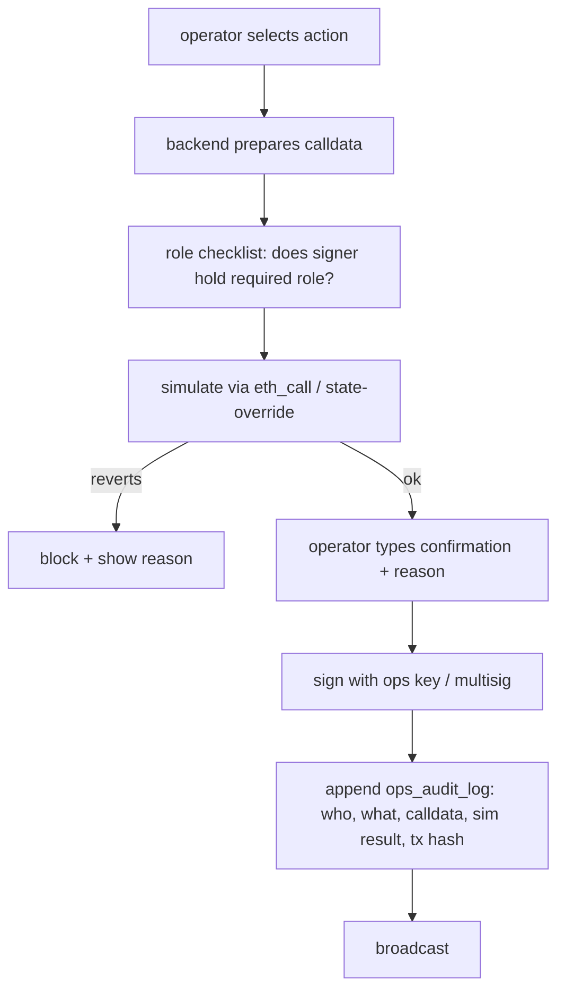

### Pages

| Page | Purpose | Key safety feature |
|------|---------|--------------------|
| Market launch | Create templates from catalog | Validates config; dry-run upsert |
| Template registry | View/version templates | Diff vs on-chain |
| **Reporter queue** | Review + sign outcomes | Conflict detection, evidence panel (§10) |
| Keeper schedule | Due/recent lifecycle jobs | Shows idempotency status |
| Oracle/feed health | Feed freshness, deviation | Stale-feed alarms |
| Incident dashboard | Open incidents, ack/resolve | Links to triggering event |
| Reorg/indexer health | Cursor lag, last reorg depth | Indexed-vs-chain diff |
| Live diff | On-demand indexed vs `eth_call` | Read-only; rate-limited |
| Prepared tx catalog | All privileged calldata | No execute without sim+confirm |
| Admin audit log | Immutable action history | Append-only, exportable |
| Market risk scoring | Flag thin pools / odd flow | Heuristic, advisory |
| Resolution evidence | Per-market proof bundle | Required before sign |
| Funding/deposit monitor | Intent → credit pipeline | Stuck-intent alerts |
| Realtime activity feed | Live envelope stream | Operator JWT channel |

---

## 10. TrustedReporter — Full Architecture

Today it's `cmd/reporter` signing payloads. Target: a real `domain/reporter` with identity, workflow, and audit.

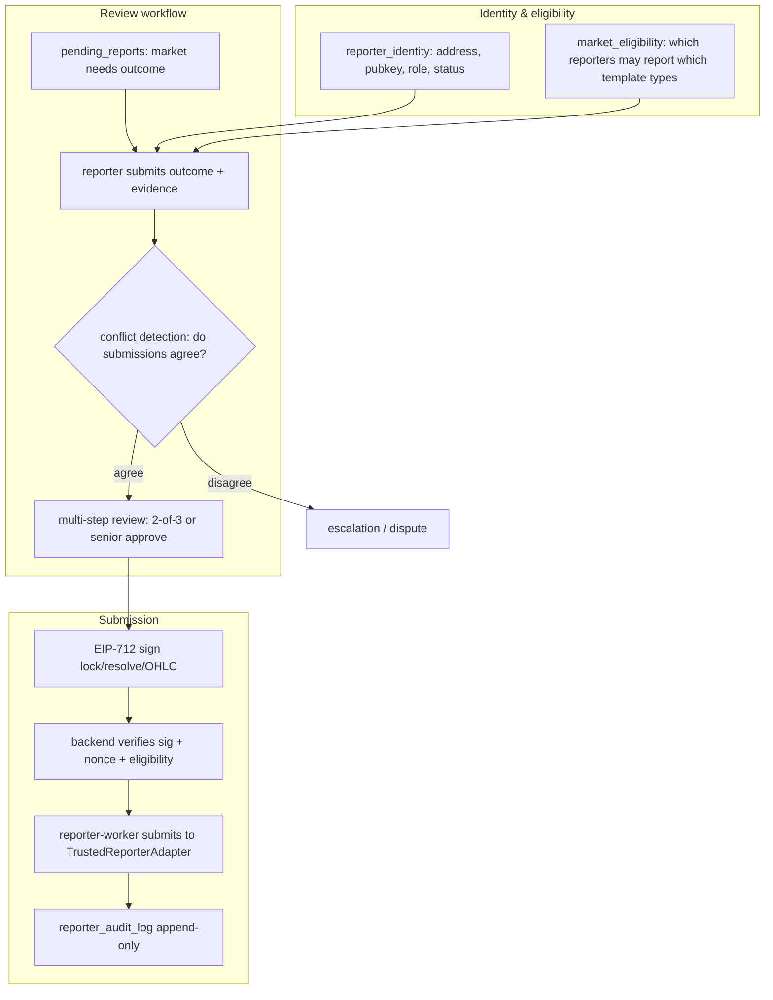

### Components

| Component | Responsibility |
|-----------|----------------|
| Reporter identity registry | `reporter_identity(id, address, pubkey, role, status, created_at)` |
| Roles | `junior` (submit only), `senior` (approve), `admin` (manage reporters) |
| Market eligibility | Which reporter roles may resolve which market types (Corridor/Cascade need OHLC-capable reporters) |
| Evidence schema | `{ source_url, source_hash, observed_value, observed_at, method }` — required, hashed |
| EIP-712 signing | Domain-separated payloads for `lock`, `resolve`, `OHLC submit` |
| Review queue | Multi-step: submit → conflict check → approve → sign → submit |
| Conflict detection | If two reporters submit divergent outcomes/values, freeze and escalate |
| Outcome submission | Single binary/scalar outcomes |
| OHLC submission | For Corridor/Cascade — array of candles, validated for monotonic time |
| Backend verification | Verify signature, eligibility, nonce, evidence completeness before on-chain |
| On-chain submission | `reporter-worker` calls `TrustedReporterAdapter` (keeper-style, idempotent) |
| Audit log | Append-only: who submitted, who approved, evidence hash, tx hash |
| Manual override | `admin` can override only with reason + second approver; always logged |
| Dispute/escalation | Frozen markets get an escalation record; resolution paused pending decision |

### Migration path to UMA / optimistic oracle

Keep the `Resolver` interface abstract. TrustedReporter is one implementation; UMA's optimistic oracle is another. When you migrate: add a `UMAResolverAdapter`, route new markets to it, and let TrustedReporter markets age out. The domain/reporter audit chain becomes your dispute-evidence archive. **Do not build UMA integration now** — the multi-sig reporter is correct for current scale (the research report agrees, and it's right here).

---

## 11. Realtime, Cache & Chart Architecture (cheap + fast)

Keep Postgres as durable source of truth. **Do not add Redis yet.** Here's the cheap-VPS design that still feels instant.

### Channels (extend current scheme)

| Channel | Audience | Payload |
|---------|----------|---------|
| `global:markets` | all | market list deltas, pause state |
| `market:{templateId}` | market viewers | pool sizes, epoch state |
| `epoch:{templateId}:{epochId}` | active traders | lock/resolve transitions |
| `chart:{feedId}` | chart viewers | new candle / live tick |
| `oracle:{feedId}` | ops + traders | feed health, staleness |
| `user:{wallet}` | one user | their positions, claims |
| `deposit:{intentId}` | one user | funding pipeline progress |
| `ops:*` | operators (JWT) | incidents, activity |

### Sequence numbers & replay (you already have this — formalize it)

`realtime_events.seq` is monotonic per channel. Client stores last seq; on reconnect sends `resume?after=seq`; server replays missed envelopes from Postgres, then resumes live. This is *better* than what most teams build with Redis and you already have it — protect it.

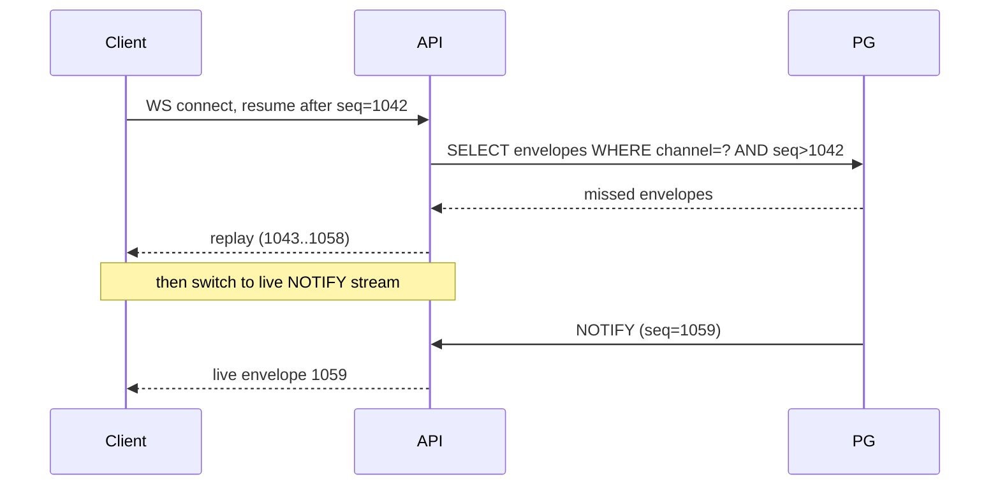

### Charts (fast reload, cheap)

- Precompute candles in Postgres on the price-worker tick into `price_candles(feed_id, resolution, ts, o,h,l,c,v)`.
- Serve `GET /api/v1/markets/:id/candles?resolution=1m&range=1d` with **ETag + Cache-Control**; candles are immutable once closed, so HTTP caching does the heavy lifting for free.
- Live (incomplete) candle rides the `chart:{feedId}` WS channel.
- Probability history = pool-ratio series stored as `probability_points` (already exists) — same caching story.

### Hot snapshot cache + invalidation

- In-process TTL cache of the per-market snapshot in the `api` binary.
- Invalidate on the **same NOTIFY** that drives WS — so cache is never staler than one event.
- Multi-instance safe (every instance listens to NOTIFY).

### HTTP caching for public metadata

| Endpoint | Cache strategy |
|----------|----------------|
| `GET /markets` (list) | `Cache-Control: public, max-age=5` + ETag |
| `GET /markets/:id` (meta) | ETag; revalidate; WS drives live fields |
| `GET /markets/:id/candles` (closed) | `max-age=300, immutable` |
| `GET /markets/:id/probability` | ETag, short max-age |

### When to actually add Redis

Add it (behind the existing `Bus`/`Cache` interfaces) only when **any** of: ≥3 API instances, >~5k concurrent WS clients, or per-process snapshot RAM becomes the bottleneck. Until then it's cost and ops burden with no payoff.

---

## 12. Developer API Design

API shape inspired by Polymarket's clean separation, **but pool-based**, and structured so a CLOB module can slot in later without breaking v1. One service today; the grouping below is how it later extracts into Gamma/Data/CLOB-style services with no client rewrite.

### Public Market API (future "Gamma")

| Route | Returns |
|-------|---------|
| `GET /api/v1/markets` | List w/ filters (type, status, oracle); paginated, cacheable |
| `GET /api/v1/markets/:templateId` | Market metadata + current epoch summary |
| `GET /api/v1/markets/:templateId/epochs` | Epoch history |
| `GET /api/v1/epochs/:templateId/:epochId` | Single epoch detail (pools, state) |
| `GET /api/v1/markets/:templateId/probability` | Pool-ratio probability series |
| `GET /api/v1/markets/:templateId/candles` | OHLC candles (oracle feed) |
| `GET /api/v1/markets/:templateId/resolution` | Resolution evidence + outcome |

### User / Portfolio API (future "Data")

| Route | Returns |
|-------|---------|
| `GET /api/v1/user/:wallet/positions` | Open positions across markets |
| `GET /api/v1/user/:wallet/claims` | Claimable + claimed |
| `GET /api/v1/user/:wallet/portfolio` | PnL summary |
| `GET /api/v1/activity` | Recent fills/deposits/claims feed |

### Tx prepare (pool-model writes; non-custodial)

| Route | Returns |
|-------|---------|
| `POST /api/v1/tx/prepare/enter` | Unsigned calldata for `depositToSide` |
| `POST /api/v1/tx/prepare/switch` | Unsigned calldata for `switchSide` |
| `POST /api/v1/tx/prepare/claim` | Unsigned calldata for `claim`/`claimMany` |
| `POST /api/v1/tx/submit` | Record submitted tx hash for tracking |

### Reporter API (trusted, authenticated)

| Route | Auth | Returns |
|-------|------|---------|
| `GET /api/v1/reporter/pending` | reporter JWT | Markets awaiting outcome |
| `POST /api/v1/reporter/submit` | reporter JWT + EIP-712 | Submit outcome + evidence |
| `POST /api/v1/reporter/approve` | senior JWT | Approve a submission |

### Ops / private API

`GET/POST /api/v1/ops/*` — operator JWT only; live RPC, prepared tx, visibility, incidents. Never exposed publicly (network-level allowlist + auth).

### Developer WebSocket API

`wss://…/ws` — subscribe to channels from §11; supports `resume?after=seq`. Document channel schemas in the SDK.

### API key model & rate limits

| Tier | Auth | Rate limit |
|------|------|------------|
| Public read | none / optional key | 60 req/min/IP |
| Keyed read | API key | 600 req/min/key |
| User actions | SIWE session + CSRF | 30 writes/min |
| Reporter | JWT + EIP-712 | per-action |
| Ops | JWT (role) | internal |

### Example

```http
GET /api/v1/markets/btc-usd-1h-direction
ETag: "epoch-42-v3"
```
```jsonc
{
  "templateId": "0x…",
  "slug": "btc-usd-1h-direction",
  "marketModel": "pool",          // discriminator; future: "clob"
  "marketType": "Direction",
  "status": "open",
  "currentEpoch": {
    "epochId": 42,
    "state": "open",
    "lockAt": "2026-06-09T13:00:00Z",
    "pools": { "UP": "12840.0", "DOWN": "9310.0" },
    "impliedProbability": { "UP": 0.58, "DOWN": 0.42 }
  },
  "oracle": { "kind": "CHAINLINK", "feed": "BTC/USD", "lastUpdate": "…", "stale": false },
  "lastSyncAt": "2026-06-09T12:41:08Z",
  "globalPaused": false
}
```

**Do not** design the CLOB endpoints now. The `marketModel` discriminator and the route grouping are the only forward-compat you need.

---

## 13. Database Schema Additions

Additive only; existing tables stay.

```sql
-- Reorg safety: track block hashes per indexed block
CREATE TABLE indexer_blocks (
  block_number  BIGINT PRIMARY KEY,
  block_hash    BYTEA NOT NULL,
  parent_hash   BYTEA NOT NULL,
  indexed_at    TIMESTAMPTZ NOT NULL DEFAULT now()
);

-- Idempotent chain events (enforce the dedup you rely on)
ALTER TABLE chain_events
  ADD CONSTRAINT chain_events_log_unique UNIQUE (block_hash, log_index);

-- Keeper idempotency
CREATE TABLE keeper_executions (
  id              BIGSERIAL PRIMARY KEY,
  idempotency_key BYTEA NOT NULL UNIQUE,
  template_id     TEXT NOT NULL,
  epoch_id        BIGINT,
  action          TEXT NOT NULL,
  status          TEXT NOT NULL,          -- pending|confirmed|failed
  tx_hash         BYTEA,
  created_at      TIMESTAMPTZ NOT NULL DEFAULT now(),
  confirmed_at    TIMESTAMPTZ
);

-- TrustedReporter system
CREATE TABLE reporter_identity (
  id          BIGSERIAL PRIMARY KEY,
  address     BYTEA NOT NULL UNIQUE,
  pubkey      BYTEA,
  role        TEXT NOT NULL,              -- junior|senior|admin
  status      TEXT NOT NULL DEFAULT 'active',
  created_at  TIMESTAMPTZ NOT NULL DEFAULT now()
);

CREATE TABLE reporter_submissions (
  id            BIGSERIAL PRIMARY KEY,
  template_id   TEXT NOT NULL,
  epoch_id      BIGINT NOT NULL,
  reporter_id   BIGINT NOT NULL REFERENCES reporter_identity(id),
  outcome       JSONB NOT NULL,           -- {winningOutcome} or {ohlc:[...]}
  evidence      JSONB NOT NULL,           -- {source_url, source_hash, observed_at, method}
  evidence_hash BYTEA NOT NULL,
  signature     BYTEA NOT NULL,           -- EIP-712
  nonce         BIGINT NOT NULL,
  status        TEXT NOT NULL,            -- submitted|approved|conflict|submitted_onchain|rejected
  created_at    TIMESTAMPTZ NOT NULL DEFAULT now(),
  UNIQUE (template_id, epoch_id, reporter_id, nonce)
);

CREATE TABLE reporter_audit_log (
  id           BIGSERIAL PRIMARY KEY,
  submission_id BIGINT REFERENCES reporter_submissions(id),
  actor_id     BIGINT REFERENCES reporter_identity(id),
  action       TEXT NOT NULL,            -- submit|approve|reject|override|escalate
  reason       TEXT,
  tx_hash      BYTEA,
  created_at   TIMESTAMPTZ NOT NULL DEFAULT now()
);

-- Ops audit (immutable, append-only)
CREATE TABLE ops_audit_log (
  id          BIGSERIAL PRIMARY KEY,
  operator    TEXT NOT NULL,
  action      TEXT NOT NULL,
  calldata    BYTEA,
  sim_result  JSONB,
  tx_hash     BYTEA,
  reason      TEXT,
  created_at  TIMESTAMPTZ NOT NULL DEFAULT now()
);

-- Precomputed candles (chart speed)
CREATE TABLE price_candles (
  feed_id     TEXT NOT NULL,
  resolution  TEXT NOT NULL,             -- 1m|5m|1h|1d
  ts          TIMESTAMPTZ NOT NULL,
  o NUMERIC, h NUMERIC, l NUMERIC, c NUMERIC, v NUMERIC,
  PRIMARY KEY (feed_id, resolution, ts)
);
```

---

## 14. Event Flow Diagrams

### 14.1 End-to-end deposit (target)

```mermaid
sequenceDiagram
  participant U as User
  participant W as web (apps/web)
  participant API
  participant PG as Postgres
  participant BUS as event bus
  participant IDX as indexer
  participant CH as MarketEngine

  U->>W: deposit UP, 100 mSTK
  W->>API: POST /tx/prepare/enter
  API-->>W: unsigned calldata
  W->>CH: wallet sends tx
  W->>W: optimistic pending position
  CH->>IDX: PositionDeposited log
  IDX->>PG: INSERT chain_events (idempotent)
  IDX->>BUS: publish chain.PositionDeposited
  BUS->>API: epoch.Service writes projection
  BUS->>API: realtime.Publisher INSERT envelope + NOTIFY
  PG->>API: NOTIFY
  API-->>W: WS envelope (seq)
  W->>W: confirm position; clear optimistic
```

### 14.2 Resolution via TrustedReporter (target)

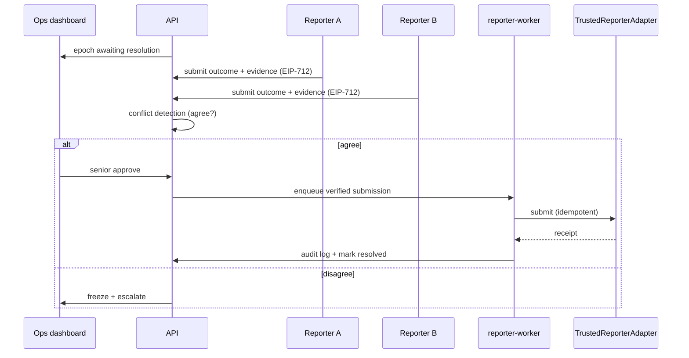

---

## 15. Deployment Architecture

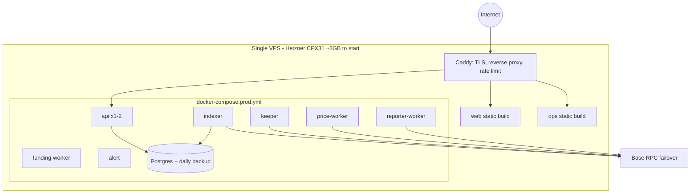

### Resource estimates

| VPS | RAM | Runs | Notes |
|-----|-----|------|-------|
| 2 GB | 2 GB | Postgres + api + indexer + price-worker | Dev/staging only; tight |
| 4 GB | 4 GB | + keeper + funding-worker + reporter-worker + alert | Viable production MVP |
| 8 GB | 8 GB | All above + headroom for Postgres cache + 2× api | **Recommended production start** |

**Split later** (only when needed): move Postgres to its own box first (it's the bottleneck), then run api behind a load balancer with ≥2 instances, then introduce Redis for cross-instance WS/cache. Not before.

### Postgres tuning (8GB box)

`shared_buffers=2GB`, `effective_cache_size=5GB`, `work_mem=32MB`, `maintenance_work_mem=256MB`, `max_connections=100` (use pgbouncer if api scales out). Daily `pg_dump` + WAL archiving to object storage; test restores.

---

## 16. CI/CD Plan

```mermaid
flowchart LR
  PR[Pull request] --> LINT[lint: golangci-lint, eslint, forge fmt]
  LINT --> DEP[depguard import-boundary check]
  DEP --> TEST[go test, forge test invariants, vitest]
  TEST --> ABI[ABI drift check: bindings regenerated?]
  ABI --> STORAGE[forge inspect storage-layout diff]
  STORAGE --> BUILD[build images]
  BUILD --> STAGING[deploy to staging on merge to main]
  STAGING --> SMOKE[smoke tests]
  SMOKE --> PROD[manual approve → prod deploy]
```

| Stage | Tooling | Gate |
|-------|---------|------|
| Lint | golangci-lint, eslint, forge fmt | block on error |
| Boundaries | depguard (Go), eslint-plugin-boundaries (TS) | block on cross-domain import |
| Tests | go test, forge test (+ invariant), vitest | coverage floor on money paths |
| ABI drift | custom CI script | fail if abi changed w/o regen |
| Storage layout | `forge inspect` diff vs main | fail on incompatible layout change |
| Deploy | GitHub Actions + compose pull | staging auto, prod manual approve |
| Secrets | GH encrypted secrets → env files on VPS (or SOPS) | never in repo |
| Zero-downtime | Caddy + rolling `docker compose up -d` per service; api drains WS | indexer/keeper are singletons — restart fast |

---

## 17. Security Review

| Area | Risk | Mitigation | Priority |
|------|------|------------|----------|
| Upgradeability | Bad UUPS upgrade bricks funds | Timelock + multi-sig upgrader + CI storage-layout check + upgrade sim | **Now (before mainnet)** |
| Keeper key | Hot wallet compromise | Dedicated low-balance key; action allowlist; anomaly alert | Now |
| Reporter trust | Single signer forges outcome | 2-of-3 / multi-sig; evidence required; conflict freeze; audit chain | Now |
| Deposit executor | Relay abused | Address allowlist + amount caps | Now |
| Admin scope | One omnipotent admin | Split roles (pauser/configurer/upgrader); multi-sig the dangerous ones | Now |
| API auth | Session/CSRF gaps | SIWE + CSRF token + secure cookies; JWT for ops/reporter | Now |
| Rate limiting | DoS / scraping | Token bucket per IP + key; WS subscription caps | Now |
| SQL injection | Input handling | sqlc parameterized everywhere; validate inputs in `httpx` | Ongoing |
| Secrets | Keys in repo/logs | SOPS or GH secrets; never log keys; `.env` not committed | Now |
| RPC trust | Single RPC lies/down | Failover RPC (you have `ethops`); cross-check critical reads | Now |
| Reorg | Double-apply / double-submit | Idempotency keys; pure projections; rewind+replay | Now |
| Ops actions | Silent dangerous execution | Mandatory simulate→confirm→log gate | Now |

---

## 18. 30-Day Implementation Roadmap

**Week 1 — Boundaries & safety nets (no behaviour change).**
- Introduce `internal/platform/` (db, config, obs, httpx); move shared infra in.
- Add CI: depguard import rules, ABI drift check, storage-layout diff.
- Add idempotency: `keeper_executions`, `chain_events` unique constraint, `indexer_blocks`.

**Week 2 — Split the god-binary.**
- Extract embedded funding workers out of `cmd/api` into `cmd/funding-worker` (absorb matcher/credit/poller).
- `cmd/api` becomes REST+WS only. Verify with load test.
- Introduce `internal/platform/bus` (in-proc) and route indexer→bus→subscribers.

**Week 3 — Domain extraction.**
- Carve `internal/domain/{market,epoch,oracle,funding,realtime}` with Service+Repository.
- Indexer publishes events; projection/keeper/realtime become independent subscribers.
- Add in-process snapshot cache + ETag/Cache-Control on public endpoints.

**Week 4 — TrustedReporter v1.**
- Build `domain/reporter` + tables (identity, submissions, audit).
- Reporter REST API + EIP-712 verify + `cmd/reporter-worker`.
- Ops reporter queue with conflict detection + evidence panel.

Outcome after 30 days: same features, hard boundaries, scalable api, real reporter workflow, reorg/keeper idempotency, contract untouched (lower risk).

---

## 19. 90-Day Architecture Roadmap

| Phase | Weeks | Focus |
|-------|-------|-------|
| Stabilize | 1–4 | (the 30-day plan above) |
| Contract simplification | 5–7 | Collapse modules to Lifecycle+View; single storage struct; generate selector map; full invariant tests; storage-layout CI |
| Ops hardening | 8–9 | simulate→confirm→log gate everywhere; ops_audit_log; role split (pauser/configurer/upgrader) |
| Frontend consolidation | 10–11 | One truth source; `packages/sdk`; degraded-state banners; safe optimistic deposits |
| Mainnet readiness | 12–13 | Upgrade timelock + multi-sig; guarded launch caps; oracle heartbeat enforcement; backup/restore drills |

**Explicitly NOT in 90 days:** CLOB, UMA oracle, Redis, Kafka/NATS, microservice split, multi-region. Each has a clean insertion point already designed; none is justified at current scale.

---

## 20. Cursor Implementation Plan (file-by-file)

Ordered tasks. Each is small enough for one Cursor session. `→` means "create"; `~` means "modify"; `␡` means "delete/archive".

### Phase 1 — Platform & CI

1. `→ services/backend/internal/platform/config/config.go` — typed env loader + validation; move scattered `os.Getenv`.
2. `→ services/backend/internal/platform/obs/log.go`, `metrics.go` — structured logger + Prometheus registry; `/metrics` handler.
3. `→ services/backend/internal/platform/httpx/{ratelimit.go,auth.go,csrf.go,cors.go,requestid.go}` — middleware; move from `internal/api`.
4. `~ services/backend/internal/api/*` — use `httpx` middleware instead of inline.
5. `→ services/backend/migrations/0002_idempotency.sql` — `indexer_blocks`, `keeper_executions`, `chain_events` unique constraint.
6. `→ .github/workflows/boundaries.yml` — depguard + eslint-boundaries.
7. `→ scripts/check-abi-drift.sh` and `→ .github/workflows/abi.yml` — fail on stale bindings.
8. `→ .github/workflows/storage-layout.yml` — `forge inspect` diff gate.

### Phase 2 — Split god-binary

9. `~ services/backend/cmd/api/main.go` — remove funding worker startup; api = router + ws only.
10. `~ services/backend/cmd/funding-worker/main.go` — start poller + matcher + credit loops here.
11. `→ services/backend/internal/platform/bus/bus.go` + `inproc.go` — interface + buffered impl + tests.
12. `~ services/backend/internal/indexer/indexer.go` — decode → `bus.Publish`; stop inline projection/keeper/realtime writes.

### Phase 3 — Domains

13. `→ internal/domain/epoch/{service.go,repository.go,model.go}` — move epoch logic; subscribe to `chain.Epoch*`.
14. `→ internal/domain/market/{service.go,repository.go}` — templates + read models.
15. `→ internal/domain/oracle/{service.go,repository.go,candles.go}` — merge `priceworker`+`marketdata`.
16. `→ internal/domain/realtime/publisher.go` — envelope insert + NOTIFY; subscribe to all domain events.
17. `~ internal/domain/funding/*` — wrap existing funding in Service+Repository shape.
18. `→ internal/platform/cache/snapshot.go` — TTL cache; invalidate on NOTIFY.
19. `~ internal/api/markets_handler.go` — add ETag + `Cache-Control`; read via snapshot cache.

### Phase 4 — TrustedReporter

20. `→ migrations/0003_reporter.sql` — identity, submissions, audit, ops_audit_log, price_candles.
21. `→ internal/domain/reporter/{service.go,repository.go,eip712.go,conflict.go}`.
22. `→ internal/api/reporter_handler.go` — `/reporter/pending|submit|approve`.
23. `~ cmd/reporter/main.go → cmd/reporter-worker/main.go` — verified-submission queue → on-chain (idempotent).
24. `→ apps/ops-web/src/features/reporter-queue/` — review UI, conflict flags, evidence panel.

### Phase 5 — Frontend & SDK

25. `→ packages/sdk/src/{rest.ts,ws.ts,types.ts}` — typed client from OpenAPI.
26. `~ apps/web` (rename from fe-v1) — restructure to `features/entities/shared`; route all reads through `sdk`.
27. `~ apps/web/src/shared/chain/*` — writes only; remove default-path direct viem reads.
28. `→ apps/web/src/shared/realtime/useRealtime.ts` — resume-after-seq; invalidate queries.
29. `~ apps/web` degraded-state banners (paused/halted/stale/syncing).

### Phase 6 — Contracts (highest care, do last, behind tests)

30. `~ contracts/src/engine/MarketEngineState.sol` — single documented storage struct + `__gap`.
31. `~ contracts/src/engine/` — collapse Core+Rolling → `LifecycleModule`; keep `ViewModule`.
32. `→ contracts/script/GenerateSelectorMap.s.sol` — derive selector→module from interface; assert wiring.
33. `→ contracts/test/invariant/` — settlement conservation, no-double-claim, pool↔reserve invariants.
34. `~ contracts/script/DeployProduction.s.sol` — add upgrade timelock + multi-sig admin wiring.
35. `␡ packages/{pricing,resolution-core,equivalence-engine,hyperliquid}` — archive; replace with generated types + projected values.

### Phase 7 — Infra

36. `~ infra/compose/docker-compose.prod.yml` — add reporter-worker; api scalable; healthchecks.
37. `→ infra/caddy/Caddyfile` — TLS, reverse proxy, per-route rate limits.
38. `→ infra/scripts/backup.sh` — pg_dump + WAL archive + restore test.

---

## Appendix — Where I disagree with the research report

The uploaded report is competent but generic in three places, and following it literally would hurt you:

1. **It pushes the Gamma/CLOB/Data three-service split now.** Premature. You're pool-based, not a CLOB. Build the *internal* domain boundaries (which I've specified) so that split is a later extraction, not a rewrite. The report even contradicts your own prompt, which says don't build the CLOB yet.
2. **It wants Redis + a matching engine early.** Unjustified at hundreds of markets / daily users. Your Postgres `NOTIFY` + `realtime_events.seq` replay is already a strong realtime design. Add Redis only at the specific triggers in §11.
3. **It treats TrustedReporter as a contract function + CLI.** Too thin for money. The real risk is workflow (identity, conflict, audit, escalation), which I've designed in §10 — the report's own "multi-sig vs single key" table is the right instinct but stops short of the system.

Where the report is **right** and I've kept it: multi-sig reporter over UMA for now, ETag/HTTP caching for market discovery, per-market WS channels, Prometheus+Grafana observability, and "defer UMA."