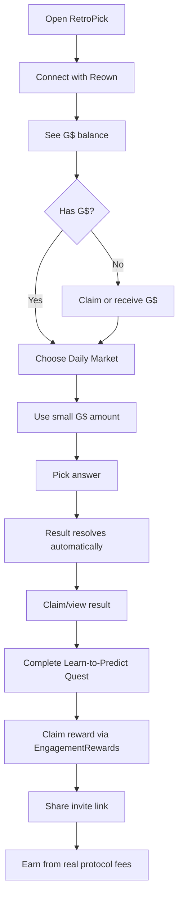

Betul — **referral system harus masuk ke core feature**, bukan dipisah. Kalau kita cut down berdasarkan **demand + peluang GoodBuilders + non-crypto UX**, maka RetroPick jangan bawa 10 fitur. Bawa **5 fitur inti saja**.

GoodBuilders application akan menilai G$ integration, build goal, milestones, growth goal, target users, usage data, dan ecosystem impact, jadi fitur yang dipilih harus langsung menunjukkan **G$ utility + user growth + measurable KPI**.  GoodDollar docs juga bilang project yang menunjukkan meaningful new integrations dengan GoodDollar Protocol eligible untuk GoodBuilders mentorship/funding. ([GoodDocs][1])

# Final 5 fitur yang harus diintegrasikan ke RetroPick

| Priority | Feature                                           | Why important                                                             | Build status |
| -------: | ------------------------------------------------- | ------------------------------------------------------------------------- | ------------ |
|        1 | **G$ Daily Micro-Markets**                        | Core G$ utility: user pakai G$ untuk market sederhana                     | MVP wajib    |
|        2 | **4-Level Referral Network Rewards**              | Growth engine: user, creator, community punya alasan distribusi RetroPick | MVP wajib    |
|        3 | **Claim-to-Predict Onboarding**                   | Non-crypto user bisa mulai dari claim/receive G$ → langsung coba market   | MVP wajib    |
|        4 | **Learn-to-Predict Quests via EngagementRewards** | Retention + education + reward activity, bukan hanya betting              | MVP wajib    |
|        5 | **GoodDollar Impact Dashboard**                   | Bukti untuk GoodBuilders: G$ volume, verified users, rewards, growth      | MVP wajib    |

Everything else masuk **Phase 2**, bukan GoodBuilders MVP.

---

# 1. G$ Daily Micro-Markets

Ini fitur nomor satu. Tanpa ini, RetroPick cuma terlihat seperti prediction market biasa. Dengan ini, RetroPick jadi:

```text
A real utility app for G$.
```

GoodDollar API docs menyebut builder bisa leverage G$ infrastructure untuk payments, identity solutions, wallet users, Claim UBI, React hooks, GoodWallet, dan GoodDapp. ([GoodDocs][1]) GoodDollar developer guide juga secara spesifik punya guide untuk integrate G$ token. ([GoodDocs][2])

**User flow:**

```text
Open RetroPick
→ Connect with Reown
→ See G$ balance
→ Pick daily market
→ Use 1–10 G$
→ Wait result
→ Claim if win
```

**Beginner market only:**

```text
Will BTC close above $65,000 today?
Will CELO stay above X today?
Will ETH be higher tomorrow?
Will Team X reach the next round?
```

Jangan expose semua 9 market types ke user biasa. RetroPick secara protocol memang punya many templates/markets dan open → lock → resolve → claim lifecycle, jadi kita cukup pilih template yang paling gampang dimengerti di frontend. 

**Keep for MVP:**

```text
Direction
Threshold
Range Close
```

**Hide for MVP:**

```text
Velocity
Ladder
Convergence
Composite
Corridor
Cascade
```

---

# 2. 4-Level Referral Network Rewards

Ini harus masuk karena demand growth RetroPick butuh distribution engine. Tapi wording-nya jangan “MLM.” Sebut:

```text
Invite Network Rewards
```

Core rule:

```text
Rewards only come from real RetroPick protocol fees.
No fee = no reward.
No reward from clicks.
No reward from fake signups.
```

Final economics:

```text
No referrer:
100% fee → RetroPick treasury

With referral tree:
Level 1 → 30%
Level 2 → 15%
Level 3 → 9%
Level 4 → 6%
Treasury → 40%

Missing levels go to treasury.
```

**Why this matters for business:**

```text
Creators punya alasan share.
Communities punya alasan onboard user.
Normal users punya alasan invite friends.
RetroPick tetap earn treasury revenue.
Fake signup tidak menghasilkan reward.
```

**UX untuk non-crypto:**

```text
Invite friends.
Earn when they use RetroPick.

You only earn from real platform activity.
No reward from fake accounts.
```

**System architecture:**

```text
MarketEngine fee
→ FeeRouter
→ TreasuryVault + RewardsVault
→ Backend calculates 4-level rewards
→ EngagementRewards claim flow
```

GoodDollar EngagementRewards app page itself is a client app shell in web crawl, but GoodDollar’s SDK repo shows `packages/engagement-sdk`, `packages/engagement-contracts`, and `apps/engagement-app`, so RetroPick should use it as reward claim/distribution layer, not as the market settlement source. ([GitHub][3])

---

# 3. Claim-to-Predict Onboarding

Ini fitur onboarding untuk non-crypto users.

Instead of:

```text
Deposit token, approve, stake, select market.
```

Use:

```text
Get G$
Use G$
Make your first prediction
```

GoodDollar Sybil Resistance exists because free-money distribution needs liveness and uniqueness verification; docs say the identity service can prove a user is unique/live, whitelist wallets, query wallet status, and retrieve the root whitelisted address across wallets. ([GoodDocs][4])

**Important rule: GoodID jangan dipaksa untuk semua action.**

Use GoodID for:

```text
Claim G$ / UBI
Verified-human bonus
One-human-one-quest reward
GoodBuilders KPI
```

Do not require GoodID for:

```text
Browsing markets
Connecting wallet
Entering normal G$ market
Claiming normal market payout
Base referral from real fees
```

This keeps conversion easy.

---

# 4. Learn-to-Predict Quests via EngagementRewards

Ini retention feature. Bukan badges dulu, bukan competition dulu.

Quest sederhana:

```text
1. Connect wallet
2. Check G$ balance
3. Enter first daily market
4. Wait for result
5. Claim/view result
6. Learn why it resolved that way
```

Reward via EngagementRewards untuk:

```text
First completed learning loop
First verified-human prediction
First result claimed/viewed
First return next day
```

Kenapa penting: target kamu bukan cuma degen. Non-crypto user butuh “guided learning loop,” bukan trading terminal.

User-facing copy:

```text
Learn by predicting real events with small G$ amounts.
Complete your first prediction loop and claim a reward.
```

---

# 5. GoodDollar Impact Dashboard

Ini sangat penting untuk GoodBuilders. Jangan cuma build app; build dashboard yang membuktikan impact.

GoodBuilders application meminta usage data, active users, G$ integration, growth milestones, dan ecosystem impact.  Jadi dashboard harus langsung menunjukkan:

```text
G$ used in markets
G$ protocol fees
G$ rewards distributed
G$ rewards claimed
Unique users
Verified-human users
Referral users
Markets resolved
Returning users
Claim-to-first-prediction conversion
```

Public dashboard copy:

```text
Today on RetroPick:
1,240 G$ used
382 predictions made
91 verified users
210 G$ rewards claimed
```

This helps reviewers see:

```text
RetroPick is creating measurable G$ utility.
```

---

# Supporting integrations, not separate product features

Ini tetap dipakai, tapi jangan dipitch sebagai fitur utama.

| Integration                 | Use in RetroPick                                                 | MVP decision                |
| --------------------------- | ---------------------------------------------------------------- | --------------------------- |
| **Reown**                   | Login, wallet connect, social/email onboarding, analytics funnel | Already integrated, improve |
| **GoodDollar Identity**     | Verified-human rewards, UBI, anti-sybil bonus                    | Use selectively             |
| **EngagementRewards**       | Quest/referral reward claim flow                                 | Use                         |
| **G$ token guide**          | G$ market token integration                                      | Use                         |
| **Celo AI**                 | Simple market explainer only                                     | Later/light                 |
| **Superfluid G$ streaming** | Reward streams for creators/community                            | Phase 2                     |
| **GoodDapp UI**             | UI alignment later                                               | Phase 2                     |

Reown is especially important because it supports wallet connection, social/email login, SIWE/SIWX, wallet funding, payments, and analytics around sessions/drop-offs/user behavior. ([reown.com][5]) That helps you optimize non-crypto onboarding.

Celo AI should not become AI trading. Celo docs describe AI agents that can observe on/off-chain data, make decisions, execute transactions, and interact with users/wallets/protocols, but for RetroPick the safe use is only “explain this market/result in simple words.” ([docs.celo.org][6])

Superfluid/G$ streaming is not MVP. GoodDollar streaming docs say G$ on Celo is a pure Superfluid SuperToken and can be streamed second-by-second using `createFlow`, `updateFlow`, and `deleteFlow`, but this is better for Phase 2 creator/community reward streams, not first demo. ([GoodDocs][7])

---

# Final cut-down MVP package

Build only this:

```text
1. G$ Daily Micro-Markets
2. 4-Level Invite Network Rewards
3. Claim-to-Predict Onboarding
4. Learn-to-Predict Quests
5. GoodDollar Impact Dashboard
```

# Cut / delay

| Feature                    | Decision                         |
| -------------------------- | -------------------------------- |
| Superfluid G$ streaming    | Phase 2                          |
| AI agent                   | Cut; only simple explainer later |
| Trading competitions       | Phase 2                          |
| Badges/profile             | Phase 2                          |
| Portfolio sharing          | Phase 2                          |
| Yield-on-deposit UX        | Phase 2                          |
| Creator dashboard          | Phase 2                          |
| All 9 market types visible | Hide from beginner UX            |
| CLOB/order book            | Cut                              |
| Advanced trading terminal  | Cut                              |

# Final user flow



# Final positioning

```text
RetroPick integrates G$ into a simple daily prediction loop for normal users: connect, use small G$ amounts, predict real-world outcomes, learn how resolution works, claim results, and grow through fee-funded invite network rewards. GoodDollar Identity powers verified-human bonuses, EngagementRewards powers reward claims, and the Impact Dashboard proves G$ usage, retention, and ecosystem growth.
```

This is the strongest version: **simple for non-crypto users, still viral for creators, technically realistic with your monorepo, and clear enough for GoodBuilders funding.**

[1]: https://docs.gooddollar.org/for-developers/apis-and-sdks "APIs & SDKs | GoodDocs"
[2]: https://docs.gooddollar.org/for-developers/developer-guides "Developer Guides | GoodDocs"
[3]: https://github.com/GoodDollar/GoodSDKs "GitHub - GoodDollar/GoodSDKs · GitHub"
[4]: https://docs.gooddollar.org/for-developers/apis-and-sdks/sybil-resistance "Sybil Resistance | GoodDocs"
[5]: https://reown.com/ "Reown |Infrastructure for blockchain app development — Reown"
[6]: https://docs.celo.org/build-on-celo/build-with-ai/overview "Build with AI on Celo - Celo Docs"
[7]: https://docs.gooddollar.org/for-developers/developer-guides/use-gusd-streaming "Use G$ streaming | GoodDocs"
