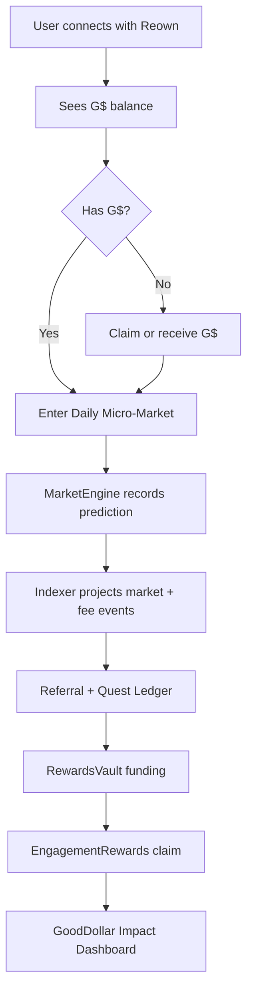

# 00 — Executive Summary

## Decision

RetroPick should integrate GoodDollar through a minimal, auditable, non-crypto-friendly path:

```text
G$ Daily Micro-Markets
+ Claim-to-Predict onboarding
+ FeeRouter / RewardsVault
+ 4-Level Invite Network Rewards
+ EngagementRewards claims
+ GoodDollar Identity for verified campaigns
+ Impact Dashboard
```

Do not rebuild the MarketEngine. RetroPick already has an on-chain authoritative market engine, an indexer-backed read model, and realtime UX. The GoodDollar integration should be additive and should not disturb settlement, claims reserve, oracle logic, or lifecycle automation.

## Why this architecture wins

GoodBuilders reviewers will care about meaningful GoodDollar utility, measurable user growth, and a credible implementation plan. The most credible story is not "RetroPick adds a token." The story is:

> RetroPick gives G$ a daily utility loop where normal users can receive or hold G$, use a small amount in a simple event market, learn how resolution works, claim outcomes/rewards, invite others, and generate measurable GoodDollar ecosystem activity.

## What remains source of truth

| Domain | Source of truth |
|---|---|
| Market settlement | `MarketEngine` on-chain state |
| Epoch state | On-chain events projected by indexer |
| User positions/claims | On-chain logs + Postgres projections |
| Referral tree | Backend referral registry, locked before first fee event |
| Reward eligibility | Backend ledger from indexed fee/activity events |
| Reward claim UX | GoodDollar EngagementRewards flow |
| Verified-human bonus eligibility | GoodDollar Identity / GoodID status |

## Locked system



## Main engineering principle

```text
Do not make GoodDollar systems responsible for RetroPick settlement.
Use GoodDollar for token utility, identity verification, and reward claims.
Keep RetroPick responsible for market truth, fee accounting, and eligibility.
```

## MVP deliverables

1. Celo deployment config and G$ token support.
2. Beginner market page using G$.
3. FeeRouter, TreasuryVault, RewardsVault and optional CommunityPool.
4. Referral ledger and 4-level reward math from real fee events.
5. Quest ledger for Learn-to-Predict rewards.
6. EngagementRewards claim preparation endpoint.
7. GoodDollar Identity status endpoint and campaign gating.
8. Public Impact Dashboard.

## Deferred

- Superfluid G$ streaming.
- CLOB / order book.
- AI agent trading.
- Trading competitions.
- Advanced market types in beginner UI.
- Yield-on-deposit public UX.
- On-chain referral tree.
