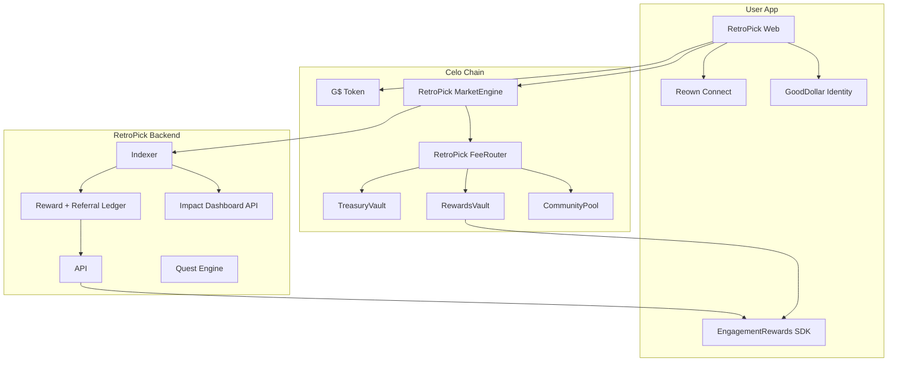
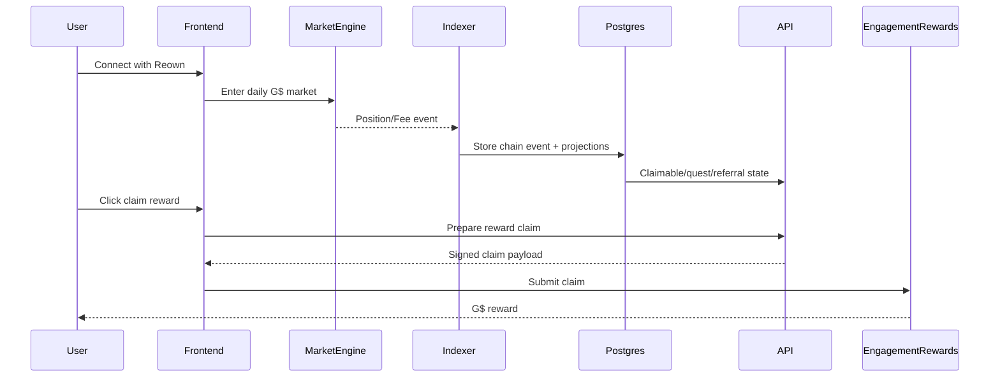

# 02 — System Architecture

## Integration model

RetroPick should integrate GoodDollar as an ecosystem layer, not as the settlement layer.



## Component responsibility

| Component | Responsibility |
|---|---|
| MarketEngine | Accept G$ market entries, settle markets, emit events |
| FeeRouter | Pull protocol fees and route exact allocation |
| TreasuryVault | Hold protocol revenue |
| RewardsVault | Hold rewards funding for referral/quest/campaign claims |
| CommunityPool | Hold sponsored market or campaign budgets |
| Backend Indexer | Project chain events into database |
| Referral Ledger | Calculate invite rewards from real fee events |
| Quest Engine | Track Learn-to-Predict tasks |
| EngagementRewards | Claim/distribution UX for rewards |
| GoodDollar Identity | Verified-human gating for bonus/UBI/campaigns |
| Reown | Social/email/wallet onboarding and analytics funnel |

## Why this matches RetroPick's current stack

RetroPick already uses an on-chain engine, off-chain projections, and realtime frontend updates. GoodDollar integration should hook into those existing event and read-model patterns rather than adding a separate settlement system.

## Key invariant

```text
On-chain market settlement must not depend on referral or quest logic.
Referral and quest rewards must depend on indexed, idempotent chain activity.
```

## Data flow


