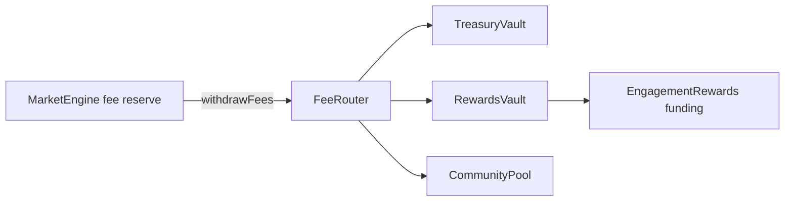

# 03 — Smart Contracts Integration Plan

## Contract strategy

Do not rewrite `MarketEngine`. The GoodDollar integration adds contracts around fee routing and reward funding.

## Contracts to add

| Contract | Build now | Upgradeable? | Purpose |
|---|---:|---:|---|
| `RetroPickFeeRouter` | Yes | Optional | Pull fees from MarketEngine and split to vaults |
| `RetroPickTreasuryVault` | Yes | No/Optional | Hold protocol-owned revenue |
| `RetroPickRewardsVault` | Yes | No/Optional | Hold reward budget before EngagementRewards funding |
| `RetroPickCommunityPool` | Simple | No/Optional | Sponsored market/campaign budget |
| `ReferralRegistry` | No | No | Off-chain first; on-chain later if needed |
| `MerkleDistributor` | No | No | Only if GoodDollar claim path cannot support required flow |

## Why no on-chain referral tree now

Referral attribution comes from URLs, invite codes, wallet linking, GoodID status and first-fee locking. This is app-level state. On-chain tree walking adds gas, upgrade risk, and more edge cases without improving MVP proof.

## Contract flow



## FeeRouter interface sketch

```solidity
interface IMarketEngineFees {
    function withdrawFees(bytes32 templateId, uint256 amount) external;
}

interface IRetroPickFeeRouter {
    event FeesPulledAndRouted(
        bytes32 indexed templateId,
        bytes32 indexed batchId,
        address indexed token,
        uint256 grossAmount,
        uint256 treasuryAmount,
        uint256 rewardsAmount,
        uint256 communityAmount,
        bytes32 allocationHash
    );

    function pullAndRoute(
        bytes32 templateId,
        address token,
        uint256 amount,
        uint256 treasuryAmount,
        uint256 rewardsAmount,
        uint256 communityAmount,
        bytes32 batchId,
        bytes32 allocationHash
    ) external;
}
```

## Invariants

```text
treasuryAmount + rewardsAmount + communityAmount == amount
receivedAmount == amount pulled from MarketEngine
no arbitrary recipient unless whitelisted
only ROUTER_OPERATOR can pull and route
all routing emits an event
batchId cannot be accidentally reused
```

## G$ token handling

Because G$ may support `transferAndCall` and may have transfer fee behavior, contracts should check actual received amount whenever possible. If using `transferAndCall`, implement `onTokenTransfer` only on explicitly intended receiver contracts. If not, use `approve + transferFrom` fallback.

## Security rules

- `nonReentrant` on all external routing functions.
- `Pausable` for emergency shutdown.
- AccessControl or Ownable2Step with multisig owner.
- Whitelist vault addresses.
- No direct user withdrawals from FeeRouter.
- RewardsVault funding destination must be whitelisted.
- Every funding batch should include accounting root/hash.
