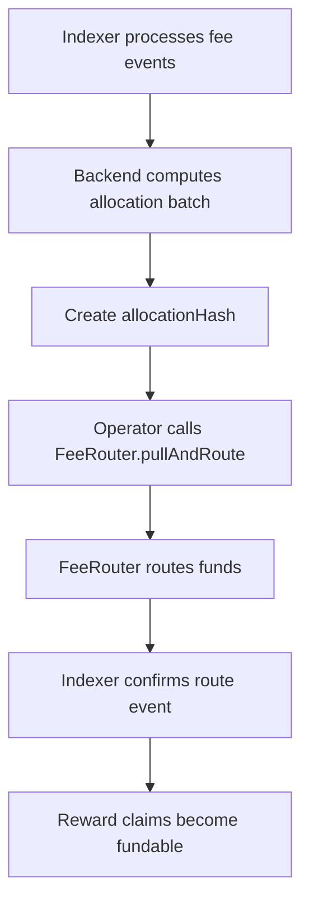

# 04 — FeeRouter, TreasuryVault, RewardsVault

## Purpose

Create a clean protocol-fee routing layer without touching the critical market settlement path.

## Final routing model

```text
MarketEngine accrues fees
→ FeeRouter pulls fees using withdrawFees
→ FeeRouter routes exact allocation
→ TreasuryVault receives protocol revenue
→ RewardsVault receives reward funding
→ CommunityPool receives sponsored campaign funds if enabled
```

## Allocation categories

| Bucket | Description |
|---|---|
| Treasury | RetroPick revenue and missing referral level shares |
| Rewards | Referral rewards, quests, verified-human campaign claims |
| Community | Sponsored markets, creator/community campaigns |

## Referral allocation example

```text
Fee = 100 G$
Full referral tree:
L1 = 30 G$
L2 = 15 G$
L3 = 9 G$
L4 = 6 G$
Treasury = 40 G$
RewardsVault = 60 G$
```

If only level 1 exists:

```text
L1 = 30 G$
Missing L2/L3/L4 = 30 G$ to treasury
Base treasury = 40 G$
Treasury = 70 G$
RewardsVault = 30 G$
```

## FeeRouter pseudocode

```solidity
function pullAndRoute(...) external onlyRole(ROUTER_OPERATOR) nonReentrant whenNotPaused {
    require(amount > 0, "ZERO_AMOUNT");
    require(treasuryAmount + rewardsAmount + communityAmount == amount, "BAD_SPLIT");

    uint256 beforeBal = IERC20(token).balanceOf(address(this));
    engine.withdrawFees(templateId, amount);
    uint256 received = IERC20(token).balanceOf(address(this)) - beforeBal;

    require(received == amount, "BAD_RECEIVED");

    if (treasuryAmount > 0) IERC20(token).safeTransfer(treasuryVault, treasuryAmount);
    if (rewardsAmount > 0) IERC20(token).safeTransfer(rewardsVault, rewardsAmount);
    if (communityAmount > 0) IERC20(token).safeTransfer(communityPool, communityAmount);

    emit FeesPulledAndRouted(...);
}
```

## RewardsVault responsibilities

```text
Hold reward funds.
Fund approved EngagementRewards destination.
Emit RewardBatchFunded.
Never calculate referral logic.
Never allow user-direct withdrawals.
```

## CommunityPool responsibilities

```text
Hold sponsored campaign budget.
Support manual/admin-created campaign funding.
Feed dashboard metrics.
Later support Superfluid streaming for campaign drips.
```

## Backend-operated batch flow


