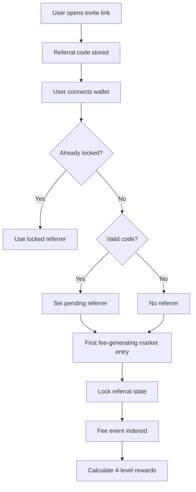

# 05 — 4-Level Referral Ledger

## Product name

Use user-facing wording:

```text
Invite Network Rewards
```

Do not use MLM/downline wording.

## Core rules

```text
Rewards only come from real RetroPick protocol fees.
No reward from clicks.
No reward from fake signups.
No fee = no reward.
Missing levels go to treasury.
No referrer = 100% treasury.
```

## Economics

| Receiver | Share of fee |
|---|---:|
| Level 1 direct inviter | 30% |
| Level 2 | 15% |
| Level 3 | 9% |
| Level 4 | 6% |
| Treasury base | 40% |

## Locking rule

A user's direct referrer can be set from a link or entered manually, but it becomes locked before or at the first fee-generating action.

## Referral lifecycle



## Database schema

```sql
CREATE TABLE referral_users (
  wallet_address BYTEA PRIMARY KEY,
  referral_code TEXT UNIQUE NOT NULL,
  direct_referrer BYTEA,
  referral_locked_at TIMESTAMPTZ,
  goodid_root_wallet BYTEA,
  created_at TIMESTAMPTZ NOT NULL DEFAULT now()
);

CREATE TABLE fee_events (
  id BIGSERIAL PRIMARY KEY,
  tx_hash BYTEA NOT NULL,
  log_index INT NOT NULL,
  market_id BYTEA NOT NULL,
  trader_wallet BYTEA NOT NULL,
  token_address BYTEA NOT NULL,
  fee_amount NUMERIC(78,0) NOT NULL,
  block_number BIGINT NOT NULL,
  created_at TIMESTAMPTZ NOT NULL DEFAULT now(),
  UNIQUE(tx_hash, log_index)
);

CREATE TABLE referral_reward_events (
  id BIGSERIAL PRIMARY KEY,
  fee_event_id BIGINT NOT NULL REFERENCES fee_events(id),
  referrer_wallet BYTEA NOT NULL,
  trader_wallet BYTEA NOT NULL,
  level INT NOT NULL CHECK (level BETWEEN 1 AND 4),
  amount NUMERIC(78,0) NOT NULL,
  status TEXT NOT NULL DEFAULT 'claimable',
  created_at TIMESTAMPTZ NOT NULL DEFAULT now(),
  UNIQUE(fee_event_id, referrer_wallet, level)
);
```

## Calculation pseudocode

```ts
const LEVEL_BPS = [3000n, 1500n, 900n, 600n];

async function calculateReferralRewards(feeEvent) {
  const fee = BigInt(feeEvent.feeAmount);
  const ancestors = await getAncestors(feeEvent.traderWallet, 4);

  let treasury = fee * 4000n / 10000n;
  const rewards = [];

  for (let i = 0; i < 4; i++) {
    const amount = fee * LEVEL_BPS[i] / 10000n;
    const referrer = ancestors[i];
    if (referrer) rewards.push({ referrer, level: i + 1, amount });
    else treasury += amount;
  }

  assert(sum(rewards.map(r => r.amount)) + treasury === fee);
  return { rewards, treasury };
}
```

## Anti-abuse

- Block self-referral.
- Block circular referral chains.
- One direct referrer per wallet.
- Referral lock after first fee-generating action.
- No reward on refunded/cancelled/zero-fee markets.
- Bonus rewards require GoodID.
- Suspicious tree monitoring.
- Claim threshold to reduce spam.
