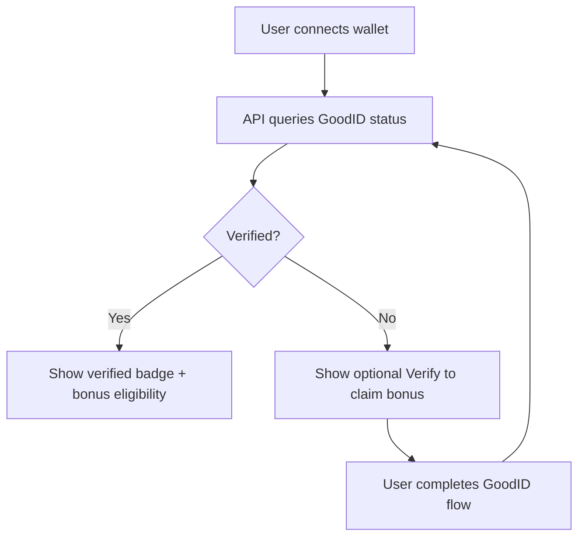

# 07 — GoodDollar Identity / Sybil Resistance

## Goal

Use GoodDollar Identity for verified-human rewards and campaign integrity, without blocking the normal market experience.

## Rule

```text
GoodID is required for subsidized/free/bonus rewards.
GoodID is not required for normal G$ market participation.
```

## Use GoodID for

| Flow | GoodID required? | Reason |
|---|---:|---|
| Claim G$ / UBI | Yes | Free-money distribution |
| First verified-human quest reward | Yes | Prevent multi-wallet farming |
| Sponsored campaign bonus | Yes | One-human-one-reward |
| GoodBuilders KPI reporting | Yes | Verified-human impact |
| Normal G$ market entry | No | Avoid onboarding friction |
| Normal market claim | No | It is from market settlement |
| Base referral from real fees | No | Fake signups earn nothing |

## Identity status flow



## Backend model

```sql
CREATE TABLE goodid_wallet_status (
  wallet_address BYTEA PRIMARY KEY,
  is_verified BOOLEAN NOT NULL DEFAULT false,
  root_wallet BYTEA,
  expiry_at TIMESTAMPTZ,
  last_checked_at TIMESTAMPTZ NOT NULL DEFAULT now(),
  raw_status JSONB
);
```

## API

```http
GET /api/v1/gooddollar/identity/status?wallet=0x...
POST /api/v1/gooddollar/identity/refresh
```

Response:

```json
{
  "wallet": "0x...",
  "verified": true,
  "rootWallet": "0x...",
  "expiryAt": "2026-12-01T00:00:00Z",
  "eligibleForBonus": true
}
```

## UX copy

```text
Verify once to unlock human-only rewards.
You can still use RetroPick without verification.
```

## Anti-abuse

- Use root whitelisted wallet to deduplicate bonus claims.
- Store identity status with expiry.
- Recheck before sponsored reward claims.
- Never store biometric data.
- Store only wallet status and root wallet reference.
