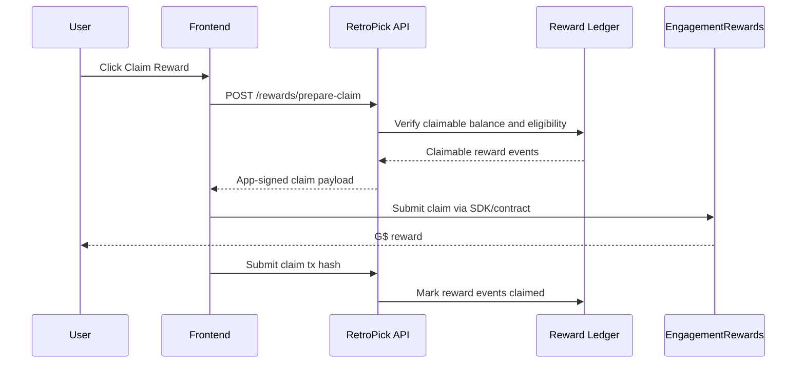

# 08 — EngagementRewards Integration

## Goal

Use GoodDollar EngagementRewards as the claim/distribution layer for RetroPick rewards while keeping RetroPick's backend/indexer as the source of truth for eligibility.

## What EngagementRewards should pay

| Reward | MVP? | Eligibility source |
|---|---:|---|
| First completed Learn-to-Predict quest | Yes | Quest ledger |
| First verified-human prediction | Yes | GoodID + market event |
| First result viewed/claimed | Yes | Indexer + UI event |
| Invite network fee rewards | Yes/soon | Referral reward ledger |
| Sponsored campaign reward | Yes | Campaign ledger |
| Market winnings | No | MarketEngine claim path |

## Claim flow



## Backend endpoints

```http
GET /api/v1/rewards/claimable?wallet=0x...
POST /api/v1/rewards/prepare-claim
POST /api/v1/rewards/submit-claim-tx
```

## Claimable response

```json
{
  "wallet": "0x...",
  "token": "G$",
  "claimableAmount": "12000000000000000000",
  "items": [
    { "type": "quest", "amount": "2000000000000000000" },
    { "type": "referral", "amount": "10000000000000000000" }
  ]
}
```

## Prepare claim request

```json
{
  "wallet": "0x...",
  "rewardTypes": ["quest", "referral"],
  "chainId": 42220
}
```

## Design principles

- EngagementRewards is not the market settlement source.
- RetroPick ledger decides eligibility and amount.
- Backend signs only claims that are funded/eligible.
- Claims must be replay-protected.
- Every claim maps back to reward events.

## Failure handling

| Failure | UI behavior |
|---|---|
| Not enough funded reward pool | "Reward pending funding" |
| GoodID expired | "Verify again to claim this bonus" |
| Claim tx pending | "Claim confirming" |
| Claim tx failed | "Claim failed, try again" |
| Already claimed | "Already claimed" |
