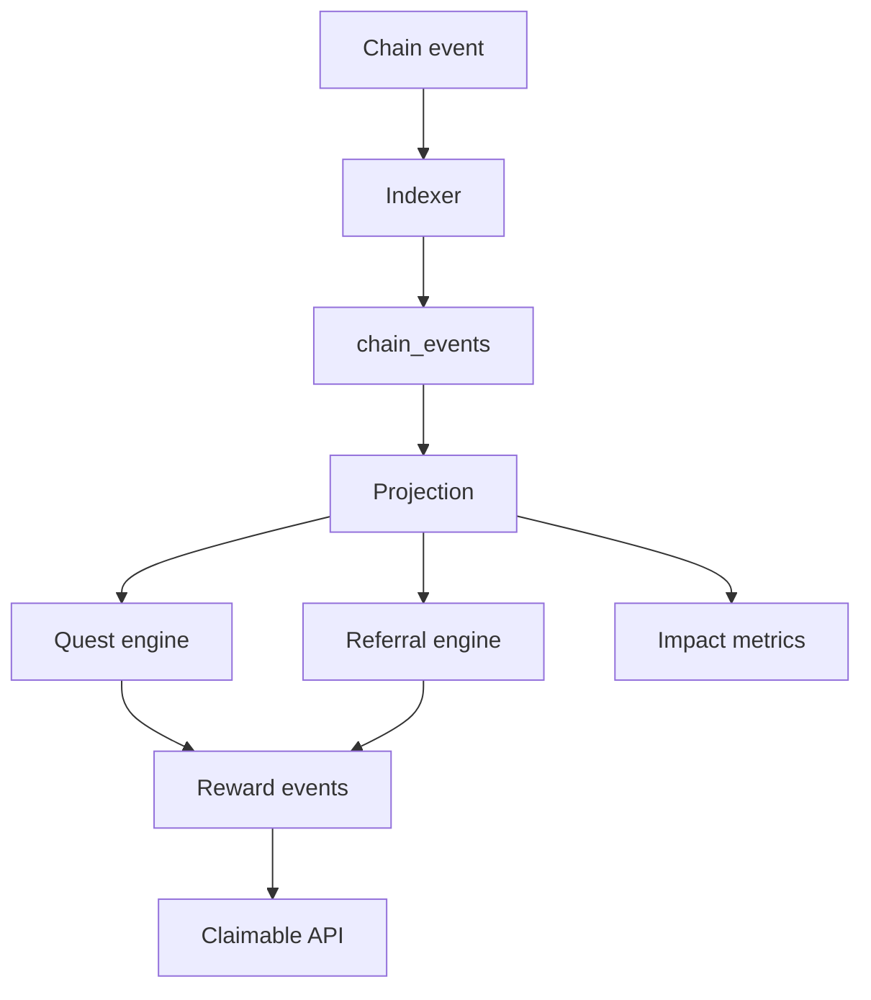

# 09 — Backend, Indexer, API

## Goal

Add GoodDollar features to the existing indexer/API architecture without creating a microservice split.

## New backend domain

Add a domain folder:

```text
services/backend/internal/domain/gooddollar/
  service.go
  repository.go
  identity.go
  rewards.go
  quests.go
  referrals.go
  impact.go
```

## New database tables

```sql
CREATE TABLE gooddollar_identity_status (...);
CREATE TABLE gooddollar_quest_events (...);
CREATE TABLE gooddollar_reward_events (...);
CREATE TABLE gooddollar_reward_claims (...);
CREATE TABLE referral_users (...);
CREATE TABLE referral_reward_events (...);
CREATE TABLE fee_route_batches (...);
CREATE TABLE impact_daily_metrics (...);
```

## Indexer additions

The indexer must recognize:

- G$ market entry events.
- Fee events.
- FeeRouter routed events.
- RewardsVault funded events.
- Market resolved/claimed events.

## Idempotency

```text
All chain-derived events must be keyed by tx_hash + log_index.
All reward events must be keyed by source_event_id + reward_type + wallet.
All claim records must be replay-protected.
```

## API additions

```http
GET  /api/v1/gooddollar/config
GET  /api/v1/gooddollar/identity/status
POST /api/v1/gooddollar/identity/refresh
GET  /api/v1/gooddollar/quests/me
POST /api/v1/gooddollar/quests/complete
GET  /api/v1/rewards/claimable
POST /api/v1/rewards/prepare-claim
POST /api/v1/rewards/submit-claim-tx
GET  /api/v1/referrals/me
POST /api/v1/referrals/apply
GET  /api/v1/impact/gooddollar
```

## Event architecture



## Impact metrics calculation

Daily aggregation job:

```text
sum G$ market volume
count unique wallets
count verified-human wallets
count predictions
sum protocol fees
sum rewards claimable
sum rewards claimed
count resolved markets
count returning users
conversion: connected → first prediction
conversion: claim G$ → first prediction
```

## Repository rule

Do not let handlers write raw SQL directly. Handlers call service methods. Services call repositories. Indexer inserts chain events and publishes domain updates.
