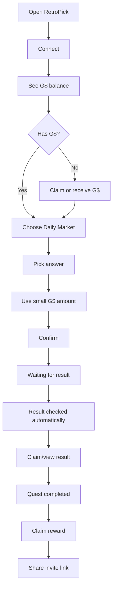

# 10 — Frontend UX Requirements

## UX principle

Non-crypto users should not need to understand staking, oracle settlement, epochs, token decimals, gas, or vaults.

## Main flow



## Screens

| Screen | Purpose | User copy |
|---|---|---|
| Home | Explain app | Predict real events with G$ |
| Connect | Onboard | Continue with wallet or social login |
| My G$ | Balance | You have X G$ |
| Daily Market | Action | Pick what you think will happen |
| Confirm | Safety | You are using 5 G$ |
| Pending | Trust | Waiting for chain confirmation |
| Result | Clarity | Result checked automatically |
| Quest | Retention | Complete your first prediction loop |
| Rewards | Claim | You have X G$ ready to claim |
| Impact | Proof | See RetroPick's G$ impact |

## Component map

```text
apps/web/src/features/gooddollar/
  components/GDollarBalanceCard.tsx
  components/DailyMarketEntry.tsx
  components/ClaimToPredictCard.tsx
  components/GoodIDStatusBadge.tsx
  components/LearnQuestPanel.tsx
  components/RewardClaimButton.tsx
  components/ImpactStatsPanel.tsx
  hooks/useGoodDollarIdentity.ts
  hooks/useGoodDollarRewards.ts
  hooks/useGoodDollarImpact.ts
  pages/GoodDollarDailyPage.tsx
```

## Beginner amount presets

```text
1 G$
5 G$
10 G$
Custom
```

## Confirmation copy

```text
You are using 5 G$ on: Will BTC close above $65,000 today?
If your answer is correct, you can claim your result after the market resolves.
The result is checked automatically from the listed source.
```

## Error states

| State | Message |
|---|---|
| No G$ | Get G$ to make your first prediction |
| GoodID needed | Verify once to claim this human-only reward |
| Indexer syncing | Your transaction is confirmed, RetroPick is syncing it |
| Market locked | This market is closed. Choose another daily market |
| Claim failed | Claim failed. Your reward is still safe |

## UX rules

- Default to one daily market card, not a market terminal.
- Hide charts by default; show them under "Details".
- No advanced market types in beginner mode.
- Show "result source" before the user confirms.
- Do not show protocol internals in beginner UI.
