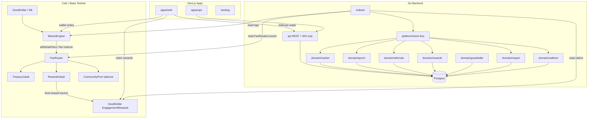

# 02 — Target Architecture

## V3 Architecture Diagram



## The Key V3 Rule

```text
On-chain settlement is canonical.
Backend projections are the default UX truth.
Frontend never treats txs as final until indexed.
GoodDollar rewards are claim UX, not market settlement.
```

## Chain Responsibilities

| Component | Responsibility |
|---|---|
| `MarketEngine` | Market deposits, switches, epoch lifecycle, resolution, claims |
| `FeeRouter` | Pull/receive fees and route exact amounts |
| `TreasuryVault` | Protocol-owned revenue |
| `RewardsVault` | Referral/quest/community reward budget |
| `CommunityPool` | Sponsored campaigns and GoodBuilders-style reward pools |
| `EngagementRewards` | User reward claim transaction UX |
| `G$` | Market participation token and reward currency |

## Backend Responsibilities

| Domain | Responsibility |
|---|---|
| `market` | templates and market read models |
| `epoch` | epoch state, positions, claims |
| `gooddollar` | GoodID status, G$ config, EngagementRewards claim metadata |
| `referrals` | invite code, referral tree, 4-level accounting |
| `rewards` | quest/reward ledger, claimable balances, claim payloads |
| `impact` | G$ volume, verified users, reward KPIs |
| `realtime` | durable `realtime_events` and WS envelope publishing |

## Frontend Responsibilities

| Feature | Responsibility |
|---|---|
| Daily Market | simplest non-crypto market flow |
| My G$ | balance, claim/receive guidance |
| Rewards | claimable rewards, claim button |
| Invite | referral code, invite network stats |
| Learn | beginner explanations and quest progress |
| Impact | public GoodDollar/RetroPick metrics |
