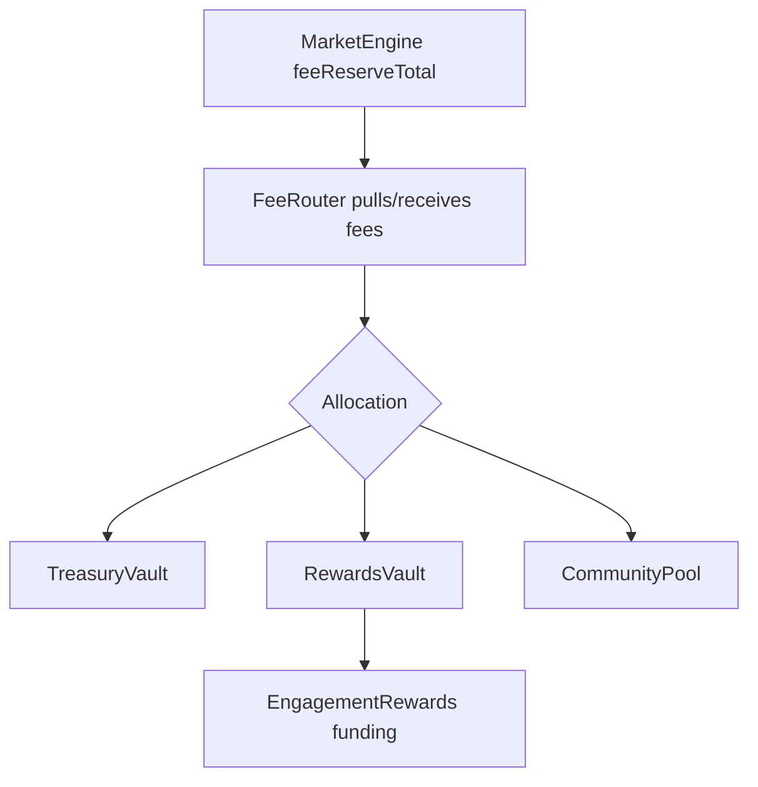

# 04 — Smart Contract Upgrade Plan

## Diagnosis

The current contract architecture is powerful but too complex for the next stage. The dispatcher has root-owned hot paths plus delegated selectors across modules. V3 should reduce upgrade risk before adding more money-moving systems.

## V3 Contract Principles

1. Do not rewrite the MarketEngine before GoodDollar demo.
2. Add fee/reward routing outside the settlement path.
3. Keep market settlement untouched where possible.
4. Do not put referral tree logic on-chain yet.
5. Use storage-layout checks and invariant tests before mainnet.
6. Keep Celo/G$ as a deployment profile, not a parallel protocol fork.

## Build Now

```text
contracts/src/treasury/FeeRouter.sol
contracts/src/treasury/TreasuryVault.sol
contracts/src/treasury/RewardsVault.sol
contracts/src/treasury/CommunityPool.sol
contracts/src/interfaces/IMarketEngineFees.sol
contracts/src/interfaces/IRewardFundingSink.sol
```

## Defer

```text
ReferralRegistry.sol
MerkleReferralDistributor.sol
CLOBEngine.sol
UMAResolverAdapter.sol
SuperfluidRewardStreamer.sol
```

## FeeRouter Model



## Required Contract Events

```solidity
event FeesRouted(
    bytes32 indexed batchId,
    address indexed token,
    uint256 grossAmount,
    uint256 treasuryAmount,
    uint256 rewardsAmount,
    uint256 communityAmount,
    bytes32 allocationHash
);

event RewardFundingSent(
    bytes32 indexed batchId,
    address indexed token,
    address indexed destination,
    uint256 amount,
    bytes32 accountingRoot
);
```

## Upgrade Safety Checklist

- implementation contracts disabled with `_disableInitializers()`
- storage-layout diff in CI
- invariant tests for all reserve flows
- no external calls inside core settlement paths unless unavoidable
- route fees after accrual, not inside resolution
- all admin roles behind multisig/timelock before real funds
- no direct arbitrary-recipient transfer in FeeRouter
- rewards destination allowlist
- pause support on router/vaults
