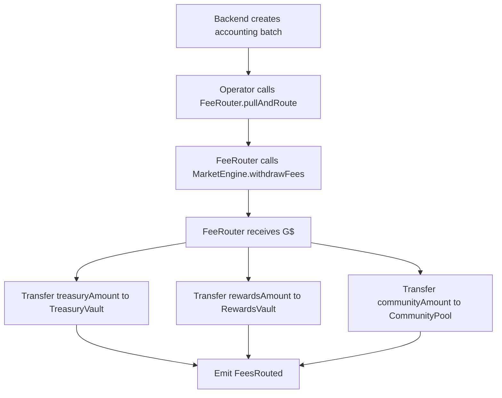

# 05 — FeeRouter, TreasuryVault, RewardsVault

## Final V3 Decision

Build a FeeRouter system, but keep referral math in backend/indexer first.

```text
MarketEngine remains settlement source of truth.
FeeRouter routes protocol fee reserves.
Backend calculates exact reward liabilities.
RewardsVault funds EngagementRewards or future reward distributors.
```

## Why Not Direct 60% Routing?

The referral model has missing-level logic:

```text
No referral: 100% treasury
Full referral tree: 60% rewards / 40% treasury
Only Level 1: 30% rewards / 70% treasury
Missing levels: treasury
```

A smart contract that blindly routes 60% to rewards would overfund rewards when referral depth is incomplete.

## Pull-and-Route Flow



## Contract Interface Sketch

```solidity
interface IMarketEngineFees {
    function withdrawFees(bytes32 templateId, uint256 amount) external;
}

interface IFeeRouter {
    function pullAndRoute(
        bytes32 templateId,
        uint256 amount,
        uint256 treasuryAmount,
        uint256 rewardsAmount,
        uint256 communityAmount,
        bytes32 batchId,
        bytes32 allocationHash
    ) external;
}
```

## Backend Allocation Batch

```json
{
  "batchId": "0x...",
  "templateId": "0x...",
  "token": "G$",
  "grossAmount": "100000000000000000000",
  "treasuryAmount": "70000000000000000000",
  "rewardsAmount": "30000000000000000000",
  "communityAmount": "0",
  "allocationHash": "0x..."
}
```

## RewardsVault Responsibilities

- hold reward budget
- fund EngagementRewards reward source
- emit reward funding events
- never calculate user eligibility
- never let arbitrary users withdraw directly
- whitelist destinations

## TreasuryVault Responsibilities

- hold protocol revenue
- admin/multisig withdrawal
- accounting exports
- no direct user interaction

## CommunityPool Responsibilities

- sponsored GoodDollar campaigns
- learn-to-predict reward budgets
- verified-human bonus campaigns
- optional in MVP; build only if GoodBuilders campaign needs it
