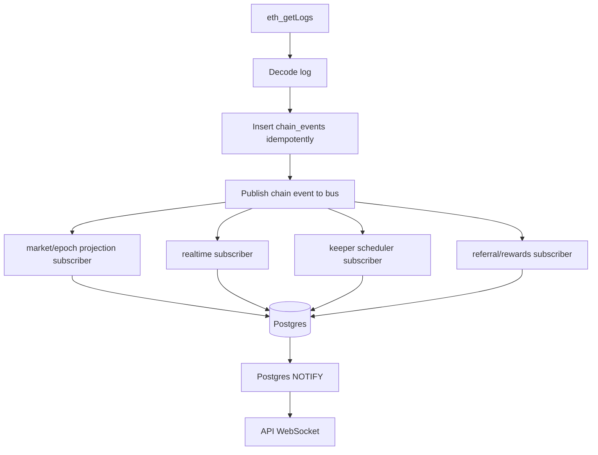

# 07 — Indexer, Event Bus, Realtime

## V3 Goal

The indexer should decode logs and publish domain events. It should not inline every side effect.

## Current Problem

The V2 review identifies that the indexer currently couples:

```text
chain log decode
projection writes
keeper scheduling
realtime envelope writes
```

This means changes to one behavior can affect unrelated parts of the pipeline.

## V3 Flow



## Idempotency Rules

| Item | Unique Key |
|---|---|
| chain event | `(block_hash, log_index)` |
| fee event | `(tx_hash, log_index)` |
| reward event | `(fee_event_id, referrer, level)` |
| keeper execution | `idempotency_key` |
| engagement claim | `claim_nonce` or `claim_id` |
| fee routing batch | `batch_id` |

## Reorg Handling

```text
1. Store block hash and parent hash in indexer_blocks.
2. On mismatch, rewind affected blocks.
3. Mark old events orphaned or replay from canonical chain.
4. Rebuild derived projections from chain_events.
```

## Realtime Rules

- `realtime_events.seq` is the replay cursor.
- clients reconnect with `after=seq`.
- UI invalidates React Query on envelope.
- no UI state is final until indexed under finality.
- user tx optimism must show `pending`, not final.

## Channels

```text
global:markets
market:{templateId}
epoch:{templateId}:{epochId}
chart:{feedId}
oracle:{feedId}
user:{wallet}
deposit:{intentId}
reward:{wallet}
referral:{wallet}
impact:gooddollar
ops:*
```
