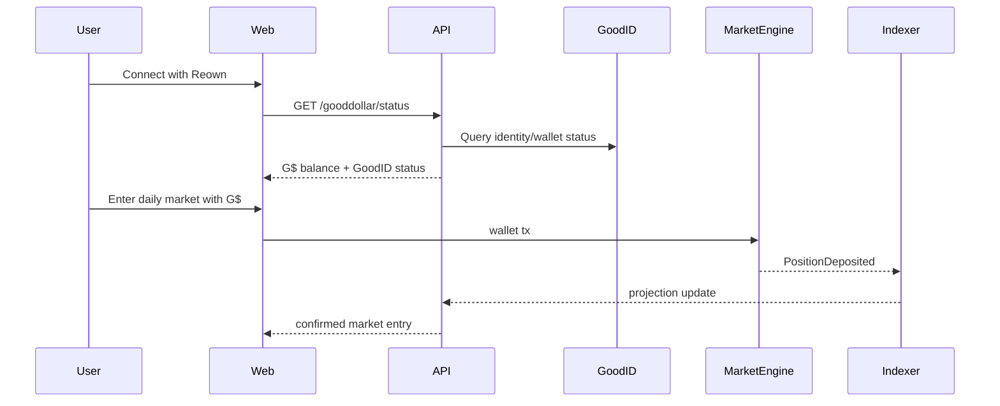

# 09 — GoodDollar / Celo Integration

## V3 Goal

Make RetroPick a simple G$ utility loop.

```text
Claim/receive G$
→ use small G$ in daily micro-market
→ result resolves
→ learn what happened
→ claim reward/result
→ invite others
```

## GoodDollar Components

| Component | RetroPick Use |
|---|---|
| G$ token | market token and reward currency |
| GoodID / Sybil Resistance | verified-human bonus and UBI-related gating |
| EngagementRewards | reward claim/distribution layer |
| GoodWallet / GoodDapp compatibility | later UX compatibility |
| G$ streaming | phase 2 campaign streams |
| Celo | target chain for GoodDollar ecosystem deployment |

## Build Now

```text
packages/gooddollar
backend/domain/gooddollar
frontend/features/gooddollar
Celo registry profile
G$ token address config
GoodID status endpoint
EngagementRewards claim adapter
```

## GoodID Policy

Required:

```text
Claim G$ / UBI flows
verified-human quest rewards
one-human-one-campaign bonus
GoodBuilders impact metric
```

Not required:

```text
browse markets
connect wallet
normal G$ market entry
normal market payout
base fee-funded referral reward
```

## G$ Transfer Caveat

The token integration must use actual received amounts when possible.

```text
expected amount != always received amount
```

This matters for accounting, especially for fees, transferAndCall, or any token-level fee behavior.

## Chain Config

```ts
export const celo = {
  chainId: 42220,
  name: "Celo",
  nativeCurrency: { name: "CELO", symbol: "CELO", decimals: 18 },
}

export const goodDollar = {
  symbol: "G$",
  decimals: 18,
  celoMainnet: "0x62B8B11039fcfE5AB0C56E502b1C372A3D2a9C7A",
  dev: "0xFa51eFDc0910CCdA91732e6806912Fa12e2FD475"
}
```

## Integration Flow


