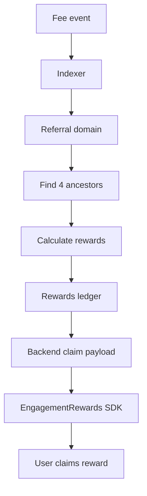

# 10 — Referral and EngagementRewards

## V3 Reward Systems

There are two reward types:

1. **Fee-funded referral rewards**
2. **Sponsored/quest rewards**

They must not be mixed.

## Fee-Funded Referral Rewards

These come from real RetroPick protocol fees.

```text
No fee = no reward.
No reward from clicks.
No reward from fake signups.
```

### Economics

```text
No referrer:
100% fee → treasury

With referral tree:
Level 1 = 30%
Level 2 = 15%
Level 3 = 9%
Level 4 = 6%
Treasury = 40%

Missing levels → treasury
```

### Architecture



## Sponsored / Quest Rewards

These are GoodDollar-aligned growth and education rewards.

Examples:

```text
First completed Learn-to-Predict quest
First verified-human daily market
First result viewed
Return next day
Sponsored community market participation
```

## EngagementRewards Role

EngagementRewards is the claim/distribution layer. It should not decide RetroPick eligibility.

```text
RetroPick backend decides eligibility.
RetroPick backend signs/prepares claim payload.
Frontend passes payload to EngagementRewards.
User claims on-chain.
```

## Tables

```sql
CREATE TABLE referral_bindings (
  referee_wallet BYTEA PRIMARY KEY,
  referrer_wallet BYTEA NOT NULL,
  referral_code TEXT NOT NULL,
  locked_at TIMESTAMPTZ,
  created_at TIMESTAMPTZ NOT NULL DEFAULT now()
);

CREATE TABLE reward_ledger_events (
  id BIGSERIAL PRIMARY KEY,
  wallet BYTEA NOT NULL,
  reward_type TEXT NOT NULL,
  source_event_id TEXT NOT NULL,
  amount NUMERIC(78,0) NOT NULL,
  token_address BYTEA NOT NULL,
  status TEXT NOT NULL DEFAULT 'claimable',
  created_at TIMESTAMPTZ NOT NULL DEFAULT now(),
  UNIQUE(wallet, reward_type, source_event_id)
);

CREATE TABLE reward_claims (
  id BIGSERIAL PRIMARY KEY,
  wallet BYTEA NOT NULL,
  amount NUMERIC(78,0) NOT NULL,
  claim_nonce TEXT NOT NULL UNIQUE,
  claim_payload JSONB,
  claim_tx_hash BYTEA,
  status TEXT NOT NULL DEFAULT 'prepared',
  created_at TIMESTAMPTZ NOT NULL DEFAULT now()
);
```
