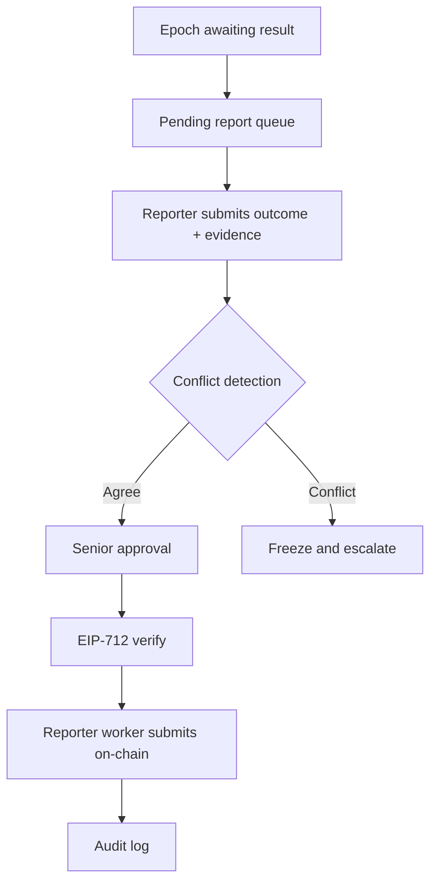

# 11 — TrustedReporter V3

## Goal

Turn TrustedReporter from a CLI into a real workflow.

## Current Risk

If reporting is only a signer CLI, there is no strong process for:

```text
who can report
what evidence was used
whether submissions agree
who approved
what tx was sent
how disputes are frozen
```

## V3 Workflow



## Backend Domain

```text
services/backend/internal/domain/reporter/
├── service.go
├── repository.go
├── eip712.go
├── evidence.go
├── conflict.go
└── worker_queue.go
```

## Tables

```sql
reporter_identity
reporter_submissions
reporter_audit_log
reporter_market_eligibility
```

## Evidence Object

```json
{
  "source_url": "https://...",
  "source_hash": "0x...",
  "observed_value": "65000.12",
  "observed_at": "2026-07-02T00:00:00Z",
  "method": "official_oracle_or_reporter_check"
}
```

## Rules

- 2-of-3 or senior approval for non-oracle event markets.
- freeze on conflicting submissions.
- no on-chain submission without evidence hash.
- no silent admin override.
- all overrides require reason and audit row.
