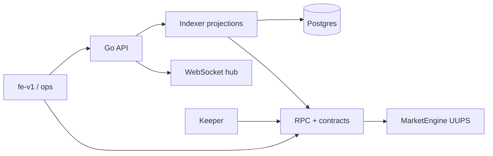

# RetroPick Monorepo Architecture

## 1. Executive Summary

RetroPick is a multi-package monorepo that combines:

- On-chain settlement and protocol logic in `contracts/legacy-pool-v1`
- A Go-based API, indexer, keeper, funding, and realtime backend in `apps/backend`
- User and operator frontends in `apps/web` and `apps/ops-web`
- Shared TypeScript libraries in `packages/*`
- Deployment, orchestration, and operator tooling in `scripts/`, `bin/`, and Docker Compose files

This is not a single app monorepo. It is a production-style protocol monorepo with a clear separation between:

1. authoritative on-chain state
2. derived off-chain projections
3. user-facing web interfaces
4. operator tooling and deployment automation

---

## 2. Monorepo Topology

```text
retropick/
├── apps/
│   ├── backend/             # Go API, indexer, keeper, realtime, funding workers
│   ├── fe-v1/               # user-facing trading app
│   ├── ops/                 # operator dashboard
│   └── retropick-landing*   # marketing / landing surfaces
├── package/
│   ├── prediction-v2/       # canonical smart contract package
│   └── abi/                 # ABI registry output and published artifacts
├── packages/
│   ├── chain/
│   ├── config/
│   ├── contracts/
│   ├── equivalence-engine/
│   ├── event-core/
│   ├── gooddollar/
│   ├── hyperliquid/
│   ├── market-types/
│   ├── pricing/
│   ├── resolution-core/
│   ├── types/
│   └── validators/
├── scripts/
│   ├── retro                # root-aware CLI launcher
│   ├── RETRODEPLOYER        # deploy / smoke orchestration
│   └── market/              # market helpers
├── docker-compose*.yml      # local and production composition
├── docs/                     # repo docs and deployment references
└── package.json              # workspace root, Turbo, pnpm scripts
```

---

## 3. Concrete Repository Inventory

### 3.1 Backend command tree (`apps/backend/cmd`)

```text
apps/backend/cmd/
├── alert/
│   └── main.go
├── api/
│   └── main.go
├── funding-worker/
│   └── main.go
├── healthcheck/
│   └── main.go
├── indexer/
│   └── main.go
├── keeper/
│   └── main.go
├── migrator/
│   └── main.go
├── prepare-launchboard-calldata/
│   └── main.go
├── price-worker/
│   └── main.go
├── reporter/
│   └── main.go
└── rewards-worker/
    └── main.go
```

### 3.2 Backend internal package map (`apps/backend/internal`)

```text
apps/backend/internal/
├── abiembed/
├── abis/
├── api/
│   ├── auth_context.go
│   ├── auth_routes.go
│   ├── auth_session.go
│   ├── authn.go
│   ├── authz.go
│   ├── cors.go
│   ├── funding.go
│   ├── funding_abstraction.go
│   ├── health.go
│   ├── me_routes.go
│   ├── ops.go
│   ├── portfolio_summary.go
│   ├── rate_limit.go
│   ├── rpc_timeout.go
│   ├── tx_prepare.go
│   ├── user_public.go
│   ├── wallet_binding.go
│   └── wallet_request.go
├── config/
├── db/
├── dbqueries/
├── domain/
├── ethops/
├── feedregistry/
├── funding/
├── grpc/
├── indexer/
│   ├── bus_subscribers.go
│   ├── fee_router.go
│   ├── fees_withdrawn.go
│   ├── indexer.go
│   └── payload_test.go
├── keeper/
├── launchboard/
├── marketdata/
├── metrics/
├── pglisten/
├── platform/
├── portfoliopnl/
├── priceworker/
├── readcache/
├── realtime/
├── registry/
├── registrydata/
├── reporter/
└── wshub/
```

### 3.3 Backend data and SQL assets

```text
apps/backend/
├── sql/
│   └── schema.sql
├── sqlc.yaml
├── migrations/
├── proto/
└── third_party/
```

### 3.4 Smart contract package inventory (`contracts/legacy-pool-v1`)

```text
contracts/legacy-pool-v1/
├── src/
│   ├── adapters/
│   │   └── ChainlinkAdapter.sol
│   ├── engine/
│   │   ├── IMarketEngine.sol
│   │   ├── MarketEngineDispatcher.sol
│   │   ├── MarketEngineState.sol
│   │   └── modules/
│   │       ├── MarketEngineAdminModule.sol
│   │       ├── MarketEngineCoreLifecycleModule.sol
│   │       ├── MarketEngineRollingLifecycleModule.sol
│   │       ├── MarketEngineUserOpsClaimsModule.sol
│   │       └── MarketEngineViewModule.sol
│   ├── logic/
│   │   ├── Resolvers.sol
│   │   └── SettlementLogic.sol
│   ├── oracle/
│   │   ├── EquityAdapter.sol
│   │   ├── MacroAdapter.sol
│   │   ├── RateAdapter.sol
│   │   ├── SmartDataAdapter.sol
│   │   └── TrustedReporterAdapter.sol
│   ├── types/
│   │   └── MarketTypes.sol
│   ├── yield/
│   │   ├── YieldRouterAaveV3.sol
│   │   └── YieldRouterV2.sol
│   └── ...
├── script/
│   ├── DeployLocal.s.sol
│   ├── DeployTreasuryAlfajores.s.sol
│   ├── DeployYieldRouterAaveV3.s.sol
│   ├── DeployYieldRouterV2.s.sol
│   ├── ScriptSelectorMatrix.sol
│   ├── UpgradeMarketEngine.s.sol
│   └── UpgradeMarketEngine_YieldRouting.s.sol
├── test/
│   ├── MarketEngineBase.t.sol
│   └── ...
└── currentSmartContract.md
```

This is the canonical contract tree: dispatcher, modules, adapters, and deploy/test scripts for the protocol engine.

### 3.5 Frontend app inventory (`apps/web/src`)

```text
apps/web/src/
├── App.test.tsx
├── App.tsx
├── app/
├── assets/
├── components/
├── config/
├── constants/
├── content/
├── context/
├── contracts/
│   ├── abi/
│   └── config.ts
├── data/
├── features/
│   ├── daily-market/
│   ├── gooddollar/
│   ├── impact/
│   ├── learn/
│   ├── manual-market/
│   ├── portfolio/
│   ├── referrals/
│   ├── rewards/
│   └── world-cup/
├── hooks/
├── lib/
├── main.tsx
├── test/
├── types/
└── views/
    ├── AboveBelowDashboard.tsx
    ├── Activity.tsx
    ├── ChainMarketDetail.tsx
    ├── ChainMarkets.tsx
    ├── Leaderboard.tsx
    ├── LegalDocumentPage.tsx
    ├── MarketDetail.tsx
    ├── MarketsAll.tsx
    ├── Portfolio.tsx
    ├── PredictionDashboard.tsx
    └── Resolution.tsx
```

This is the main trader UI tree; the feature and view folders hold market browsing, trading, portfolio, and chain-market surfaces.

### 3.6 Operator app inventory (`apps/ops-web/src`)

```text
apps/ops-web/src/
├── app/
├── components/
├── config/
├── lib/
├── middleware.ts
└── styles/
```

The operator app focuses on live protocol operations, prepared transactions, monitoring surfaces, and launch/visibility workflows.

### 3.7 Deep folder-by-folder purpose map

This monorepo is not a single webapp. Every top-level directory exists to separate responsibilities so the system can preserve a clean authority boundary:

- `apps/` contains the runtime-facing product surfaces and operational services.
  - `apps/backend/` is the execution and projection layer. It runs the Go API, indexer, keeper jobs, realtime websocket hub, funding workers, and related data services. It is the authoritative off-chain state machine that translates chain events into fast queryable projections for the frontends.
  - `apps/web/` is the user-facing trading application. It is the main product surface for market discovery, wallet-linked trading, portfolio views, and investor-facing market detail experiences.
  - `apps/ops-web/` is the operator and admin dashboard. It provides internal monitoring, operational controls, and launch / visibility workflows for the protocol team.
  - `apps/landing-web/` and `apps/landing-web-standalone/` are marketing-oriented landing surfaces. They are audience acquisition pages and product story surfaces rather than protocol execution code.
  - `apps/docs/` is the documentation site and user-facing reference layer for product knowledge and deployment guidance.

- `package/` contains the canonical package-level protocol artifacts.
  - `contracts/legacy-pool-v1/` is the source-of-truth smart contract tree. It holds the upgradeable `MarketEngine`, modules, adapters, settlement logic, deploy scripts, and tests. This is the contract-layer contract that determines the actual business rules and settlement semantics.
  - `packages/legacy/abi/` stores ABI outputs and published contract interface artifacts that other apps and tooling use to interact with the protocol without needing to re-derive interfaces.

- `packages/` contains reusable domain and application libraries that cut across the monorepo.
  - `packages/chain/` centralizes chain configuration, network concerns, and downstream plumbing abstractions.
  - `packages/config/` holds cross-app config and environment-driven defaults.
  - `packages/contracts/` is the shared contract interface / integration layer used by the TypeScript ecosystem.
  - `packages/equivalence-engine/` contains logic for deriving and checking equivalent outcomes across market resolution approaches.
  - `packages/event-core/` owns event envelope definitions and shared event types used by frontend, backend, and realtime consumers.
  - `packages/gooddollar/` is an integration-specific package for GoodDollar-linked flows and bridging assumptions.
  - `packages/hyperliquid/` supports Hyperliquid-related integration glue or market resolution dependencies.
  - `packages/market-types/` defines shared market shape and type contracts across the product.
  - `packages/pricing/` contains pricing and payout-math code used to reason about positions, odds, and expected settlement values.
  - `packages/resolution-core/` is the shared core for resolution logic and outcome verification.
  - `packages/types/` provides reusable TypeScript types for the wider monorepo.
  - `packages/validators/` is the validation and schema-hardening layer for data entering the system.

- `scripts/` is the automation and operator toolbox.
  - `scripts/retro` is the root-aware command launcher that lets operators and developers invoke repo tooling from any directory.
  - `scripts/RETRODEPLOYER` is a deployment orchestration entry point used for production-ish and smoke flows.
  - `scripts/market/` contains market-oriented helper utilities.
  - Additional root scripts provide backup, smoke, deploy, contract test, and production readiness commands.

- `bin/` acts as the repo-local command bin path for runnable tools and CLIs that need to be accessible system-wide or from the repo root.

- `docker/` contains Docker-related build and reverse-proxy artifacts, especially for production deployment and nginx templating.

- `docs/` is the canonical documentation map for the repository. It holds architecture references, deployment guides, product docs, and cross-stack how-tos. It is the human-facing reference layer for this monorepo.

- `archive/` is the historical storage area. Its contents are intentionally not the active source of truth for product or operational workflows and should be treated as reference-only unless explicitly restored.

- `graphify-out/` is the repository knowledge graph output. It captures structural relationships between files and services so AI tooling can navigate the codebase with a graph-based view instead of relying only on raw grep.

- `ops/` is the repository’s system-level operational support area. It holds deployment and infrastructure automation artifacts beyond the web application surfaces.

- `package.json`, `pnpm-workspace.yaml`, `turbo.json`, and related root config files define the monorepo’s build, workspace, and task orchestration model. They connect the apps, packages, and contract packages into one coherent developer workflow.

- `docker-compose*.yml` files are the deployment entrypoints for local, desktop hairpin, and production compositions. They wire together Postgres, API processes, indexers, and supporting services into a single environment.

In practice, the repo is layered as follows:

1. `contracts/legacy-pool-v1/` defines what the protocol may legally do.
2. `apps/backend/` turns on-chain activity into enforceable, denormalized, and query-friendly state for the app.
3. `apps/web/` and `apps/ops-web/` consume that protocol state through API and chain integration.
4. `packages/*` and `scripts/` provide the reusable cross-cutting infrastructure that keeps the system coherent and operational.

---

## 4. Architectural Layers

### 3.1 On-chain Layer

Canonical source of truth for protocol behavior:

- `contracts/legacy-pool-v1/`
- upgradeable `MarketEngine` proxy
- modules for lifecycle, views, user operations, charging/claims, and rolling automation
- oracle adapters and trusted reporter routing

Primary responsibilities:

- market template creation
- epoch state transitions
- deposit / side switching / claim settlement
- oracle-driven resolution
- treasury / fee accounting

This layer is the most authoritative and should be treated as the protocol source of truth.

### 3.2 Backend Layer

Canonical off-chain execution and read model layer:

- `apps/backend/`
- Go services with layered responsibilities

Key services:

- `cmd/api` — HTTP API and websocket negotiation
- `cmd/indexer` — event ingestion and projection writes
- `cmd/keeper` — lifecycle automation and scheduled actions
- `cmd/funding-worker` — funding abstraction execution and balance settlement
- `cmd/price-worker` — feed polling and chart data hygiene
- `cmd/alert` — incident / operator notifications

The backend owns durable projections, API serving, and event-driven state delivery.

### 3.3 Frontend Layer

Two primary web apps make up the user-facing surface:

- `apps/web` — trader-facing market and portfolio experience
- `apps/ops-web` — operator dashboard for market lifecycle visibility and governance operations

Additional supporting surfaces:

- `apps/landing-web` and `apps/landing-web-standalone` for marketing / acquisition surfaces
- `apps/docs` for documentation delivery

### 3.4 Shared Package Layer

The `packages/*` tree contains reusable TypeScript primitives and protocol-language abstractions that both apps and backend consume.

Examples:

- `packages/market-types` — typed market definitions
- `packages/pricing` — payout math / pricing projections
- `packages/event-core` — event envelope and channel types
- `packages/resolution-core` — resolution logic helpers
- `packages/chain` — chain configuration and plumbing abstractions
- `packages/validators` — validation utilities

---

## 4. System Flow



### Runtime story

1. Users interact with the frontend via wallet-connected flows.
2. The frontend reads protocol state from the API and pushes state changes through websocket subscriptions.
3. The backend indexes on-chain events into Postgres to provide fast, query-friendly projections.
4. Keeper and funding workers periodically advance protocol state and reconcile off-chain balance flows.
5. The contract layer remains the authority for settlement, permissions, and lifecycle integrity.

---

## 5. Canonical Responsibility Split

| Area | Canonical ownership | Notes |
|------|---------------------|-------|
| Smart contract rules | `contracts/legacy-pool-v1` | Source of truth for protocol behavior |
| API surface | `apps/backend` | Serves the app with normalized data |
| Database projections | `apps/backend` + Postgres | Fast read model for frontends |
| UI behavior | `apps/web`, `apps/ops-web` | Consumer experience over API and chain |
| Shared domain types | `packages/*` | Reusable protocol and frontend contract definitions |
| Dev / deploy ops | root scripts + Docker | How the monorepo is launched and maintained |

---

## 6. Monorepo Dependency Shape

The monorepo is organized around a layered dependency model:

```text
apps/web
   ├─ depends on packages/*
   └─ depends on Go API via HTTP / websockets

apps/ops
   ├─ depends on packages/*
   └─ depends on Go API / operator surfaces

apps/backend
   ├─ depends on packages/* for shared schema and type support
   └─ owns indexed storage and event processing

contracts/legacy-pool-v1
   └─ independent authority for on-chain behavior
```

Important design rule:

- The frontend should never be the source of truth for protocol state.
- The backend should not try to redefine on-chain settlement rules.
- Contracts remain canonical even if the frontend and API are upgraded separately.

---

## 7. Backend Architecture Summary

The backend is built as a service-oriented Go monolith with multiple command-entry binaries.

### Core responsibilities

- `internal/api` — REST routes, auth, public surface, JSON responses
- `internal/indexer` — on-chain log decoding and projection persistence
- `internal/keeper` — market automation via scheduled jobs
- `internal/funding` — funding abstraction and balance flow processing
- `internal/realtime` + `internal/pglisten` + `internal/wshub` — event fanout over websocket
- `internal/marketdata` — chart data and feed-health projections

### Data pattern

- Chain events are ingested from RPC through the indexer.
- Relational tables act as the durable projection store.
- Realtime event tables plus Postgres notifications power real-time UX.

---

## 8. Contract Architecture Summary

The smart contract package is organized around an upgradeable `MarketEngine` system.

### Core concepts

- `MarketEngineDispatcher` — protocol entrypoint and routing surface
- `MarketEngineState` — shared storage layout
- modules for:
  - core lifecycle
  - rolling lifecycle
  - user ops / claims
  - views
  - admin controls

### Key protocol behavior

- template creation
- market initialization
- epoch progression
- price / rate / data resolution
- trading and claim settlement
- treasury and fee routing

The dispatcher pattern is the main architectural characteristic of the on-chain side.

---

## 9. Frontend Architecture Summary

### `apps/web`

Trader-focused experience:

- wallet-first UX
- market browsing and detail pages
- portfolio and position tracking
- settlement and claim interaction
- websocket-driven freshness

### `apps/ops-web`

Operator-focused experience:

- live awareness
- prepared governance / tx flows
- monitoring and incident visibility
- keeper and launch tooling surfaces

---

## 10. Shared Package Inventory

The shared packages provide a stable abstraction layer for the monorepo:

- `@retropick/contracts` — contract address and registry metadata
- `@retropick/market-types` — market enum / type wrappers
- `@retropick/event-core` — event channel definitions
- `@retropick/pricing` — off-chain pricing / payout helpers
- `@retropick/resolution-core` — resolution and correctness helpers
- `@retropick/equivalence-engine` — comparison and equivalence tooling
- `@retropick/chain` — chain metadata and transport interfaces
- `@retropick/validators` — common validation logic

These packages reduce duplication and keep the frontend, backend, and contracts aligned.

---

## 11. DevOps and Deployment Shape

The monorepo is not just code; it is also an operational system.

### Root tooling

- `pnpm` workspaces
- `turbo` orchestration
- `docker-compose*.yml`
- `scripts/retro` and `scripts/RETRODEPLOYER`

### Recommended operational model

- local dev through Docker Compose
- named backend services for API/indexer/keeper/funding
- Postgres as the durable off-chain database
- registry-driven contract and environment configuration

---

## 12. One-Sentence Architecture Statement

RetroPick is a monorepo protocol platform where a single upgradeable on-chain engine is backed by a Go projection service, typed shared packages, and React-based trading and operator frontends, all coordinated through Docker, Postgres, and workspace tooling.

---

## 13. Practical File Map

- Root workspace: `package.json`, `pnpm-workspace.yaml`, `turbo.json`
- Contracts: `contracts/legacy-pool-v1/`
- Backend: `apps/backend/`
- User app: `apps/web/`
- Operator app: `apps/ops-web/`
- Docs: `docs/`
- Shared packages: `packages/*`
- Runtime orchestration: `docker-compose.yml`, `docker-compose.production.yml`

This file is the monorepo architecture reference for the repository at a glance.
