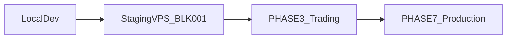

# What you need after development — infrastructure & ops checklist

**Status:** reviewed  
**Owner:** platform-orchestrator  
**Last updated:** 2026-08-09  
**Product:** RetroPick Markets V1

## Description

Senior-engineer pre-flight checklist: what to **procure, register, and configure** after local development and before trusting staging or production. Covers VPS hosting, external APIs, secrets, Polymarket Builder (when trading starts), and legal gates — without duplicating full runbooks. Use this before continuing phase work that depends on live infrastructure.

## 0. Developer intent (5W+1H)

| Lens | Answer |
|------|--------|
| **Who** | Solo/small-team builders (VPS-first); ops before staging deploy; agents checking whether Builder keys or Play Console are required **now** vs later. |
| **What** | Shopping list + gate map: local dev (free), staging VPS (BLK-001), trading prerequisites (PHASE-3+), production gates (PHASE-7). |
| **When** | Read **before** spending on infra or registering upstream accounts; re-check at each phase boundary. |
| **Where** | This file. Local: [docker-compose.markets-dev.yml](../../docker-compose.markets-dev.yml), gitignored `.env`, [.env.markets-dev.example](../../.env.markets-dev.example). Staging: VPS + `cmd/markets-api`. |
| **Why** | Prevents buying Builder/Play/prod wallets during PHASE-2 read/auth work; sequences BLK-001 staging proof before phase advance; keeps secrets off clients (ADR-002). |
| **How** | Tick sections in order: continue local dev → staging VPS + env → verify eligibility → later trading accounts → production legal/Play. |

### Worked example

**Happy path — still in PHASE-2.** Keep coding on Docker (`pnpm dev:markets-stack`). ipinfo token in gitignored `.env` is enough for local GeoIP rehearsal. No Builder code, no Play Console, no production wallet until PHASE-3+ tasks say so.

**Next ops milestone.** Rent Singapore/Tokyo VPS, deploy `markets-api` + Postgres, inject BLK-001 env vars, curl `/eligibility` until `eligible: true`, file [MKT-P2-BLK001-staging-proof.md](../../.harness/products/markets-v1/evidence/verification/PHASE-2/MKT-P2-BLK001-staging-proof.md).

**Failure / Never.** Committing API keys to git; putting Builder/relayer secrets in `NEXT_PUBLIC_*`; skipping geoblock proof with an allow-all stub; treating green localhost as production.

---

## A. Where you are today

| Item | State |
|------|-------|
| `current_phase` | **PHASE-2** — [implementation-manifest.yaml](../../.harness/products/markets-v1/planning/implementation-manifest.yaml) |
| Local dev | Docker stack + gitignored `.env` + `.env.markets-dev.example` |
| BLK-001 | **Open** — GeoIP wired locally; geoblock needs VPS egress proof |
| Builder / trading | **Not needed yet** — `order_submit: false`; [BLK-004](../../.harness/products/markets-v1/governance/BLOCKERS_AND_HUMAN_APPROVALS.md) |



---

## B. Continue developing locally (no spend)

What you need **now** for PHASE-2 code work:

- [ ] Docker Desktop / daemon running (WSL integration if applicable)
- [ ] `pnpm dev:markets-stack` or [scripts/markets-dev-up.sh](../../scripts/markets-dev-up.sh)
- [ ] Copy [.env.markets-dev.example](../../.env.markets-dev.example) → `.env` (gitignored); set GeoIP token
- [ ] Ports free: Postgres `5433`, BFF `8080`, web `3001`

What you **do not** need yet:

- Polymarket Builder code or relayer keys
- Production wallet / multisig
- Google Play Console upload
- Public domain or TLS
- VPS (optional until BLK-001 staging proof)

**Behavior notes:**

- Read-only routes (catalog, events, signals) work without eligibility.
- `/me/wallets` needs SIWE session (auth-only).
- `/me/balances` returns `403 ELIGIBILITY_DENIED` until BLK-001 clears.
- Local curl to `127.0.0.1` uses Docker bridge bogon IP → use `X-Forwarded-For` rehearsal or staging for real proof.

---

## C. Staging VPS (next ops milestone — clears BLK-001)

Minimum stack per [INFRASTRUCTURE_AND_COST_MODEL.md](platform/INFRASTRUCTURE_AND_COST_MODEL.md) (~$45–82/mo pre-funding):

| Component | Recommendation | Notes |
|-----------|----------------|-------|
| VPS | 2 vCPU / 4 GB RAM, **Singapore or Tokyo** | Better Polymarket egress than home/WSL |
| Postgres | Managed small tier or co-located on VPS | Required: `DATABASE_URL` |
| Redis | Optional for staging MVP | Expected for full prod path — [DEPLOYMENT_ARCHITECTURE.md](architecture/DEPLOYMENT_ARCHITECTURE.md) |
| TLS | Caddy / nginx + Let's Encrypt | Set `TRUSTED_PROXY_CIDRS` to proxy/LB CIDRs |
| Process | `go run ./cmd/markets-api` or Docker [apps/backend/Dockerfile](../../apps/backend/Dockerfile) | Markets BFF — **not** legacy `cmd/api` |

### C.1 Required env vars on staging (names only)

| Variable | When |
|----------|------|
| `DATABASE_URL` | Always |
| `MARKETS_GEOIP_BASE_URL` | BLK-001 |
| `MARKETS_GEOIP_PATH` | BLK-001 (default `/{ip}/json`) |
| `MARKETS_GEOIP_API_KEY` | BLK-001 |
| `MARKETS_GEOBLOCK_BASE_URL` | BLK-001 (e.g. `https://polymarket.com`) |
| `MARKETS_GEOBLOCK_PATH` | BLK-001 (default `/api/geoblock`) |
| `TRUSTED_PROXY_CIDRS` | When behind nginx/LB |
| `MARKETS_AUTH_SESSION_SECRET` | SIWE sessions |
| `MARKETS_CORS_ALLOWED_ORIGINS` | Web origin allowlist |

**Env aliases (older docs):** `GEO_PROVIDER_API_KEY` = alias for `MARKETS_GEOIP_API_KEY`; `JWT_SIGNING_KEY` / `SESSION_SECRET` in platform docs map to session signing — shipped Markets auth uses `MARKETS_AUTH_SESSION_SECRET`. Full matrix: [ENVIRONMENT_AND_CONFIGURATION.md](platform/ENVIRONMENT_AND_CONFIGURATION.md).

### C.2 Pre-deploy smoke (on the VPS)

```bash
# Must return JSON with "blocked" field — not Cloudflare HTML
curl -sS -H "X-Forwarded-For: <your-public-ip>" \
  -H "Accept: application/json" \
  "https://polymarket.com/api/geoblock" | jq .
```

```bash
curl -sS "https://<staging-api>/api/v1/markets/eligibility" | jq .
# Pass: "eligible": true for allowed region
curl -sS "https://<staging-api>/api/v1/markets/capabilities" | jq '.features.order_submit'
# Pass: false
```

Evidence: [MKT-P2-BLK001-ops-staging-checklist.md](../../.harness/products/markets-v1/evidence/verification/PHASE-2/MKT-P2-BLK001-ops-staging-checklist.md) §4 → `MKT-P2-BLK001-staging-proof.md`.

---

## D. External APIs and accounts (by phase)

| Account / API | Purpose | Phase | Client-safe? |
|---------------|---------|-------|--------------|
| **ipinfo.io** (or GeoIP HTTP API) | Eligibility region resolve | **Now** (BLK-001) | No — server only |
| **Polymarket Gamma/CLOB** (read URLs) | Catalog, orderbook | PHASE-1+ | No direct client (ADR-002) |
| **Polymarket geoblock** | Venue policy cross-check | **Now** (BLK-001) | BFF only |
| **WalletConnect Cloud** | Web/mobile wallet connect | PHASE-2 UX hardening | Project ID public only |
| **Polymarket Builder program** | Order attribution (`builder` bytes32) | **PHASE-3+** | **Never** in client |
| **Relayer API keys** | Gasless deploy/approve/CTF | PHASE-4 | Server only |
| **OAuth provider** | Optional beyond SIWE | Staging+ | Client ID public; secret server |
| **FCM** | Android push | PHASE-5+ | Server only |
| **Domain + DNS** | `api-staging.*`, `markets.*` | Before public staging URL | N/A |
| **Google Play Console** | Android distribution | PHASE-5+ | N/A |

### D.1 Builder code — deferred until PHASE-3+

- **Not required** for PHASE-2 exit or BLK-001.
- Obtain from polymarket.com → Settings → Builders when starting order preview/submit — [BUILDER_RELAYER_AND_FEES.md](polymarket/BUILDER_RELAYER_AND_FEES.md) §6.1.
- BFF injects `builder` bytes32 on order assembly; clients show fee disclosure only.
- Human gate: Builder fee configuration at PHASE-7 — [BLOCKERS §4](../../.harness/products/markets-v1/governance/BLOCKERS_AND_HUMAN_APPROVALS.md).
- Blocker: [BLK-003](../../.harness/products/markets-v1/governance/BLOCKERS_AND_HUMAN_APPROVALS.md) (Builder production credentials).

---

## E. Secrets inventory (never commit)

From [SECRETS_KEYS_AND_ACCESS_CONTROL.md](security/SECRETS_KEYS_AND_ACCESS_CONTROL.md):

| Secret | Storage | Rotation |
|--------|---------|----------|
| `MARKETS_GEOIP_API_KEY` | VPS env / secret manager | On compromise |
| `MARKETS_AUTH_SESSION_SECRET` | Secret manager | ~90d |
| `DATABASE_URL` credentials | Secret manager | ~90d |
| `BUILDER_API_KEY` / Relayer keys | Secret manager, per-env | On compromise + ~180d |
| User wallet private keys | **User device only** | Never on server |

**Never put in git, client bundles, or chat:**

- Polymarket builder/relayer keys
- Session signing secrets
- GeoIP tokens
- Database passwords
- Any value in `NEXT_PUBLIC_*` except WalletConnect project ID, chain ID, BFF URL

---

## F. Web and Android hosting (when leaving localhost)

| Surface | Pre-funding default | Points to |
|---------|---------------------|-----------|
| Web | Vercel free tier or static on VPS | Staging BFF via `NEXT_PUBLIC_API_BASE_URL` |
| Android | Play Internal track | Staging flavor → staging BFF — [PLAY_STORE_COMPLIANCE_AND_RELEASE.md](android/PLAY_STORE_COMPLIANCE_AND_RELEASE.md) |

**Order:** VPS hosts **BFF + Postgres** first. Web can stay on localhost pointing at staging API until domain is ready.

---

## G. Indonesia and legal (before public launch)

Engineering gates only — not legal advice.

- **BLK-020** — per-region legal review before production trading.
- Polymarket geoblock may allow `ID`; Indonesian ISP/government blocks are a separate product risk.
- Play country distribution must align with eligibility policy.
- Do **not** build VPN or geoblock circumvention flows.

---

## H. Master checklist (tick in order)

1. [ ] **Keep developing locally** — no VPS required for PHASE-2 code
2. [ ] **Copy `.env.markets-dev.example` → `.env`** — GeoIP token for local rehearsal
3. [ ] **Provision staging VPS** (Singapore/Tokyo) + Postgres
4. [ ] **Deploy `markets-api`** with BLK-001 env vars (§C.1)
5. [ ] **Verify geoblock JSON** from VPS egress, then `/eligibility` → `eligible: true`
6. [ ] **File** `MKT-P2-BLK001-staging-proof.md`
7. [ ] **Clear BLK-001** → MKT-P2-002 done → user authorizes PHASE-3 advance
8. [ ] **Register WalletConnect** when staging wallet UX needs external testers
9. [ ] **Apply Polymarket Builder program** before PHASE-3 order preview/submit
10. [ ] **Domains + TLS** before sharing staging URL broadly
11. [ ] **Legal review (BLK-020) + Play financial declaration (BLK-021)** before production (PHASE-7)

---

## I. Authoritative cross-links

| Topic | Document |
|-------|----------|
| BLK-001 staging steps | [MKT-P2-BLK001-ops-staging-checklist.md](../../.harness/products/markets-v1/evidence/verification/PHASE-2/MKT-P2-BLK001-ops-staging-checklist.md) |
| Local rehearsal evidence | [MKT-P2-BLK001-local-rehearsal-evidence.md](../../.harness/products/markets-v1/evidence/verification/PHASE-2/MKT-P2-BLK001-local-rehearsal-evidence.md) |
| Active blockers | [BLOCKERS_AND_HUMAN_APPROVALS.md](../../.harness/products/markets-v1/governance/BLOCKERS_AND_HUMAN_APPROVALS.md) |
| Deploy units and env matrix | [DEPLOYMENT_ARCHITECTURE.md](architecture/DEPLOYMENT_ARCHITECTURE.md) |
| Full env reference | [ENVIRONMENT_AND_CONFIGURATION.md](platform/ENVIRONMENT_AND_CONFIGURATION.md) |
| Builder and relayer | [BUILDER_RELAYER_AND_FEES.md](polymarket/BUILDER_RELAYER_AND_FEES.md) |
| Cost budget | [INFRASTRUCTURE_AND_COST_MODEL.md](platform/INFRASTRUCTURE_AND_COST_MODEL.md) |
| Day-2 ops | [PRODUCTION_OPERATIONS_RUNBOOK.md](platform/PRODUCTION_OPERATIONS_RUNBOOK.md) |
| Phase advance gate | [MKT-P2-phase-advance-ready.md](../../.harness/products/markets-v1/evidence/verification/PHASE-2/MKT-P2-phase-advance-ready.md) |

---

**Note:** This file does not advance `current_phase` or clear blockers. Harness truth lives in [implementation-manifest.yaml](../../.harness/products/markets-v1/planning/implementation-manifest.yaml) and [BLOCKERS_AND_HUMAN_APPROVALS.md](../../.harness/products/markets-v1/governance/BLOCKERS_AND_HUMAN_APPROVALS.md).
