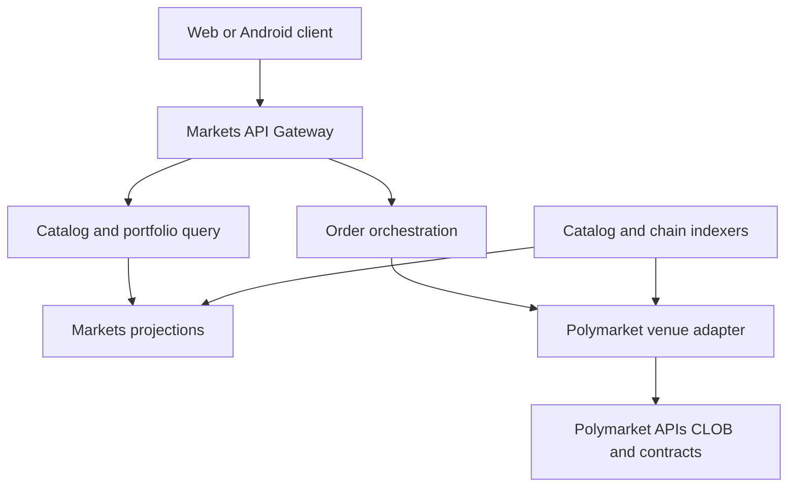

# Executive Product Spec — RetroPick Markets V1

**Status:** reviewed
**Owner:** platform-orchestrator
**Last updated:** 2026-07-25
**Product:** RetroPick Markets V1

---

## Description

This is the executive product definition for RetroPick Markets V1: a discovery, execution, portfolio, and analytics **client** over official Polymarket APIs via a Go BFF anti-corruption layer (ADR-002), shared OpenAPI (ADR-004), Compose Android (ADR-006), and deterministic intelligence (ADR-008) — with **no** autonomous copy trading (ADR-009). Positions are Polymarket positions, not PRISM.

Current Markets V1 authority: `.harness/products/markets-v1/governance/AGENT_OPERATING_CONTRACT.md`.

Trace features to MKT-FR IDs in [04_REQUIREMENTS_AND_TRACEABILITY.md](04_REQUIREMENTS_AND_TRACEABILITY.md). Code homes (later): `apps/backend/internal/markets/`, `apps/web/src/products/markets/`, `apps/android/`, `schemas/openapi/markets-v1.yaml`. Companion scope fence: [02_SCOPE_AND_CAPABILITY_MATRIX.md](02_SCOPE_AND_CAPABILITY_MATRIX.md).

## 0. Developer intent (5W+1H)

Short orientation for implementers and agents. Read this before the normative product sections below.

The 5W+1H table below is a **navigation aid** only. It does not replace Purpose, Scope, non-goals, or ADR citations in the body; if anything conflicts, the body of this document wins.

| Lens | Answer |
|------|--------|
| **Who** | Product/platform orchestrators freezing Markets V1 definition; BFF/web/Android agents aligning UX and API work to “Polymarket-native client”; QA/security checking Never-V1 and PRISM boundary language. |
| **What** | Executive product definition: Markets is a discovery, execution, portfolio, and analytics **client** over official Polymarket APIs via Go BFF ACL (ADR-002), shared OpenAPI (ADR-004), Compose Android (ADR-006), deterministic intelligence (ADR-008), **no** autonomous copy trading (ADR-009). Positions are Polymarket positions — not PRISM. |
| **When** | Before writing any user-facing Markets copy, choosing custody/signing posture, debating custom exchange features, or scoping a phase. Re-read when Builder fee disclosure, geoblock, or PRISM routing debates reopen. |
| **Where** | Spec authority: this file. Boundaries: [02_SCOPE_AND_CAPABILITY_MATRIX.md](02_SCOPE_AND_CAPABILITY_MATRIX.md), ADRs under `architecture/adr/`, research [POLYMARKET_CURRENT_STATE.md](research/POLYMARKET_CURRENT_STATE.md). Code homes (later): `apps/backend/internal/markets/`, `apps/web/src/products/markets/`, `apps/android/`, `schemas/openapi/markets-v1.yaml`. |
Current Markets V1 authority: `.harness/products/markets-v1/governance/AGENT_OPERATING_CONTRACT.md`.
| **How** | Implement only capabilities consistent with §2–§4; disclose Polymarket + chain; fetch/disclose Builder fees before signature (never hardcode); route structured RetroPick payoffs to separately branded PRISM; keep keys out of RetroPick custody. Trace features to MKT-FR IDs in [04_REQUIREMENTS_AND_TRACEABILITY.md](04_REQUIREMENTS_AND_TRACEABILITY.md). |

### Worked example

**Happy path — market detail + rules**

1. Task needs event catalog + rules provenance (MKT-FR-001/002).
2. BFF normalizes Gamma → OpenAPI; web/Android render rules and resolution source.
3. Copy states positions settle on Polymarket; no implied RetroPick liquidity pool.

**Happy path — order path (PHASE-3)**

1. Preview payload must equal signed EIP-712 fields (ADR-003).
2. Show effective builder fee before wallet prompt.
3. Submit via CLOB V2 through BFF ACL — not browser-direct production CLOB.

**Failure / Never-V1**

- Custom matching, AMM, or RetroPick outcome tokens for Markets.
Current Markets V1 authority: `.harness/products/markets-v1/governance/AGENT_OPERATING_CONTRACT.md`.
- Custody of raw private keys; silent backend order signing.
- VPN/proxy guidance as a product feature to evade geoblock.
- Auto copy trading or AI→order execution (ADR-009).

**Agent checklist**

- [ ] Is this a Polymarket client feature (not PRISM/exchange)?
- [ ] Venue/rules disclosed?
- [ ] ADR-001/002/003/009 respected?
- [ ] Requirement ID mapped?
- [ ] Gambling-heavy sportsbook copy avoided?

**Reading tip:** Skim §2.1/§2.2 first as the permanent product fence; use target-user table only for phase prioritization, not to invent Post-V1 features early.

## 1. Executive summary

RetroPick Markets is a **Polymarket-native** discovery, execution, portfolio, and analytics client for web and Android. Users browse normalized Polymarket events, authorize orders with their own wallets, and hold **Polymarket positions** — not PRISM positions. Polymarket remains venue, settlement, and rules authority (ADR-001).

Markets competes on clarity, speed, mobile continuity, operational reliability, and trustworthy disclosures — not on obscuring where orders settle or implying liquidity beyond the venue.

## 2. Product definition

### 2.1 What Markets is

- A product shell over official Polymarket APIs via a Go BFF anti-corruption layer (ADR-002).
- Shared versioned OpenAPI contract for web and Android (ADR-004).
- Native Android with Jetpack Compose (ADR-006).
- Deterministic, evidence-linked intelligence signals (ADR-008) with **no autonomous copy trading** (ADR-009).

### 2.2 What Markets is not

- Not a structured-outcome issuer or custom exchange.
Current Markets V1 authority: `.harness/products/markets-v1/governance/AGENT_OPERATING_CONTRACT.md`.
- Not custodian of user private keys.
- Not a bypass for geographic restrictions.

### 2.3 PRISM boundary

If a user combines legs that require a distinct RetroPick payoff, route to PRISM in a **separately branded** context. Markets order flows must state they create Polymarket positions.

## 3. Target users and jobs

| User segment | Primary job | V1 phase |
|---|---|---|
| New prediction-market user | Understand rules, prices, max loss, redemption | PHASE-1, PHASE-4 |
| Active trader | Fast book, limit orders, cancel, portfolio | PHASE-3, PHASE-4 |
| Thematic researcher | Search, watchlists, related markets, history | PHASE-1, PHASE-4 |
| Mobile-first user | Secure native execution and monitoring | PHASE-5 |
| Professional (post-V1) | Exports, API, advanced analytics | PHASE-8 |

## 4. Business positioning

### 4.1 Differentiation

| Dimension | RetroPick Markets | Generic wrapper |
|---|---|---|
| Venue transparency | Always discloses Polymarket + chain | Often obscured |
| Rules comprehension | Canonical rules + provenance | Title-only |
| Execution integrity | Preview=sign binding | Drift risk |
| Mobile | Native Compose + shared API | WebView |
| Intelligence | Deterministic + retractable | Opaque scores |

### 4.2 Non-goals

- RetroPick-issued outcome tokens.
- Internal pooled liquidity or AMM.
- Changing Polymarket rules or payouts.
- Promising atomic multi-leg fills without venue primitive.
- VPN/proxy geoblock bypass.

## 5. Revenue model

### 5.1 Primary — Builder Program

Polymarket Builder Program fees on routed orders. Production must **fetch and disclose** current fee terms before every signature. Values are external and time-sensitive.

Reference: https://docs.polymarket.com/programs/builders/fees

### 5.2 Secondary (post-validation)

- Professional analytics subscription (PHASE-8).
- API/data products compliant with upstream terms.
- Clearly labeled sponsored discovery (excluded from best-execution ranking).

### 5.3 Prohibited monetization

- Undisclosed spread.
- Monetizing failed orders.
- Treating user balances as RetroPick revenue.

## 6. Unit economics (summary)

```
Contribution Margin = Builder Fee Revenue + Subscription Revenue
                    - Relayer Gas - Venue/API/Data Cost
                    - Variable Infrastructure - Support/Fraud Cost
```

See [03_BUSINESS_MODEL_AND_UNIT_ECONOMICS.md](03_BUSINESS_MODEL_AND_UNIT_ECONOMICS.md) for drivers and KPIs.

## 7. V1 capability scope

### 7.1 Required V1 (PHASE-0–7)

| Capability | Phase |
|---|---|
| Event/market catalog, search, watchlists | PHASE-1 |
| Market rules, resolution source, disclosures | PHASE-1 |
| Live order book, trades, spread, history | PHASE-1 |
| Wallet connect, eligibility, funding | PHASE-2 |
| Limit/marketable-limit orders, cancel | PHASE-3 |
| Positions, PnL, activity | PHASE-4 |
| CTF split/merge/redeem, Neg Risk display | PHASE-4 |
| Deposit/withdrawal with receipts | PHASE-2, PHASE-4 |
| Notifications (fills, resolution, claimable) | PHASE-4, PHASE-5 |
| Builder attribution, optional gasless relay | PHASE-2, PHASE-3 |
| Android feature parity | PHASE-5 |
| Hardening, CI/CD, SRE | PHASE-6 |
| Production launch | PHASE-7 |

### 7.2 Feature-gated

| Capability | Gate |
|---|---|
| Polymarket Combos/RFQ | Official API availability + PHASE-8 ADR |
| Advanced analytics exports | PHASE-8 subscription |
| Fiat on-ramps | Provider + jurisdiction review |

## 8. Runtime architecture



### 8.1 Components

| Component | Responsibility |
|---|---|
| Markets API Gateway | Auth, eligibility, rate limits, stable client contract |
| Polymarket ACL | Gamma/CLOB normalization, capability discovery |
| Catalog indexer | Events, markets, tokens, rules, checkpoints |
| Market-data ingest | Snapshot + sequence WS, gap recovery |
| Order orchestrator | Preview, validate, submit signed payload, reconcile |
| Portfolio service | Positions, PnL, claimable, reconcile |
| Transaction relayer | Builder/relayer with allowlists and budgets |
| Signal engine | Deterministic alerts, whale feed, wallet profiles |

## 9. Order flow principles

Every trade confirmation shows: venue, chain, market/outcome, side, quantity, price, fees, gas treatment, max loss/payout, book impact, expiry, settlement rules, and explicit Polymarket position statement.

Requirements:

- Recompute preview if price, fee, market state, or expiry changes.
- Bind signature to chain, maker, token, side, price, size, nonce, expiration, fee, builder field.
- Store payload hash — never wallet secrets.
- Marketable orders use explicit worst acceptable price.
- Multi-leg workflows disclose independent leg risk.

## 10. Data and API surface

Canonical APIs (shared web/Android):

```
GET  /v1/markets/events
GET  /v1/markets/events/{id}
GET  /v1/markets/markets/{id}
GET  /v1/markets/markets/{id}/orderbook
POST /v1/markets/orders/preview
POST /v1/markets/orders/submit
GET  /v1/markets/capabilities
GET  /v1/eligibility
```

Source of truth: `schemas/openapi/markets-v1.yaml`. Monetary fields are fixed-point integers.

## 11. Security and compliance posture

| Risk | Control |
|---|---|
| Order tampering | Preview=sign binding |
| Key theft | No backend/mobile raw-key custody |
| Replay | Nonce, expiry, idempotency, venue lookup |
| Relayer drain | Allowlists, budgets, kill switch |
| Jurisdiction bypass | Server-authoritative geoblock, fail closed |
| Stale book | Sequence checks, disable marketable when stale |

Obtain jurisdiction-specific legal advice before production launch (PHASE-7 gate).

## 12. Implementation program

| Phase ID | Name | Goal |
|---|---|---|
| PHASE-0 | Discovery and Spec Freeze | Eliminate signing/custody/scope unknowns |
| PHASE-1 | Foundation and Read Markets | Catalog + read UX, no trading |
| PHASE-2 | Account Wallet and Funding | Wallet, eligibility, deposit/withdraw design |
| PHASE-3 | Web Trading Core | Preview, sign, submit, reconcile |
| PHASE-4 | Portfolio, Redemption, and Withdrawal | Positions, CTF, redeem, intelligence feeds |
| PHASE-5 | Android Compose Markets | Mobile parity |
| PHASE-6 | Hardening, CI/CD, and SRE | Security, ops readiness |
| PHASE-7 | Production Launch | Controlled go-live |
| PHASE-8 | Post-V1 Advanced Capabilities | Gated post-V1 features |

See [phases/README.md](phases/README.md) for per-phase §16 contracts.

## 13. Success metrics

| Metric | Target | Phase |
|---|---|---|
| Catalog freshness p95 | < 60s | PHASE-1 |
| Order book snapshot age p95 | < 5s | PHASE-1 |
| Preview-to-sign binding | 100% golden vectors | PHASE-3 |
| Position reconciliation error rate | < 0.1% | PHASE-4 |
| API availability | 99.5% monthly | PHASE-6 |
| Android crash-free users | > 99% | PHASE-5 |

## 14. Current repository state

- Monorepo R0–R3 restructure complete.
- Markets BFF stub: `apps/backend/internal/markets/`.
- OpenAPI stub: `schemas/openapi/markets-v1.yaml`.
- Web shell: `apps/web/src/products/markets/`.
- Android: README-only scaffold; implementation PHASE-5.

## 15. Key decisions (ADRs)

| ADR | Decision |
|---|---|
| ADR-001 | No custom exchange; Polymarket is venue |
| ADR-002 | BFF anti-corruption layer |
| ADR-003 | Signer vs account-wallet model |
| ADR-004 | Shared web/Android API |
| ADR-005 | Realtime snapshot/gap recovery |
| ADR-006 | Jetpack Compose for Android |
| ADR-007 | OSS adoption and clean-room |
| ADR-008 | Shared signal engine |
| ADR-009 | No auto copy trading in V1 |

## 16. Open questions and blockers

See [research/OPEN_QUESTIONS_AND_EXPIRING_ASSUMPTIONS.md](research/OPEN_QUESTIONS_AND_EXPIRING_ASSUMPTIONS.md).

| Blocker | Phase |
|---|---|
| Geoblock eligibility upstream not wired | PHASE-2 |
| Android scaffold beyond README | PHASE-5 |
| pUSD/collateral configuration verify at deploy | PHASE-2 |

## 17. Traceability

Requirements: [04_REQUIREMENTS_AND_TRACEABILITY.md](04_REQUIREMENTS_AND_TRACEABILITY.md)
NFRs: [05_NON_FUNCTIONAL_REQUIREMENTS.md](05_NON_FUNCTIONAL_REQUIREMENTS.md)
Tasks: [../../.harness/products/markets-v1/planning/task-graph.yaml](../../.harness/products/markets-v1/planning/task-graph.yaml)

## 18. Authoritative sources

| Source | URL | Retrieved | Confidence |
|---|---|---|---|
| Polymarket docs | https://docs.polymarket.com/ | 2026-07-25 | partially verified |
| CLOB V2 migration | https://docs.polymarket.com/v2-migration | 2026-07-25 | partially verified |
| Builder fees | https://docs.polymarket.com/programs/builders/fees | 2026-07-25 | partially verified |
| MARKETS baseline | .dev/MARKETS.md | 2026-07-25 | verified |
| OpenAPI | schemas/openapi/markets-v1.yaml | 2026-07-25 | verified |

## 19. Acceptance criteria (document baseline)

- All PHASE-0–8 specs contain full §16 contract.
- Requirements mapped to phases and tasks.
- Cross-document invariants (§23) satisfied.
- Human approval gates documented before implementation agents execute gated work.

## 20. Related documents

- [00_DOCUMENT_MAP.md](00_DOCUMENT_MAP.md)
- [02_SCOPE_AND_CAPABILITY_MATRIX.md](02_SCOPE_AND_CAPABILITY_MATRIX.md)
- [architecture/TARGET_MONOREPO_ARCHITECTURE.md](architecture/TARGET_MONOREPO_ARCHITECTURE.md)
- [EXECUTIVE_OUTCOME.md](EXECUTIVE_OUTCOME.md)
