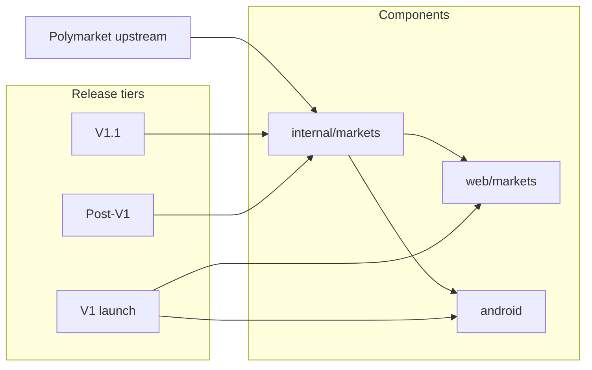

# Scope and Capability Matrix

**Status:** reviewed
**Owner:** platform-orchestrator
**Last updated:** 2026-07-25
**Product:** RetroPick Markets V1

## 1. Purpose

Map every Markets capability from master prompt §6 and §6A across Polymarket upstream support, RetroPick components, release tier (V1 / V1.1 / Post-V1), phase, and requirement IDs. Single traceability source for scope debates.

## 2. Scope

### In scope

- RetroPick Markets: web (`apps/web`), Go BFF (`internal/markets`), Android (`apps/android`).

### Out of scope

- PRISM (`contracts/prism/`, `products/prism`).
- Legacy epoch (`archive/`, `/api/v1/legacy/markets/*`).
- Custom RetroPick exchange (ADR-001).

## 3. Prerequisites

- [01_EXECUTIVE_PRODUCT_SPEC.md](01_EXECUTIVE_PRODUCT_SPEC.md)
- [research/POLYMARKET_CURRENT_STATE.md](research/POLYMARKET_CURRENT_STATE.md)
- [04_REQUIREMENTS_AND_TRACEABILITY.md](04_REQUIREMENTS_AND_TRACEABILITY.md)
- Master prompt §6, §6A

## 4. Authoritative sources

| Source | Role |
|--------|------|
| `.dev/MARKETS.md` | Product scope |
| `.dev/ANDROID_MARKETS.md` | Android tiering |
| `schemas/openapi/markets-v1.yaml` | Current API surface |
| `research/evidence-register.yaml` | Upstream confidence |

## 5. Current state

Repo implements **catalog read stub only** (3 OpenAPI paths). Matrix below describes **target** tiers; Launch column reflects Wave 0 baseline.

**Legend — release columns:**

| Column | Meaning |
|--------|---------|
| **V1** | Required for first production launch (web + Android per phase plan) |
| **V1.1** | Fast-follow after stable V1 web trading |
| **Post-V1** | PHASE-8+ or separate product review |

**Legend — component codes:** `BFF` = backend, `W` = web, `A` = Android, `—` = not in tier.

## 6. Target design

Capabilities flow: Polymarket upstream → BFF anti-corruption layer → OpenAPI → web/Android. Feature flags via `GET /markets/capabilities`. Combos and unusual-activity heuristics remain gated until upstream + legal clearance.

## 7. Alternatives considered

| Alternative | Rejected because |
|-------------|------------------|
| Ship Combos in V1 | EV-013; incomplete API |
| Android before web trading stable | ANDROID_MARKETS.md PHASE-5 |
| Client-direct CLOB | ADR-002 |

## 8. Decisions

- V1 web trading before Android parity.
- CTF / NegRisk convert in V1.1 after web redemption stable.
- Intelligence whale feed in V1; unusual-activity in V1.1.
- Combos Post-V1 until capability verified.

## 9. Data and control flows



## 10. Failure and recovery

| Capability class | Degraded mode |
|------------------|---------------|
| Catalog read | Cached Gamma + stale label |
| Orderbook | Snapshot only; disable marketable |
| Trading | Kill switch; read-only portfolio |
| Intelligence | Pause fan-out; own-account alerts only |
| Geoblock | Fail closed |

## 11. Security

User signature required for all trading and CTF mutations. Relayer only for allowlisted ops. No tier may bypass geoblock.

## 12. Observability

Per-capability metrics defined in [platform/OBSERVABILITY_SLOS_AND_ALERTS.md](platform/OBSERVABILITY_SLOS_AND_ALERTS.md). Matrix rows with `Launch: not_started` have no SLO until phase start.

## 13. Test strategy

Each V1 row maps to requirement ID in §4 of [04_REQUIREMENTS_AND_TRACEABILITY.md](04_REQUIREMENTS_AND_TRACEABILITY.md) and contract tests in [testing/CONTRACT_AND_CONFORMANCE_TESTS.md](testing/CONTRACT_AND_CONFORMANCE_TESTS.md).

## 14. Rollout and rollback

Capability rollout via `capabilities` flags and phased releases (PHASE-1–7). Rollback = disable flag + prior API version.

## 15. Open questions

- OQ-001–OQ-012 in [research/OPEN_QUESTIONS_AND_EXPIRING_ASSUMPTIONS.md](research/OPEN_QUESTIONS_AND_EXPIRING_ASSUMPTIONS.md).

## 16. Acceptance criteria

- [x] All master prompt §6 minimum rows present
- [x] §6A intelligence features tiered
- [x] V1 / V1.1 / Post-V1 columns for every row
- [x] `not supported` rows include reason

---

## Matrix key

| Field | Description |
|-------|-------------|
| Upstream | Polymarket support: yes / partial / no |
| Sign | User EIP-712 or wallet auth required |
| Relay | Builder relayer eligible |
| Legal | Extra jurisdiction/policy gate |
| Phase | Primary delivery phase |
| Launch | Wave 0 implementation status |

---

## §6 — Discovery and catalog

| Capability | Upstream | V1 (BFF/W/A) | V1.1 | Post-V1 | Sign | Relay | Legal | Phase | Req | Launch | If not V1 — reason |
|------------|----------|--------------|------|---------|------|-------|-------|-------|-----|--------|-------------------|
| Public event feed | yes | BFF/W/A | — | — | no | no | no | PHASE-1 | MKT-FR-001 | stub | — |
| Search / categories / trending | yes | BFF/W/A | — | — | no | no | no | PHASE-1 | MKT-FR-001 | not_started | — |
| Event detail | yes | BFF/W/A | — | — | no | no | no | PHASE-1 | MKT-FR-002 | not_started | — |
| Market rules & resolution source | yes | BFF/W/A | — | — | no | no | no | PHASE-1 | MKT-FR-002 | not_started | — |
| Standard binary market | yes | BFF/W/A | — | — | no | no | no | PHASE-1 | MKT-FR-002 | not_started | — |
| Multi-outcome event | yes | BFF/W/A | — | — | no | no | no | PHASE-1 | MKT-FR-002 | not_started | — |
| Augmented NegRisk placeholder handling | partial | BFF/W | — | — | no | no | no | PHASE-1 | MKT-FR-002 | not_started | Display-only until convert in V1.1 |
| Geoblock | yes | BFF/W/A | — | — | no | no | yes | PHASE-2 | MKT-FR-021 | stub_fail_closed | — |
| Unsupported region UX | yes | BFF/W/A | — | — | no | no | yes | PHASE-2 | MKT-FR-021 | not_started | — |
| Outage / read-only mode | product | BFF/W/A | — | — | no | no | no | PHASE-6 | MKT-NFR-010 | not_started | — |

## §6 — Market data

| Capability | Upstream | V1 | V1.1 | Post-V1 | Sign | Relay | Phase | Req | Launch | If not V1 |
|------------|----------|-----|------|---------|------|-------|-------|-----|--------|-----------|
| Order-book snapshot | yes | BFF/W/A | — | — | no | no | PHASE-1 | MKT-FR-010 | not_started | — |
| Order-book stream | yes | BFF/W/A | — | — | no | no | PHASE-1 | MKT-FR-010 | not_started | — |
| Price history | yes | BFF/W/A | — | — | no | no | PHASE-1 | MKT-FR-010 | not_started | — |
| Public trades | yes | BFF/W/A | — | — | no | no | PHASE-1 | MKT-FR-010 | not_started | — |
| Order-book heatmap | derived | W/A | — | intel+ | no | no | PHASE-4 | MKT-FR-060 | not_started | Post-V1 advanced viz optional |
| Estimated price impact | derived | BFF/W/A | — | — | no | no | PHASE-3 | MKT-FR-030 | not_started | — |

## §6 — Account, wallet, funding

| Capability | Upstream | V1 | V1.1 | Post-V1 | Sign | Relay | Legal | Phase | Req | Launch | If not V1 |
|------------|----------|-----|------|---------|------|-------|-------|-------|-----|--------|-----------|
| Wallet connect | yes | W/A | — | — | yes | no | no | PHASE-2 | MKT-FR-020 | not_started | — |
| Sign-in / session | product | BFF/W/A | — | — | partial | no | no | PHASE-2 | MKT-SEC-001 | not_started | — |
| Account-wallet discovery | yes | BFF/W/A | — | — | yes | no | no | PHASE-2 | MKT-FR-020 | not_started | — |
| Deposit Wallet creation | yes | W | A | — | yes | yes | yes | PHASE-2 | MKT-FR-020 | not_started | Android PHASE-5 |
| Trading approvals | yes | BFF/W/A | — | — | yes | yes | no | PHASE-2 | MKT-FR-020 | not_started | — |
| pUSD balance | yes | BFF/W/A | — | — | no | no | no | PHASE-2 | MKT-FR-020 | not_started | ASSUMP-003 |
| Funding / deposit | yes | W | A | — | yes | partial | yes | PHASE-2 | MKT-FR-020 | not_started | — |
| Collateral wrap / onramp | partial | W | — | expand | yes | partial | yes | V1 web | — | not_started | V1.1 full on-ramp review |
| Bridge | partial | W | — | — | yes | partial | yes | V1.1 | — | not_started | product: provider review |
| Withdrawal / transfer | yes | W | A | — | yes | partial | yes | PHASE-4 | MKT-FR-040 | not_started | — |

## §6 — Trading

| Capability | Upstream | V1 | V1.1 | Post-V1 | Sign | Relay | Phase | Req | Launch | If not V1 |
|------------|----------|-----|------|---------|------|-------|-------|-----|--------|-----------|
| Limit buy | yes | BFF/W/A | — | — | yes | no | PHASE-3 | MKT-FR-031 | not_started | — |
| Limit sell | yes | BFF/W/A | — | — | yes | no | PHASE-3 | MKT-FR-031 | not_started | — |
| Marketable buy w/ spend cap | yes | BFF/W/A | — | — | yes | no | PHASE-3 | MKT-FR-031 | not_started | — |
| Marketable sell | yes | BFF/W/A | — | — | yes | no | PHASE-3 | MKT-FR-031 | not_started | — |
| Post-only | partial | BFF/W | — | — | yes | no | V1.1 | — | not_started | upstream partial |
| FOK / FAK / GTD / GTC | partial | BFF/W/A | — | — | yes | no | PHASE-3 | MKT-FR-031 | not_started | only where CLOB supports |
| Order preview | yes | BFF/W/A | — | — | no | no | PHASE-3 | MKT-FR-030 | not_started | — |
| EIP-712 signing | yes | W/A | — | — | yes | no | PHASE-3 | MKT-SEC-002 | not_started | — |
| Builder attribution | yes | BFF | — | — | no | no | PHASE-3 | MKT-FR-031 | not_started | — |
| Builder fee disclosure | yes | BFF/W/A | — | — | no | no | PHASE-3 | MKT-FR-030 | not_started | — |
| Submit single order | yes | BFF/W/A | — | — | yes | no | PHASE-3 | MKT-FR-031 | not_started | — |
| Submit batch orders | partial | — | BFF/W | — | yes | no | V1.1 | — | not_started | upstream partial |
| Partial fills | yes | BFF/W/A | — | — | no | no | PHASE-3 | MKT-FR-031 | not_started | — |
| Cancel one | yes | BFF/W/A | — | — | yes | no | PHASE-3 | MKT-FR-031 | not_started | — |
| Cancel all | yes | BFF/W/A | — | — | yes | no | PHASE-3 | MKT-FR-031 | not_started | — |
| Matching-engine restart recovery | yes | BFF | — | — | no | no | PHASE-3 | MKT-FR-031 | not_started | — |
| Authenticated order stream | yes | BFF/W/A | — | — | no | no | PHASE-3 | MKT-FR-031 | not_started | — |
| Combos | partial | — | — | BFF/W/A | yes | no | PHASE-8 | MKT-FR-090 | gated | EV-013 upstream limitation |

## §6 — Portfolio and CTF

| Capability | Upstream | V1 | V1.1 | Post-V1 | Sign | Relay | Phase | Req | Launch | If not V1 |
|------------|----------|-----|------|---------|------|-------|-------|-----|--------|-----------|
| Activity feed | yes | BFF/W/A | — | — | no | no | PHASE-4 | MKT-FR-040 | not_started | — |
| Open orders | yes | BFF/W/A | — | — | no | no | PHASE-3 | MKT-FR-031 | not_started | — |
| Fills | yes | BFF/W/A | — | — | no | no | PHASE-3 | MKT-FR-031 | not_started | — |
| Positions | yes | BFF/W/A | — | — | no | no | PHASE-4 | MKT-FR-040 | not_started | — |
| Cost basis / PnL | yes | BFF/W/A | — | — | no | no | PHASE-4 | MKT-FR-040 | not_started | — |
| Split | yes | — | BFF/W/A | — | yes | yes | V1.1 | MKT-FR-040 | not_started | product: after web redeem |
| Merge | yes | — | BFF/W/A | — | yes | yes | V1.1 | MKT-FR-040 | not_started | product |
| Redeem | yes | BFF/W | A | — | yes | yes | PHASE-4 | MKT-FR-040 | not_started | Android V1.1 |
| NegRisk convert | yes | — | BFF/W/A | — | yes | yes | V1.1 | MKT-FR-040 | not_started | EV-012 |
| Resolved / claimable state | yes | BFF/W/A | — | — | no | no | PHASE-4 | MKT-FR-040 | not_started | — |

## §6 — Notifications and watchlists

| Capability | Upstream | V1 | V1.1 | Post-V1 | Phase | Req | Launch | If not V1 |
|------------|----------|-----|------|---------|-------|-----|--------|-----------|
| Notifications (core) | product | BFF/W/A | — | — | PHASE-4 | MKT-FR-050 | not_started | — |
| Watchlist | product | BFF/W/A | — | — | PHASE-1 | MKT-FR-050 | not_started | — |
| Market & wallet watchlists | product | BFF/W/A | — | — | PHASE-1 | MKT-FR-050 | not_started | — |
| Configurable alert rules | product | BFF/W/A | — | — | PHASE-4 | MKT-FR-050 | not_started | — |
| Price-cross / prob-move alerts | product | BFF/W/A | — | — | PHASE-4 | MKT-FR-050 | not_started | — |
| Volume / vol / liquidity / spread / depth alerts | product | BFF/W/A | — | — | PHASE-4 | MKT-FR-060 | not_started | — |
| New-market / rule-change alerts | product | BFF/W/A | — | — | PHASE-4 | MKT-FR-050 | not_started | — |
| Cutoff / resolution / redemption / claimable alerts | product | BFF/W/A | — | — | PHASE-4 | MKT-FR-040 | not_started | — |
| Own order / fill / position / funding / withdrawal alerts | product | BFF/W/A | — | — | PHASE-3 | MKT-FR-031 | not_started | — |
| Large-trade / watched-wallet alerts | derived | BFF/W/A | — | — | PHASE-4 | MKT-FR-060 | not_started | — |

## §6 — Analytics and UX (non-intel)

| Capability | Upstream | V1 | V1.1 | Post-V1 | Phase | Req | Launch | If not V1 |
|------------|----------|-----|------|---------|-------|-----|--------|-----------|
| Pre-trade payoff / break-even / fee / slippage / max-loss simulator | derived | BFF/W/A | — | — | PHASE-3 | MKT-FR-030 | not_started | — |
| Position-size simulator | derived | BFF/W/A | — | — | PHASE-3 | MKT-FR-030 | not_started | — |
| Portfolio exposure analytics | derived | W | A | pro | PHASE-4 | MKT-FR-040 | not_started | pro tier Post-V1 |
| Execution-quality analytics | derived | — | W | pro | V1.1 | — | not_started | product |
| Trade journal | product | W | A | — | V1.1 | — | not_started | product |
| Android home-screen widgets | product | — | A | — | V1.1 | — | not_started | privacy review |

---

## §6A — Trader intelligence (tiered)

### §6A.1 Locked V1 feature set

| Capability | V1 | V1.1 | Post-V1 | Phase | Req | Launch | Notes |
|------------|-----|------|---------|-------|-----|--------|-------|
| Watchlists (markets, events, wallets, tags, categories) | BFF/W/A | — | — | PHASE-1 | MKT-FR-050 | not_started | — |
| Price / prob crossing rules | BFF/W/A | — | — | PHASE-4 | MKT-FR-050 | not_started | — |
| Log-odds movement rules | BFF/W/A | — | — | PHASE-4 | MKT-FR-050 | not_started | — |
| Volume / trade-count spike rules | BFF/W/A | — | — | PHASE-4 | MKT-FR-060 | not_started | — |
| Spread / depth / liquidity / imbalance rules | BFF/W/A | — | — | PHASE-4 | MKT-FR-060 | not_started | — |
| New listing / rule-change rules | BFF/W/A | — | — | PHASE-4 | MKT-FR-050 | not_started | — |
| Cutoff / resolution / redemption rules | BFF/W/A | — | — | PHASE-4 | MKT-FR-040 | not_started | — |
| Own order / fill / position / funding rules | BFF/W/A | — | — | PHASE-3 | MKT-FR-031 | not_started | — |
| Large-trade / whale / watched-wallet rules | BFF/W/A | — | — | PHASE-4 | MKT-FR-060 | not_started | — |
| Normalized signal inbox + push | BFF/W/A | — | — | PHASE-4 | MKT-FR-050 | not_started | ADR-008 |
| Dedup / cooldown / quiet hours / snooze / severity | BFF | — | — | PHASE-4 | MKT-FR-050 | not_started | — |
| Whale / large-trade feed | BFF/W/A | — | — | PHASE-4 | MKT-FR-060 | not_started | MIT whales selective port |
| Wallet profiles (performance, volume, concentration) | BFF/W | A | — | PHASE-4 | MKT-FR-060 | not_started | No insider labels |
| Market intelligence (flow, vol, spread, depth, health) | BFF/W/A | — | — | PHASE-4 | MKT-FR-060 | not_started | — |
| Resolution-integrity panel (rule hash, diffs, source health) | BFF/W/A | — | — | PHASE-4 | MKT-FR-002 | not_started | — |
| Pre-trade scenario simulator (fresh preview) | BFF/W/A | — | — | PHASE-3 | MKT-FR-030 | not_started | — |
| Portfolio exposure by event/category/time | W | A | pro | PHASE-4 | MKT-FR-040 | not_started | — |
| Realized / unrealized PnL provenance | BFF/W/A | — | — | PHASE-4 | MKT-FR-040 | not_started | — |
| Claimable assets view | BFF/W/A | — | — | PHASE-4 | MKT-FR-040 | not_started | — |
| Export (positions / history) | — | W | pro API | V1.1 | — | not_started | product |
| Trade journal | — | W/A | — | V1.1 | — | not_started | — |
| Android Glance widgets (public + opt-in private) | — | A | — | V1.1 | — | not_started | clean-room from PolymarketViewer patterns |

### §6A.2 Feature-gated V1.1

| Capability | V1 | V1.1 | Post-V1 | Reason if not V1 |
|------------|-----|------|---------|------------------|
| Unusual-activity heuristics (velocity, clustering) | — | yes | — | product: false-positive risk |
| Trader leaderboard / archetype | — | yes | — | product decision |
| Related-market / dependency graph | — | yes | — | product decision |
| Telegram / Discord / email / webhooks | — | yes | — | policy + abuse review |
| Evidence / news context summaries | — | yes | — | product |
| Read-only cross-market discrepancy scanner | — | yes | — | Oracle3 research ref |

### §6A.3 Post-V1 research

| Capability | V1 | V1.1 | Post-V1 | Reason |
|------------|-----|------|---------|--------|
| PMXT multi-venue adapters | — | — | yes | scope: Polymarket-only V1 |
| Constraint classes (equivalence, exclusivity, …) | — | — | yes | Oracle3 Phase 8 |
| AI research summaries | — | — | yes | product |
| Manual copy-intent (previewed order) | — | — | yes | ADR-009 |
| Autonomous copy trading | — | — | reject | ADR-009; separate product |

---

## Component coverage summary

| Component | V1 responsibilities |
|-----------|---------------------|
| **BFF** | Gamma catalog, geoblock, CLOB adapter, order orchestration, portfolio projection, signal engine, capabilities flags |
| **Web** | Full V1 trading UX, intelligence dashboards, wallet connect |
| **Android** | V1 read + trading parity by PHASE-5; V1.1 CTF/widgets |

## Launch status rollup (Wave 0)

| Status | Count (approx.) |
|--------|-----------------|
| stub (partial) | 3 (catalog, eligibility fail-closed, capabilities) |
| not_started | all other rows |
| gated | Combos, autonomous copy |

---

## Traceability

```
requirement (MKT-FR-###) → capability row → phase → task (task-graph.yaml) → test fixture
```

See [agent-harness/REQUIREMENTS_TO_TASK_TRACEABILITY.md](agent-harness/REQUIREMENTS_TO_TASK_TRACEABILITY.md).
