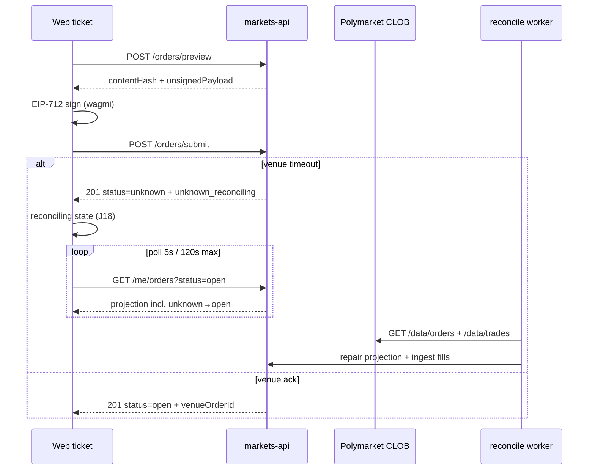

# MKT-P3-006 — PHASE-3 exit gate analysis

**Date:** 2026-08-09  
**Scope:** Readiness assessment after MKT-P3-005 + J18 unknown polling  
**Decision:** `current_phase` **not** advanced — staging proof and Playwright E2E remain open.

## Exit gate criteria (manifest)

| Gate | Requirement | Status | Evidence |
|------|-------------|--------|----------|
| `preview_sign_match` metric green | Golden vector + submit hash binding | **Green (unit)** | `TestMetricsRecordPreviewSignMatch`, `preview_test.go` golden vector |
| e2e journey J-03 pass | Market/rules review on web | **Not run** | No Playwright `e2e-j03` in CI for this workspace yet |
| Implicit: end-to-end limit order | preview → sign → submit → reconcile → list | **Partial** | Backend + web unit tests; staging blocked |

## Task completion matrix

| Task | Title | Backend | Web | Evidence |
|------|-------|---------|-----|----------|
| MKT-P3-001 | Order preview + hash | Done | N/A | `MKT-P3-001-evidence.md` |
| MKT-P3-002 | Submit glue | Done | N/A | `MKT-P3-002-glue-evidence.md` |
| MKT-P3-003 | Cancel + list | Done | N/A | `MKT-P3-003-evidence.md` |
| MKT-P3-004 | Web order ticket | N/A | Done (+ J18 delta) | `MKT-P3-004-evidence.md` |
| MKT-P3-005 | Reconciliation worker | Done | N/A | `MKT-P3-005-evidence.md` |
| MKT-P3-006 | Exit gate verification | **This doc** | **This doc** | Conditional |

Archived dashboard task (same ID in phase doc) is **not** on the critical path.

## End-to-end flow (current wiring)

### Contract alignment

| Step | OpenAPI | Implementation |
|------|---------|----------------|
| Preview | `POST /markets/orders/preview` | Match |
| Submit | `POST /markets/orders/submit` | Match (web path fixed) |
| Unknown handling | Poll `GET /markets/me/orders`, no resubmit | Match (J18 polling added) |
| Reconcile | 30s worker, no auto-resubmit | Match (`reconcile/worker.go`) |
| Kill switch | `features.order_submit` default false | Match |

## Gap analysis

### Closed this session

1. **Web submit path** — `/orders/submit` (was `/orders`)
2. **J18 unknown polling** — `pollOrderUntilTerminal` + `UnknownOrderPanel` + `reconciling` FSM state
3. **Fill visibility path** — reconcile worker ingests trades; `GET /me/fills` populated after match
4. **Shared projection store** — orders service + reconcile worker share `ProjectionStore`

### Still open for exit gate

| Blocker | Why it matters | Owner / next step |
|---------|----------------|-------------------|
| **BLK-001** ops staging | No human-approved staging wallet + eligibility proof | Human + `.whatNeeded.md` |
| **BLK-004** CLOB live creds | Submit against real venue requires explicit approval | Human; sandbox/httptest only in CI |
| **Playwright J-03 / J-07 / J-18** | Manifest exit cites J-03; trading spec cites J-07/J-18 | `fe-markets` — add `e2e-j07` unknown path |
| **`order_submit` enablement** | Capability default false — correct for safety | Flip only on staging with approval |
| **In-memory projections** | Process restart loses orders/fills | Accept for PHASE-3 v1; Postgres handoff separate |
| **L2 credentials unwired** | `UnwiredCredentialProvider` in dev | Required for real CLOB data plane |
| **Open orders page (J-08)** | Cancel UX route `/markets/orders` not built | PHASE-3 adjacent; not blocking preview-submit |
| **WebSocket `user.orders`** | REST poll only on web today | Acceptable per architecture (REST is source) |

### NFR-013 reconciliation SLO

- Target: unknown resolution **< 120s**
- Web poll: 5s interval, 120s timeout (matches)
- Backend worker: 30s interval (matches INDEXING spec light loop)

## Verification run (2026-08-09)

| Command | Result |
|---------|--------|
| `go test ./internal/markets/reconcile/... ./internal/markets/clob/... ./internal/markets/orders/... -count=1` | Pass |
| `go build -o /dev/null ./cmd/markets-api/` | Pass |
| `pnpm test:markets` (apps/web) | Pass (25 files, 80 tests) |
| `pnpm typecheck` (apps/web) | Pass |

## Recommendation

**Do not advance `current_phase` to PHASE-4.** Backend + web unit/integration layers for PHASE-3 trading core are structurally complete. Exit gate remains **CONDITIONAL** until:

1. Staging smoke with `MARKETS_ORDER_SUBMIT_ENABLED=true` + linked wallet (BLK-001)
2. At least one Playwright path covering J-07 happy + J-18 unknown (no resubmit assertion)
3. Human sign-off on BLK-004 scope for any live venue write claims

## Changed paths (J18 delta, this session)

| Path | Change |
|------|--------|
| `apps/web/src/products/markets/trading/lib/tradingApiClient.ts` | `listMyOrders`, extended submit response |
| `apps/web/src/products/markets/trading/lib/pollOrderStatus.ts` | Poll helper (120s SLO) |
| `apps/web/src/products/markets/trading/hooks/useOrderTicketFlow.ts` | `reconciling` FSM + poll |
| `apps/web/src/products/markets/trading/components/UnknownOrderPanel.tsx` | J18 panel |
| `apps/web/src/products/markets/trading/components/OrderTicketPanel.tsx` | Wire panel |
| `apps/web/src/products/markets/trading/lib/tradingCopy.ts` | Reconcile copy |
| `apps/web/src/products/markets/trading/__tests__/pollOrderStatus.test.ts` | Unit tests |
