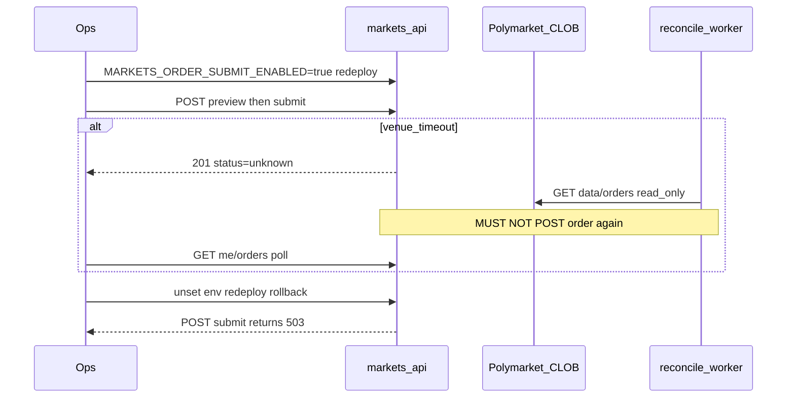

# BLK-004 — Ops staging checklist (CLOB submit rehearsal)

**Blocker:** BLK-004  
**Related tasks:** MKT-P3-002 (CLOB client + submit glue), MKT-P3-003 (cancel/list), MKT-P3-005 (reconcile worker)  
**Date:** 2026-08-10  
**Status:** **open — ops action required**

## Description

Operational checklist to rehearse Polymarket CLOB V2 order submit on **staging only**: wire L2/Builder env, flip the order-submit kill switch for a time-boxed window, capture integration proof, verify rollback to fail-closed, and confirm **never auto-resubmit** (D-06). Client layer and BFF glue are shipped; default deploy keeps submit disabled. Do not clear BLK-004 without human-filed staging evidence. **Do not enable `MARKETS_ORDER_SUBMIT_ENABLED` in production configs.** Do not invent mainnet or venue success in evidence files.

## 0. Developer intent (5W+1H)

| Dimension | Intent |
|-----------|--------|
| **Who** | DevOps injecting staging env; QA running smoke curls and UI path; ops owner for kill-switch window; orchestrator clearing BLK-004 after proof; engineering if L2 credential wiring is still required. |
| **What** | Staging rehearsal pack: L2 + Builder env, kill-switch flip (`MARKETS_ORDER_SUBMIT_ENABLED`), rollback to 503, timeout → `unknown_reconciling` → poll/reconcile without second POST /order. |
| **When** | After BLK-001 staging eligibility proof (or with documented 403 on eligible routes); after human approval for real on-chain transaction ([BLOCKERS §4](../../BLOCKERS_AND_HUMAN_APPROVALS.md)); before any live venue write claims or BLK-004 clearance. |
| **Where** | Staging `markets-api` deploy only (`ENVIRONMENT=staging`); evidence under `verification/PHASE-3/`; secrets in secret manager — never git or chat. |
| **Why** | BLK-004 blocks live CLOB submit claims; httptest/sandbox credentials in CI do not prove staging integration. Kill-switch and D-06 must be exercised before phase advance or production trading. |
| **How** | Complete prerequisites → set staging env → flip kill switch → smoke preview/sign/submit → verify reconcile path → rollback → file `MKT-P3-BLK004-staging-proof.md` → human clears blocker. |

### Worked example

**Happy path (full clearance).** Ops confirms staging deploy and BLK-001 `eligible: true`. Engineering has wired L2 credentials for the test session. Ops sets `MARKETS_BUILDER_CODE` and `MARKETS_ORDER_SUBMIT_ENABLED=true`, redeploys. QA completes SIWE, links test wallet, runs preview → wallet sign → submit. BFF returns `201` with `status: open` and a venue order id. QA lists open orders via `GET /me/orders`. Ops unsets `MARKETS_ORDER_SUBMIT_ENABLED`, redeploys; submit returns **503** `capability_disabled`. Evidence filed with redacted timestamps and ids.

**Timeout / reconcile path.** Submit returns `201` with `status: unknown` and `unknown_reconciling`. Client polls `GET /me/orders` only (no resubmit). Reconcile worker matches venue via `GET /data/orders` and repairs projection to `open`. Ops confirms metrics/logs show **one** BFF POST /order attempt — no duplicate submit.

**Partial rehearsal (valid evidence, does not full-clear BLK-004).** Kill-switch flip on/off demonstrated on staging with 503 rollback proof, while L2 remains unwired — document as partial; do **not** claim venue ack.

## Prerequisites

- [MKT-P3-002-glue-evidence.md](./MKT-P3-002-glue-evidence.md) — submit glue + kill switch
- [MKT-P3-003-evidence.md](./MKT-P3-003-evidence.md) — cancel gated same as submit
- [MKT-P3-005-evidence.md](./MKT-P3-005-evidence.md) — reconcile worker, never auto-resubmit
- [MKT-P2-BLK001-ops-staging-checklist.md](../PHASE-2/MKT-P2-BLK001-ops-staging-checklist.md) — eligibility upstream (BLK-001)
- [ORDER_LIFECYCLE.md §6.4](../../polymarket/ORDER_LIFECYCLE.md) — D-06 retry table
- [API_SDK_AND_ENDPOINT_REGISTRY.md §6.6.1](../../polymarket/API_SDK_AND_ENDPOINT_REGISTRY.md) — POST /order wire contract
- [BUILDER_RELAYER_AND_FEES.md §6.1](../../polymarket/BUILDER_RELAYER_AND_FEES.md) — Builder code (bytes32)
- [BLOCKERS_AND_HUMAN_APPROVALS.md §4](../../BLOCKERS_AND_HUMAN_APPROVALS.md) — Real on-chain transaction gate (MKT-P3-002)

Hard gates before flipping kill switch:

- [ ] Staging BFF deployed (`markets-api`); `ENVIRONMENT=staging`
- [ ] Human approval recorded for **Real on-chain transaction** gate (test wallet, small size)
- [ ] BLK-001 cleared **or** eligible routes documented as 403 until cleared
- [ ] Dedicated test wallet with minimal pUSD collateral (not production user funds)
- [ ] Builder code obtained from Polymarket Builders settings (`MARKETS_BUILDER_CODE`) — distinct from BLK-003 production Builder credentials
- [ ] Engineering confirms L2 credential provider wired (see §2) **or** rehearsal limited to kill-switch / 503 proof only

---

## 1. Required environment variables (staging only)

Inject in **staging** during the rehearsal window. Store secrets in secret manager — never commit values. **Production must keep `MARKETS_ORDER_SUBMIT_ENABLED` unset or false.**

### Kill switch and capabilities


| Variable | Staging rehearsal | Production |
| -------- | ----------------- | ------------ |
| `MARKETS_ORDER_SUBMIT_ENABLED` | `true` or `1` **only** during controlled window | **Must be unset or false** |
| `ENVIRONMENT` | `staging` | `production` |

**Two-layer kill switch (both documented):**

1. **Runtime gate:** `MARKETS_ORDER_SUBMIT_ENABLED` → when false/unset, `POST /orders/submit` and cancel POST return **503** `capability_disabled` (`apps/backend/internal/markets/orders/factory.go`).
2. **Public capability:** `GET /markets/capabilities` → `features.order_submit` remains **hardcoded false** in `service.go` until a separate product decision. Staging ops must **not** expect capabilities to flip when env is set; clients rely on ops coordination for staging windows.

### CLOB and Builder


| Variable | Required | Purpose |
| -------- | -------- | ------- |
| `MARKETS_CLOB_API_URL` | **Yes** | CLOB V2 base; default `https://clob.polymarket.com` (validated at boot) |
| `MARKETS_BUILDER_CODE` | **Yes** for attributed preview/submit | bytes32 builder field injected server-side at preview |

There is **no separate CLOB sandbox URL** in this codebase. Code "sandbox" means httptest + `clob.SandboxCredentials()` in unit tests only. Staging rehearsal uses the official CLOB host with a **limited test wallet** on Polygon — not a production launch.

### L2 credentials (server-side; human approval required)

Documented in [API_SDK §6.6.1](../../polymarket/API_SDK_AND_ENDPOINT_REGISTRY.md). **Not yet wired in `markets-api` main** — see §2. Intended secret names (ops placeholders until engineering implements provider):


| Variable (proposed) | Maps to | Purpose |
| ------------------- | ------- | ------- |
| `MARKETS_CLOB_L2_API_KEY` | `L2Credentials.APIKey` | CLOB L2 `POLY_API_KEY` |
| `MARKETS_CLOB_L2_SECRET` | `L2Credentials.Secret` | HMAC secret |
| `MARKETS_CLOB_L2_PASSPHRASE` | `L2Credentials.Passphrase` | L2 passphrase |
| `MARKETS_CLOB_L2_SIGNER_ADDRESS` | `L2Credentials.SignerAddress` | Signer EOA for L2 headers |

Per-session L1 → L2 derivation is specified in [AUTHENTICATION_AND_ACCOUNT_WALLETS.md §6.3–6.7](../../polymarket/AUTHENTICATION_AND_ACCOUNT_WALLETS.md). Until persistence lands, static staging creds may be used **only** after engineering wires `CredentialProvider` in `cmd/markets-api/main.go`.

### Reconcile worker


| Variable | Required | Purpose |
| -------- | -------- | ------- |
| `MARKETS_RECONCILE_ENABLED` | No (default **on**) | Set `false`/`0`/`off` only for isolated debugging — keep **on** during normal rehearsal |

### BLK-001 eligibility (required for preview/submit routes)


| Variable | Required | Purpose |
| -------- | -------- | ------- |
| `MARKETS_GEOIP_BASE_URL` | **Yes** | GeoIP resolver |
| `MARKETS_GEOBLOCK_BASE_URL` | **Yes** | Polymarket geoblock checker |

Full list: [MKT-P2-BLK001-ops-staging-checklist.md §1](../PHASE-2/MKT-P2-BLK001-ops-staging-checklist.md).

---

## 2. Pre-flight engineering checks

Stop and log blockers — do not invent venue success if these fail:


| Check | Code reference | Ops symptom if unwired |
| ----- | -------------- | ---------------------- |
| L2 creds for submit/cancel/reconcile | `main.go` uses `clob.UnwiredCredentialProvider{}` | Submit fails upstream; credentials unwired |
| L2 store for balances | `UnwiredL2CredentialStore{}` | `GET /me/balances` → **502** when eligible |
| BLK-001 eligibility | Default fail-closed | Preview/submit → **403** `ELIGIBILITY_DENIED` |
| Kill switch default off | `MARKETS_ORDER_SUBMIT_ENABLED` unset | Submit → **503** (expected before flip) |

- [ ] Confirm staging process env (redacted manifest or deploy audit)
- [ ] Confirm `go build ./cmd/markets-api/` artifact matches deployed digest
- [ ] Confirm reconcile worker running: metric `retropick_markets_order_reconcile_*` or logs every ~10s
- [ ] If L2 unwired: limit rehearsal scope to §3 + §9 (kill-switch flip/rollback only); label proof **partial**

---

## 3. Kill-switch flip procedure (staging only)

1. Confirm target deploy unit is **staging** (`ENVIRONMENT=staging`); not production manifest.
2. Audit **production** and other envs: `MARKETS_ORDER_SUBMIT_ENABLED` absent or false (screenshot/redacted config).
3. Confirm BLK-001 clearance **or** document that eligible-gated routes return 403 until cleared.
4. Record human approval for **Real on-chain transaction** ([BLOCKERS §4](../../BLOCKERS_AND_HUMAN_APPROVALS.md)).
5. Set in staging secret store only:
   - `MARKETS_BUILDER_CODE` (if not already set)
   - `MARKETS_ORDER_SUBMIT_ENABLED=true`
6. Redeploy `markets-api`; confirm pods/process picked up env (no stale config).
7. Smoke capabilities (expected discrepancy):

```bash
curl -sS "${STAGING_API}/api/v1/markets/capabilities" | jq '.features.order_submit'
# Expected: false (hardcoded in service.go — NOT a flip failure)
```

8. Smoke kill switch off → on (authenticated session, allowed region):

```bash
# With valid mkt_session cookie + Idempotency-Key header on write routes
curl -sS -b "mkt_session=<cookie>" \
  -X POST "${STAGING_API}/api/v1/markets/orders/submit" \
  -H "Content-Type: application/json" \
  -H "Idempotency-Key: <uuid>" \
  -d '{}' | jq .
# Before flip: 503 capability_disabled
# After flip: NOT 503 (may be 400/502 if body/L2 invalid — not a kill-switch pass by itself)
```

9. Assign ops owner; **time-box** window (example: 4 hours max); announce start/end in ops channel.
10. **Do not** change production configs or hardcode `order_submit: true` in `service.go` for this rehearsal.

---

## 4. Rehearsal smoke steps

Replace `STAGING_API` with staging base URL. Redact secrets, session cookies, and wallet addresses in evidence.

### 4.1 Fail-closed baseline (before flip)

```bash
curl -sS "${STAGING_API}/api/v1/markets/capabilities" | jq '.features.order_submit'
curl -sS "${STAGING_API}/api/v1/markets/eligibility" | jq .
```

**Pass (baseline):** `order_submit: false`; eligibility per BLK-001 state.

### 4.2 Eligible session + preview

With SIWE session from allowed region and linked test wallet:

```bash
curl -sS -b "mkt_session=<cookie>" \
  -X POST "${STAGING_API}/api/v1/markets/orders/preview" \
  -H "Content-Type: application/json" \
  -H "Idempotency-Key: <uuid>" \
  -d '<valid preview body per OpenAPI>' | jq .
```

**Pass:** `200` with `contentHash` and `unsignedPayload` including server-injected `builder`.

### 4.3 Sign and submit (full clearance path only)

1. Client signs EIP-712 typed data from preview (wallet UI — not curl).
2. Submit with matching `contentHash`, `previewId`, signature:

```bash
curl -sS -b "mkt_session=<cookie>" \
  -X POST "${STAGING_API}/api/v1/markets/orders/submit" \
  -H "Content-Type: application/json" \
  -H "Idempotency-Key: <uuid>" \
  -d '<submit body>' | jq .
```

**Pass (full clearance):** `201` with `status: open` (or `unknown` + reconcile path in §5); venue order id present in response or after poll.

**Not a pass:** Invented order ids; httptest-only runs; success claims while L2 unwired.

### 4.4 List and cancel (optional)

```bash
curl -sS -b "mkt_session=<cookie>" \
  "${STAGING_API}/api/v1/markets/me/orders?status=open" | jq .

curl -sS -b "mkt_session=<cookie>" \
  -X POST "${STAGING_API}/api/v1/markets/orders/<orderId>/cancel" \
  -H "Idempotency-Key: <uuid>" | jq .
```

### 4.5 Web UI path (recommended)

Use staging web with `NEXT_PUBLIC_API_BASE_URL` → staging BFF. Exercise order ticket: preview → sign → submit. For unknown state, confirm J18 panel polls `GET /me/orders` — no resubmit control.

---

## 5. Never auto-resubmit verification (D-06)

Policy: [ORDER_LIFECYCLE §6.4](../../polymarket/ORDER_LIFECYCLE.md) — POST /order timeout → `unknown_reconciling`; poll open orders; **MUST NOT** auto resubmit.

Unit invariant: `TestWorkerNeverAutoResubmitsUnknownWithoutVenueMatch` in `reconcile/worker_test.go` ([MKT-P3-005-evidence](./MKT-P3-005-evidence.md)).

### Ops verification checklist

- [ ] `MARKETS_RECONCILE_ENABLED` not disabled during rehearsal (default on)
- [ ] Induce or observe submit timeout → BFF returns `201` with `status: unknown` / `unknown_reconciling`
- [ ] Client/UI polls `GET /me/orders` only — no second user-initiated submit for same preview
- [ ] Inspect BFF logs/metrics: **one** POST /order attempt for that idempotency key
- [ ] Reconcile worker calls CLOB `GET /data/orders` / `GET /data/trades` only — no POST /order from worker
- [ ] After match: projection repairs to `open` or `rejected`; `retropick_markets_order_submit_total` shows no duplicate `ok` for same correlation
- [ ] Rollback kill switch (§9) does not trigger resubmit of unknown rows



---

## 6. Pass criteria (BLK-004 clearance)

Evidence file: **`MKT-P3-BLK004-staging-proof.md`** in this directory (human ops creates after rehearsal — not pre-filled by agents).

### Partial clearance (kill-switch rehearsal only)

Valid when L2 still unwired; **does not** full-clear BLK-004:


| # | Criterion | Evidence |
| - | --------- | -------- |
| P1 | Staging-only `MARKETS_ORDER_SUBMIT_ENABLED=true` set and redeployed | Redacted env audit + timestamp |
| P2 | Submit/cancel return **503** before flip | Saved curl output |
| P3 | Submit/cancel return **not 503** after flip (or documented upstream error other than capability_disabled) | Saved curl output |
| P4 | Rollback: unset env → submit returns **503** again | Saved curl output |
| P5 | Production configs verified **without** `MARKETS_ORDER_SUBMIT_ENABLED=true` | Redacted prod manifest |
| P6 | Proof filed | `MKT-P3-BLK004-staging-proof.md` labeled **partial** |

### Full clearance (venue integration)

All partial criteria **plus**:


| # | Criterion | Evidence |
| - | --------- | -------- |
| F1 | L2 credential provider wired and staging creds injected | Engineering sign-off + redacted config |
| F2 | BLK-001 `eligible: true` on staging for test egress | Cross-ref BLK-001 proof |
| F3 | Real venue ack: `201` + `open` with venue order id (redacted) | Saved response + timestamp |
| F4 | D-06 verified: timeout/reconcile path with no second POST /order | Logs/metrics excerpt |
| F5 | Optional: cancel resting test order on venue | Redacted cancel response |
| F6 | Human gate §4 sign-off for real on-chain transaction | Named approver + date |
| F7 | Proof filed | `MKT-P3-BLK004-staging-proof.md` labeled **full** |

Orchestrator updates [BLOCKERS_AND_HUMAN_APPROVALS.md](../../BLOCKERS_AND_HUMAN_APPROVALS.md) BLK-004 row **only after** human-filed full proof — not as part of checklist authorship alone.

---

## 7. Who clears BLK-004


| Role | Action |
| ---- | ------ |
| **DevOps / ops** | Inject staging env, flip kill switch, rollback, rotate staging L2 secrets on compromise |
| **QA / ops** | Run §4 smoke + §5 D-06 checks; file `MKT-P3-BLK004-staging-proof.md` |
| **Engineering** | Wire L2 `CredentialProvider` + session store before full clearance |
| **Security / ops** | Sign off human gate §4 for test wallet writes |
| **Orchestrator / product owner** | Update BLOCKERS BLK-004 after full proof; unblock MKT-P3-006 staging claims; **do not** advance `current_phase` without separate user authorization |

Agents **must not** mark BLK-004 cleared or claim mainnet/venue submit success without human-filed staging proof.

---

## 8. What NOT to do

- **Do not** set `MARKETS_ORDER_SUBMIT_ENABLED=true` in **production** configs or prod secret stores
- **Do not** invent mainnet submit success, venue order ids, or curl output in evidence
- **Do not** clear BLK-004 from unit tests, httptest, or `clob.SandboxCredentials()` alone
- **Do not** auto-resubmit on timeout (forbidden for BFF, reconcile worker, clients, and ops)
- **Do not** hardcode `capabilities.features.order_submit: true` in staging as a substitute for ops kill-switch discipline
- **Do not** advance `current_phase` as part of this checklist
- **Do not** conflate staging Builder code with BLK-003 production Builder credentials (PHASE-7)

---

## 9. Rollback

1. Unset `MARKETS_ORDER_SUBMIT_ENABLED` or set `false` in **staging** secret store only.
2. Redeploy staging `markets-api`; confirm env picked up.
3. Verify submit fail-closed:

```bash
curl -sS -b "mkt_session=<cookie>" \
  -X POST "${STAGING_API}/api/v1/markets/orders/submit" \
  -H "Content-Type: application/json" \
  -H "Idempotency-Key: <uuid>" \
  -d '{}' | jq .
# Expected: 503 capability_disabled
```

4. Verify cancel fail-closed (same gate as submit per MKT-P3-003).
5. Verify `GET /markets/capabilities` → `order_submit: false` (unchanged).
6. **Resting venue orders are not canceled** by rollback — only new submits blocked ([FUNDS_DEPOSIT_AND_WITHDRAWAL §14](../../polymarket/FUNDS_DEPOSIT_AND_WITHDRAWAL.md)).
7. Reconcile worker may continue **read-only** repair of in-flight `unknown` / `cancel_pending` rows (`MARKETS_RECONCILE_ENABLED` default on).
8. Incident escalation: conceptual ops flag `markets.orders.disabled` ([INCIDENT_RESPONSE §containment](../../security/INCIDENT_RESPONSE.md)); implementation today is env-based `MARKETS_ORDER_SUBMIT_ENABLED` — use unset/false for routine rollback.

---

## 10. Related evidence

- [MKT-P3-002-evidence.md](./MKT-P3-002-evidence.md) — CLOB client layer
- [MKT-P3-002-glue-evidence.md](./MKT-P3-002-glue-evidence.md) — BFF submit glue + kill switch
- [MKT-P3-003-evidence.md](./MKT-P3-003-evidence.md) — cancel/list
- [MKT-P3-005-evidence.md](./MKT-P3-005-evidence.md) — reconcile worker
- [MKT-P3-006-phase-gate.md](./MKT-P3-006-phase-gate.md) — exit gate blocked on BLK-004 ops sign-off
- [MKT-P3-006-exit-gate-analysis.md](./MKT-P3-006-exit-gate-analysis.md) — gap analysis
- [MKT-P2-BLK001-ops-staging-checklist.md](../PHASE-2/MKT-P2-BLK001-ops-staging-checklist.md) — eligibility prerequisite
- [.whatNeeded.md §D.1](../../.whatNeeded.md) — Builder / external accounts by phase
