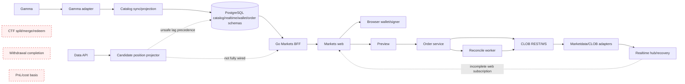
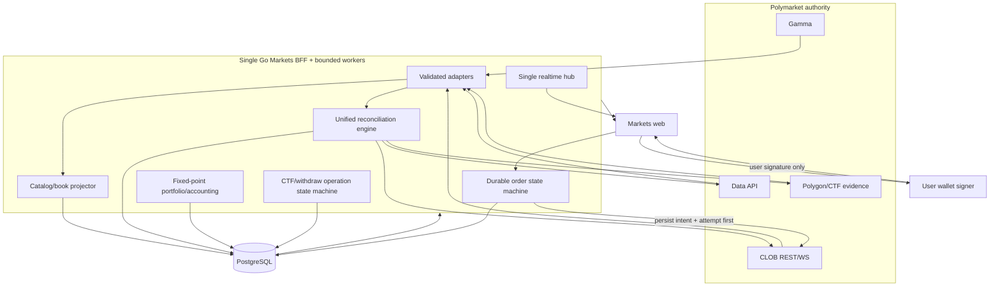

# RetroPick Markets V1 — Phase 1–4 System Verification and Architecture Audit

**Audit date:** 2026-08-10  
**Repository:** `/home/asyam/dev/set-up/projects/retropick`  
**Audited committed baseline:** `main` at `3ec4425a3cb57ff473999a234dfef94b3c6d2c38`  
**Audited candidate baseline:** the staged index captured at the start of the audit  
**Mode:** independent, adversarial, read-only audit; safe local fixtures, disposable databases, and simulated upstreams only  
**System verdict:** **NO-GO — HIGH confidence**

## Description

This report reconstructs the implementation truth of RetroPick Markets V1 PHASE-1 through PHASE-4. It deliberately distinguishes specifications, executable code, wiring, tests, runtime proof, failure safety, observability, and production readiness. Repository status labels are treated as claims rather than evidence.

The original audit ran from immutable `/tmp` snapshots of committed `main` and the staged index. No live order, mainnet CTF operation, production secret, user fund movement, deployment, commit, push, reset, clean, or stash was performed. The temporary report expired; this document was reconstructed from the preserved audit evidence and intentionally copied into `.dev` at the user's explicit request.

## 0. Developer intent (5W+1H)

| Question | Answer |
|---|---|
| Who | Principal engineering, backend, web, wallet/security, database, QA/SDET, reliability, performance, and production-readiness reviewers. |
| What | Determine whether PHASE-1–4 form one coherent and failure-safe Polymarket product rather than a collection of plausible files. |
| When | At `main` commit `3ec4425…` and the contemporaneous staged candidate captured on 2026-08-10. |
| Where | Markets V1 specs, harness, OpenAPI, Go backend, Markets web, migrations, CI, and local Polymarket reference snapshots. |
| Why | Trading and wallet paths can lose funds or misrepresent state even when compilation and unit tests are green. |
| How | Trace spec → code → schema → migration → unit/contract/integration/E2E/failure test → observability → runtime, then assign evidence-bounded verdicts. |

**Worked example:** an order preview file and a passing handler test establish only implementation and a narrow test. They do not prove that the signed payload equals the preview, that intent is durable before the network call, or that an accepted-but-timed-out order reconciles without duplication. Those missing links block verification.

---

## A. Executive System Verdict

### Does Phase 1 work?

**PARTIALLY VERIFIED — HIGH confidence.** The committed and staged baselines contain a substantial read stack: canonical OpenAPI shapes, Gamma/catalog adapters, PostgreSQL migrations and projections, Go read handlers, Markets web read routes, and targeted tests. Empty-database migration and bounded local runtime probes succeeded. However, stale Gamma cache data can be relabelled as a fresh projection, the realtime server can suppress polling while the web has no corresponding realtime consumer, and the complete snapshot/gap/reconnect/browser journey is not proven. Phase 1 is useful but does not meet its stated realtime-integrity and production-readiness exit gate.

### Does Phase 2 work?

**INCOMPLETE — HIGH confidence.** Session, eligibility, wallet discovery, balance, and capability-shaped code exists, and targeted tests cover portions of it. The phase is not safe as an integrated account/funding system: SIWE domain policy defaults fail open, account/deposit-wallet linkage accepts client-asserted addresses without sufficient proof, and deterministic deposit, notification, withdrawal-preview expiry, and restricted relayer lifecycles are missing or unproven. Signer/funder/Safe separation is modeled but not proven end to end.

### Does Phase 3 work?

Committed `main` is **INCOMPLETE** and the staged candidate is **REGRESSED — HIGH confidence**. Preview, order, CLOB, cancellation, reconciliation, Neg Risk, kill-switch, and web ticket pieces exist. Adversarial verification found release-blocking CLOB V2 amount/signature divergence, concurrent duplicate venue submissions for one idempotency key, and persistence occurring after the venue call. A crash or ambiguous response can therefore lose intent or cause duplication. Existing Playwright flows use intercepted routes and cannot prove the integrated BFF/venue lifecycle.

### Does Phase 4 work?

Committed `main` is **NOT IMPLEMENTED** and the staged candidate is **INCOMPLETE — HIGH confidence**. The candidate adds position/activity projection code, OpenAPI shapes, tests, and migration `000022`, but the service is not fully wired and an upstream-lag path can erase stronger fill-derived evidence. Deterministic cost basis/PnL, CTF split/merge, redemption recovery, withdrawal completion, evidence precedence, reorg handling, and double-execution protection are absent.

### Does the integrated Phase 1–4 system work?

**NO-GO — HIGH confidence.** J1 read-only is partially demonstrated; J2–J8 are not proven as coherent restart-safe journeys. The user-fund-sensitive invariants fail before the lack of full integration is considered. Venue order submission must remain disabled. No green build, unit-test set, or manifest label overrides these failures.

---

## B. Repository / Lineage Truth

| Item | Observed truth | Confidence |
|---|---|---|
| Branch | `main` | High |
| HEAD | `3ec4425a3cb57ff473999a234dfef94b3c6d2c38`; matched `origin/main` when captured | High |
| Root worktree | Very dirty/staged before the audit: 1,831 staged entries; approximately 260,309 insertions and 48,533 deletions | High |
| Status classes | `M 33`, `A 1390`, `D 405`, `R 3`, `?? 1` | High |
| Clean baseline | Git tree at HEAD, materialized separately under `/tmp` | High |
| Candidate baseline | Staged index materialized separately under `/tmp`; uncommitted and therefore never release-eligible | High |
| Other worktrees | Detached `90a27…`; staging backup `919b…`; Markets branch `0a871…`; docs branch `c9c6…` | High |
| Candidate deletion | Staged candidate deletes `apps/fe-v1` while root scripts still reference the associated workspace filter | High |
| Submodules | `git submodule status` fails after Android because a legacy archived path lacks a `.gitmodules` mapping | High |
| Manifest | `current_phase: PHASE-2`, last updated 2026-07-25; P1 complete, P2 ready, P3/P4 planned | High |
| Phase specs | Updated 2026-08-09 and define ten tasks per phase | High |
| Task graph | Older task sets/statuses; P2–P4 IDs and ownership do not match the current phase specifications | High |
| Audit integrity | Pre/post repository-status SHA-256 was identical: `341e6338d250a512dd890a1c0593301c2fb62a76d846049e1fced44f70bff8ba` | High |

### Claim-to-reality drift

| Claim | Source | Evidence | Reality | Verdict |
|---|---|---|---|---|
| P1 complete | Manifest/task graph | Code, tests, local migration/runtime probes | Read path exists; realtime/staleness exit criteria not proven | Not verified |
| P2 ready/conditional | Manifest/evidence | Auth/wallet/eligibility packages | Critical binding and fail-closed policy gaps remain | Incomplete |
| P3 planned | Manifest | Orders/CLOB/reconcile/web code exists | More implemented than metadata claims, but unsafe | Regressed candidate |
| P4 planned | Manifest | Candidate position/activity code and migration | Partial implementation only; CTF/PnL/redeem/withdraw absent | Incomplete |
| BLK-004 says CLOB absent | Blocker list | Current candidate includes CLOB implementation | Blocker prose is stale, but the implementation fails V2 safety | Drift |
| E2E is green | Verification artifacts | Playwright intercepts API routes | UI-state test, not full-system E2E | Unproven |

---

## C. Phase Status Reconstruction

| Phase | Docs claim | Manifest | Code | Tests | Runtime | Actual verdict |
|---|---|---|---|---|---|---|
| P1 | Ten-task catalog/read exit | Complete | Substantial | Strong unit/contract, incomplete system/realtime | Local migration and read-service probe; no trustworthy complete realtime journey | **PARTIALLY VERIFIED** |
| P2 | Ten-task account/funding exit | Ready/conditional in older harness | Partial | Targeted auth/eligibility/wallet tests | No full readiness/funding journey | **INCOMPLETE** |
| P3 | Ten-task web trading exit | Mostly planned in stale graph | Broad but unsafe | Unit/race and mock-heavy E2E | No safe durable venue lifecycle | **INCOMPLETE** clean / **REGRESSED** staged |
| P4 | Ten-task portfolio/CTF exit | Planned | Absent on clean; positions/activity partial on staged | Narrow projection tests | No integrated portfolio/CTF/withdraw journey | **NOT IMPLEMENTED** clean / **INCOMPLETE** staged |

### Independent phase dimensions

| Phase | Specified | Implemented | Wired | Tested | Integrated | Failure-safe | Observable | Production-ready |
|---|---:|---:|---:|---:|---:|---:|---:|---:|
| P1 | Yes | Mostly | Partial | Partial | Partial | No | Partial | No |
| P2 | Yes | Partial | Partial | Partial | No | No | Partial | No |
| P3 | Yes | Partial | Partial | Partial | No | No | Partial | No |
| P4 | Yes | Partial candidate only | No | Narrow | No | No | Minimal | No |

---

## D. Phase 1 Audit

| Capability | Specification | Implementation | Test/runtime evidence | Finding |
|---|---|---|---|---|
| OpenAPI | Canonical normalized read contract | `schemas/openapi/markets-v1.yaml`; staged version 1.4.0 | Backend conformance tests passed; generated TS drift found | Contract source exists; consumer generation is not reliably gated |
| Gamma catalog | Pagination, validation, durable projection, failure handling | `internal/markets/gamma`, `catalog`, `syncworker` | Targeted clean/staged Go suites and race runs passed | Malformed/empty/rate-limit coverage is useful; stale-cache freshness bug remains |
| Database | Ordered expand-only markets migrations | `000016`, `000017`, `000019` and repository helpers | Fresh local PostgreSQL migration succeeded and was non-dirty | Core schema boots; upgrade/rollback/reorg breadth remains incomplete |
| Market detail | BFF-owned canonical state | Go Markets handlers and catalog projection | Local mocked-upstream runtime returned through BFF | Real browser/BFF journey only partial |
| Order book | Snapshot before delta, explicit degraded states | Marketdata/realtime reducer and recovery structures | Unit/replay-like tests exist | No complete proof for all gap, epoch, sleep, and tick-change cases |
| Price history | Canonical observations | Markets price observation schema/handlers | Narrow handler/storage tests | End-to-end source freshness and pagination not fully proven |
| Web read | Listing/detail/loading/stale/offline | `apps/web/src/products/markets` | Web tests/build exercised in candidate snapshot | Realtime consumption gap makes displayed liveness unreliable |
| Signals | Foundation only; no signal→order path | `internal/markets/signals` | Targeted tests passed | Scope separation appears preserved |
| Observability | Catalog freshness, Gamma errors, WS/resync, book age | Metrics/log hooks exist | Emission tests are uneven; dashboard/alerts unproven | Implemented ≠ operationally actionable |
| Exit gate | Canonical BFF render, stale behavior, contracts, migrations, realtime integrity | Evidence files/labels present | Multiple links remain unproven | Gate claim cannot be accepted |

**P1 correctness finding:** a stale Gamma response cached locally can be persisted/served with projection observation time that appears fresh. This violates the requirement that uncertain or stale state never appear live.

**P1 realtime finding:** server-side realtime capability can disable polling, but the reviewed Markets web does not establish the matching subscriber path. This can turn a nominal optimization into a silent data freeze.

---

## E. Phase 2 Audit

| Capability | Specification | Implementation | Test/runtime evidence | Finding |
|---|---|---|---|---|
| SIWE/session | Nonce, replay prevention, domain/chain binding, expiry/revocation | `internal/markets/auth` | Targeted/race tests pass; adversarial policy probe fails | Missing domain configuration defaults open |
| Eligibility | Server-authoritative; unknown never allowed | `internal/markets/eligibility/geoblock` | Timeout/500/malformed unit coverage exists | Core unknown logic is fail-closed, but integrated policy proof is incomplete |
| Identity model | Separate signer, user, account/deposit wallet, builder | Auth/wallet types expose identities | Narrow store/handler tests | Client-asserted account/deposit address can be linked without sufficient ownership/derivation proof |
| Safe/account discovery | Undeployed/deployed and wallet-switch behavior | Wallet discovery/account store partial | PostgreSQL account-store tests exercised | Full Safe/deposit-wallet lifecycle not proven |
| Approvals | Separate collateral/CTF allowance/operator readiness | Capability and balance-shaped endpoints | Mostly contract/unit evidence | No deterministic complete readiness matrix |
| Balances | Projection with authority/source labeling | `internal/markets/balances` | Targeted unit tests | Venue/Data/chain precedence not integrated |
| Deposit | created→pending→confirmed→projected→reconciled | No complete funding state-machine module | No duplicate/reorg/restart system test | Not implemented to exit-gate standard |
| Withdrawal preview | amount/destination/fee/network/eligibility/expiry | Contract shapes/partial handlers | No comprehensive deterministic vectors | Incomplete |
| Notifications | Funding transitions without duplication | No complete delivery/idempotency path | No integration evidence | Not implemented |
| Relayer sandbox | Contract/function allowlist, budgets, limits, kill switch | Partial wallet relay surfaces | No complete abuse/allowlist proof | Not release-ready |

---

## F. Phase 3 Audit

| Capability | Specification | Implementation | Test/runtime evidence | Finding |
|---|---|---|---|---|
| Preview | Tick, liquidity, fee, slippage, bounds, hash | `internal/markets/orders` | Unit/property-like vectors exist | V2 wire/signing inputs diverge from current official semantics |
| Preview→sign | What user saw = signed = submitted | Hash/binding structures exist | Tamper tests cover some fields | Cannot pass while V2 signed/wire fields and amount semantics are wrong |
| Market intent | Bounded marketable order only | Limit-oriented preview path | Boundary tests partial | Stale/bounded behavior not proven end-to-end |
| Submit | Persist intent+attempt before network | Order and attempt stores exist | Adversarial crash-ordering review | Persistence occurs after network submission |
| Idempotency | One logical intent and one venue outcome | Idempotency key plumbing exists | Concurrent adversarial test demonstrated multiple venue calls | Release blocker |
| Ambiguous response | UNKNOWN_RECONCILING; never blind retry | Reconcile package models unknown/cancel-pending | Narrow unit tests | Durability gap can lose the state needed to reconcile |
| Partial fills | First-class remaining/fill accounting | Orders/fills structures exist | Unit scenarios exist | Portfolio handoff and cancel race not proven across persistence/restart |
| Cancel race | Converge without losing fill | Cancel and reconcile handlers exist | Mocked/narrow tests | No authoritative full race proof |
| Neg Risk | Capability-driven routing | Golden routing vectors and code exist | Unit tests pass | Cannot rescue unsafe base submission semantics |
| Kill switch | Stop submit, preserve reads/reconcile/cancel policy | `MARKETS_ORDER_SUBMIT_ENABLED` defaults false | Configuration tests exist | Correct default; dynamic integrated proof limited |
| Web flow | Preview→sign→pending→fill/cancel with truthful states | Order ticket and API client code | Playwright J03/J07 intercept network routes | Mock UI E2E only, not integrated E2E |

### Trading release blockers

1. **CLOB V2 divergence:** reviewed code retains incompatible amount/signature assumptions. Current V2 semantics changed signed fields, BUY sizing, timestamp/metadata/builder behavior, and fee handling.
2. **Concurrent duplicate submission:** the same idempotency key can pass the preflight concurrently and invoke the venue more than once.
3. **Wrong durability order:** intent/attempt persistence occurs after the external call, contradicting the required write-before-submit invariant.
4. **Unknown recovery cannot be trusted:** after a process crash or response loss, the service may lack durable evidence required for safe venue lookup.

---

## G. Phase 4 Audit

| Capability | Clean main | Staged candidate | Test/runtime evidence | Finding |
|---|---|---|---|---|
| Positions | Absent | `internal/markets/positions` projection/store code | Unit/race tests pass | Not fully wired; source precedence is unsafe under lag |
| Orders/fills activity | P3-only fragments | Activity projection added | Narrow tests | No integrated durable accounting path |
| Cost basis | Absent | No complete versioned policy | No authoritative vectors | Not implemented |
| Realized/unrealized PnL | Absent | No complete fixed-point engine | No accounting suite | Not implemented |
| Portfolio value | Absent | Partial shapes/projection | No full journey | Unproven |
| Resolution/claimable | Absent | Contract shapes insufficient | No deterministic resolution suite | Not implemented |
| CTF split/merge | Absent | Explicitly excluded from positions package | No safe simulation vectors | Not implemented |
| Redemption | Absent | No complete operation/recovery engine | No duplicate/reorg/restart proof | Not implemented |
| Withdrawal completion | Absent | No complete operation/recovery engine | No duplicate/reorg/restart proof | Not implemented |
| Reconciliation | Absent | Partial Data API position reconciliation | Adversarial lag test exposes overwrite risk | Unsafe and incomplete |

**Evidence-authority defect:** the candidate reconciliation path can replace locally known fill-derived position evidence with a lagging upstream absence/zero. Portfolio is correctly described as a projection in documentation, but the executable precedence policy is not sufficiently explicit or safe.

---

## H. Task-Level Traceability

`Declared` reflects the stale harness where known; `Code/tests/evidence` reflect observed executable truth. “Moved/archived” tasks are retained so all forty current specification rows are accounted for.

| Task | Declared | Code | Tests | Evidence | Verdict |
|---|---|---|---|---|---|
| MKT-P1-001 OpenAPI expansion | Done | Yes | Contract tests | Runtime/schema parity partial; TS stale | Partial |
| MKT-P1-002 Gamma hardening | Done | Yes | Meaningful unit/race | Stale-cache semantics fail | Partial |
| MKT-P1-003 DB schema v1 | Done | Yes | Migration tests | Fresh DB migration passed | Verified scope |
| MKT-P1-004 Web read routes | Done | Yes | Unit/build | BFF journey partial | Partial |
| MKT-P1-005 Signal foundation | Done | Yes | Unit | No signal→order path observed | Verified scope |
| MKT-P1-006 Realtime recovery design | Done | Partial | Reducer/recovery tests | Browser subscription gap | Partial |
| MKT-P1-007 Android scaffold plan | Done | Plan/prototype only | No P1 Android system test | Prototype uses mock data | Implemented but unproven |
| MKT-P1-008 Contract conformance | Done | Yes | Backend tests | Client generation drift | Partial |
| MKT-P1-009 Observability baseline | Done | Partial | Emission checks uneven | No dashboard/alert proof | Partial |
| MKT-P1-010 Exit gate | Done | Artifact | No complete gate reproduction | Exit criteria fail | Not verified |
| MKT-P2-001 Wallet/session auth | Done | Yes | Unit/race | SIWE domain fail-open | Incomplete |
| MKT-P2-002 Eligibility | Blocked in old graph | Yes | Unit/adversarial | Core fail-closed; integration incomplete | Partial |
| MKT-P2-003 Account wallet discovery | Done | Partial | Store/handler | Binding proof deficient | Incomplete |
| MKT-P2-004 Token approvals | Done | Partial | Narrow | Full readiness matrix absent | Incomplete |
| MKT-P2-005 Balance projections | Done | Partial | Unit | Evidence precedence incomplete | Partial |
| MKT-P2-006 Deposit flow | Done | No complete lifecycle | No restart/reorg suite | State machine absent | Not implemented |
| MKT-P2-007 Withdrawal preview | Done/conditional old gate | Partial | Narrow | Expiry/policy vectors incomplete | Incomplete |
| MKT-P2-008 Funding notifications | Missing from old graph | No complete path | None meaningful | No idempotent integration | Not implemented |
| MKT-P2-009 Relayer sandbox | Missing from old graph | Partial | Narrow | Allowlist/budget/rate-limit proof absent | Incomplete |
| MKT-P2-010 Exit gate | Missing from old graph | Artifact only | No complete gate | Critical failures remain | Blocked |
| MKT-P3-001 Order preview | Done | Yes | Unit/vectors | V2 semantics mismatch | Regressed |
| MKT-P3-002 CLOB V2 submission | Planned | Yes candidate | Unit/mock | Official differential fails | Regressed |
| MKT-P3-003 Open orders/fills | Planned | Partial | Unit | Persistence/integration incomplete | Incomplete |
| MKT-P3-004 Cancellation | Planned | Partial | Unit | Cancel/fill race unproven | Incomplete |
| MKT-P3-005 Reconciliation worker | Planned | Partial | Unit | Durable unknown handoff unsafe | Incomplete |
| MKT-P3-006 Health analytics | Superseded | Correctly not required | N/A | Archived by current spec | Archived |
| MKT-P3-007 Web order ticket | Missing/stale graph | Yes | Mock-heavy E2E | No real BFF lifecycle | Implemented but unproven |
| MKT-P3-008 Neg Risk routing | Missing/stale graph | Yes | Golden vectors | Base submit unsafe | Partial |
| MKT-P3-009 Web E2E | Missing/stale graph | Fixtures/intercepts | Playwright mocked | Not end-to-end | Unproven |
| MKT-P3-010 Exit gate | Missing/stale graph | Artifact only | No complete gate | Safety invariants fail | Blocked |
| MKT-P4-001 Position projection | Planned | Candidate only | Unit/race | Not fully wired; overwrite risk | Incomplete |
| MKT-P4-002 Activity feed | Planned | Candidate partial | Narrow | No full journey | Incomplete |
| MKT-P4-003 Whale feed | Planned old ownership | Moved to SM-I-001 | Intelligence tests separate | Correctly not P4 authority | Moved |
| MKT-P4-004 CTF split/merge | Planned | No | None | Explicitly absent | Not implemented |
| MKT-P4-005 Resolution/redemption | Planned | No | None | No recovery engine | Not implemented |
| MKT-P4-006 Withdrawal completion | Planned | No | None | No recovery engine | Not implemented |
| MKT-P4-007 Wallet profiling | Planned old ownership | Moved to SM-I-003 | Intelligence tests separate | Correctly not P4 authority | Moved |
| MKT-P4-008 PnL analytics | Planned | No complete engine | None authoritative | Cost basis undefined | Not implemented |
| MKT-P4-009 Reconciliation tests | Planned | Narrow partial | Adversarial failure | Missing conflict/reorg matrix | Incomplete |
| MKT-P4-010 Exit gate | Planned | No | No | P4 lifecycle absent | Blocked |

---

## I. Requirement Coverage

| Requirement family | Implementation | Test | Evidence verdict |
|---|---|---|---|
| Canonical BFF markets reads | Present | Unit/contract/local runtime | Partial |
| Snapshot-first, stale-explicit realtime | Partial | Reducer tests | Missing complete browser/recovery proof |
| Read-only without wallet | Present in Markets web | UI tests | Partial; trading outage isolation unproven |
| No server custody | No user-key custody found | Static/config review | Supported, not full production secret audit |
| Eligibility fail-closed | Core service present | Failure vectors | Partial due policy integration |
| Signer/funder/account separation | Types and routes present | Narrow tests | Binding not proven |
| Fixed-point money | Mostly string/integer domain values | Unit coverage | Gaps remain at client/display boundaries |
| Preview-before-sign and exact binding | Present structurally | Some tamper vectors | Fails current V2 differential |
| Intent/attempt before submit | Store types present | Adversarial ordering | Fails |
| Idempotent submit | Key present | Concurrent adversarial test | Fails |
| Ambiguous submit reconciliation | Worker model present | Narrow tests | Blocked by durability |
| Partial/cancel race | Models present | Narrow tests | Integrated proof missing |
| Projection not ownership authority | Documented | Candidate tests insufficient | Reconciliation precedence fails |
| CTF preview-before-sign | Specified | None | Not implemented |
| Redemption/withdraw recovery | Specified | None | Not implemented |

---

## J. Architecture Diagram — Current

Only observed executable components are shown; dotted links are incomplete or unproven.

---

## K. Architecture Diagram — Recommended

Keep this a modular monolith: Go BFF, PostgreSQL, bounded workers, canonical OpenAPI, one realtime hub, and existing web client. No Kafka, extra database, or microservice split is justified by current evidence.

---

## L. End-to-End System Flow

| Link | State |
|---|---|
| Polymarket Gamma → validated adapter | Implemented, partially verified |
| Adapter → durable catalog projection | Implemented, freshness semantics defective |
| Projection → Go BFF → web read | Locally demonstrated, production integration unproven |
| CLOB WS snapshot → delta → resync → web | Backend pieces exist; web subscriber/integrity link incomplete |
| Wallet → session → eligibility | Partial; domain and identity binding gaps |
| Signer → account/deposit wallet readiness | Partial; linkage proof insufficient |
| Book → preview → signed V2 payload | Implemented but semantically regressed |
| Signed payload → durable intent/attempt | Wrong ordering |
| Durable attempt → venue → reconciliation | Venue may be called before durable record |
| Fill → positions/activity | Candidate partial and not fully wired |
| Positions → deterministic PnL | Missing |
| Claimable → CTF preview/sign/redeem | Missing |
| Available collateral → withdrawal → receipt/reconcile | Missing |

---

## M. Test Inventory

Observed test classes, not planned tests:

| Class | Actual evidence | Quality |
|---|---|---|
| Go unit | Extensive Markets package tests | Generally meaningful within package boundaries |
| Go race | Targeted P1, P2, P3, P4 package race runs | Useful but not a system concurrency guarantee |
| OpenAPI contract | Backend route/schema conformance tests | Useful; generated consumer drift reduces confidence |
| Migration/database | Fresh PostgreSQL migration and selected store tests | Meaningful for boot/schema; incomplete lifecycle coverage |
| Fixtures | Gamma/CLOB/Data-like fixtures | Some realistic, some not V2-current |
| Replay/realtime | Reducer/recovery unit sequences | Partial; browser and process recovery missing |
| Web unit | Approximately 34 Markets tests observed | Not run by root `pnpm test` gate |
| Playwright | J03/J07 Markets flows | Route-intercepted, mock-heavy |
| Security negative | Auth/eligibility vectors plus audit-only probes | Exposed fail-open/binding defects |
| Chaos | Narrow timeout/disconnect simulations | No J7/J8 system campaign |
| Performance/load | Little actionable measurement | Unproven |

Canonical audit commands included targeted `go test`, `go test -race`, OpenAPI conformance tests, fresh-DB migrator execution, selected PostgreSQL store/readiness tests, Markets web build/tests, and Playwright Markets flows. All ran against disposable copies/resources. Passing commands did not override adversarial invariant failures.

---

## N. Missing Tests

Prioritized by user-fund risk × likelihood × blast radius × lack of detection:

1. Atomic, concurrent idempotency at 2/10/100 callers with a counted venue stub.
2. Process kill after intent, after attempt, during POST, after venue accept, and before response persistence.
3. Official CLOB V2 golden payload/signature/BUY sizing differential tests.
4. Preview tampering across every signed/wire field, including timestamp, metadata, builder, funder, token, amount, side, and expiry.
5. Cancel/fill races in both event orders with durable restart.
6. SIWE missing/incorrect domain, chain, nonce replay, wallet switch, logout, and revocation integration.
7. Cryptographic or canonical derivation proof for signer→deposit/account wallet binding.
8. Deposit duplicate/reorg/delayed-receipt/restart/no-double-credit suite.
9. Position evidence precedence for venue fill vs Data API vs chain under lag/conflict.
10. Fixed-point cost-basis/PnL golden ledger covering buys, sells, fees, external changes, resolution, and redemption.
11. CTF split/merge/redeem duplicate/reorg/timeout/restart simulations.
12. Withdrawal duplicate/timeout/reorg/restart/no-double-debit suite.
13. Real BFF + DB + web Playwright journeys without route interception.
14. Snapshot/delta/gap/disconnect/resnapshot/browser-sleep deterministic replay.
15. Read-only survival while CLOB write, builder, relayer, Data API, and RPC are unavailable.

---

## O. Polymarket Differential Review

Revalidated 2026-08-10 against official documentation:

- [CLOB V2 migration](https://docs.polymarket.com/v2-migration): V2 signed fields, timestamp/metadata/builder changes, BUY amount semantics, EIP-712 V2, and operator-set fee handling.
- [API overview](https://docs.polymarket.com/api-reference/introduction): Gamma, Data API, CLOB, and Bridge authority boundaries.
- [Deposit wallets](https://docs.polymarket.com/trading/deposit-wallets): signature type 3 / `POLY_1271`, maker and signer deposit-wallet semantics.
- [Market WebSocket channel](https://docs.polymarket.com/market-data/websocket/market-channel): `book`, `price_change`, `tick_size_change`, and `last_trade` events.
- [Geoblock endpoint](https://docs.polymarket.com/api-reference/geoblock): authoritative eligibility source behavior.
- [Create orders](https://docs.polymarket.com/trading/orders/create): current order submission contract.
- [CTF overview](https://docs.polymarket.com/trading/ctf/overview): split, merge, and redeem lifecycle.
- [Relayer submission](https://docs.polymarket.com/api-reference/relayer/submit-a-transaction): asynchronous transaction ID/state and polling model.

| Official behavior | RetroPick | Verdict |
|---|---|---|
| V2 signed and wire fields are deliberately different | Candidate retains incompatible assumptions | Fail |
| BUY amount uses current V2 semantics | Candidate computation is inconsistent | Fail |
| Fee is operator-set/current endpoint-driven | Existing preview/sign path retains stale fee assumptions | Fail |
| Deposit wallet signer/maker distinction is explicit | Types partial; linkage proof insufficient | Fail |
| WS event types include tick-size changes | Backend models portions | Partial |
| Relayer returns async transaction state | No complete durable poll/reconcile operation | Missing |
| CTF lifecycle is chain-authoritative | No P4 operation engine | Missing |

---

## P. Reference Architecture Review

Local reference snapshots were staged source directories rather than independently pinned nested Git repositories. Local upstream correlation and license/version provenance therefore need a first-class lock file before references can be audit authority.

| Reference | Useful | Already reflected | Missing opportunity | Reject |
|---|---|---|---|---|
| humanplane-terminal | Dense read UX, book/tape, refresh-safe routes | Some market-detail concepts | Deterministic book UI and render profiling | Direct venue bypass of BFF |
| polymarket-ts-sdk | Protocol types and fixtures | Some CLOB shapes | V2 differential golden vectors | Public leakage of raw SDK types |
| polymarket-wagmi-builder | Deposit-wallet/Safe/builder flow | Partial wallet model | Canonical derivation and authorization proof | Browser builder secret |
| polymarket-cli | Lifecycle acceptance oracle | Endpoint concepts | Automated semantic comparisons | Treating CLI output as RetroPick API |
| polyterm | Terminal workflow | Limited | Failure-state UX examples | Architecture replacement |
| polymarket-trade-engine | Explicit state machines, recovery | Reconcile package concepts | Persist-before-effect and shutdown tests | Bot strategy features |
| txbaba-polyterminal | UI/transport examples | Minimal | Diagnostics | Direct-copy architecture |
| polyrec | Observation time and replay | Some timestamps | Canonical replay datasets | Float accounting |
| polymarket-orderbook-tui | Minimal parser/WS fixtures | Reducer concepts | Isolated malformed-event fixtures | Trusting terminal liveness labels |
| direktor-polymarket-terminal | Ghost-fill/balance mismatch cases | Some reconcile language | Deterministic failure tests | Bots/sniping/copy trade |

---

## Q. Failure-Mode Matrix

| Failure | P1 | P2 | P3 | P4 | User sees today | Required system action | Recovery evidence |
|---|---|---|---|---|---|---|---|
| Gamma timeout/429/500 | Partial degradation | — | Read dependency | Portfolio labels | Error/stale behavior partial | Preserve last-good with true age | Partial |
| Malformed Gamma value | Adapter validation | — | Block preview if canonical invalid | — | Error/omission | Reject/quarantine event | Unit only |
| CLOB WS disconnect/gap | Recovery structures | — | Block marketable execution | Mark uncertain | Potential silent freeze | Degraded→resnapshot→live | Incomplete |
| Browser sleep | Unproven | — | Stale preview risk | Stale marks | Unclear | Force freshness/resubscribe | Missing |
| Eligibility timeout | — | Core denied/unknown | Submit blocked if gate used | CTF/withdraw blocked | Denied/unknown | Fail closed | Partial |
| Missing SIWE domain policy | — | Fails open | Unauthorized session risk | Transaction risk | No warning | Refuse startup/auth | Fails |
| Wallet switch | — | Partial invalidation | Signer mismatch risk | Account mismatch | Partial | Revoke/rebind session | Incomplete |
| Client asserts deposit wallet | — | Accepted too optimistically | Wrong maker/funder | Wrong ownership view | Misleading readiness | Prove derivation/ownership | Fails |
| Venue accepts, response lost | — | — | Intent may be absent | Fill missing | Error/unknown | Durable UNKNOWN_RECONCILING | Fails |
| Duplicate submit concurrency | — | — | Multiple venue calls | Duplicate exposure | One intent UI | Atomic single-flight/unique attempt | Fails |
| Cancel/fill race | — | — | Partial model | Position drift | Ambiguous | Preserve fill, converge | Unproven |
| Process restart during submit | — | — | State can be lost | Portfolio incomplete | Unknown | Resume from durable attempt | Fails |
| Data API lags fill | — | — | Fill exists | Candidate may erase evidence | Position disappears | Mark upstream_lag; retain stronger evidence | Fails |
| RPC unavailable | Reads survive partly | Funding blocked | Trading capability degraded | CTF/withdraw blocked | Incomplete messaging | Preserve reads and pending operation | Missing |
| Reorg | Catalog unaffected | Deposit unproven | Fill venue-specific | CTF/withdraw unsafe | Undefined | Confirmation rollback/reconcile | Missing |
| Builder/relayer unavailable | Reads should survive | Readiness partial | Submit disabled | Withdrawal pending | Undefined | Isolate write outage | Missing |
| DB unavailable | Readiness should fail | Sessions/stores unavailable | Submit forbidden | Portfolio unavailable | Health partial | No mutation; explicit unavailable | Partial |

---

## R. Realtime Correctness Audit

| Invariant/scenario | Code proof | Test proof | Runtime proof | Verdict |
|---|---:|---:|---:|---|
| Snapshot before delta | Partial | Reducer unit | No full browser probe | Partial |
| Duplicate/out-of-order delta | Partial | Narrow vectors | No | Partial |
| Missing sequence/gap | Recovery model | Unit | No end-to-end | Partial |
| Disconnect/resnapshot | Recovery model | Sequence tests | No browser lifecycle | Partial |
| Backward timestamp | Validation partial | Narrow | No | Partial |
| Tick-size change | Adapter/event awareness partial | Incomplete | No | Unproven |
| Stale state not live | Intended | Audit found freshness defect | Runtime cannot prove invariant | Fail |
| Polling fallback | Backend capability | Unit | Web coupling absent | Fail |
| Deterministic replay | Reducer-oriented | Partial | No canonical recorded dataset | Incomplete |

---

## S. Wallet / Security Audit

No server-held user private key was found in the reviewed Markets path, and the builder secret is intended to remain server-side. Those positive boundaries should remain.

| Area | Finding | Severity | Confidence |
|---|---|---:|---:|
| SIWE domain | Absent/misconfigured allowed-domain policy defaults open | S1 | High |
| Account/deposit binding | Client-provided address can become trusted without sufficient proof | S1 | High |
| Eligibility | Core failure mapping is fail-closed; full server-policy integration incomplete | S2 | Medium |
| Builder secret | No intended browser exposure observed | — | Medium |
| User key custody | No backend custody design observed | — | High |
| Relayer | Complete contract/function allowlist, budgets, rate limits, and audit proof absent | S1 before enablement | High |
| Browser storage/logging | No complete production secret/log reconstruction test | S2 | Medium |
| Wallet/chain change | Session invalidation integration incomplete | S2 | Medium |

---

## T. Trading Safety Audit

| Safety property | Result |
|---|---|
| Current CLOB V2 compatibility | **Fail** |
| Preview equals signed equals submitted | **Fail/unproven** because protocol field semantics diverge |
| Market order bounded | Partial, not integrated |
| Stale book blocks marketable execution | Partial, realtime freshness itself fails |
| Intent persisted before network | **Fail** |
| Attempt persisted before network | **Fail** |
| Same idempotency key invokes venue once | **Fail under concurrency** |
| Accepted-but-timeout reconciles | Modeled, but durability makes it unsafe |
| Blind resubmit prohibited | Intended in reconcile worker; not sufficient |
| Partial fills first-class | Partial |
| Cancel/fill convergence | Unproven |
| Neg Risk capability driven | Partial/pass at unit-vector scope |
| Dynamic kill switch | Default-off is correct; full operational drill unproven |

---

## U. Portfolio / Reconciliation Audit

Candidate position code is a useful start and should not be discarded. Its authority model must change before wiring:

1. Venue order/fill evidence establishes executed trade facts.
2. Chain evidence establishes token/collateral ownership and final CTF operations.
3. Data API is a useful projection, but absence during lag must not negate stronger evidence.
4. RetroPick projection is never ownership authority.
5. Conflicts require explicit `pending`, `upstream_lag`, `chain_lag`, `conflict`, `unknown`, or `manual_review` state.

There is no verified deterministic cost-basis policy, no fixed-point ledger spanning fees and sells, and no CTF/redemption/withdrawal operation journal. Therefore portfolio balances and PnL cannot be production-authoritative.

---

## V. Database Audit

| Area | Evidence | Verdict |
|---|---|---|
| Migration ordering | Markets migrations observed through staged `000022` | Mostly coherent |
| Empty DB apply | Disposable PostgreSQL migrator run succeeded; schema non-dirty | Pass for boot |
| Re-run/idempotence | Migrator/store tests partial | Partial |
| Catalog keys/checkpoints/indexes | Present | Partial review pass |
| Wallet accounts | Migration/store exists | Binding semantics unsafe above storage |
| Orders/previews/attempts | Migration `000021` exists | Service still uses in-memory projection/order paths in critical places |
| Positions/activity | Candidate `000022` exists | Not fully wired |
| Atomic intent+attempt | Not guaranteed before network | Fail |
| Atomic fill+order+position | No integrated transaction proof | Missing |
| Funding event+balance | No complete funding transaction | Missing |
| CTF/withdraw operation journal | Missing | Missing |

The central issue is not schema absence alone: executable services must use PostgreSQL transactions before irreversible external effects.

---

## W. API Contract Audit

- Canonical OpenAPI is present and reasonably broad.
- Backend route conformance tests cover the Phase 1 read surface.
- Staged OpenAPI is version 1.4.0 and includes eligibility, capabilities, wallets, balances, orders, fills, positions, activity, portfolio summary, preview/submit/cancel, wallet link/relay, read endpoints, intelligence, and health.
- Generated TypeScript is materially stale relative to the OpenAPI source.
- CI drift scripts do not compensate for test scripts that skip Markets web suites.
- Some declared P4 surface is ahead of executable implementation and should remain feature-gated or absent from stable claims.
- Raw upstream models should continue to terminate at adapters; no reason exists to expose SDK types publicly.

---

## X. Frontend QA

| Journey/state | Evidence | Verdict |
|---|---|---|
| Market listing/detail | Implemented and unit-tested | Partial pass |
| Loading/empty/error | Components/tests exist | Partial pass |
| Stale/offline/reconnect | UI concepts exist | Realtime truth not proven |
| Deep-link refresh | Read-route structure supports it | Not fully runtime-proven |
| Read without wallet | Markets route supports it | Pass at design/code scope |
| Wallet readiness | UI/API pieces | Identity binding incomplete |
| Preview/sign/submit | Order ticket exists | Unsafe backend semantics |
| Unknown submit | UI states exist in mocks | No durable integrated source |
| Partial/fill/cancel | Mocked Playwright journey | Not full-system proof |
| Portfolio | Candidate API/UI fragments | Not authoritative or complete |
| Responsive behavior | No evidence-backed cross-viewport acceptance campaign | Unproven |

The Playwright suite intercepts Markets endpoints in page setup. It tests client transitions but cannot establish Go handler, PostgreSQL, wallet signature, CLOB submission, or reconciliation correctness.

---

## Y. Observability Audit

| Signal | Documented | Implemented | Tested | Dashboarded | Alerted |
|---|---:|---:|---:|---:|---:|
| Catalog freshness | Yes | Partial | Partial | Unproven | Unproven |
| Gamma errors | Yes | Yes | Partial | Unproven | Unproven |
| WS connection/resync | Yes | Partial | Partial | Unproven | Unproven |
| Book age | Yes | Partial | Partial | Unproven | Unproven |
| Eligibility decisions | Yes | Partial | Narrow | Unproven | Unproven |
| Deposit transitions | Yes | No complete lifecycle | No | No | No |
| Preview latency | Yes | Partial | Unclear | Unproven | Unproven |
| Submit attempts | Yes | Partial | Narrow | Unproven | Unproven |
| Unknown submits | Yes | Partial | Narrow | Unproven | Unproven |
| Reconciliation lag/mismatch | Yes | Partial | Narrow | Unproven | Unproven |
| Position drift | Yes | Candidate partial | Narrow | No proof | No proof |
| Redemption pending | Yes | No | No | No | No |

Logs should correlate request ID, pseudonymous session, intent ID, venue order ID, market/token IDs, and reconciliation run without recording raw signatures or credentials.

---

## Z. Performance Findings

Only evidence-backed conclusions:

- No production-representative latency/load evidence proves catalog, preview, portfolio, or reconciliation SLOs.
- The realtime/web disconnect can cause correctness failure before render throughput becomes relevant.
- No profiling evidence justifies Kafka, another database, or service decomposition.
- High-frequency order-book updates should use a pure reducer and measured batching/render throttling, but correctness and snapshot integrity must remain outside render throttling.
- In-memory order/position projections may look fast but are unacceptable for restart safety.

---

## AA. CI Gate Audit

| Gate | CI reality | Release implication |
|---|---|---|
| Go build/test | Present | Useful baseline |
| Go race | Not a standard merge gate | Concurrency regressions can merge |
| Frontend lint/typecheck/build | Present | Compilation only |
| Root `pnpm test` | Present | Markets web package lacks matching `test` script; suite can be skipped |
| Markets Playwright | Not a merge gate | Critical UI journey not gated |
| OpenAPI drift | Scripts present | Generated TS was still stale |
| SQL/sqlc/migration | Migration job and drift checks present | Useful but not lifecycle proof |
| Security scan | No comprehensive explicit gate observed | Sensitive regressions can merge |
| Chaos/restart | No gate | Durability regressions undetected |
| CLOB V2 differential | No gate | Current protocol regression undetected |

Tests not run by CI are evidence for development, not merge protection.

---

## AB. Security Findings

| ID | Severity | Finding | Confidence |
|---|---:|---|---:|
| SEC-01 | S1 | SIWE domain policy defaults fail open when configuration is absent | High |
| SEC-02 | S1 | Account/deposit-wallet address can be trusted without adequate proof | High |
| SEC-03 | S1 | Relayer security controls are not proven; must remain disabled | High |
| SEC-04 | S2 | Wallet/chain switch and session invalidation lack integrated proof | Medium |
| SEC-05 | S2 | Production log/browser-storage secret-safety lacks explicit verification | Medium |
| SEC-06 | Positive | No server custody of user private keys found in Markets design | High |
| SEC-07 | Positive | Builder secret is intended server-only | Medium |

---

## AC. Correctness Findings

| ID | Severity | Finding | Confidence |
|---|---:|---|---:|
| COR-01 | S0 | Concurrent identical idempotency keys can invoke the venue multiple times | High |
| COR-02 | S0 | Intent/attempt are not durably persisted before the venue call | High |
| COR-03 | S1 | CLOB V2 BUY amount/signature/wire semantics diverge from current official protocol | High |
| COR-04 | S1 | Position reconciliation can erase stronger fill evidence during Data API lag | High |
| COR-05 | S1 | Stale Gamma cache data can appear freshly observed | High |
| COR-06 | S1 | Realtime capability can suppress polling without a functioning web subscriber | High |
| COR-07 | S1 | CTF, redemption, withdrawal, cost basis, and PnL are absent | High |
| COR-08 | S2 | Generated TypeScript contract is stale | High |

---

## AD. Reliability Findings

| ID | Severity | Finding | Confidence |
|---|---:|---|---:|
| REL-01 | S1 | Restart can lose order intent/attempt and prevent safe ambiguity resolution | High |
| REL-02 | S1 | Deposit/redemption/withdrawal restart and reorg state machines are missing | High |
| REL-03 | S1 | Read/write outage isolation is not demonstrated across J8 | Medium |
| REL-04 | S2 | Browser sleep/reconnect/resnapshot lifecycle unproven | Medium |
| REL-05 | S2 | Existing submodule metadata is broken for an archived legacy path | High |
| REL-06 | S2 | Candidate deletes `apps/fe-v1` while root tooling retains a stale filter | High |

---

## AE. Test Quality Findings

| ID | Severity | Finding | Confidence |
|---|---:|---|---:|
| TST-01 | S1 | No atomic concurrent-idempotency merge gate | High |
| TST-02 | S1 | No official CLOB V2 differential gate | High |
| TST-03 | S1 | Mocked Playwright is labelled more strongly than its evidence permits | High |
| TST-04 | S1 | Root CI silently skips Markets web unit suite | High |
| TST-05 | S2 | No process-kill/restart matrix for mutations | High |
| TST-06 | S2 | No authoritative portfolio ledger/CTF/reorg suite | High |
| TST-07 | S2 | No canonical recorded realtime replay dataset | Medium |

---

## AF. Architecture Effectiveness Findings

1. Preserve the modular Go BFF and PostgreSQL projection approach; the problem is incomplete durability/wiring, not insufficient service count.
2. Replace separate optimistic/in-memory mutation truths with one durable operation journal/state-machine pattern shared by orders, funding, CTF, redemption, and withdrawal.
3. Use one evidence-precedence reconciliation engine with operation-specific adapters instead of independent overwrite-style pollers.
4. Server-own tick, fee, slippage, preview hash, cost basis, and PnL authority; clients render canonical results.
5. Use one canonical official V2 fixture source for Go adapters, generated TypeScript contracts, and web mocks.
6. Remove stale harness/task duplication by generating traceability views from one current task catalogue.
7. Do not add Kafka, Spark, a second database, or microservices. Current load evidence does not justify them.

---

## AG. Better Patterns From References

| Problem | RetroPick today | Reference | Better pattern | Recommendation |
|---|---|---|---|---|
| CLOB payload drift | Hand-maintained stale assumptions | Official TS SDK/CLI | Golden semantic differential | Make merge gate |
| Order recovery | Persistence after effect | Trade Engine | Explicit durable state transitions | Persist intent/attempt first |
| Ghost fills | Projection can overwrite evidence | Direktur | Treat disagreement as reconciling | Never erase stronger evidence |
| Realtime replay | Unit sequences only | PolyRec | Timestamped immutable recordings | Add deterministic replay corpus |
| Book diagnostics | Coupled server/client liveness | Orderbook TUI | Minimal parser + explicit health | Test transport separately |
| Wallet/Safe identity | Client assertions | Builder example + official deposit-wallet docs | Canonical derivation/ownership proof | Server verifies binding |
| Read UX | Partial Markets pages | HumanPlane | Dense truthful stale/degraded states | Adopt UX concepts behind BFF |
| Acceptance breadth | Fragmented unit tests | Official CLI | Lifecycle comparison matrix | Run read-only differential smoke |

---

## AH. Remediation Program

### QA-R0 — Truth reconciliation

- Freeze submit/relayer/CTF/withdraw feature flags off.
- Reconcile manifest, task graph, blocker log, phase specs, verification artifacts, and OpenAPI version.
- Pin each reference by upstream URL, commit SHA, license, package versions, and capture date.
- Make clean committed baseline the release authority; treat staged candidate as development evidence only.

### QA-R1 — Release blockers

- Replace CLOB payload construction with current V2 semantics and official golden vectors.
- Make idempotency atomic and persist intent/attempt before the network call.
- Fail startup/auth closed when SIWE domain policy is missing.
- Require verified account/deposit-wallet derivation or signed ownership binding.
- Prevent lagging sources from deleting stronger position evidence.
- Keep polling active until realtime subscriber health is proven.

### QA-R2 — Missing invariant tests

- Add mutation/negative tests for preview hash, eligibility, stale book, idempotency, durability, cancel/fill, and evidence precedence.
- Add fixed-point portfolio ledger vectors.
- Add CTF and withdrawal duplicate/reorg/restart simulations.

### QA-R3 — Integration correctness

- Wire PostgreSQL order/attempt/fill/position stores into runtime.
- Generate clients from OpenAPI and fail CI on drift.
- Add real BFF+DB+web Playwright journeys with simulated venue/wallet.

### QA-R4 — Failure/recovery

- Run J7 process-kill checkpoints for every mutation lifecycle.
- Run J8 bounded outage scenarios across Gamma, CLOB REST/WS, Data API, RPC, builder, and relayer.
- Ensure reads remain available when writes are disabled/degraded.

### QA-R5 — Architecture simplification

- Consolidate mutation state machines and reconciliation evidence policy.
- Eliminate duplicated domain math and stale task/status sources.
- Avoid new infrastructure.

### QA-R6 — Performance/observability

- Add measured SLOs and dashboards only after correctness.
- Instrument freshness, unknown submit, reconciliation lag/conflict, position drift, and pending chain operations.
- Profile order-book React rendering with recorded replay.

### QA-R7 — Final verification

- Re-run all unit/race/contract/migration/integration/E2E/chaos suites from a clean commit.
- Archive commands, SHA, fixtures, environment, and results.
- Require independent sign-off for security, trading safety, database consistency, and production operations.

---

## AI. Exact Remediation Tasks

| ID | Severity | Problem/root cause | Primary files | Test first | Expected fix / verification | Dependencies |
|---|---:|---|---|---|---|---|
| QA-001 | S0 | Non-atomic idempotency | `internal/markets/orders/**`, migration `000021*` | 2/10/100 concurrent same-key venue counter | DB unique/lock/single-flight; exactly one venue call | PostgreSQL runtime store |
| QA-002 | S0 | External effect precedes durable intent/attempt | `orders/**`, `clob/**` | Kill at each transition | Transaction commits intent+attempt before POST | QA-001 |
| QA-003 | S1 | Stale CLOB V2 semantics | `clob/**`, `orders/**`, OpenAPI fixtures | Official SDK/CLI golden payloads | Exact V2 signing/wire/BUY/timestamp/builder behavior | Reference pinning |
| QA-004 | S1 | Preview binding incomplete | `orders/**`, web order ticket | Mutate every signed/wire field | Reject any mismatch; canonical hash versioned | QA-003 |
| QA-005 | S1 | SIWE allowed-domain fail-open | `auth/**`, config/startup | Missing/wrong domain test | Refuse authentication/startup unless explicit allowlist | None |
| QA-006 | S1 | Unproved deposit/account wallet linkage | `wallet/**`, auth routes | Assert arbitrary address | Verify canonical derivation or signed challenge | Official deposit-wallet vectors |
| QA-007 | S1 | Position evidence overwrite | `positions/**`, `reconcile/**` | Fill exists + Data API absent | Retain evidence; emit upstream_lag/conflict | Evidence policy ADR/spec |
| QA-008 | S1 | Realtime/polling coupling | `realtime/**`, `apps/web/src/products/markets/**` | No subscriber while capability enabled | Poll until subscribed/healthy; explicit stale state | Web integration harness |
| QA-009 | S1 | Generated TS drift | OpenAPI generator/output, CI | Deliberate schema change | Deterministic generation and zero-diff CI | Current OpenAPI |
| QA-010 | S1 | Markets web tests skipped | root/package scripts, CI workflow | CI dry run identifies suite | Explicit `test:markets` and Playwright gates | QA-009 |
| QA-011 | S1 | Durable cancel/fill race absent | `orders/**`, `reconcile/**` | Both event orders + restart | Preserve fills and converge final order | QA-001/002 |
| QA-012 | S1 | Funding lifecycle absent | new focused funding module + migrations | duplicate/reorg/restart first | Durable deterministic states, no double credit | Wallet binding |
| QA-013 | S1 | Cost basis/PnL absent | focused portfolio accounting module | Golden fixed-point ledger | Versioned deterministic backend authority | Position evidence policy |
| QA-014 | S1 | CTF operations absent | focused CTF operation module + journal | split/merge/redeem failures first | Preview/sign, allowlist, receipt/reorg/restart | Wallet/chain adapters |
| QA-015 | S1 | Withdrawal completion absent | focused withdrawal operation module | duplicate/timeout/reorg/restart first | No double debit/execute; explicit pending | Funding journal/relayer controls |
| QA-016 | S2 | Harness drift | harness manifest/task graph/traceability | Consistency checker | One task catalogue matches specs | Human phase decision |
| QA-017 | S2 | Mock-only web E2E | `apps/web/e2e/markets/**` + local stack | Real J1–J6 fixtures | Web→BFF→DB→simulator proof | QA-001–015 as applicable |
| QA-018 | S2 | Missing J7/J8 | test harness/scripts | Fault matrix definitions | Repeatable crash/outage verification | Durable state machines |
| QA-019 | S2 | Observability unproven | metrics/logging/dashboards | Metric emission/alert tests | Actionable SLO dashboards without secrets | Stable state model |
| QA-020 | S2 | Legacy workspace/submodule drift | root workspace metadata, `.gitmodules` | Read-only consistency test | Remove stale references in scoped cleanup | Separate approval |

---

## AJ. What NOT to Rewrite

- Do not replace the Go Markets BFF modular monolith.
- Do not replace PostgreSQL projections with Kafka or another datastore.
- Keep canonical market IDs and normalized adapter boundary.
- Keep the Gamma/catalog schema and successful empty-DB migration foundation; fix freshness semantics around it.
- Keep fail-closed eligibility result modeling; harden configuration and integration.
- Keep the default-off order submission kill switch.
- Keep the reconciliation rule that unknown submission must not blindly resubmit; make its inputs durable.
- Keep Neg Risk capability-driven golden vectors, updating only protocol-dependent assumptions.
- Keep Markets read routes usable without wallet.
- Keep user private keys out of the backend and builder secrets out of the browser.
- Keep the staged position/activity work as a base, but correct evidence precedence before wiring.
- Do not revive legacy MarketEngine, PRISM, or archived epoch code for Polymarket Markets V1.

---

## AK. Final GO / NO-GO Matrix

| Area | Status | Evidence | Blocker |
|---|---|---|---|
| Read markets | Conditional | BFF/catalog/migration/runtime probe | Freshness and full integration |
| Realtime | No-go | Reducer/recovery pieces | Subscriber/polling and stale-live defects |
| Wallet/session | No-go | Auth/wallet code/tests | SIWE domain fail-open, binding |
| Eligibility | Conditional | Fail-closed core tests | Full authoritative integration |
| Funding | No-go | Shapes/fragments | Lifecycle absent |
| Order preview | No-go | Preview code/tests | CLOB V2 semantics |
| Signing | No-go | Hash/sign structures | Preview/sign/wire mismatch risk |
| Submit | No-go | CLOB/order service | Idempotency and durability failures |
| Cancel | No-go | Handler/reconcile fragments | Race/restart unproven |
| Reconciliation | No-go | Worker fragments | Durable evidence and precedence |
| Positions | No-go | Candidate projection tests | Unwired and unsafe lag behavior |
| PnL | No-go | No authoritative engine | Missing cost basis/ledger |
| CTF | No-go | Specification only | Not implemented |
| Redemption | No-go | Specification only | Not implemented |
| Withdrawal | No-go | Preview fragments only | Completion/recovery absent |
| Web UX | Conditional read-only | Read routes and mock UI tests | No integrated trade/portfolio journey |
| Security | No-go | Static/negative review | Session/binding/relayer blockers |
| Observability | No-go | Metrics fragments | No operational dashboard/alerts proof |
| CI | No-go | Build/unit gates | Markets tests, race, E2E, differential absent |

**Final system decision: NO-GO.** Order submission, relayer, CTF, redemption, and withdrawal mutation paths must remain disabled until QA-R0 through QA-R4 are complete and QA-R7 independently reproduces the evidence from a clean committed baseline.

---

## Explicit answers to the 15 critical QA questions

| # | Question | Answer | Finding |
|---:|---|---|---|
| 1 | Can malformed upstream data corrupt canonical market state? | Validation blocks many malformed values, but freshness semantics can still corrupt perceived truth. | Yes/uncertain → COR-05 |
| 2 | Can a delta be applied without a trustworthy snapshot? | Unit design intends no; complete runtime/browser proof is absent. | Uncertain → realtime finding |
| 3 | Can stale data appear live? | Yes: Gamma freshness relabeling and realtime/polling coupling. | COR-05/COR-06 |
| 4 | Can unknown eligibility accidentally allow action? | Core unknown is denied, but misconfiguration/integration is not fully proven. | Uncertain → SEC-01/eligibility gap |
| 5 | Can signer/funder/account identity be confused? | Yes; client-asserted account/deposit wallet binding is insufficient. | SEC-02 |
| 6 | Can a user preview one order and sign another? | Current V2 semantic mismatch prevents proof of equality. | Yes/uncertain → COR-03 |
| 7 | Can a timeout produce duplicate orders? | Yes; concurrency and pre-persistence defects make this possible. | COR-01/COR-02 |
| 8 | Can a partial fill disappear during cancel? | No integrated durable race proof exists. | Uncertain → QA-011 |
| 9 | Can restart lose order state? | Yes; persistence happens after external submission. | REL-01 |
| 10 | Can venue/Data/chain disagreement create a fake portfolio balance? | Candidate precedence can erase/replace stronger evidence; authoritative balance is unsafe. | Yes → COR-04 |
| 11 | Can redemption/withdrawal execute twice? | No implementation or idempotency proof exists. | Uncertain/high risk → QA-014/015 |
| 12 | Can a client bypass server trading policy? | Identity/domain binding gaps make policy enforcement insufficiently proven. | Uncertain → SEC-01/02 |
| 13 | Can Builder secrets leak into browser/runtime logs? | No intended browser exposure found, but production log/browser proof is incomplete. | Uncertain → SEC-05 |
| 14 | Can tests pass while user journeys fail? | Yes; mocked E2E, skipped Markets tests, and adversarial failures demonstrate this directly. | TST-03/04 |
| 15 | Can read experience continue if trading infrastructure is down? | Architecture intends it, but J8 was not demonstrated end to end. | Uncertain → REL-03 |

---

## Verification evidence and confidence limitations

Evidence priority used throughout:

1. Executed observable behavior.
2. Deterministic tests reproducing behavior.
3. Executable code.
4. Schemas and migrations.
5. CI gates.
6. Verification artifacts.
7. ADRs/specifications.
8. Manifest/task status.
9. Prose claims.

The audit created adversarial test files only inside disposable `/tmp` copies. Those files were intentionally not applied to the repository. Therefore this report records the failing invariants and exact remediation tests, but does not claim the audit-only harness itself is a maintained merge gate. Confidence is high for direct code paths, observed test behavior, lineage, and missing packages; medium where full staging/runtime access was unavailable.

## Final integrity statement

During the original audit, the RetroPick repository was not modified. Repository status was captured before and after the test campaign and remained byte-for-byte identical with SHA-256 `341e6338d250a512dd890a1c0593301c2fb62a76d846049e1fced44f70bff8ba`. All audit-only code, caches, logs, databases, mock upstreams, and runtime probes were confined to `/tmp`; audit containers and processes were stopped.

At the user's explicit request after the audit, this report was reconstructed and copied to `.dev/RETROPICK-P1-P4-SYSTEM-AUDIT.md`. **This new report file is the only intentional post-audit repository change made for this delivery.** No implementation code, existing documentation, manifest, task graph, schema, migration, staged change, commit, branch, worktree, submodule pointer, deployment, production resource, order, CTF operation, or user fund was changed.
