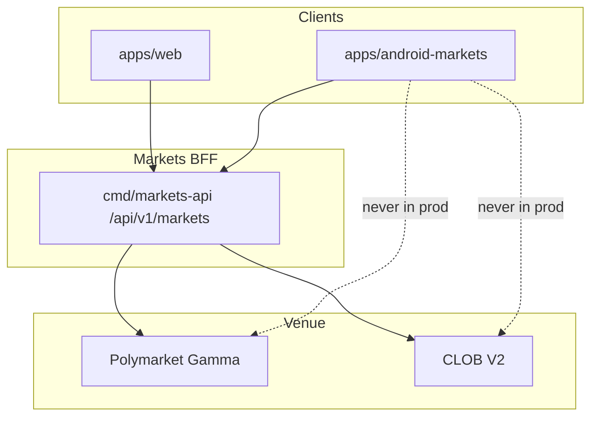

# ACCESSIBILITY PERFORMANCE AND DEVICES

**Status:** reviewed
**Owner:** platform-orchestrator
**Last updated:** 2026-07-25
**Product:** RetroPick Markets V1
**Wave:** 5 — Android Compose Markets

## Description

This document is the accessibility, performance, and device-matrix authority for the RetroPick Markets V1 Android app (Kotlin + Jetpack Compose). It covers WCAG-aligned TalkBack semantics, touch targets, Macrobenchmark budgets, network-condition testing, chart and GPU limits, battery, and large-screen or foldable adaptive behavior.

It sits in Wave 5 beside Compose architecture and navigation. Semantics attach to composables; benchmarks live in a dedicated module. Inclusive parity with web means equivalent critical information—eligibility, fees, max loss, stale data, unknown order—not identical chrome. Visual tokens for web live in DESIGN_SYSTEM_AND_ACCESSIBILITY.

Read this continuously during 5B–5D UI work and mandatorily before Play production, especially when adding charts, book ladders, or heavy lists. Prefer ANDROID_TEST_STRATEGY for how a11y and perf gates run in CI.

It excludes removing risk text to hit FPS budgets, icon-only controls without descriptions, and using a web a11y pass as a substitute for TalkBack on the order ticket and preview dialog.

## 0. Developer intent (5W+1H)

Short orientation for implementers and agents. Read this before the normative sections below.

| Lens | Answer |
|------|--------|
| **Who** | Android UI engineers, a11y testers, performance owners running Macrobenchmark; agents shipping Compose screens to diverse devices. |
| **What** | WCAG-aligned Android a11y, Compose semantics patterns, performance budgets, Macrobenchmark suite, device matrix, network condition testing, GPU/chart budgets, battery, large-screen/foldable, web parity of inclusive behavior. |
| **When** | Continuously during 5B–5D UI work; mandatory before Play production. When adding charts, book ladders, or heavy lists. |
| **Where** | Spec: this file. Semantics on composables; benchmarks in dedicated module. Devices: phone/tablet/fold as matrix. Web a11y twin: [DESIGN_SYSTEM_AND_ACCESSIBILITY.md](../web/DESIGN_SYSTEM_AND_ACCESSIBILITY.md). |
| **Why** | Trading UIs are dense; without semantics, TalkBack users cannot safely confirm size/price. Jank on mid-tier devices destroys trust during signing. Foldables need adaptive nav (see navigation doc). |
| **How** | Content descriptions for YES/NO, prices, stale labels. Touch targets ≥48dp. Prefer lazy lists; virtualize book. Budget startup and frame times via Macrobenchmark. Test TalkBack on order ticket and preview. Respect reduced-motion / animation scales. |

### Worked example

**Happy path — accessible ticket.** TalkBack announces outcome, price in cents, size, max loss, freshness. Focus order matches visual. Preview dialog is modal with announced title; confirm/cancel clearly labeled. Color is not the only stale indicator.

**Happy path — performance.** Discovery scroll stays within jank budget on matrix mid-tier device; chart pauses updates when offscreen; book virtualization keeps 60fps target under normal depth.

**Failure / degraded.** Chart drops frames → simplify path or reduce markers; do not remove max-loss text to “make room.” Semantics missing on icon-only nav → fail a11y test. Huge image headers on mobile web parity excuses → Android still must meet its budgets. ANR from main-thread JSON parse → move to background dispatchers.

### Budgets mindset

Treat budgets in this doc as release-blocking guidance for PHASE-5 exit. If a feature cannot meet them, degrade visually (simpler chart) rather than ship unusable interaction.

### Parity principles (inclusive)

Web and Android may look different; both must expose equivalent critical information: eligibility, fees, max loss, stale data, unknown order state. An accessible web modal and inaccessible Android dialog is a product bug.

### TalkBack critical path

1. Eligibility gate announcement
2. Book row content description (price, size, side)
3. Ticket fields + max loss
4. Preview dialog actions
5. Unknown/reconciling status

### Device matrix intent

| Class | Why |
|-------|-----|
| Mid-tier phone | Perf truth |
| Large phone | Ticket + book layout |
| Foldable / tablet | Adaptive nav |
| Low API in support window | Compat |

### Agent anti-patterns

- Icon-only controls without descriptions
- Unbounded chart recomposition
- Testing a11y only on emulators’ default font scale
- Removing risk text to hit FPS budgets

### Success signal

Macrobenchmark + TalkBack ticket pass are part of definition of done for trading screens, not optional polish.

## 1. Purpose

Specify a11y semantics, performance budgets, device matrix, and Macrobenchmark requirements.

## 2. Scope

### In scope

- RetroPick Markets V1 native Android client (Kotlin, Jetpack Compose, Material 3).
- Consumption of shared Markets BFF at `/api/v1/markets/*` per ADR-004.
- Feature parity targets defined in [.dev/ANDROID_MARKETS.md](../../ANDROID_MARKETS.md).
- Gradle modularization under `apps/android-markets/` (greenfield; `apps/android/` is README-only placeholder).

### Out of scope

- PRISM protocol, `contracts/prism/`, PRISM market creation, or PRISM settlement flows.
- Direct production calls to Polymarket Gamma/CLOB from the Android client (ADR-002).
- Custom RetroPick exchange or outcome-token issuance (ADR-001).
- Background autonomous trading or Android-specific order semantics.

## 3. Prerequisites

- [.dev/ANDROID_MARKETS.md](../../ANDROID_MARKETS.md) — product and architecture baseline.
- [00_DOCUMENT_MAP.md](../00_DOCUMENT_MAP.md)
- [phases/PHASE-5-ANDROID-COMPOSE-MARKETS.md](../phases/PHASE-5-ANDROID-COMPOSE-MARKETS.md)
- [architecture/adr/ADR-004-SHARED-WEB-ANDROID-API.md](../architecture/adr/ADR-004-SHARED-WEB-ANDROID-API.md)
- [architecture/adr/ADR-006-ANDROID-JETPACK-COMPOSE.md](../architecture/adr/ADR-006-ANDROID-JETPACK-COMPOSE.md)
- [schemas/openapi/markets-v1.yaml](../../../schemas/openapi/markets-v1.yaml)
- [apps/android/README.md](../../../apps/android/README.md) — current greenfield status.

## 4. Authoritative sources

| Source | URL / path | Retrieved | Confidence |
|--------|------------|-----------|------------|
| Android Markets product spec | `.dev/ANDROID_MARKETS.md` | 2026-07-25 | verified |
| Polymarket docs | https://docs.polymarket.com/ | 2026-07-25 | partially verified |
| CLOB V2 migration | https://docs.polymarket.com/v2-migration | 2026-07-25 | partially verified |
| Android app architecture | https://developer.android.com/topic/architecture | 2026-07-25 | verified |
| Compose architecture | https://developer.android.com/develop/ui/compose/architecture | 2026-07-25 | verified |
| Modularization guide | https://developer.android.com/topic/modularization | 2026-07-25 | verified |
| OpenAPI (repo) | `schemas/openapi/markets-v1.yaml` | 2026-07-25 | verified |
| Realtime schema | `schemas/events/markets-realtime-v1.json` | 2026-07-25 | verified |
| Play financial features | https://support.google.com/googleplay/android-developer/answer/13849271 | 2026-07-25 | partially verified |

## 5. Current state

`apps/android/` contains a README-only greenfield pointer. No Gradle project, modules, or
generated API client exist on disk. Implementation is scheduled for PHASE-5 per
[implementation-manifest.yaml](../../../.harness/products/markets-v1/planning/implementation-manifest.yaml).

The target module tree is documented in [.dev/ANDROID_MARKETS.md](../../ANDROID_MARKETS.md) §4 and
expanded in [GRADLE_MODULE_GRAPH.md](./GRADLE_MODULE_GRAPH.md). CI will add an Android job once
`apps/android-markets/settings.gradle.kts` lands.

## 6. Target design

### Accessibility requirements (WCAG-aligned)

| Requirement | Implementation |
|-------------|----------------|
| Touch targets | Minimum 48×48 dp; `Modifier.minimumInteractiveComponentSize()` |
| Color contrast | 4.5:1 body text; 3:1 large text (design tokens enforced) |
| TalkBack | `contentDescription` on icons; stateful buttons announce state |
| Focus order | Logical traversal in order ticket (amount → price → preview) |
| Dynamic type | Support system font scaling to 200% without clipping critical risk text |
| Motion | Respect `ANIMATOR_DURATION_SCALE`; reduce chart animations |
| Error identification | Errors linked to fields via `Semantics.error` |

### Compose semantics patterns

```kotlin
Modifier.semantics {
    contentDescription = "Buy Yes at 42 cents"
    stateDescription = "Order preview ready"
}
```

Order book: announce level, price, size; group by side.

### Performance budgets

| Metric | Target (mid-range device) |
|--------|---------------------------|
| Cold start to Discovery | < 2.5s p95 |
| Warm Market detail from cache | < 500ms |
| Feed scroll jank | < 2% slow frames |
| Order ticket preview round-trip | < 2s p95 network excluded |
| APK size (base) | Track; budget TBD at bootstrap |
| Memory peak on market detail | < 200MB |

### Macrobenchmark suite

- `StartupBenchmark` cold/warm.
- `DiscoveryScrollBenchmark` fling.
- `MarketDetailBenchmark` chart + book render.
- Baseline Profile generation in release pipeline.

### Device matrix

| Category | Examples | Priority |
|----------|----------|----------|
| Mid-range phone | Pixel 6a class | P0 |
| Low RAM | 3GB devices | P1 |
| Foldable | Pixel Fold | P1 |
| Tablet | 10" landscape | P2 |
| API levels | minSdk TBD – latest targetSdk | P0 |

### Network conditions

Test on: Wi-Fi, LTE, 3G throttled, offline, high latency (300ms+).

### GPU / chart performance

- Limit candle count on screen; downsample for mobile.
- Use `remember` + derivedStateOf for book aggregation.
- Avoid overdraw on ladder (clip layers).

### Battery

- WS heartbeat interval tuned with server.
- WorkManager batching for non-urgent sync.
- No wake locks except user-visible ongoing operations.

### Large screen / foldable

- `WindowSizeClass` drives navigation (see NAVIGATION doc).
- Dual-pane market list + detail on expanded width.
- Fold state changes preserve ViewModel state.

### Web parity

| Area | Web | Android |
|------|-----|---------|
| Keyboard nav | Full | TalkBack + switch access |
| Font scaling | CSS rem | SP scaling |
| Reduced motion | `prefers-reduced-motion` | System animator scale |
| Performance | Lighthouse | Macrobenchmark + Vitals |

## 7. Alternatives considered

| Alternative | Rejected because |
|-------------|------------------|
| Flutter cross-platform | ADR-006 locks Jetpack Compose for first-party Android quality, Keystore integration, and Play policy alignment |
| React Native WebView shell | Violates native UX, accessibility, and wallet SDK integration requirements |
| Direct Gamma/CLOB from Android | ADR-002: BFF anti-corruption layer owns fee, eligibility, and schema compatibility |
| Monolithic single-module app | Blocks parallel feature development and inflates build/test cycles |
| PRISM combined mobile client | Increases policy, signing, and release risk; PRISM remains web-first |
| Embedded unrestricted WebView dApp | Tapjacking, injection, and wallet confusion risks |
| Raw private-key import | Custody and regulatory risk; wallet remains external authority |

## 8. Decisions

| ID | Decision | Rationale |
|----|----------|-----------|
| D-AND-001 | Markets-only Android scope | See [.dev/ANDROID_MARKETS.md](../../ANDROID_MARKETS.md) §1 |
| D-AND-002 | Shared OpenAPI with web | ADR-004; contract tests block breaking changes |
| D-AND-003 | Jetpack Compose + UDF | ADR-006; immutable UiState, event intents, StateFlow |
| D-AND-004 | BFF-only network boundary | ADR-002; no upstream Polymarket calls in production |
| D-AND-005 | Server-authoritative orders | Preview hash from backend; client verifies before sign |
| D-AND-006 | `apps/android-markets/` module root | Keeps README placeholder stable during greenfield bootstrap |
| D-AND-007 | No PRISM dependencies | Zero imports from `packages/prism` or PRISM schemas |

## 9. Data and control flows



## 10. Failure and recovery

| Scenario | Client behavior | Recovery |
|----------|-----------------|----------|
| Eligibility unknown | Fail closed; block trading surfaces | Retry eligibility; show support link |
| BFF 5xx on catalog | Show cached snapshot with stale label | Exponential backoff refresh |
| BFF 5xx on order preview | Block sign; no offline preview | User retries; incident banner if widespread |
| Submit timeout | State `ReconcilingUnknown`; no auto-resubmit | Poll by preview hash / order ID |
| WebSocket gap | Detect sequence gap; snapshot refresh | Atomic Room replace per ADR-005 |
| Wallet reject/timeout | Return to ReadyToSign with reason | User may change wallet or retry |
| Rooted device | Risk signal + warning; no false guarantees | User acknowledgment where required |
| Play policy block | Hide order entry per region flag | Server capability + eligibility gate |

## 11. Security

- No raw private-key custody, generation, import, or backup by RetroPick.
- Preview-before-sign: client verifies EIP-712 fields match human-readable preview.
- Android Keystore for app session secrets and encrypted DataStore master keys.
- Biometrics gate app session actions; wallet remains transaction authority.
- Network Security Configuration: TLS only, no cleartext, certificate policy reviewed.
- Sensitive screens: overlay protection, selective FLAG_SECURE, no seed clipboard.
- Deep links allowlisted; never auto-sign from link payload.
- Analytics allowlist with field redaction; no signatures in crash reports.
- See [WALLET_SIGNING_AND_SECURITY.md](./WALLET_SIGNING_AND_SECURITY.md) and [security/THREAT_MODEL.md](../security/THREAT_MODEL.md).

## 12. Observability

| Signal | Instrumentation | Alert threshold (initial) |
|--------|-----------------|---------------------------|
| Crash-free users | Firebase Crashlytics / Play Vitals | < 99.8% rolling 7d |
| ANR rate | Play Vitals + custom traces | Above Play bad-behavior internal guard |
| Cold start | Macrobenchmark + Play Vitals | Regression > 10% vs baseline |
| Order preview latency | OpenTelemetry Android + BFF trace | p95 > 2s healthy network |
| Sign-to-accepted | Custom funnel event | Drop > 15% vs prior release |
| Realtime gap recovery | `markets_android_ws_gap_total` | Sustained gap rate spike |
| Cache staleness age | Room metadata histogram | p95 staleness > 5m on catalog |

Tracing: W3C `traceparent` propagated on REST; correlate with BFF `request_id`.

## 13. Test strategy

See [ANDROID_TEST_STRATEGY.md](./ANDROID_TEST_STRATEGY.md). Minimum bar per release:

- Unit: money math, mappers, reducers, eligibility UI policy.
- Repository fakes: API errors, WS gaps, Room migrations.
- Contract: golden fixtures shared with Go and TypeScript.
- Compose: screenshot + accessibility checks on order ticket and market detail.
- Staging E2E: preview → sign → submit → reconcile happy path.
- Macrobenchmark: cold start, feed scroll, market detail from cache.

## 14. Rollout and rollback

| Track | Audience | Gate |
|-------|----------|------|
| `devDebug` | Engineers | Local/dev BFF; fixture wallets |
| `stagingRelease` | Internal QA | Staging BFF; full E2E matrix |
| `internal` Play | Closed testers | Crash/ANR budget; security review |
| `production` staged | % rollout | Order-error rate, support tickets, Play Vitals |

Kill switches: `/markets/capabilities` disables order submission per region/version.
Rollback: halt rollout, ship hotfix, or remote-disable trading without catalog regression.

## 15. Web vs Android parity

Parity is defined relative to Markets web (`apps/web`). Android may defer non-critical
surfaces but must not invent divergent trading semantics.

| Capability | Web (V1) | Android (V1) | Parity notes |
|------------|----------|--------------|--------------|
| Eligibility gate | Yes | Yes | Same `/markets/eligibility` contract |
| Capabilities flags | Yes | Yes | Order kill switch respected on both |
| Event discovery | Yes | Yes | Android adds offline cache labels |
| Market detail + rules | Yes | Yes | Adaptive layouts on tablet/foldable |
| Order book + history | Yes | Yes | Realtime via shared WS schema |
| Limit / marketable-limit orders | Yes | Yes | Identical preview hash flow |
| Wallet connect + sign | Yes | Yes | Mobile uses wallet SDK / WC deep links |
| Open orders + history | Yes | Yes | Android stale guards on order actions |
| Positions + PnL | Yes | Yes | Pull-to-refresh + WS deltas |
| Watchlist | Yes | Yes | Sync via authenticated API |
| Price alerts | Yes | Yes | Push on Android vs web inbox |
| Deep links | HTTPS app links | `retropick://` + HTTPS | See NAVIGATION doc |
| CTF split/merge/redeem | Web V1.1+ | Android V1.1+ | Deferred together |
| Intelligence signals | Web Phase 3 | Read-only V1 optional | May ship post-core trading |
| PRISM | No | No | Explicit non-goal |
| Perf tooling | Lighthouse | Macrobenchmark + Vitals | Platform-specific |

### Parity principles

- Server authority — eligibility, fees, capabilities, and order payloads originate from BFF.
- Contract symmetry — OpenAPI and realtime schemas are version-locked across clients.
- UX adaptation — mobile optimizes for short sessions, push, and biometric session gates.
- Explicit deferrals — V1.1+ items documented; no silent web-only trading features.
- No PRISM — neither client exposes PRISM in this generation.

## 16. Open questions

| ID | Question | Expiry | Owner |
|----|----------|--------|-------|
| OQ-AND-01 | Minimum `minSdk` and target device profile | Before Gradle bootstrap | mobile-lead |
| OQ-AND-02 | Wallet vendors for V1 (WalletConnect, Coinbase, etc.) | Before wallet module | mobile-lead |
| OQ-AND-03 | Room encryption requirement given data inventory | Before database schema freeze | security |
| OQ-AND-04 | Supported Play countries and age rating | Before closed track | legal |
| OQ-AND-05 | FCM vs hybrid push for alert delivery | Before notifications module | platform |
| OQ-AND-06 | CTF split/merge in V1 vs V1.1 | Before redemption feature | product |

Full list: [research/OPEN_QUESTIONS_AND_EXPIRING_ASSUMPTIONS.md](../research/OPEN_QUESTIONS_AND_EXPIRING_ASSUMPTIONS.md).

## 17. Acceptance criteria

- Touch targets ≥ 48dp enforced in designsystem.
- Performance budgets defined.
- Device matrix P0/P1 identified.
- TalkBack patterns documented.

## 18. Related documents

- [.dev/ANDROID_MARKETS.md](../../ANDROID_MARKETS.md)
- [COMPOSE_APP_ARCHITECTURE.md](./COMPOSE_APP_ARCHITECTURE.md)
- [GRADLE_MODULE_GRAPH.md](./GRADLE_MODULE_GRAPH.md)
- [NAVIGATION_AND_DEEP_LINKS.md](./NAVIGATION_AND_DEEP_LINKS.md)
- [STATE_DATA_OFFLINE_AND_REALTIME.md](./STATE_DATA_OFFLINE_AND_REALTIME.md)
- [WALLET_SIGNING_AND_SECURITY.md](./WALLET_SIGNING_AND_SECURITY.md)
- [NOTIFICATIONS_AND_BACKGROUND_WORK.md](./NOTIFICATIONS_AND_BACKGROUND_WORK.md)
- [ACCESSIBILITY_PERFORMANCE_AND_DEVICES.md](./ACCESSIBILITY_PERFORMANCE_AND_DEVICES.md)
- [PLAY_STORE_COMPLIANCE_AND_RELEASE.md](./PLAY_STORE_COMPLIANCE_AND_RELEASE.md)
- [ANDROID_TEST_STRATEGY.md](./ANDROID_TEST_STRATEGY.md)
- [phases/PHASE-5-ANDROID-COMPOSE-MARKETS.md](../phases/PHASE-5-ANDROID-COMPOSE-MARKETS.md)

---

## Appendix A — Implementation deep dives

### A.1 a11y-perf — Overview

**Overview** for `a11y-perf`.

- Align with [.dev/ANDROID_MARKETS.md](../../ANDROID_MARKETS.md) and PHASE-5 exit gates.
- Never call Polymarket upstream directly from production code paths.
- Log structured diagnostics without wallet secrets or full signed payloads.
- Compose UI exposes loading, empty, error, stale, ineligible, and success states.
- ViewModels expose StateFlow<UiState>; effects use SharedFlow or Channel.
- Repository maps DTO to domain; features never import Retrofit or Room.
- Contract tests pass golden fixtures before merge.
- Touch targets ≥ 48dp; TalkBack labels on all actionable controls.
- Main thread must not perform network or disk I/O.
- Feature flags read from /markets/capabilities on cold start and resume.
- Deep dive 1 for a11y-perf: Overview implementation checklist item 1.
- Deep dive 1 for a11y-perf: Overview implementation checklist item 2.
- Deep dive 1 for a11y-perf: Overview implementation checklist item 3.
- Deep dive 1 for a11y-perf: Overview implementation checklist item 4.
- Deep dive 1 for a11y-perf: Overview implementation checklist item 5.

### A.2 a11y-perf — Module ownership

**Module ownership** for `a11y-perf`.

- Align with [.dev/ANDROID_MARKETS.md](../../ANDROID_MARKETS.md) and PHASE-5 exit gates.
- Never call Polymarket upstream directly from production code paths.
- Log structured diagnostics without wallet secrets or full signed payloads.
- Compose UI exposes loading, empty, error, stale, ineligible, and success states.
- ViewModels expose StateFlow<UiState>; effects use SharedFlow or Channel.
- Repository maps DTO to domain; features never import Retrofit or Room.
- Contract tests pass golden fixtures before merge.
- Touch targets ≥ 48dp; TalkBack labels on all actionable controls.
- Main thread must not perform network or disk I/O.
- Feature flags read from /markets/capabilities on cold start and resume.
- Deep dive 2 for a11y-perf: Module ownership implementation checklist item 1.
- Deep dive 2 for a11y-perf: Module ownership implementation checklist item 2.
- Deep dive 2 for a11y-perf: Module ownership implementation checklist item 3.
- Deep dive 2 for a11y-perf: Module ownership implementation checklist item 4.
- Deep dive 2 for a11y-perf: Module ownership implementation checklist item 5.

### A.3 a11y-perf — API mapping

**API mapping** for `a11y-perf`.

- Align with [.dev/ANDROID_MARKETS.md](../../ANDROID_MARKETS.md) and PHASE-5 exit gates.
- Never call Polymarket upstream directly from production code paths.
- Log structured diagnostics without wallet secrets or full signed payloads.
- Compose UI exposes loading, empty, error, stale, ineligible, and success states.
- ViewModels expose StateFlow<UiState>; effects use SharedFlow or Channel.
- Repository maps DTO to domain; features never import Retrofit or Room.
- Contract tests pass golden fixtures before merge.
- Touch targets ≥ 48dp; TalkBack labels on all actionable controls.
- Main thread must not perform network or disk I/O.
- Feature flags read from /markets/capabilities on cold start and resume.
- Deep dive 3 for a11y-perf: API mapping implementation checklist item 1.
- Deep dive 3 for a11y-perf: API mapping implementation checklist item 2.
- Deep dive 3 for a11y-perf: API mapping implementation checklist item 3.
- Deep dive 3 for a11y-perf: API mapping implementation checklist item 4.
- Deep dive 3 for a11y-perf: API mapping implementation checklist item 5.

### A.4 a11y-perf — State machine

**State machine** for `a11y-perf`.

- Align with [.dev/ANDROID_MARKETS.md](../../ANDROID_MARKETS.md) and PHASE-5 exit gates.
- Never call Polymarket upstream directly from production code paths.
- Log structured diagnostics without wallet secrets or full signed payloads.
- Compose UI exposes loading, empty, error, stale, ineligible, and success states.
- ViewModels expose StateFlow<UiState>; effects use SharedFlow or Channel.
- Repository maps DTO to domain; features never import Retrofit or Room.
- Contract tests pass golden fixtures before merge.
- Touch targets ≥ 48dp; TalkBack labels on all actionable controls.
- Main thread must not perform network or disk I/O.
- Feature flags read from /markets/capabilities on cold start and resume.
- Deep dive 4 for a11y-perf: State machine implementation checklist item 1.
- Deep dive 4 for a11y-perf: State machine implementation checklist item 2.
- Deep dive 4 for a11y-perf: State machine implementation checklist item 3.
- Deep dive 4 for a11y-perf: State machine implementation checklist item 4.
- Deep dive 4 for a11y-perf: State machine implementation checklist item 5.

### A.5 a11y-perf — Caching

**Caching** for `a11y-perf`.

- Align with [.dev/ANDROID_MARKETS.md](../../ANDROID_MARKETS.md) and PHASE-5 exit gates.
- Never call Polymarket upstream directly from production code paths.
- Log structured diagnostics without wallet secrets or full signed payloads.
- Compose UI exposes loading, empty, error, stale, ineligible, and success states.
- ViewModels expose StateFlow<UiState>; effects use SharedFlow or Channel.
- Repository maps DTO to domain; features never import Retrofit or Room.
- Contract tests pass golden fixtures before merge.
- Touch targets ≥ 48dp; TalkBack labels on all actionable controls.
- Main thread must not perform network or disk I/O.
- Feature flags read from /markets/capabilities on cold start and resume.
- Deep dive 5 for a11y-perf: Caching implementation checklist item 1.
- Deep dive 5 for a11y-perf: Caching implementation checklist item 2.
- Deep dive 5 for a11y-perf: Caching implementation checklist item 3.
- Deep dive 5 for a11y-perf: Caching implementation checklist item 4.
- Deep dive 5 for a11y-perf: Caching implementation checklist item 5.

### A.6 a11y-perf — Error UX

**Error UX** for `a11y-perf`.

- Align with [.dev/ANDROID_MARKETS.md](../../ANDROID_MARKETS.md) and PHASE-5 exit gates.
- Never call Polymarket upstream directly from production code paths.
- Log structured diagnostics without wallet secrets or full signed payloads.
- Compose UI exposes loading, empty, error, stale, ineligible, and success states.
- ViewModels expose StateFlow<UiState>; effects use SharedFlow or Channel.
- Repository maps DTO to domain; features never import Retrofit or Room.
- Contract tests pass golden fixtures before merge.
- Touch targets ≥ 48dp; TalkBack labels on all actionable controls.
- Main thread must not perform network or disk I/O.
- Feature flags read from /markets/capabilities on cold start and resume.
- Deep dive 6 for a11y-perf: Error UX implementation checklist item 1.
- Deep dive 6 for a11y-perf: Error UX implementation checklist item 2.
- Deep dive 6 for a11y-perf: Error UX implementation checklist item 3.
- Deep dive 6 for a11y-perf: Error UX implementation checklist item 4.
- Deep dive 6 for a11y-perf: Error UX implementation checklist item 5.

### A.7 a11y-perf — Testing hooks

**Testing hooks** for `a11y-perf`.

- Align with [.dev/ANDROID_MARKETS.md](../../ANDROID_MARKETS.md) and PHASE-5 exit gates.
- Never call Polymarket upstream directly from production code paths.
- Log structured diagnostics without wallet secrets or full signed payloads.
- Compose UI exposes loading, empty, error, stale, ineligible, and success states.
- ViewModels expose StateFlow<UiState>; effects use SharedFlow or Channel.
- Repository maps DTO to domain; features never import Retrofit or Room.
- Contract tests pass golden fixtures before merge.
- Touch targets ≥ 48dp; TalkBack labels on all actionable controls.
- Main thread must not perform network or disk I/O.
- Feature flags read from /markets/capabilities on cold start and resume.
- Deep dive 7 for a11y-perf: Testing hooks implementation checklist item 1.
- Deep dive 7 for a11y-perf: Testing hooks implementation checklist item 2.
- Deep dive 7 for a11y-perf: Testing hooks implementation checklist item 3.
- Deep dive 7 for a11y-perf: Testing hooks implementation checklist item 4.
- Deep dive 7 for a11y-perf: Testing hooks implementation checklist item 5.

### A.8 a11y-perf — Rollout flags

**Rollout flags** for `a11y-perf`.

- Align with [.dev/ANDROID_MARKETS.md](../../ANDROID_MARKETS.md) and PHASE-5 exit gates.
- Never call Polymarket upstream directly from production code paths.
- Log structured diagnostics without wallet secrets or full signed payloads.
- Compose UI exposes loading, empty, error, stale, ineligible, and success states.
- ViewModels expose StateFlow<UiState>; effects use SharedFlow or Channel.
- Repository maps DTO to domain; features never import Retrofit or Room.
- Contract tests pass golden fixtures before merge.
- Touch targets ≥ 48dp; TalkBack labels on all actionable controls.
- Main thread must not perform network or disk I/O.
- Feature flags read from /markets/capabilities on cold start and resume.
- Deep dive 8 for a11y-perf: Rollout flags implementation checklist item 1.
- Deep dive 8 for a11y-perf: Rollout flags implementation checklist item 2.
- Deep dive 8 for a11y-perf: Rollout flags implementation checklist item 3.
- Deep dive 8 for a11y-perf: Rollout flags implementation checklist item 4.
- Deep dive 8 for a11y-perf: Rollout flags implementation checklist item 5.

### A.9 a11y-perf — Performance budget

**Performance budget** for `a11y-perf`.

- Align with [.dev/ANDROID_MARKETS.md](../../ANDROID_MARKETS.md) and PHASE-5 exit gates.
- Never call Polymarket upstream directly from production code paths.
- Log structured diagnostics without wallet secrets or full signed payloads.
- Compose UI exposes loading, empty, error, stale, ineligible, and success states.
- ViewModels expose StateFlow<UiState>; effects use SharedFlow or Channel.
- Repository maps DTO to domain; features never import Retrofit or Room.
- Contract tests pass golden fixtures before merge.
- Touch targets ≥ 48dp; TalkBack labels on all actionable controls.
- Main thread must not perform network or disk I/O.
- Feature flags read from /markets/capabilities on cold start and resume.
- Deep dive 9 for a11y-perf: Performance budget implementation checklist item 1.
- Deep dive 9 for a11y-perf: Performance budget implementation checklist item 2.
- Deep dive 9 for a11y-perf: Performance budget implementation checklist item 3.
- Deep dive 9 for a11y-perf: Performance budget implementation checklist item 4.
- Deep dive 9 for a11y-perf: Performance budget implementation checklist item 5.

### A.10 a11y-perf — Accessibility

**Accessibility** for `a11y-perf`.

- Align with [.dev/ANDROID_MARKETS.md](../../ANDROID_MARKETS.md) and PHASE-5 exit gates.
- Never call Polymarket upstream directly from production code paths.
- Log structured diagnostics without wallet secrets or full signed payloads.
- Compose UI exposes loading, empty, error, stale, ineligible, and success states.
- ViewModels expose StateFlow<UiState>; effects use SharedFlow or Channel.
- Repository maps DTO to domain; features never import Retrofit or Room.
- Contract tests pass golden fixtures before merge.
- Touch targets ≥ 48dp; TalkBack labels on all actionable controls.
- Main thread must not perform network or disk I/O.
- Feature flags read from /markets/capabilities on cold start and resume.
- Deep dive 10 for a11y-perf: Accessibility implementation checklist item 1.
- Deep dive 10 for a11y-perf: Accessibility implementation checklist item 2.
- Deep dive 10 for a11y-perf: Accessibility implementation checklist item 3.
- Deep dive 10 for a11y-perf: Accessibility implementation checklist item 4.
- Deep dive 10 for a11y-perf: Accessibility implementation checklist item 5.

### A.11 a11y-perf — Security controls

**Security controls** for `a11y-perf`.

- Align with [.dev/ANDROID_MARKETS.md](../../ANDROID_MARKETS.md) and PHASE-5 exit gates.
- Never call Polymarket upstream directly from production code paths.
- Log structured diagnostics without wallet secrets or full signed payloads.
- Compose UI exposes loading, empty, error, stale, ineligible, and success states.
- ViewModels expose StateFlow<UiState>; effects use SharedFlow or Channel.
- Repository maps DTO to domain; features never import Retrofit or Room.
- Contract tests pass golden fixtures before merge.
- Touch targets ≥ 48dp; TalkBack labels on all actionable controls.
- Main thread must not perform network or disk I/O.
- Feature flags read from /markets/capabilities on cold start and resume.
- Deep dive 11 for a11y-perf: Security controls implementation checklist item 1.
- Deep dive 11 for a11y-perf: Security controls implementation checklist item 2.
- Deep dive 11 for a11y-perf: Security controls implementation checklist item 3.
- Deep dive 11 for a11y-perf: Security controls implementation checklist item 4.
- Deep dive 11 for a11y-perf: Security controls implementation checklist item 5.

### A.12 a11y-perf — Observability

**Observability** for `a11y-perf`.

- Align with [.dev/ANDROID_MARKETS.md](../../ANDROID_MARKETS.md) and PHASE-5 exit gates.
- Never call Polymarket upstream directly from production code paths.
- Log structured diagnostics without wallet secrets or full signed payloads.
- Compose UI exposes loading, empty, error, stale, ineligible, and success states.
- ViewModels expose StateFlow<UiState>; effects use SharedFlow or Channel.
- Repository maps DTO to domain; features never import Retrofit or Room.
- Contract tests pass golden fixtures before merge.
- Touch targets ≥ 48dp; TalkBack labels on all actionable controls.
- Main thread must not perform network or disk I/O.
- Feature flags read from /markets/capabilities on cold start and resume.
- Deep dive 12 for a11y-perf: Observability implementation checklist item 1.
- Deep dive 12 for a11y-perf: Observability implementation checklist item 2.
- Deep dive 12 for a11y-perf: Observability implementation checklist item 3.
- Deep dive 12 for a11y-perf: Observability implementation checklist item 4.
- Deep dive 12 for a11y-perf: Observability implementation checklist item 5.

### A.13 a11y-perf — Migration notes

**Migration notes** for `a11y-perf`.

- Align with [.dev/ANDROID_MARKETS.md](../../ANDROID_MARKETS.md) and PHASE-5 exit gates.
- Never call Polymarket upstream directly from production code paths.
- Log structured diagnostics without wallet secrets or full signed payloads.
- Compose UI exposes loading, empty, error, stale, ineligible, and success states.
- ViewModels expose StateFlow<UiState>; effects use SharedFlow or Channel.
- Repository maps DTO to domain; features never import Retrofit or Room.
- Contract tests pass golden fixtures before merge.
- Touch targets ≥ 48dp; TalkBack labels on all actionable controls.
- Main thread must not perform network or disk I/O.
- Feature flags read from /markets/capabilities on cold start and resume.
- Deep dive 13 for a11y-perf: Migration notes implementation checklist item 1.
- Deep dive 13 for a11y-perf: Migration notes implementation checklist item 2.
- Deep dive 13 for a11y-perf: Migration notes implementation checklist item 3.
- Deep dive 13 for a11y-perf: Migration notes implementation checklist item 4.
- Deep dive 13 for a11y-perf: Migration notes implementation checklist item 5.

### A.14 a11y-perf — FAQ

**FAQ** for `a11y-perf`.

- Align with [.dev/ANDROID_MARKETS.md](../../ANDROID_MARKETS.md) and PHASE-5 exit gates.
- Never call Polymarket upstream directly from production code paths.
- Log structured diagnostics without wallet secrets or full signed payloads.
- Compose UI exposes loading, empty, error, stale, ineligible, and success states.
- ViewModels expose StateFlow<UiState>; effects use SharedFlow or Channel.
- Repository maps DTO to domain; features never import Retrofit or Room.
- Contract tests pass golden fixtures before merge.
- Touch targets ≥ 48dp; TalkBack labels on all actionable controls.
- Main thread must not perform network or disk I/O.
- Feature flags read from /markets/capabilities on cold start and resume.
- Deep dive 14 for a11y-perf: FAQ implementation checklist item 1.
- Deep dive 14 for a11y-perf: FAQ implementation checklist item 2.
- Deep dive 14 for a11y-perf: FAQ implementation checklist item 3.
- Deep dive 14 for a11y-perf: FAQ implementation checklist item 4.
- Deep dive 14 for a11y-perf: FAQ implementation checklist item 5.

### A.15 a11y-perf — Overview

**Overview** for `a11y-perf`.

- Align with [.dev/ANDROID_MARKETS.md](../../ANDROID_MARKETS.md) and PHASE-5 exit gates.
- Never call Polymarket upstream directly from production code paths.
- Log structured diagnostics without wallet secrets or full signed payloads.
- Compose UI exposes loading, empty, error, stale, ineligible, and success states.
- ViewModels expose StateFlow<UiState>; effects use SharedFlow or Channel.
- Repository maps DTO to domain; features never import Retrofit or Room.
- Contract tests pass golden fixtures before merge.
- Touch targets ≥ 48dp; TalkBack labels on all actionable controls.
- Main thread must not perform network or disk I/O.
- Feature flags read from /markets/capabilities on cold start and resume.
- Deep dive 15 for a11y-perf: Overview implementation checklist item 1.
- Deep dive 15 for a11y-perf: Overview implementation checklist item 2.
- Deep dive 15 for a11y-perf: Overview implementation checklist item 3.
- Deep dive 15 for a11y-perf: Overview implementation checklist item 4.
- Deep dive 15 for a11y-perf: Overview implementation checklist item 5.

### A.16 a11y-perf — Module ownership

**Module ownership** for `a11y-perf`.

- Align with [.dev/ANDROID_MARKETS.md](../../ANDROID_MARKETS.md) and PHASE-5 exit gates.
- Never call Polymarket upstream directly from production code paths.
- Log structured diagnostics without wallet secrets or full signed payloads.
- Compose UI exposes loading, empty, error, stale, ineligible, and success states.
- ViewModels expose StateFlow<UiState>; effects use SharedFlow or Channel.
- Repository maps DTO to domain; features never import Retrofit or Room.
- Contract tests pass golden fixtures before merge.
- Touch targets ≥ 48dp; TalkBack labels on all actionable controls.
- Main thread must not perform network or disk I/O.
- Feature flags read from /markets/capabilities on cold start and resume.
- Deep dive 16 for a11y-perf: Module ownership implementation checklist item 1.
- Deep dive 16 for a11y-perf: Module ownership implementation checklist item 2.
- Deep dive 16 for a11y-perf: Module ownership implementation checklist item 3.
- Deep dive 16 for a11y-perf: Module ownership implementation checklist item 4.
- Deep dive 16 for a11y-perf: Module ownership implementation checklist item 5.
