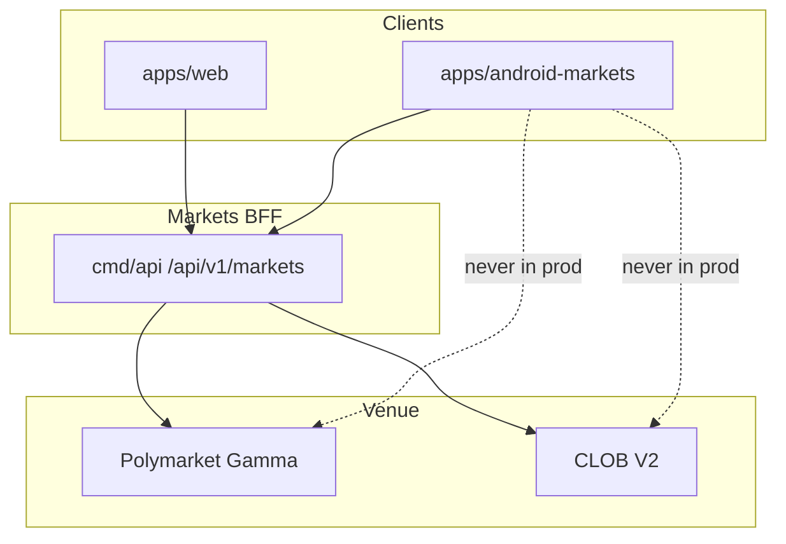

# ANDROID PRODUCT SCOPE

**Status:** reviewed
**Owner:** platform-orchestrator
**Last updated:** 2026-07-25
**Product:** RetroPick Markets V1
**Wave:** 5 — Android Compose Markets

## Description

This document defines Markets-only product scope for the RetroPick Markets V1 Android app (Kotlin + Jetpack Compose + Material 3): jobs-to-be-done, V1 feature inventory versus V1.1+, explicit non-goals, personas, success metrics, release phases 5A–5D, and backend phase dependencies.

It sits at the front of Wave 5. Code home is greenfield `apps/android-markets/` (not the placeholder `apps/android/`). API is the shared BFF `/api/v1/markets/*` (ADR-004). Baseline companion: `.dev/ANDROID_MARKETS.md`. Implementation detail lives in COMPOSE_APP_ARCHITECTURE, STATE_DATA_*, WALLET_*, NAVIGATION_*, and related specs.

Read this before greenfield module work or feature proposals, and when `/markets/capabilities` gains flags. Use it to say no quickly rather than expanding V1 silently.

It excludes PRISM, legacy epoch APIs, direct Polymarket production calls from the device, raw key import, embedded unrestricted WebView trading, autonomous background trading, and Android-only order semantics.

## 0. Developer intent (5W+1H)

Short orientation for implementers and agents. Read this before the normative sections below.

| Lens | Answer |
|------|--------|
| **Who** | Android product/engineering owners and harness agents (`fe-markets` mobile track) scoping PHASE-5; Play/compliance partners; anyone tempted to add PRISM or venue-bypass into the app. |
| **What** | Markets-only Android product scope: jobs-to-be-done, V1 feature inventory vs V1.1+, explicit non-goals, success metrics, personas, release phases 5A–5D, and backend phase dependencies. Baseline companion: [.dev/ANDROID_MARKETS.md](../../ANDROID_MARKETS.md). |
| **When** | Before greenfield module work or feature proposals. Re-check when `/markets/capabilities` gains flags (e.g. combos) or when web ships CTF ops that Android might lag. |
| **Where** | Spec: this file. Code home: `apps/android-markets/` (greenfield; `apps/android/` is README placeholder). API: shared BFF `/api/v1/markets/*` (ADR-004). Out: `contracts/prism/`, legacy epoch APIs, direct Polymarket production calls from the device. |
| **Why** | Mobile scope creep (background trading, raw keys, WebView dApps) creates security and policy failures. Android is a distribution channel for Markets—not a second exchange. Clear non-goals keep agents from “helpfully” building the wrong product. |
| **How** | Ship 5A shell → 5B read (discovery, detail, cache, links) → 5C trading (wallet, orders, portfolio) → 5D notifications/Play packaging. Gate trading on backend PHASE-3 contract tests in staging. Prefer Compose feature modules per GRADLE_MODULE_GRAPH. Measure funnel and crash-free users—not notification spam. |

### Worked example

**Happy path — scoped V1 trader journey.** Eligible user discovers markets, opens detail, connects external wallet, previews max loss, signs order, watches fills, checks portfolio PnL, optionally redeems when claimable. Push alert deep-links to ticket in ≤3 taps. All HTTP via BFF; OpenAPI types generated into Android modules.

**Happy path — phase discipline.** 5B ships read-only offline cache with stale labels while 5C wallet work continues. Capabilities hide order submit until backend ready—no fake local matching.

**Failure / degraded.** Proposal for PRISM creation in-app → reject (non-goal). Direct CLOB SDK in the APK → reject (ADR-002). Autonomous background trading worker → reject. Play financial declaration incomplete → block production track (see Play compliance doc). Scope argument “web has it” for CTF ops → V1.1+ unless explicitly tasked.

### Scope checklist for agents

- [ ] Feature appears in V1 inventory or is explicitly tasked.
- [ ] Uses shared BFF operations only.
- [ ] Kotlin + Jetpack Compose + Material 3.
- [ ] No gambling-sportsbook copy in product strings.
- [ ] Web parity of **semantics** (states, money, eligibility), not necessarily identical navigation chrome.
- [ ] Metrics/instrumentation planned without PII abuse.

### Reading tip

Use this doc to say **no** quickly. Implementation detail lives in COMPOSE_APP_ARCHITECTURE, STATE_DATA_*, WALLET_*, NAVIGATION_*, etc. If a task is outside this inventory, stop and escalate rather than expanding V1 silently.

### Backend coupling

| Android phase | Needs backend |
|---------------|---------------|
| 5A shell | PHASE-1 OpenAPI stable enough to generate |
| 5B read | Catalog/market/book projections |
| 5C trading | PHASE-3 orders + wallet session |
| 5D alerts/Play | Alerts + push registration APIs |

### Explicit non-goals (repeat for agents)

- PRISM, legacy epoch, custom exchange
- Raw key import / embedded unrestricted WebView trading
- Android-only order semantics
- Autonomous background trading

### Agent anti-patterns

- Starting CTF UI before V1.1 tasking.
- Adding Combos because web mocks it—wait on capabilities.
- Scope docs edited to fit an unapproved feature.

### Success signal

Stakeholders can point to the V1 inventory row for every merged Android feature.

## 1. Purpose

Define Markets-only Android product scope, metrics, and non-goals. See [.dev/ANDROID_MARKETS.md](../../ANDROID_MARKETS.md).

## 2. Scope

### In scope

- RetroPick Markets V1 native Android client (Kotlin, Jetpack Compose, Material 3).
- Consumption of shared Markets BFF at `/api/v1/markets/*` per ADR-004.
- Feature parity targets defined in [.dev/ANDROID_MARKETS.md](../../ANDROID_MARKETS.md).
- Gradle modularization under `apps/android-markets/` (greenfield; `apps/android/` is README-only placeholder).

### Out of scope

- PRISM protocol, `contracts/prism/`, PRISM market creation, or PRISM settlement flows.
- Direct production calls to Polymarket Gamma/CLOB from the Android client (ADR-002).
- Legacy epoch MarketEngine APIs at `/api/v1/legacy/markets/*`.
- Custom RetroPick exchange or outcome-token issuance (ADR-001).
- Background autonomous trading or Android-specific order semantics.

## 3. Prerequisites

- [.dev/ANDROID_MARKETS.md](../../ANDROID_MARKETS.md) — product and architecture baseline.
- [00_DOCUMENT_MAP.md](../00_DOCUMENT_MAP.md)
- [phases/PHASE-5-ANDROID-COMPOSE-MARKETS.md](../phases/PHASE-5-ANDROID-COMPOSE-MARKETS.md)
- [architecture/adr/ADR-004-SHARED-WEB-ANDROID-API.md](../architecture/adr/ADR-004-SHARED-WEB-ANDROID-API.md)
- [architecture/adr/ADR-006-ANDROID-JETPACK-COMPOSE.md](../architecture/adr/ADR-006-ANDROID-JETPACK-COMPOSE.md)
- [schemas/openapi/markets-v1.yaml](../../../schemas/openapi/markets-v1.yaml)
- [apps/android/README.md](../../../apps/android/README.md) — current greenfield status.

## 4. Authoritative sources

| Source | URL / path | Retrieved | Confidence |
|--------|------------|-----------|------------|
| Android Markets product spec | `.dev/ANDROID_MARKETS.md` | 2026-07-25 | verified |
| Polymarket docs | https://docs.polymarket.com/ | 2026-07-25 | partially verified |
| CLOB V2 migration | https://docs.polymarket.com/v2-migration | 2026-07-25 | partially verified |
| Android app architecture | https://developer.android.com/topic/architecture | 2026-07-25 | verified |
| Compose architecture | https://developer.android.com/develop/ui/compose/architecture | 2026-07-25 | verified |
| Modularization guide | https://developer.android.com/topic/modularization | 2026-07-25 | verified |
| OpenAPI (repo) | `schemas/openapi/markets-v1.yaml` | 2026-07-25 | verified |
| Realtime schema | `schemas/events/markets-realtime-v1.json` | 2026-07-25 | verified |
| Play financial features | https://support.google.com/googleplay/android-developer/answer/13849271 | 2026-07-25 | partially verified |

## 5. Current state

`apps/android/` contains a README-only greenfield pointer. No Gradle project, modules, or
generated API client exist on disk. Implementation is scheduled for PHASE-5 per
[implementation-manifest.yaml](../../../.harness/products/markets-v1/planning/implementation-manifest.yaml).

The target module tree is documented in [.dev/ANDROID_MARKETS.md](../../ANDROID_MARKETS.md) §4 and
expanded in [GRADLE_MODULE_GRAPH.md](./GRADLE_MODULE_GRAPH.md). CI will add an Android job once
`apps/android-markets/settings.gradle.kts` lands.

## 6. Target design

### Product positioning

RetroPick Android is the **native mobile distribution channel** for RetroPick Markets. It inherits
revenue attribution from Markets builder fees and future subscriptions; it is not an independent
economic product. See [.dev/ANDROID_MARKETS.md](../../ANDROID_MARKETS.md) §2.

### Jobs to be done (mobile)

| Job | User story | Success signal |
|-----|------------|----------------|
| Discover | As a trader, I find relevant markets in under 60 seconds | Feed engagement, search success rate |
| Act on alerts | As a funded user, I open a push and reach order ticket in ≤3 taps | Alert-to-order conversion |
| Trade safely | As a user, I preview max loss before wallet sign | Preview-to-sign rate |
| Track portfolio | As a user, I see fills and claimable winnings | D7 retention among traders |
| Read rules | As a user, I understand resolution source on mobile | Support ticket reduction |

### V1 feature inventory

| Feature area | Included | Phase | Notes |
|--------------|----------|-------|-------|
| Eligibility + terms | Yes | 5A | Blocks all trading until accepted |
| Discovery feed | Yes | 5B | Paging, categories, trending |
| Search + filters | Yes | 5B | Server-side search |
| Market detail | Yes | 5B | Rules, chart, order book |
| Watchlist | Yes | 5B | Authenticated sync |
| Order ticket | Yes | 5C | Limit + marketable-limit |
| Wallet connect | Yes | 5C | External wallet authority |
| Orders + fills | Yes | 5C | Reconciliation states |
| Portfolio + PnL | Yes | 5C | Positions projection |
| Notifications | Yes | 5D | FCM + preferences |
| Deep links | Yes | 5B | Event, market, order, position |
| Offline cache | Yes | 5B | Read-only stale labels |
| Redemption status | Yes | 5D | Claimable indicator |
| CTF operations | No (V1.1+) | — | After web stabilization |
| PRISM | No | — | Non-goal |

### V1.1+ backlog

- CTF split/merge/redeem and Negative Risk conversion when backend advertises capability.
- Biometric re-auth for sensitive session actions (app layer, not wallet replacement).
- Glance widgets / watchlist summary after privacy review.
- Official Combos when `/markets/capabilities` includes `combos`.

### Non-goals (explicit)

| Non-goal | Why |
|----------|-----|
| PRISM trading or creation | Policy and protocol maturity; web-first |
| Raw key import | Custody risk |
| Embedded dApp WebView | Security and UX |
| Android-specific order rules | Venue authority via BFF |
| Autonomous background trading | User intent and policy |
| Venue bypass | ADR-001/002 |

### Success metrics

| Metric | Target (initial) | Instrument |
|--------|------------------|------------|
| Install → eligible session | Track funnel | Analytics |
| First order conversion | Baseline TBD pre-launch | Product analytics |
| D1/D7/D30 retention | Industry benchmark + improvement | Firebase / internal |
| Notification opt-in | ≥ 40% funded users (goal) | FCM + prefs |
| Crash-free users | ≥ 99.8% | Play Vitals |
| ANR rate | Below internal stricter guard | Play Vitals |
| Order reconciliation latency | p95 ≤ 5s healthy | BFF + client traces |
| Wallet sign failure rate | Monitor by vendor/OS | Error taxonomy |

Do not optimize notification volume over informed trading. Default alerts are opt-in and rate-limited.

### Personas

| Persona | Needs | Android emphasis |
|---------|-------|------------------|
| Casual scanner | Headlines, trending | Fast feed, low friction watchlist |
| Active trader | Quick tickets, alerts | Order ticket, push, biometric gate |
| Position holder | PnL, redemption | Portfolio tab, resolution notifications |
| Compliance-conscious | Rules, eligibility | Prominent risk copy, fail-closed gates |

### Release phases (product)

| Phase | Deliverable | Backend dependency |
|-------|-------------|-------------------|
| 5A Platform shell | Gradle, design system, API client | PHASE-1 |
| 5B Read experience | Discovery, detail, cache, links | PHASE-1 |
| 5C Trading | Wallet, orders, portfolio | PHASE-3 |
| 5D Retention | Notifications, Play package | PHASE-3/4 |

### Dependency on backend phases

Android PHASE-5 cannot exit trading gates until backend PHASE-3 contract tests pass in staging.

### Store and policy constraints

Play distribution requires financial-feature declaration, privacy policy, and jurisdiction alignment.
See [PLAY_STORE_COMPLIANCE_AND_RELEASE.md](./PLAY_STORE_COMPLIANCE_AND_RELEASE.md).

### Documentation traceability

| Requirement ID | Source | Android doc |
|----------------|--------|-------------|
| REQ-AND-001 | ANDROID_MARKETS §3 V1 | This document |
| REQ-AND-002 | ADR-004 shared API | COMPOSE_APP_ARCHITECTURE |
| REQ-AND-003 | ADR-006 Compose | COMPOSE_APP_ARCHITECTURE |
| REQ-AND-004 | No PRISM | All Wave 5 android docs |

## 7. Alternatives considered

| Alternative | Rejected because |
|-------------|------------------|
| Flutter cross-platform | ADR-006 locks Jetpack Compose for first-party Android quality, Keystore integration, and Play policy alignment |
| React Native WebView shell | Violates native UX, accessibility, and wallet SDK integration requirements |
| Direct Gamma/CLOB from Android | ADR-002: BFF anti-corruption layer owns fee, eligibility, and schema compatibility |
| Monolithic single-module app | Blocks parallel feature development and inflates build/test cycles |
| PRISM combined mobile client | Increases policy, signing, and release risk; PRISM remains web-first |
| Embedded unrestricted WebView dApp | Tapjacking, injection, and wallet confusion risks |
| Raw private-key import | Custody and regulatory risk; wallet remains external authority |

## 8. Decisions

| ID | Decision | Rationale |
|----|----------|-----------|
| D-AND-001 | Markets-only Android scope | See [.dev/ANDROID_MARKETS.md](../../ANDROID_MARKETS.md) §1 |
| D-AND-002 | Shared OpenAPI with web | ADR-004; contract tests block breaking changes |
| D-AND-003 | Jetpack Compose + UDF | ADR-006; immutable UiState, event intents, StateFlow |
| D-AND-004 | BFF-only network boundary | ADR-002; no upstream Polymarket calls in production |
| D-AND-005 | Server-authoritative orders | Preview hash from backend; client verifies before sign |
| D-AND-006 | `apps/android-markets/` module root | Keeps README placeholder stable during greenfield bootstrap |
| D-AND-007 | No PRISM dependencies | Zero imports from `packages/prism` or PRISM schemas |

## 9. Data and control flows

## 10. Failure and recovery

| Scenario | Client behavior | Recovery |
|----------|-----------------|----------|
| Eligibility unknown | Fail closed; block trading surfaces | Retry eligibility; show support link |
| BFF 5xx on catalog | Show cached snapshot with stale label | Exponential backoff refresh |
| BFF 5xx on order preview | Block sign; no offline preview | User retries; incident banner if widespread |
| Submit timeout | State `ReconcilingUnknown`; no auto-resubmit | Poll by preview hash / order ID |
| WebSocket gap | Detect sequence gap; snapshot refresh | Atomic Room replace per ADR-005 |
| Wallet reject/timeout | Return to ReadyToSign with reason | User may change wallet or retry |
| Rooted device | Risk signal + warning; no false guarantees | User acknowledgment where required |
| Play policy block | Hide order entry per region flag | Server capability + eligibility gate |

## 11. Security

- No raw private-key custody, generation, import, or backup by RetroPick.
- Preview-before-sign: client verifies EIP-712 fields match human-readable preview.
- Android Keystore for app session secrets and encrypted DataStore master keys.
- Biometrics gate app session actions; wallet remains transaction authority.
- Network Security Configuration: TLS only, no cleartext, certificate policy reviewed.
- Sensitive screens: overlay protection, selective FLAG_SECURE, no seed clipboard.
- Deep links allowlisted; never auto-sign from link payload.
- Analytics allowlist with field redaction; no signatures in crash reports.
- See [WALLET_SIGNING_AND_SECURITY.md](./WALLET_SIGNING_AND_SECURITY.md) and [security/THREAT_MODEL.md](../security/THREAT_MODEL.md).

## 12. Observability

| Signal | Instrumentation | Alert threshold (initial) |
|--------|-----------------|---------------------------|
| Crash-free users | Firebase Crashlytics / Play Vitals | < 99.8% rolling 7d |
| ANR rate | Play Vitals + custom traces | Above Play bad-behavior internal guard |
| Cold start | Macrobenchmark + Play Vitals | Regression > 10% vs baseline |
| Order preview latency | OpenTelemetry Android + BFF trace | p95 > 2s healthy network |
| Sign-to-accepted | Custom funnel event | Drop > 15% vs prior release |
| Realtime gap recovery | `markets_android_ws_gap_total` | Sustained gap rate spike |
| Cache staleness age | Room metadata histogram | p95 staleness > 5m on catalog |

Tracing: W3C `traceparent` propagated on REST; correlate with BFF `request_id`.

## 13. Test strategy

See [ANDROID_TEST_STRATEGY.md](./ANDROID_TEST_STRATEGY.md). Minimum bar per release:

- Unit: money math, mappers, reducers, eligibility UI policy.
- Repository fakes: API errors, WS gaps, Room migrations.
- Contract: golden fixtures shared with Go and TypeScript.
- Compose: screenshot + accessibility checks on order ticket and market detail.
- Staging E2E: preview → sign → submit → reconcile happy path.
- Macrobenchmark: cold start, feed scroll, market detail from cache.

## 14. Rollout and rollback

| Track | Audience | Gate |
|-------|----------|------|
| `devDebug` | Engineers | Local/dev BFF; fixture wallets |
| `stagingRelease` | Internal QA | Staging BFF; full E2E matrix |
| `internal` Play | Closed testers | Crash/ANR budget; security review |
| `production` staged | % rollout | Order-error rate, support tickets, Play Vitals |

Kill switches: `/markets/capabilities` disables order submission per region/version.
Rollback: halt rollout, ship hotfix, or remote-disable trading without catalog regression.

## 15. Web vs Android parity

Parity is defined relative to Markets web (`apps/web`). Android may defer non-critical
surfaces but must not invent divergent trading semantics.

| Capability | Web (V1) | Android (V1) | Parity notes |
|------------|----------|--------------|--------------|
| Eligibility gate | Yes | Yes | Same `/markets/eligibility` contract |
| Capabilities flags | Yes | Yes | Order kill switch respected on both |
| Event discovery | Yes | Yes | Android adds offline cache labels |
| Market detail + rules | Yes | Yes | Adaptive layouts on tablet/foldable |
| Order book + history | Yes | Yes | Realtime via shared WS schema |
| Limit / marketable-limit orders | Yes | Yes | Identical preview hash flow |
| Wallet connect + sign | Yes | Yes | Mobile uses wallet SDK / WC deep links |
| Open orders + history | Yes | Yes | Android stale guards on order actions |
| Positions + PnL | Yes | Yes | Pull-to-refresh + WS deltas |
| Watchlist | Yes | Yes | Sync via authenticated API |
| Price alerts | Yes | Yes | Push on Android vs web inbox |
| Deep links | HTTPS app links | `retropick://` + HTTPS | See NAVIGATION doc |
| CTF split/merge/redeem | Web V1.1+ | Android V1.1+ | Deferred together |
| Intelligence signals | Web Phase 3 | Read-only V1 optional | May ship post-core trading |
| PRISM | No | No | Explicit non-goal |
| Premium analytics | Web TBD | Android TBD | Play Billing if added |

### Parity principles

- Server authority — eligibility, fees, capabilities, and order payloads originate from BFF.
- Contract symmetry — OpenAPI and realtime schemas are version-locked across clients.
- UX adaptation — mobile optimizes for short sessions, push, and biometric session gates.
- Explicit deferrals — V1.1+ items documented; no silent web-only trading features.
- No PRISM — neither client exposes PRISM in this generation.

## 16. Open questions

| ID | Question | Expiry | Owner |
|----|----------|--------|-------|
| OQ-AND-01 | Minimum `minSdk` and target device profile | Before Gradle bootstrap | mobile-lead |
| OQ-AND-02 | Wallet vendors for V1 (WalletConnect, Coinbase, etc.) | Before wallet module | mobile-lead |
| OQ-AND-03 | Room encryption requirement given data inventory | Before database schema freeze | security |
| OQ-AND-04 | Supported Play countries and age rating | Before closed track | legal |
| OQ-AND-05 | FCM vs hybrid push for alert delivery | Before notifications module | platform |
| OQ-AND-06 | CTF split/merge in V1 vs V1.1 | Before redemption feature | product |

Full list: [research/OPEN_QUESTIONS_AND_EXPIRING_ASSUMPTIONS.md](../research/OPEN_QUESTIONS_AND_EXPIRING_ASSUMPTIONS.md).

## 17. Acceptance criteria

- V1 scope table complete with phase assignments.
- PRISM excluded explicitly.
- Success metrics with owners.
- Greenfield `apps/android/` README alignment verified.

## 18. Related documents

- [.dev/ANDROID_MARKETS.md](../../ANDROID_MARKETS.md)
- [COMPOSE_APP_ARCHITECTURE.md](./COMPOSE_APP_ARCHITECTURE.md)
- [GRADLE_MODULE_GRAPH.md](./GRADLE_MODULE_GRAPH.md)
- [NAVIGATION_AND_DEEP_LINKS.md](./NAVIGATION_AND_DEEP_LINKS.md)
- [STATE_DATA_OFFLINE_AND_REALTIME.md](./STATE_DATA_OFFLINE_AND_REALTIME.md)
- [WALLET_SIGNING_AND_SECURITY.md](./WALLET_SIGNING_AND_SECURITY.md)
- [NOTIFICATIONS_AND_BACKGROUND_WORK.md](./NOTIFICATIONS_AND_BACKGROUND_WORK.md)
- [ACCESSIBILITY_PERFORMANCE_AND_DEVICES.md](./ACCESSIBILITY_PERFORMANCE_AND_DEVICES.md)
- [PLAY_STORE_COMPLIANCE_AND_RELEASE.md](./PLAY_STORE_COMPLIANCE_AND_RELEASE.md)
- [ANDROID_TEST_STRATEGY.md](./ANDROID_TEST_STRATEGY.md)
- [phases/PHASE-5-ANDROID-COMPOSE-MARKETS.md](../phases/PHASE-5-ANDROID-COMPOSE-MARKETS.md)

---

## Appendix A — Implementation deep dives

### A.1 product-scope — Overview

**Overview** for `product-scope`.

- Align with [.dev/ANDROID_MARKETS.md](../../ANDROID_MARKETS.md) and PHASE-5 exit gates.
- Never call Polymarket upstream directly from production code paths.
- Log structured diagnostics without wallet secrets or full signed payloads.
- Compose UI exposes loading, empty, error, stale, ineligible, and success states.
- ViewModels expose StateFlow<UiState>; effects use SharedFlow or Channel.
- Repository maps DTO to domain; features never import Retrofit or Room.
- Contract tests pass golden fixtures before merge.
- Touch targets ≥ 48dp; TalkBack labels on all actionable controls.
- Main thread must not perform network or disk I/O.
- Feature flags read from /markets/capabilities on cold start and resume.
- Deep dive 1 for product-scope: Overview implementation checklist item 1.
- Deep dive 1 for product-scope: Overview implementation checklist item 2.
- Deep dive 1 for product-scope: Overview implementation checklist item 3.
- Deep dive 1 for product-scope: Overview implementation checklist item 4.
- Deep dive 1 for product-scope: Overview implementation checklist item 5.

### A.2 product-scope — Module ownership

**Module ownership** for `product-scope`.

- Align with [.dev/ANDROID_MARKETS.md](../../ANDROID_MARKETS.md) and PHASE-5 exit gates.
- Never call Polymarket upstream directly from production code paths.
- Log structured diagnostics without wallet secrets or full signed payloads.
- Compose UI exposes loading, empty, error, stale, ineligible, and success states.
- ViewModels expose StateFlow<UiState>; effects use SharedFlow or Channel.
- Repository maps DTO to domain; features never import Retrofit or Room.
- Contract tests pass golden fixtures before merge.
- Touch targets ≥ 48dp; TalkBack labels on all actionable controls.
- Main thread must not perform network or disk I/O.
- Feature flags read from /markets/capabilities on cold start and resume.
- Deep dive 2 for product-scope: Module ownership implementation checklist item 1.
- Deep dive 2 for product-scope: Module ownership implementation checklist item 2.
- Deep dive 2 for product-scope: Module ownership implementation checklist item 3.
- Deep dive 2 for product-scope: Module ownership implementation checklist item 4.
- Deep dive 2 for product-scope: Module ownership implementation checklist item 5.

### A.3 product-scope — API mapping

**API mapping** for `product-scope`.

- Align with [.dev/ANDROID_MARKETS.md](../../ANDROID_MARKETS.md) and PHASE-5 exit gates.
- Never call Polymarket upstream directly from production code paths.
- Log structured diagnostics without wallet secrets or full signed payloads.
- Compose UI exposes loading, empty, error, stale, ineligible, and success states.
- ViewModels expose StateFlow<UiState>; effects use SharedFlow or Channel.
- Repository maps DTO to domain; features never import Retrofit or Room.
- Contract tests pass golden fixtures before merge.
- Touch targets ≥ 48dp; TalkBack labels on all actionable controls.
- Main thread must not perform network or disk I/O.
- Feature flags read from /markets/capabilities on cold start and resume.
- Deep dive 3 for product-scope: API mapping implementation checklist item 1.
- Deep dive 3 for product-scope: API mapping implementation checklist item 2.
- Deep dive 3 for product-scope: API mapping implementation checklist item 3.
- Deep dive 3 for product-scope: API mapping implementation checklist item 4.
- Deep dive 3 for product-scope: API mapping implementation checklist item 5.

### A.4 product-scope — State machine

**State machine** for `product-scope`.

- Align with [.dev/ANDROID_MARKETS.md](../../ANDROID_MARKETS.md) and PHASE-5 exit gates.
- Never call Polymarket upstream directly from production code paths.
- Log structured diagnostics without wallet secrets or full signed payloads.
- Compose UI exposes loading, empty, error, stale, ineligible, and success states.
- ViewModels expose StateFlow<UiState>; effects use SharedFlow or Channel.
- Repository maps DTO to domain; features never import Retrofit or Room.
- Contract tests pass golden fixtures before merge.
- Touch targets ≥ 48dp; TalkBack labels on all actionable controls.
- Main thread must not perform network or disk I/O.
- Feature flags read from /markets/capabilities on cold start and resume.
- Deep dive 4 for product-scope: State machine implementation checklist item 1.
- Deep dive 4 for product-scope: State machine implementation checklist item 2.
- Deep dive 4 for product-scope: State machine implementation checklist item 3.
- Deep dive 4 for product-scope: State machine implementation checklist item 4.
- Deep dive 4 for product-scope: State machine implementation checklist item 5.

### A.5 product-scope — Caching

**Caching** for `product-scope`.

- Align with [.dev/ANDROID_MARKETS.md](../../ANDROID_MARKETS.md) and PHASE-5 exit gates.
- Never call Polymarket upstream directly from production code paths.
- Log structured diagnostics without wallet secrets or full signed payloads.
- Compose UI exposes loading, empty, error, stale, ineligible, and success states.
- ViewModels expose StateFlow<UiState>; effects use SharedFlow or Channel.
- Repository maps DTO to domain; features never import Retrofit or Room.
- Contract tests pass golden fixtures before merge.
- Touch targets ≥ 48dp; TalkBack labels on all actionable controls.
- Main thread must not perform network or disk I/O.
- Feature flags read from /markets/capabilities on cold start and resume.
- Deep dive 5 for product-scope: Caching implementation checklist item 1.
- Deep dive 5 for product-scope: Caching implementation checklist item 2.
- Deep dive 5 for product-scope: Caching implementation checklist item 3.
- Deep dive 5 for product-scope: Caching implementation checklist item 4.
- Deep dive 5 for product-scope: Caching implementation checklist item 5.

### A.6 product-scope — Error UX

**Error UX** for `product-scope`.

- Align with [.dev/ANDROID_MARKETS.md](../../ANDROID_MARKETS.md) and PHASE-5 exit gates.
- Never call Polymarket upstream directly from production code paths.
- Log structured diagnostics without wallet secrets or full signed payloads.
- Compose UI exposes loading, empty, error, stale, ineligible, and success states.
- ViewModels expose StateFlow<UiState>; effects use SharedFlow or Channel.
- Repository maps DTO to domain; features never import Retrofit or Room.
- Contract tests pass golden fixtures before merge.
- Touch targets ≥ 48dp; TalkBack labels on all actionable controls.
- Main thread must not perform network or disk I/O.
- Feature flags read from /markets/capabilities on cold start and resume.
- Deep dive 6 for product-scope: Error UX implementation checklist item 1.
- Deep dive 6 for product-scope: Error UX implementation checklist item 2.
- Deep dive 6 for product-scope: Error UX implementation checklist item 3.
- Deep dive 6 for product-scope: Error UX implementation checklist item 4.
- Deep dive 6 for product-scope: Error UX implementation checklist item 5.

### A.7 product-scope — Testing hooks

**Testing hooks** for `product-scope`.

- Align with [.dev/ANDROID_MARKETS.md](../../ANDROID_MARKETS.md) and PHASE-5 exit gates.
- Never call Polymarket upstream directly from production code paths.
- Log structured diagnostics without wallet secrets or full signed payloads.
- Compose UI exposes loading, empty, error, stale, ineligible, and success states.
- ViewModels expose StateFlow<UiState>; effects use SharedFlow or Channel.
- Repository maps DTO to domain; features never import Retrofit or Room.
- Contract tests pass golden fixtures before merge.
- Touch targets ≥ 48dp; TalkBack labels on all actionable controls.
- Main thread must not perform network or disk I/O.
- Feature flags read from /markets/capabilities on cold start and resume.
- Deep dive 7 for product-scope: Testing hooks implementation checklist item 1.
- Deep dive 7 for product-scope: Testing hooks implementation checklist item 2.
- Deep dive 7 for product-scope: Testing hooks implementation checklist item 3.
- Deep dive 7 for product-scope: Testing hooks implementation checklist item 4.
- Deep dive 7 for product-scope: Testing hooks implementation checklist item 5.

### A.8 product-scope — Rollout flags

**Rollout flags** for `product-scope`.

- Align with [.dev/ANDROID_MARKETS.md](../../ANDROID_MARKETS.md) and PHASE-5 exit gates.
- Never call Polymarket upstream directly from production code paths.
- Log structured diagnostics without wallet secrets or full signed payloads.
- Compose UI exposes loading, empty, error, stale, ineligible, and success states.
- ViewModels expose StateFlow<UiState>; effects use SharedFlow or Channel.
- Repository maps DTO to domain; features never import Retrofit or Room.
- Contract tests pass golden fixtures before merge.
- Touch targets ≥ 48dp; TalkBack labels on all actionable controls.
- Main thread must not perform network or disk I/O.
- Feature flags read from /markets/capabilities on cold start and resume.
- Deep dive 8 for product-scope: Rollout flags implementation checklist item 1.
- Deep dive 8 for product-scope: Rollout flags implementation checklist item 2.
- Deep dive 8 for product-scope: Rollout flags implementation checklist item 3.
- Deep dive 8 for product-scope: Rollout flags implementation checklist item 4.
- Deep dive 8 for product-scope: Rollout flags implementation checklist item 5.

### A.9 product-scope — Performance budget

**Performance budget** for `product-scope`.

- Align with [.dev/ANDROID_MARKETS.md](../../ANDROID_MARKETS.md) and PHASE-5 exit gates.
- Never call Polymarket upstream directly from production code paths.
- Log structured diagnostics without wallet secrets or full signed payloads.
- Compose UI exposes loading, empty, error, stale, ineligible, and success states.
- ViewModels expose StateFlow<UiState>; effects use SharedFlow or Channel.
- Repository maps DTO to domain; features never import Retrofit or Room.
- Contract tests pass golden fixtures before merge.
- Touch targets ≥ 48dp; TalkBack labels on all actionable controls.
- Main thread must not perform network or disk I/O.
- Feature flags read from /markets/capabilities on cold start and resume.
- Deep dive 9 for product-scope: Performance budget implementation checklist item 1.
- Deep dive 9 for product-scope: Performance budget implementation checklist item 2.
- Deep dive 9 for product-scope: Performance budget implementation checklist item 3.
- Deep dive 9 for product-scope: Performance budget implementation checklist item 4.
- Deep dive 9 for product-scope: Performance budget implementation checklist item 5.

### A.10 product-scope — Accessibility

**Accessibility** for `product-scope`.

- Align with [.dev/ANDROID_MARKETS.md](../../ANDROID_MARKETS.md) and PHASE-5 exit gates.
- Never call Polymarket upstream directly from production code paths.
- Log structured diagnostics without wallet secrets or full signed payloads.
- Compose UI exposes loading, empty, error, stale, ineligible, and success states.
- ViewModels expose StateFlow<UiState>; effects use SharedFlow or Channel.
- Repository maps DTO to domain; features never import Retrofit or Room.
- Contract tests pass golden fixtures before merge.
- Touch targets ≥ 48dp; TalkBack labels on all actionable controls.
- Main thread must not perform network or disk I/O.
- Feature flags read from /markets/capabilities on cold start and resume.
- Deep dive 10 for product-scope: Accessibility implementation checklist item 1.
- Deep dive 10 for product-scope: Accessibility implementation checklist item 2.
- Deep dive 10 for product-scope: Accessibility implementation checklist item 3.
- Deep dive 10 for product-scope: Accessibility implementation checklist item 4.
- Deep dive 10 for product-scope: Accessibility implementation checklist item 5.

### A.11 product-scope — Security controls

**Security controls** for `product-scope`.

- Align with [.dev/ANDROID_MARKETS.md](../../ANDROID_MARKETS.md) and PHASE-5 exit gates.
- Never call Polymarket upstream directly from production code paths.
- Log structured diagnostics without wallet secrets or full signed payloads.
- Compose UI exposes loading, empty, error, stale, ineligible, and success states.
- ViewModels expose StateFlow<UiState>; effects use SharedFlow or Channel.
- Repository maps DTO to domain; features never import Retrofit or Room.
- Contract tests pass golden fixtures before merge.
- Touch targets ≥ 48dp; TalkBack labels on all actionable controls.
- Main thread must not perform network or disk I/O.
- Feature flags read from /markets/capabilities on cold start and resume.
- Deep dive 11 for product-scope: Security controls implementation checklist item 1.
- Deep dive 11 for product-scope: Security controls implementation checklist item 2.
- Deep dive 11 for product-scope: Security controls implementation checklist item 3.
- Deep dive 11 for product-scope: Security controls implementation checklist item 4.
- Deep dive 11 for product-scope: Security controls implementation checklist item 5.

### A.12 product-scope — Observability

**Observability** for `product-scope`.

- Align with [.dev/ANDROID_MARKETS.md](../../ANDROID_MARKETS.md) and PHASE-5 exit gates.
- Never call Polymarket upstream directly from production code paths.
- Log structured diagnostics without wallet secrets or full signed payloads.
- Compose UI exposes loading, empty, error, stale, ineligible, and success states.
- ViewModels expose StateFlow<UiState>; effects use SharedFlow or Channel.
- Repository maps DTO to domain; features never import Retrofit or Room.
- Contract tests pass golden fixtures before merge.
- Touch targets ≥ 48dp; TalkBack labels on all actionable controls.
- Main thread must not perform network or disk I/O.
- Feature flags read from /markets/capabilities on cold start and resume.
- Deep dive 12 for product-scope: Observability implementation checklist item 1.
- Deep dive 12 for product-scope: Observability implementation checklist item 2.
- Deep dive 12 for product-scope: Observability implementation checklist item 3.
- Deep dive 12 for product-scope: Observability implementation checklist item 4.
- Deep dive 12 for product-scope: Observability implementation checklist item 5.

### A.13 product-scope — Migration notes

**Migration notes** for `product-scope`.

- Align with [.dev/ANDROID_MARKETS.md](../../ANDROID_MARKETS.md) and PHASE-5 exit gates.
- Never call Polymarket upstream directly from production code paths.
- Log structured diagnostics without wallet secrets or full signed payloads.
- Compose UI exposes loading, empty, error, stale, ineligible, and success states.
- ViewModels expose StateFlow<UiState>; effects use SharedFlow or Channel.
- Repository maps DTO to domain; features never import Retrofit or Room.
- Contract tests pass golden fixtures before merge.
- Touch targets ≥ 48dp; TalkBack labels on all actionable controls.
- Main thread must not perform network or disk I/O.
- Feature flags read from /markets/capabilities on cold start and resume.
- Deep dive 13 for product-scope: Migration notes implementation checklist item 1.
- Deep dive 13 for product-scope: Migration notes implementation checklist item 2.
- Deep dive 13 for product-scope: Migration notes implementation checklist item 3.
- Deep dive 13 for product-scope: Migration notes implementation checklist item 4.
- Deep dive 13 for product-scope: Migration notes implementation checklist item 5.

### A.14 product-scope — FAQ

**FAQ** for `product-scope`.

- Align with [.dev/ANDROID_MARKETS.md](../../ANDROID_MARKETS.md) and PHASE-5 exit gates.
- Never call Polymarket upstream directly from production code paths.
- Log structured diagnostics without wallet secrets or full signed payloads.
- Compose UI exposes loading, empty, error, stale, ineligible, and success states.
- ViewModels expose StateFlow<UiState>; effects use SharedFlow or Channel.
- Repository maps DTO to domain; features never import Retrofit or Room.
- Contract tests pass golden fixtures before merge.
- Touch targets ≥ 48dp; TalkBack labels on all actionable controls.
- Main thread must not perform network or disk I/O.
- Feature flags read from /markets/capabilities on cold start and resume.
- Deep dive 14 for product-scope: FAQ implementation checklist item 1.
- Deep dive 14 for product-scope: FAQ implementation checklist item 2.
- Deep dive 14 for product-scope: FAQ implementation checklist item 3.
- Deep dive 14 for product-scope: FAQ implementation checklist item 4.
- Deep dive 14 for product-scope: FAQ implementation checklist item 5.

### A.15 product-scope — Overview

**Overview** for `product-scope`.

- Align with [.dev/ANDROID_MARKETS.md](../../ANDROID_MARKETS.md) and PHASE-5 exit gates.
- Never call Polymarket upstream directly from production code paths.
- Log structured diagnostics without wallet secrets or full signed payloads.
- Compose UI exposes loading, empty, error, stale, ineligible, and success states.
- ViewModels expose StateFlow<UiState>; effects use SharedFlow or Channel.
- Repository maps DTO to domain; features never import Retrofit or Room.
- Contract tests pass golden fixtures before merge.
- Touch targets ≥ 48dp; TalkBack labels on all actionable controls.
- Main thread must not perform network or disk I/O.
- Feature flags read from /markets/capabilities on cold start and resume.
- Deep dive 15 for product-scope: Overview implementation checklist item 1.
- Deep dive 15 for product-scope: Overview implementation checklist item 2.
- Deep dive 15 for product-scope: Overview implementation checklist item 3.
- Deep dive 15 for product-scope: Overview implementation checklist item 4.
- Deep dive 15 for product-scope: Overview implementation checklist item 5.

### A.16 product-scope — Module ownership

**Module ownership** for `product-scope`.

- Align with [.dev/ANDROID_MARKETS.md](../../ANDROID_MARKETS.md) and PHASE-5 exit gates.
- Never call Polymarket upstream directly from production code paths.
- Log structured diagnostics without wallet secrets or full signed payloads.
- Compose UI exposes loading, empty, error, stale, ineligible, and success states.
- ViewModels expose StateFlow<UiState>; effects use SharedFlow or Channel.
- Repository maps DTO to domain; features never import Retrofit or Room.
- Contract tests pass golden fixtures before merge.
- Touch targets ≥ 48dp; TalkBack labels on all actionable controls.
- Main thread must not perform network or disk I/O.
- Feature flags read from /markets/capabilities on cold start and resume.
- Deep dive 16 for product-scope: Module ownership implementation checklist item 1.
- Deep dive 16 for product-scope: Module ownership implementation checklist item 2.
- Deep dive 16 for product-scope: Module ownership implementation checklist item 3.
- Deep dive 16 for product-scope: Module ownership implementation checklist item 4.
- Deep dive 16 for product-scope: Module ownership implementation checklist item 5.
