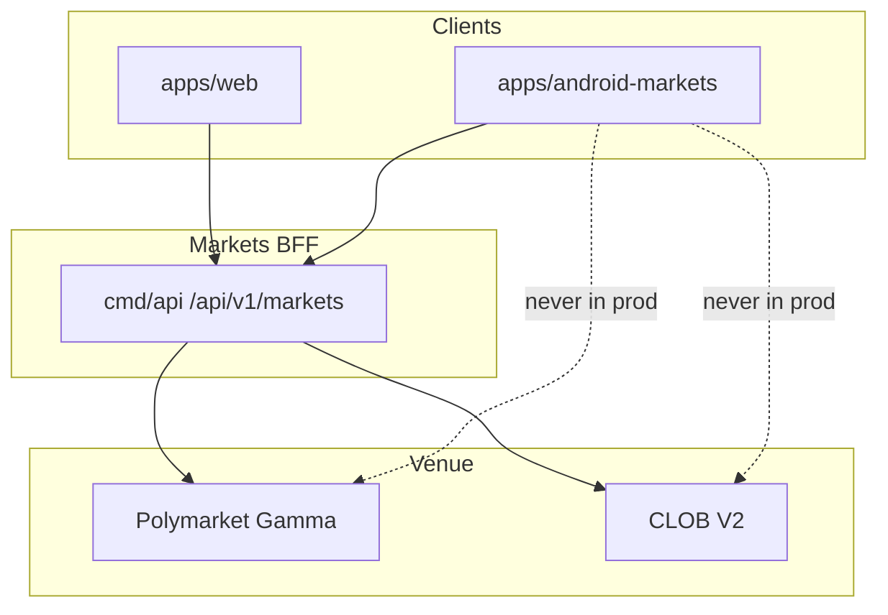

# ANDROID TEST STRATEGY

**Status:** reviewed
**Owner:** platform-orchestrator
**Last updated:** 2026-07-25
**Product:** RetroPick Markets V1
**Wave:** 5 — Android Compose Markets

## Description

This document is the Android test pyramid for RetroPick Markets V1 (Kotlin + Compose): JVM unit, repository integration, OpenAPI contract tests, Compose UI, a11y, staging E2E, Macrobenchmark, security and redaction tests, manual release matrix, and CI gates—with web parity expectations via shared fixtures.

It sits in Wave 5 under `apps/android-markets/` modules. Contract fixtures share OpenAPI examples with web and backend. Staging E2E uses the Markets BFF; production keys must not appear in CI logs. PHASE-5 definition of done requires evidence beyond `assembleDebug`.

Read this on every Android PR, before promoting Play tracks, and when OpenAPI changes force regen. Prefer END_TO_END_CRITICAL_JOURNEYS for P0 journey catalogs and WEB_TEST_STRATEGY for the web twin—not as a substitute.

It excludes permanently ignoring stale-book failures, inventing filled state on timeout, recording secrets into androidTest resources, and claiming production readiness from CI alone.

## 0. Developer intent (5W+1H)

Short orientation for implementers and agents. Read this before the normative sections below.

| Lens | Answer |
|------|--------|
| **Who** | Android QA/engineering agents; CI owners; harness reviewers deciding PHASE-5 DoD; anyone writing Compose UI tests or contract tests against OpenAPI. |
| **What** | Android test pyramid: JVM unit, repository integration, contract tests, Compose UI, a11y, staging E2E, Macrobenchmark, security tests, manual release matrix, CI gates, web parity expectations. |
| **When** | Every Android PR; before promoting Play tracks; when OpenAPI changes (regen + contract). Do not mark PHASE-5 complete on compile-only evidence. |
| **Where** | Spec: this file. Tests under `apps/android-markets/` modules. Contract fixtures share OpenAPI examples with web/backend. Staging E2E uses Markets BFF—not production keys in CI logs. |
| **Why** | Greenfield apps fail when only happy paths are demoed. Order reconciliation, stale guards, and wallet cancel paths need automated proof. Weakening tests to match bugs is forbidden by project norms. |
| **How** | Prefer JVM tests for use cases/FSM. Compose tests for ticket/gates. Contract tests decode BFF fixtures. Emulators for critical UI; Macrobenchmark on controlled hardware/CI. Security tests for logging redaction and debug flags. Manual matrix for real wallets. |

### Worked example

**Happy path — order preview PR.** Unit tests for tick validation + freshness disable; Compose test that max loss appears from preview fixture; contract test that preview response matches OpenAPI example; CI runs unit+Compose on PR; staging E2E optional nightly with wallet harness.

**Happy path — OpenAPI breaking field.** Contract tests fail → update codegen + mappers + UI; Android and web both fixed before merge.

**Failure / degraded.** Flaky emulator test → stabilize with idling resources, do not `@Ignore` permanently without issue. Asserting `Filled` on timeout to go green → reject. Skipping a11y tests because “TalkBack is hard” → not acceptable for ticket/preview. Claiming parity because web Playwright passed → still need Android contract/UI proof.

### DoD snapshot (PHASE-5)

- Pyramid layers exist for trading-critical paths.
- Contract tests in CI.
- Stale book / unknown order covered.
- Crash-free / ANR monitored on pre-prod.
- Manual wallet matrix executed before production track.

### Web parity testing

Shared fixtures beat duplicated mocks. When a journey exists in web ERROR doc (Jxx), Android should have an analogous automated or matrix row—or an explicit waived gap with owner.

### Mapping to journeys

| Risk area | Test layer |
|-----------|------------|
| Tick / money parse | JVM unit |
| Freshness disables submit | JVM + Compose |
| Preview → sign abort | Compose + fake wallet |
| OpenAPI shape | Contract |
| Navigation deep link | Instrumented |
| Startup jank | Macrobenchmark |

### CI vs human

CI owns deterministic layers. Humans own real wallet vendors, Play track uploads, and jurisdiction checks. Agents must not claim production readiness from CI alone.

### Agent anti-patterns

- `@Ignore` on failing stale-book test
- Recording secrets into androidTest resources
- Duplicating OpenAPI fixtures out of sync with YAML
- Marking harness complete when only `assembleDebug` passes

### Success signal

PHASE-5 DoD checklist in this doc is evidenced with CI links + manual matrix notes before Play production.

## 1. Purpose

Specify unit, integration, contract, Compose, E2E, and manual release test matrices.

## 2. Scope

### In scope

- RetroPick Markets V1 native Android client (Kotlin, Jetpack Compose, Material 3).
- Consumption of shared Markets BFF at `/api/v1/markets/*` per ADR-004.
- Feature parity targets defined in [.dev/ANDROID_MARKETS.md](../../ANDROID_MARKETS.md).
- Gradle modularization under `apps/android-markets/` (greenfield; `apps/android/` is README-only placeholder).

### Out of scope

- PRISM protocol, `contracts/prism/`, PRISM market creation, or PRISM settlement flows.
- Direct production calls to Polymarket Gamma/CLOB from the Android client (ADR-002).
- Legacy epoch MarketEngine APIs at `/api/v1/legacy/markets/*`.
- Custom RetroPick exchange or outcome-token issuance (ADR-001).
- Background autonomous trading or Android-specific order semantics.

## 3. Prerequisites

- [.dev/ANDROID_MARKETS.md](../../ANDROID_MARKETS.md) — product and architecture baseline.
- [00_DOCUMENT_MAP.md](../00_DOCUMENT_MAP.md)
- [phases/PHASE-5-ANDROID-COMPOSE-MARKETS.md](../phases/PHASE-5-ANDROID-COMPOSE-MARKETS.md)
- [architecture/adr/ADR-004-SHARED-WEB-ANDROID-API.md](../architecture/adr/ADR-004-SHARED-WEB-ANDROID-API.md)
- [architecture/adr/ADR-006-ANDROID-JETPACK-COMPOSE.md](../architecture/adr/ADR-006-ANDROID-JETPACK-COMPOSE.md)
- [schemas/openapi/markets-v1.yaml](../../../schemas/openapi/markets-v1.yaml)
- [apps/android/README.md](../../../apps/android/README.md) — current greenfield status.

## 4. Authoritative sources

| Source | URL / path | Retrieved | Confidence |
|--------|------------|-----------|------------|
| Android Markets product spec | `.dev/ANDROID_MARKETS.md` | 2026-07-25 | verified |
| Polymarket docs | https://docs.polymarket.com/ | 2026-07-25 | partially verified |
| CLOB V2 migration | https://docs.polymarket.com/v2-migration | 2026-07-25 | partially verified |
| Android app architecture | https://developer.android.com/topic/architecture | 2026-07-25 | verified |
| Compose architecture | https://developer.android.com/develop/ui/compose/architecture | 2026-07-25 | verified |
| Modularization guide | https://developer.android.com/topic/modularization | 2026-07-25 | verified |
| OpenAPI (repo) | `schemas/openapi/markets-v1.yaml` | 2026-07-25 | verified |
| Realtime schema | `schemas/events/markets-realtime-v1.json` | 2026-07-25 | verified |
| Play financial features | https://support.google.com/googleplay/android-developer/answer/13849271 | 2026-07-25 | partially verified |

## 5. Current state

`apps/android/` contains a README-only greenfield pointer. No Gradle project, modules, or
generated API client exist on disk. Implementation is scheduled for PHASE-5 per
[implementation-manifest.yaml](../agent-harness/implementation-manifest.yaml).

The target module tree is documented in [.dev/ANDROID_MARKETS.md](../../ANDROID_MARKETS.md) §4 and
expanded in [GRADLE_MODULE_GRAPH.md](./GRADLE_MODULE_GRAPH.md). CI will add an Android job once
`apps/android-markets/settings.gradle.kts` lands.

## 6. Target design

### Test pyramid

```mermaid
pyramid
    title Android test pyramid
    "E2E staging" : 10
    "Instrumented UI" : 20
    "Integration" : 30
    "Unit" : 40
```

### Unit tests (JVM)

| Area | Examples |
|------|----------|
| Money math | Price × size, rounding, tick alignment |
| Mappers | DTO → domain, WS delta reducer |
| Reducers | Order ticket state transitions |
| Eligibility policy | UI gate given capability flags |
| Freshness guards | Block sign when OFFLINE |
| Preview validation | Field mismatch detection |

Framework: JUnit 5, Turbine for Flow, MockK.

### Repository integration tests

- Fake `MarketsApi` + in-memory Room + fake WS.
- Scenarios: 5xx, timeout, gap, migration, clock skew.

### Contract tests

Shared JSON fixtures in `schemas/fixtures/`:

```kotlin
@Test
fun previewOrder_matchesGoldenFixture() {
    val response = api.previewOrder(fixtureRequest)
    assertJsonEquals(fixtureResponse, response)
}
```

Run in CI against Go handler tests (same files).

### Compose UI tests

| Screen | Cases |
|--------|-------|
| Order ticket | Preview disabled when stale |
| Market detail | Stale banner visible |
| Discovery | Empty state |
| Eligibility | Blocked CTA |

Paparazzi screenshot tests for design regression.

### Accessibility tests

- `composeTestRule.onNodeWithContentDescription`
- Accessibility Scanner on release candidate builds
- TalkBack manual matrix item

### E2E (staging)

Device: Firebase Test Lab + physical wallet test devices.

Flow: login → connect test wallet → preview → sign → submit → verify open order.

### Macrobenchmark

`benchmark` module: startup, scroll, baseline profile.

### Security tests

- NSC cleartext blocked instrumented test.
- No secrets in `logcat` during sign flow (lint rule).
- Deep link fuzz allowlist.

### Manual release matrix

| Dimension | Variants |
|-----------|----------|
| API level | min, target, latest preview |
| Screen | phone, fold, tablet |
| Network | offline, slow, flaky |
| Wallet | each supported vendor |
| Upgrade | fresh install vs N-1 upgrade |
| Locale | EN + one RTL if supported |

### CI gates

| Gate | Command |
|------|---------|
| Unit | `./gradlew test` |
| Lint | `./gradlew lint` |
| Contract | `./gradlew :core:testing:contractTest` |
| Screenshot | `./gradlew verifyPaparazzi` |
| Benchmark | nightly `connectedBenchmark` |

### Web parity

| Test type | Web | Android |
|-----------|-----|---------|
| Contract fixtures | Vitest/Go | Kotlin contract module |
| E2E | Playwright | Firebase Test Lab |
| Visual | Percy/Chromatic | Paparazzi |
| a11y | axe | Compose semantics + Scanner |

### Definition of done (PHASE-5)

- Generated API contract tests pass.
- Staging E2E order path green.
- Play closed-track build uploaded.
- Crash-free > 99% on internal track 7d.

## 7. Alternatives considered

| Alternative | Rejected because |
|-------------|------------------|
| Flutter cross-platform | ADR-006 locks Jetpack Compose for first-party Android quality, Keystore integration, and Play policy alignment |
| React Native WebView shell | Violates native UX, accessibility, and wallet SDK integration requirements |
| Direct Gamma/CLOB from Android | ADR-002: BFF anti-corruption layer owns fee, eligibility, and schema compatibility |
| Monolithic single-module app | Blocks parallel feature development and inflates build/test cycles |
| PRISM combined mobile client | Increases policy, signing, and release risk; PRISM remains web-first |
| Embedded unrestricted WebView dApp | Tapjacking, injection, and wallet confusion risks |
| Raw private-key import | Custody and regulatory risk; wallet remains external authority |

## 8. Decisions

| ID | Decision | Rationale |
|----|----------|-----------|
| D-AND-001 | Markets-only Android scope | See [.dev/ANDROID_MARKETS.md](../../ANDROID_MARKETS.md) §1 |
| D-AND-002 | Shared OpenAPI with web | ADR-004; contract tests block breaking changes |
| D-AND-003 | Jetpack Compose + UDF | ADR-006; immutable UiState, event intents, StateFlow |
| D-AND-004 | BFF-only network boundary | ADR-002; no upstream Polymarket calls in production |
| D-AND-005 | Server-authoritative orders | Preview hash from backend; client verifies before sign |
| D-AND-006 | `apps/android-markets/` module root | Keeps README placeholder stable during greenfield bootstrap |
| D-AND-007 | No PRISM dependencies | Zero imports from `packages/prism` or PRISM schemas |

## 9. Data and control flows



## 10. Failure and recovery

| Scenario | Client behavior | Recovery |
|----------|-----------------|----------|
| Eligibility unknown | Fail closed; block trading surfaces | Retry eligibility; show support link |
| BFF 5xx on catalog | Show cached snapshot with stale label | Exponential backoff refresh |
| BFF 5xx on order preview | Block sign; no offline preview | User retries; incident banner if widespread |
| Submit timeout | State `ReconcilingUnknown`; no auto-resubmit | Poll by preview hash / order ID |
| WebSocket gap | Detect sequence gap; snapshot refresh | Atomic Room replace per ADR-005 |
| Wallet reject/timeout | Return to ReadyToSign with reason | User may change wallet or retry |
| Rooted device | Risk signal + warning; no false guarantees | User acknowledgment where required |
| Play policy block | Hide order entry per region flag | Server capability + eligibility gate |

## 11. Security

- No raw private-key custody, generation, import, or backup by RetroPick.
- Preview-before-sign: client verifies EIP-712 fields match human-readable preview.
- Android Keystore for app session secrets and encrypted DataStore master keys.
- Biometrics gate app session actions; wallet remains transaction authority.
- Network Security Configuration: TLS only, no cleartext, certificate policy reviewed.
- Sensitive screens: overlay protection, selective FLAG_SECURE, no seed clipboard.
- Deep links allowlisted; never auto-sign from link payload.
- Analytics allowlist with field redaction; no signatures in crash reports.
- See [WALLET_SIGNING_AND_SECURITY.md](./WALLET_SIGNING_AND_SECURITY.md) and [security/THREAT_MODEL.md](../security/THREAT_MODEL.md).

## 12. Observability

| Signal | Instrumentation | Alert threshold (initial) |
|--------|-----------------|---------------------------|
| Crash-free users | Firebase Crashlytics / Play Vitals | < 99.8% rolling 7d |
| ANR rate | Play Vitals + custom traces | Above Play bad-behavior internal guard |
| Cold start | Macrobenchmark + Play Vitals | Regression > 10% vs baseline |
| Order preview latency | OpenTelemetry Android + BFF trace | p95 > 2s healthy network |
| Sign-to-accepted | Custom funnel event | Drop > 15% vs prior release |
| Realtime gap recovery | `markets_android_ws_gap_total` | Sustained gap rate spike |
| Cache staleness age | Room metadata histogram | p95 staleness > 5m on catalog |

Tracing: W3C `traceparent` propagated on REST; correlate with BFF `request_id`.

## 13. Test strategy

See [ANDROID_TEST_STRATEGY.md](./ANDROID_TEST_STRATEGY.md). Minimum bar per release:

- Unit: money math, mappers, reducers, eligibility UI policy.
- Repository fakes: API errors, WS gaps, Room migrations.
- Contract: golden fixtures shared with Go and TypeScript.
- Compose: screenshot + accessibility checks on order ticket and market detail.
- Staging E2E: preview → sign → submit → reconcile happy path.
- Macrobenchmark: cold start, feed scroll, market detail from cache.

## 14. Rollout and rollback

| Track | Audience | Gate |
|-------|----------|------|
| `devDebug` | Engineers | Local/dev BFF; fixture wallets |
| `stagingRelease` | Internal QA | Staging BFF; full E2E matrix |
| `internal` Play | Closed testers | Crash/ANR budget; security review |
| `production` staged | % rollout | Order-error rate, support tickets, Play Vitals |

Kill switches: `/markets/capabilities` disables order submission per region/version.
Rollback: halt rollout, ship hotfix, or remote-disable trading without catalog regression.

## 15. Web vs Android parity

Parity is defined relative to Markets web (`apps/web`). Android may defer non-critical
surfaces but must not invent divergent trading semantics.

| Capability | Web (V1) | Android (V1) | Parity notes |
|------------|----------|--------------|--------------|
| Eligibility gate | Yes | Yes | Same `/markets/eligibility` contract |
| Capabilities flags | Yes | Yes | Order kill switch respected on both |
| Event discovery | Yes | Yes | Android adds offline cache labels |
| Market detail + rules | Yes | Yes | Adaptive layouts on tablet/foldable |
| Order book + history | Yes | Yes | Realtime via shared WS schema |
| Limit / marketable-limit orders | Yes | Yes | Identical preview hash flow |
| Wallet connect + sign | Yes | Yes | Mobile uses wallet SDK / WC deep links |
| Open orders + history | Yes | Yes | Android stale guards on order actions |
| Positions + PnL | Yes | Yes | Pull-to-refresh + WS deltas |
| Watchlist | Yes | Yes | Sync via authenticated API |
| Price alerts | Yes | Yes | Push on Android vs web inbox |
| Deep links | HTTPS app links | `retropick://` + HTTPS | See NAVIGATION doc |
| CTF split/merge/redeem | Web V1.1+ | Android V1.1+ | Deferred together |
| Intelligence signals | Web Phase 3 | Read-only V1 optional | May ship post-core trading |
| PRISM | No | No | Explicit non-goal |
| Contract tests | Shared fixtures | Shared fixtures | ADR-004 parity |

### Parity principles

- Server authority — eligibility, fees, capabilities, and order payloads originate from BFF.
- Contract symmetry — OpenAPI and realtime schemas are version-locked across clients.
- UX adaptation — mobile optimizes for short sessions, push, and biometric session gates.
- Explicit deferrals — V1.1+ items documented; no silent web-only trading features.
- No PRISM — neither client exposes PRISM in this generation.

## 16. Open questions

| ID | Question | Expiry | Owner |
|----|----------|--------|-------|
| OQ-AND-01 | Minimum `minSdk` and target device profile | Before Gradle bootstrap | mobile-lead |
| OQ-AND-02 | Wallet vendors for V1 (WalletConnect, Coinbase, etc.) | Before wallet module | mobile-lead |
| OQ-AND-03 | Room encryption requirement given data inventory | Before database schema freeze | security |
| OQ-AND-04 | Supported Play countries and age rating | Before closed track | legal |
| OQ-AND-05 | FCM vs hybrid push for alert delivery | Before notifications module | platform |
| OQ-AND-06 | CTF split/merge in V1 vs V1.1 | Before redemption feature | product |

Full list: [research/OPEN_QUESTIONS_AND_EXPIRING_ASSUMPTIONS.md](../research/OPEN_QUESTIONS_AND_EXPIRING_ASSUMPTIONS.md).

## 17. Acceptance criteria

- Test pyramid and CI gates defined.
- Contract fixtures shared with web/Go.
- PHASE-5 exit criteria: contract + closed track.
- Manual matrix dimensions listed.

## 18. Related documents

- [.dev/ANDROID_MARKETS.md](../../ANDROID_MARKETS.md)
- [COMPOSE_APP_ARCHITECTURE.md](./COMPOSE_APP_ARCHITECTURE.md)
- [GRADLE_MODULE_GRAPH.md](./GRADLE_MODULE_GRAPH.md)
- [NAVIGATION_AND_DEEP_LINKS.md](./NAVIGATION_AND_DEEP_LINKS.md)
- [STATE_DATA_OFFLINE_AND_REALTIME.md](./STATE_DATA_OFFLINE_AND_REALTIME.md)
- [WALLET_SIGNING_AND_SECURITY.md](./WALLET_SIGNING_AND_SECURITY.md)
- [NOTIFICATIONS_AND_BACKGROUND_WORK.md](./NOTIFICATIONS_AND_BACKGROUND_WORK.md)
- [ACCESSIBILITY_PERFORMANCE_AND_DEVICES.md](./ACCESSIBILITY_PERFORMANCE_AND_DEVICES.md)
- [PLAY_STORE_COMPLIANCE_AND_RELEASE.md](./PLAY_STORE_COMPLIANCE_AND_RELEASE.md)
- [ANDROID_TEST_STRATEGY.md](./ANDROID_TEST_STRATEGY.md)
- [phases/PHASE-5-ANDROID-COMPOSE-MARKETS.md](../phases/PHASE-5-ANDROID-COMPOSE-MARKETS.md)

---

## Appendix A — Implementation deep dives

### A.1 test-strategy — Overview

**Overview** for `test-strategy`.

- Align with [.dev/ANDROID_MARKETS.md](../../ANDROID_MARKETS.md) and PHASE-5 exit gates.
- Never call Polymarket upstream directly from production code paths.
- Log structured diagnostics without wallet secrets or full signed payloads.
- Compose UI exposes loading, empty, error, stale, ineligible, and success states.
- ViewModels expose StateFlow<UiState>; effects use SharedFlow or Channel.
- Repository maps DTO to domain; features never import Retrofit or Room.
- Contract tests pass golden fixtures before merge.
- Touch targets ≥ 48dp; TalkBack labels on all actionable controls.
- Main thread must not perform network or disk I/O.
- Feature flags read from /markets/capabilities on cold start and resume.
- Deep dive 1 for test-strategy: Overview implementation checklist item 1.
- Deep dive 1 for test-strategy: Overview implementation checklist item 2.
- Deep dive 1 for test-strategy: Overview implementation checklist item 3.
- Deep dive 1 for test-strategy: Overview implementation checklist item 4.
- Deep dive 1 for test-strategy: Overview implementation checklist item 5.

### A.2 test-strategy — Module ownership

**Module ownership** for `test-strategy`.

- Align with [.dev/ANDROID_MARKETS.md](../../ANDROID_MARKETS.md) and PHASE-5 exit gates.
- Never call Polymarket upstream directly from production code paths.
- Log structured diagnostics without wallet secrets or full signed payloads.
- Compose UI exposes loading, empty, error, stale, ineligible, and success states.
- ViewModels expose StateFlow<UiState>; effects use SharedFlow or Channel.
- Repository maps DTO to domain; features never import Retrofit or Room.
- Contract tests pass golden fixtures before merge.
- Touch targets ≥ 48dp; TalkBack labels on all actionable controls.
- Main thread must not perform network or disk I/O.
- Feature flags read from /markets/capabilities on cold start and resume.
- Deep dive 2 for test-strategy: Module ownership implementation checklist item 1.
- Deep dive 2 for test-strategy: Module ownership implementation checklist item 2.
- Deep dive 2 for test-strategy: Module ownership implementation checklist item 3.
- Deep dive 2 for test-strategy: Module ownership implementation checklist item 4.
- Deep dive 2 for test-strategy: Module ownership implementation checklist item 5.

### A.3 test-strategy — API mapping

**API mapping** for `test-strategy`.

- Align with [.dev/ANDROID_MARKETS.md](../../ANDROID_MARKETS.md) and PHASE-5 exit gates.
- Never call Polymarket upstream directly from production code paths.
- Log structured diagnostics without wallet secrets or full signed payloads.
- Compose UI exposes loading, empty, error, stale, ineligible, and success states.
- ViewModels expose StateFlow<UiState>; effects use SharedFlow or Channel.
- Repository maps DTO to domain; features never import Retrofit or Room.
- Contract tests pass golden fixtures before merge.
- Touch targets ≥ 48dp; TalkBack labels on all actionable controls.
- Main thread must not perform network or disk I/O.
- Feature flags read from /markets/capabilities on cold start and resume.
- Deep dive 3 for test-strategy: API mapping implementation checklist item 1.
- Deep dive 3 for test-strategy: API mapping implementation checklist item 2.
- Deep dive 3 for test-strategy: API mapping implementation checklist item 3.
- Deep dive 3 for test-strategy: API mapping implementation checklist item 4.
- Deep dive 3 for test-strategy: API mapping implementation checklist item 5.

### A.4 test-strategy — State machine

**State machine** for `test-strategy`.

- Align with [.dev/ANDROID_MARKETS.md](../../ANDROID_MARKETS.md) and PHASE-5 exit gates.
- Never call Polymarket upstream directly from production code paths.
- Log structured diagnostics without wallet secrets or full signed payloads.
- Compose UI exposes loading, empty, error, stale, ineligible, and success states.
- ViewModels expose StateFlow<UiState>; effects use SharedFlow or Channel.
- Repository maps DTO to domain; features never import Retrofit or Room.
- Contract tests pass golden fixtures before merge.
- Touch targets ≥ 48dp; TalkBack labels on all actionable controls.
- Main thread must not perform network or disk I/O.
- Feature flags read from /markets/capabilities on cold start and resume.
- Deep dive 4 for test-strategy: State machine implementation checklist item 1.
- Deep dive 4 for test-strategy: State machine implementation checklist item 2.
- Deep dive 4 for test-strategy: State machine implementation checklist item 3.
- Deep dive 4 for test-strategy: State machine implementation checklist item 4.
- Deep dive 4 for test-strategy: State machine implementation checklist item 5.

### A.5 test-strategy — Caching

**Caching** for `test-strategy`.

- Align with [.dev/ANDROID_MARKETS.md](../../ANDROID_MARKETS.md) and PHASE-5 exit gates.
- Never call Polymarket upstream directly from production code paths.
- Log structured diagnostics without wallet secrets or full signed payloads.
- Compose UI exposes loading, empty, error, stale, ineligible, and success states.
- ViewModels expose StateFlow<UiState>; effects use SharedFlow or Channel.
- Repository maps DTO to domain; features never import Retrofit or Room.
- Contract tests pass golden fixtures before merge.
- Touch targets ≥ 48dp; TalkBack labels on all actionable controls.
- Main thread must not perform network or disk I/O.
- Feature flags read from /markets/capabilities on cold start and resume.
- Deep dive 5 for test-strategy: Caching implementation checklist item 1.
- Deep dive 5 for test-strategy: Caching implementation checklist item 2.
- Deep dive 5 for test-strategy: Caching implementation checklist item 3.
- Deep dive 5 for test-strategy: Caching implementation checklist item 4.
- Deep dive 5 for test-strategy: Caching implementation checklist item 5.

### A.6 test-strategy — Error UX

**Error UX** for `test-strategy`.

- Align with [.dev/ANDROID_MARKETS.md](../../ANDROID_MARKETS.md) and PHASE-5 exit gates.
- Never call Polymarket upstream directly from production code paths.
- Log structured diagnostics without wallet secrets or full signed payloads.
- Compose UI exposes loading, empty, error, stale, ineligible, and success states.
- ViewModels expose StateFlow<UiState>; effects use SharedFlow or Channel.
- Repository maps DTO to domain; features never import Retrofit or Room.
- Contract tests pass golden fixtures before merge.
- Touch targets ≥ 48dp; TalkBack labels on all actionable controls.
- Main thread must not perform network or disk I/O.
- Feature flags read from /markets/capabilities on cold start and resume.
- Deep dive 6 for test-strategy: Error UX implementation checklist item 1.
- Deep dive 6 for test-strategy: Error UX implementation checklist item 2.
- Deep dive 6 for test-strategy: Error UX implementation checklist item 3.
- Deep dive 6 for test-strategy: Error UX implementation checklist item 4.
- Deep dive 6 for test-strategy: Error UX implementation checklist item 5.

### A.7 test-strategy — Testing hooks

**Testing hooks** for `test-strategy`.

- Align with [.dev/ANDROID_MARKETS.md](../../ANDROID_MARKETS.md) and PHASE-5 exit gates.
- Never call Polymarket upstream directly from production code paths.
- Log structured diagnostics without wallet secrets or full signed payloads.
- Compose UI exposes loading, empty, error, stale, ineligible, and success states.
- ViewModels expose StateFlow<UiState>; effects use SharedFlow or Channel.
- Repository maps DTO to domain; features never import Retrofit or Room.
- Contract tests pass golden fixtures before merge.
- Touch targets ≥ 48dp; TalkBack labels on all actionable controls.
- Main thread must not perform network or disk I/O.
- Feature flags read from /markets/capabilities on cold start and resume.
- Deep dive 7 for test-strategy: Testing hooks implementation checklist item 1.
- Deep dive 7 for test-strategy: Testing hooks implementation checklist item 2.
- Deep dive 7 for test-strategy: Testing hooks implementation checklist item 3.
- Deep dive 7 for test-strategy: Testing hooks implementation checklist item 4.
- Deep dive 7 for test-strategy: Testing hooks implementation checklist item 5.

### A.8 test-strategy — Rollout flags

**Rollout flags** for `test-strategy`.

- Align with [.dev/ANDROID_MARKETS.md](../../ANDROID_MARKETS.md) and PHASE-5 exit gates.
- Never call Polymarket upstream directly from production code paths.
- Log structured diagnostics without wallet secrets or full signed payloads.
- Compose UI exposes loading, empty, error, stale, ineligible, and success states.
- ViewModels expose StateFlow<UiState>; effects use SharedFlow or Channel.
- Repository maps DTO to domain; features never import Retrofit or Room.
- Contract tests pass golden fixtures before merge.
- Touch targets ≥ 48dp; TalkBack labels on all actionable controls.
- Main thread must not perform network or disk I/O.
- Feature flags read from /markets/capabilities on cold start and resume.
- Deep dive 8 for test-strategy: Rollout flags implementation checklist item 1.
- Deep dive 8 for test-strategy: Rollout flags implementation checklist item 2.
- Deep dive 8 for test-strategy: Rollout flags implementation checklist item 3.
- Deep dive 8 for test-strategy: Rollout flags implementation checklist item 4.
- Deep dive 8 for test-strategy: Rollout flags implementation checklist item 5.

### A.9 test-strategy — Performance budget

**Performance budget** for `test-strategy`.

- Align with [.dev/ANDROID_MARKETS.md](../../ANDROID_MARKETS.md) and PHASE-5 exit gates.
- Never call Polymarket upstream directly from production code paths.
- Log structured diagnostics without wallet secrets or full signed payloads.
- Compose UI exposes loading, empty, error, stale, ineligible, and success states.
- ViewModels expose StateFlow<UiState>; effects use SharedFlow or Channel.
- Repository maps DTO to domain; features never import Retrofit or Room.
- Contract tests pass golden fixtures before merge.
- Touch targets ≥ 48dp; TalkBack labels on all actionable controls.
- Main thread must not perform network or disk I/O.
- Feature flags read from /markets/capabilities on cold start and resume.
- Deep dive 9 for test-strategy: Performance budget implementation checklist item 1.
- Deep dive 9 for test-strategy: Performance budget implementation checklist item 2.
- Deep dive 9 for test-strategy: Performance budget implementation checklist item 3.
- Deep dive 9 for test-strategy: Performance budget implementation checklist item 4.
- Deep dive 9 for test-strategy: Performance budget implementation checklist item 5.

### A.10 test-strategy — Accessibility

**Accessibility** for `test-strategy`.

- Align with [.dev/ANDROID_MARKETS.md](../../ANDROID_MARKETS.md) and PHASE-5 exit gates.
- Never call Polymarket upstream directly from production code paths.
- Log structured diagnostics without wallet secrets or full signed payloads.
- Compose UI exposes loading, empty, error, stale, ineligible, and success states.
- ViewModels expose StateFlow<UiState>; effects use SharedFlow or Channel.
- Repository maps DTO to domain; features never import Retrofit or Room.
- Contract tests pass golden fixtures before merge.
- Touch targets ≥ 48dp; TalkBack labels on all actionable controls.
- Main thread must not perform network or disk I/O.
- Feature flags read from /markets/capabilities on cold start and resume.
- Deep dive 10 for test-strategy: Accessibility implementation checklist item 1.
- Deep dive 10 for test-strategy: Accessibility implementation checklist item 2.
- Deep dive 10 for test-strategy: Accessibility implementation checklist item 3.
- Deep dive 10 for test-strategy: Accessibility implementation checklist item 4.
- Deep dive 10 for test-strategy: Accessibility implementation checklist item 5.

### A.11 test-strategy — Security controls

**Security controls** for `test-strategy`.

- Align with [.dev/ANDROID_MARKETS.md](../../ANDROID_MARKETS.md) and PHASE-5 exit gates.
- Never call Polymarket upstream directly from production code paths.
- Log structured diagnostics without wallet secrets or full signed payloads.
- Compose UI exposes loading, empty, error, stale, ineligible, and success states.
- ViewModels expose StateFlow<UiState>; effects use SharedFlow or Channel.
- Repository maps DTO to domain; features never import Retrofit or Room.
- Contract tests pass golden fixtures before merge.
- Touch targets ≥ 48dp; TalkBack labels on all actionable controls.
- Main thread must not perform network or disk I/O.
- Feature flags read from /markets/capabilities on cold start and resume.
- Deep dive 11 for test-strategy: Security controls implementation checklist item 1.
- Deep dive 11 for test-strategy: Security controls implementation checklist item 2.
- Deep dive 11 for test-strategy: Security controls implementation checklist item 3.
- Deep dive 11 for test-strategy: Security controls implementation checklist item 4.
- Deep dive 11 for test-strategy: Security controls implementation checklist item 5.

### A.12 test-strategy — Observability

**Observability** for `test-strategy`.

- Align with [.dev/ANDROID_MARKETS.md](../../ANDROID_MARKETS.md) and PHASE-5 exit gates.
- Never call Polymarket upstream directly from production code paths.
- Log structured diagnostics without wallet secrets or full signed payloads.
- Compose UI exposes loading, empty, error, stale, ineligible, and success states.
- ViewModels expose StateFlow<UiState>; effects use SharedFlow or Channel.
- Repository maps DTO to domain; features never import Retrofit or Room.
- Contract tests pass golden fixtures before merge.
- Touch targets ≥ 48dp; TalkBack labels on all actionable controls.
- Main thread must not perform network or disk I/O.
- Feature flags read from /markets/capabilities on cold start and resume.
- Deep dive 12 for test-strategy: Observability implementation checklist item 1.
- Deep dive 12 for test-strategy: Observability implementation checklist item 2.
- Deep dive 12 for test-strategy: Observability implementation checklist item 3.
- Deep dive 12 for test-strategy: Observability implementation checklist item 4.
- Deep dive 12 for test-strategy: Observability implementation checklist item 5.

### A.13 test-strategy — Migration notes

**Migration notes** for `test-strategy`.

- Align with [.dev/ANDROID_MARKETS.md](../../ANDROID_MARKETS.md) and PHASE-5 exit gates.
- Never call Polymarket upstream directly from production code paths.
- Log structured diagnostics without wallet secrets or full signed payloads.
- Compose UI exposes loading, empty, error, stale, ineligible, and success states.
- ViewModels expose StateFlow<UiState>; effects use SharedFlow or Channel.
- Repository maps DTO to domain; features never import Retrofit or Room.
- Contract tests pass golden fixtures before merge.
- Touch targets ≥ 48dp; TalkBack labels on all actionable controls.
- Main thread must not perform network or disk I/O.
- Feature flags read from /markets/capabilities on cold start and resume.
- Deep dive 13 for test-strategy: Migration notes implementation checklist item 1.
- Deep dive 13 for test-strategy: Migration notes implementation checklist item 2.
- Deep dive 13 for test-strategy: Migration notes implementation checklist item 3.
- Deep dive 13 for test-strategy: Migration notes implementation checklist item 4.
- Deep dive 13 for test-strategy: Migration notes implementation checklist item 5.

### A.14 test-strategy — FAQ

**FAQ** for `test-strategy`.

- Align with [.dev/ANDROID_MARKETS.md](../../ANDROID_MARKETS.md) and PHASE-5 exit gates.
- Never call Polymarket upstream directly from production code paths.
- Log structured diagnostics without wallet secrets or full signed payloads.
- Compose UI exposes loading, empty, error, stale, ineligible, and success states.
- ViewModels expose StateFlow<UiState>; effects use SharedFlow or Channel.
- Repository maps DTO to domain; features never import Retrofit or Room.
- Contract tests pass golden fixtures before merge.
- Touch targets ≥ 48dp; TalkBack labels on all actionable controls.
- Main thread must not perform network or disk I/O.
- Feature flags read from /markets/capabilities on cold start and resume.
- Deep dive 14 for test-strategy: FAQ implementation checklist item 1.
- Deep dive 14 for test-strategy: FAQ implementation checklist item 2.
- Deep dive 14 for test-strategy: FAQ implementation checklist item 3.
- Deep dive 14 for test-strategy: FAQ implementation checklist item 4.
- Deep dive 14 for test-strategy: FAQ implementation checklist item 5.

### A.15 test-strategy — Overview

**Overview** for `test-strategy`.

- Align with [.dev/ANDROID_MARKETS.md](../../ANDROID_MARKETS.md) and PHASE-5 exit gates.
- Never call Polymarket upstream directly from production code paths.
- Log structured diagnostics without wallet secrets or full signed payloads.
- Compose UI exposes loading, empty, error, stale, ineligible, and success states.
- ViewModels expose StateFlow<UiState>; effects use SharedFlow or Channel.
- Repository maps DTO to domain; features never import Retrofit or Room.
- Contract tests pass golden fixtures before merge.
- Touch targets ≥ 48dp; TalkBack labels on all actionable controls.
- Main thread must not perform network or disk I/O.
- Feature flags read from /markets/capabilities on cold start and resume.
- Deep dive 15 for test-strategy: Overview implementation checklist item 1.
- Deep dive 15 for test-strategy: Overview implementation checklist item 2.
- Deep dive 15 for test-strategy: Overview implementation checklist item 3.
- Deep dive 15 for test-strategy: Overview implementation checklist item 4.
- Deep dive 15 for test-strategy: Overview implementation checklist item 5.

### A.16 test-strategy — Module ownership

**Module ownership** for `test-strategy`.

- Align with [.dev/ANDROID_MARKETS.md](../../ANDROID_MARKETS.md) and PHASE-5 exit gates.
- Never call Polymarket upstream directly from production code paths.
- Log structured diagnostics without wallet secrets or full signed payloads.
- Compose UI exposes loading, empty, error, stale, ineligible, and success states.
- ViewModels expose StateFlow<UiState>; effects use SharedFlow or Channel.
- Repository maps DTO to domain; features never import Retrofit or Room.
- Contract tests pass golden fixtures before merge.
- Touch targets ≥ 48dp; TalkBack labels on all actionable controls.
- Main thread must not perform network or disk I/O.
- Feature flags read from /markets/capabilities on cold start and resume.
- Deep dive 16 for test-strategy: Module ownership implementation checklist item 1.
- Deep dive 16 for test-strategy: Module ownership implementation checklist item 2.
- Deep dive 16 for test-strategy: Module ownership implementation checklist item 3.
- Deep dive 16 for test-strategy: Module ownership implementation checklist item 4.
- Deep dive 16 for test-strategy: Module ownership implementation checklist item 5.
