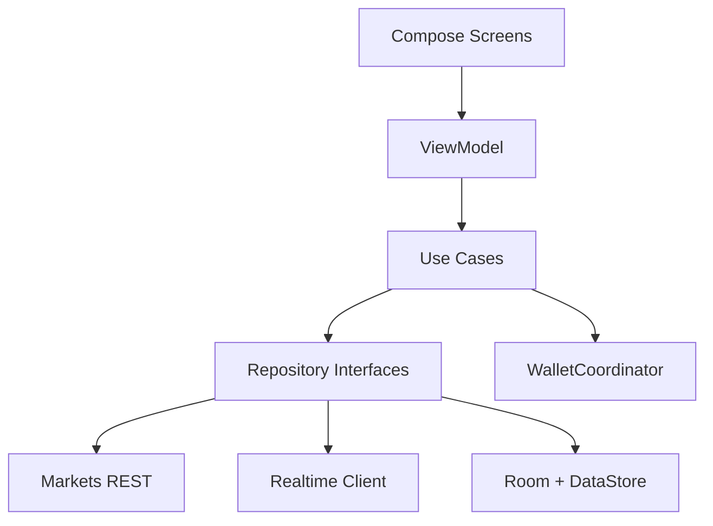
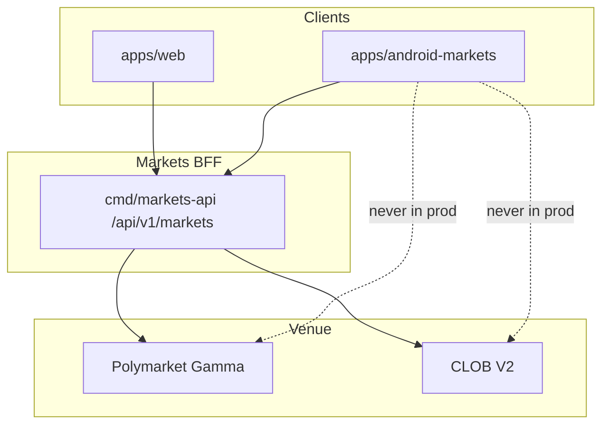

# COMPOSE APP ARCHITECTURE

**Status:** reviewed
**Owner:** platform-orchestrator
**Last updated:** 2026-07-25
**Product:** RetroPick Markets V1
**Wave:** 5 — Android Compose Markets

## Description

This document is the Jetpack Compose application architecture for RetroPick Markets V1 Android: UI → ViewModel → use cases → repositories layering, immutable `UiState`, sealed user events, feature modules, concurrency, Hilt DI, previews, and forbidden anti-patterns such as networking in composables or float money.

It sits in Wave 5 with GRADLE_MODULE_GRAPH as required co-reading. Code lives in feature modules under the Android Markets Gradle graph; API models come from OpenAPI codegen; wallet access goes through `WalletCoordinator`, not leaf Compose calls to vendors. Web TanStack Query differs mechanistically, but order and eligibility phases and fields must match OpenAPI.

Read this before writing any feature screen, and when adding trading ticket state machines, wallet coordination, or cross-feature navigation events. Prefer STATE_DATA_OFFLINE_AND_REALTIME for cache and WS merge rules and WALLET_SIGNING_AND_SECURITY for sign paths.

It excludes God-Activities, UI-layer Retrofit, a GlobalViewModel for all markets state, blocking runBlocking in UI, and passing NavController into the data layer.

## 0. Developer intent (5W+1H)

Short orientation for implementers and agents. Read this before the normative sections below.

| Lens | Answer |
|------|--------|
| **Who** | Android engineers and agents implementing Jetpack Compose UDF in `apps/android-markets/`; module owners wiring ViewModels, use cases, and Hilt; reviewers rejecting God-Activities and UI-layer networking. |
| **What** | Compose application architecture: layering (UI → VM → use cases → repositories), immutable `UiState`, event intents, feature modules, concurrency rules, DI, previews, and forbidden anti-patterns. |
| **When** | Before writing any feature screen. Re-read when adding trading ticket state machines, wallet coordination, or cross-feature navigation events. Required reading with GRADLE_MODULE_GRAPH. |
| **Where** | Spec: this file. Code: feature modules under Android Markets Gradle graph; shared `:core` / `:data` patterns as defined later in this doc. API models from OpenAPI codegen. Wallet through `WalletCoordinator`, not Compose leaf calls to vendors. |
| **Why** | Unidirectional flow keeps order/funding states testable and prevents “Compose calls Retrofit” shortcuts that break offline and signing rules. Shared state shapes with web reduce semantic drift. |
| **How** | Each screen: `UiState` + sealed user events → ViewModel → use cases. Repositories merge REST, WS, Room. Expose `StateFlow`/`Immutable` UI models. Map errors to `UserFacingError`. Previews use fake states for loading/ready/stale/blocked. No business logic in composables beyond presentation. |

### Worked example

**Happy path — order ticket UDF.** `OrderTicketUiState` holds market, side, amount, price, phase, preview, freshness, eligibility, error. User edits price → event → VM updates input and may debounce preview use case → BFF preview → state shows fees/max loss → user Sign → wallet coordinator → submit use case → phase reconciling → REST/WS reconcile to open/filled.

**Happy path — discovery list.** Paging repository feeds VM; UI shows Loading/Content/Empty/Error. Pull-to-refresh invalidates. Stale cache displays labeled data (see STATE_DATA doc)—not presented as live.

**Failure / degraded.** Preview fails → error on state, inputs preserved. Eligibility denied → blocked phase, no sign CTA. VM catches cancellation; no leaked coroutines on rotate. Composable directly opening Browser for “sign” without preview → reject in review. Sharing mutable ticket state across screens without ownership → refactor to use case/repo.

### Anti-pattern radar

| Forbidden | Prefer |
|-----------|--------|
| Network in Composable | Repository + VM |
| `var` UI business state | Immutable `UiState` |
| Silent catch | Typed errors + UX |
| Float for money | `Money` / decimal types |
| Feature → feature impl deps | API modules / navigation events |

### Parity note

Web TanStack Query ≠ Compose VM, but **phases and fields** for orders/eligibility must match OpenAPI. When adding a UI phase, update web ticket FSM docs if semantics change.

### Module ↔ layer expectation

| Concern | Lives in |
|---------|----------|
| Composables | `:feature:*` |
| ViewModels | `:feature:*` |
| Use cases | `:domain` / feature domain |
| Repositories | `:data` |
| Generated API | `:api` |
| WalletCoordinator | wallet/security module |

### UiState quality bar

- Immutable / `@Immutable` where practical
- Sealed phase enums exhaustive in `when`
- Errors user-facing and typed
- Freshness + eligibility first-class fields on trading states

### Agent anti-patterns

- `GlobalViewModel` for all markets state
- Blocking `runBlocking` in UI
- Passing `NavController` into data layer
- Float PnL in UI models

### Success signal

Order ticket phases are unit-testable without Compose runtime and map 1:1 to preview/sign/submit/reconcile.

## 1. Purpose

Specify Jetpack Compose UDF architecture: UiState, events, ViewModels, use cases, and feature module boundaries.

## 2. Scope

### In scope

- RetroPick Markets V1 native Android client (Kotlin, Jetpack Compose, Material 3).
- Consumption of shared Markets BFF at `/api/v1/markets/*` per ADR-004.
- Feature parity targets defined in [.dev/ANDROID_MARKETS.md](../../ANDROID_MARKETS.md).
- Gradle modularization under `apps/android-markets/` (greenfield; `apps/android/` is README-only placeholder).

### Out of scope

- PRISM protocol, `contracts/prism/`, PRISM market creation, or PRISM settlement flows.
- Direct production calls to Polymarket Gamma/CLOB from the Android client (ADR-002).
Current Markets V1 authority: `.harness/products/markets-v1/governance/AGENT_OPERATING_CONTRACT.md`.
- Custom RetroPick exchange or outcome-token issuance (ADR-001).
- Background autonomous trading or Android-specific order semantics.

## 3. Prerequisites

- [.dev/ANDROID_MARKETS.md](../../ANDROID_MARKETS.md) — product and architecture baseline.
- [00_DOCUMENT_MAP.md](../00_DOCUMENT_MAP.md)
- [phases/PHASE-5-ANDROID-COMPOSE-MARKETS.md](../phases/PHASE-5-ANDROID-COMPOSE-MARKETS.md)
- [architecture/adr/ADR-004-SHARED-WEB-ANDROID-API.md](../architecture/adr/ADR-004-SHARED-WEB-ANDROID-API.md)
- [architecture/adr/ADR-006-ANDROID-JETPACK-COMPOSE.md](../architecture/adr/ADR-006-ANDROID-JETPACK-COMPOSE.md)
- [schemas/openapi/markets-v1.yaml](../../../schemas/openapi/markets-v1.yaml)
- [apps/android/README.md](../../../apps/android/README.md) — current greenfield status.

## 4. Authoritative sources

| Source | URL / path | Retrieved | Confidence |
|--------|------------|-----------|------------|
| Android Markets product spec | `.dev/ANDROID_MARKETS.md` | 2026-07-25 | verified |
| Polymarket docs | https://docs.polymarket.com/ | 2026-07-25 | partially verified |
| CLOB V2 migration | https://docs.polymarket.com/v2-migration | 2026-07-25 | partially verified |
| Android app architecture | https://developer.android.com/topic/architecture | 2026-07-25 | verified |
| Compose architecture | https://developer.android.com/develop/ui/compose/architecture | 2026-07-25 | verified |
| Modularization guide | https://developer.android.com/topic/modularization | 2026-07-25 | verified |
| OpenAPI (repo) | `schemas/openapi/markets-v1.yaml` | 2026-07-25 | verified |
| Realtime schema | `schemas/events/markets-realtime-v1.json` | 2026-07-25 | verified |
| Play financial features | https://support.google.com/googleplay/android-developer/answer/13849271 | 2026-07-25 | partially verified |

## 5. Current state

`apps/android/` contains a README-only greenfield pointer. No Gradle project, modules, or
generated API client exist on disk. Implementation is scheduled for PHASE-5 per
[implementation-manifest.yaml](../../../.harness/products/markets-v1/planning/implementation-manifest.yaml).

The target module tree is documented in [.dev/ANDROID_MARKETS.md](../../ANDROID_MARKETS.md) §4 and
expanded in [GRADLE_MODULE_GRAPH.md](./GRADLE_MODULE_GRAPH.md). CI will add an Android job once
`apps/android-markets/settings.gradle.kts` lands.

## 6. Target design

### Architectural layers



Presentation follows **Unidirectional Data Flow (UDF)** per
[Compose architecture guidance](https://developer.android.com/develop/ui/compose/architecture).

### UiState contract

Every feature screen defines an immutable `UiState` data class:

```kotlin
@Immutable
data class OrderTicketUiState(
    val marketId: MarketId,
    val side: OrderSide,
    val outcome: OutcomeId,
    val amount: MoneyInput,
    val price: PriceInput,
    val phase: OrderTicketPhase,
    val preview: OrderPreview?,
    val freshness: FreshnessLabel,
    val eligibility: EligibilityGate,
    val error: UserFacingError?,
)
```

`OrderTicketPhase` sealed hierarchy: `Editing | Previewing | ReadyToSign | WalletPending |
Submitting | ReconcilingUnknown | Terminal(OrderTerminalState)`.

### Event intents

UI emits sealed `*Event` types; ViewModel is the sole mutator:

```kotlin
sealed interface OrderTicketEvent {
    data class AmountChanged(val raw: String) : OrderTicketEvent
    data object PreviewClicked : OrderTicketEvent
    data object SignClicked : OrderTicketEvent
    data object RetryReconciliation : OrderTicketEvent
    data object DismissError : OrderTicketEvent
}
```

`fun onEvent(event: OrderTicketEvent)` dispatches to use cases; no business logic in Composables.

### ViewModel pattern

| Concern | Pattern |
|---------|---------|
| State exposure | `val uiState: StateFlow<OrderTicketUiState>` |
| One-shot effects | `val effects: SharedFlow<OrderTicketEffect>` |
| Scope | `viewModelScope` + supervisor for child jobs |
| Saved state | `SavedStateHandle` for route args only (IDs) |
| Collection | `collectAsStateWithLifecycle()` in UI |

### Use case boundaries

| Use case | Responsibility |
|----------|----------------|
| `ObserveEventFeed` | Paging + WS invalidation |
| `GetMarketDetail` | Snapshot + subscribe book |
| `PreviewOrder` | Calls BFF preview; returns hash |
| `AuthorizeAndSubmitOrder` | Wallet + submit pipeline |
| `CancelOrder` | Cancel preview + sign path |
| `ObservePortfolio` | Positions + freshness |
| `EvaluateEligibility` | Session gate |

Use cases never import Android framework types except coroutine primitives.

### Feature modules

| Module | Screens | Depends on |
|--------|---------|------------|
| `feature:eligibility` | Terms, geo gate | domain, core:designsystem |
| `feature:discovery` | Feed, search | data:catalog |
| `feature:marketdetail` | Detail, chart, book | data:catalog, data:trading |
| `feature:orderticket` | Ticket, preview, sign | data:trading, core:wallet |
| `feature:orders` | Open, history | data:trading |
| `feature:portfolio` | Positions, PnL | data:portfolio |
| `feature:watchlist` | Lists | data:catalog |
| `feature:redemption` | Claimable (V1.1+) | data:portfolio |
| `feature:settings` | Prefs, sessions | data:identity |

### Composition locals and design system

- `RetroPickTheme` wraps Material 3 with generated tokens from canonical JSON.
- `LocalFreshnessLabel` provides consistent stale/live badges.
- `LocalEligibility` propagates gate state without prop drilling.
- Components: `MarketCard`, `OrderBookLadder`, `MoneyField`, `RiskBanner`, `WalletChip`.

### Screen state matrix

| State | Discovery | Market detail | Order ticket | Portfolio |
|-------|-----------|---------------|--------------|-----------|
| Loading | Shimmer list | Skeleton | Disabled form | Shimmer |
| Cached/stale | Banner + data | Banner + book | Block sign | Banner |
| Empty | CTA browse | Rare | N/A | Fund CTA |
| Error | Retry | Retry | Retry preview | Retry |
| Ineligible | Read-only | Read-only | Blocked | Read-only |
| Success | Interactive | Interactive | Full flow | Interactive |

### Coroutines and concurrency

- IO dispatcher for repository calls; Default for mapping/reducers.
- `flatMapLatest` on market ID navigation cancels stale subscriptions.
- Order submit uses mutex per `previewHash` to prevent duplicate submission.
- WS collector runs in `applicationScope` supervised process.

### Dependency injection (Hilt)

```kotlin
@HiltViewModel
class OrderTicketViewModel @Inject constructor(
    private val previewOrder: PreviewOrder,
    private val authorizeAndSubmit: AuthorizeAndSubmitOrder,
    savedStateHandle: SavedStateHandle,
) : ViewModel()
```

Modules: `@Singleton` repositories, `@ViewModelScoped` helpers where needed.

### Preview and tooling

- `@Preview` variants for each major UiState branch.
- `RetroPickPreviewProvider` supplies fake domain models.
- Macrobenchmark targets: `DiscoveryScreen`, `MarketDetailScreen`.

### Anti-patterns (forbidden)

| Anti-pattern | Why forbidden |
|--------------|---------------|
| Mutable state in Composables | Breaks UDF testability |
| Retrofit in feature module | Violates layering |
| Passing Order domain object via NavArgs | Leaks stale data |
| `runBlocking` in ViewModel | ANR risk |
| Global singleton UI state | Race on back stack |

### Code generation integration

1. OpenAPI → `:core:network` Retrofit interfaces + DTOs.
2. Domain mappers in `:data:*` modules.
3. Contract test module `:core:testing` shares JSON fixtures with monorepo.

See [GRADLE_MODULE_GRAPH.md](./GRADLE_MODULE_GRAPH.md) for module boundaries.

## 7. Alternatives considered

| Alternative | Rejected because |
|-------------|------------------|
| Flutter cross-platform | ADR-006 locks Jetpack Compose for first-party Android quality, Keystore integration, and Play policy alignment |
| React Native WebView shell | Violates native UX, accessibility, and wallet SDK integration requirements |
| Direct Gamma/CLOB from Android | ADR-002: BFF anti-corruption layer owns fee, eligibility, and schema compatibility |
| Monolithic single-module app | Blocks parallel feature development and inflates build/test cycles |
| PRISM combined mobile client | Increases policy, signing, and release risk; PRISM remains web-first |
| Embedded unrestricted WebView dApp | Tapjacking, injection, and wallet confusion risks |
| Raw private-key import | Custody and regulatory risk; wallet remains external authority |

## 8. Decisions

| ID | Decision | Rationale |
|----|----------|-----------|
| D-AND-001 | Markets-only Android scope | See [.dev/ANDROID_MARKETS.md](../../ANDROID_MARKETS.md) §1 |
| D-AND-002 | Shared OpenAPI with web | ADR-004; contract tests block breaking changes |
| D-AND-003 | Jetpack Compose + UDF | ADR-006; immutable UiState, event intents, StateFlow |
| D-AND-004 | BFF-only network boundary | ADR-002; no upstream Polymarket calls in production |
| D-AND-005 | Server-authoritative orders | Preview hash from backend; client verifies before sign |
| D-AND-006 | `apps/android-markets/` module root | Keeps README placeholder stable during greenfield bootstrap |
| D-AND-007 | No PRISM dependencies | Zero imports from `packages/prism` or PRISM schemas |

## 9. Data and control flows



## 10. Failure and recovery

| Scenario | Client behavior | Recovery |
|----------|-----------------|----------|
| Eligibility unknown | Fail closed; block trading surfaces | Retry eligibility; show support link |
| BFF 5xx on catalog | Show cached snapshot with stale label | Exponential backoff refresh |
| BFF 5xx on order preview | Block sign; no offline preview | User retries; incident banner if widespread |
| Submit timeout | State `ReconcilingUnknown`; no auto-resubmit | Poll by preview hash / order ID |
| WebSocket gap | Detect sequence gap; snapshot refresh | Atomic Room replace per ADR-005 |
| Wallet reject/timeout | Return to ReadyToSign with reason | User may change wallet or retry |
| Rooted device | Risk signal + warning; no false guarantees | User acknowledgment where required |
| Play policy block | Hide order entry per region flag | Server capability + eligibility gate |

## 11. Security

- No raw private-key custody, generation, import, or backup by RetroPick.
- Preview-before-sign: client verifies EIP-712 fields match human-readable preview.
- Android Keystore for app session secrets and encrypted DataStore master keys.
- Biometrics gate app session actions; wallet remains transaction authority.
- Network Security Configuration: TLS only, no cleartext, certificate policy reviewed.
- Sensitive screens: overlay protection, selective FLAG_SECURE, no seed clipboard.
- Deep links allowlisted; never auto-sign from link payload.
- Analytics allowlist with field redaction; no signatures in crash reports.
- See [WALLET_SIGNING_AND_SECURITY.md](./WALLET_SIGNING_AND_SECURITY.md) and [security/THREAT_MODEL.md](../security/THREAT_MODEL.md).

## 12. Observability

| Signal | Instrumentation | Alert threshold (initial) |
|--------|-----------------|---------------------------|
| Crash-free users | Firebase Crashlytics / Play Vitals | < 99.8% rolling 7d |
| ANR rate | Play Vitals + custom traces | Above Play bad-behavior internal guard |
| Cold start | Macrobenchmark + Play Vitals | Regression > 10% vs baseline |
| Order preview latency | OpenTelemetry Android + BFF trace | p95 > 2s healthy network |
| Sign-to-accepted | Custom funnel event | Drop > 15% vs prior release |
| Realtime gap recovery | `markets_android_ws_gap_total` | Sustained gap rate spike |
| Cache staleness age | Room metadata histogram | p95 staleness > 5m on catalog |

Tracing: W3C `traceparent` propagated on REST; correlate with BFF `request_id`.

## 13. Test strategy

See [ANDROID_TEST_STRATEGY.md](./ANDROID_TEST_STRATEGY.md). Minimum bar per release:

- Unit: money math, mappers, reducers, eligibility UI policy.
- Repository fakes: API errors, WS gaps, Room migrations.
- Contract: golden fixtures shared with Go and TypeScript.
- Compose: screenshot + accessibility checks on order ticket and market detail.
- Staging E2E: preview → sign → submit → reconcile happy path.
- Macrobenchmark: cold start, feed scroll, market detail from cache.

## 14. Rollout and rollback

| Track | Audience | Gate |
|-------|----------|------|
| `devDebug` | Engineers | Local/dev BFF; fixture wallets |
| `stagingRelease` | Internal QA | Staging BFF; full E2E matrix |
| `internal` Play | Closed testers | Crash/ANR budget; security review |
| `production` staged | % rollout | Order-error rate, support tickets, Play Vitals |

Kill switches: `/markets/capabilities` disables order submission per region/version.
Rollback: halt rollout, ship hotfix, or remote-disable trading without catalog regression.

## 15. Web vs Android parity

Parity is defined relative to Markets web (`apps/web`). Android may defer non-critical
surfaces but must not invent divergent trading semantics.

| Capability | Web (V1) | Android (V1) | Parity notes |
|------------|----------|--------------|--------------|
| Eligibility gate | Yes | Yes | Same `/markets/eligibility` contract |
| Capabilities flags | Yes | Yes | Order kill switch respected on both |
| Event discovery | Yes | Yes | Android adds offline cache labels |
| Market detail + rules | Yes | Yes | Adaptive layouts on tablet/foldable |
| Order book + history | Yes | Yes | Realtime via shared WS schema |
| Limit / marketable-limit orders | Yes | Yes | Identical preview hash flow |
| Wallet connect + sign | Yes | Yes | Mobile uses wallet SDK / WC deep links |
| Open orders + history | Yes | Yes | Android stale guards on order actions |
| Positions + PnL | Yes | Yes | Pull-to-refresh + WS deltas |
| Watchlist | Yes | Yes | Sync via authenticated API |
| Price alerts | Yes | Yes | Push on Android vs web inbox |
| Deep links | HTTPS app links | `retropick://` + HTTPS | See NAVIGATION doc |
| CTF split/merge/redeem | Web V1.1+ | Android V1.1+ | Deferred together |
| Intelligence signals | Web Phase 3 | Read-only V1 optional | May ship post-core trading |
| PRISM | No | No | Explicit non-goal |
| Redux/state on web | TanStack Query + Zustand | UDF StateFlow | Different stack, same BFF contract |

### Parity principles

- Server authority — eligibility, fees, capabilities, and order payloads originate from BFF.
- Contract symmetry — OpenAPI and realtime schemas are version-locked across clients.
- UX adaptation — mobile optimizes for short sessions, push, and biometric session gates.
- Explicit deferrals — V1.1+ items documented; no silent web-only trading features.
- No PRISM — neither client exposes PRISM in this generation.

## 16. Open questions

| ID | Question | Expiry | Owner |
|----|----------|--------|-------|
| OQ-AND-01 | Minimum `minSdk` and target device profile | Before Gradle bootstrap | mobile-lead |
| OQ-AND-02 | Wallet vendors for V1 (WalletConnect, Coinbase, etc.) | Before wallet module | mobile-lead |
| OQ-AND-03 | Room encryption requirement given data inventory | Before database schema freeze | security |
| OQ-AND-04 | Supported Play countries and age rating | Before closed track | legal |
| OQ-AND-05 | FCM vs hybrid push for alert delivery | Before notifications module | platform |
| OQ-AND-06 | CTF split/merge in V1 vs V1.1 | Before redemption feature | product |

Full list: [research/OPEN_QUESTIONS_AND_EXPIRING_ASSUMPTIONS.md](../research/OPEN_QUESTIONS_AND_EXPIRING_ASSUMPTIONS.md).

## 17. Acceptance criteria

- UDF documented for all feature screens.
- ViewModels expose StateFlow only.
- Feature modules do not depend on each other.
- Anti-patterns listed and enforced in review.

## 18. Related documents

- [.dev/ANDROID_MARKETS.md](../../ANDROID_MARKETS.md)
- [COMPOSE_APP_ARCHITECTURE.md](./COMPOSE_APP_ARCHITECTURE.md)
- [GRADLE_MODULE_GRAPH.md](./GRADLE_MODULE_GRAPH.md)
- [NAVIGATION_AND_DEEP_LINKS.md](./NAVIGATION_AND_DEEP_LINKS.md)
- [STATE_DATA_OFFLINE_AND_REALTIME.md](./STATE_DATA_OFFLINE_AND_REALTIME.md)
- [WALLET_SIGNING_AND_SECURITY.md](./WALLET_SIGNING_AND_SECURITY.md)
- [NOTIFICATIONS_AND_BACKGROUND_WORK.md](./NOTIFICATIONS_AND_BACKGROUND_WORK.md)
- [ACCESSIBILITY_PERFORMANCE_AND_DEVICES.md](./ACCESSIBILITY_PERFORMANCE_AND_DEVICES.md)
- [PLAY_STORE_COMPLIANCE_AND_RELEASE.md](./PLAY_STORE_COMPLIANCE_AND_RELEASE.md)
- [ANDROID_TEST_STRATEGY.md](./ANDROID_TEST_STRATEGY.md)
- [phases/PHASE-5-ANDROID-COMPOSE-MARKETS.md](../phases/PHASE-5-ANDROID-COMPOSE-MARKETS.md)

---

## Appendix A — Implementation deep dives

### A.1 compose-udf — Overview

**Overview** for `compose-udf`.

- Align with [.dev/ANDROID_MARKETS.md](../../ANDROID_MARKETS.md) and PHASE-5 exit gates.
- Never call Polymarket upstream directly from production code paths.
- Log structured diagnostics without wallet secrets or full signed payloads.
- Compose UI exposes loading, empty, error, stale, ineligible, and success states.
- ViewModels expose StateFlow<UiState>; effects use SharedFlow or Channel.
- Repository maps DTO to domain; features never import Retrofit or Room.
- Contract tests pass golden fixtures before merge.
- Touch targets ≥ 48dp; TalkBack labels on all actionable controls.
- Main thread must not perform network or disk I/O.
- Feature flags read from /markets/capabilities on cold start and resume.
- Deep dive 1 for compose-udf: Overview implementation checklist item 1.
- Deep dive 1 for compose-udf: Overview implementation checklist item 2.
- Deep dive 1 for compose-udf: Overview implementation checklist item 3.
- Deep dive 1 for compose-udf: Overview implementation checklist item 4.
- Deep dive 1 for compose-udf: Overview implementation checklist item 5.

### A.2 compose-udf — Module ownership

**Module ownership** for `compose-udf`.

- Align with [.dev/ANDROID_MARKETS.md](../../ANDROID_MARKETS.md) and PHASE-5 exit gates.
- Never call Polymarket upstream directly from production code paths.
- Log structured diagnostics without wallet secrets or full signed payloads.
- Compose UI exposes loading, empty, error, stale, ineligible, and success states.
- ViewModels expose StateFlow<UiState>; effects use SharedFlow or Channel.
- Repository maps DTO to domain; features never import Retrofit or Room.
- Contract tests pass golden fixtures before merge.
- Touch targets ≥ 48dp; TalkBack labels on all actionable controls.
- Main thread must not perform network or disk I/O.
- Feature flags read from /markets/capabilities on cold start and resume.
- Deep dive 2 for compose-udf: Module ownership implementation checklist item 1.
- Deep dive 2 for compose-udf: Module ownership implementation checklist item 2.
- Deep dive 2 for compose-udf: Module ownership implementation checklist item 3.
- Deep dive 2 for compose-udf: Module ownership implementation checklist item 4.
- Deep dive 2 for compose-udf: Module ownership implementation checklist item 5.

### A.3 compose-udf — API mapping

**API mapping** for `compose-udf`.

- Align with [.dev/ANDROID_MARKETS.md](../../ANDROID_MARKETS.md) and PHASE-5 exit gates.
- Never call Polymarket upstream directly from production code paths.
- Log structured diagnostics without wallet secrets or full signed payloads.
- Compose UI exposes loading, empty, error, stale, ineligible, and success states.
- ViewModels expose StateFlow<UiState>; effects use SharedFlow or Channel.
- Repository maps DTO to domain; features never import Retrofit or Room.
- Contract tests pass golden fixtures before merge.
- Touch targets ≥ 48dp; TalkBack labels on all actionable controls.
- Main thread must not perform network or disk I/O.
- Feature flags read from /markets/capabilities on cold start and resume.
- Deep dive 3 for compose-udf: API mapping implementation checklist item 1.
- Deep dive 3 for compose-udf: API mapping implementation checklist item 2.
- Deep dive 3 for compose-udf: API mapping implementation checklist item 3.
- Deep dive 3 for compose-udf: API mapping implementation checklist item 4.
- Deep dive 3 for compose-udf: API mapping implementation checklist item 5.

### A.4 compose-udf — State machine

**State machine** for `compose-udf`.

- Align with [.dev/ANDROID_MARKETS.md](../../ANDROID_MARKETS.md) and PHASE-5 exit gates.
- Never call Polymarket upstream directly from production code paths.
- Log structured diagnostics without wallet secrets or full signed payloads.
- Compose UI exposes loading, empty, error, stale, ineligible, and success states.
- ViewModels expose StateFlow<UiState>; effects use SharedFlow or Channel.
- Repository maps DTO to domain; features never import Retrofit or Room.
- Contract tests pass golden fixtures before merge.
- Touch targets ≥ 48dp; TalkBack labels on all actionable controls.
- Main thread must not perform network or disk I/O.
- Feature flags read from /markets/capabilities on cold start and resume.
- Deep dive 4 for compose-udf: State machine implementation checklist item 1.
- Deep dive 4 for compose-udf: State machine implementation checklist item 2.
- Deep dive 4 for compose-udf: State machine implementation checklist item 3.
- Deep dive 4 for compose-udf: State machine implementation checklist item 4.
- Deep dive 4 for compose-udf: State machine implementation checklist item 5.

### A.5 compose-udf — Caching

**Caching** for `compose-udf`.

- Align with [.dev/ANDROID_MARKETS.md](../../ANDROID_MARKETS.md) and PHASE-5 exit gates.
- Never call Polymarket upstream directly from production code paths.
- Log structured diagnostics without wallet secrets or full signed payloads.
- Compose UI exposes loading, empty, error, stale, ineligible, and success states.
- ViewModels expose StateFlow<UiState>; effects use SharedFlow or Channel.
- Repository maps DTO to domain; features never import Retrofit or Room.
- Contract tests pass golden fixtures before merge.
- Touch targets ≥ 48dp; TalkBack labels on all actionable controls.
- Main thread must not perform network or disk I/O.
- Feature flags read from /markets/capabilities on cold start and resume.
- Deep dive 5 for compose-udf: Caching implementation checklist item 1.
- Deep dive 5 for compose-udf: Caching implementation checklist item 2.
- Deep dive 5 for compose-udf: Caching implementation checklist item 3.
- Deep dive 5 for compose-udf: Caching implementation checklist item 4.
- Deep dive 5 for compose-udf: Caching implementation checklist item 5.

### A.6 compose-udf — Error UX

**Error UX** for `compose-udf`.

- Align with [.dev/ANDROID_MARKETS.md](../../ANDROID_MARKETS.md) and PHASE-5 exit gates.
- Never call Polymarket upstream directly from production code paths.
- Log structured diagnostics without wallet secrets or full signed payloads.
- Compose UI exposes loading, empty, error, stale, ineligible, and success states.
- ViewModels expose StateFlow<UiState>; effects use SharedFlow or Channel.
- Repository maps DTO to domain; features never import Retrofit or Room.
- Contract tests pass golden fixtures before merge.
- Touch targets ≥ 48dp; TalkBack labels on all actionable controls.
- Main thread must not perform network or disk I/O.
- Feature flags read from /markets/capabilities on cold start and resume.
- Deep dive 6 for compose-udf: Error UX implementation checklist item 1.
- Deep dive 6 for compose-udf: Error UX implementation checklist item 2.
- Deep dive 6 for compose-udf: Error UX implementation checklist item 3.
- Deep dive 6 for compose-udf: Error UX implementation checklist item 4.
- Deep dive 6 for compose-udf: Error UX implementation checklist item 5.

### A.7 compose-udf — Testing hooks

**Testing hooks** for `compose-udf`.

- Align with [.dev/ANDROID_MARKETS.md](../../ANDROID_MARKETS.md) and PHASE-5 exit gates.
- Never call Polymarket upstream directly from production code paths.
- Log structured diagnostics without wallet secrets or full signed payloads.
- Compose UI exposes loading, empty, error, stale, ineligible, and success states.
- ViewModels expose StateFlow<UiState>; effects use SharedFlow or Channel.
- Repository maps DTO to domain; features never import Retrofit or Room.
- Contract tests pass golden fixtures before merge.
- Touch targets ≥ 48dp; TalkBack labels on all actionable controls.
- Main thread must not perform network or disk I/O.
- Feature flags read from /markets/capabilities on cold start and resume.
- Deep dive 7 for compose-udf: Testing hooks implementation checklist item 1.
- Deep dive 7 for compose-udf: Testing hooks implementation checklist item 2.
- Deep dive 7 for compose-udf: Testing hooks implementation checklist item 3.
- Deep dive 7 for compose-udf: Testing hooks implementation checklist item 4.
- Deep dive 7 for compose-udf: Testing hooks implementation checklist item 5.

### A.8 compose-udf — Rollout flags

**Rollout flags** for `compose-udf`.

- Align with [.dev/ANDROID_MARKETS.md](../../ANDROID_MARKETS.md) and PHASE-5 exit gates.
- Never call Polymarket upstream directly from production code paths.
- Log structured diagnostics without wallet secrets or full signed payloads.
- Compose UI exposes loading, empty, error, stale, ineligible, and success states.
- ViewModels expose StateFlow<UiState>; effects use SharedFlow or Channel.
- Repository maps DTO to domain; features never import Retrofit or Room.
- Contract tests pass golden fixtures before merge.
- Touch targets ≥ 48dp; TalkBack labels on all actionable controls.
- Main thread must not perform network or disk I/O.
- Feature flags read from /markets/capabilities on cold start and resume.
- Deep dive 8 for compose-udf: Rollout flags implementation checklist item 1.
- Deep dive 8 for compose-udf: Rollout flags implementation checklist item 2.
- Deep dive 8 for compose-udf: Rollout flags implementation checklist item 3.
- Deep dive 8 for compose-udf: Rollout flags implementation checklist item 4.
- Deep dive 8 for compose-udf: Rollout flags implementation checklist item 5.

### A.9 compose-udf — Performance budget

**Performance budget** for `compose-udf`.

- Align with [.dev/ANDROID_MARKETS.md](../../ANDROID_MARKETS.md) and PHASE-5 exit gates.
- Never call Polymarket upstream directly from production code paths.
- Log structured diagnostics without wallet secrets or full signed payloads.
- Compose UI exposes loading, empty, error, stale, ineligible, and success states.
- ViewModels expose StateFlow<UiState>; effects use SharedFlow or Channel.
- Repository maps DTO to domain; features never import Retrofit or Room.
- Contract tests pass golden fixtures before merge.
- Touch targets ≥ 48dp; TalkBack labels on all actionable controls.
- Main thread must not perform network or disk I/O.
- Feature flags read from /markets/capabilities on cold start and resume.
- Deep dive 9 for compose-udf: Performance budget implementation checklist item 1.
- Deep dive 9 for compose-udf: Performance budget implementation checklist item 2.
- Deep dive 9 for compose-udf: Performance budget implementation checklist item 3.
- Deep dive 9 for compose-udf: Performance budget implementation checklist item 4.
- Deep dive 9 for compose-udf: Performance budget implementation checklist item 5.

### A.10 compose-udf — Accessibility

**Accessibility** for `compose-udf`.

- Align with [.dev/ANDROID_MARKETS.md](../../ANDROID_MARKETS.md) and PHASE-5 exit gates.
- Never call Polymarket upstream directly from production code paths.
- Log structured diagnostics without wallet secrets or full signed payloads.
- Compose UI exposes loading, empty, error, stale, ineligible, and success states.
- ViewModels expose StateFlow<UiState>; effects use SharedFlow or Channel.
- Repository maps DTO to domain; features never import Retrofit or Room.
- Contract tests pass golden fixtures before merge.
- Touch targets ≥ 48dp; TalkBack labels on all actionable controls.
- Main thread must not perform network or disk I/O.
- Feature flags read from /markets/capabilities on cold start and resume.
- Deep dive 10 for compose-udf: Accessibility implementation checklist item 1.
- Deep dive 10 for compose-udf: Accessibility implementation checklist item 2.
- Deep dive 10 for compose-udf: Accessibility implementation checklist item 3.
- Deep dive 10 for compose-udf: Accessibility implementation checklist item 4.
- Deep dive 10 for compose-udf: Accessibility implementation checklist item 5.

### A.11 compose-udf — Security controls

**Security controls** for `compose-udf`.

- Align with [.dev/ANDROID_MARKETS.md](../../ANDROID_MARKETS.md) and PHASE-5 exit gates.
- Never call Polymarket upstream directly from production code paths.
- Log structured diagnostics without wallet secrets or full signed payloads.
- Compose UI exposes loading, empty, error, stale, ineligible, and success states.
- ViewModels expose StateFlow<UiState>; effects use SharedFlow or Channel.
- Repository maps DTO to domain; features never import Retrofit or Room.
- Contract tests pass golden fixtures before merge.
- Touch targets ≥ 48dp; TalkBack labels on all actionable controls.
- Main thread must not perform network or disk I/O.
- Feature flags read from /markets/capabilities on cold start and resume.
- Deep dive 11 for compose-udf: Security controls implementation checklist item 1.
- Deep dive 11 for compose-udf: Security controls implementation checklist item 2.
- Deep dive 11 for compose-udf: Security controls implementation checklist item 3.
- Deep dive 11 for compose-udf: Security controls implementation checklist item 4.
- Deep dive 11 for compose-udf: Security controls implementation checklist item 5.

### A.12 compose-udf — Observability

**Observability** for `compose-udf`.

- Align with [.dev/ANDROID_MARKETS.md](../../ANDROID_MARKETS.md) and PHASE-5 exit gates.
- Never call Polymarket upstream directly from production code paths.
- Log structured diagnostics without wallet secrets or full signed payloads.
- Compose UI exposes loading, empty, error, stale, ineligible, and success states.
- ViewModels expose StateFlow<UiState>; effects use SharedFlow or Channel.
- Repository maps DTO to domain; features never import Retrofit or Room.
- Contract tests pass golden fixtures before merge.
- Touch targets ≥ 48dp; TalkBack labels on all actionable controls.
- Main thread must not perform network or disk I/O.
- Feature flags read from /markets/capabilities on cold start and resume.
- Deep dive 12 for compose-udf: Observability implementation checklist item 1.
- Deep dive 12 for compose-udf: Observability implementation checklist item 2.
- Deep dive 12 for compose-udf: Observability implementation checklist item 3.
- Deep dive 12 for compose-udf: Observability implementation checklist item 4.
- Deep dive 12 for compose-udf: Observability implementation checklist item 5.

### A.13 compose-udf — Migration notes

**Migration notes** for `compose-udf`.

- Align with [.dev/ANDROID_MARKETS.md](../../ANDROID_MARKETS.md) and PHASE-5 exit gates.
- Never call Polymarket upstream directly from production code paths.
- Log structured diagnostics without wallet secrets or full signed payloads.
- Compose UI exposes loading, empty, error, stale, ineligible, and success states.
- ViewModels expose StateFlow<UiState>; effects use SharedFlow or Channel.
- Repository maps DTO to domain; features never import Retrofit or Room.
- Contract tests pass golden fixtures before merge.
- Touch targets ≥ 48dp; TalkBack labels on all actionable controls.
- Main thread must not perform network or disk I/O.
- Feature flags read from /markets/capabilities on cold start and resume.
- Deep dive 13 for compose-udf: Migration notes implementation checklist item 1.
- Deep dive 13 for compose-udf: Migration notes implementation checklist item 2.
- Deep dive 13 for compose-udf: Migration notes implementation checklist item 3.
- Deep dive 13 for compose-udf: Migration notes implementation checklist item 4.
- Deep dive 13 for compose-udf: Migration notes implementation checklist item 5.

### A.14 compose-udf — FAQ

**FAQ** for `compose-udf`.

- Align with [.dev/ANDROID_MARKETS.md](../../ANDROID_MARKETS.md) and PHASE-5 exit gates.
- Never call Polymarket upstream directly from production code paths.
- Log structured diagnostics without wallet secrets or full signed payloads.
- Compose UI exposes loading, empty, error, stale, ineligible, and success states.
- ViewModels expose StateFlow<UiState>; effects use SharedFlow or Channel.
- Repository maps DTO to domain; features never import Retrofit or Room.
- Contract tests pass golden fixtures before merge.
- Touch targets ≥ 48dp; TalkBack labels on all actionable controls.
- Main thread must not perform network or disk I/O.
- Feature flags read from /markets/capabilities on cold start and resume.
- Deep dive 14 for compose-udf: FAQ implementation checklist item 1.
- Deep dive 14 for compose-udf: FAQ implementation checklist item 2.
- Deep dive 14 for compose-udf: FAQ implementation checklist item 3.
- Deep dive 14 for compose-udf: FAQ implementation checklist item 4.
- Deep dive 14 for compose-udf: FAQ implementation checklist item 5.

### A.15 compose-udf — Overview

**Overview** for `compose-udf`.

- Align with [.dev/ANDROID_MARKETS.md](../../ANDROID_MARKETS.md) and PHASE-5 exit gates.
- Never call Polymarket upstream directly from production code paths.
- Log structured diagnostics without wallet secrets or full signed payloads.
- Compose UI exposes loading, empty, error, stale, ineligible, and success states.
- ViewModels expose StateFlow<UiState>; effects use SharedFlow or Channel.
- Repository maps DTO to domain; features never import Retrofit or Room.
- Contract tests pass golden fixtures before merge.
- Touch targets ≥ 48dp; TalkBack labels on all actionable controls.
- Main thread must not perform network or disk I/O.
- Feature flags read from /markets/capabilities on cold start and resume.
- Deep dive 15 for compose-udf: Overview implementation checklist item 1.
- Deep dive 15 for compose-udf: Overview implementation checklist item 2.
- Deep dive 15 for compose-udf: Overview implementation checklist item 3.
- Deep dive 15 for compose-udf: Overview implementation checklist item 4.
- Deep dive 15 for compose-udf: Overview implementation checklist item 5.

### A.16 compose-udf — Module ownership

**Module ownership** for `compose-udf`.

- Align with [.dev/ANDROID_MARKETS.md](../../ANDROID_MARKETS.md) and PHASE-5 exit gates.
- Never call Polymarket upstream directly from production code paths.
- Log structured diagnostics without wallet secrets or full signed payloads.
- Compose UI exposes loading, empty, error, stale, ineligible, and success states.
- ViewModels expose StateFlow<UiState>; effects use SharedFlow or Channel.
- Repository maps DTO to domain; features never import Retrofit or Room.
- Contract tests pass golden fixtures before merge.
- Touch targets ≥ 48dp; TalkBack labels on all actionable controls.
- Main thread must not perform network or disk I/O.
- Feature flags read from /markets/capabilities on cold start and resume.
- Deep dive 16 for compose-udf: Module ownership implementation checklist item 1.
- Deep dive 16 for compose-udf: Module ownership implementation checklist item 2.
- Deep dive 16 for compose-udf: Module ownership implementation checklist item 3.
- Deep dive 16 for compose-udf: Module ownership implementation checklist item 4.
- Deep dive 16 for compose-udf: Module ownership implementation checklist item 5.
