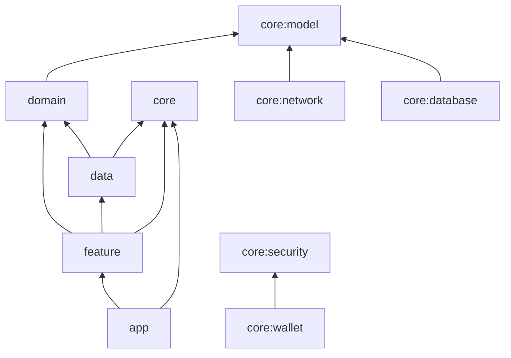
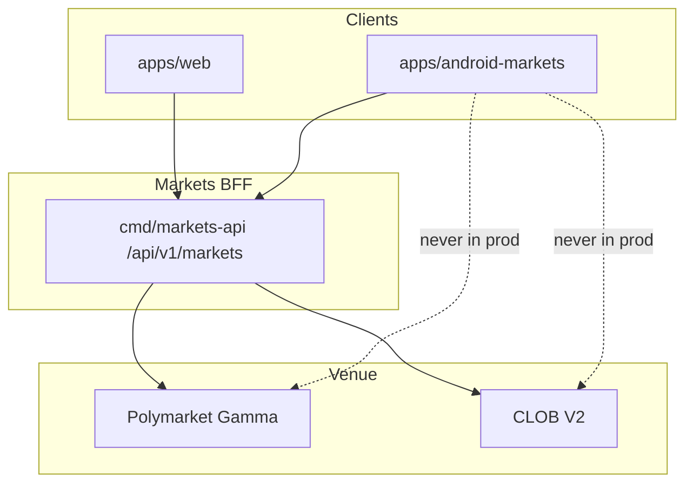

# GRADLE MODULE GRAPH

**Status:** reviewed
**Owner:** platform-orchestrator
**Last updated:** 2026-08-09 (MKT-P1-007 inventory + gap map)
**Product:** RetroPick Markets V1
**Wave:** 5 — Android Compose Markets

## Description

This document defines the acyclic Gradle module graph for RetroPick Markets V1 Android (Kotlin + Compose): convention plugins, version catalog, OpenAPI codegen wiring, build variants, lint and static analysis, PRISM exclusion enforcement, and test module layout.

It sits at the start of PHASE-5A greenfield work. Target root is `apps/android-markets/` with `build-logic/`, `gradle/libs.versions.toml`, and debug/staging/release variants. The DAG keeps app → feature → domain/data → api/core downward-only so wallet and security dependencies stay explicit and CI can compile Markets without `contracts/prism`.

Read this on first greenfield task and whenever a new `:feature:*` or `:data:*` module is proposed. Prefer ANDROID_PRODUCT_SCOPE before inventing modules for later.

It excludes feature→feature implementation cycles, implementation(project(":app")) from libraries, committed keystores, copy-pasted plugin blocks instead of conventions, and enabling PRISM modules just in case.

## 0. Developer intent (5W+1H)

Short orientation for implementers and agents. Read this before the normative sections below.

| Lens | Answer |
|------|--------|
| **Who** | Android platform engineers creating `apps/android-markets/`; build-logic authors; CI agents adding Gradle jobs; anyone adding a module dependency. |
| **What** | Acyclic Gradle module graph, convention plugins, version catalog, OpenAPI codegen wiring, build variants, lint/static analysis, PRISM exclusion enforcement, and test module layout. |
| **When** | First greenfield task (PHASE-5A) and any time a new `:feature:*` or `:data:*` module is proposed. Before CI can claim Android build green. |
| **Where** | Spec: this file. Root: `apps/android-markets/settings.gradle.kts` (target). Build logic: `build-logic/`. Versions: `gradle/libs.versions.toml`. Codegen output module as specified herein. Play variants: debug/staging/release. |
| **Why** | A spaghetti app module blocks independent testing and invites PRISM/legacy imports. Acyclic feature layers keep wallet/security dependencies explicit. CI must compile Markets Android without pulling `contracts/prism`. |
| **How** | Define app → feature → domain/data → core layers with only downward deps. Generate API client into an `:api` (or equivalent) module consumed by data. Convention plugins standardize Compose, Kotlin, lint. Fail CI if forbidden project deps appear. |

### Worked example

**Happy path — new read feature.** Add `:feature:discovery` depending on `:domain:markets` + Compose BOM via conventions. Data layer implements repository using `:api` generated types. App module navigates to discovery. Unit tests run on JVM without emulator. CI `./gradlew :feature:discovery:test` passes.

**Happy path — OpenAPI regen.** Version catalog pins generator; CI detects drift; regenerate commits update `:api` only; features compile against new types.

**Failure / degraded.** Feature module depends on another feature’s internals → break cycle via navigation API or domain interfaces. Someone adds PRISM project dependency → exclusion lint fails. Fat `app` module with all source → reject; migrate to graph. Release signing config in plaintext repo → use Play/CI secrets patterns (see Play doc)—never commit keystores.

### Module change checklist

- [ ] New module declared in settings + dependency table updated in this doc.
- [ ] Dependency direction respects DAG.
- [ ] Convention plugin applied (no copy-paste Gradle blocks).
- [ ] Tests live in matching source sets.
- [ ] No direct Polymarket SDK in UI modules for production paths.
- [ ] Web unaffected—Android-only Gradle change.

### Relation to product scope

If a module has no home in ANDROID_PRODUCT_SCOPE inventory, do not create it “for later.” Prefer package-within-existing-feature until V1.1 scope opens.

### Suggested DAG (conceptual)

```text
:app → :feature:* → :domain → :data → :api
                 ↘ :core:ui
:wallet → used by trading features only via interfaces
```

### Convention plugin duties

- Kotlin/Compose versions from catalog
- Lint + detekt baselines
- Test logging defaults
- Packaging options for release

### Agent anti-patterns

- `implementation(project(":app"))` from a library
- Copy-pasting plugin blocks instead of conventions
- Checking in generator output with machine-local paths
- Enabling PRISM modules “just in case”

### Success signal

`./gradlew assembleStaging` (or documented variant) compiles features independently and CI dependency-guard fails on cycles/forbidden deps.

## 1. Purpose

Define acyclic Gradle module graph: app, core/*, data/*, domain, feature/* with convention plugins.

## 2. Scope

### In scope

- RetroPick Markets V1 native Android client (Kotlin, Jetpack Compose, Material 3).
- Consumption of shared Markets BFF at `/api/v1/markets/*` per ADR-004.
- Feature parity targets defined in [.dev/ANDROID_MARKETS.md](../../ANDROID_MARKETS.md).
- Gradle modularization under `apps/android-markets/` (greenfield Compose product; `apps/android/` is Capacitor prototype — see §5).

### Out of scope

- PRISM protocol, `contracts/prism/`, PRISM market creation, or PRISM settlement flows.
- Direct production calls to Polymarket Gamma/CLOB from the Android client (ADR-002).
- Custom RetroPick exchange or outcome-token issuance (ADR-001).
- Background autonomous trading or Android-specific order semantics.

## 3. Prerequisites

- [.dev/ANDROID_MARKETS.md](../../ANDROID_MARKETS.md) — product and architecture baseline.
- [00_DOCUMENT_MAP.md](../00_DOCUMENT_MAP.md)
- [phases/PHASE-5-ANDROID-COMPOSE-MARKETS.md](../phases/PHASE-5-ANDROID-COMPOSE-MARKETS.md)
- [architecture/adr/ADR-004-SHARED-WEB-ANDROID-API.md](../architecture/adr/ADR-004-SHARED-WEB-ANDROID-API.md)
- [architecture/adr/ADR-006-ANDROID-JETPACK-COMPOSE.md](../architecture/adr/ADR-006-ANDROID-JETPACK-COMPOSE.md)
- [schemas/openapi/markets-v1.yaml](../../../schemas/openapi/markets-v1.yaml)
- [apps/android/README.md](../../../apps/android/README.md) — Capacitor prototype inventory, OpenAPI gap map, ADR conflict (MKT-P1-007).

## 4. Authoritative sources

| Source | URL / path | Retrieved | Confidence |
|--------|------------|-----------|------------|
| Android Markets product spec | `.dev/ANDROID_MARKETS.md` | 2026-07-25 | verified |
| Polymarket docs | https://docs.polymarket.com/ | 2026-07-25 | partially verified |
| CLOB V2 migration | https://docs.polymarket.com/v2-migration | 2026-07-25 | partially verified |
| Android app architecture | https://developer.android.com/topic/architecture | 2026-07-25 | verified |
| Compose architecture | https://developer.android.com/develop/ui/compose/architecture | 2026-07-25 | verified |
| Modularization guide | https://developer.android.com/topic/modularization | 2026-07-25 | verified |
| OpenAPI (repo) | `schemas/openapi/markets-v1.yaml` | 2026-07-25 | verified |
| Realtime schema | `schemas/events/markets-realtime-v1.json` | 2026-07-25 | verified |
| Play financial features | https://support.google.com/googleplay/android-developer/answer/13849271 | 2026-07-25 | partially verified |

## 5. Current state

**Markets V1 Compose Android is not shipped.** As of MKT-P1-007 (2026-08-09), disk state:

| Path | What exists | Role |
|------|-------------|------|
| `apps/android/` | Capacitor 8 + Next.js 16 static export; full Markets UI (screens, trade sheet, modals) | **Prototype / UX reference only** — not ADR-006 product |
| `apps/android/android/` | Capacitor `BridgeActivity` shell (`com.retropick.app`) | WebView wrapper; not Compose product UI |
| `apps/android-markets/` | **Not created** | PHASE-5 target per ADR-006 and §6 below |

Screen inventory, OpenAPI v1.1.1 gap table, and architecture conflicts:
[apps/android/README.md](../../../apps/android/README.md).

**Data boundary conflict:** the prototype calls Polymarket Gamma directly via
`apps/android/lib/polymarket-service.ts` (through a CORS proxy). Production V1 must use
`/api/v1/markets/*` only (D-AND-004, ADR-004). No OpenAPI-generated Kotlin client exists yet.

Implementation of the Compose product is scheduled for PHASE-5 per
[implementation-manifest.yaml](../../../.harness/products/markets-v1/planning/implementation-manifest.yaml).
CI will add an Android job once `apps/android-markets/settings.gradle.kts` lands.

### Prototype vs product boundary

- **Prototype (`apps/android/`):** internal demo, design parity checklist, Capacitor WebView.
  Must not ship to Play as Markets V1 without an ADR-006 amendment (Option B — not recommended).
- **Product (`apps/android-markets/`):** Kotlin + Jetpack Compose, OpenAPI codegen, BFF-only
  networking, UDF ViewModels — per ADR-006.

**Human decision pending (D-AND-008):** retain prototype as reference and build Compose in
PHASE-5 (Option A, recommended) vs amend ADR-006 for Capacitor (Option B). See
[apps/android/README.md § Decision gate](../../../apps/android/README.md).

Upstream research note [ANDROID_AND_PLAY_CURRENT_STATE.md](../research/ANDROID_AND_PLAY_CURRENT_STATE.md)
§5.1 still describes README-only greenfield; that section is stale relative to the submodule
contents documented here and in `apps/android/README.md`.

## 6. Target design

### Repository layout

```text
apps/android-markets/
├── app/                    # ApplicationId, manifest, DI root
├── build-logic/            # Convention plugins (android-app, android-feature, ...)
├── core/
│   ├── common/             # Result types, dispatchers, extensions
│   ├── model/              # Domain models (hand-written)
│   ├── designsystem/       # Compose theme, components
│   ├── navigation/         # NavHost, routes, deep link parsers
│   ├── network/            # Retrofit, OkHttp, auth interceptors
│   ├── database/           # Room database, DAOs, migrations
│   ├── security/           # Keystore, biometrics, NSC helpers
│   ├── wallet/             # WalletCoordinator abstraction
│   ├── realtime/           # WebSocket client, sequence handling
│   ├── analytics/          # Event allowlist wrapper
│   └── testing/            # Fakes, fixtures, test rules
├── data/
│   ├── catalog/            # Events, markets, watchlist repos
│   ├── trading/            # Orders, preview, book repos
│   ├── portfolio/          # Positions, fills, redemption repos
│   ├── identity/           # Session, eligibility, prefs repos
│   └── notifications/      # FCM token, inbox sync repos
├── feature/
│   ├── eligibility/
│   ├── discovery/
│   ├── marketdetail/
│   ├── orderticket/
│   ├── orders/
│   ├── portfolio/
│   ├── redemption/
│   ├── watchlist/
│   └── settings/
└── benchmark/              # Macrobenchmark + baseline profile
```

`apps/android/` remains the Capacitor prototype (documented in its README); V1 Compose product
work lands in `apps/android-markets/`.

### Dependency graph (acyclic)



**Rule:** `feature/*` must not depend on other `feature/*` modules. Shared UI goes to
`:core:designsystem`. Cross-feature navigation uses route strings in `:core:navigation`.

### Module dependency table

| Module | May depend on | Must not depend on |
|--------|---------------|-------------------|
| `:app` | all feature, core | — |
| `:feature:*` | domain, data, core | other features, app |
| `:data:*` | domain, core | feature |
| `:domain` | core:model, core:common | data, feature, Android UI |
| `:core:*` | sibling core only | feature, data |
| `:benchmark` | app (test target) | — |

### Convention plugins (`build-logic`)

| Plugin ID | Applies to | Configures |
|-----------|------------|------------|
| `retropick.android.application` | app | SDK, signing, ProGuard |
| `retropick.android.feature` | feature/* | Compose, Hilt, lint |
| `retropick.android.library` | core, data | Android library defaults |
| `retropick.android.domain` | domain | JVM library, no Android |
| `retropick.kotlin.openapi` | core:network | OpenAPI codegen task |

### Version catalog (`gradle/libs.versions.toml`)

Pin: Kotlin, Compose BOM, Hilt, Room, Retrofit, OkHttp, Coroutines, Navigation,
Firebase BOM, WalletConnect (when selected), Macrobenchmark.

### OpenAPI codegen module wiring

```kotlin
// build-logic: OpenApiPlugin
openApiGenerate {
    inputSpec.set(rootProject.file("../../schemas/openapi/markets-v1.yaml"))
    packageName.set("com.retropick.markets.network.generated")
}
```

Generated sources live in `core/network/build/generated/`; never hand-edit.

### Build variants

| Variant | applicationId suffix | API base | Minify |
|---------|---------------------|----------|--------|
| devDebug | `.dev` | localhost / dev | off |
| stagingRelease | `.staging` | staging API | on |
| prodRelease | (none) | production | on |

### CI integration

Monorepo root CI job `android-markets`:

1. `./gradlew :app:assembleStagingRelease`
2. `./gradlew :core:testing:contractTest`
3. `./gradlew :benchmark:connectedBenchmark` (nightly)

Gradle cache keyed by `libs.versions.toml` hash.

### Lint and static analysis

- Android Lint: `NewApi`, `MissingTranslation`, `AutoboxingStateCreation`.
- Detekt for Kotlin style in domain/data.
- Dependency Analysis Plugin fails on unused dependencies.

### PRISM exclusion enforcement

```kotlin
// build-logic: PrismBanPlugin
tasks.register("verifyNoPrismDeps") {
    doLast {
        // fail if any module references packages.prism or prism schemas
    }
}
```

### Testing module graph

| Test type | Location |
|-----------|----------|
| Unit (domain) | `:domain/src/test` |
| Unit (data) | `:data:*/src/test` with fakes |
| Robolectric | `:feature:*/src/test` |
| Compose UI | `:feature:*/src/androidTest` |
| Contract | `:core:testing` |
| E2E | `:app/src/androidTest` staging |

### Migration from greenfield

1. Create `settings.gradle.kts` including all modules.
2. Bootstrap `build-logic` convention plugins.
3. Land `core:model` + OpenAPI codegen first.
4. Add features incrementally per PHASE-5 sub-phases.

See [.dev/ANDROID_MARKETS.md](../../ANDROID_MARKETS.md) §4 for authoritative tree.

## 7. Alternatives considered

| Alternative | Rejected because |
|-------------|------------------|
| Flutter cross-platform | ADR-006 locks Jetpack Compose for first-party Android quality, Keystore integration, and Play policy alignment |
| React Native WebView shell | Violates native UX, accessibility, and wallet SDK integration requirements |
| Direct Gamma/CLOB from Android | ADR-002: BFF anti-corruption layer owns fee, eligibility, and schema compatibility |
| Monolithic single-module app | Blocks parallel feature development and inflates build/test cycles |
| PRISM combined mobile client | Increases policy, signing, and release risk; PRISM remains web-first |
| Embedded unrestricted WebView dApp | Tapjacking, injection, and wallet confusion risks |
| Raw private-key import | Custody and regulatory risk; wallet remains external authority |

## 8. Decisions

| ID | Decision | Rationale |
|----|----------|-----------|
| D-AND-001 | Markets-only Android scope | See [.dev/ANDROID_MARKETS.md](../../ANDROID_MARKETS.md) §1 |
| D-AND-002 | Shared OpenAPI with web | ADR-004; contract tests block breaking changes |
| D-AND-003 | Jetpack Compose + UDF | ADR-006; immutable UiState, event intents, StateFlow |
| D-AND-004 | BFF-only network boundary | ADR-002; no upstream Polymarket calls in production |
| D-AND-005 | Server-authoritative orders | Preview hash from backend; client verifies before sign |
| D-AND-006 | `apps/android-markets/` module root | Compose product separate from Capacitor prototype in `apps/android/` |
| D-AND-007 | No PRISM dependencies | Zero imports from `packages/prism` or PRISM schemas |
| D-AND-008 | Capacitor prototype vs Compose product *(pending human approval)* | Option A (recommended): keep `apps/android/` as UX reference; ship V1 from `apps/android-markets/`. Option B: amend ADR-006 for Capacitor — requires formal ADR change |

## 9. Data and control flows



## 10. Failure and recovery

| Scenario | Client behavior | Recovery |
|----------|-----------------|----------|
| Eligibility unknown | Fail closed; block trading surfaces | Retry eligibility; show support link |
| BFF 5xx on catalog | Show cached snapshot with stale label | Exponential backoff refresh |
| BFF 5xx on order preview | Block sign; no offline preview | User retries; incident banner if widespread |
| Submit timeout | State `ReconcilingUnknown`; no auto-resubmit | Poll by preview hash / order ID |
| WebSocket gap | Detect sequence gap; snapshot refresh | Atomic Room replace per ADR-005 |
| Wallet reject/timeout | Return to ReadyToSign with reason | User may change wallet or retry |
| Rooted device | Risk signal + warning; no false guarantees | User acknowledgment where required |
| Play policy block | Hide order entry per region flag | Server capability + eligibility gate |

## 11. Security

- No raw private-key custody, generation, import, or backup by RetroPick.
- Preview-before-sign: client verifies EIP-712 fields match human-readable preview.
- Android Keystore for app session secrets and encrypted DataStore master keys.
- Biometrics gate app session actions; wallet remains transaction authority.
- Network Security Configuration: TLS only, no cleartext, certificate policy reviewed.
- Sensitive screens: overlay protection, selective FLAG_SECURE, no seed clipboard.
- Deep links allowlisted; never auto-sign from link payload.
- Analytics allowlist with field redaction; no signatures in crash reports.
- See [WALLET_SIGNING_AND_SECURITY.md](./WALLET_SIGNING_AND_SECURITY.md) and [security/THREAT_MODEL.md](../security/THREAT_MODEL.md).

## 12. Observability

| Signal | Instrumentation | Alert threshold (initial) |
|--------|-----------------|---------------------------|
| Crash-free users | Firebase Crashlytics / Play Vitals | < 99.8% rolling 7d |
| ANR rate | Play Vitals + custom traces | Above Play bad-behavior internal guard |
| Cold start | Macrobenchmark + Play Vitals | Regression > 10% vs baseline |
| Order preview latency | OpenTelemetry Android + BFF trace | p95 > 2s healthy network |
| Sign-to-accepted | Custom funnel event | Drop > 15% vs prior release |
| Realtime gap recovery | `markets_android_ws_gap_total` | Sustained gap rate spike |
| Cache staleness age | Room metadata histogram | p95 staleness > 5m on catalog |

Tracing: W3C `traceparent` propagated on REST; correlate with BFF `request_id`.

## 13. Test strategy

See [ANDROID_TEST_STRATEGY.md](./ANDROID_TEST_STRATEGY.md). Minimum bar per release:

- Unit: money math, mappers, reducers, eligibility UI policy.
- Repository fakes: API errors, WS gaps, Room migrations.
- Contract: golden fixtures shared with Go and TypeScript.
- Compose: screenshot + accessibility checks on order ticket and market detail.
- Staging E2E: preview → sign → submit → reconcile happy path.
- Macrobenchmark: cold start, feed scroll, market detail from cache.

## 14. Rollout and rollback

| Track | Audience | Gate |
|-------|----------|------|
| `devDebug` | Engineers | Local/dev BFF; fixture wallets |
| `stagingRelease` | Internal QA | Staging BFF; full E2E matrix |
| `internal` Play | Closed testers | Crash/ANR budget; security review |
| `production` staged | % rollout | Order-error rate, support tickets, Play Vitals |

Kill switches: `/markets/capabilities` disables order submission per region/version.
Rollback: halt rollout, ship hotfix, or remote-disable trading without catalog regression.

## 15. Web vs Android parity

Parity is defined relative to Markets web (`apps/web`). Android may defer non-critical
surfaces but must not invent divergent trading semantics.

| Capability | Web (V1) | Android (V1) | Parity notes |
|------------|----------|--------------|--------------|
| Eligibility gate | Yes | Yes | Same `/markets/eligibility` contract |
| Capabilities flags | Yes | Yes | Order kill switch respected on both |
| Event discovery | Yes | Yes | Android adds offline cache labels |
| Market detail + rules | Yes | Yes | Adaptive layouts on tablet/foldable |
| Order book + history | Yes | Yes | Realtime via shared WS schema |
| Limit / marketable-limit orders | Yes | Yes | Identical preview hash flow |
| Wallet connect + sign | Yes | Yes | Mobile uses wallet SDK / WC deep links |
| Open orders + history | Yes | Yes | Android stale guards on order actions |
| Positions + PnL | Yes | Yes | Pull-to-refresh + WS deltas |
| Watchlist | Yes | Yes | Sync via authenticated API |
| Price alerts | Yes | Yes | Push on Android vs web inbox |
| Deep links | HTTPS app links | `retropick://` + HTTPS | See NAVIGATION doc |
| CTF split/merge/redeem | Web V1.1+ | Android V1.1+ | Deferred together |
| Intelligence signals | Web Phase 3 | Read-only V1 optional | May ship post-core trading |
| PRISM | No | No | Explicit non-goal |
| Build tool | pnpm/Turbo | Gradle/Kotlin | Independent per ADR-006 |

### Parity principles

- Server authority — eligibility, fees, capabilities, and order payloads originate from BFF.
- Contract symmetry — OpenAPI and realtime schemas are version-locked across clients.
- UX adaptation — mobile optimizes for short sessions, push, and biometric session gates.
- Explicit deferrals — V1.1+ items documented; no silent web-only trading features.
- No PRISM — neither client exposes PRISM in this generation.

## 16. Open questions

| ID | Question | Expiry | Owner |
|----|----------|--------|-------|
| OQ-AND-01 | Minimum `minSdk` and target device profile | Before Gradle bootstrap | mobile-lead |
| OQ-AND-02 | Wallet vendors for V1 (WalletConnect, Coinbase, etc.) | Before wallet module | mobile-lead |
| OQ-AND-03 | Room encryption requirement given data inventory | Before database schema freeze | security |
| OQ-AND-04 | Supported Play countries and age rating | Before closed track | legal |
| OQ-AND-05 | FCM vs hybrid push for alert delivery | Before notifications module | platform |
| OQ-AND-06 | CTF split/merge in V1 vs V1.1 | Before redemption feature | product |

Full list: [research/OPEN_QUESTIONS_AND_EXPIRING_ASSUMPTIONS.md](../research/OPEN_QUESTIONS_AND_EXPIRING_ASSUMPTIONS.md).

## 17. Acceptance criteria

- Module graph is acyclic; feature→feature deps forbidden.
- OpenAPI codegen wired to core:network.
- PRISM ban task in CI.
- Build variants documented.

## 18. Related documents

- [.dev/ANDROID_MARKETS.md](../../ANDROID_MARKETS.md)
- [COMPOSE_APP_ARCHITECTURE.md](./COMPOSE_APP_ARCHITECTURE.md)
- [GRADLE_MODULE_GRAPH.md](./GRADLE_MODULE_GRAPH.md)
- [NAVIGATION_AND_DEEP_LINKS.md](./NAVIGATION_AND_DEEP_LINKS.md)
- [STATE_DATA_OFFLINE_AND_REALTIME.md](./STATE_DATA_OFFLINE_AND_REALTIME.md)
- [WALLET_SIGNING_AND_SECURITY.md](./WALLET_SIGNING_AND_SECURITY.md)
- [NOTIFICATIONS_AND_BACKGROUND_WORK.md](./NOTIFICATIONS_AND_BACKGROUND_WORK.md)
- [ACCESSIBILITY_PERFORMANCE_AND_DEVICES.md](./ACCESSIBILITY_PERFORMANCE_AND_DEVICES.md)
- [PLAY_STORE_COMPLIANCE_AND_RELEASE.md](./PLAY_STORE_COMPLIANCE_AND_RELEASE.md)
- [ANDROID_TEST_STRATEGY.md](./ANDROID_TEST_STRATEGY.md)
- [phases/PHASE-5-ANDROID-COMPOSE-MARKETS.md](../phases/PHASE-5-ANDROID-COMPOSE-MARKETS.md)

---

## Appendix A — Implementation deep dives

### A.1 gradle-modules — Overview

**Overview** for `gradle-modules`.

- Align with [.dev/ANDROID_MARKETS.md](../../ANDROID_MARKETS.md) and PHASE-5 exit gates.
- Never call Polymarket upstream directly from production code paths.
- Log structured diagnostics without wallet secrets or full signed payloads.
- Compose UI exposes loading, empty, error, stale, ineligible, and success states.
- ViewModels expose StateFlow<UiState>; effects use SharedFlow or Channel.
- Repository maps DTO to domain; features never import Retrofit or Room.
- Contract tests pass golden fixtures before merge.
- Touch targets ≥ 48dp; TalkBack labels on all actionable controls.
- Main thread must not perform network or disk I/O.
- Feature flags read from /markets/capabilities on cold start and resume.
- Deep dive 1 for gradle-modules: Overview implementation checklist item 1.
- Deep dive 1 for gradle-modules: Overview implementation checklist item 2.
- Deep dive 1 for gradle-modules: Overview implementation checklist item 3.
- Deep dive 1 for gradle-modules: Overview implementation checklist item 4.
- Deep dive 1 for gradle-modules: Overview implementation checklist item 5.

### A.2 gradle-modules — Module ownership

**Module ownership** for `gradle-modules`.

- Align with [.dev/ANDROID_MARKETS.md](../../ANDROID_MARKETS.md) and PHASE-5 exit gates.
- Never call Polymarket upstream directly from production code paths.
- Log structured diagnostics without wallet secrets or full signed payloads.
- Compose UI exposes loading, empty, error, stale, ineligible, and success states.
- ViewModels expose StateFlow<UiState>; effects use SharedFlow or Channel.
- Repository maps DTO to domain; features never import Retrofit or Room.
- Contract tests pass golden fixtures before merge.
- Touch targets ≥ 48dp; TalkBack labels on all actionable controls.
- Main thread must not perform network or disk I/O.
- Feature flags read from /markets/capabilities on cold start and resume.
- Deep dive 2 for gradle-modules: Module ownership implementation checklist item 1.
- Deep dive 2 for gradle-modules: Module ownership implementation checklist item 2.
- Deep dive 2 for gradle-modules: Module ownership implementation checklist item 3.
- Deep dive 2 for gradle-modules: Module ownership implementation checklist item 4.
- Deep dive 2 for gradle-modules: Module ownership implementation checklist item 5.

### A.3 gradle-modules — API mapping

**API mapping** for `gradle-modules`.

- Align with [.dev/ANDROID_MARKETS.md](../../ANDROID_MARKETS.md) and PHASE-5 exit gates.
- Never call Polymarket upstream directly from production code paths.
- Log structured diagnostics without wallet secrets or full signed payloads.
- Compose UI exposes loading, empty, error, stale, ineligible, and success states.
- ViewModels expose StateFlow<UiState>; effects use SharedFlow or Channel.
- Repository maps DTO to domain; features never import Retrofit or Room.
- Contract tests pass golden fixtures before merge.
- Touch targets ≥ 48dp; TalkBack labels on all actionable controls.
- Main thread must not perform network or disk I/O.
- Feature flags read from /markets/capabilities on cold start and resume.
- Deep dive 3 for gradle-modules: API mapping implementation checklist item 1.
- Deep dive 3 for gradle-modules: API mapping implementation checklist item 2.
- Deep dive 3 for gradle-modules: API mapping implementation checklist item 3.
- Deep dive 3 for gradle-modules: API mapping implementation checklist item 4.
- Deep dive 3 for gradle-modules: API mapping implementation checklist item 5.

### A.4 gradle-modules — State machine

**State machine** for `gradle-modules`.

- Align with [.dev/ANDROID_MARKETS.md](../../ANDROID_MARKETS.md) and PHASE-5 exit gates.
- Never call Polymarket upstream directly from production code paths.
- Log structured diagnostics without wallet secrets or full signed payloads.
- Compose UI exposes loading, empty, error, stale, ineligible, and success states.
- ViewModels expose StateFlow<UiState>; effects use SharedFlow or Channel.
- Repository maps DTO to domain; features never import Retrofit or Room.
- Contract tests pass golden fixtures before merge.
- Touch targets ≥ 48dp; TalkBack labels on all actionable controls.
- Main thread must not perform network or disk I/O.
- Feature flags read from /markets/capabilities on cold start and resume.
- Deep dive 4 for gradle-modules: State machine implementation checklist item 1.
- Deep dive 4 for gradle-modules: State machine implementation checklist item 2.
- Deep dive 4 for gradle-modules: State machine implementation checklist item 3.
- Deep dive 4 for gradle-modules: State machine implementation checklist item 4.
- Deep dive 4 for gradle-modules: State machine implementation checklist item 5.

### A.5 gradle-modules — Caching

**Caching** for `gradle-modules`.

- Align with [.dev/ANDROID_MARKETS.md](../../ANDROID_MARKETS.md) and PHASE-5 exit gates.
- Never call Polymarket upstream directly from production code paths.
- Log structured diagnostics without wallet secrets or full signed payloads.
- Compose UI exposes loading, empty, error, stale, ineligible, and success states.
- ViewModels expose StateFlow<UiState>; effects use SharedFlow or Channel.
- Repository maps DTO to domain; features never import Retrofit or Room.
- Contract tests pass golden fixtures before merge.
- Touch targets ≥ 48dp; TalkBack labels on all actionable controls.
- Main thread must not perform network or disk I/O.
- Feature flags read from /markets/capabilities on cold start and resume.
- Deep dive 5 for gradle-modules: Caching implementation checklist item 1.
- Deep dive 5 for gradle-modules: Caching implementation checklist item 2.
- Deep dive 5 for gradle-modules: Caching implementation checklist item 3.
- Deep dive 5 for gradle-modules: Caching implementation checklist item 4.
- Deep dive 5 for gradle-modules: Caching implementation checklist item 5.

### A.6 gradle-modules — Error UX

**Error UX** for `gradle-modules`.

- Align with [.dev/ANDROID_MARKETS.md](../../ANDROID_MARKETS.md) and PHASE-5 exit gates.
- Never call Polymarket upstream directly from production code paths.
- Log structured diagnostics without wallet secrets or full signed payloads.
- Compose UI exposes loading, empty, error, stale, ineligible, and success states.
- ViewModels expose StateFlow<UiState>; effects use SharedFlow or Channel.
- Repository maps DTO to domain; features never import Retrofit or Room.
- Contract tests pass golden fixtures before merge.
- Touch targets ≥ 48dp; TalkBack labels on all actionable controls.
- Main thread must not perform network or disk I/O.
- Feature flags read from /markets/capabilities on cold start and resume.
- Deep dive 6 for gradle-modules: Error UX implementation checklist item 1.
- Deep dive 6 for gradle-modules: Error UX implementation checklist item 2.
- Deep dive 6 for gradle-modules: Error UX implementation checklist item 3.
- Deep dive 6 for gradle-modules: Error UX implementation checklist item 4.
- Deep dive 6 for gradle-modules: Error UX implementation checklist item 5.

### A.7 gradle-modules — Testing hooks

**Testing hooks** for `gradle-modules`.

- Align with [.dev/ANDROID_MARKETS.md](../../ANDROID_MARKETS.md) and PHASE-5 exit gates.
- Never call Polymarket upstream directly from production code paths.
- Log structured diagnostics without wallet secrets or full signed payloads.
- Compose UI exposes loading, empty, error, stale, ineligible, and success states.
- ViewModels expose StateFlow<UiState>; effects use SharedFlow or Channel.
- Repository maps DTO to domain; features never import Retrofit or Room.
- Contract tests pass golden fixtures before merge.
- Touch targets ≥ 48dp; TalkBack labels on all actionable controls.
- Main thread must not perform network or disk I/O.
- Feature flags read from /markets/capabilities on cold start and resume.
- Deep dive 7 for gradle-modules: Testing hooks implementation checklist item 1.
- Deep dive 7 for gradle-modules: Testing hooks implementation checklist item 2.
- Deep dive 7 for gradle-modules: Testing hooks implementation checklist item 3.
- Deep dive 7 for gradle-modules: Testing hooks implementation checklist item 4.
- Deep dive 7 for gradle-modules: Testing hooks implementation checklist item 5.

### A.8 gradle-modules — Rollout flags

**Rollout flags** for `gradle-modules`.

- Align with [.dev/ANDROID_MARKETS.md](../../ANDROID_MARKETS.md) and PHASE-5 exit gates.
- Never call Polymarket upstream directly from production code paths.
- Log structured diagnostics without wallet secrets or full signed payloads.
- Compose UI exposes loading, empty, error, stale, ineligible, and success states.
- ViewModels expose StateFlow<UiState>; effects use SharedFlow or Channel.
- Repository maps DTO to domain; features never import Retrofit or Room.
- Contract tests pass golden fixtures before merge.
- Touch targets ≥ 48dp; TalkBack labels on all actionable controls.
- Main thread must not perform network or disk I/O.
- Feature flags read from /markets/capabilities on cold start and resume.
- Deep dive 8 for gradle-modules: Rollout flags implementation checklist item 1.
- Deep dive 8 for gradle-modules: Rollout flags implementation checklist item 2.
- Deep dive 8 for gradle-modules: Rollout flags implementation checklist item 3.
- Deep dive 8 for gradle-modules: Rollout flags implementation checklist item 4.
- Deep dive 8 for gradle-modules: Rollout flags implementation checklist item 5.

### A.9 gradle-modules — Performance budget

**Performance budget** for `gradle-modules`.

- Align with [.dev/ANDROID_MARKETS.md](../../ANDROID_MARKETS.md) and PHASE-5 exit gates.
- Never call Polymarket upstream directly from production code paths.
- Log structured diagnostics without wallet secrets or full signed payloads.
- Compose UI exposes loading, empty, error, stale, ineligible, and success states.
- ViewModels expose StateFlow<UiState>; effects use SharedFlow or Channel.
- Repository maps DTO to domain; features never import Retrofit or Room.
- Contract tests pass golden fixtures before merge.
- Touch targets ≥ 48dp; TalkBack labels on all actionable controls.
- Main thread must not perform network or disk I/O.
- Feature flags read from /markets/capabilities on cold start and resume.
- Deep dive 9 for gradle-modules: Performance budget implementation checklist item 1.
- Deep dive 9 for gradle-modules: Performance budget implementation checklist item 2.
- Deep dive 9 for gradle-modules: Performance budget implementation checklist item 3.
- Deep dive 9 for gradle-modules: Performance budget implementation checklist item 4.
- Deep dive 9 for gradle-modules: Performance budget implementation checklist item 5.

### A.10 gradle-modules — Accessibility

**Accessibility** for `gradle-modules`.

- Align with [.dev/ANDROID_MARKETS.md](../../ANDROID_MARKETS.md) and PHASE-5 exit gates.
- Never call Polymarket upstream directly from production code paths.
- Log structured diagnostics without wallet secrets or full signed payloads.
- Compose UI exposes loading, empty, error, stale, ineligible, and success states.
- ViewModels expose StateFlow<UiState>; effects use SharedFlow or Channel.
- Repository maps DTO to domain; features never import Retrofit or Room.
- Contract tests pass golden fixtures before merge.
- Touch targets ≥ 48dp; TalkBack labels on all actionable controls.
- Main thread must not perform network or disk I/O.
- Feature flags read from /markets/capabilities on cold start and resume.
- Deep dive 10 for gradle-modules: Accessibility implementation checklist item 1.
- Deep dive 10 for gradle-modules: Accessibility implementation checklist item 2.
- Deep dive 10 for gradle-modules: Accessibility implementation checklist item 3.
- Deep dive 10 for gradle-modules: Accessibility implementation checklist item 4.
- Deep dive 10 for gradle-modules: Accessibility implementation checklist item 5.

### A.11 gradle-modules — Security controls

**Security controls** for `gradle-modules`.

- Align with [.dev/ANDROID_MARKETS.md](../../ANDROID_MARKETS.md) and PHASE-5 exit gates.
- Never call Polymarket upstream directly from production code paths.
- Log structured diagnostics without wallet secrets or full signed payloads.
- Compose UI exposes loading, empty, error, stale, ineligible, and success states.
- ViewModels expose StateFlow<UiState>; effects use SharedFlow or Channel.
- Repository maps DTO to domain; features never import Retrofit or Room.
- Contract tests pass golden fixtures before merge.
- Touch targets ≥ 48dp; TalkBack labels on all actionable controls.
- Main thread must not perform network or disk I/O.
- Feature flags read from /markets/capabilities on cold start and resume.
- Deep dive 11 for gradle-modules: Security controls implementation checklist item 1.
- Deep dive 11 for gradle-modules: Security controls implementation checklist item 2.
- Deep dive 11 for gradle-modules: Security controls implementation checklist item 3.
- Deep dive 11 for gradle-modules: Security controls implementation checklist item 4.
- Deep dive 11 for gradle-modules: Security controls implementation checklist item 5.

### A.12 gradle-modules — Observability

**Observability** for `gradle-modules`.

- Align with [.dev/ANDROID_MARKETS.md](../../ANDROID_MARKETS.md) and PHASE-5 exit gates.
- Never call Polymarket upstream directly from production code paths.
- Log structured diagnostics without wallet secrets or full signed payloads.
- Compose UI exposes loading, empty, error, stale, ineligible, and success states.
- ViewModels expose StateFlow<UiState>; effects use SharedFlow or Channel.
- Repository maps DTO to domain; features never import Retrofit or Room.
- Contract tests pass golden fixtures before merge.
- Touch targets ≥ 48dp; TalkBack labels on all actionable controls.
- Main thread must not perform network or disk I/O.
- Feature flags read from /markets/capabilities on cold start and resume.
- Deep dive 12 for gradle-modules: Observability implementation checklist item 1.
- Deep dive 12 for gradle-modules: Observability implementation checklist item 2.
- Deep dive 12 for gradle-modules: Observability implementation checklist item 3.
- Deep dive 12 for gradle-modules: Observability implementation checklist item 4.
- Deep dive 12 for gradle-modules: Observability implementation checklist item 5.

### A.13 gradle-modules — Migration notes

**Migration notes** for `gradle-modules`.

- Align with [.dev/ANDROID_MARKETS.md](../../ANDROID_MARKETS.md) and PHASE-5 exit gates.
- Never call Polymarket upstream directly from production code paths.
- Log structured diagnostics without wallet secrets or full signed payloads.
- Compose UI exposes loading, empty, error, stale, ineligible, and success states.
- ViewModels expose StateFlow<UiState>; effects use SharedFlow or Channel.
- Repository maps DTO to domain; features never import Retrofit or Room.
- Contract tests pass golden fixtures before merge.
- Touch targets ≥ 48dp; TalkBack labels on all actionable controls.
- Main thread must not perform network or disk I/O.
- Feature flags read from /markets/capabilities on cold start and resume.
- Deep dive 13 for gradle-modules: Migration notes implementation checklist item 1.
- Deep dive 13 for gradle-modules: Migration notes implementation checklist item 2.
- Deep dive 13 for gradle-modules: Migration notes implementation checklist item 3.
- Deep dive 13 for gradle-modules: Migration notes implementation checklist item 4.
- Deep dive 13 for gradle-modules: Migration notes implementation checklist item 5.

### A.14 gradle-modules — FAQ

**FAQ** for `gradle-modules`.

- Align with [.dev/ANDROID_MARKETS.md](../../ANDROID_MARKETS.md) and PHASE-5 exit gates.
- Never call Polymarket upstream directly from production code paths.
- Log structured diagnostics without wallet secrets or full signed payloads.
- Compose UI exposes loading, empty, error, stale, ineligible, and success states.
- ViewModels expose StateFlow<UiState>; effects use SharedFlow or Channel.
- Repository maps DTO to domain; features never import Retrofit or Room.
- Contract tests pass golden fixtures before merge.
- Touch targets ≥ 48dp; TalkBack labels on all actionable controls.
- Main thread must not perform network or disk I/O.
- Feature flags read from /markets/capabilities on cold start and resume.
- Deep dive 14 for gradle-modules: FAQ implementation checklist item 1.
- Deep dive 14 for gradle-modules: FAQ implementation checklist item 2.
- Deep dive 14 for gradle-modules: FAQ implementation checklist item 3.
- Deep dive 14 for gradle-modules: FAQ implementation checklist item 4.
- Deep dive 14 for gradle-modules: FAQ implementation checklist item 5.

### A.15 gradle-modules — Overview

**Overview** for `gradle-modules`.

- Align with [.dev/ANDROID_MARKETS.md](../../ANDROID_MARKETS.md) and PHASE-5 exit gates.
- Never call Polymarket upstream directly from production code paths.
- Log structured diagnostics without wallet secrets or full signed payloads.
- Compose UI exposes loading, empty, error, stale, ineligible, and success states.
- ViewModels expose StateFlow<UiState>; effects use SharedFlow or Channel.
- Repository maps DTO to domain; features never import Retrofit or Room.
- Contract tests pass golden fixtures before merge.
- Touch targets ≥ 48dp; TalkBack labels on all actionable controls.
- Main thread must not perform network or disk I/O.
- Feature flags read from /markets/capabilities on cold start and resume.
- Deep dive 15 for gradle-modules: Overview implementation checklist item 1.
- Deep dive 15 for gradle-modules: Overview implementation checklist item 2.
- Deep dive 15 for gradle-modules: Overview implementation checklist item 3.
- Deep dive 15 for gradle-modules: Overview implementation checklist item 4.
- Deep dive 15 for gradle-modules: Overview implementation checklist item 5.

### A.16 gradle-modules — Module ownership

**Module ownership** for `gradle-modules`.

- Align with [.dev/ANDROID_MARKETS.md](../../ANDROID_MARKETS.md) and PHASE-5 exit gates.
- Never call Polymarket upstream directly from production code paths.
- Log structured diagnostics without wallet secrets or full signed payloads.
- Compose UI exposes loading, empty, error, stale, ineligible, and success states.
- ViewModels expose StateFlow<UiState>; effects use SharedFlow or Channel.
- Repository maps DTO to domain; features never import Retrofit or Room.
- Contract tests pass golden fixtures before merge.
- Touch targets ≥ 48dp; TalkBack labels on all actionable controls.
- Main thread must not perform network or disk I/O.
- Feature flags read from /markets/capabilities on cold start and resume.
- Deep dive 16 for gradle-modules: Module ownership implementation checklist item 1.
- Deep dive 16 for gradle-modules: Module ownership implementation checklist item 2.
- Deep dive 16 for gradle-modules: Module ownership implementation checklist item 3.
- Deep dive 16 for gradle-modules: Module ownership implementation checklist item 4.
- Deep dive 16 for gradle-modules: Module ownership implementation checklist item 5.
