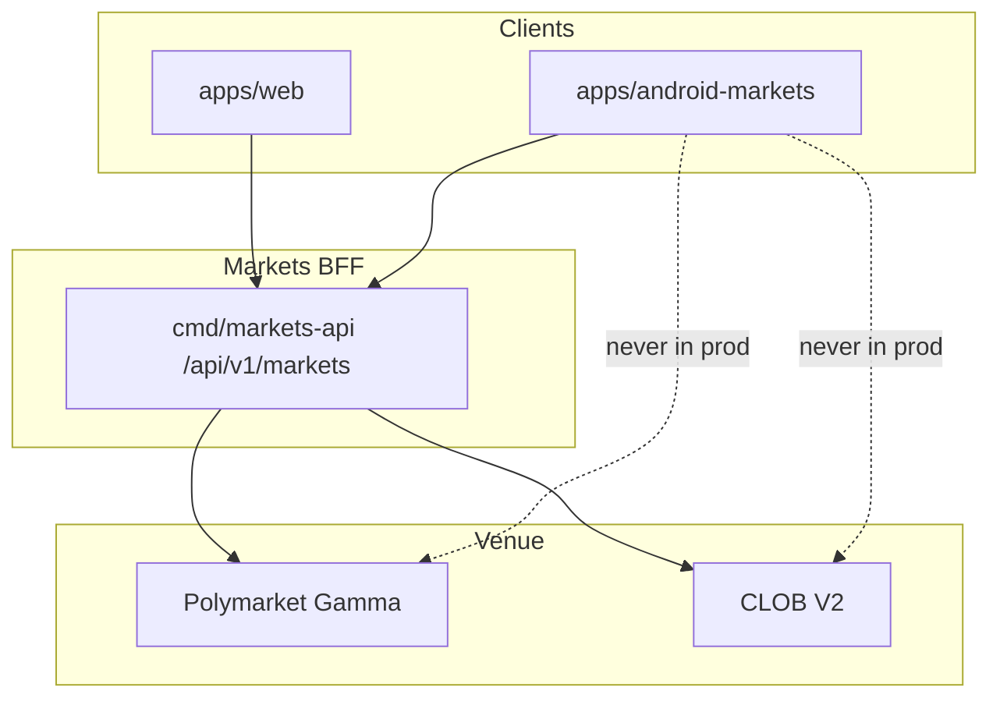

# NAVIGATION AND DEEP LINKS

**Status:** reviewed
**Owner:** platform-orchestrator
**Last updated:** 2026-07-25
**Product:** RetroPick Markets V1
**Wave:** 5 — Android Compose Markets

## Description

This document is the navigation and deep-link authority for RetroPick Markets V1 Android (Compose Navigation): route catalog, bottom nav, deep-link matrix, App Links verification, back stack, adaptive nav, wallet return path, and notification → destination rules with web path parity.

It sits in Wave 5 with the nav host in the app module. Shared URLs mirror web IA—markets, event, market, portfolio, orders, funding—per WEB_PRODUCT_INFORMATION_ARCHITECTURE. Push payloads are untrusted input; eligibility still applies after navigation.

Read this during 5B read experience, whenever alert or share URLs change, before enabling App Links in Play, and when wiring wallet connect activity results. Prefer NOTIFICATIONS_AND_BACKGROUND_WORK for FCM categories and WALLET_SIGNING_AND_SECURITY for post-return sign security.

It excludes open redirects from push url fields, secrets in query params, PRISM routes in the Markets graph, and web-only path renames without Android updates.

## 0. Developer intent (5W+1H)

Short orientation for implementers and agents. Read this before the normative sections below.

| Lens | Answer |
|------|--------|
| **Who** | Android navigation owners; FCM/deep-link implementers; agents aligning App Links with web IA paths; QA of back stack and wallet return. |
| **What** | Compose Navigation route catalog, bottom nav, deep link matrix, App Links verification, deep-link security, back stack, adaptive nav, wallet return path, notification → destination rules, web parity. |
| **When** | During 5B read experience and anytime alert/share URLs change. Before enabling App Links in Play. When adding wallet connect activity results. |
| **Where** | Spec: this file. Nav host in app module; routes mirror web where shared (`markets`, event, market, portfolio, orders, funding). Web map: [WEB_PRODUCT_INFORMATION_ARCHITECTURE.md](../web/WEB_PRODUCT_INFORMATION_ARCHITECTURE.md). |
| **Why** | Broken deep links drop alert conversion. Insecure links can open untrusted destinations. Wallet flows that lose back stack frustrate signing completion. Shared URLs with web are a product promise. |
| **How** | Type-safe routes; auth-aware nav graphs. Verify Digital Asset Links. Validate deep link params (ids) before navigate. On notification tap, route through nav with single clear task affinity policy as specified. Return from wallet to prior ticket/funding screen with state restored. |

### Worked example

**Happy path — alert to market.** FCM payload includes market id → user taps → App Link/`retropick://` resolves → nav to market detail with order ticket affordance if eligible. Bottom nav highlights Discover/Markets appropriately without duplicating entries on back stack.

**Happy path — wallet return.** User on order ticket → Connect wallet external activity → on success, navigate back to ticket with draft inputs restored (savedHandle/state). Chain switch deep path shows blocking UI then resumes.

**Failure / degraded.** Unverified http link → do not auto-open arbitrary URLs from push data; only allowlisted hosts/paths. Unknown market id → in-app not-found, not crash. Logged-out user hits portfolio link → auth gate then continue. Duplicate navigations from rapid notification taps → debounce / single top. Web path renamed without Android update → parity bug; fix both.

### Security rules

1. Never put secrets in deep link query params.
2. Treat push payload as untrusted input.
3. Eligibility still enforced after navigation.
4. No PRISM routes in Markets graph.
5. Copy on destinations uses Markets language (order ticket, positions).

### Parity table (mental model)

| Web | Android |
|-----|---------|
| `/markets/m/{id}` | Market detail route |
| `/markets/portfolio` | Portfolio tab/route |
| `/markets/funding` | Funding route |
| Alert query context | Nav args / saved state |

### Auth-aware navigation

| Destination | If logged out | If ineligible |
|-------------|----------------|---------------|
| Discover/detail | Allow | Allow read; block trade |
| Portfolio/orders | Auth gate + return | Eligibility gate |
| Funding | Auth gate | Eligibility gate |
| Ineligible | — | Destination itself |

### Wallet return

Save draft ticket in `SavedStateHandle` / draft store before leaving; restore on `onResume`/callback. Do not rely on process staying alive.

### Agent anti-patterns

- Open redirects from push `url` fields
- Multiple back-stack copies of the same market
- Hard-coded web-only query parsers that drop Android args
- Combo/multi-leg builder routes outside capabilities gates

### Success signal

Cold start from a verified App Link lands on the correct market with eligibility applied and back stack sensible (exit does not loop the link).

## 1. Purpose

Specify Navigation Compose routes, App Links, deep link security, and adaptive layouts.

## 2. Scope

### In scope

- RetroPick Markets V1 native Android client (Kotlin, Jetpack Compose, Material 3).
- Consumption of shared Markets BFF at `/api/v1/markets/*` per ADR-004.
- Feature parity targets defined in [.dev/ANDROID_MARKETS.md](../../ANDROID_MARKETS.md).
- Gradle modularization under `apps/android-markets/` (greenfield; `apps/android/` is README-only placeholder).

### Out of scope

- PRISM protocol, `contracts/prism/`, PRISM market creation, or PRISM settlement flows.
- Direct production calls to Polymarket Gamma/CLOB from the Android client (ADR-002).
- Legacy epoch MarketEngine APIs at `/api/v1/legacy/markets/*`.
- Custom RetroPick exchange or outcome-token issuance (ADR-001).
- Background autonomous trading or Android-specific order semantics.

## 3. Prerequisites

- [.dev/ANDROID_MARKETS.md](../../ANDROID_MARKETS.md) — product and architecture baseline.
- [00_DOCUMENT_MAP.md](../00_DOCUMENT_MAP.md)
- [phases/PHASE-5-ANDROID-COMPOSE-MARKETS.md](../phases/PHASE-5-ANDROID-COMPOSE-MARKETS.md)
- [architecture/adr/ADR-004-SHARED-WEB-ANDROID-API.md](../architecture/adr/ADR-004-SHARED-WEB-ANDROID-API.md)
- [architecture/adr/ADR-006-ANDROID-JETPACK-COMPOSE.md](../architecture/adr/ADR-006-ANDROID-JETPACK-COMPOSE.md)
- [schemas/openapi/markets-v1.yaml](../../../schemas/openapi/markets-v1.yaml)
- [apps/android/README.md](../../../apps/android/README.md) — current greenfield status.

## 4. Authoritative sources

| Source | URL / path | Retrieved | Confidence |
|--------|------------|-----------|------------|
| Android Markets product spec | `.dev/ANDROID_MARKETS.md` | 2026-07-25 | verified |
| Polymarket docs | https://docs.polymarket.com/ | 2026-07-25 | partially verified |
| CLOB V2 migration | https://docs.polymarket.com/v2-migration | 2026-07-25 | partially verified |
| Android app architecture | https://developer.android.com/topic/architecture | 2026-07-25 | verified |
| Compose architecture | https://developer.android.com/develop/ui/compose/architecture | 2026-07-25 | verified |
| Modularization guide | https://developer.android.com/topic/modularization | 2026-07-25 | verified |
| OpenAPI (repo) | `schemas/openapi/markets-v1.yaml` | 2026-07-25 | verified |
| Realtime schema | `schemas/events/markets-realtime-v1.json` | 2026-07-25 | verified |
| Play financial features | https://support.google.com/googleplay/android-developer/answer/13849271 | 2026-07-25 | partially verified |

## 5. Current state

`apps/android/` contains a README-only greenfield pointer. No Gradle project, modules, or
generated API client exist on disk. Implementation is scheduled for PHASE-5 per
[implementation-manifest.yaml](../../../.harness/products/markets-v1/planning/implementation-manifest.yaml).

The target module tree is documented in [.dev/ANDROID_MARKETS.md](../../ANDROID_MARKETS.md) §4 and
expanded in [GRADLE_MODULE_GRAPH.md](./GRADLE_MODULE_GRAPH.md). CI will add an Android job once
`apps/android-markets/settings.gradle.kts` lands.

## 6. Target design

### Navigation technology

- **Jetpack Navigation Compose** with typed routes (Kotlin serialization or sealed routes).
- Single `NavHost` in `:app` composes feature `*Navigation()` extension functions.
- `NavController` never exposed to feature ViewModels; use route args + use cases.

### Route catalog

| Route | Pattern | Args | Feature module |
|-------|---------|------|----------------|
| Eligibility | `eligibility` | — | eligibility |
| Discovery | `discovery` | optional category | discovery |
| Search | `search?q={query}` | query | discovery |
| Market detail | `market/{marketId}` | marketId | marketdetail |
| Event detail | `event/{eventId}` | eventId | marketdetail |
| Order ticket | `trade/{marketId}?outcome={id}` | marketId, outcome | orderticket |
| Orders | `orders?tab={tab}` | tab | orders |
| Order detail | `order/{orderId}` | orderId | orders |
| Portfolio | `portfolio` | — | portfolio |
| Position | `position/{positionId}` | positionId | portfolio |
| Watchlist | `watchlist` | — | watchlist |
| Settings | `settings` | — | settings |
| Redemption | `redeem/{marketId}` | marketId | redemption |

**Rule:** Nav args carry opaque IDs only — never serialized domain objects or previews.

### Bottom navigation

| Tab | Root route | Badge |
|-----|------------|-------|
| Discover | `discovery` | — |
| Portfolio | `portfolio` | claimable count |
| Orders | `orders` | open order count |
| Watchlist | `watchlist` | — |

Settings accessible from avatar menu, not bottom bar (reduces accidental taps).

### Deep link matrix

| Source | URI example | Resolver behavior |
|--------|-------------|-------------------|
| HTTPS App Link | `https://retropick.com/markets/m/{marketId}` | Verify host; navigate market detail |
| HTTPS order | `https://retropick.com/markets/order/{orderId}` | Auth required; orders detail |
| Custom scheme | `retropick://market/{marketId}` | Fallback if app links fail |
| Push payload | `retropick://portfolio` | Fetch inbox after open |
| Email | HTTPS only | Same as web allowlist |

### App Links verification

`assetlinks.json` on `retropick.com` with release cert SHA-256.
Manifest intent filters:

```xml
<intent-filter android:autoVerify="true">
    <action android:name="android.intent.action.VIEW" />
    <category android:name="android.intent.category.DEFAULT" />
    <category android:name="android.intent.category.BROWSABLE" />
    <data android:scheme="https" android:host="retropick.com"
          android:pathPrefix="/markets/" />
</intent-filter>
```

### Deep link security

| Threat | Control |
|--------|---------|
| Injection of arbitrary paths | Strict route parser allowlist |
| Pre-filled malicious order | Links never carry price/size; open read surfaces only |
| Phishing domain | HTTPS only; custom scheme secondary |
| Cross-user data | Auth gate before order/position routes |

**Deep links never initiate signing.**

### Back stack behavior

| Flow | Back press |
|------|------------|
| Discovery → Market → Trade | Trade → Market → Discovery |
| Push → Order | Order → previous tab root |
| Deep link cold start | Synthetic back stack to Discovery |

`popUpTo` with `saveState` / `restoreState` on bottom tabs.

### Adaptive navigation

| Window size | Pattern |
|-------------|---------|
| Compact | Single pane + bottom bar |
| Medium | List-detail two pane where applicable |
| Expanded | Three column: nav rail + list + detail |

Use `NavigationSuiteScaffold` (Material adaptive).

### Wallet return path

Wallet apps return via deep link or foreground resume:

1. `WalletPending` state persisted in `SavedStateHandle` + `previewHash`.
2. On resume, `AuthorizeAndSubmitOrder` continues — never restart preview silently.
3. WC session uses dedicated `retropick://wallet/callback` route (no UI).

### Notification → navigation

FCM data payload:

```json
{ "type": "fill", "order_id": "ord_abc", "v": 1 }
```

`RetroPickFirebaseMessagingService` emits `DeepLinkRequest` to `MainActivity` NavController.

### Web parity: routing

| Web path | Android route |
|----------|---------------|
| `/markets` | `discovery` |
| `/markets/m/:id` | `market/{marketId}` |
| `/markets/trade/:id` | `trade/{marketId}` |
| `/portfolio` | `portfolio` |
| `/orders` | `orders` |

### Testing navigation

- `createAndroidComposeRule` with `TestNavHostController`.
- Deep link instrumented tests per allowlisted URI.
- Screenshot tests for two-pane medium layout.

## 7. Alternatives considered

| Alternative | Rejected because |
|-------------|------------------|
| Flutter cross-platform | ADR-006 locks Jetpack Compose for first-party Android quality, Keystore integration, and Play policy alignment |
| React Native WebView shell | Violates native UX, accessibility, and wallet SDK integration requirements |
| Direct Gamma/CLOB from Android | ADR-002: BFF anti-corruption layer owns fee, eligibility, and schema compatibility |
| Monolithic single-module app | Blocks parallel feature development and inflates build/test cycles |
| PRISM combined mobile client | Increases policy, signing, and release risk; PRISM remains web-first |
| Embedded unrestricted WebView dApp | Tapjacking, injection, and wallet confusion risks |
| Raw private-key import | Custody and regulatory risk; wallet remains external authority |

## 8. Decisions

| ID | Decision | Rationale |
|----|----------|-----------|
| D-AND-001 | Markets-only Android scope | See [.dev/ANDROID_MARKETS.md](../../ANDROID_MARKETS.md) §1 |
| D-AND-002 | Shared OpenAPI with web | ADR-004; contract tests block breaking changes |
| D-AND-003 | Jetpack Compose + UDF | ADR-006; immutable UiState, event intents, StateFlow |
| D-AND-004 | BFF-only network boundary | ADR-002; no upstream Polymarket calls in production |
| D-AND-005 | Server-authoritative orders | Preview hash from backend; client verifies before sign |
| D-AND-006 | `apps/android-markets/` module root | Keeps README placeholder stable during greenfield bootstrap |
| D-AND-007 | No PRISM dependencies | Zero imports from `packages/prism` or PRISM schemas |

## 9. Data and control flows



## 10. Failure and recovery

| Scenario | Client behavior | Recovery |
|----------|-----------------|----------|
| Eligibility unknown | Fail closed; block trading surfaces | Retry eligibility; show support link |
| BFF 5xx on catalog | Show cached snapshot with stale label | Exponential backoff refresh |
| BFF 5xx on order preview | Block sign; no offline preview | User retries; incident banner if widespread |
| Submit timeout | State `ReconcilingUnknown`; no auto-resubmit | Poll by preview hash / order ID |
| WebSocket gap | Detect sequence gap; snapshot refresh | Atomic Room replace per ADR-005 |
| Wallet reject/timeout | Return to ReadyToSign with reason | User may change wallet or retry |
| Rooted device | Risk signal + warning; no false guarantees | User acknowledgment where required |
| Play policy block | Hide order entry per region flag | Server capability + eligibility gate |

## 11. Security

- No raw private-key custody, generation, import, or backup by RetroPick.
- Preview-before-sign: client verifies EIP-712 fields match human-readable preview.
- Android Keystore for app session secrets and encrypted DataStore master keys.
- Biometrics gate app session actions; wallet remains transaction authority.
- Network Security Configuration: TLS only, no cleartext, certificate policy reviewed.
- Sensitive screens: overlay protection, selective FLAG_SECURE, no seed clipboard.
- Deep links allowlisted; never auto-sign from link payload.
- Analytics allowlist with field redaction; no signatures in crash reports.
- See [WALLET_SIGNING_AND_SECURITY.md](./WALLET_SIGNING_AND_SECURITY.md) and [security/THREAT_MODEL.md](../security/THREAT_MODEL.md).

## 12. Observability

| Signal | Instrumentation | Alert threshold (initial) |
|--------|-----------------|---------------------------|
| Crash-free users | Firebase Crashlytics / Play Vitals | < 99.8% rolling 7d |
| ANR rate | Play Vitals + custom traces | Above Play bad-behavior internal guard |
| Cold start | Macrobenchmark + Play Vitals | Regression > 10% vs baseline |
| Order preview latency | OpenTelemetry Android + BFF trace | p95 > 2s healthy network |
| Sign-to-accepted | Custom funnel event | Drop > 15% vs prior release |
| Realtime gap recovery | `markets_android_ws_gap_total` | Sustained gap rate spike |
| Cache staleness age | Room metadata histogram | p95 staleness > 5m on catalog |

Tracing: W3C `traceparent` propagated on REST; correlate with BFF `request_id`.

## 13. Test strategy

See [ANDROID_TEST_STRATEGY.md](./ANDROID_TEST_STRATEGY.md). Minimum bar per release:

- Unit: money math, mappers, reducers, eligibility UI policy.
- Repository fakes: API errors, WS gaps, Room migrations.
- Contract: golden fixtures shared with Go and TypeScript.
- Compose: screenshot + accessibility checks on order ticket and market detail.
- Staging E2E: preview → sign → submit → reconcile happy path.
- Macrobenchmark: cold start, feed scroll, market detail from cache.

## 14. Rollout and rollback

| Track | Audience | Gate |
|-------|----------|------|
| `devDebug` | Engineers | Local/dev BFF; fixture wallets |
| `stagingRelease` | Internal QA | Staging BFF; full E2E matrix |
| `internal` Play | Closed testers | Crash/ANR budget; security review |
| `production` staged | % rollout | Order-error rate, support tickets, Play Vitals |

Kill switches: `/markets/capabilities` disables order submission per region/version.
Rollback: halt rollout, ship hotfix, or remote-disable trading without catalog regression.

## 15. Web vs Android parity

Parity is defined relative to Markets web (`apps/web`). Android may defer non-critical
surfaces but must not invent divergent trading semantics.

| Capability | Web (V1) | Android (V1) | Parity notes |
|------------|----------|--------------|--------------|
| Eligibility gate | Yes | Yes | Same `/markets/eligibility` contract |
| Capabilities flags | Yes | Yes | Order kill switch respected on both |
| Event discovery | Yes | Yes | Android adds offline cache labels |
| Market detail + rules | Yes | Yes | Adaptive layouts on tablet/foldable |
| Order book + history | Yes | Yes | Realtime via shared WS schema |
| Limit / marketable-limit orders | Yes | Yes | Identical preview hash flow |
| Wallet connect + sign | Yes | Yes | Mobile uses wallet SDK / WC deep links |
| Open orders + history | Yes | Yes | Android stale guards on order actions |
| Positions + PnL | Yes | Yes | Pull-to-refresh + WS deltas |
| Watchlist | Yes | Yes | Sync via authenticated API |
| Price alerts | Yes | Yes | Push on Android vs web inbox |
| Deep links | HTTPS app links | `retropick://` + HTTPS | See NAVIGATION doc |
| CTF split/merge/redeem | Web V1.1+ | Android V1.1+ | Deferred together |
| Intelligence signals | Web Phase 3 | Read-only V1 optional | May ship post-core trading |
| PRISM | No | No | Explicit non-goal |
| Router | Next.js app router | Navigation Compose | Platform-idiomatic |

### Parity principles

- Server authority — eligibility, fees, capabilities, and order payloads originate from BFF.
- Contract symmetry — OpenAPI and realtime schemas are version-locked across clients.
- UX adaptation — mobile optimizes for short sessions, push, and biometric session gates.
- Explicit deferrals — V1.1+ items documented; no silent web-only trading features.
- No PRISM — neither client exposes PRISM in this generation.

## 16. Open questions

| ID | Question | Expiry | Owner |
|----|----------|--------|-------|
| OQ-AND-01 | Minimum `minSdk` and target device profile | Before Gradle bootstrap | mobile-lead |
| OQ-AND-02 | Wallet vendors for V1 (WalletConnect, Coinbase, etc.) | Before wallet module | mobile-lead |
| OQ-AND-03 | Room encryption requirement given data inventory | Before database schema freeze | security |
| OQ-AND-04 | Supported Play countries and age rating | Before closed track | legal |
| OQ-AND-05 | FCM vs hybrid push for alert delivery | Before notifications module | platform |
| OQ-AND-06 | CTF split/merge in V1 vs V1.1 | Before redemption feature | product |

Full list: [research/OPEN_QUESTIONS_AND_EXPIRING_ASSUMPTIONS.md](../research/OPEN_QUESTIONS_AND_EXPIRING_ASSUMPTIONS.md).

## 17. Acceptance criteria

- Route catalog uses IDs only in NavArgs.
- Deep links never auto-sign.
- App Links verification documented.
- Web path parity table complete.

## 18. Related documents

- [.dev/ANDROID_MARKETS.md](../../ANDROID_MARKETS.md)
- [COMPOSE_APP_ARCHITECTURE.md](./COMPOSE_APP_ARCHITECTURE.md)
- [GRADLE_MODULE_GRAPH.md](./GRADLE_MODULE_GRAPH.md)
- [NAVIGATION_AND_DEEP_LINKS.md](./NAVIGATION_AND_DEEP_LINKS.md)
- [STATE_DATA_OFFLINE_AND_REALTIME.md](./STATE_DATA_OFFLINE_AND_REALTIME.md)
- [WALLET_SIGNING_AND_SECURITY.md](./WALLET_SIGNING_AND_SECURITY.md)
- [NOTIFICATIONS_AND_BACKGROUND_WORK.md](./NOTIFICATIONS_AND_BACKGROUND_WORK.md)
- [ACCESSIBILITY_PERFORMANCE_AND_DEVICES.md](./ACCESSIBILITY_PERFORMANCE_AND_DEVICES.md)
- [PLAY_STORE_COMPLIANCE_AND_RELEASE.md](./PLAY_STORE_COMPLIANCE_AND_RELEASE.md)
- [ANDROID_TEST_STRATEGY.md](./ANDROID_TEST_STRATEGY.md)
- [phases/PHASE-5-ANDROID-COMPOSE-MARKETS.md](../phases/PHASE-5-ANDROID-COMPOSE-MARKETS.md)

---

## Appendix A — Implementation deep dives

### A.1 navigation — Overview

**Overview** for `navigation`.

- Align with [.dev/ANDROID_MARKETS.md](../../ANDROID_MARKETS.md) and PHASE-5 exit gates.
- Never call Polymarket upstream directly from production code paths.
- Log structured diagnostics without wallet secrets or full signed payloads.
- Compose UI exposes loading, empty, error, stale, ineligible, and success states.
- ViewModels expose StateFlow<UiState>; effects use SharedFlow or Channel.
- Repository maps DTO to domain; features never import Retrofit or Room.
- Contract tests pass golden fixtures before merge.
- Touch targets ≥ 48dp; TalkBack labels on all actionable controls.
- Main thread must not perform network or disk I/O.
- Feature flags read from /markets/capabilities on cold start and resume.
- Deep dive 1 for navigation: Overview implementation checklist item 1.
- Deep dive 1 for navigation: Overview implementation checklist item 2.
- Deep dive 1 for navigation: Overview implementation checklist item 3.
- Deep dive 1 for navigation: Overview implementation checklist item 4.
- Deep dive 1 for navigation: Overview implementation checklist item 5.

### A.2 navigation — Module ownership

**Module ownership** for `navigation`.

- Align with [.dev/ANDROID_MARKETS.md](../../ANDROID_MARKETS.md) and PHASE-5 exit gates.
- Never call Polymarket upstream directly from production code paths.
- Log structured diagnostics without wallet secrets or full signed payloads.
- Compose UI exposes loading, empty, error, stale, ineligible, and success states.
- ViewModels expose StateFlow<UiState>; effects use SharedFlow or Channel.
- Repository maps DTO to domain; features never import Retrofit or Room.
- Contract tests pass golden fixtures before merge.
- Touch targets ≥ 48dp; TalkBack labels on all actionable controls.
- Main thread must not perform network or disk I/O.
- Feature flags read from /markets/capabilities on cold start and resume.
- Deep dive 2 for navigation: Module ownership implementation checklist item 1.
- Deep dive 2 for navigation: Module ownership implementation checklist item 2.
- Deep dive 2 for navigation: Module ownership implementation checklist item 3.
- Deep dive 2 for navigation: Module ownership implementation checklist item 4.
- Deep dive 2 for navigation: Module ownership implementation checklist item 5.

### A.3 navigation — API mapping

**API mapping** for `navigation`.

- Align with [.dev/ANDROID_MARKETS.md](../../ANDROID_MARKETS.md) and PHASE-5 exit gates.
- Never call Polymarket upstream directly from production code paths.
- Log structured diagnostics without wallet secrets or full signed payloads.
- Compose UI exposes loading, empty, error, stale, ineligible, and success states.
- ViewModels expose StateFlow<UiState>; effects use SharedFlow or Channel.
- Repository maps DTO to domain; features never import Retrofit or Room.
- Contract tests pass golden fixtures before merge.
- Touch targets ≥ 48dp; TalkBack labels on all actionable controls.
- Main thread must not perform network or disk I/O.
- Feature flags read from /markets/capabilities on cold start and resume.
- Deep dive 3 for navigation: API mapping implementation checklist item 1.
- Deep dive 3 for navigation: API mapping implementation checklist item 2.
- Deep dive 3 for navigation: API mapping implementation checklist item 3.
- Deep dive 3 for navigation: API mapping implementation checklist item 4.
- Deep dive 3 for navigation: API mapping implementation checklist item 5.

### A.4 navigation — State machine

**State machine** for `navigation`.

- Align with [.dev/ANDROID_MARKETS.md](../../ANDROID_MARKETS.md) and PHASE-5 exit gates.
- Never call Polymarket upstream directly from production code paths.
- Log structured diagnostics without wallet secrets or full signed payloads.
- Compose UI exposes loading, empty, error, stale, ineligible, and success states.
- ViewModels expose StateFlow<UiState>; effects use SharedFlow or Channel.
- Repository maps DTO to domain; features never import Retrofit or Room.
- Contract tests pass golden fixtures before merge.
- Touch targets ≥ 48dp; TalkBack labels on all actionable controls.
- Main thread must not perform network or disk I/O.
- Feature flags read from /markets/capabilities on cold start and resume.
- Deep dive 4 for navigation: State machine implementation checklist item 1.
- Deep dive 4 for navigation: State machine implementation checklist item 2.
- Deep dive 4 for navigation: State machine implementation checklist item 3.
- Deep dive 4 for navigation: State machine implementation checklist item 4.
- Deep dive 4 for navigation: State machine implementation checklist item 5.

### A.5 navigation — Caching

**Caching** for `navigation`.

- Align with [.dev/ANDROID_MARKETS.md](../../ANDROID_MARKETS.md) and PHASE-5 exit gates.
- Never call Polymarket upstream directly from production code paths.
- Log structured diagnostics without wallet secrets or full signed payloads.
- Compose UI exposes loading, empty, error, stale, ineligible, and success states.
- ViewModels expose StateFlow<UiState>; effects use SharedFlow or Channel.
- Repository maps DTO to domain; features never import Retrofit or Room.
- Contract tests pass golden fixtures before merge.
- Touch targets ≥ 48dp; TalkBack labels on all actionable controls.
- Main thread must not perform network or disk I/O.
- Feature flags read from /markets/capabilities on cold start and resume.
- Deep dive 5 for navigation: Caching implementation checklist item 1.
- Deep dive 5 for navigation: Caching implementation checklist item 2.
- Deep dive 5 for navigation: Caching implementation checklist item 3.
- Deep dive 5 for navigation: Caching implementation checklist item 4.
- Deep dive 5 for navigation: Caching implementation checklist item 5.

### A.6 navigation — Error UX

**Error UX** for `navigation`.

- Align with [.dev/ANDROID_MARKETS.md](../../ANDROID_MARKETS.md) and PHASE-5 exit gates.
- Never call Polymarket upstream directly from production code paths.
- Log structured diagnostics without wallet secrets or full signed payloads.
- Compose UI exposes loading, empty, error, stale, ineligible, and success states.
- ViewModels expose StateFlow<UiState>; effects use SharedFlow or Channel.
- Repository maps DTO to domain; features never import Retrofit or Room.
- Contract tests pass golden fixtures before merge.
- Touch targets ≥ 48dp; TalkBack labels on all actionable controls.
- Main thread must not perform network or disk I/O.
- Feature flags read from /markets/capabilities on cold start and resume.
- Deep dive 6 for navigation: Error UX implementation checklist item 1.
- Deep dive 6 for navigation: Error UX implementation checklist item 2.
- Deep dive 6 for navigation: Error UX implementation checklist item 3.
- Deep dive 6 for navigation: Error UX implementation checklist item 4.
- Deep dive 6 for navigation: Error UX implementation checklist item 5.

### A.7 navigation — Testing hooks

**Testing hooks** for `navigation`.

- Align with [.dev/ANDROID_MARKETS.md](../../ANDROID_MARKETS.md) and PHASE-5 exit gates.
- Never call Polymarket upstream directly from production code paths.
- Log structured diagnostics without wallet secrets or full signed payloads.
- Compose UI exposes loading, empty, error, stale, ineligible, and success states.
- ViewModels expose StateFlow<UiState>; effects use SharedFlow or Channel.
- Repository maps DTO to domain; features never import Retrofit or Room.
- Contract tests pass golden fixtures before merge.
- Touch targets ≥ 48dp; TalkBack labels on all actionable controls.
- Main thread must not perform network or disk I/O.
- Feature flags read from /markets/capabilities on cold start and resume.
- Deep dive 7 for navigation: Testing hooks implementation checklist item 1.
- Deep dive 7 for navigation: Testing hooks implementation checklist item 2.
- Deep dive 7 for navigation: Testing hooks implementation checklist item 3.
- Deep dive 7 for navigation: Testing hooks implementation checklist item 4.
- Deep dive 7 for navigation: Testing hooks implementation checklist item 5.

### A.8 navigation — Rollout flags

**Rollout flags** for `navigation`.

- Align with [.dev/ANDROID_MARKETS.md](../../ANDROID_MARKETS.md) and PHASE-5 exit gates.
- Never call Polymarket upstream directly from production code paths.
- Log structured diagnostics without wallet secrets or full signed payloads.
- Compose UI exposes loading, empty, error, stale, ineligible, and success states.
- ViewModels expose StateFlow<UiState>; effects use SharedFlow or Channel.
- Repository maps DTO to domain; features never import Retrofit or Room.
- Contract tests pass golden fixtures before merge.
- Touch targets ≥ 48dp; TalkBack labels on all actionable controls.
- Main thread must not perform network or disk I/O.
- Feature flags read from /markets/capabilities on cold start and resume.
- Deep dive 8 for navigation: Rollout flags implementation checklist item 1.
- Deep dive 8 for navigation: Rollout flags implementation checklist item 2.
- Deep dive 8 for navigation: Rollout flags implementation checklist item 3.
- Deep dive 8 for navigation: Rollout flags implementation checklist item 4.
- Deep dive 8 for navigation: Rollout flags implementation checklist item 5.

### A.9 navigation — Performance budget

**Performance budget** for `navigation`.

- Align with [.dev/ANDROID_MARKETS.md](../../ANDROID_MARKETS.md) and PHASE-5 exit gates.
- Never call Polymarket upstream directly from production code paths.
- Log structured diagnostics without wallet secrets or full signed payloads.
- Compose UI exposes loading, empty, error, stale, ineligible, and success states.
- ViewModels expose StateFlow<UiState>; effects use SharedFlow or Channel.
- Repository maps DTO to domain; features never import Retrofit or Room.
- Contract tests pass golden fixtures before merge.
- Touch targets ≥ 48dp; TalkBack labels on all actionable controls.
- Main thread must not perform network or disk I/O.
- Feature flags read from /markets/capabilities on cold start and resume.
- Deep dive 9 for navigation: Performance budget implementation checklist item 1.
- Deep dive 9 for navigation: Performance budget implementation checklist item 2.
- Deep dive 9 for navigation: Performance budget implementation checklist item 3.
- Deep dive 9 for navigation: Performance budget implementation checklist item 4.
- Deep dive 9 for navigation: Performance budget implementation checklist item 5.

### A.10 navigation — Accessibility

**Accessibility** for `navigation`.

- Align with [.dev/ANDROID_MARKETS.md](../../ANDROID_MARKETS.md) and PHASE-5 exit gates.
- Never call Polymarket upstream directly from production code paths.
- Log structured diagnostics without wallet secrets or full signed payloads.
- Compose UI exposes loading, empty, error, stale, ineligible, and success states.
- ViewModels expose StateFlow<UiState>; effects use SharedFlow or Channel.
- Repository maps DTO to domain; features never import Retrofit or Room.
- Contract tests pass golden fixtures before merge.
- Touch targets ≥ 48dp; TalkBack labels on all actionable controls.
- Main thread must not perform network or disk I/O.
- Feature flags read from /markets/capabilities on cold start and resume.
- Deep dive 10 for navigation: Accessibility implementation checklist item 1.
- Deep dive 10 for navigation: Accessibility implementation checklist item 2.
- Deep dive 10 for navigation: Accessibility implementation checklist item 3.
- Deep dive 10 for navigation: Accessibility implementation checklist item 4.
- Deep dive 10 for navigation: Accessibility implementation checklist item 5.

### A.11 navigation — Security controls

**Security controls** for `navigation`.

- Align with [.dev/ANDROID_MARKETS.md](../../ANDROID_MARKETS.md) and PHASE-5 exit gates.
- Never call Polymarket upstream directly from production code paths.
- Log structured diagnostics without wallet secrets or full signed payloads.
- Compose UI exposes loading, empty, error, stale, ineligible, and success states.
- ViewModels expose StateFlow<UiState>; effects use SharedFlow or Channel.
- Repository maps DTO to domain; features never import Retrofit or Room.
- Contract tests pass golden fixtures before merge.
- Touch targets ≥ 48dp; TalkBack labels on all actionable controls.
- Main thread must not perform network or disk I/O.
- Feature flags read from /markets/capabilities on cold start and resume.
- Deep dive 11 for navigation: Security controls implementation checklist item 1.
- Deep dive 11 for navigation: Security controls implementation checklist item 2.
- Deep dive 11 for navigation: Security controls implementation checklist item 3.
- Deep dive 11 for navigation: Security controls implementation checklist item 4.
- Deep dive 11 for navigation: Security controls implementation checklist item 5.

### A.12 navigation — Observability

**Observability** for `navigation`.

- Align with [.dev/ANDROID_MARKETS.md](../../ANDROID_MARKETS.md) and PHASE-5 exit gates.
- Never call Polymarket upstream directly from production code paths.
- Log structured diagnostics without wallet secrets or full signed payloads.
- Compose UI exposes loading, empty, error, stale, ineligible, and success states.
- ViewModels expose StateFlow<UiState>; effects use SharedFlow or Channel.
- Repository maps DTO to domain; features never import Retrofit or Room.
- Contract tests pass golden fixtures before merge.
- Touch targets ≥ 48dp; TalkBack labels on all actionable controls.
- Main thread must not perform network or disk I/O.
- Feature flags read from /markets/capabilities on cold start and resume.
- Deep dive 12 for navigation: Observability implementation checklist item 1.
- Deep dive 12 for navigation: Observability implementation checklist item 2.
- Deep dive 12 for navigation: Observability implementation checklist item 3.
- Deep dive 12 for navigation: Observability implementation checklist item 4.
- Deep dive 12 for navigation: Observability implementation checklist item 5.

### A.13 navigation — Migration notes

**Migration notes** for `navigation`.

- Align with [.dev/ANDROID_MARKETS.md](../../ANDROID_MARKETS.md) and PHASE-5 exit gates.
- Never call Polymarket upstream directly from production code paths.
- Log structured diagnostics without wallet secrets or full signed payloads.
- Compose UI exposes loading, empty, error, stale, ineligible, and success states.
- ViewModels expose StateFlow<UiState>; effects use SharedFlow or Channel.
- Repository maps DTO to domain; features never import Retrofit or Room.
- Contract tests pass golden fixtures before merge.
- Touch targets ≥ 48dp; TalkBack labels on all actionable controls.
- Main thread must not perform network or disk I/O.
- Feature flags read from /markets/capabilities on cold start and resume.
- Deep dive 13 for navigation: Migration notes implementation checklist item 1.
- Deep dive 13 for navigation: Migration notes implementation checklist item 2.
- Deep dive 13 for navigation: Migration notes implementation checklist item 3.
- Deep dive 13 for navigation: Migration notes implementation checklist item 4.
- Deep dive 13 for navigation: Migration notes implementation checklist item 5.

### A.14 navigation — FAQ

**FAQ** for `navigation`.

- Align with [.dev/ANDROID_MARKETS.md](../../ANDROID_MARKETS.md) and PHASE-5 exit gates.
- Never call Polymarket upstream directly from production code paths.
- Log structured diagnostics without wallet secrets or full signed payloads.
- Compose UI exposes loading, empty, error, stale, ineligible, and success states.
- ViewModels expose StateFlow<UiState>; effects use SharedFlow or Channel.
- Repository maps DTO to domain; features never import Retrofit or Room.
- Contract tests pass golden fixtures before merge.
- Touch targets ≥ 48dp; TalkBack labels on all actionable controls.
- Main thread must not perform network or disk I/O.
- Feature flags read from /markets/capabilities on cold start and resume.
- Deep dive 14 for navigation: FAQ implementation checklist item 1.
- Deep dive 14 for navigation: FAQ implementation checklist item 2.
- Deep dive 14 for navigation: FAQ implementation checklist item 3.
- Deep dive 14 for navigation: FAQ implementation checklist item 4.
- Deep dive 14 for navigation: FAQ implementation checklist item 5.

### A.15 navigation — Overview

**Overview** for `navigation`.

- Align with [.dev/ANDROID_MARKETS.md](../../ANDROID_MARKETS.md) and PHASE-5 exit gates.
- Never call Polymarket upstream directly from production code paths.
- Log structured diagnostics without wallet secrets or full signed payloads.
- Compose UI exposes loading, empty, error, stale, ineligible, and success states.
- ViewModels expose StateFlow<UiState>; effects use SharedFlow or Channel.
- Repository maps DTO to domain; features never import Retrofit or Room.
- Contract tests pass golden fixtures before merge.
- Touch targets ≥ 48dp; TalkBack labels on all actionable controls.
- Main thread must not perform network or disk I/O.
- Feature flags read from /markets/capabilities on cold start and resume.
- Deep dive 15 for navigation: Overview implementation checklist item 1.
- Deep dive 15 for navigation: Overview implementation checklist item 2.
- Deep dive 15 for navigation: Overview implementation checklist item 3.
- Deep dive 15 for navigation: Overview implementation checklist item 4.
- Deep dive 15 for navigation: Overview implementation checklist item 5.

### A.16 navigation — Module ownership

**Module ownership** for `navigation`.

- Align with [.dev/ANDROID_MARKETS.md](../../ANDROID_MARKETS.md) and PHASE-5 exit gates.
- Never call Polymarket upstream directly from production code paths.
- Log structured diagnostics without wallet secrets or full signed payloads.
- Compose UI exposes loading, empty, error, stale, ineligible, and success states.
- ViewModels expose StateFlow<UiState>; effects use SharedFlow or Channel.
- Repository maps DTO to domain; features never import Retrofit or Room.
- Contract tests pass golden fixtures before merge.
- Touch targets ≥ 48dp; TalkBack labels on all actionable controls.
- Main thread must not perform network or disk I/O.
- Feature flags read from /markets/capabilities on cold start and resume.
- Deep dive 16 for navigation: Module ownership implementation checklist item 1.
- Deep dive 16 for navigation: Module ownership implementation checklist item 2.
- Deep dive 16 for navigation: Module ownership implementation checklist item 3.
- Deep dive 16 for navigation: Module ownership implementation checklist item 4.
- Deep dive 16 for navigation: Module ownership implementation checklist item 5.
