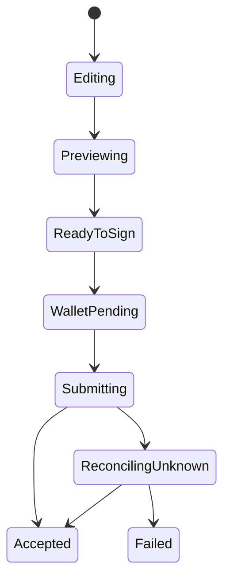
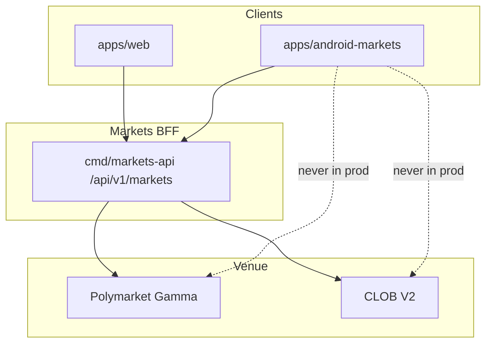

# WALLET SIGNING AND SECURITY

**Status:** reviewed
**Owner:** platform-orchestrator
**Last updated:** 2026-07-25
**Product:** RetroPick Markets V1
**Wave:** 5 — Android Compose Markets

## Description

This document is the Android wallet, signing, and device-security authority for RetroPick Markets V1 (Kotlin + Compose): trust model, WalletCoordinator, Keystore usage, biometric app gates that are not custody replacement, payload verification checklist, signing-path order state machine, FLAG_SECURE, root and debug posture, and web parity.

It sits in PHASE-5C trading. Wallet module stays isolated from UI widgets. External wallets own EIP-712 and order authority (ADR-003); app Keystore may hold session material only. Web twin is WALLET_AND_TRANSACTION_UX. RetroPick never accepts server-side silent signing of user orders.

Read this whenever a new signable payload appears—order, approval, redeem—before enabling biometric shortcuts, and on wallet SDK upgrades. Prefer STATE_DATA_OFFLINE_AND_REALTIME for reconciling after submit and ANDROID_PRODUCT_SCOPE for non-goals.

It excludes mnemonic or import UI, treating biometric success as order authorization, screenshotable seed backup screens, and debug bypass of preview on release paths.

## 0. Developer intent (5W+1H)

Short orientation for implementers and agents. Read this before the normative sections below.

| Lens | Answer |
|------|--------|
| **Who** | Android security-minded engineers; `WalletCoordinator` implementers; agents wiring WalletConnect/external wallets; Play security reviewers. |
| **What** | Trust model, `WalletCoordinator` abstraction, Keystore usage, biometrics for app gates (not custody replacement), payload verification checklist, signing-path order state machine, threat controls, session vs wallet, FLAG_SECURE, root/debug posture, web parity. |
| **When** | PHASE-5C trading and anytime a new signable payload appears (order, approval, redeem). Before enabling biometric shortcuts. On wallet SDK upgrades. |
| **Where** | Spec: this file. Wallet module isolated from UI widgets. Keys: Android Keystore where app holds material (session), external wallet for EIP-712/order authority (ADR-003). Web twin: [WALLET_AND_TRANSACTION_UX.md](../web/WALLET_AND_TRANSACTION_UX.md). |
| **Why** | Silent signing or raw key import is a critical failure. Users must verify domain, amounts, and max loss before approving. Android-specific threats (overlay, screenshots, rooted hooks) need explicit controls. |
| **How** | All sign requests through `WalletCoordinator` after BFF preview. Verify payload fields against preview. Biometric re-auth may gate app session actions—never replace wallet confirmation for orders. Secure window on sensitive screens. Fail closed if verification mismatches. |

### Worked example

**Happy path — EIP-712 order.** Ticket → preview use case → UI checklist (market, side, price, size, fees, max loss, exchange domain) → user confirms → coordinator invokes wallet → signature → submit to BFF → reconciling UI. No private key touches app storage.

**Happy path — biometric app unlock.** User enables biometric to open the app or reveal portfolio; subsequent order still requires wallet prompt. Session cookie/token remains BFF-auth; wallet remains separate authority.

**Failure / degraded.** Payload mismatch vs preview → abort sign, show error. User rejects in wallet → return to ticket. Overlay attack heuristics / insecure display → warn or block per policy. Debug build talking to prod BFF with relaxed TLS → forbidden in release. Server-side signing API → hard reject (ADR-003).

### Verification checklist (agents)

- [ ] Preview id / hash binds to what is signed.
- [ ] Chain id and contract domain correct (standard vs neg-risk).
- [ ] No mnemonic/import UI.
- [ ] Logging redacts signatures and auth tokens.
- [ ] Web and Android show the same critical risk fields pre-sign.

### Threat reminders

Malicious dApp WebView, clipboard seed phishing, and accessibility-abuse patterns are out of scope as product features—they are attacks to resist, not roadmaps to build.

### Trust boundaries

| Boundary | Trusted for |
|----------|-------------|
| External wallet | Signature authority |
| BFF | Preview assembly, session, projections |
| App Keystore | Local session/biometric gates only |
| Push/deep link | Untrusted input |

### Logging redaction

Never log: mnemonics, raw private keys, full auth cookies, complete signatures, full PANs if any fiat partner fields appear later. Prefer addresses truncated + request ids.

### Agent anti-patterns

- Server silent sign
- Screenshotable seed backup screens
- Bypass preview when `BuildConfig.DEBUG`
- Treating biometric success as order authorization

### Success signal

Security review can trace every signable payload from BFF preview → on-screen checklist → wallet prompt with no alternate path.

## 1. Purpose

Specify Keystore, biometrics, wallet coordinator, and EIP-712 payload verification before sign.

## 2. Scope

### In scope

- RetroPick Markets V1 native Android client (Kotlin, Jetpack Compose, Material 3).
- Consumption of shared Markets BFF at `/api/v1/markets/*` per ADR-004.
- Feature parity targets defined in [.dev/ANDROID_MARKETS.md](../../ANDROID_MARKETS.md).
- Gradle modularization under `apps/android-markets/` (greenfield; `apps/android/` is README-only placeholder).

### Out of scope

- PRISM protocol, `contracts/prism/`, PRISM market creation, or PRISM settlement flows.
- Direct production calls to Polymarket Gamma/CLOB from the Android client (ADR-002).
- Custom RetroPick exchange or outcome-token issuance (ADR-001).
- Background autonomous trading or Android-specific order semantics.

## 3. Prerequisites

- [.dev/ANDROID_MARKETS.md](../../ANDROID_MARKETS.md) — product and architecture baseline.
- [00_DOCUMENT_MAP.md](../00_DOCUMENT_MAP.md)
- [phases/PHASE-5-ANDROID-COMPOSE-MARKETS.md](../phases/PHASE-5-ANDROID-COMPOSE-MARKETS.md)
- [architecture/adr/ADR-004-SHARED-WEB-ANDROID-API.md](../architecture/adr/ADR-004-SHARED-WEB-ANDROID-API.md)
- [architecture/adr/ADR-006-ANDROID-JETPACK-COMPOSE.md](../architecture/adr/ADR-006-ANDROID-JETPACK-COMPOSE.md)
- [schemas/openapi/markets-v1.yaml](../../../schemas/openapi/markets-v1.yaml)
- [apps/android/README.md](../../../apps/android/README.md) — current greenfield status.

## 4. Authoritative sources

| Source | URL / path | Retrieved | Confidence |
|--------|------------|-----------|------------|
| Android Markets product spec | `.dev/ANDROID_MARKETS.md` | 2026-07-25 | verified |
| Polymarket docs | https://docs.polymarket.com/ | 2026-07-25 | partially verified |
| CLOB V2 migration | https://docs.polymarket.com/v2-migration | 2026-07-25 | partially verified |
| Android app architecture | https://developer.android.com/topic/architecture | 2026-07-25 | verified |
| Compose architecture | https://developer.android.com/develop/ui/compose/architecture | 2026-07-25 | verified |
| Modularization guide | https://developer.android.com/topic/modularization | 2026-07-25 | verified |
| OpenAPI (repo) | `schemas/openapi/markets-v1.yaml` | 2026-07-25 | verified |
| Realtime schema | `schemas/events/markets-realtime-v1.json` | 2026-07-25 | verified |
| Play financial features | https://support.google.com/googleplay/android-developer/answer/13849271 | 2026-07-25 | partially verified |

## 5. Current state

`apps/android/` contains a README-only greenfield pointer. No Gradle project, modules, or
generated API client exist on disk. Implementation is scheduled for PHASE-5 per
[implementation-manifest.yaml](../../../.harness/products/markets-v1/planning/implementation-manifest.yaml).

The target module tree is documented in [.dev/ANDROID_MARKETS.md](../../ANDROID_MARKETS.md) §4 and
expanded in [GRADLE_MODULE_GRAPH.md](./GRADLE_MODULE_GRAPH.md). CI will add an Android job once
`apps/android-markets/settings.gradle.kts` lands.

## 6. Target design

### Trust model

1. BFF returns EIP-712 typed data + human-readable preview + `previewHash`.
2. App verifies preview fields match UI before wallet prompt.
3. External wallet or approved SDK requests user authorization.
4. App receives signature; verifies recovered signer when feasible.
5. Submit exact payload + signature to BFF; reconcile response.

Wallet remains **transaction authority**; biometrics gate **app session** only.

### WalletCoordinator abstraction

```kotlin
interface WalletCoordinator {
    suspend fun connect(): WalletSession
    suspend fun signTypedData(request: SignRequest): SignatureResult
    suspend fun disconnect()
    val sessionState: StateFlow<WalletSessionState>
}
```

Implementations: WalletConnect v2, Coinbase Wallet SDK, etc. (vendor TBD OQ-AND-02).

### Keystore usage

| Secret | Storage |
|--------|---------|
| App refresh token | Encrypted DataStore + Keystore master key |
| WC session keys | SDK-managed + Keystore where supported |
| Preview hash cache | Memory + Room (non-secret) |
| Private keys | **Never stored by RetroPick** |

Keystore keys use `setUserAuthenticationRequired` for biometric-gated reads where applicable.

### Biometrics

| Action | Biometric required |
|--------|-------------------|
| Open app (optional setting) | User preference |
| View full wallet address | If enabled |
| Confirm sign redirect | Wallet app handles |
| Change notification rules | Yes |
| Export activity | Yes |

Use `BiometricPrompt` with `CryptoObject` when unlocking Keystore-backed data.

### Payload verification checklist

Before `signTypedData`:

- [ ] `chainId` matches expected Polygon mainnet (or staging)
- [ ] `verifyingContract` matches BFF-supplied allowlist
- [ ] `maker` / `signer` matches connected wallet address
- [ ] `tokenId`, `side`, `size`, `price` match preview UI
- [ ] `feeRateBps` matches capabilities version
- [ ] `expiration` not past wall clock
- [ ] `previewHash` equals latest successful preview response

Mismatch → block sign, log security event (no PII).

### Order state machine (signing path)



Changing amount/price/outcome/fee/wallet invalidates preview.

### Threat controls

| Threat | Control |
|--------|---------|
| MITM | TLS + NSC; pin review for prod |
| Overlay / tapjacking | `setFilterTouchesWhenObscured` on sign confirmation |
| Clipboard seed theft | Never request seed; disable copy on sensitive fields |
| Wrong chain/account | Pre-sign validation + prominent display |
| Replay signature | Environment-bound payloads; hash single-use |
| Analytics leakage | No signature bytes in logs |

### Session vs wallet

| Concept | Owner |
|---------|-------|
| RetroPick session (JWT) | BFF auth; Keystore-backed storage |
| Wallet connection | Wallet vendor SDK |
| Order authorization | Wallet signature |

Logout clears session tokens and WC session; does not delete wallet.

### Secure window policy

`FLAG_SECURE` on: recovery phrases (never shown), full account export, optional screenshot block setting.

### Rooted / debug detection

Signal risk score; show warning banner. Do not claim perfect detection.

### Web parity

| Control | Web | Android |
|---------|-----|---------|
| Preview hash | Yes | Yes |
| WalletConnect | Yes | Native WC deep link |
| Browser extension | Yes | N/A |
| Keystore | N/A | App secrets only |

See [security/SIGNING_AND_TRANSACTION_INTEGRITY.md](../security/SIGNING_AND_TRANSACTION_INTEGRITY.md).

## 7. Alternatives considered

| Alternative | Rejected because |
|-------------|------------------|
| Flutter cross-platform | ADR-006 locks Jetpack Compose for first-party Android quality, Keystore integration, and Play policy alignment |
| React Native WebView shell | Violates native UX, accessibility, and wallet SDK integration requirements |
| Direct Gamma/CLOB from Android | ADR-002: BFF anti-corruption layer owns fee, eligibility, and schema compatibility |
| Monolithic single-module app | Blocks parallel feature development and inflates build/test cycles |
| PRISM combined mobile client | Increases policy, signing, and release risk; PRISM remains web-first |
| Embedded unrestricted WebView dApp | Tapjacking, injection, and wallet confusion risks |
| Raw private-key import | Custody and regulatory risk; wallet remains external authority |

## 8. Decisions

| ID | Decision | Rationale |
|----|----------|-----------|
| D-AND-001 | Markets-only Android scope | See [.dev/ANDROID_MARKETS.md](../../ANDROID_MARKETS.md) §1 |
| D-AND-002 | Shared OpenAPI with web | ADR-004; contract tests block breaking changes |
| D-AND-003 | Jetpack Compose + UDF | ADR-006; immutable UiState, event intents, StateFlow |
| D-AND-004 | BFF-only network boundary | ADR-002; no upstream Polymarket calls in production |
| D-AND-005 | Server-authoritative orders | Preview hash from backend; client verifies before sign |
| D-AND-006 | `apps/android-markets/` module root | Keeps README placeholder stable during greenfield bootstrap |
| D-AND-007 | No PRISM dependencies | Zero imports from `packages/prism` or PRISM schemas |

## 9. Data and control flows



## 10. Failure and recovery

| Scenario | Client behavior | Recovery |
|----------|-----------------|----------|
| Eligibility unknown | Fail closed; block trading surfaces | Retry eligibility; show support link |
| BFF 5xx on catalog | Show cached snapshot with stale label | Exponential backoff refresh |
| BFF 5xx on order preview | Block sign; no offline preview | User retries; incident banner if widespread |
| Submit timeout | State `ReconcilingUnknown`; no auto-resubmit | Poll by preview hash / order ID |
| WebSocket gap | Detect sequence gap; snapshot refresh | Atomic Room replace per ADR-005 |
| Wallet reject/timeout | Return to ReadyToSign with reason | User may change wallet or retry |
| Rooted device | Risk signal + warning; no false guarantees | User acknowledgment where required |
| Play policy block | Hide order entry per region flag | Server capability + eligibility gate |

## 11. Security

- No raw private-key custody, generation, import, or backup by RetroPick.
- Preview-before-sign: client verifies EIP-712 fields match human-readable preview.
- Android Keystore for app session secrets and encrypted DataStore master keys.
- Biometrics gate app session actions; wallet remains transaction authority.
- Network Security Configuration: TLS only, no cleartext, certificate policy reviewed.
- Sensitive screens: overlay protection, selective FLAG_SECURE, no seed clipboard.
- Deep links allowlisted; never auto-sign from link payload.
- Analytics allowlist with field redaction; no signatures in crash reports.
- See [WALLET_SIGNING_AND_SECURITY.md](./WALLET_SIGNING_AND_SECURITY.md) and [security/THREAT_MODEL.md](../security/THREAT_MODEL.md).

## 12. Observability

| Signal | Instrumentation | Alert threshold (initial) |
|--------|-----------------|---------------------------|
| Crash-free users | Firebase Crashlytics / Play Vitals | < 99.8% rolling 7d |
| ANR rate | Play Vitals + custom traces | Above Play bad-behavior internal guard |
| Cold start | Macrobenchmark + Play Vitals | Regression > 10% vs baseline |
| Order preview latency | OpenTelemetry Android + BFF trace | p95 > 2s healthy network |
| Sign-to-accepted | Custom funnel event | Drop > 15% vs prior release |
| Realtime gap recovery | `markets_android_ws_gap_total` | Sustained gap rate spike |
| Cache staleness age | Room metadata histogram | p95 staleness > 5m on catalog |

Tracing: W3C `traceparent` propagated on REST; correlate with BFF `request_id`.

## 13. Test strategy

See [ANDROID_TEST_STRATEGY.md](./ANDROID_TEST_STRATEGY.md). Minimum bar per release:

- Unit: money math, mappers, reducers, eligibility UI policy.
- Repository fakes: API errors, WS gaps, Room migrations.
- Contract: golden fixtures shared with Go and TypeScript.
- Compose: screenshot + accessibility checks on order ticket and market detail.
- Staging E2E: preview → sign → submit → reconcile happy path.
- Macrobenchmark: cold start, feed scroll, market detail from cache.

## 14. Rollout and rollback

| Track | Audience | Gate |
|-------|----------|------|
| `devDebug` | Engineers | Local/dev BFF; fixture wallets |
| `stagingRelease` | Internal QA | Staging BFF; full E2E matrix |
| `internal` Play | Closed testers | Crash/ANR budget; security review |
| `production` staged | % rollout | Order-error rate, support tickets, Play Vitals |

Kill switches: `/markets/capabilities` disables order submission per region/version.
Rollback: halt rollout, ship hotfix, or remote-disable trading without catalog regression.

## 15. Web vs Android parity

Parity is defined relative to Markets web (`apps/web`). Android may defer non-critical
surfaces but must not invent divergent trading semantics.

| Capability | Web (V1) | Android (V1) | Parity notes |
|------------|----------|--------------|--------------|
| Eligibility gate | Yes | Yes | Same `/markets/eligibility` contract |
| Capabilities flags | Yes | Yes | Order kill switch respected on both |
| Event discovery | Yes | Yes | Android adds offline cache labels |
| Market detail + rules | Yes | Yes | Adaptive layouts on tablet/foldable |
| Order book + history | Yes | Yes | Realtime via shared WS schema |
| Limit / marketable-limit orders | Yes | Yes | Identical preview hash flow |
| Wallet connect + sign | Yes | Yes | Mobile uses wallet SDK / WC deep links |
| Open orders + history | Yes | Yes | Android stale guards on order actions |
| Positions + PnL | Yes | Yes | Pull-to-refresh + WS deltas |
| Watchlist | Yes | Yes | Sync via authenticated API |
| Price alerts | Yes | Yes | Push on Android vs web inbox |
| Deep links | HTTPS app links | `retropick://` + HTTPS | See NAVIGATION doc |
| CTF split/merge/redeem | Web V1.1+ | Android V1.1+ | Deferred together |
| Intelligence signals | Web Phase 3 | Read-only V1 optional | May ship post-core trading |
| PRISM | No | No | Explicit non-goal |
| Key storage | Browser extension | External wallet + Keystore for session | No custody either platform |

### Parity principles

- Server authority — eligibility, fees, capabilities, and order payloads originate from BFF.
- Contract symmetry — OpenAPI and realtime schemas are version-locked across clients.
- UX adaptation — mobile optimizes for short sessions, push, and biometric session gates.
- Explicit deferrals — V1.1+ items documented; no silent web-only trading features.
- No PRISM — neither client exposes PRISM in this generation.

## 16. Open questions

| ID | Question | Expiry | Owner |
|----|----------|--------|-------|
| OQ-AND-01 | Minimum `minSdk` and target device profile | Before Gradle bootstrap | mobile-lead |
| OQ-AND-02 | Wallet vendors for V1 (WalletConnect, Coinbase, etc.) | Before wallet module | mobile-lead |
| OQ-AND-03 | Room encryption requirement given data inventory | Before database schema freeze | security |
| OQ-AND-04 | Supported Play countries and age rating | Before closed track | legal |
| OQ-AND-05 | FCM vs hybrid push for alert delivery | Before notifications module | platform |
| OQ-AND-06 | CTF split/merge in V1 vs V1.1 | Before redemption feature | product |

Full list: [research/OPEN_QUESTIONS_AND_EXPIRING_ASSUMPTIONS.md](../research/OPEN_QUESTIONS_AND_EXPIRING_ASSUMPTIONS.md).

## 17. Acceptance criteria

- Payload verification checklist implemented.
- No private keys in app.
- Biometrics scope documented.
- Threat table addressed.

## 18. Related documents

- [.dev/ANDROID_MARKETS.md](../../ANDROID_MARKETS.md)
- [COMPOSE_APP_ARCHITECTURE.md](./COMPOSE_APP_ARCHITECTURE.md)
- [GRADLE_MODULE_GRAPH.md](./GRADLE_MODULE_GRAPH.md)
- [NAVIGATION_AND_DEEP_LINKS.md](./NAVIGATION_AND_DEEP_LINKS.md)
- [STATE_DATA_OFFLINE_AND_REALTIME.md](./STATE_DATA_OFFLINE_AND_REALTIME.md)
- [WALLET_SIGNING_AND_SECURITY.md](./WALLET_SIGNING_AND_SECURITY.md)
- [NOTIFICATIONS_AND_BACKGROUND_WORK.md](./NOTIFICATIONS_AND_BACKGROUND_WORK.md)
- [ACCESSIBILITY_PERFORMANCE_AND_DEVICES.md](./ACCESSIBILITY_PERFORMANCE_AND_DEVICES.md)
- [PLAY_STORE_COMPLIANCE_AND_RELEASE.md](./PLAY_STORE_COMPLIANCE_AND_RELEASE.md)
- [ANDROID_TEST_STRATEGY.md](./ANDROID_TEST_STRATEGY.md)
- [phases/PHASE-5-ANDROID-COMPOSE-MARKETS.md](../phases/PHASE-5-ANDROID-COMPOSE-MARKETS.md)

---

## Appendix A — Implementation deep dives

### A.1 wallet-security — Overview

**Overview** for `wallet-security`.

- Align with [.dev/ANDROID_MARKETS.md](../../ANDROID_MARKETS.md) and PHASE-5 exit gates.
- Never call Polymarket upstream directly from production code paths.
- Log structured diagnostics without wallet secrets or full signed payloads.
- Compose UI exposes loading, empty, error, stale, ineligible, and success states.
- ViewModels expose StateFlow<UiState>; effects use SharedFlow or Channel.
- Repository maps DTO to domain; features never import Retrofit or Room.
- Contract tests pass golden fixtures before merge.
- Touch targets ≥ 48dp; TalkBack labels on all actionable controls.
- Main thread must not perform network or disk I/O.
- Feature flags read from /markets/capabilities on cold start and resume.
- Deep dive 1 for wallet-security: Overview implementation checklist item 1.
- Deep dive 1 for wallet-security: Overview implementation checklist item 2.
- Deep dive 1 for wallet-security: Overview implementation checklist item 3.
- Deep dive 1 for wallet-security: Overview implementation checklist item 4.
- Deep dive 1 for wallet-security: Overview implementation checklist item 5.

### A.2 wallet-security — Module ownership

**Module ownership** for `wallet-security`.

- Align with [.dev/ANDROID_MARKETS.md](../../ANDROID_MARKETS.md) and PHASE-5 exit gates.
- Never call Polymarket upstream directly from production code paths.
- Log structured diagnostics without wallet secrets or full signed payloads.
- Compose UI exposes loading, empty, error, stale, ineligible, and success states.
- ViewModels expose StateFlow<UiState>; effects use SharedFlow or Channel.
- Repository maps DTO to domain; features never import Retrofit or Room.
- Contract tests pass golden fixtures before merge.
- Touch targets ≥ 48dp; TalkBack labels on all actionable controls.
- Main thread must not perform network or disk I/O.
- Feature flags read from /markets/capabilities on cold start and resume.
- Deep dive 2 for wallet-security: Module ownership implementation checklist item 1.
- Deep dive 2 for wallet-security: Module ownership implementation checklist item 2.
- Deep dive 2 for wallet-security: Module ownership implementation checklist item 3.
- Deep dive 2 for wallet-security: Module ownership implementation checklist item 4.
- Deep dive 2 for wallet-security: Module ownership implementation checklist item 5.

### A.3 wallet-security — API mapping

**API mapping** for `wallet-security`.

- Align with [.dev/ANDROID_MARKETS.md](../../ANDROID_MARKETS.md) and PHASE-5 exit gates.
- Never call Polymarket upstream directly from production code paths.
- Log structured diagnostics without wallet secrets or full signed payloads.
- Compose UI exposes loading, empty, error, stale, ineligible, and success states.
- ViewModels expose StateFlow<UiState>; effects use SharedFlow or Channel.
- Repository maps DTO to domain; features never import Retrofit or Room.
- Contract tests pass golden fixtures before merge.
- Touch targets ≥ 48dp; TalkBack labels on all actionable controls.
- Main thread must not perform network or disk I/O.
- Feature flags read from /markets/capabilities on cold start and resume.
- Deep dive 3 for wallet-security: API mapping implementation checklist item 1.
- Deep dive 3 for wallet-security: API mapping implementation checklist item 2.
- Deep dive 3 for wallet-security: API mapping implementation checklist item 3.
- Deep dive 3 for wallet-security: API mapping implementation checklist item 4.
- Deep dive 3 for wallet-security: API mapping implementation checklist item 5.

### A.4 wallet-security — State machine

**State machine** for `wallet-security`.

- Align with [.dev/ANDROID_MARKETS.md](../../ANDROID_MARKETS.md) and PHASE-5 exit gates.
- Never call Polymarket upstream directly from production code paths.
- Log structured diagnostics without wallet secrets or full signed payloads.
- Compose UI exposes loading, empty, error, stale, ineligible, and success states.
- ViewModels expose StateFlow<UiState>; effects use SharedFlow or Channel.
- Repository maps DTO to domain; features never import Retrofit or Room.
- Contract tests pass golden fixtures before merge.
- Touch targets ≥ 48dp; TalkBack labels on all actionable controls.
- Main thread must not perform network or disk I/O.
- Feature flags read from /markets/capabilities on cold start and resume.
- Deep dive 4 for wallet-security: State machine implementation checklist item 1.
- Deep dive 4 for wallet-security: State machine implementation checklist item 2.
- Deep dive 4 for wallet-security: State machine implementation checklist item 3.
- Deep dive 4 for wallet-security: State machine implementation checklist item 4.
- Deep dive 4 for wallet-security: State machine implementation checklist item 5.

### A.5 wallet-security — Caching

**Caching** for `wallet-security`.

- Align with [.dev/ANDROID_MARKETS.md](../../ANDROID_MARKETS.md) and PHASE-5 exit gates.
- Never call Polymarket upstream directly from production code paths.
- Log structured diagnostics without wallet secrets or full signed payloads.
- Compose UI exposes loading, empty, error, stale, ineligible, and success states.
- ViewModels expose StateFlow<UiState>; effects use SharedFlow or Channel.
- Repository maps DTO to domain; features never import Retrofit or Room.
- Contract tests pass golden fixtures before merge.
- Touch targets ≥ 48dp; TalkBack labels on all actionable controls.
- Main thread must not perform network or disk I/O.
- Feature flags read from /markets/capabilities on cold start and resume.
- Deep dive 5 for wallet-security: Caching implementation checklist item 1.
- Deep dive 5 for wallet-security: Caching implementation checklist item 2.
- Deep dive 5 for wallet-security: Caching implementation checklist item 3.
- Deep dive 5 for wallet-security: Caching implementation checklist item 4.
- Deep dive 5 for wallet-security: Caching implementation checklist item 5.

### A.6 wallet-security — Error UX

**Error UX** for `wallet-security`.

- Align with [.dev/ANDROID_MARKETS.md](../../ANDROID_MARKETS.md) and PHASE-5 exit gates.
- Never call Polymarket upstream directly from production code paths.
- Log structured diagnostics without wallet secrets or full signed payloads.
- Compose UI exposes loading, empty, error, stale, ineligible, and success states.
- ViewModels expose StateFlow<UiState>; effects use SharedFlow or Channel.
- Repository maps DTO to domain; features never import Retrofit or Room.
- Contract tests pass golden fixtures before merge.
- Touch targets ≥ 48dp; TalkBack labels on all actionable controls.
- Main thread must not perform network or disk I/O.
- Feature flags read from /markets/capabilities on cold start and resume.
- Deep dive 6 for wallet-security: Error UX implementation checklist item 1.
- Deep dive 6 for wallet-security: Error UX implementation checklist item 2.
- Deep dive 6 for wallet-security: Error UX implementation checklist item 3.
- Deep dive 6 for wallet-security: Error UX implementation checklist item 4.
- Deep dive 6 for wallet-security: Error UX implementation checklist item 5.

### A.7 wallet-security — Testing hooks

**Testing hooks** for `wallet-security`.

- Align with [.dev/ANDROID_MARKETS.md](../../ANDROID_MARKETS.md) and PHASE-5 exit gates.
- Never call Polymarket upstream directly from production code paths.
- Log structured diagnostics without wallet secrets or full signed payloads.
- Compose UI exposes loading, empty, error, stale, ineligible, and success states.
- ViewModels expose StateFlow<UiState>; effects use SharedFlow or Channel.
- Repository maps DTO to domain; features never import Retrofit or Room.
- Contract tests pass golden fixtures before merge.
- Touch targets ≥ 48dp; TalkBack labels on all actionable controls.
- Main thread must not perform network or disk I/O.
- Feature flags read from /markets/capabilities on cold start and resume.
- Deep dive 7 for wallet-security: Testing hooks implementation checklist item 1.
- Deep dive 7 for wallet-security: Testing hooks implementation checklist item 2.
- Deep dive 7 for wallet-security: Testing hooks implementation checklist item 3.
- Deep dive 7 for wallet-security: Testing hooks implementation checklist item 4.
- Deep dive 7 for wallet-security: Testing hooks implementation checklist item 5.

### A.8 wallet-security — Rollout flags

**Rollout flags** for `wallet-security`.

- Align with [.dev/ANDROID_MARKETS.md](../../ANDROID_MARKETS.md) and PHASE-5 exit gates.
- Never call Polymarket upstream directly from production code paths.
- Log structured diagnostics without wallet secrets or full signed payloads.
- Compose UI exposes loading, empty, error, stale, ineligible, and success states.
- ViewModels expose StateFlow<UiState>; effects use SharedFlow or Channel.
- Repository maps DTO to domain; features never import Retrofit or Room.
- Contract tests pass golden fixtures before merge.
- Touch targets ≥ 48dp; TalkBack labels on all actionable controls.
- Main thread must not perform network or disk I/O.
- Feature flags read from /markets/capabilities on cold start and resume.
- Deep dive 8 for wallet-security: Rollout flags implementation checklist item 1.
- Deep dive 8 for wallet-security: Rollout flags implementation checklist item 2.
- Deep dive 8 for wallet-security: Rollout flags implementation checklist item 3.
- Deep dive 8 for wallet-security: Rollout flags implementation checklist item 4.
- Deep dive 8 for wallet-security: Rollout flags implementation checklist item 5.

### A.9 wallet-security — Performance budget

**Performance budget** for `wallet-security`.

- Align with [.dev/ANDROID_MARKETS.md](../../ANDROID_MARKETS.md) and PHASE-5 exit gates.
- Never call Polymarket upstream directly from production code paths.
- Log structured diagnostics without wallet secrets or full signed payloads.
- Compose UI exposes loading, empty, error, stale, ineligible, and success states.
- ViewModels expose StateFlow<UiState>; effects use SharedFlow or Channel.
- Repository maps DTO to domain; features never import Retrofit or Room.
- Contract tests pass golden fixtures before merge.
- Touch targets ≥ 48dp; TalkBack labels on all actionable controls.
- Main thread must not perform network or disk I/O.
- Feature flags read from /markets/capabilities on cold start and resume.
- Deep dive 9 for wallet-security: Performance budget implementation checklist item 1.
- Deep dive 9 for wallet-security: Performance budget implementation checklist item 2.
- Deep dive 9 for wallet-security: Performance budget implementation checklist item 3.
- Deep dive 9 for wallet-security: Performance budget implementation checklist item 4.
- Deep dive 9 for wallet-security: Performance budget implementation checklist item 5.

### A.10 wallet-security — Accessibility

**Accessibility** for `wallet-security`.

- Align with [.dev/ANDROID_MARKETS.md](../../ANDROID_MARKETS.md) and PHASE-5 exit gates.
- Never call Polymarket upstream directly from production code paths.
- Log structured diagnostics without wallet secrets or full signed payloads.
- Compose UI exposes loading, empty, error, stale, ineligible, and success states.
- ViewModels expose StateFlow<UiState>; effects use SharedFlow or Channel.
- Repository maps DTO to domain; features never import Retrofit or Room.
- Contract tests pass golden fixtures before merge.
- Touch targets ≥ 48dp; TalkBack labels on all actionable controls.
- Main thread must not perform network or disk I/O.
- Feature flags read from /markets/capabilities on cold start and resume.
- Deep dive 10 for wallet-security: Accessibility implementation checklist item 1.
- Deep dive 10 for wallet-security: Accessibility implementation checklist item 2.
- Deep dive 10 for wallet-security: Accessibility implementation checklist item 3.
- Deep dive 10 for wallet-security: Accessibility implementation checklist item 4.
- Deep dive 10 for wallet-security: Accessibility implementation checklist item 5.

### A.11 wallet-security — Security controls

**Security controls** for `wallet-security`.

- Align with [.dev/ANDROID_MARKETS.md](../../ANDROID_MARKETS.md) and PHASE-5 exit gates.
- Never call Polymarket upstream directly from production code paths.
- Log structured diagnostics without wallet secrets or full signed payloads.
- Compose UI exposes loading, empty, error, stale, ineligible, and success states.
- ViewModels expose StateFlow<UiState>; effects use SharedFlow or Channel.
- Repository maps DTO to domain; features never import Retrofit or Room.
- Contract tests pass golden fixtures before merge.
- Touch targets ≥ 48dp; TalkBack labels on all actionable controls.
- Main thread must not perform network or disk I/O.
- Feature flags read from /markets/capabilities on cold start and resume.
- Deep dive 11 for wallet-security: Security controls implementation checklist item 1.
- Deep dive 11 for wallet-security: Security controls implementation checklist item 2.
- Deep dive 11 for wallet-security: Security controls implementation checklist item 3.
- Deep dive 11 for wallet-security: Security controls implementation checklist item 4.
- Deep dive 11 for wallet-security: Security controls implementation checklist item 5.

### A.12 wallet-security — Observability

**Observability** for `wallet-security`.

- Align with [.dev/ANDROID_MARKETS.md](../../ANDROID_MARKETS.md) and PHASE-5 exit gates.
- Never call Polymarket upstream directly from production code paths.
- Log structured diagnostics without wallet secrets or full signed payloads.
- Compose UI exposes loading, empty, error, stale, ineligible, and success states.
- ViewModels expose StateFlow<UiState>; effects use SharedFlow or Channel.
- Repository maps DTO to domain; features never import Retrofit or Room.
- Contract tests pass golden fixtures before merge.
- Touch targets ≥ 48dp; TalkBack labels on all actionable controls.
- Main thread must not perform network or disk I/O.
- Feature flags read from /markets/capabilities on cold start and resume.
- Deep dive 12 for wallet-security: Observability implementation checklist item 1.
- Deep dive 12 for wallet-security: Observability implementation checklist item 2.
- Deep dive 12 for wallet-security: Observability implementation checklist item 3.
- Deep dive 12 for wallet-security: Observability implementation checklist item 4.
- Deep dive 12 for wallet-security: Observability implementation checklist item 5.

### A.13 wallet-security — Migration notes

**Migration notes** for `wallet-security`.

- Align with [.dev/ANDROID_MARKETS.md](../../ANDROID_MARKETS.md) and PHASE-5 exit gates.
- Never call Polymarket upstream directly from production code paths.
- Log structured diagnostics without wallet secrets or full signed payloads.
- Compose UI exposes loading, empty, error, stale, ineligible, and success states.
- ViewModels expose StateFlow<UiState>; effects use SharedFlow or Channel.
- Repository maps DTO to domain; features never import Retrofit or Room.
- Contract tests pass golden fixtures before merge.
- Touch targets ≥ 48dp; TalkBack labels on all actionable controls.
- Main thread must not perform network or disk I/O.
- Feature flags read from /markets/capabilities on cold start and resume.
- Deep dive 13 for wallet-security: Migration notes implementation checklist item 1.
- Deep dive 13 for wallet-security: Migration notes implementation checklist item 2.
- Deep dive 13 for wallet-security: Migration notes implementation checklist item 3.
- Deep dive 13 for wallet-security: Migration notes implementation checklist item 4.
- Deep dive 13 for wallet-security: Migration notes implementation checklist item 5.

### A.14 wallet-security — FAQ

**FAQ** for `wallet-security`.

- Align with [.dev/ANDROID_MARKETS.md](../../ANDROID_MARKETS.md) and PHASE-5 exit gates.
- Never call Polymarket upstream directly from production code paths.
- Log structured diagnostics without wallet secrets or full signed payloads.
- Compose UI exposes loading, empty, error, stale, ineligible, and success states.
- ViewModels expose StateFlow<UiState>; effects use SharedFlow or Channel.
- Repository maps DTO to domain; features never import Retrofit or Room.
- Contract tests pass golden fixtures before merge.
- Touch targets ≥ 48dp; TalkBack labels on all actionable controls.
- Main thread must not perform network or disk I/O.
- Feature flags read from /markets/capabilities on cold start and resume.
- Deep dive 14 for wallet-security: FAQ implementation checklist item 1.
- Deep dive 14 for wallet-security: FAQ implementation checklist item 2.
- Deep dive 14 for wallet-security: FAQ implementation checklist item 3.
- Deep dive 14 for wallet-security: FAQ implementation checklist item 4.
- Deep dive 14 for wallet-security: FAQ implementation checklist item 5.

### A.15 wallet-security — Overview

**Overview** for `wallet-security`.

- Align with [.dev/ANDROID_MARKETS.md](../../ANDROID_MARKETS.md) and PHASE-5 exit gates.
- Never call Polymarket upstream directly from production code paths.
- Log structured diagnostics without wallet secrets or full signed payloads.
- Compose UI exposes loading, empty, error, stale, ineligible, and success states.
- ViewModels expose StateFlow<UiState>; effects use SharedFlow or Channel.
- Repository maps DTO to domain; features never import Retrofit or Room.
- Contract tests pass golden fixtures before merge.
- Touch targets ≥ 48dp; TalkBack labels on all actionable controls.
- Main thread must not perform network or disk I/O.
- Feature flags read from /markets/capabilities on cold start and resume.
- Deep dive 15 for wallet-security: Overview implementation checklist item 1.
- Deep dive 15 for wallet-security: Overview implementation checklist item 2.
- Deep dive 15 for wallet-security: Overview implementation checklist item 3.
- Deep dive 15 for wallet-security: Overview implementation checklist item 4.
- Deep dive 15 for wallet-security: Overview implementation checklist item 5.

### A.16 wallet-security — Module ownership

**Module ownership** for `wallet-security`.

- Align with [.dev/ANDROID_MARKETS.md](../../ANDROID_MARKETS.md) and PHASE-5 exit gates.
- Never call Polymarket upstream directly from production code paths.
- Log structured diagnostics without wallet secrets or full signed payloads.
- Compose UI exposes loading, empty, error, stale, ineligible, and success states.
- ViewModels expose StateFlow<UiState>; effects use SharedFlow or Channel.
- Repository maps DTO to domain; features never import Retrofit or Room.
- Contract tests pass golden fixtures before merge.
- Touch targets ≥ 48dp; TalkBack labels on all actionable controls.
- Main thread must not perform network or disk I/O.
- Feature flags read from /markets/capabilities on cold start and resume.
- Deep dive 16 for wallet-security: Module ownership implementation checklist item 1.
- Deep dive 16 for wallet-security: Module ownership implementation checklist item 2.
- Deep dive 16 for wallet-security: Module ownership implementation checklist item 3.
- Deep dive 16 for wallet-security: Module ownership implementation checklist item 4.
- Deep dive 16 for wallet-security: Module ownership implementation checklist item 5.
