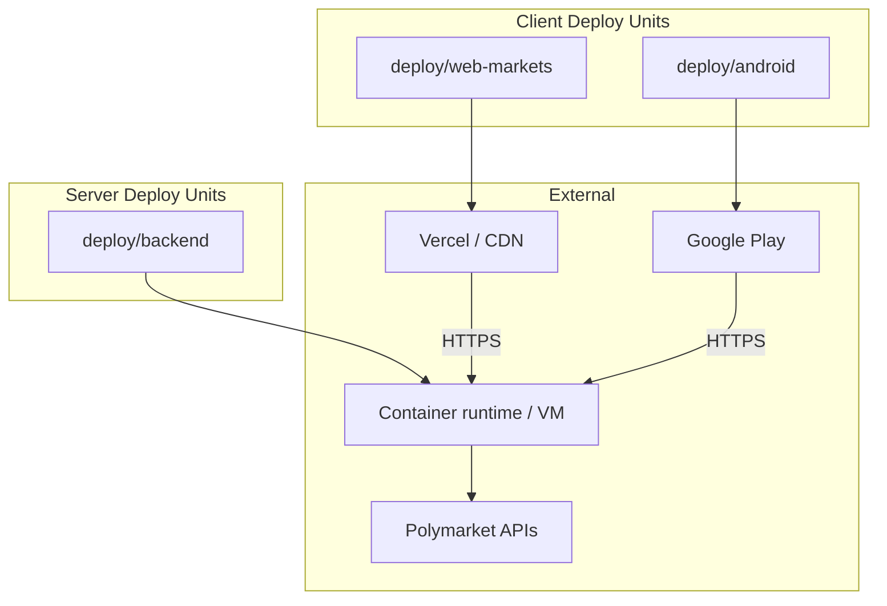
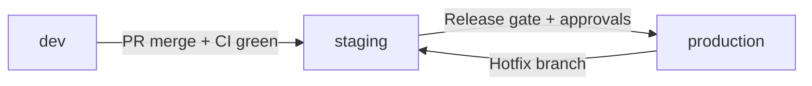
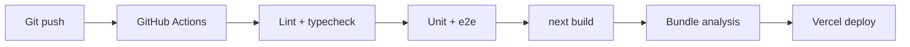
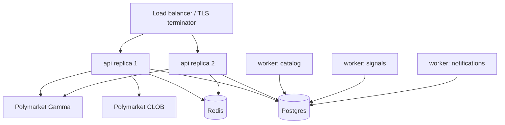
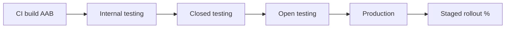
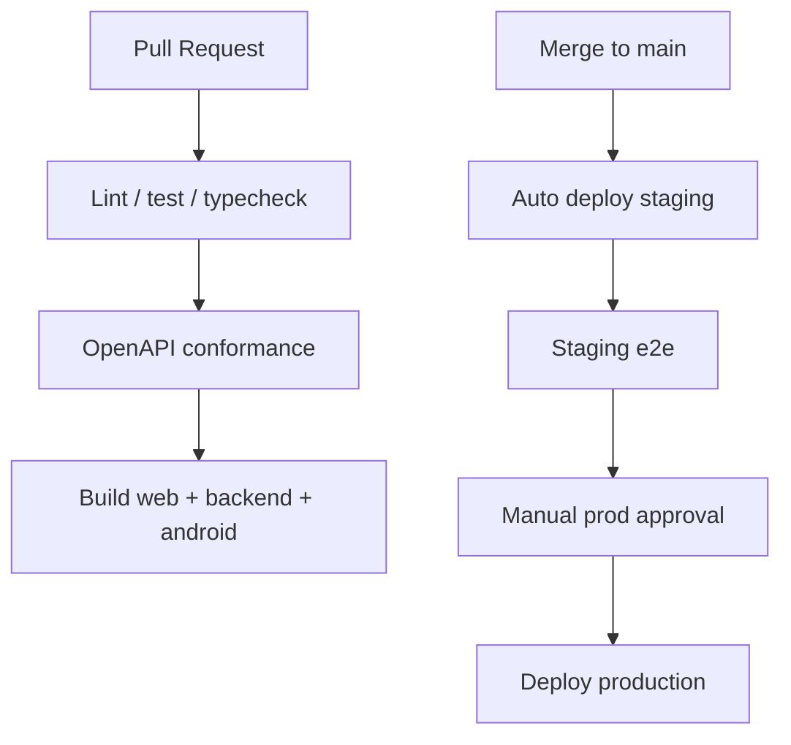
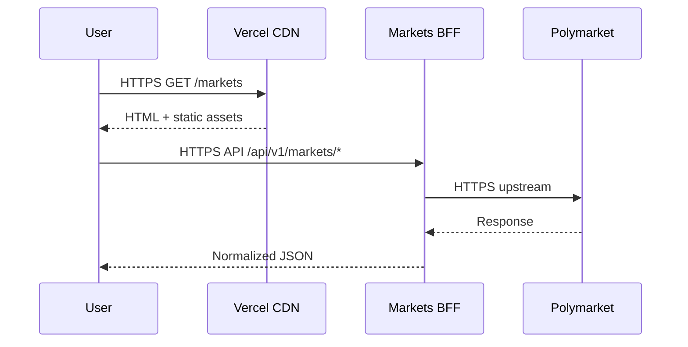

# Deployment Architecture

**Status:** reviewed
**Owner:** platform-orchestrator
**Last updated:** 2026-07-25
**Product:** RetroPick Markets V1
**Wave:** 1 (architecture freeze)

## Description

This document specifies how RetroPick Markets V1 is built, configured, deployed, and released across development, staging, and production: three deploy units (`deploy/web-markets/`, `deploy/backend/`, `deploy/android/`), environment matrix, `NEXT_PUBLIC_PRODUCT=markets` isolation, one Markets BFF for all clients, Play tracks, and secrets boundaries.

Current Markets V1 authority: `.harness/products/markets-v1/governance/AGENT_OPERATING_CONTRACT.md`.

Read this when adding or renaming env vars, choosing client rebuild vs BFF-only deploy, opening a Play track, or wiring Polymarket credentials into a runtime. Prefer cost-model and incident-response docs for pricing or SEV playbooks—not for embedding secrets in Next.js or APK/AAB bundles.

## 0. Developer intent (5W+1H)

Short orientation for implementers and agents. Read this before the normative sections below.

This document’s **Purpose** states deploy/release semantics; **Scope** lists deploy units and exclusions. Use 5W+1H to pick the correct lever before editing env files or CI.

The 5W+1H table below is a **navigation aid** only. It does not replace Purpose, Scope, or later normative sections; if anything conflicts, the body of this document wins.

| Lens | Answer |
|------|--------|
| **Who** | DevOps/SRE and release owners; web (Vercel), Go BFF (container/VM), and Android (Play) engineers; harness agents editing `deploy/web-markets/`, `deploy/backend/`, `deploy/android/`; operators promoting staging → production. |
Current Markets V1 authority: `.harness/products/markets-v1/governance/AGENT_OPERATING_CONTRACT.md`.
| **When** | Wave 1 architecture freeze and every subsequent release. Apply when adding/renaming env vars, changing public origins, choosing client rebuild vs BFF-only deploy, opening a Play track, or wiring Polymarket credentials into a runtime. |
| **Where** | Spec authority: this file. Artifacts: `deploy/web-markets/`, `deploy/backend/`, `deploy/android/`. Clients use the Markets BFF origin for their tier; Polymarket APIs stay external. Companion: shared OpenAPI ([ADR-004](adr/ADR-004-SHARED-WEB-ANDROID-API.md)), ACL ([ADR-002](adr/ADR-002-POLYMARKET-ANTI-CORRUPTION-LAYER.md)). |
| **Why** | Without one promotion story, Markets bleeds into PRISM/legacy, secrets leak into client bundles, and web/Android diverge. Server-side deploy authority preserves kill switches without app-store waits and keeps Markets free of custom-exchange deploys ([ADR-001](adr/ADR-001-MARKETS-HAS-NO-CUSTOM-EXCHANGE.md)). |
| **How** | Ship three deploy units; configure tiers from the env matrix; keep builder/relayer and upstream keys on the BFF only; promote through staging with contract tests; advance Android Internal → Closed → Open → Production. |

### Worked example

**Happy path**

1. Extend OpenAPI + BFF for a new read-only capability; set the flag in **staging** BFF env.
2. Deploy `deploy/backend` only. Web/Android consume the same `/api/v1/markets/*` on next session.
3. Rebuild Vercel/Play **only** if `NEXT_PUBLIC_*` or native constants changed.
4. Smoke staging origins from the matrix; run contract tests; promote the same pattern to production.
5. Optional: ship Android copy tweaks on Internal testing while BFF is already live.

**Failure / Never-V1**

- Polymarket API keys or builder secrets in Next.js or the APK/AAB.
- A second “trading API” beside the Markets BFF for one client.
Current Markets V1 authority: `.harness/products/markets-v1/governance/AGENT_OPERATING_CONTRACT.md`.
- Treating green `localhost` as production proof without staging promotion.

**Agent checklist**

- [ ] Which deploy unit changes?
- [ ] Which tier (dev/staging/prod)?
- [ ] Where does the secret live (must be server-side if upstream)?
- [ ] Do clients need rebuild?
- [ ] Staging evidence before prod?

**Reading tip:** Skim Who/What first, confirm Where paths exist in the repo, then implement How. Use Never-V1 as a PR self-review gate before marking harness tasks complete.


## 1. Purpose

Specify how RetroPick Markets V1 is **built, configured, deployed, and released** across development, staging, and production environments. This document covers deploy units, environment variables, release tracks, and operational boundaries for web, BFF, and Android.

## 2. Scope

### In scope

- Deploy units: `deploy/web-markets/`, `deploy/backend/`, `deploy/android/`
- Environment tiers: dev, staging, production
- `NEXT_PUBLIC_PRODUCT=markets` web build isolation
- BFF as single Markets API deploy unit
- Google Play release tracks for Android
- Configuration and secrets management

### Out of scope

- PRISM deploy (`deploy/web-prism/`, `deploy/contracts/`)
Current Markets V1 authority: `.harness/products/markets-v1/governance/AGENT_OPERATING_CONTRACT.md`.
- Detailed cost model ([platform/INFRASTRUCTURE_AND_COST_MODEL.md](../platform/INFRASTRUCTURE_AND_COST_MODEL.md))

## 3. Deploy Unit Overview



| Deploy unit | Artifact | Runtime | Consumers |
|-------------|----------|---------|-----------|
| `web-markets` | Next.js SSR/SSG bundle | Vercel (or equivalent) | Browsers |
| `backend` | Go binary + migrations | Container on VM/K8s | Web, Android, ops |
| `android` | AAB/APK | Google Play | Android devices |

**Principle:** One BFF deploy unit serves all Markets clients. Web and Android are thin clients over the same OpenAPI.

## 4. Environment Tiers

### 4.1 Environment matrix

| Property | Development | Staging | Production |
|----------|-------------|---------|------------|
| Purpose | Local + shared dev | Pre-prod validation | Live users |
| Web origin | `localhost:3000` | `staging.markets.retropick.example` | `markets.retropick.example` |
| BFF origin | `localhost:8080` | `api-staging.markets.retropick.example` | `api.markets.retropick.example` |
| Polymarket | Gamma/CLOB prod read; paper trading | Prod upstream | Prod upstream |
| Chain | Polygon Amoy / fork | Polygon mainnet (limited) | Polygon mainnet |
| Data | Ephemeral / seeded | Anonymized snapshot | Live Postgres |
| Auth | Dev OAuth bypass optional | Full OAuth | Full OAuth + SIWE |
| Play track | Internal APK sideload | Internal testing | Closed → Open → Production |

### 4.2 Environment promotion flow



Promotion requires:
1. Contract conformance tests pass
2. E2E critical journeys pass ([testing/END_TO_END_CRITICAL_JOURNEYS.md](../testing/END_TO_END_CRITICAL_JOURNEYS.md))
3. Release verification matrix signed ([testing/RELEASE_VERIFICATION_MATRIX.md](../testing/RELEASE_VERIFICATION_MATRIX.md))
4. Human approval for production (no auto-deploy)

## 5. Web Deployment (`deploy/web-markets/`)

### 5.1 Build configuration

The Markets web app is built from `apps/web` with product scoping:

```bash
# deploy/web-markets/.env.example
NEXT_PUBLIC_PRODUCT=markets
NEXT_PUBLIC_API_URL=http://127.0.0.1:8080
```

| Variable | Required | Description |
|----------|----------|-------------|
| `NEXT_PUBLIC_PRODUCT` | Yes | Must be `markets`; excludes PRISM/legacy routes |
| `NEXT_PUBLIC_API_URL` | Yes | BFF base URL (no trailing slash) |
| `NEXT_PUBLIC_ENV` | Yes | `development` \| `staging` \| `production` |
| `NEXT_PUBLIC_SENTRY_DSN` | Staging+ | Error reporting (public DSN) |
| `NEXT_PUBLIC_WALLETCONNECT_PROJECT_ID` | Yes | WalletConnect cloud project |

**Must not appear in client env:**
- Polymarket API keys
- Builder/relayer secrets
- Database credentials
- Session signing secrets

### 5.2 Build pipeline



Build flags:
- `NEXT_PUBLIC_PRODUCT=markets` set at build time (not runtime toggle in prod)
- Tree-shaking excludes `products/prism` and `products/legacy` modules
- Source maps uploaded to error tracker; not served publicly

### 5.3 CDN and caching

| Asset type | Cache policy |
|------------|--------------|
| Static JS/CSS (hashed) | `Cache-Control: public, max-age=31536000, immutable` |
| HTML pages | Short TTL or SSR per-route |
| API calls | No CDN; direct to BFF |
| OG images | CDN cached |

### 5.4 Domain and TLS

| Env | Host | TLS |
|-----|------|-----|
| Staging | `staging.markets.*` | Auto (Vercel/Let's Encrypt) |
| Production | `markets.*` | Auto + HSTS preload |

CORS on BFF allows only registered web origins per environment.

## 6. BFF Deployment (`deploy/backend/`)

### 6.1 Deploy unit composition

The BFF deploy unit is a **single Go binary** (`apps/backend/cmd/markets-api`) plus:

- SQL migrations (`apps/backend/migrations/`)
- Worker processes (same image, different entrypoints or supervisor)
- Health check sidecar (`cmd/healthcheck`)



### 6.2 Environment variables (BFF)

| Variable | Dev default | Description |
|----------|-------------|-------------|
| `MARKETS_GAMMA_API_URL` | `https://gamma-api.polymarket.com` | Gamma base URL |
| `MARKETS_CLOB_API_URL` | CLOB V2 URL | Order book API |
| `MARKETS_CATALOG_ENABLED` | `1` | Catalog kill switch |
| `MARKETS_TRADING_ENABLED` | `0` (dev) / `1` (prod phased) | Trading kill switch |
| `MARKETS_INTELLIGENCE_ENABLED` | `1` | Intelligence kill switch |
| `DATABASE_URL` | local docker | Postgres connection |
| `REDIS_URL` | local docker | Cache and rate limits |
| `SESSION_SECRET` | dev only | Session signing (secret manager in prod) |
| `BUILDER_API_KEY` | secret manager | Polymarket builder credentials |
| `GEO_PROVIDER_API_KEY` | secret manager | Eligibility provider |

Full reference: [platform/ENVIRONMENT_AND_CONFIGURATION.md](../platform/ENVIRONMENT_AND_CONFIGURATION.md).

### 6.3 Scaling model (V1)

| Component | V1 target | Scale trigger |
|-----------|-----------|---------------|
| API replicas | 2 (staging), 3+ (prod) | p95 latency > SLO |
| Workers | 1 each type | Queue depth |
| Postgres | Single primary + replica (prod) | Connection saturation |
| Redis | Single instance (V1) | Memory / ops complexity |

Horizontal scale applies to **stateless API replicas** only. Workers use leader election or partition keys.

### 6.4 Migrations

Migrations run as **pre-deploy job**:

1. Backup Postgres (prod)
2. Run `cmd/migrator up`
3. Deploy new API binary
4. Smoke test `/health` and `/markets/capabilities`

Rollback: revert binary; backward-compatible migrations only in V1.

### 6.5 Health and readiness

| Endpoint | Purpose |
|----------|---------|
| `/health` | Liveness — process up |
| `/ready` | Readiness — DB + Redis + Gamma ping |
| `/metrics` | Prometheus scrape (internal network) |

Load balancer removes unhealthy replicas from rotation.

## 7. Android Deployment (`deploy/android/`)

### 7.1 Play Store tracks



| Track | Audience | Purpose |
|-------|----------|---------|
| Internal | Engineering | Daily builds, fast iteration |
| Closed | Beta testers | Feature validation |
| Open | Wider beta | Load and UX feedback |
| Production | General availability | Staged rollout 1% → 10% → 50% → 100% |

### 7.2 Build flavors

| Flavor | `BFF_BASE_URL` | Application ID suffix |
|--------|----------------|----------------------|
| `dev` | `http://10.0.2.2:8080` (emulator) | `.dev` |
| `staging` | `https://api-staging.markets.*` | `.staging` |
| `production` | `https://api.markets.*` | (none) |

Config in `deploy/android/`:
- `flavors.gradle.kts` (or equivalent)
- Signing configs reference Play App Signing (upload key in CI secret store)
- ProGuard/R8 rules for release obfuscation

### 7.3 Release artifacts

| Artifact | Format | Distribution |
|----------|--------|--------------|
| Play release | AAB | Play Console |
| Internal | APK or AAB | Firebase App Distribution / Play internal |
| CI artifact | AAB | GitHub Actions retention 30 days |

### 7.4 Android-specific env (BuildConfig)

```kotlin
// Injected at build time — NOT user-modifiable in release
BFF_BASE_URL
PRODUCT_FLAVOR        // "markets"
OPENAPI_SPEC_VERSION  // "1.0.0"
SENTRY_DSN
WALLETCONNECT_PROJECT_ID
```

**Rule:** Release builds cannot point to arbitrary BFF URLs (no hidden debug endpoints).

### 7.5 Play compliance

See [android/PLAY_STORE_COMPLIANCE_AND_RELEASE.md](../android/PLAY_STORE_COMPLIANCE_AND_RELEASE.md):
- Financial app disclosures
- Data safety form
- Target API level policy
- In-app eligibility gating

## 8. Cross-Cutting Configuration

### 8.1 Secrets management

| Secret | Storage | Rotation |
|--------|---------|----------|
| `SESSION_SECRET` | Secret manager | 90 days |
| `BUILDER_API_KEY` | Secret manager | On compromise |
| `DATABASE_URL` | Secret manager | On credential rotation |
| OAuth client secrets | Secret manager | Provider-driven |
| Play upload key | CI secret store | Annual review |

**Never in Git:** `.env` files with real secrets; only `.env.example` with placeholders.

### 8.2 Feature flags and capabilities

Runtime feature control is **server-driven** via `/markets/capabilities`:

```json
{
  "version": "1.0.0",
  "catalog": true,
  "trading": true,
  "combos": false,
  "intelligence": true,
  "checkedAt": "2026-07-25T08:00:00Z"
}
```

Deploy-time env vars (`MARKETS_*_ENABLED`) set **ceiling**; capabilities API can further restrict per environment or incident.

### 8.3 Kill switches

| Switch | Env var | Capability field | Effect |
|--------|---------|------------------|--------|
| Catalog | `MARKETS_CATALOG_ENABLED` | `catalog` | Return stale cache or 503 |
| Trading | `MARKETS_TRADING_ENABLED` | `trading` | Block order submit; read orders OK |
| Intelligence | `MARKETS_INTELLIGENCE_ENABLED` | `intelligence` | Empty signal feed |
| Combos | N/A (upstream gated) | `combos` | Hide combo UI |

Kill switches are operated via runbook: [platform/PRODUCTION_OPERATIONS_RUNBOOK.md](../platform/PRODUCTION_OPERATIONS_RUNBOOK.md).

## 9. CI/CD Pipeline Integration



Details: [platform/CI_CD_PIPELINE.md](../platform/CI_CD_PIPELINE.md).

### 9.1 Deploy artifacts per commit

| Artifact | Stored | Retention |
|----------|--------|-----------|
| Web build output | Vercel | Per Vercel policy |
| Go binary | Container registry | 90 days |
| Android AAB | CI + Play | 30 days CI |
| SBOM | CI artifact | 1 year |

## 10. Networking and Security

### 10.1 Traffic flow (production)



### 10.2 Egress controls

BFF egress allowlist:
- Polymarket Gamma, CLOB, relayer endpoints
- Geo provider
- FCM/APNs
- OAuth providers
- Error tracking (Sentry)

No open internet egress from database tier.

### 10.3 WAF and DDoS

| Layer | Control |
|-------|---------|
| CDN | DDoS protection (Vercel/Cloudflare) |
| BFF | Rate limiting per IP and session |
| API | Request size limits; timeout 30s default |

## 11. Observability per Deploy Unit

| Unit | Logs | Metrics | Traces |
|------|------|---------|--------|
| Web | Client Sentry + server SSR logs | Web vitals | Browser traces (sampled) |
| BFF | Structured JSON stdout | Prometheus | OpenTelemetry |
| Android | Crashlytics/Sentry | Firebase Performance | Sampled |
| Workers | Same as BFF | Queue depth, lag | Job spans |

SLOs: [platform/OBSERVABILITY_SLOS_AND_ALERTS.md](../platform/OBSERVABILITY_SLOS_AND_ALERTS.md).

## 12. Rollback Procedures

| Unit | Rollback method | RTO target |
|------|-----------------|------------|
| Web | Vercel instant rollback to previous deployment | < 5 min |
| BFF | Redeploy previous container image | < 15 min |
| Database | Forward-only migrations; feature flags to disable | N/A |
| Android | Halt staged rollout; promote previous release | < 24 hr (Play review) |

Full procedure: [platform/RELEASE_ROLLBACK_AND_CHANGE_MANAGEMENT.md](../platform/RELEASE_ROLLBACK_AND_CHANGE_MANAGEMENT.md).

## 13. Disaster Recovery

| Scenario | RPO | RTO | Procedure |
|----------|-----|-----|-----------|
| BFF region loss | 0 (stateless) | 30 min | Redeploy to standby region |
| Postgres failure | 5 min (PITR) | 1 hr | Restore from backup |
| Polymarket outage | N/A | N/A | Degraded read-only mode |
| Play account compromise | N/A | 4 hr | Key rotation runbook |

Details: [platform/BACKUP_RESTORE_AND_DISASTER_RECOVERY.md](../platform/BACKUP_RESTORE_AND_DISASTER_RECOVERY.md).

## 14. Development Environment Setup

Local developer topology:

```bash
# Terminal 1 — infrastructure
docker compose -f docker/docker-compose.yml up postgres redis

# Terminal 2 — BFF
cd apps/backend && cp ../../deploy/backend/.env.example .env
go run ./cmd/markets-api

# Terminal 3 — web
cd apps/web && cp ../../deploy/web-markets/.env.example .env.local
NEXT_PUBLIC_PRODUCT=markets pnpm dev
```

Android emulator uses `10.0.2.2:8080` to reach host BFF.

## 15. Deployment Checklist (Production Launch)

1. [ ] `NEXT_PUBLIC_PRODUCT=markets` verified in production web build
2. [ ] BFF `/ready` green for 24h on staging
3. [ ] Secrets rotated from dev defaults
4. [ ] Kill switches tested on staging
5. [ ] Play internal track signed off
6. [ ] CORS origins match production domains
7. [ ] SBOM generated and archived
8. [ ] On-call rotation configured
9. [ ] Rollback drill completed
10. [ ] Legal/compliance sign-off for jurisdictions served

## 16. Relationship to Monorepo Phases

| Phase | Deployment impact |
|-------|-------------------|
| R1 | `deploy/web-markets/` created with product env |
| R3 | BFF Markets routes behind single binary |
| R4 | Legacy deploy configs deprecated |
| Phase 6 (Markets) | Full CI/CD hardening |
| Phase 7 (Markets) | Production launch |

## 17. Open Questions

- Multi-region BFF active-active vs active-passive for V1
- Vercel vs self-hosted Next.js for compliance jurisdictions
- Android in-app update API vs Play-only updates

## 18. Acceptance Criteria

- [ ] All three deploy directories have `.env.example` with documented vars
- [ ] Staging environment mirrors production topology
- [ ] Play track progression documented and tested
- [ ] Kill switches operable without redeploy (capabilities API)
- [ ] Traceability in requirements matrix

## 19. Related Documents

| Document | Link |
|----------|------|
| Monorepo layout | [TARGET_MONOREPO_ARCHITECTURE.md](TARGET_MONOREPO_ARCHITECTURE.md) |
| Failure modes | [FAILURE_DOMAINS_AND_DEGRADED_MODES.md](FAILURE_DOMAINS_AND_DEGRADED_MODES.md) |
| Environment config | [platform/ENVIRONMENT_AND_CONFIGURATION.md](../platform/ENVIRONMENT_AND_CONFIGURATION.md) |
| CI/CD | [platform/CI_CD_PIPELINE.md](../platform/CI_CD_PIPELINE.md) |
| Android release | [android/PLAY_STORE_COMPLIANCE_AND_RELEASE.md](../android/PLAY_STORE_COMPLIANCE_AND_RELEASE.md) |
| Operations | [platform/PRODUCTION_OPERATIONS_RUNBOOK.md](../platform/PRODUCTION_OPERATIONS_RUNBOOK.md) |

## Appendix A — Deploy Unit File Reference

```text
deploy/
├── README.md
├── web-markets/
│   └── .env.example          # NEXT_PUBLIC_PRODUCT=markets
├── web-prism/                # Out of scope
├── backend/
│   └── .env.example          # MARKETS_*, DATABASE_URL, etc.
├── android/
│   ├── flavors.gradle.kts    # dev / staging / production
│   └── play-console.md       # Track promotion notes
└── contracts/                # PRISM only
```

## Appendix B — Document History

| Date | Author | Change |
|------|--------|--------|
| 2026-07-24 | platform-orchestrator | Initial stub |
| 2026-07-25 | platform-orchestrator | Wave 1 comprehensive expansion; status → reviewed |
