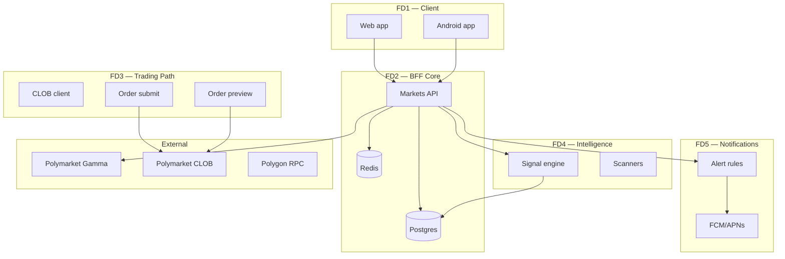
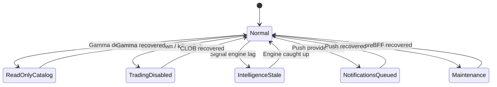
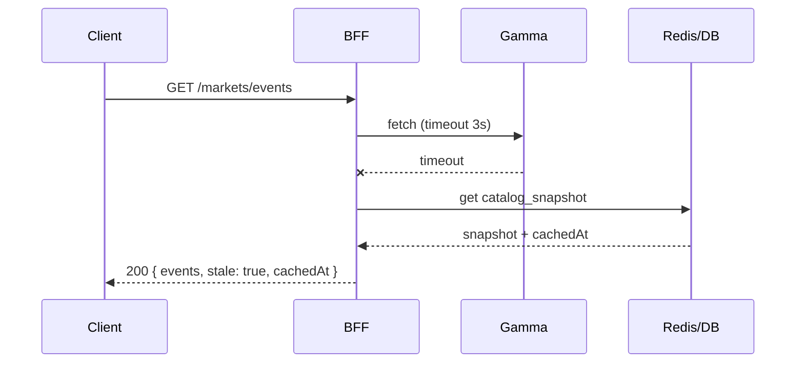
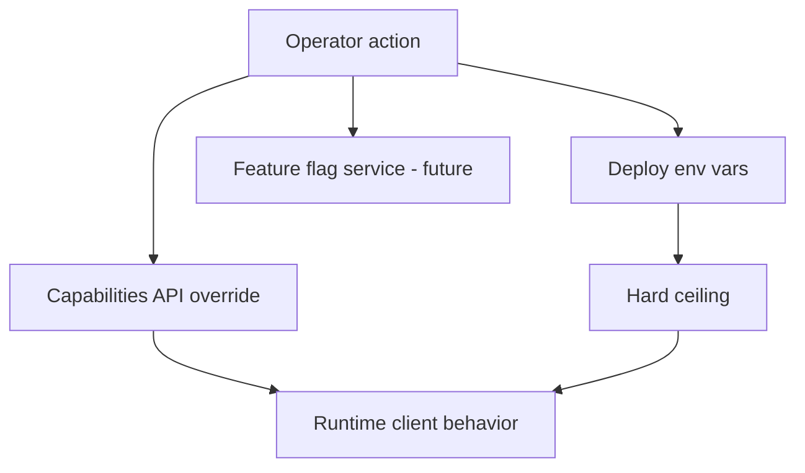
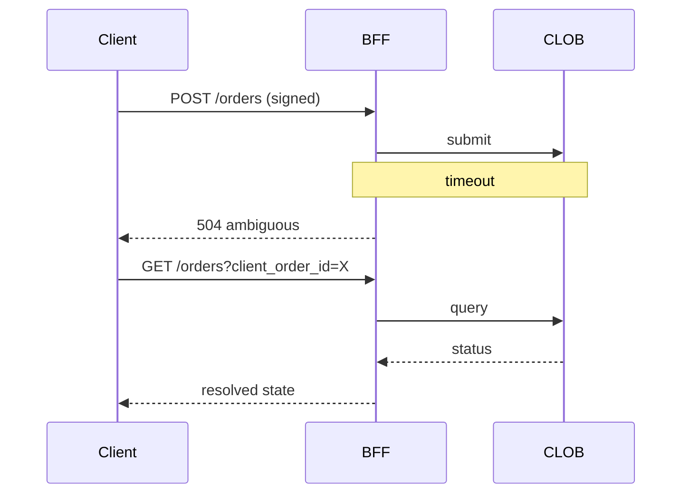

# Failure Domains and Degraded Modes

**Status:** reviewed
**Owner:** platform-orchestrator
**Last updated:** 2026-07-25
**Product:** RetroPick Markets V1
**Wave:** 1 (architecture freeze)

## Description

This document defines failure domains, blast radius, and degraded operating modes for RetroPick Markets V1: Client, BFF Core, Trading Path, Intelligence, and Notifications—plus independence rules, kill switches, stale/read-only UX, and recovery expectations. Intelligence or notification outages must not force unsafe orders; trading outages must not be “fixed” by auto-executing signals (ADR-009).

It sits in Wave 1 architecture freeze beside system trust boundaries and ADRs for realtime reconciliation (ADR-005) and the shared signal engine (ADR-008). Markets is an experience and policy layer over Polymarket; degraded modes fail closed on eligibility/capabilities and show delayed UX rather than inventing venue truth.

Read this when designing anything that touches CLOB, signals, or push; when adding kill switches; or when reviewing PRs where one subsystem could cascade into unsafe trading. It is not a full incident-response playbook and not a license for signal→submit paths.

## 0. Developer intent (5W+1H)

Short orientation for implementers and agents. Read this before the normative sections below.

**Purpose** here is blast radius and degraded modes. Map every feature to a domain before coding side effects across trading, intelligence, or notifications.

The 5W+1H table below is a **navigation aid** only. It does not replace Purpose, Scope, or later normative sections; if anything conflicts, the body of this document wins.

| Lens | Answer |
|------|--------|
| **Who** | BFF, realtime, intelligence, and notification owners; web/Android engineers implementing stale/read-only UX; SRE defining kill switches; agents designing cross-cutting features. |
| **What** | Five failure domains (Client, BFF Core, Trading Path, Intelligence, Notifications), independence rules, degraded modes (read-only catalog, kill switches, stale badges), recovery expectations, and client behavior. Not a full incident-response playbook. |
| **When** | When designing anything that touches CLOB, signals, or push; adding kill switches; writing SEV paths; reviewing PRs where one subsystem could cascade into unsafe trading. |
| **Where** | Spec: this file. Runtime: Markets API + Postgres/Redis; CLOB preview/submit; signal engine; alert/push workers; clients. Cross-read [ADR-005](adr/ADR-005-REALTIME-AND-RECONCILIATION.md), [ADR-008](adr/ADR-008-SHARED-SIGNAL-ENGINE.md), [ADR-009](adr/ADR-009-NO-AUTO-COPY-TRADING-V1.md). |
| **Why** | Intelligence or notification outages must not force unsafe orders; trading outages must not be “fixed” by auto-executing signals. Isolation keeps Markets an experience layer without cascading user harm. |
| **How** | Encode independence in APIs/workers: signals read-only; alerts never submit orders; WS gaps trigger REST resync; capabilities/kill flags fail closed; clients show delayed/read-only UX instead of inventing venue truth. |

### Worked example

**Happy path**

1. CLOB WebSocket flaps (Trading Path / FD3).
2. Critical screens fall back to REST poll (e.g. every 5s) per degraded matrix.
3. BFF Core still serves cached catalog; intelligence may mark signals stale; notifications retry.
4. No backlog of auto-orders drains when CLOB returns—preview+sign resumes manually.

**Failure / Never-V1**

- Auto-placing orders when a whale signal fires during trading degradation ([ADR-009](adr/ADR-009-NO-AUTO-COPY-TRADING-V1.md)).
- Push workers invoking order submit “to catch up.”
- Collapsing intelligence failure into a global Markets API outage unless BFF Core is down.
- Hiding stale books without a delayed/stale indicator when snapshot age exceeds policy.

**Agent checklist**

- [ ] Which failure domain?
- [ ] What still works in degraded mode?
- [ ] What is fail-closed?
- [ ] Any path from signal/alert → submit? (Must be **none**.)
- [ ] Client UX for stale/read-only defined?

**Reading tip:** Skim Who/What first, confirm Where paths exist in the repo, then implement How. Use Never-V1 as a PR self-review gate before marking harness tasks complete.


## 1. Purpose

Define **failure domains**, **blast radius**, and **degraded operating modes** for RetroPick Markets V1. The architecture deliberately separates **trading**, **intelligence**, and **notifications** so that failures in one domain do not cascade into unsafe behavior in another.

## 2. Scope

### In scope

- Failure matrix by subsystem
- Degraded modes: read-only catalog, kill switches, stale data UX
- Independence properties for trading vs intelligence vs notifications
- Recovery procedures and client behavior

### Out of scope

- PRISM-specific failures
- Detailed incident response playbooks ([security/INCIDENT_RESPONSE.md](../security/INCIDENT_RESPONSE.md))

## 3. Failure Domain Model

A **failure domain** is a set of components that share fate during an outage. Markets V1 defines five primary domains:



### 3.1 Domain independence principle

| Domain pair | Independent? | Rationale |
|-------------|--------------|-----------|
| Trading ↔ Intelligence | **Yes** | Signals are read-only; no order side effects |
| Trading ↔ Notifications | **Yes** | Alerts do not submit orders ([ADR-009](adr/ADR-009-NO-AUTO-COPY-TRADING-V1.md)) |
| Intelligence ↔ Notifications | Partially | Notification worker depends on signal engine output |
| Catalog ↔ Trading | Partially | Trading needs market metadata; can use stale cache |
| BFF Core ↔ External venue | **No** | Trading and catalog depend on Polymarket availability |

## 4. Failure Matrix

### 4.1 Master failure matrix

| Failure | Affected domain | User impact | Degraded mode | Recovery |
|---------|-----------------|-------------|---------------|----------|
| Gamma API down | Catalog | No new events; stale list | Read-only catalog from cache | Auto when Gamma recovers |
| CLOB API down | Trading | Cannot preview/submit orders | Trading disabled; catalog OK | Circuit breaker half-open probe |
| CLOB WS disconnect | Realtime | Stale order book | Snapshot + poll fallback | WS reconnect + gap fill ([ADR-005](adr/ADR-005-REALTIME-AND-RECONCILIATION.md)) |
| Postgres down | BFF Core | Auth, portfolio, alerts fail | 503 global; static maintenance page | Failover to replica |
| Redis down | BFF Core | Rate limits degraded; cache miss | Direct upstream; higher latency | Redis restart / failover |
| Signal engine stuck | Intelligence | No new signals | Last-known signals + stale banner | Worker restart |
| FCM/APNs down | Notifications | No push; in-app OK | Queue with backoff | Provider recovery |
| Polygon RPC down | Indexer | Portfolio drift | Show "syncing" state | Alternate RPC |
| Geo provider down | Policy | Unknown jurisdiction | **Fail-closed** `eligible: false` | Provider recovery |
| Client offline | Client | No network | Cached catalog (Android Room) | Reconnect sync |
| Kill switch: trading | Trading | Orders blocked | Read-only trading UI | Ops toggle |
| Kill switch: catalog | Catalog | Empty or cached only | Banner: limited catalog | Ops toggle |

### 4.2 Severity classification

| Severity | Definition | Example | Response time |
|----------|------------|---------|---------------|
| SEV1 | Trading loss risk or data breach | Wrong order submission | Immediate kill switch |
| SEV2 | Core function unavailable | CLOB down > 15 min | Degraded mode + comms |
| SEV3 | Partial feature loss | Intelligence lag | Monitor; fix next window |
| SEV4 | Cosmetic / non-critical | Chart render glitch | Backlog |

## 5. Degraded Mode Catalog

### 5.1 Mode definitions



| Mode | `capabilities` flags | Client UX |
|------|---------------------|-----------|
| **Normal** | All enabled per env | Full functionality |
| **Read-only catalog** | `catalog: true`, possibly stale timestamp | Browse markets; trading may be disabled separately |
| **Trading disabled** | `trading: false` | Order ticket shows maintenance; portfolio read OK |
| **Intelligence stale** | `intelligence: true` + `stale: true` in response | Signals show age badge; no auto-hide |
| **Notifications delayed** | N/A (server-side queue) | In-app inbox still works |
| **Fail-closed eligibility** | `eligible: false` | Block funding/trading; may allow read |
| **Full maintenance** | 503 on API | Static maintenance page |

### 5.2 Read-only catalog mode

**Trigger:** Gamma unreachable, `MARKETS_CATALOG_ENABLED=0`, or cache-only fallback.

**Behavior:**
1. BFF serves last successful catalog snapshot from Postgres/Redis
2. Response includes `stale: true` and `cachedAt` timestamp
3. Event detail pages show "Prices may be outdated" banner
4. Search may be limited to cached index
5. Trading may continue if CLOB healthy and market IDs still valid



**Acceptance:** Catalog never returns fabricated markets. Empty cache → 503 with retry-after.

### 5.3 Trading disabled mode

**Trigger:** CLOB down, `MARKETS_TRADING_ENABLED=0`, SEV1 incident, or eligibility fail-closed.

**Behavior:**
1. `/markets/capabilities` returns `trading: false`
2. Order preview returns `503` or `403` with reason code
3. Open orders and cancel may still work if CLOB partial (configurable; default: cancel allowed)
4. Portfolio read uses indexer + CLOB snapshot
5. No silent queue of unsigned orders

**Invariant:** Never accept order submit without live CLOB health check (or explicit ops override with audit).

### 5.4 Intelligence degraded mode

**Trigger:** Signal engine lag > 5 min, upstream trade feed gap, or `MARKETS_INTELLIGENCE_ENABLED=0`.

**Behavior:**
1. API returns signals with `computedAt` and `stale: true` when age > threshold
2. Retracted signals filtered regardless of stale mode
3. Web/Android show "Intelligence delayed" non-blocking banner
4. Trading unaffected

**Independence proof:** Intelligence handlers do not call CLOB submit path. Separate worker pool.

### 5.5 Notifications degraded mode

**Trigger:** FCM/APNs outage, notification worker backlog > 10k.

**Behavior:**
1. Events queued in `markets_alert_deliveries` with exponential backoff
2. In-app notification center polls BFF (not push-dependent)
3. No duplicate push on recovery (idempotent delivery keys)
4. Trading and intelligence unaffected

## 6. Kill Switches

### 6.1 Kill switch hierarchy



| Switch | Operator interface | Propagation time | Reversible |
|--------|---------------------|------------------|------------|
| `MARKETS_TRADING_ENABLED=0` | Env + redeploy | 5–15 min | Yes |
| Capabilities override | Admin API / runbook | < 60 sec | Yes |
| Eligibility fail-closed | Config | < 60 sec | Yes |
| Client force-update | Play / web deploy | Hours | Yes |

### 6.2 Kill switch runbook (trading)

1. Set capabilities `trading: false` via admin endpoint
2. Verify web and Android receive updated capabilities within TTL (60s)
3. Confirm order preview returns appropriate error
4. Post incident channel notification
5. Root cause analysis before re-enable
6. Re-enable with staged `%` if supported

## 7. Circuit Breakers and Timeouts

### 7.1 Upstream circuit breaker config

| Upstream | Failure threshold | Open duration | Half-open probes |
|----------|-------------------|---------------|------------------|
| Gamma | 5 errors / 30s | 60s | 1 req / 10s |
| CLOB REST | 3 errors / 15s | 30s | 1 req / 5s |
| CLOB WS | 2 disconnects / 5 min | Reconnect with backoff | N/A |
| Geo provider | 3 errors / 60s | 300s | 1 req / 30s |
| Polygon RPC | 5 errors / 60s | 120s | 1 req / 15s |

### 7.2 Timeout budget (p95 target)

| Call | Timeout | Client visible |
|------|---------|----------------|
| Catalog list | 3s | Spinner → stale cache |
| Order preview | 5s | Retry prompt |
| Order submit | 10s | Ambiguous state UI |
| Eligibility | 2s | Fail-closed |
| WS heartbeat | 30s | Reconnect |

## 8. Client Behavior Under Failure

### 8.1 Web client

| Scenario | Behavior |
|----------|----------|
| API 503 | Toast + retry with exponential backoff |
| `stale: true` | Yellow banner on catalog |
| `trading: false` | Disable order button; link to status |
| Submit timeout | Show "Order status unknown" + link to open orders |
| WS gap | Fetch REST snapshot ([ADR-005](adr/ADR-005-REALTIME-AND-RECONCILIATION.md)) |

See [web/ERROR_DEGRADED_AND_RECOVERY_UX.md](../web/ERROR_DEGRADED_AND_RECOVERY_UX.md).

### 8.2 Android client

| Scenario | Behavior |
|----------|----------|
| Offline | Room cache for catalog; block trading |
| Push failure | WorkManager retry; in-app poll |
| Low memory | Drop intelligence cache first; keep auth |
| Background | No order submit in background ([ADR-009](adr/ADR-009-NO-AUTO-COPY-TRADING-V1.md)) |

See [android/STATE_DATA_OFFLINE_AND_REALTIME.md](../android/STATE_DATA_OFFLINE_AND_REALTIME.md).

## 9. Data Consistency and Reconciliation

### 9.1 Order state ambiguity

On submit timeout, order may be:
- Accepted by CLOB
- Rejected by CLOB
- Never received

**Policy:** No auto-resubmit. Client directs user to open orders list. BFF reconcile job queries CLOB by client_order_id.



### 9.2 Portfolio reconciliation

Indexer ([backend/INDEXING_RECONCILIATION_AND_REORGS.md](../backend/INDEXING_RECONCILIATION_AND_REORGS.md)) handles chain reorgs:
- Mark affected positions `syncing`
- Refetch from CLOB + chain
- Never show stale PnL without indicator

## 10. Cascade Prevention

### 10.1 Bulkhead pattern

| Pool | Isolation |
|------|-----------|
| API handlers | Separate from worker goroutines |
| Gamma client | Connection limit 100 |
| CLOB client | Connection limit 50 |
| Signal workers | Max 10 concurrent; drop low-priority scans first |
| Notification workers | Rate limited per provider quotas |

### 10.2 Retry storms

- Clients: max 3 retries with jitter
- BFF: no retry on POST submit (except idempotent cancel)
- Workers: exponential backoff capped at 15 min

## 11. Failure Injection Testing

Chaos scenarios for Phase 6:

| Test | Tool | Pass criteria |
|------|------|---------------|
| Gamma 503 | Toxiproxy | Stale catalog mode activates |
| CLOB latency 10s | Toxiproxy | Trading disabled or timeout UX |
| Postgres kill | docker stop | 503 maintenance |
| WS drop | iptables | Client recovers via snapshot |
| Geo provider down | Mock | `eligible: false` |

See [testing/LOAD_CHAOS_AND_RESILIENCE.md](../testing/LOAD_CHAOS_AND_RESILIENCE.md).

## 12. Monitoring and Alerts

| Alert | Condition | Action |
|-------|-----------|--------|
| `markets_gamma_error_rate` | > 5% for 5 min | Page on-call; enable stale catalog |
| `markets_clob_error_rate` | > 2% for 2 min | Consider trading kill switch |
| `markets_signal_lag_seconds` | > 300 | Intelligence stale banner |
| `markets_notification_queue_depth` | > 10000 | Scale workers |
| `markets_eligibility_fail_closed` | spike | Check geo provider |

## 13. Domain-Specific Failure Cards

### 13.1 Trading path

| Component | Single point of failure? | Mitigation |
|-----------|--------------------------|------------|
| CLOB | Yes (external) | Degraded mode; no custom matching |
| Order preview | No | Stateless; retry |
| Session auth | Postgres | Replica failover |
| Signing | Client wallet | Out of band |

### 13.2 Intelligence path

| Component | SPOF? | Mitigation |
|-----------|-------|------------|
| Signal engine | No (lag OK) | Stale mode |
| Trade feed | Yes | Buffer + catch-up |
| Postgres signals table | Yes | Replica |

### 13.3 Notifications path

| Component | SPOF? | Mitigation |
|-----------|-------|------------|
| FCM/APNs | Yes | Queue + in-app fallback |
| Alert rules | No | Rules in DB; replay |

## 14. Invariants Under All Failure Modes

1. **No raw key custody** — degradation never moves signing server-side
2. **No auto copy trading** — notifications never auto-submit ([ADR-009](adr/ADR-009-NO-AUTO-COPY-TRADING-V1.md))
3. **No silent resubmit** — ambiguous orders require user reconciliation
4. **Fail-closed eligibility** — unknown jurisdiction blocks trading
5. **No fabricated data** — stale is labeled stale; never synthetic prices

## 15. Open Questions

- Cancel orders when CLOB partially available?
- Maximum catalog staleness before hard 503?
- Cross-region BFF failover interaction with kill switches

## 16. Acceptance Criteria

- [ ] Failure matrix reviewed by SRE and product
- [ ] Each degraded mode has UX spec in web and Android docs
- [ ] Kill switches tested on staging monthly
- [ ] Chaos tests pass per Phase 6 gate
- [ ] Traceability in requirements matrix

## 17. Related Documents

| Document | Link |
|----------|------|
| System context | [SYSTEM_CONTEXT_AND_TRUST_BOUNDARIES.md](SYSTEM_CONTEXT_AND_TRUST_BOUNDARIES.md) |
| Deployment | [DEPLOYMENT_ARCHITECTURE.md](DEPLOYMENT_ARCHITECTURE.md) |
| Observability | [platform/OBSERVABILITY_SLOS_AND_ALERTS.md](../platform/OBSERVABILITY_SLOS_AND_ALERTS.md) |
| Reconciliation | [backend/INDEXING_RECONCILIATION_AND_REORGS.md](../backend/INDEXING_RECONCILIATION_AND_REORGS.md) |
| Realtime ADR | [adr/ADR-005-REALTIME-AND-RECONCILIATION.md](adr/ADR-005-REALTIME-AND-RECONCILIATION.md) |
| Web degraded UX | [web/ERROR_DEGRADED_AND_RECOVERY_UX.md](../web/ERROR_DEGRADED_AND_RECOVERY_UX.md) |

## Appendix A — Capability Response Examples

**Normal:**
```json
{ "catalog": true, "trading": true, "intelligence": true, "combos": false }
```

**Gamma outage:**
```json
{ "catalog": true, "trading": true, "catalogStale": true, "catalogCachedAt": "..." }
```

**CLOB outage:**
```json
{ "catalog": true, "trading": false, "tradingDisabledReason": "clob_unavailable" }
```

## Appendix B — Document History

| Date | Author | Change |
|------|--------|--------|
| 2026-07-24 | platform-orchestrator | Initial stub |
| 2026-07-25 | platform-orchestrator | Wave 1 comprehensive expansion; status → reviewed |
