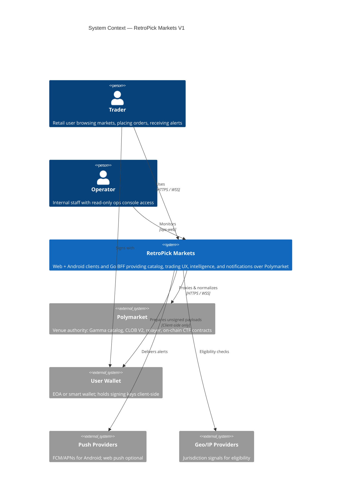
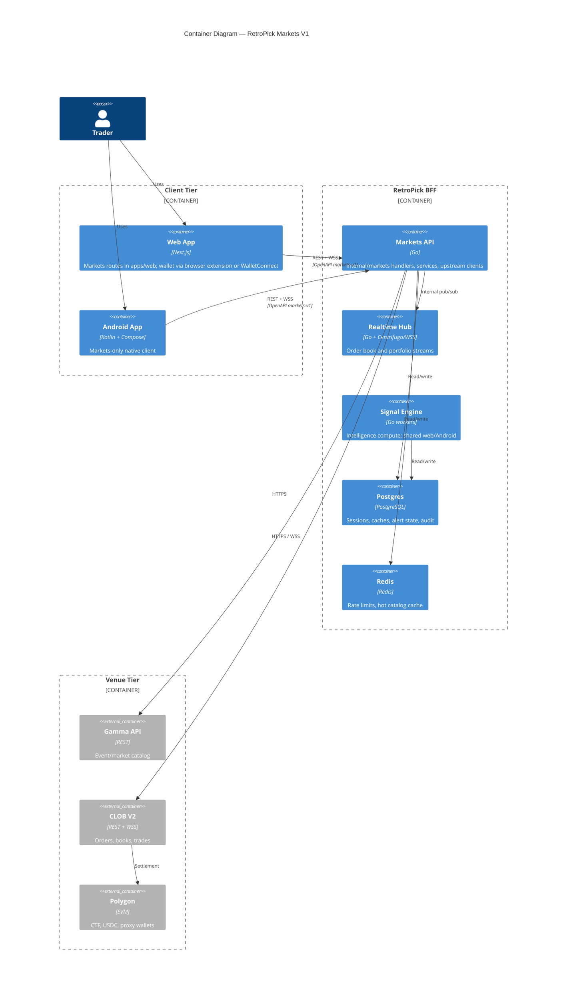
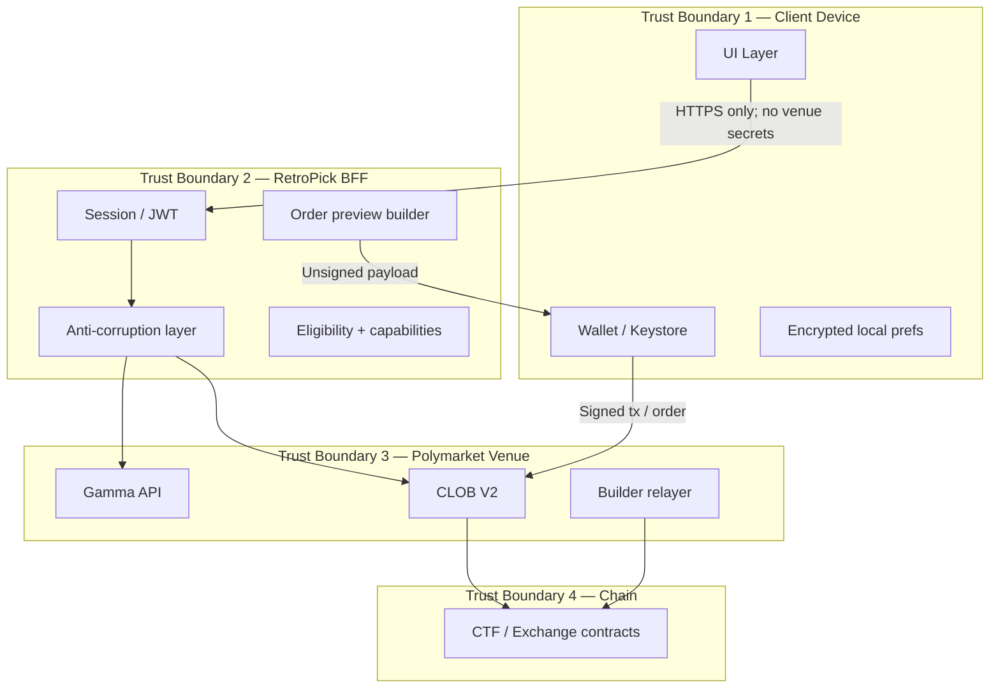
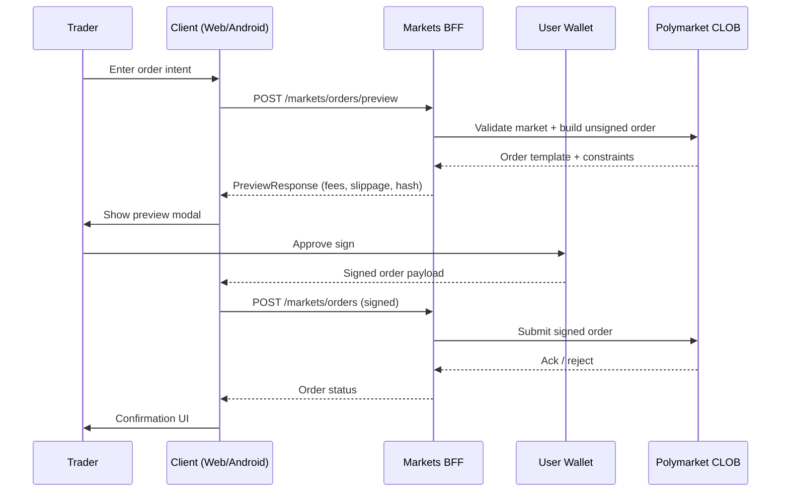
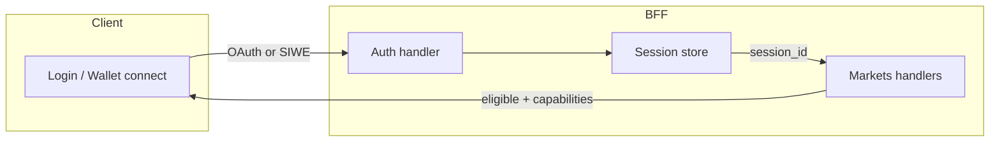

# System Context and Trust Boundaries

**Status:** reviewed
**Owner:** platform-orchestrator
**Last updated:** 2026-07-25
**Product:** RetroPick Markets V1
**Wave:** 1 (architecture freeze)

## Description

This document is the C4 system-context and trust-boundary authority for RetroPick Markets V1: Markets is a Polymarket-native experience, intelligence, and policy layer—**not** a venue. It specifies boundaries among trader, user wallet, BFF, Polymarket, push, and geo/IP, and states that RetroPick does not custody user private keys, operate a custom exchange, or issue Markets outcome tokens.

It sits at the root of Wave 1 architecture and underpins ADR-001 (no custom exchange), ADR-002 (BFF ACL), ADR-003 (user signing), and ADR-009 (no auto copy). Venue truth and settlement remain Polymarket Gamma, CLOB V2, and CTF; operators monitor without trading authority; geo fails closed on ambiguity.

Read this before any feature that moves funds, stores credentials, calls upstream, claims settlement authority, or adds an external actor. If a design crosses a trust boundary differently than this document, stop and revisit ADRs—do not invent a new trust model inside a feature PR. Prefer monorepo and deployment docs for folder layout and release trains.

## 0. Developer intent (5W+1H)

Short orientation for implementers and agents. Read this before the normative sections below.

If a design crosses a trust boundary differently than this document, stop and revisit ADRs—do not invent a new trust model inside a feature PR.

The 5W+1H table below is a **navigation aid** only. It does not replace Purpose, Scope, or later normative sections; if anything conflicts, the body of this document wins.

| Lens | Answer |
|------|--------|
| **Who** | Every Markets implementer (web, Android, BFF, security, ops); Wave 1 agents enforcing invariants; legal/security reviewers of custody or settlement claims. |
| **What** | C4 system context: RetroPick Markets is a Polymarket-native experience, intelligence, and policy layer—**not** a venue. Trust boundaries among trader, user wallet, BFF, Polymarket, push, and geo/IP. RetroPick does not custody user private keys and does not operate a custom exchange or issue Markets outcome tokens. |
| **When** | Before any feature that moves funds, stores credentials, calls upstream, claims settlement authority, or adds an external actor. Revisit when eligibility, signing, or operator powers change. |
| **Where** | Spec: this file (+ threat model and signing integrity docs). Code: Markets web product, Android app paths, `apps/backend/internal/markets/`, client wallets. Venue truth: Polymarket Gamma, CLOB V2, CTF. Ops principals are non-trading. |
| **Why** | Wrong trust assumptions recreate epoch-style custody or RetroPick settlement. Boundaries enforce [ADR-001](adr/ADR-001-MARKETS-HAS-NO-CUSTOM-EXCHANGE.md), [ADR-002](adr/ADR-002-POLYMARKET-ANTI-CORRUPTION-LAYER.md), [ADR-003](adr/ADR-003-WALLET-AND-SIGNING-MODEL.md), and [ADR-009](adr/ADR-009-NO-AUTO-COPY-TRADING-V1.md). |
| **How** | Clients authenticate to BFF; BFF normalizes Polymarket and enforces eligibility; wallets sign; BFF prepares unsigned payloads only; geo fail-closed on ambiguity; never put builder/relayer keys in clients; operators monitor without trading authority. |

### Worked example

**Happy path**

1. Trader opens order ticket (authenticated session, untrusted input).
2. BFF returns preview + content hash (policy + unsigned payload prep).
3. User wallet signs on device; BFF submits the **signed** order to Polymarket.
4. Settlement remains Polymarket/CTF/USDC; RetroPick never holds the seed.

**Failure / Never-V1**

- Adding `contracts/markets/` or RetroPick-issued outcome tokens for Markets.
- Server-signing user order intent, or treating session JWT as chain authority.
- Operators placing trades; geo treated as advisory-open.
- Conflating PRISM or legacy epoch trust models with Markets routes.

**Agent checklist**

- [ ] Who is trusted for venue truth?
- [ ] Who holds keys?
- [ ] Does this PR move a secret or signing duty across a boundary?
- [ ] Eligibility fail-closed?
- [ ] Any custom-exchange implication? (Reject.)

**Reading tip:** Skim Who/What first, confirm Where paths exist in the repo, then implement How. Use Never-V1 as a PR self-review gate before marking harness tasks complete.

## 1. Purpose

This document defines the **system context** for RetroPick Markets V1 using the C4 model (Level 1: Context, Level 2: Container overview) and specifies **trust boundaries** between clients, the Backend-for-Frontend (BFF), the Polymarket venue, and on-chain settlement. It is the authoritative reference for custody, signing, and data-flow invariants that all Wave 1 implementation must honor.

Markets V1 is a **Polymarket-native trading and intelligence product**. RetroPick does not operate a custom exchange, does not issue outcome tokens, and does not custody user private keys. All settlement authority rests with Polymarket and its on-chain contracts.

## 2. Scope

### In scope

- RetroPick Markets V1 clients: `apps/web` (Markets product shell), `apps/android-markets` (proposed; currently `apps/android`)
- Go BFF at `apps/backend/internal/markets/`
- Polymarket upstream APIs (Gamma catalog, CLOB V2, relayer/builder where applicable)
- On-chain signing flows initiated by the user wallet
- Intelligence and notification surfaces that fan out from the BFF

### Out of scope

- PRISM protocol implementation (`contracts/prism/`, `apps/web` PRISM routes)
- Legacy epoch MarketEngine (`/api/v1/legacy/markets/*`, `archive/`, `packages/legacy/`)
- Custom RetroPick exchange or outcome-token issuance ([ADR-001](adr/ADR-001-MARKETS-HAS-NO-CUSTOM-EXCHANGE.md))
- Automated copy trading ([ADR-009](adr/ADR-009-NO-AUTO-COPY-TRADING-V1.md))

## 3. Prerequisites

| Document | Role |
|----------|------|
| [00_DOCUMENT_MAP.md](../00_DOCUMENT_MAP.md) | Suite navigation |
| [01_EXECUTIVE_PRODUCT_SPEC.md](../01_EXECUTIVE_PRODUCT_SPEC.md) | Product intent |
| [docs/ARCHITECTURE.md](../../../docs/ARCHITECTURE.md) | Monorepo R0–R4 restructure |
| [security/THREAT_MODEL.md](../security/THREAT_MODEL.md) | STRIDE analysis |
| [security/SIGNING_AND_TRANSACTION_INTEGRITY.md](../security/SIGNING_AND_TRANSACTION_INTEGRITY.md) | Signing detail |

## 4. C4 Level 1 — System Context

RetroPick Markets sits between **retail traders** and **Polymarket** as an experience, intelligence, and policy layer. RetroPick is not a venue.

### 4.1 External actors

| Actor | Relationship | Trust level |
|-------|--------------|-------------|
| Trader | Primary user; funds and signs on their device | Untrusted input; authenticated session |
| Operator | Internal; no trading or signing authority | Authenticated staff principal |
| Polymarket | Settlement and market-data authority | Trusted for venue truth; verify TLS + response shape |
| User wallet | Signing authority for on-chain actions | User-controlled; RetroPick never holds raw keys |
| Push providers | Notification delivery | Trusted transport; no PII in payload body |
| Geo/IP providers | Eligibility signal | Advisory; fail-closed on ambiguity |

### 4.2 System responsibilities

| Responsibility | Owner | Notes |
|----------------|-------|-------|
| Market catalog truth | Polymarket Gamma | BFF normalizes; cache is derivative |
| Order book truth | Polymarket CLOB V2 | BFF streams; clients never call CLOB directly in prod |
| Order matching & settlement | Polymarket / on-chain | RetroPick submits signed orders only |
| UX, intelligence, alerts | RetroPick BFF + clients | Compute once, fan out ([ADR-008](adr/ADR-008-SHARED-SIGNAL-ENGINE.md)) |
| Jurisdiction policy | RetroPick BFF | Fail-closed `eligible: false` |
| Private key custody | **Never RetroPick** | [ADR-003](adr/ADR-003-WALLET-AND-SIGNING-MODEL.md) |

## 5. C4 Level 2 — Container Diagram

### 5.1 Container inventory

| Container | Path / deploy unit | Protocol | Trust boundary crossed |
|-----------|-------------------|----------|------------------------|
| Web app | `apps/web` + `deploy/web-markets/` | HTTPS to BFF | Client → BFF |
| Android app | `apps/android-markets` (proposed) | HTTPS to BFF | Client → BFF |
| Markets API | `apps/backend/cmd/api` | HTTP :8080 | BFF → venue |
| Realtime hub | `apps/backend/internal/realtime`, `wshub` | WSS | BFF → clients |
| Signal engine | `apps/backend/internal/markets/intelligence` | Internal | BFF internal |
| Postgres | `deploy/backend/` | SQL | BFF data plane |
| Redis | `deploy/backend/` | Redis protocol | BFF cache plane |

## 6. Trust Boundaries

Trust boundaries are enforcement points where data crossing requires explicit validation, authentication, or policy application.

### 6.1 Boundary 1 — Client device

**Crossing:** User input, rendered market data, locally cached catalog pages, push notification tokens.

| Control | Implementation |
|---------|----------------|
| Input validation | Client-side UX validation; authoritative validation in BFF |
| Secret storage | Android Keystore / WebCrypto; no private keys in `localStorage` plaintext |
| TLS pinning | Optional Phase 6+; standard system CAs in V1 |
| Deep link validation | Allowlisted hosts and path prefixes only |
| Wallet isolation | Signing prompts are wallet-native; RetroPick cannot bypass |

**Invariant:** The client tier is **untrusted** for business logic. Capabilities, eligibility, and order previews are always confirmed server-side before any signing prompt.

### 6.2 Boundary 2 — RetroPick BFF

**Crossing:** Authenticated API requests, WebSocket subscriptions, server-prepared unsigned transaction payloads.

| Control | Implementation |
|---------|----------------|
| Authentication | Session cookies (web) / bearer tokens (Android); short TTL |
| Authorization | Per-route scopes; no cross-product PRISM/legacy bleed |
| Anti-corruption | [ADR-002](adr/ADR-002-POLYMARKET-ANTI-CORRUPTION-LAYER.md): normalize upstream shapes to OpenAPI |
| Rate limiting | Per-IP and per-session; abuse thresholds |
| Audit | Redacted request/response logs; order intent audit trail |
| Kill switches | `/markets/capabilities` disables trading, catalog, intelligence independently |

**Invariant:** BFF **never** holds or uses user private keys. Builder/relayer API keys are **server** credentials for infrastructure, not user custody.

### 6.3 Boundary 3 — Polymarket venue

**Crossing:** Catalog fetches, order submission, balance queries, WebSocket market streams.

| Control | Implementation |
|---------|----------------|
| TLS verification | Standard library TLS; no custom insecure modes |
| Response validation | Schema validation against versioned upstream fixtures |
| Timeout + circuit breaker | Degrade to read-only or stale cache per failure matrix |
| Idempotency | Client order IDs; no silent resubmit on timeout |
| Version pinning | CLOB V2 per migration guide; adapter version in `packages/polymarket/` |

**Invariant:** Polymarket is the **source of truth** for market state. RetroPick caches are explicitly labeled stale when upstream is unavailable.

### 6.4 Boundary 4 — On-chain settlement

**Crossing:** Signed transactions, proxy wallet deployments, USDC approvals, CTF redemptions.

| Control | Implementation |
|---------|----------------|
| Preview-before-sign | Every asset-moving action shows human-readable preview |
| Calldata hash binding | Preview digest must match wallet-displayed payload |
| Chain ID enforcement | Polygon mainnet (prod); Amoy/simulated in dev |
| Nonce management | Wallet-owned; BFF may suggest but never sign |
| No custodial signing | Backend rejects any design requiring hot user keys |

**Invariant:** **No raw key custody** by RetroPick at any layer. See [ADR-003](adr/ADR-003-WALLET-AND-SIGNING-MODEL.md).

## 7. Custody and Signing Model

### 7.1 Custody classification

| Asset / capability | Custodian | RetroPick role |
|--------------------|-----------|----------------|
| USDC / outcome tokens | User on-chain wallet | Display balance; prepare redemption tx |
| Private keys / seed phrases | User device only | Never transmitted to BFF |
| Session tokens | RetroPick BFF + client secure storage | Auth only; not signing |
| Builder API credentials | RetroPick infra secrets | Relayer fee attribution; not user funds |
| Push notification tokens | FCM/APNs + BFF mapping | No trading authority |
| Cached catalog | RetroPick DB/Redis | Derivative; not settlement |

### 7.2 Signing flow (order placement)

**Rules:**

1. Preview and submit are **separate** API operations.
2. BFF returns `503` with `capabilities.trading=false` when kill switch engaged.
3. On submit timeout, client shows **ambiguous** state; user must reconcile via order history — no auto-resubmit.
4. Android uses the same OpenAPI operations as web ([ADR-004](adr/ADR-004-SHARED-WEB-ANDROID-API.md)).

### 7.3 Signing flow (funding / withdrawal)

Funding flows may involve Polymarket proxy wallet deployment and USDC bridging. The BFF prepares calldata; the wallet signs. RetroPick does not operate a pooled custodial wallet for users.

## 8. Data Classification at Boundaries

| Data class | At rest | In transit | Crosses boundary |
|------------|---------|------------|------------------|
| Public market data | CDN/BFF cache | TLS | Client ← BFF ← Gamma/CLOB |
| PII (email, device) | Postgres encrypted | TLS | Client ↔ BFF only |
| Wallet address | Postgres | TLS | Client ↔ BFF; public on-chain |
| Private key material | **Never stored** | **Never transmitted** | Stays in wallet |
| Session secret | HttpOnly cookie / Keystore | TLS | Client ↔ BFF |
| Upstream API keys | Secret manager | TLS | BFF → Polymarket only |
| Intelligence signals | Postgres | TLS | BFF → clients |
| Audit logs | WORM / restricted | Internal | Operator access only |

## 9. Authentication and Session Trust

| Property | Web | Android |
|----------|-----|---------|
| Primary auth | OAuth (Google/Apple) + optional SIWE | OAuth + device attestation (Phase 6+) |
| Session transport | HttpOnly Secure SameSite cookie | Authorization: Bearer |
| Wallet linking | SIWE message signed in browser wallet | WalletConnect or in-app WebView |
| Session revocation | Server-side invalidate | Server-side + token rotation |

Wallet connection **proves address ownership**; it does not grant RetroPick signing authority.

## 10. API Surface Trust

All client traffic targets the BFF OpenAPI contract (`schemas/openapi/markets-v1.yaml`). Clients **must not** embed Polymarket API keys or call Gamma/CLOB directly in production builds.

| Endpoint class | Auth required | Fail mode |
|----------------|---------------|-----------|
| `/markets/eligibility` | No | Fail-closed: `eligible: false` |
| `/markets/capabilities` | No | Conservative defaults |
| `/markets/events` | No | Stale cache or 503 |
| `/markets/orders/*` | Yes | 401 / 403 |
| `/markets/portfolio/*` | Yes | 401 |
| `/markets/intelligence/*` | Yes (tiered) | Degrade to empty set |
| `/markets/alerts/*` | Yes | Queue; retry later |

Legacy epoch routes (`/api/v1/legacy/markets/*`) are **frozen** and must not appear in Markets client builds.

## 11. Realtime Trust Boundary

WebSocket connections terminate at the BFF realtime hub. Clients subscribe to channels scoped by session and wallet address.

| Threat | Mitigation |
|--------|------------|
| Cross-user stream leak | Channel ACL keyed to session principal |
| Replay of stale ticks | Sequence numbers + snapshot on gap ([ADR-005](adr/ADR-005-REALTIME-AND-RECONCILIATION.md)) |
| Upstream spoofing | BFF validates origin; single upstream connector |
| DoS on WS | Connection limits; heartbeat timeouts |

Clients treat realtime data as **optimistic**. REST snapshot reconciles on reconnect.

## 12. Intelligence and Notifications Boundary

Intelligence ([ADR-008](adr/ADR-008-SHARED-SIGNAL-ENGINE.md)) is computed in the BFF and delivered to web and Android through the same API and push fan-out. This domain is **independent** of trading: intelligence can operate when `capabilities.trading=false`.

Notifications never contain actionable signed payloads. Deep links route to preview screens, not auto-execution.

Copy-trading signals are **informational only** in V1 ([ADR-009](adr/ADR-009-NO-AUTO-COPY-TRADING-V1.md)).

## 13. Threat Summary by Boundary

| Boundary | Primary threats | Controls |
|----------|-----------------|----------|
| Client | XSS, local storage exfil, malicious deep links | CSP, HttpOnly sessions, link allowlists |
| BFF | IDOR, injection, SSRF to upstream | AuthZ middleware, parameterized queries, egress allowlist |
| Venue | Upstream change, rate limit, outage | Anti-corruption layer, circuit breakers, fixtures |
| Chain | Wrong chain, calldata tampering | Preview hash, chain ID checks, wallet display |

Full STRIDE analysis: [security/THREAT_MODEL.md](../security/THREAT_MODEL.md).

## 14. Compliance and Policy Hooks

| Policy | Enforcement point | Behavior |
|--------|-------------------|----------|
| Jurisdiction | BFF `/markets/eligibility` | Block trading routes; allow read-only catalog if configured |
| Age / ToS | Auth registration | Account creation gate |
| Sanctions | BFF + upstream | Fail-closed |
| Responsible gaming | Capabilities | Per-user limits (Phase 4+) |
| Audit retention | Postgres + log store | 7-year financial audit path (configurable) |

## 15. Relationship to Monorepo Phases (R0–R4)

| Phase | Context impact |
|-------|----------------|
| R0 | Product lines split: Markets / PRISM / Legacy |
| R1 | `internal/markets/` greenfield; legacy quarantined |
| R2 | OpenAPI stub `markets-v1.yaml` |
| R3 | Gamma read path live behind BFF |
| R4 | Legacy archived; Markets is primary active line |

See [docs/ARCHITECTURE.md](../../../docs/ARCHITECTURE.md).

## 16. Key Architectural Invariants

1. **No custom exchange** — Polymarket is the sole venue ([ADR-001](adr/ADR-001-MARKETS-HAS-NO-CUSTOM-EXCHANGE.md)).
2. **BFF anti-corruption** — Clients speak OpenAPI only ([ADR-002](adr/ADR-002-POLYMARKET-ANTI-CORRUPTION-LAYER.md)).
3. **No raw key custody** — User signs every asset-moving action ([ADR-003](adr/ADR-003-WALLET-AND-SIGNING-MODEL.md)).
4. **Shared contract** — Web and Android codegen from one OpenAPI ([ADR-004](adr/ADR-004-SHARED-WEB-ANDROID-API.md)).
5. **No auto copy trading** — Manual preview-only in V1 ([ADR-009](adr/ADR-009-NO-AUTO-COPY-TRADING-V1.md)).

## 17. Open Questions

Tracked in [research/OPEN_QUESTIONS_AND_EXPIRING_ASSUMPTIONS.md](../research/OPEN_QUESTIONS_AND_EXPIRING_ASSUMPTIONS.md):

- Polymarket CLOB V2 migration timeline and breaking changes
- Android app id migration from `apps/android` to `apps/android-markets`
- WalletConnect v2 session persistence policy on Android
- Geo eligibility provider selection for production

## 18. Acceptance Criteria

- [ ] C4 context and container diagrams reviewed by security and mobile leads
- [ ] Trust boundary table referenced in web, Android, and backend threat models
- [ ] No client path to raw Polymarket credentials in production build configs
- [ ] Signing flows documented in OpenAPI with separate preview/submit operations
- [ ] Traceability row in [../../../.harness/products/markets-v1/planning/REQUIREMENTS_TO_TASK_TRACEABILITY.md](../../../.harness/products/markets-v1/planning/REQUIREMENTS_TO_TASK_TRACEABILITY.md)

## 19. Related Documents

| Document | Link |
|----------|------|
| Target monorepo layout | [TARGET_MONOREPO_ARCHITECTURE.md](TARGET_MONOREPO_ARCHITECTURE.md) |
| Deployment | [DEPLOYMENT_ARCHITECTURE.md](DEPLOYMENT_ARCHITECTURE.md) |
| Failure domains | [FAILURE_DOMAINS_AND_DEGRADED_MODES.md](FAILURE_DOMAINS_AND_DEGRADED_MODES.md) |
| Backend architecture | [backend/BACKEND_ARCHITECTURE.md](../backend/BACKEND_ARCHITECTURE.md) |
| Wallet UX | [web/WALLET_AND_TRANSACTION_UX.md](../web/WALLET_AND_TRANSACTION_UX.md) |
| Android wallet | [android/WALLET_SIGNING_AND_SECURITY.md](../android/WALLET_SIGNING_AND_SECURITY.md) |
| ADR index | [adr/README.md](adr/README.md) |

## Appendix A — Glossary

| Term | Definition |
|------|------------|
| BFF | Backend-for-Frontend; Go service normalizing Polymarket for clients |
| Gamma | Polymarket REST catalog API |
| CLOB V2 | Polymarket central limit order book API (post-migration) |
| CTF | Conditional Token Framework on Polygon |
| SIWE | Sign-In With Ethereum |
| ACL | Anti-corruption layer ([ADR-002](adr/ADR-002-POLYMARKET-ANTI-CORRUPTION-LAYER.md)) |

## Appendix B — Trust Boundary Checklist (Release Gate)

Use this checklist before production launch:

1. Confirm no `POLYMARKET_*_KEY` in client env bundles
2. Confirm `NEXT_PUBLIC_PRODUCT=markets` web build excludes PRISM/legacy routes
3. Confirm Android release calls BFF base URL only
4. Run signing integration tests on web and Android with preview hash verification
5. Verify `/markets/eligibility` returns `eligible: false` when geo provider unavailable
6. Verify order kill switch disables submit but allows cancel/read
7. Pen-test IDOR on portfolio and order endpoints
8. Review audit log redaction for wallet addresses and session tokens

## Appendix C — Document History

| Date | Author | Change |
|------|--------|--------|
| 2026-07-24 | platform-orchestrator | Initial stub |
| 2026-07-25 | platform-orchestrator | Wave 1 comprehensive expansion; status → reviewed |
