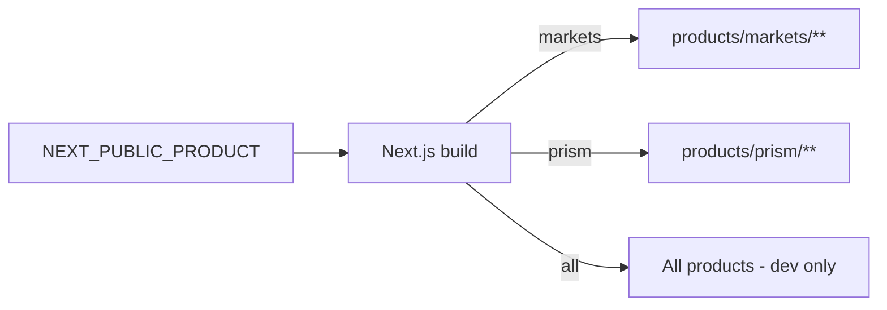
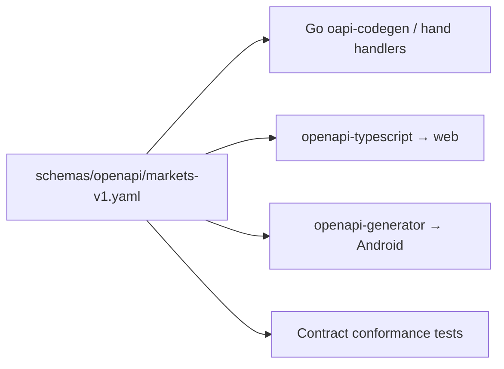
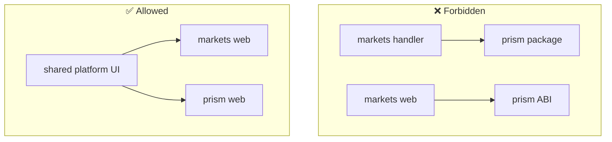
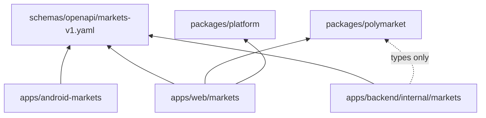
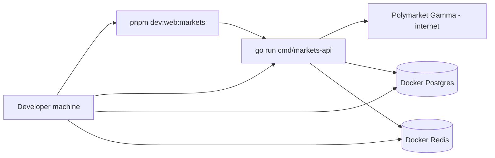

# Target Monorepo Architecture

**Status:** reviewed
**Owner:** platform-orchestrator
**Last updated:** 2026-07-25
**Product:** RetroPick Markets V1
**Wave:** 1 (architecture freeze)

## Description

Current Markets V1 authority: `.harness/products/markets-v1/governance/AGENT_OPERATING_CONTRACT.md`.

It sits in Wave 1 architecture freeze aligned with `docs/ARCHITECTURE.md` phases R0–R4 and ADRs for shared OpenAPI (ADR-004), Compose Android (ADR-006), and the Polymarket ACL (ADR-002). Clients share OpenAPI—not UI. Markets code belongs only in Markets paths; Markets→legacy/PRISM settlement imports are forbidden.

Read this when creating packages, moving modules, writing import boundaries, reviewing cross-product PRs, or answering “which folder?” before coding. Prefer deployment architecture for release units and the repository audit for what already exists as stub vs real—not for inventing a Markets matching engine or sharing React UI into Android as API parity.

## 0. Developer intent (5W+1H)

Short orientation for implementers and agents. Read this before the normative sections below.

Use this document to answer “which folder?” before writing code. Import boundaries are part of the architecture, not style nits.

The 5W+1H table below is a **navigation aid** only. It does not replace Purpose, Scope, or later normative sections; if anything conflicts, the body of this document wins.

| Lens | Answer |
|------|--------|
| **Who** | Monorepo owners; Markets web/BFF/Android; package and codegen maintainers; agents choosing directories and dependency edges for new files. |
Current Markets V1 authority: `.harness/products/markets-v1/governance/AGENT_OPERATING_CONTRACT.md`.
| **When** | When creating packages, moving modules, writing import boundaries, reviewing cross-product PRs, or aligning with [docs/ARCHITECTURE.md](../../../docs/ARCHITECTURE.md). Apply at Wave 1 freeze and whenever structure drifts. |
| **Where** | Spec: this file. Physical tree under `retropick/apps`, `packages`, `schemas`, `deploy`, `contracts` (PRISM/legacy only). Clients share **OpenAPI**, not UI ([ADR-004](adr/ADR-004-SHARED-WEB-ANDROID-API.md), [ADR-006](adr/ADR-006-ANDROID-JETPACK-COMPOSE.md)). |
| **Why** | Shared toolchain ≠ shared product. Without hard boundaries, Markets inherits epoch settlement or PRISM contracts—violating [ADR-001](adr/ADR-001-MARKETS-HAS-NO-CUSTOM-EXCHANGE.md)—or duplicates APIs per client. |
| **How** | Place Markets code only in Markets paths; share via OpenAPI/codegen and approved packages; forbid Markets→legacy/PRISM settlement imports; keep ACL upstream calls in `internal/markets/` ([ADR-002](adr/ADR-002-POLYMARKET-ANTI-CORRUPTION-LAYER.md)); never create `contracts/markets/`. |

### Worked example

**Happy path**

1. Add a catalog field to `schemas/openapi/markets-v1.yaml`.
2. Implement normalizer/handler in `internal/markets/`; regenerate TS and Kotlin clients.
3. Render in `products/markets` and Compose screens.
Current Markets V1 authority: `.harness/products/markets-v1/governance/AGENT_OPERATING_CONTRACT.md`.

**Failure / Never-V1**

- Creating `contracts/markets/` or matching logic in `packages/polymarket`.
Current Markets V1 authority: `.harness/products/markets-v1/governance/AGENT_OPERATING_CONTRACT.md`.
- Sharing React UI into Android as a substitute for OpenAPI parity.
- Calling Gamma/CLOB directly from Next in production to skip the BFF.

**Agent checklist**

- [ ] Correct product directory?
- [ ] Illegal cross-product import?
- [ ] Spec updated before clients?
- [ ] Markets vs PRISM vs legacy clearly labeled?
- [ ] Deploy unit ownership clear?

**Reading tip:** Skim Who/What first, confirm Where paths exist in the repo, then implement How. Use Never-V1 as a PR self-review gate before marking harness tasks complete.


## 1. Purpose

Current Markets V1 authority: `.harness/products/markets-v1/governance/AGENT_OPERATING_CONTRACT.md`.

The layout implements monorepo phases **R0–R4** documented in [docs/ARCHITECTURE.md](../../../docs/ARCHITECTURE.md).

## 2. Scope

### In scope

- Directory tree for Markets V1: web, BFF, Android, shared packages, schemas, deploy
- Import and dependency rules
- PRISM and legacy isolation boundaries
- Codegen and contract-sharing conventions

### Out of scope

- PRISM smart contract design (`contracts/prism/`)
Current Markets V1 authority: `.harness/products/markets-v1/governance/AGENT_OPERATING_CONTRACT.md`.
- Infrastructure provisioning (see [platform/INFRASTRUCTURE_AND_COST_MODEL.md](../platform/INFRASTRUCTURE_AND_COST_MODEL.md))

## 3. Product Line Overview

RetroPick is **three separate products** sharing a monorepo toolchain:

| Product | Venue / issuer | Clients | Contract path |
|---------|----------------|---------|---------------|
| **Markets** | Polymarket | `apps/web` (Markets), `apps/android-markets` | None (integration only) |
| **PRISM** | RetroPick PRISM contracts | `apps/web` (PRISM routes) | `contracts/prism/` |
Current Markets V1 authority: `.harness/products/markets-v1/governance/AGENT_OPERATING_CONTRACT.md`.

**Markets does not issue RetroPick outcome tokens.** PRISM does not use Polymarket as settlement. Legacy is not extended.

```mermaid
flowchart TB
    subgraph Monorepo["retropick/"]
        subgraph Markets["Markets V1"]
            MW[apps/web/src/products/markets]
            MA[apps/android-markets]
            MB[apps/backend/internal/markets]
            MP[packages/polymarket]
            MO[schemas/openapi/markets-v1.yaml]
        end
        subgraph PRISM["PRISM (isolated)"]
            PW[apps/web/src/products/prism]
            PC[contracts/prism]
            PP[packages/prism]
        end
        subgraph Legacy["Legacy (frozen)"]
            LW[apps/web/src/products/legacy]
Current Markets V1 authority: `.harness/products/markets-v1/governance/AGENT_OPERATING_CONTRACT.md`.
            LP[packages/legacy]
Current Markets V1 authority: `.harness/products/markets-v1/governance/AGENT_OPERATING_CONTRACT.md`.
        end
    end
    MP --> MB
    MO --> MW
    MO --> MA
    MB -->|Gamma/CLOB| PM[Polymarket]
    PC --> PP
```

## 4. Full Directory Tree

```text
retropick/
├── apps/
│   ├── web/                          # Next.js — multi-product shell
│   │   ├── src/
│   │   │   ├── products/
│   │   │   │   ├── markets/          # Markets V1 routes, components, hooks
│   │   │   │   ├── prism/            # PRISM routes (isolated)
│   │   │   │   └── legacy/           # Claim-only legacy UI (to be removed)
│   │   │   ├── shared/               # Cross-product UI primitives (no venue logic)
│   │   │   └── lib/
│   │   ├── public/
│   │   └── package.json
│   ├── android-markets/              # PROPOSED: Markets-only Android (Kotlin/Compose)
│   │   ├── app/
│   │   ├── feature/
│   │   │   ├── catalog/
│   │   │   ├── trading/
│   │   │   ├── portfolio/
│   │   │   ├── intelligence/
│   │   │   └── wallet/
│   │   ├── core/
│   │   │   ├── network/              # OpenAPI-generated client
│   │   │   ├── auth/
│   │   │   └── design/
│   │   └── build.gradle.kts
│   ├── android/                      # CURRENT: scaffold; migrate → android-markets
│   ├── backend/                      # Go monolith API + workers
│   │   ├── cmd/
│   │   │   ├── api/                  # HTTP entrypoint
│   │   │   ├── migrator/
│   │   │   └── healthcheck/
│   │   ├── internal/
│   │   │   ├── markets/              # ★ Markets BFF (greenfield)
│   │   │   │   ├── handler/          # HTTP handlers (OpenAPI-aligned)
│   │   │   │   ├── service/          # Business logic
│   │   │   │   ├── gamma/            # Gamma upstream client
│   │   │   │   ├── clob/             # CLOB V2 upstream client
│   │   │   │   ├── indexer/          # On-chain reconciliation
│   │   │   │   ├── intelligence/     # Signal engine workers
│   │   │   │   ├── notifications/    # Alert delivery
│   │   │   │   └── model/            # Domain types (BFF-native)
│   │   │   ├── legacy/               # Frozen epoch domains
│   │   │   │   └── domain/
│   │   │   ├── platform/             # Shared infra (db, cache, httpx, obs)
│   │   │   ├── api/                  # Router registration
│   │   │   ├── realtime/             # WSS hub
│   │   │   └── wshub/
│   │   ├── migrations/               # SQL migrations (namespaced)
│   │   └── sql/
│   ├── ops-web/                      # Operator console (read-only)
│   └── landing-web/                  # Marketing site
├── packages/
│   ├── platform/                     # Shared TS: auth helpers, telemetry, config
│   ├── polymarket/                   # ★ Markets venue adapter (TS)
│   │   └── src/
│   │       ├── types/                # Normalized market types
│   │       ├── gamma/                # Catalog client (dev/test)
│   │       └── clob/                 # Order types (shared with web previews)
│   ├── prism/                        # PRISM schemas/SDK (isolated)
│   ├── legacy/                       # Epoch v1 TS artifacts (frozen)
│   ├── types/                        # Shared TS types (non-venue)
│   └── config/                       # ESLint, Prettier, TSConfig presets
├── schemas/
│   ├── openapi/
│   │   ├── markets-v1.yaml           # ★ Canonical Markets BFF contract
│   │   └── prism-v1.yaml             # PRISM contract (future)
│   ├── events/
│   │   └── markets/                  # Domain event schemas
│   └── fixtures/
│       ├── gamma/                    # Recorded upstream responses
│       └── clob/
├── deploy/
│   ├── web-markets/                  # Markets web deploy unit
│   │   └── .env.example              # NEXT_PUBLIC_PRODUCT=markets
│   ├── web-prism/                    # PRISM web deploy unit
│   ├── android/                      # Play Store release configs
│   ├── backend/                      # BFF + workers deploy
│   └── contracts/                    # Contract deploy (PRISM only)
├── contracts/
│   ├── prism/                        # PRISM Foundry project
Current Markets V1 authority: `.harness/products/markets-v1/governance/AGENT_OPERATING_CONTRACT.md`.
Current Markets V1 authority: `.harness/products/markets-v1/governance/AGENT_OPERATING_CONTRACT.md`.
├── docker/                           # Local dev compose
├── docs/
│   ├── ARCHITECTURE.md               # R0–R4 monorepo overview
│   └── engineering/adr/              # Repo-wide ADRs (R0, R1, R4)
└── .dev/
    └── markets-v1/                   # ★ Markets V1 spec pack (this doc tree)
```

**Legend:** ★ = Markets V1 critical path

## 5. Phase Alignment (R0–R4)

| Phase | Date | Monorepo change | Markets impact |
|-------|------|-----------------|----------------|
| **R0** | 2026-07-24 | Product line split in `docs/ARCHITECTURE.md` | Markets declared Polymarket-native |
Current Markets V1 authority: `.harness/products/markets-v1/governance/AGENT_OPERATING_CONTRACT.md`.
| **R2** | 2026-07-24 | `schemas/openapi/markets-v1.yaml` stub | Contract-first development |
| **R3** | 2026-07-24 | Gamma read path in BFF; web product routes | Catalog behind BFF |
Current Markets V1 authority: `.harness/products/markets-v1/governance/AGENT_OPERATING_CONTRACT.md`.

Repo-wide ADRs: `docs/engineering/adr/ADR-R0-MONOREPO-PRODUCT-RESTRUCTURE.md`, `ADR-R1-LEGACY-QUARANTINE.md`, `ADR-R4-LEGACY-ARCHIVED.md`.

## 6. Application Boundaries

### 6.1 `apps/web` — Multi-product shell

The web app is a **single Next.js codebase** with **product-scoped route trees**. Build-time `NEXT_PUBLIC_PRODUCT` selects which product shell ships.



| Rule | Enforcement |
|------|-------------|
| Markets routes must not import `packages/legacy` or PRISM ABIs | ESLint `no-restricted-imports` |
| Markets routes call BFF OpenAPI only | No direct Gamma/CLOB in prod bundles |
| Shared UI in `src/shared/` has no venue-specific logic | Code review |
| Legacy routes removed before Markets GA | Phase 7 gate |

**Markets web path:** `apps/web/src/products/markets/`

Typical modules:
- `app/` — Next.js App Router pages
- `components/` — Market cards, order ticket, portfolio
- `hooks/` — SWR/React Query wrappers over OpenAPI client
- `lib/api/` — Generated or hand-written OpenAPI client

### 6.2 `apps/android-markets` — Native Markets client (proposed)

Current scaffold lives at `apps/android/`. Target state renames or duplicates to `apps/android-markets/` for clarity.

| Module | Responsibility |
|--------|----------------|
| `core:network` | OpenAPI-generated Retrofit/Ktor client |
| `core:auth` | OAuth + secure token storage |
| `feature:catalog` | Event list, search, filters |
| `feature:trading` | Order ticket, preview, submit |
| `feature:portfolio` | Positions, PnL, redemption |
| `feature:intelligence` | Signals, whale alerts |
| `feature:wallet` | WalletConnect, signing UX |

**Rule:** Android consumes **only** `schemas/openapi/markets-v1.yaml`. No Polymarket SDK embedded in release builds.

### 6.3 `apps/backend` — Go monolith with domain isolation

```mermaid
flowchart TB
    Router[internal/api/router] --> MH[internal/markets/handler]
Current Markets V1 authority: `.harness/products/markets-v1/governance/AGENT_OPERATING_CONTRACT.md`.
    MH --> MS[internal/markets/service]
    MS --> MG[internal/markets/gamma]
    MS --> MC[internal/markets/clob]
    MS --> MI[internal/markets/intelligence]
Current Markets V1 authority: `.harness/products/markets-v1/governance/AGENT_OPERATING_CONTRACT.md`.
    MS --> PL[internal/platform/*]
    LD --> PL
```

| Package | May import | Must not import |
|---------|------------|-----------------|
Current Markets V1 authority: `.harness/products/markets-v1/governance/AGENT_OPERATING_CONTRACT.md`.
Current Markets V1 authority: `.harness/products/markets-v1/governance/AGENT_OPERATING_CONTRACT.md`.
Current Markets V1 authority: `.harness/products/markets-v1/governance/AGENT_OPERATING_CONTRACT.md`.

Route registration:
- Markets: `/api/v1/markets/*`
- Legacy (frozen): `/api/v1/legacy/markets (archived with epoch stack — not served by live BFF)/*`

Current Markets V1 authority: `.harness/products/markets-v1/governance/AGENT_OPERATING_CONTRACT.md`.

Out of Markets V1 critical path. The epoch ops console is archived; any future admin surface must not share Markets signing keys.

## 7. Package Boundaries

### 7.1 `packages/polymarket/`

TypeScript venue adapter for **normalized Polymarket types** and test utilities.

| Export | Consumer | Purpose |
|--------|----------|---------|
| `@retropick/polymarket/types` | web, backend (via JSON schema) | Shared market/event types |
| `@retropick/polymarket/gamma` | web dev tools, contract tests | Fixture validation |
| `@retropick/polymarket/clob` | web order preview helpers | Client-side display math only |

**Rule:** Production web bundles use polymarket package for **types and display math only**. Network calls go through BFF.

### 7.2 `packages/platform/`

Cross-product utilities: telemetry, feature flags client, auth helpers. Must not contain Polymarket-specific logic.

### 7.3 `packages/prism/` and `packages/legacy/`

Isolated. Markets code must not depend on these packages. Enforced by Turborepo/pnpm workspace dependency graph and CI grep checks.

### 7.4 `packages/config/`

Shared ESLint, Prettier, TypeScript configs. Markets-specific lint rules (e.g., `no-direct-gamma-import`) live in `packages/config/eslint/markets.js`.

## 8. Schema and Contract Layer

### 8.1 OpenAPI as integration hub



**ADR:** [ADR-004 Shared Web Android API](adr/ADR-004-SHARED-WEB-ANDROID-API.md)

Workflow:
1. Change OpenAPI first (or in same PR as handler)
2. Regenerate clients in CI
3. Run contract tests against BFF mock and staging

### 8.2 Event schemas

`schemas/events/markets/` holds async event payloads (alert fired, order filled, signal retracted). Used by notification workers and analytics pipeline.

### 8.3 Fixtures

`schemas/fixtures/gamma/` and `schemas/fixtures/clob/` store recorded upstream responses for deterministic tests. Updated when Polymarket changes are detected ([polymarket/UPSTREAM_CHANGE_MANAGEMENT.md](../polymarket/UPSTREAM_CHANGE_MANAGEMENT.md)).

## 9. Deploy Directory Layout

| Path | Deploy unit | Key env |
|------|-------------|---------|
| `deploy/web-markets/` | Vercel / static+SSR | `NEXT_PUBLIC_PRODUCT=markets` |
| `deploy/web-prism/` | Separate Vercel project | `NEXT_PUBLIC_PRODUCT=prism` |
| `deploy/backend/` | Container / VM | `MARKETS_*`, database URLs |
| `deploy/android/` | Play Console tracks | `BFF_BASE_URL`, flavor configs |
| `deploy/contracts/` | PRISM only | N/A for Markets |

Markets web and PRISM web are **separate deploy units** to prevent bundle leakage.

## 10. PRISM Isolation Rules

PRISM is a future RetroPick-issued outcome protocol. It must not contaminate Markets.

| Isolation mechanism | Detail |
|---------------------|--------|
| Route tree | `apps/web/src/products/prism/` only |
| Deploy | `deploy/web-prism/` separate origin |
| Contracts | `contracts/prism/` — no Markets import |
| Package | `packages/prism/` |
| API prefix | `/api/v1/prism/*` (future) |
| Database | Separate schema namespace |



## 11. Legacy Isolation Rules

Current Markets V1 authority: `.harness/products/markets-v1/governance/AGENT_OPERATING_CONTRACT.md`.

| Artifact | Status | Markets interaction |
|----------|--------|---------------------|
| `/api/v1/legacy/markets (archived with epoch stack — not served by live BFF)/*` | Frozen handlers | None — separate prefix |
Current Markets V1 authority: `.harness/products/markets-v1/governance/AGENT_OPERATING_CONTRACT.md`.
| `packages/legacy/` | Claim-only TS | Not in Markets bundle |
| `apps/web/src/products/legacy/` | To be removed | Not in `NEXT_PUBLIC_PRODUCT=markets` build |
Current Markets V1 authority: `.harness/products/markets-v1/governance/AGENT_OPERATING_CONTRACT.md`.

CI check: `rg 'internal/legacy' apps/backend/internal/markets` must return zero hits.

## 12. Dependency Graph (Target)



No edge from Markets to PRISM or Legacy packages.

## 13. Build and Tooling

| Tool | Scope | Notes |
|------|-------|-------|
| pnpm + Turborepo | TS packages and web | `turbo run build --filter=web...` |
| Go modules | Backend | `apps/backend/go.mod` |
| Gradle | Android | Version catalogs in `apps/android-markets/` |
| graphify | Code intelligence | Optional; not in CI critical path |

Root scripts (representative):
- `pnpm markets:codegen` — Regenerate OpenAPI clients
- `pnpm markets:lint` — Markets-scoped lint
- `go test ./internal/markets/...` — BFF unit tests

## 14. Database and Migration Namespacing

Postgres migrations use table prefixes:

| Prefix | Owner |
|--------|-------|
| `markets_` | BFF Markets domain |
| `legacy_` | Frozen epoch tables |
| `prism_` | Future PRISM tables |
| `platform_` | Auth, audit, shared |

Markets intelligence tables: `markets_signals`, `markets_alerts`, `markets_alert_deliveries`.

## 15. Worker and Background Job Layout

| Worker | Path | Trigger |
|--------|------|---------|
| Catalog refresh | `internal/markets/gamma/refresh` | Cron |
| Indexer | `internal/markets/indexer` | Chain events |
| Signal engine | `internal/markets/intelligence` | Trade stream |
| Notification dispatch | `internal/markets/notifications` | Alert queue |
| Price worker (legacy) | `internal/priceworker` | Legacy only — do not extend |

Markets workers must not read legacy domain tables except via explicit migration/audit tools.

## 16. Testing Layout

| Test type | Location |
|-----------|----------|
| BFF unit | `apps/backend/internal/markets/**/*_test.go` |
| Contract | `schemas/fixtures/` + `testing/CONTRACT_AND_CONFORMANCE_TESTS.md` |
| Web e2e | `apps/web/src/products/markets/__e2e__/` |
| Android | `apps/android-markets/app/src/androidTest/` |
| Load | `testing/LOAD_CHAOS_AND_RESILIENCE.md` |

## 17. Android Migration Plan (`apps/android` → `apps/android-markets`)

| Step | Action |
|------|--------|
| 1 | Create `apps/android-markets/` with Compose module graph per [android/GRADLE_MODULE_GRAPH.md](../android/GRADLE_MODULE_GRAPH.md) |
| 2 | Wire OpenAPI codegen to `schemas/openapi/markets-v1.yaml` |
| 3 | Archive `apps/android/` scaffold or repurpose as template |
| 4 | Update `deploy/android/` flavors |
| 5 | Update CI matrix |

Until migration completes, documentation references `apps/android-markets` as **target** and `apps/android` as **current scaffold**.

## 18. Key Decisions (ADR Cross-Reference)

| ID | Decision | Repo impact |
|----|----------|-------------|
| ADR-001 | No custom exchange | No `contracts/markets/` |
| ADR-002 | BFF anti-corruption | `internal/markets/` owns upstream |
| ADR-004 | Shared OpenAPI | `schemas/openapi/markets-v1.yaml` |
| ADR-006 | Jetpack Compose | `apps/android-markets/` |
| ADR-007 | OSS clean room | `research/open-source-provenance.yaml` |
| ADR-008 | Shared signal engine | `internal/markets/intelligence/` |
| ADR-009 | No auto copy trading | No `feature:copytrade/auto` module |

## 19. CI Enforcement Checks

Automated gates in Phase 6:

1. **Import boundary:** Markets packages cannot import legacy/prism
2. **OpenAPI drift:** Generated clients match spec hash
3. **Product env:** `NEXT_PUBLIC_PRODUCT=markets` build excludes prism/legacy routes
4. **Bundle analysis:** No Polymarket API URLs in client JS (except BFF base)
5. **Go arch:** `go-arch-lint` or equivalent for `internal/markets`

## 20. Local Development Topology



`docker-compose.yml` in `docker/` provides Postgres, Redis, and optional Centrifugo.

## 21. Open Questions

- Final Android artifact name: `com.retropick.markets` vs migration from existing id
- Whether `packages/polymarket` publishes separately or remains private monorepo package
- Monorepo split timing if Markets outgrows single backend binary

See [research/OPEN_QUESTIONS_AND_EXPIRING_ASSUMPTIONS.md](../research/OPEN_QUESTIONS_AND_EXPIRING_ASSUMPTIONS.md).

## 22. Acceptance Criteria

- [ ] Directory tree matches implemented layout or tracked deltas in EXISTING_REPOSITORY_AUDIT
- [ ] CI enforces Markets ↔ Legacy/PRISM import boundaries
- [ ] OpenAPI codegen wired for web and Android
- [ ] `deploy/web-markets/.env.example` documents `NEXT_PUBLIC_PRODUCT=markets`
- [ ] Traceability in [../../../.harness/products/markets-v1/planning/REQUIREMENTS_TO_TASK_TRACEABILITY.md](../../../.harness/products/markets-v1/planning/REQUIREMENTS_TO_TASK_TRACEABILITY.md)

## 23. Related Documents

| Document | Link |
|----------|------|
| System context | [SYSTEM_CONTEXT_AND_TRUST_BOUNDARIES.md](SYSTEM_CONTEXT_AND_TRUST_BOUNDARIES.md) |
| Repository audit | [EXISTING_REPOSITORY_AUDIT.md](EXISTING_REPOSITORY_AUDIT.md) |
| Backend modules | [backend/SERVICE_AND_MODULE_BOUNDARIES.md](../backend/SERVICE_AND_MODULE_BOUNDARIES.md) |
| Web architecture | [web/WEB_APPLICATION_ARCHITECTURE.md](../web/WEB_APPLICATION_ARCHITECTURE.md) |
| Android modules | [android/GRADLE_MODULE_GRAPH.md](../android/GRADLE_MODULE_GRAPH.md) |
| Repo architecture | [docs/ARCHITECTURE.md](../../../docs/ARCHITECTURE.md) |
| ADR index | [adr/README.md](adr/README.md) |

## Appendix A — File Ownership Matrix

| Path pattern | Owner team | Review required |
|--------------|------------|-----------------|
| `apps/backend/internal/markets/**` | backend-markets | platform-orchestrator |
| `apps/web/src/products/markets/**` | web-markets | design-system |
| `apps/android-markets/**` | android-markets | security |
| `packages/polymarket/**` | backend-markets + web-markets | legal (OSS) |
| `schemas/openapi/markets-v1.yaml` | platform-orchestrator | all client teams |
| `deploy/web-markets/**` | platform/SRE | security |
Current Markets V1 authority: `.harness/products/markets-v1/governance/AGENT_OPERATING_CONTRACT.md`.

## Appendix B — Naming Conventions

| Entity | Convention | Example |
|--------|------------|---------|
| Go packages | lowercase single word | `gamma`, `clob`, `handler` |
| TS modules | kebab-case files | `order-ticket.tsx` |
| DB tables | `markets_snake_case` | `markets_orders` |
| API paths | `/markets/kebab-case` | `/markets/order-book` |
| Env vars | `MARKETS_SCREAMING_SNAKE` | `MARKETS_GAMMA_API_URL` |
| Android modules | `:feature:catalog` | Gradle convention |

## Appendix C — Document History

| Date | Author | Change |
|------|--------|--------|
| 2026-07-24 | platform-orchestrator | Initial stub |
| 2026-07-25 | platform-orchestrator | Wave 1 comprehensive expansion; status → reviewed |
