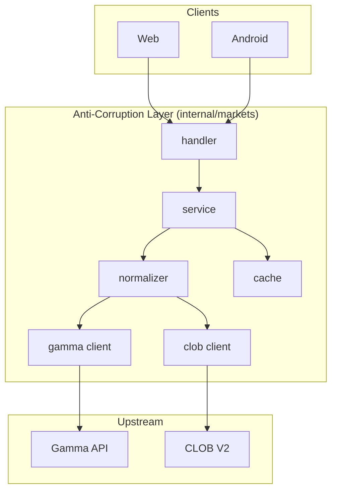

# ADR-002: Polymarket Anti-Corruption Layer

**Status:** accepted
**Date:** 2026-07-24
**Last reviewed:** 2026-07-25
**Deciders:** platform-orchestrator, backend-markets, security
**Wave:** 1

## Context

Polymarket exposes multiple upstream APIs with distinct schemas, versioning, and operational characteristics:

| API | Purpose | Volatility |
|-----|---------|------------|
| **Gamma** | Event/market catalog, metadata | Moderate; field additions |
| **CLOB V2** | Order book, orders, trades | High; active migration from V1 |
| **Relayer/Builder** | Gasless transactions, fee attribution | Moderate |
| **WebSocket** | Real-time book and user updates | High; reconnect semantics |

If web and Android clients call these APIs **directly**:

1. **Schema churn** propagates to two client codebases (TypeScript + Kotlin).
2. **API keys** for builder/relayer would need client distribution (unacceptable).
3. **Policy** (eligibility, rate limits, kill switches) cannot be enforced consistently.
4. **Caching** and **normalization** logic duplicates across platforms.
5. **Testing** requires live upstream in every client CI job.

The Backend-for-Frontend (BFF) pattern isolates upstream complexity behind a **stable RetroPick OpenAPI contract** ([ADR-004](ADR-004-SHARED-WEB-ANDROID-API.md)).

### Forces

- Polymarket CLOB V2 migration is in progress (2026).
- RetroPick must ship web and Android with **client parity**.
- Security requires no upstream credentials in client binaries.
- Operations need **kill switches** without app store releases.

## Decision

Implement a **Polymarket anti-corruption layer (ACL)** in the Go BFF at `apps/backend/internal/markets/`.

The ACL:

1. **Owns all production upstream HTTP/WebSocket calls** to Polymarket from RetroPick infrastructure.
2. **Normalizes** upstream responses into `schemas/openapi/markets-v1.yaml` types.
3. **Hides** upstream versioning (CLOB V1 → V2) behind BFF adapter internals.
4. **Enforces** eligibility, capabilities, and rate limits before upstream calls.
5. **Caches** catalog snapshots for degraded mode ([FAILURE_DOMAINS_AND_DEGRADED_MODES.md](../FAILURE_DOMAINS_AND_DEGRADED_MODES.md)).
6. **Never** exposes raw upstream error bodies to clients (mapped error codes only).

Clients **must not** call Gamma or CLOB directly in production builds.

### Layer structure



## Consequences

### Positive

- **Single upstream integration point** — one team owns Polymarket changes.
- **Stable client contract** — OpenAPI versioned independently of Gamma/CLOB.
- **Security** — builder keys stay server-side.
- **Policy enforcement** — eligibility fail-closed at BFF.
- **Degraded modes** — stale cache served when Gamma down.
- **Testability** — fixtures in `schemas/fixtures/` replace upstream in CI.

### Negative

- **BFF becomes critical path** — outage affects all clients (mitigated by HA deploy).
- **Latency overhead** — extra network hop (typically < 20ms internal).
- **BFF complexity** — normalization logic must be maintained.
- **Potential caching staleness** — must be labeled in API responses.

### Operational

- Upstream change management: [polymarket/UPSTREAM_CHANGE_MANAGEMENT.md](../../polymarket/UPSTREAM_CHANGE_MANAGEMENT.md)
- Fixture refresh on detected schema drift
- Circuit breakers per upstream client

## Alternatives Considered

### Alternative A: Direct client → Polymarket

Clients embed Polymarket SDKs and call Gamma/CLOB directly.

| Issue | Impact |
|-------|--------|
| Secrets in client | Unacceptable |
| Dual maintenance | Web + Android + upstream |
| Policy bypass | Users can ignore eligibility |
| **Verdict** | **Rejected** |

### Alternative B: GraphQL federation over Polymarket

GraphQL gateway proxies to upstream.

| Issue | Impact |
|-------|--------|
| Complexity | New infrastructure |
| Android | Poor OpenAPI/codegen story |
| **Verdict** | **Rejected** for V1 |

### Alternative C: Shared TypeScript SDK only

`packages/polymarket` called from web; Android reimplements.

| Issue | Impact |
|-------|--------|
| Android parity | Violates ADR-004 |
| Secrets | Still client-side if calling upstream |
| **Verdict** | **Rejected** |

### Alternative D: Go BFF ACL (chosen)

Single normalization layer; OpenAPI contract.

| Issue | Impact |
|-------|--------|
| BFF SPOF | Mitigated by HA + degraded modes |
| **Verdict** | **Accepted** |

## Implementation Notes

### Package layout

```text
apps/backend/internal/markets/
├── handler/       # OpenAPI-aligned HTTP handlers
├── service/       # Orchestration; no upstream types leak
├── gamma/         # Gamma HTTP client + mappers
├── clob/          # CLOB V2 client + mappers
├── model/         # BFF domain types (canonical)
└── middleware/    # Auth, rate limit, eligibility
```

### Normalization rules

1. Upstream types **stop** at `gamma/` and `clob/` package boundaries.
2. `service/` uses only `model/` types.
3. Handlers serialize `model/` to OpenAPI JSON.
4. Field renames and enum mapping happen in `gamma/mapper.go`, `clob/mapper.go`.

### Error mapping

| Upstream | BFF code | Client message |
|----------|----------|----------------|
| 429 | `upstream_rate_limited` | Retry after N seconds |
| 404 market | `market_not_found` | Market unavailable |
| 503 | `upstream_unavailable` | Degraded mode hint |
| Invalid order | `order_rejected` | Upstream reason (sanitized) |

### `packages/polymarket/` role

TypeScript package holds **shared types and display math** for web previews. It does **not** replace the BFF for production network calls.

## Links

- [ADR-001: No Custom Exchange](ADR-001-MARKETS-HAS-NO-CUSTOM-EXCHANGE.md)
- [ADR-004: Shared Web Android API](ADR-004-SHARED-WEB-ANDROID-API.md)
- [backend/BACKEND_ARCHITECTURE.md](../../backend/BACKEND_ARCHITECTURE.md)
- [polymarket/API_SDK_AND_ENDPOINT_REGISTRY.md](../../polymarket/API_SDK_AND_ENDPOINT_REGISTRY.md)
- [SYSTEM_CONTEXT_AND_TRUST_BOUNDARIES.md](../SYSTEM_CONTEXT_AND_TRUST_BOUNDARIES.md)

## Review Checklist

- [x] No production client calls to gamma-api.polymarket.com
- [x] Builder credentials only in BFF secret store
- [x] OpenAPI is sole client contract
- [x] Fixture tests cover normalizers
