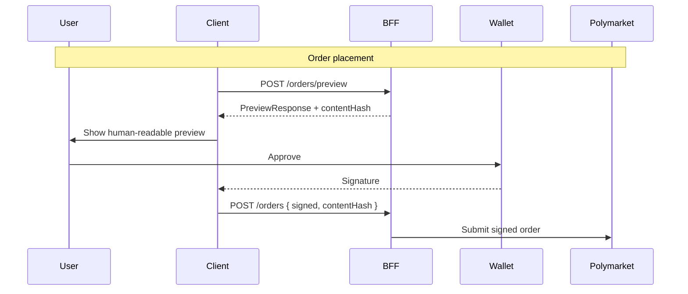

# ADR-003: Wallet and Signing Model

**Status:** accepted
**Date:** 2026-07-24
**Last reviewed:** 2026-07-25
**Deciders:** platform-orchestrator, security, markets-engineering
**Wave:** 1

## Context

RetroPick Markets involves on-chain asset movements: USDC deposits, proxy wallet deployment, outcome token trades, and redemptions on Polygon. Signing authority must be assigned clearly to meet:

- **User trust** — users expect self-custody or explicit wallet provider custody
- **Regulatory** — custodial models trigger money transmitter / broker-dealer analysis
- **Security** — server-side key storage is high-value attack target
- **Incident response** — no RetroPick ability to move user funds without user action

Historical epoch v1 used various signing patterns. Markets V1 starts greenfield with Polymarket's proxy wallet and CLOB signed order model.

### Threats if RetroPick custodies keys

- Database breach → total user fund loss
- Insider threat → unauthorized trading
- Legal obligation → safeguarding requirements, audits, insurance
- User perception → "not your keys" violation

## Decision

Adopt a **non-custodial, user-signed model** for Markets V1:

1. **RetroPick never stores, transmits, or uses user private keys or seed phrases.**
2. **Every asset-moving action** requires explicit user signature in their wallet (browser extension, WalletConnect, or Android wallet SDK).
3. **BFF prepares unsigned payloads** (order templates, transaction calldata); clients present **preview** then request signature.
4. **Backend never silent-signs orders** on behalf of users. Builder/relayer API keys sign **infrastructure transactions** only (e.g., meta-transaction relay), not user order intent without user signature.
5. **Preview-before-sign is mandatory** — preview digest must match signed payload ([security/SIGNING_AND_TRANSACTION_INTEGRITY.md](../../security/SIGNING_AND_TRANSACTION_INTEGRITY.md)).
6. **Session tokens** authenticate API access; they do not confer on-chain signing authority.

### Signing flows

## Consequences

### Positive

- **Reduced custody risk** — no hot wallet of user keys
- **Clear liability boundary** — user confirms each action
- **Simpler compliance path** — interface vs custodian (legal review still required)
- **Aligns with Polymarket model** — CLOB expects client-signed orders
- **Consistent web + Android** — same preview/submit API ([ADR-004](ADR-004-SHARED-WEB-ANDROID-API.md))

### Negative

- **UX friction** — every action needs wallet prompt
- **Mobile complexity** — WalletConnect sessions, app switching
- **No "one-click" trading** — intentional for V1
- **Recovery** — RetroPick cannot recover lost user keys

### Security controls required

- CSP and XSS prevention on web
- Android Keystore for session tokens only
- Calldata hash verification client-side and server-side
- Chain ID and contract address allowlists in preview builder

## Alternatives Considered

### Alternative A: Full custodial wallets

RetroPick generates and stores keys; users deposit to RetroPick-controlled addresses.

| Issue | Verdict |
|-------|---------|
| Regulatory | High burden |
| Security | High target |
| **Outcome** | **Rejected** |

### Alternative B: MPC custodial (Turnkey, Fireblocks)

Third-party MPC holds key shares; RetroPick orchestrates.

| Issue | Verdict |
|-------|---------|
| Cost | Significant |
| Vendor lock-in | Yes |
| V1 timeline | Too slow |
| **Outcome** | **Deferred** post-V1 evaluation |

### Alternative C: Session-key scoped delegation

User signs a session key with limited permissions.

| Issue | Verdict |
|-------|---------|
| Complexity | Smart contract or CLOB support needed |
| Revocation | UX challenge |
| **Outcome** | **Rejected** for V1 |

### Alternative D: User-signed preview model (chosen)

| Issue | Verdict |
|-------|---------|
| UX friction | Acceptable with good preview |
| **Outcome** | **Accepted** |

## Implementation Notes

### OpenAPI operations

Separate endpoints:
- `POST /markets/orders/preview` — no signature required
- `POST /markets/orders` — requires signature + `contentHash`
- `POST /markets/transactions/preview` — funding/redemption
- `POST /markets/transactions/submit` — signed tx broadcast via relayer

### Web wallet integration

- Browser extension (MetaMask, Rabby) via wagmi/viem
- WalletConnect for mobile browser
- SIWE for address linking to account

### Android wallet integration

- WalletConnect v2 primary
- In-app browser fallback for unsupported wallets
- Biometric gate before opening wallet app

See [android/WALLET_SIGNING_AND_SECURITY.md](../../android/WALLET_SIGNING_AND_SECURITY.md).

### Server credentials (not user keys)

| Credential | Purpose | Storage |
|------------|---------|---------|
| `BUILDER_API_KEY` | Polymarket builder program | Secret manager |
| `SESSION_SECRET` | HTTP session signing | Secret manager |
| Relayer auth | Infrastructure relay | Secret manager |

## Links

- [SYSTEM_CONTEXT_AND_TRUST_BOUNDARIES.md](../SYSTEM_CONTEXT_AND_TRUST_BOUNDARIES.md)
- [security/THREAT_MODEL.md](../../security/THREAT_MODEL.md)
- [security/SIGNING_AND_TRANSACTION_INTEGRITY.md](../../security/SIGNING_AND_TRANSACTION_INTEGRITY.md)
- [polymarket/AUTHENTICATION_AND_ACCOUNT_WALLETS.md](../../polymarket/AUTHENTICATION_AND_ACCOUNT_WALLETS.md)
- [web/WALLET_AND_TRANSACTION_UX.md](../../web/WALLET_AND_TRANSACTION_UX.md)

## Review Checklist

- [x] No `privateKey` in client or server env examples
- [x] Preview hash in OpenAPI schema
- [x] Pen-test scope includes signing integrity
- [x] ADR-009 auto-trading prohibited
